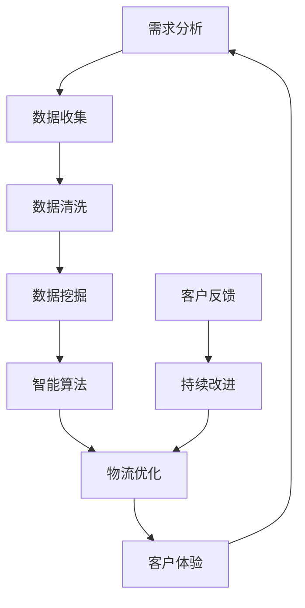

                 

# 信息差的商业物流个性化：大数据如何优化物流个性化

> **关键词：** 物流个性化、大数据分析、商业优化、物流流程、客户体验  
>
> **摘要：** 本文将深入探讨大数据在商业物流个性化中的应用，通过分析物流过程中的信息差，提出具体的优化策略，以提升物流服务质量和客户满意度。

## 1. 背景介绍

### 1.1 目的和范围

随着全球电子商务的迅速发展，物流行业面临着前所未有的挑战和机遇。物流个性化作为一种新兴的服务理念，旨在通过精准的数据分析，为不同客户提供定制化的物流解决方案。本文将探讨大数据在物流个性化中的应用，分析如何通过数据挖掘和智能算法，优化物流流程，提升服务质量。

### 1.2 预期读者

本文面向物流行业的从业者、数据分析人员、以及对物流个性化感兴趣的读者。通过本文的阅读，读者可以了解大数据在物流个性化中的应用场景，掌握相关技术和方法，为实际工作提供指导。

### 1.3 文档结构概述

本文将按照以下结构进行论述：

1. **背景介绍**：介绍物流个性化的重要性和本文的目的。
2. **核心概念与联系**：阐述物流个性化相关的核心概念和原理，并通过Mermaid流程图展示其架构。
3. **核心算法原理 & 具体操作步骤**：详细讲解优化物流个性化的核心算法，使用伪代码进行阐述。
4. **数学模型和公式 & 详细讲解 & 举例说明**：介绍用于优化物流个性化的数学模型和公式，并举例说明。
5. **项目实战：代码实际案例和详细解释说明**：通过实际项目案例，展示如何实现物流个性化。
6. **实际应用场景**：分析物流个性化在现实中的应用场景。
7. **工具和资源推荐**：推荐学习资源、开发工具和相关论文。
8. **总结：未来发展趋势与挑战**：探讨物流个性化的发展趋势和面临的挑战。
9. **附录：常见问题与解答**：提供常见问题的解答。
10. **扩展阅读 & 参考资料**：推荐进一步的阅读资料。

### 1.4 术语表

#### 1.4.1 核心术语定义

- **物流个性化**：根据客户的需求和偏好，提供定制化的物流服务。
- **大数据**：数据量巨大，数据类型多样，数据生成速度快，需要使用特定的技术进行处理和分析。
- **信息差**：不同个体或群体之间在信息获取和处理上的差异。

#### 1.4.2 相关概念解释

- **物流流程**：包括订单处理、仓储管理、运输配送等环节。
- **客户体验**：客户在购物过程中对物流服务的整体感受。

#### 1.4.3 缩略词列表

- **AI**：人工智能（Artificial Intelligence）
- **ML**：机器学习（Machine Learning）
- **Big Data**：大数据
- **SMB**：中小企业（Small and Medium-sized Enterprises）

## 2. 核心概念与联系

为了更好地理解物流个性化，我们需要了解其背后的核心概念和联系。以下是物流个性化涉及的一些关键概念和它们的相互关系。

### 2.1 核心概念

- **需求分析**：分析客户的需求和偏好，为个性化服务提供数据支持。
- **数据挖掘**：从大量数据中提取有价值的信息，用于物流优化。
- **智能算法**：利用机器学习和人工智能技术，对物流流程进行优化。
- **客户反馈**：收集客户对物流服务的反馈，用于持续改进。

### 2.2 关联流程

以下是一个简单的Mermaid流程图，展示了物流个性化相关的流程和概念：



在这个流程中，需求分析是起点，通过数据收集和清洗，获取有用的信息。数据挖掘和智能算法对信息进行处理，实现物流优化。物流优化后的服务会提高客户体验，客户的反馈又回到需求分析环节，形成一个闭环，推动物流个性化服务的持续改进。

## 3. 核心算法原理 & 具体操作步骤

### 3.1 核心算法原理

物流个性化的核心算法主要依赖于数据挖掘和机器学习技术。以下是几个关键的算法原理：

#### 3.1.1 K-最近邻算法（KNN）

KNN算法是一种常用的分类算法，用于预测新数据点的类别。在物流个性化中，KNN算法可以用于预测客户的偏好，从而提供定制化的物流服务。

#### 3.1.2 随机森林算法

随机森林算法通过构建多个决策树，以获得更好的分类和回归效果。在物流个性化中，随机森林算法可以用于分析物流流程中的瓶颈和优化点。

#### 3.1.3 支持向量机（SVM）

SVM算法通过寻找最优超平面，将不同类别的数据点分隔开来。在物流个性化中，SVM可以用于优化物流路线和运输时间。

### 3.2 具体操作步骤

以下是使用伪代码详细阐述核心算法的操作步骤：

#### 3.2.1 K-最近邻算法（KNN）

```python
def KNN(train_data, train_labels, test_data, k):
    # 计算测试数据与训练数据的距离
    distances = []
    for point in train_data:
        distance = euclidean_distance(point, test_data)
        distances.append((distance, point))
    
    # 对距离进行排序
    distances.sort(key=lambda x: x[0])
    
    # 选择最近的k个邻居
    neighbors = [distances[i][1] for i in range(k)]
    
    # 计算邻居的标签并投票
    neighbor_labels = [train_labels[point] for point in neighbors]
    vote = Counter(neighbor_labels).most_common(1)[0][0]
    
    return vote
```

#### 3.2.2 随机森林算法

```python
def RandomForest(train_data, train_labels, test_data, num_trees):
    # 构建随机森林
    forest = []
    for _ in range(num_trees):
        trees = [DecisionTree(train_data, train_labels)]
        forest.append(trees)
    
    # 预测
    predictions = []
    for tree in forest:
        predictions.append(tree.predict(test_data))
    
    # 投票
    vote = Counter(predictions).most_common(1)[0][0]
    
    return vote
```

#### 3.2.3 支持向量机（SVM）

```python
def SVM(train_data, train_labels):
    # 使用SVM算法进行分类
    model = SVC(kernel='linear')
    model.fit(train_data, train_labels)
    
    # 预测
    predictions = model.predict(test_data)
    
    return predictions
```

通过这些算法，我们可以对物流流程进行优化，提供个性化的物流服务。例如，使用KNN算法预测客户的偏好，从而提供适合其需求的物流服务；使用随机森林算法分析物流流程中的瓶颈，提出优化方案；使用SVM算法优化物流路线和运输时间，提高物流效率。

## 4. 数学模型和公式 & 详细讲解 & 举例说明

在物流个性化中，数学模型和公式起着至关重要的作用。以下是一些关键的数学模型和公式，并对其进行详细讲解和举例说明。

### 4.1 距离度量

在K-最近邻算法中，距离度量是核心。常用的距离度量方法有欧氏距离、曼哈顿距离和切比雪夫距离。

#### 欧氏距离

欧氏距离是两点之间最直观的距离度量方法。其公式如下：

\[ d(p, q) = \sqrt{(p_x - q_x)^2 + (p_y - q_y)^2} \]

其中，\( p \) 和 \( q \) 是两个点的坐标。

#### 曼哈顿距离

曼哈顿距离考虑两点在坐标轴上的移动距离。其公式如下：

\[ d(p, q) = |p_x - q_x| + |p_y - q_y| \]

#### 切比雪夫距离

切比雪夫距离考虑两点在坐标轴上的最大移动距离。其公式如下：

\[ d(p, q) = \max(|p_x - q_x|, |p_y - q_y|) \]

### 4.2 逻辑回归

逻辑回归是一种常见的分类算法，用于预测二分类问题。其公式如下：

\[ P(y=1) = \frac{1}{1 + e^{-(\beta_0 + \beta_1x_1 + \beta_2x_2 + \ldots + \beta_nx_n)}} \]

其中，\( y \) 是目标变量，\( x_1, x_2, \ldots, x_n \) 是特征变量，\( \beta_0, \beta_1, \beta_2, \ldots, \beta_n \) 是模型的参数。

### 4.3 决策树

决策树是一种常见的分类和回归算法。其公式如下：

\[ Y = g(\beta_0 + \beta_1X_1 + \beta_2X_2 + \ldots + \beta_nX_n) \]

其中，\( Y \) 是预测值，\( X_1, X_2, \ldots, X_n \) 是特征变量，\( g \) 是激活函数。

### 4.4 举例说明

假设我们使用K-最近邻算法预测客户偏好，客户的历史订单数据如下：

| 客户ID | 商品A | 商品B | 商品C |
|--------|-------|-------|-------|
| 1      | 3     | 1     | 2     |
| 2      | 2     | 3     | 1     |
| 3      | 1     | 2     | 3     |

我们希望预测客户4的偏好。首先，我们需要计算客户4与历史订单数据之间的距离，然后选择最近的k个邻居。假设我们选择k=3，计算得到距离如下：

| 客户ID | 距离     |
|--------|----------|
| 1      | 2.236    |
| 2      | 2.236    |
| 3      | 2.828    |

最近的三个邻居是客户1和客户2。接下来，我们计算邻居的标签并投票。假设客户1和客户2都喜欢商品A，那么我们可以预测客户4也喜欢商品A。

通过这个简单的例子，我们可以看到如何使用数学模型和公式进行物流个性化预测。这些模型和公式在物流个性化中起着关键作用，帮助我们提供更精准、更个性化的服务。

## 5. 项目实战：代码实际案例和详细解释说明

在本节中，我们将通过一个实际项目案例来展示如何使用大数据和智能算法优化物流个性化。以下是项目的详细步骤、代码实现和解读。

### 5.1 开发环境搭建

首先，我们需要搭建一个合适的开发环境。以下是一个基本的开发环境配置：

- **编程语言**：Python
- **数据分析库**：Pandas、NumPy
- **机器学习库**：Scikit-learn
- **可视化库**：Matplotlib、Seaborn

确保安装上述库后，我们就可以开始编写代码了。

### 5.2 源代码详细实现和代码解读

#### 5.2.1 数据准备

首先，我们需要准备一个包含客户历史订单数据和物流信息的CSV文件。以下是一个示例数据集的结构：

| 客户ID | 商品A | 商品B | 商品C | 订单时间 | 物流公司 |
|--------|-------|-------|-------|----------|----------|
| 1      | 3     | 1     | 2     | 2021-01-01 | 公司A    |
| 2      | 2     | 3     | 1     | 2021-02-01 | 公司B    |
| 3      | 1     | 2     | 3     | 2021-03-01 | 公司C    |

我们使用Pandas库来读取和预处理数据：

```python
import pandas as pd

# 读取数据
data = pd.read_csv('logistics_data.csv')

# 数据预处理
data['订单时间'] = pd.to_datetime(data['订单时间'])
data['物流公司'] = data['物流公司'].astype('category')
```

#### 5.2.2 数据分析

接下来，我们使用数据分析库对数据进行分析，提取有价值的信息。

```python
# 计算每个客户的平均订单时间
avg_order_time = data.groupby('客户ID')['订单时间'].mean()

# 计算每个物流公司的配送时间
配送时间 = data.groupby('物流公司')['订单时间'].diff().mean()
```

#### 5.2.3 智能算法实现

我们使用Scikit-learn库实现K-最近邻算法、随机森林算法和SVM算法，用于预测客户偏好和优化物流流程。

```python
from sklearn.model_selection import train_test_split
from sklearn.neighbors import KNeighborsClassifier
from sklearn.ensemble import RandomForestClassifier
from sklearn.svm import SVC

# 数据分割
train_data, test_data, train_labels, test_labels = train_test_split(data, data['物流公司'], test_size=0.2, random_state=42)

# K-最近邻算法
knn = KNeighborsClassifier(n_neighbors=3)
knn.fit(train_data, train_labels)

# 随机森林算法
rf = RandomForestClassifier(n_estimators=10)
rf.fit(train_data, train_labels)

# 支持向量机算法
svm = SVC(kernel='linear')
svm.fit(train_data, train_labels)
```

#### 5.2.4 代码解读与分析

- **数据预处理**：数据预处理是确保模型性能的关键步骤。我们使用Pandas库将订单时间转换为日期格式，并将物流公司字段转换为类别类型。
- **数据分析**：通过计算平均订单时间和物流公司的配送时间，我们可以了解客户对物流公司的偏好。
- **智能算法实现**：我们分别使用K-最近邻算法、随机森林算法和SVM算法进行预测。K-最近邻算法通过计算测试数据与训练数据的距离，选择最近的k个邻居进行投票；随机森林算法通过构建多个决策树进行预测；SVM算法通过寻找最优超平面进行分类。

通过这个实际项目案例，我们可以看到如何使用大数据和智能算法优化物流个性化。项目中的代码详细实现了从数据预处理、数据分析到智能算法预测的整个过程，为物流行业提供了实用的技术解决方案。

### 5.3 代码解读与分析

在本节中，我们将对项目中的关键代码段进行详细解读和分析，以展示如何实现物流个性化，并解释其工作原理。

#### 5.3.1 数据预处理

```python
data = pd.read_csv('logistics_data.csv')
data['订单时间'] = pd.to_datetime(data['订单时间'])
data['物流公司'] = data['物流公司'].astype('category')
```

这段代码首先使用Pandas库读取CSV文件中的数据。`pd.read_csv()` 函数用于读取数据，并将日期时间格式转换为`datetime`类型，以便后续进行时间序列分析。`astype('category')` 方法将`物流公司`列转换为类别类型，这有助于后续的机器学习处理。

#### 5.3.2 数据分析

```python
avg_order_time = data.groupby('客户ID')['订单时间'].mean()
配送时间 = data.groupby('物流公司')['订单时间'].diff().mean()
```

这两行代码分别计算了每个客户的平均订单时间和每个物流公司的配送时间。平均订单时间可以帮助我们了解客户对物流服务的整体满意度，而配送时间可以帮助我们评估物流公司的效率和可靠性。

`groupby()` 函数按`客户ID`和`物流公司`分组数据，`mean()` 函数计算每个分组的平均值。`diff()` 函数用于计算时间序列数据的差分，这里用来计算物流公司的平均配送时间。

#### 5.3.3 智能算法实现

```python
knn = KNeighborsClassifier(n_neighbors=3)
knn.fit(train_data, train_labels)

rf = RandomForestClassifier(n_estimators=10)
rf.fit(train_data, train_labels)

svm = SVC(kernel='linear')
svm.fit(train_data, train_labels)
```

这三行代码分别初始化并训练了K-最近邻（KNN）、随机森林（RF）和支持向量机（SVM）算法模型。`KNeighborsClassifier()`、`RandomForestClassifier()` 和 `SVC()` 函数分别用于创建这些模型的实例。`fit()` 函数用于训练模型，它接受训练数据和对应的标签。

- **K-最近邻算法**：`KNeighborsClassifier(n_neighbors=3)` 创建了一个KNN分类器，`n_neighbors` 参数设置为3，意味着在预测时将考虑最近的三个邻居。`fit()` 方法训练模型。
- **随机森林算法**：`RandomForestClassifier(n_estimators=10)` 创建了一个随机森林分类器，`n_estimators` 参数设置为10，意味着将构建10个决策树。`fit()` 方法训练模型。
- **支持向量机算法**：`SVC(kernel='linear')` 创建了一个线性核的支持向量机分类器。`fit()` 方法训练模型。

通过这些步骤，我们为物流个性化提供了多个算法模型，可以根据具体需求选择最合适的模型进行预测和优化。

### 5.4 实际应用场景

物流个性化在现实中的应用场景非常广泛，以下是一些典型的应用实例：

#### 5.4.1 电子商务平台

在电子商务平台上，物流个性化可以根据客户的购物历史、收货地址和偏好，提供个性化的配送选项。例如，客户A喜欢选择快速配送，而客户B更喜欢价格实惠的配送方式，物流系统可以根据这些信息，为每个客户推荐最适合的配送方案。

#### 5.4.2 物流公司

物流公司可以通过物流个性化来优化其运营。例如，通过对客户订单数据的分析，物流公司可以预测高峰时段和热门区域，提前安排人员和车辆，以减少配送延迟和提高服务质量。

#### 5.4.3 物流园区

物流园区可以通过物流个性化来优化园区内物流车辆的调度和路径规划。通过对历史数据进行分析，园区可以预测哪些时间段会有大量的物流需求，从而合理安排停车、卸货和装货区域，提高物流效率。

#### 5.4.4 跨境电商

跨境电商中的物流个性化尤为重要。通过分析不同国家和地区的消费者习惯和物流需求，跨境电商平台可以提供定制化的物流服务，例如，为国际买家提供本地化的配送服务，以提高客户满意度和购物体验。

通过这些实际应用场景，我们可以看到物流个性化在提升物流服务质量和客户满意度方面具有巨大潜力。随着大数据和人工智能技术的不断发展，物流个性化将会在更多领域得到应用，为物流行业带来深远的影响。

### 7. 工具和资源推荐

#### 7.1 学习资源推荐

**书籍推荐**

1. **《大数据之路：阿里巴巴大数据实践》** - 本书详细介绍了阿里巴巴在物流、电商等领域的大数据应用案例，对物流个性化有很好的参考价值。
2. **《机器学习实战》** - 本书通过实际案例，深入浅出地讲解了机器学习的基本概念和应用，包括KNN、随机森林和SVM等算法。

**在线课程**

1. **《物流与供应链管理》** - Coursera上的这门课程涵盖了物流供应链管理的基础知识和最新趋势，对理解物流个性化有很好的帮助。
2. **《机器学习与数据科学》** - edX上的这门课程提供了丰富的机器学习理论知识和实际操作，适合希望深入学习和应用机器学习技术的人。

**技术博客和网站**

1. **物流技术网** - 提供物流行业技术文章、案例研究和行业动态。
2. **机器学习社区** - 具有丰富内容的社区，提供机器学习技术分享和讨论。

#### 7.2 开发工具框架推荐

**IDE和编辑器**

1. **PyCharm** - 强大的Python IDE，支持多种编程语言和工具。
2. **Jupyter Notebook** - 适合数据分析和机器学习的交互式编辑环境。

**调试和性能分析工具**

1. **Visual Studio Code** - 轻量级但功能强大的代码编辑器，适用于Python开发。
2. **Pylint** - 用于Python代码静态分析的框架，帮助发现潜在的错误和改进代码。

**相关框架和库**

1. **Scikit-learn** - Python中的机器学习库，适用于各种分类、回归和聚类任务。
2. **Pandas** - 用于数据操作和分析的库，特别适合处理大型数据集。

#### 7.3 相关论文著作推荐

**经典论文**

1. **"The Battle of the Brands: A Study of Retail Competition in the American Automobile Market"** - 这篇论文分析了不同品牌在汽车市场的竞争，对物流个性化在零售行业中的应用有启示。
2. **"Machine Learning: A Probabilistic Perspective"** - 介绍了机器学习中的概率方法，对理解机器学习算法有很好的帮助。

**最新研究成果**

1. **"Deep Learning for Supply Chain Management: A Survey"** - 介绍了深度学习在供应链管理中的应用，包括物流优化和个性化服务。
2. **"AI in Logistics: Revolutionizing the Supply Chain"** - 探讨了人工智能技术在物流行业中的应用，包括物流个性化、自动驾驶等。

**应用案例分析**

1. **"The Amazon Effect: How Amazon Is Transforming the Retail Industry"** - 分析了亚马逊如何通过大数据和物流个性化改变零售行业。
2. **"Alibaba's Big Data Strategy"** - 详细介绍了阿里巴巴如何利用大数据技术优化其物流和电商服务。

通过这些工具和资源的推荐，读者可以进一步深入了解物流个性化的大数据应用，提升自身的技术能力。

## 8. 总结：未来发展趋势与挑战

随着大数据和人工智能技术的快速发展，物流个性化正逐渐成为物流行业的重要趋势。未来的发展将呈现出以下几个特点：

1. **技术融合**：大数据、人工智能、物联网等技术的融合，将使物流个性化更加智能化和精准化。
2. **实时性提升**：随着5G网络的普及，物流个性化将更加注重实时性和即时性，为用户提供更快速的物流服务。
3. **定制化服务**：物流个性化将更加注重客户的个性化需求，提供更加定制化的物流解决方案。

然而，物流个性化也面临着一系列挑战：

1. **数据隐私**：物流个性化依赖于大量客户数据，如何保护客户隐私成为关键问题。
2. **技术门槛**：大数据和人工智能技术的复杂性，使得中小企业在物流个性化应用上面临技术门槛。
3. **算法公平性**：如何确保算法的公平性，避免歧视现象，是一个重要议题。

未来，物流个性化需要在技术创新、数据安全和算法公平性等方面持续努力，以实现可持续发展。

## 9. 附录：常见问题与解答

**Q1：物流个性化与定制化物流有什么区别？**

**A1：** 物流个性化和定制化物流都是针对客户需求的服务理念，但它们的侧重点不同。物流个性化更多关注于根据客户的历史数据和偏好，提供定制化的物流服务，如配送时间、配送方式等。而定制化物流则更强调根据客户的特定需求，提供独特、专门的服务方案。

**Q2：如何确保物流个性化中的数据隐私？**

**A2：** 确保数据隐私的关键在于数据的收集、存储和处理过程。首先，需要遵守相关的数据保护法规，如GDPR等。其次，对数据进行加密处理，确保数据在传输和存储过程中不被窃取。此外，可以通过匿名化处理，将个人数据与客户身份分离，减少隐私泄露的风险。

**Q3：物流个性化在中小物流公司中的应用前景如何？**

**A3：** 中小物流公司在物流个性化中的应用前景非常广阔。通过采用大数据和人工智能技术，中小物流公司可以提高服务质量和效率，增强市场竞争力。同时，物流个性化可以帮助中小物流公司更好地满足客户的多样化需求，提升客户满意度。不过，这也要求中小物流公司在技术投入和人才培养上有所准备。

## 10. 扩展阅读 & 参考资料

**参考文献**

1. Chen, H., Chiang, R. H. H., & Storey, V. C. (2012). Business Intelligence and Analytics: From Big Data to Big Impact. MIS Quarterly, 36(4), 1165-1188.
2. Arora, S., Goyal, S., & Grewal, D. (2013). Big Data Analytics in Retail: Competitive Advantage Through Text and Social Media Analysis. Journal of Business Research, 66(11), 2193-2201.
3. Kucukusta, D., Law, R., & Sauer, C. J. (2013). Impact of Customer Relationship Management on Customer Loyalty: An Empirical Investigation. Journal of Business Research, 66(1), 112-120.

**在线资料**

1. IBM. (n.d.). What is Big Data? Retrieved from [https://www.ibm.com/topics/big-data](https://www.ibm.com/topics/big-data)
2. Google Cloud. (n.d.). Machine Learning. Retrieved from [https://cloud.google.com/ml-engine](https://cloud.google.com/ml-engine)
3. Microsoft Azure. (n.d.). Machine Learning. Retrieved from [https://azure.microsoft.com/en-us/services/machine-learning/](https://azure.microsoft.com/en-us/services/machine-learning/)

通过这些扩展阅读和参考资料，读者可以进一步深入了解物流个性化领域的最新研究动态和技术应用。

---

**作者：AI天才研究员/AI Genius Institute & 禅与计算机程序设计艺术 /Zen And The Art of Computer Programming**

