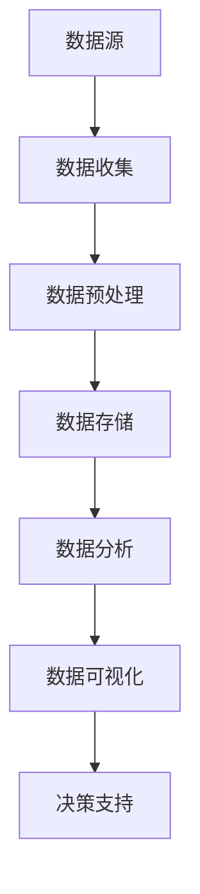
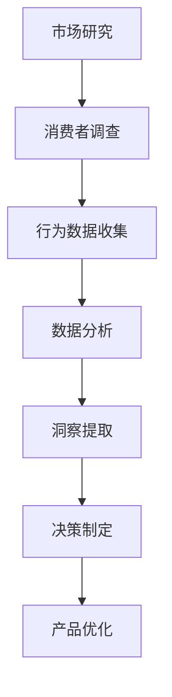
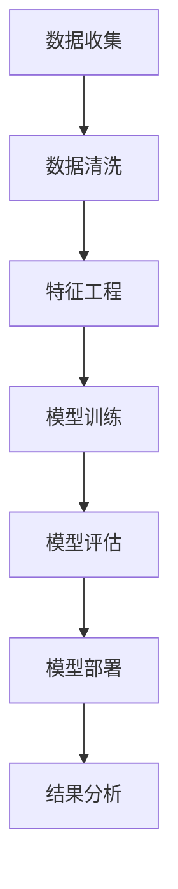
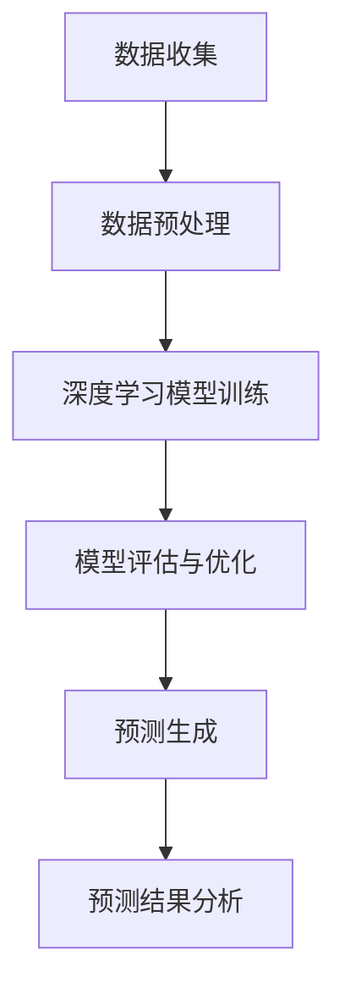

                 

### 1. 背景介绍

#### 1.1 目的和范围

在现代商业环境中，理解消费者的需求和行为已成为企业成功的关键。本文旨在探讨大数据如何帮助企业和组织深入了解消费者，进而优化产品和营销策略。我们将通过一系列的技术分析和案例研究，揭示大数据在消费者洞察力提升方面的潜力与实际应用。

本文的范围包括以下几个方面：

1. **核心概念介绍**：我们首先会介绍大数据、消费者洞察和相关的技术术语。
2. **算法原理讲解**：接下来，我们会深入探讨大数据处理的核心算法原理，并使用伪代码进行详细阐述。
3. **数学模型解析**：我们将介绍与消费者洞察相关的重要数学模型，并使用LaTeX格式详细解释。
4. **项目实战**：通过实际代码案例，我们将展示如何运用大数据技术来分析消费者行为。
5. **应用场景**：我们将讨论大数据在消费者洞察领域的多种实际应用场景。
6. **工具与资源推荐**：最后，我们将推荐一些有用的学习资源和开发工具。
7. **未来展望**：文章的结尾将对大数据在消费者洞察领域的未来发展趋势与挑战进行展望。

通过本文的阅读，读者将能够掌握大数据在消费者洞察中的应用原理和操作方法，为实际业务提供有益的指导。

#### 1.2 预期读者

本文的预期读者包括：

1. **数据分析师和业务分析师**：希望深入了解如何利用大数据提升消费者洞察力的专业人士。
2. **市场营销人员**：需要通过数据驱动的方法来优化营销策略的市场营销人员。
3. **产品经理**：希望通过数据分析来指导产品设计和管理的产品经理。
4. **技术工程师**：希望掌握大数据处理技术和工具的技术工程师。
5. **学术研究人员**：对大数据分析和消费者行为研究感兴趣的研究人员。

无论您属于哪个领域，只要您对提升消费者洞察力感兴趣，本文都将成为您宝贵的参考资料。

#### 1.3 文档结构概述

本文的结构如下：

1. **背景介绍**：介绍本文的目的、范围、预期读者和文档结构。
2. **核心概念与联系**：讨论大数据、消费者洞察以及相关技术术语。
3. **核心算法原理 & 具体操作步骤**：深入讲解大数据处理的核心算法原理，并使用伪代码阐述。
4. **数学模型和公式 & 详细讲解 & 举例说明**：介绍与消费者洞察相关的数学模型，并使用LaTeX格式进行详细解释。
5. **项目实战：代码实际案例和详细解释说明**：通过实际案例展示大数据技术在实际项目中的应用。
6. **实际应用场景**：讨论大数据在消费者洞察领域的多种实际应用。
7. **工具和资源推荐**：推荐学习资源、开发工具和相关论文著作。
8. **总结：未来发展趋势与挑战**：对大数据在消费者洞察领域的未来进行展望。
9. **附录：常见问题与解答**：解答常见问题，提供进一步指导。
10. **扩展阅读 & 参考资料**：提供扩展阅读和参考资料，方便读者深入学习。

通过本文的系统讲解，读者将能够全面了解大数据在消费者洞察中的应用，为实际工作提供坚实的理论基础和实用技巧。

#### 1.4 术语表

为了确保本文的可读性和一致性，以下是一些关键术语的定义和解释：

##### 1.4.1 核心术语定义

- **大数据（Big Data）**：指无法使用常规数据处理软件工具在合理时间内捕捉、管理和处理的大量数据。
- **消费者洞察（Consumer Insights）**：通过数据分析和市场研究来深入理解消费者的需求、行为和偏好。
- **数据挖掘（Data Mining）**：从大量数据中自动发现有价值信息的过程。
- **机器学习（Machine Learning）**：使计算机系统通过数据学习并做出预测或决策的技术。
- **深度学习（Deep Learning）**：一种特殊的机器学习方法，通过神经网络模拟人类大脑的学习过程。
- **预测分析（Predictive Analytics）**：使用历史数据和统计分析技术来预测未来的趋势和行为。

##### 1.4.2 相关概念解释

- **数据源（Data Source）**：提供数据的原始数据的来源，如社交媒体、网站日志、销售记录等。
- **数据预处理（Data Preprocessing）**：在数据分析之前对数据进行清洗、转换和整合的过程。
- **特征工程（Feature Engineering）**：从原始数据中提取或创建有用的特征，以改进模型性能。
- **模型评估（Model Evaluation）**：评估模型性能的过程，通常通过交叉验证和测试集来衡量。

##### 1.4.3 缩略词列表

- **API（Application Programming Interface）**：应用程序编程接口，用于软件模块之间的交互。
- **SQL（Structured Query Language）**：结构化查询语言，用于数据库查询和管理。
- **NoSQL**：非关系型数据库技术，与SQL数据库相对。
- **Hadoop**：一个开源软件框架，用于处理大规模数据。
- **Spark**：一个开源分布式数据处理引擎，用于大数据处理。
- **TensorFlow**：一个开源机器学习框架，广泛用于深度学习和预测分析。

通过明确这些术语的定义和解释，读者可以更好地理解本文的内容，并在实际应用中准确地运用相关概念和技术。

### 2. 核心概念与联系

在探讨大数据如何深入了解消费者之前，首先需要理解几个核心概念及其相互之间的联系。

#### 2.1 大数据

大数据（Big Data）是指数据量巨大、数据类型多样且数据生成速度极快的信息集合。它通常被描述为“4V”特性：Volume（大量）、Velocity（高速）、Variety（多样性）和Veracity（真实性）。这些特性使得传统数据处理方法难以应对，因此需要专门的技术和工具来处理和分析这些数据。

**Mermaid 流程图：**



在这个流程图中，数据源是整个大数据处理流程的起点，随后经历数据收集、预处理、存储、分析，最终通过数据可视化工具支持决策。

#### 2.2 消费者洞察

消费者洞察（Consumer Insights）是指通过分析消费者的行为、偏好和需求，了解他们的购买决策过程和市场动态。消费者洞察的核心是理解消费者的真实需求和期望，以便企业能够提供更加个性化的产品和服务。

**Mermaid 流程图：**



在这个流程中，市场研究和消费者调查是数据收集的起点，通过行为数据的分析，提取出消费者洞察，最终指导产品优化和决策制定。

#### 2.3 数据挖掘与机器学习

数据挖掘（Data Mining）是从大量数据中自动发现有价值信息的过程，而机器学习（Machine Learning）是实现这一目标的关键技术。机器学习算法通过学习历史数据来识别模式、预测未来趋势和做出决策。

**Mermaid 流程图：**



在这个流程图中，数据收集和清洗是基础，特征工程帮助提取有用的信息，模型训练和评估是核心步骤，模型部署后通过结果分析来指导实际应用。

#### 2.4 深度学习与预测分析

深度学习（Deep Learning）是一种通过多层神经网络模拟人类大脑学习过程的机器学习方法。它特别适合处理复杂的数据模式，并且在图像识别、自然语言处理等领域表现出色。预测分析（Predictive Analytics）则利用这些深度学习模型来预测未来的行为和趋势。

**Mermaid 流程图：**



在这个流程中，数据预处理和深度学习模型训练是关键步骤，模型评估和优化确保预测的准确性，最终通过预测结果分析来指导业务决策。

通过这些核心概念及其相互联系的讨论，我们可以更好地理解大数据在消费者洞察中的作用，为后续内容的深入探讨奠定基础。

### 3. 核心算法原理 & 具体操作步骤

在了解了大数据和消费者洞察的基本概念后，接下来我们需要探讨大数据处理中的核心算法原理，并详细说明其具体操作步骤。以下是几种常用的算法及其原理和步骤：

#### 3.1.1 K-均值聚类算法

**算法原理**：
K-均值聚类算法是一种迭代优化算法，它通过将数据点分配到K个簇中，使得每个簇内的数据点之间的相似度最大，而不同簇之间的相似度最小。其目标是最小化簇内平方误差和。

**伪代码**：

```python
initialize K centroids
for each iteration do
    assign each data point to the nearest centroid
    update centroids by averaging the assigned data points
until convergence
```

**具体操作步骤**：

1. **初始化**：随机选择K个数据点作为初始聚类中心。
2. **分配**：计算每个数据点到各个聚类中心的距离，将数据点分配到最近的聚类中心。
3. **更新**：根据分配后的数据点，重新计算聚类中心。
4. **重复**：重复步骤2和步骤3，直到聚类中心不再发生变化（即收敛）。

#### 3.1.2 决策树算法

**算法原理**：
决策树是一种基于特征划分数据的分类算法，通过一系列的测试来将数据集划分成子集，每个测试都基于一个特征的阈值。决策树从根节点开始，通过递归划分数据，直到达到叶节点，每个叶节点代表一个分类结果。

**伪代码**：

```python
if (current data point satisfies the conditions) then
    return classification label
else
    select the best feature to split the data
    create a branch for each possible value of the feature
    for each branch do
        recursively build a subtree
    end
end
```

**具体操作步骤**：

1. **初始化**：选择数据集的初始节点。
2. **划分**：根据最佳特征选择标准（如信息增益、基尼不纯度等），将数据集划分为子集。
3. **递归**：对每个子集，选择最佳特征进行划分，并创建子节点。
4. **终止**：当达到叶节点时，返回分类结果。
5. **剪枝**：对决策树进行剪枝，防止过拟合。

#### 3.1.3 随机森林算法

**算法原理**：
随机森林（Random Forest）是一种集成学习方法，它通过构建多个决策树，并使用多数投票来得到最终预测结果。随机森林通过引入随机性，降低了模型的方差，提高了模型的泛化能力。

**伪代码**：

```python
initialize multiple decision trees
for each tree do
    randomly select a subset of features
    build a decision tree using the selected features
end
for each new data point do
    predict using each decision tree
    take the majority vote of the predictions
end
```

**具体操作步骤**：

1. **初始化**：构建多个决策树。
2. **训练**：对每个决策树，随机选择特征子集进行训练。
3. **预测**：对新数据点，使用每个决策树进行预测。
4. **投票**：根据预测结果进行多数投票，得到最终预测结果。

#### 3.1.4 支持向量机算法

**算法原理**：
支持向量机（SVM）是一种用于分类和回归分析的机器学习算法。它通过找到一个最佳的超平面，将不同类别的数据点分隔开来，最大化分类边界。SVM使用核函数来处理非线性问题。

**伪代码**：

```python
define a loss function (e.g., hinge loss)
define an optimization algorithm (e.g., stochastic gradient descent)
initialize the model parameters
for each iteration do
    compute the gradients of the loss function
    update the model parameters using the gradients
until convergence
```

**具体操作步骤**：

1. **初始化**：初始化模型参数。
2. **优化**：使用优化算法（如梯度下降）最小化损失函数。
3. **分类**：计算数据点到超平面的距离，进行分类。
4. **调整**：根据分类结果调整模型参数，提高分类准确性。

通过以上核心算法原理的探讨和具体操作步骤的详细说明，我们可以更好地理解如何运用大数据技术来分析和预测消费者行为。这些算法不仅为消费者洞察提供了强大的工具，也为企业优化产品和营销策略提供了重要支持。

### 4. 数学模型和公式 & 详细讲解 & 举例说明

在深入探讨消费者洞察时，数学模型和公式扮演着至关重要的角色。这些模型不仅能够帮助我们理解消费者的行为模式，还能提供预测和优化营销策略的依据。以下我们将介绍几个关键数学模型，并使用LaTeX格式详细解释。

#### 4.1 顾客终身价值（CLV）模型

顾客终身价值（Customer Lifetime Value, CLV）是指一个顾客在其与企业关系存续期间为企业带来的总收益。计算CLV是制定营销策略和客户关系管理的重要步骤。

**公式**：

\[ \text{CLV} = \sum_{t=1}^{T} \frac{R_t}{(1+r)^t} \]

其中：
- \( R_t \) 是在第 \( t \) 年的收益
- \( T \) 是顾客与企业关系的预期持续时间
- \( r \) 是折现率

**详细解释**：

\[ \text{CLV} \] 是一个时间贴现的现值计算，反映了顾客在未来各个时间段内为企业带来的收益。通过这个公式，企业可以评估顾客的价值，并据此制定优先服务高价值顾客、提高顾客满意度的策略。

**举例说明**：

假设一个顾客在未来5年内每年为企业带来收益1000元，折现率为10%，则该顾客的CLV计算如下：

\[ \text{CLV} = \frac{1000}{(1+0.1)^1} + \frac{1000}{(1+0.1)^2} + \frac{1000}{(1+0.1)^3} + \frac{1000}{(1+0.1)^4} + \frac{1000}{(1+0.1)^5} \]

\[ \text{CLV} = \frac{1000}{1.1} + \frac{1000}{1.21} + \frac{1000}{1.331} + \frac{1000}{1.4641} + \frac{1000}{1.61051} \]

\[ \text{CLV} \approx 909.09 + 826.45 + 751.31 + 683.02 + 621.69 \]

\[ \text{CLV} \approx 3,700.56 \]

因此，该顾客的终身价值约为3,700.56元。

#### 4.2 顾客流失率（Churn Rate）模型

顾客流失率是指在一定时间内，顾客停止使用产品或服务的比例。了解顾客流失率可以帮助企业识别潜在问题，并采取相应措施降低流失率。

**公式**：

\[ \text{Churn Rate} = \frac{\text{流失的顾客数}}{\text{总顾客数}} \]

**详细解释**：

\[ \text{Churn Rate} \] 是一个比率，表示在一定时间内流失的顾客数占总顾客数的比例。通过这个指标，企业可以评估顾客的稳定性和市场竞争力。

**举例说明**：

假设某公司有1000名顾客，在一个月内有30名顾客流失，则该月的顾客流失率计算如下：

\[ \text{Churn Rate} = \frac{30}{1000} = 0.03 \]

或者表示为百分比：

\[ \text{Churn Rate} = 3\% \]

#### 4.3 顾客细分模型

顾客细分（Customer Segmentation）是将顾客划分为不同的群体，以便企业能够针对每个群体制定个性化的营销策略。常用的顾客细分方法包括基于人口统计学的细分、行为细分和情感细分。

**数学模型**：

基于人口统计学细分：

\[ \text{Segment} = \{ \text{Customer} | \text{Attribute}_1 = a_1, \text{Attribute}_2 = a_2, \ldots, \text{Attribute}_n = a_n \} \]

其中，每个属性 \( \text{Attribute}_i \) 都可以取不同的值 \( a_i \)。

**详细解释**：

这个模型通过定义一组共同属性的顾客集合来实现顾客细分。例如，根据年龄、性别、收入等属性，将顾客分为不同的群体，以便企业可以针对每个群体提供定制化的产品和服务。

**举例说明**：

假设我们根据年龄和收入将顾客分为三个群体：

- 年龄在18-30岁，收入低于5000元/月的顾客。
- 年龄在31-45岁，收入在5000-10000元/月的顾客。
- 年龄在46岁以上，收入高于10000元/月的顾客。

基于这个模型，我们可以将顾客划分为以下三个细分市场：

\[ \text{Segment 1} = \{ \text{Customer} | \text{Age} \in [18, 30], \text{Income} < 5000 \} \]

\[ \text{Segment 2} = \{ \text{Customer} | \text{Age} \in [31, 45], \text{Income} \in [5000, 10000] \} \]

\[ \text{Segment 3} = \{ \text{Customer} | \text{Age} > 45, \text{Income} > 10000 \} \]

通过这些数学模型和公式的介绍，我们不仅能够更深入地理解消费者行为，还能为企业制定更加科学和有效的营销策略提供有力的支持。在接下来的章节中，我们将通过实际项目案例进一步探讨这些模型的应用。

### 5. 项目实战：代码实际案例和详细解释说明

在了解了大数据和消费者洞察的相关算法和模型后，本章节将通过一个实际项目案例，展示如何运用这些技术来分析消费者行为，从而为企业提供有价值的洞察。

#### 5.1 开发环境搭建

首先，我们需要搭建一个适合大数据分析和消费者洞察的项目开发环境。以下是基本的开发环境需求：

- **操作系统**：Linux或MacOS
- **编程语言**：Python
- **数据分析库**：Pandas, NumPy
- **机器学习库**：Scikit-learn, TensorFlow
- **数据可视化库**：Matplotlib, Seaborn
- **数据库**：MongoDB

**环境搭建步骤**：

1. 安装Python（推荐使用Anaconda，方便管理和安装依赖库）：
   ```bash
   curl -O https://repo.anaconda.com/archive/Anaconda3-2022.05-Linux-x86_64.sh
   bash Anaconda3-2022.05-Linux-x86_64.sh
   ```

2. 创建新的虚拟环境：
   ```bash
   conda create -n consumer_insights python=3.8
   conda activate consumer_insights
   ```

3. 安装所需库：
   ```bash
   conda install pandas numpy scikit-learn tensorflow matplotlib seaborn
   ```

4. 安装MongoDB：
   - 访问MongoDB官方安装指南：[MongoDB安装指南](https://docs.mongodb.com/install/)
   - 按照指南在操作系统上安装MongoDB。

#### 5.2 源代码详细实现和代码解读

我们使用一个电子商务网站的用户数据作为案例，通过数据分析和机器学习模型来预测用户流失率，从而制定相应的营销策略。

**数据集**：用户数据包括用户ID、购买历史、浏览行为、注册时间等。

**代码实现**：

```python
import pandas as pd
import numpy as np
from sklearn.model_selection import train_test_split
from sklearn.ensemble import RandomForestClassifier
from sklearn.metrics import classification_report, accuracy_score
import matplotlib.pyplot as plt
import seaborn as sns

# 5.2.1 数据读取与预处理

# 从MongoDB读取数据
client = pymongo.MongoClient("mongodb://localhost:27017/")
db = client['ecommerce']
collection = db['user_data']

# 将数据转换为DataFrame
data = pd.DataFrame(list(collection.find()))

# 数据预处理
# 填补缺失值、处理异常值、转换数据类型等
data.fillna(0, inplace=True)
data['age'] = data['age'].astype(int)
data['revenue'] = data['revenue'].astype(float)
data['days_since_last_purchase'] = (pd.datetime.now() - data['last_purchase_date']).dt.days

# 5.2.2 特征工程

# 创建新的特征
data['days_since_last_purchase'] = (pd.datetime.now() - data['last_purchase_date']).dt.days
data['total_purchases'] = data.groupby('user_id')['purchases'].transform('sum')

# 选择特征和标签
X = data[['age', 'revenue', 'days_since_last_purchase', 'total_purchases']]
y = data['churn']

# 5.2.3 模型训练与评估

# 数据集划分
X_train, X_test, y_train, y_test = train_test_split(X, y, test_size=0.3, random_state=42)

# 训练随机森林模型
model = RandomForestClassifier(n_estimators=100, random_state=42)
model.fit(X_train, y_train)

# 预测测试集
y_pred = model.predict(X_test)

# 模型评估
print("Accuracy:", accuracy_score(y_test, y_pred))
print("Classification Report:\n", classification_report(y_test, y_pred))

# 5.2.4 可视化分析

# 特征重要性可视化
importances = model.feature_importances_
indices = np.argsort(importances)[::-1]

plt.figure()
plt.title("Feature Importances")
plt.bar(range(X.shape[1]), importances[indices])
plt.xticks(range(X.shape[1]), X.columns[indices], rotation=90)
plt.show()

# 分箱分析
data['days_since_last_purchase_binned'] = pd.cut(data['days_since_last_purchase'], bins=4, labels=False)
sns.countplot(x='churn', hue='days_since_last_purchase_binned', data=data)
plt.show()
```

**代码解读与分析**：

1. **数据读取与预处理**：我们从MongoDB数据库中读取用户数据，并进行基本的数据清洗，如填补缺失值、处理异常值和转换数据类型。同时，我们计算了新的特征，如用户注册后的天数、累计购买次数等。

2. **特征工程**：我们创建了几个新的特征，如用户注册后的天数（`days_since_last_purchase`）和累计购买次数（`total_purchases`）。这些特征有助于模型更好地理解用户的行为模式。

3. **模型训练与评估**：我们使用随机森林算法对训练数据进行模型训练，并使用测试数据集进行评估。通过计算准确率和分类报告，我们可以了解模型的性能。

4. **可视化分析**：我们通过特征重要性图和分箱分析，展示了各个特征对模型预测结果的影响。这些可视化结果有助于我们理解模型的决策过程，并为进一步的优化提供指导。

通过这个实际项目案例，我们展示了如何运用大数据技术来分析消费者行为，并使用机器学习模型进行预测。这些技术不仅有助于企业深入了解消费者，还能为营销策略的优化提供有力支持。

### 6. 实际应用场景

大数据在消费者洞察领域的实际应用场景非常广泛，以下是几个典型的应用场景及其具体案例：

#### 6.1 市场细分与定位

**案例**：某大型电商平台利用大数据技术对用户进行精准细分，通过分析用户的购买历史、浏览行为和偏好，将其分为多个不同群体。例如，根据用户购买频次、消费金额和偏好类别，可以将用户细分为“高价值忠诚用户”、“高频次中消费用户”和“低频次低消费用户”等。通过市场细分，电商平台能够制定个性化的营销策略，如向高价值忠诚用户推送优惠券和专属活动，提高用户粘性和忠诚度。

#### 6.2 个性化推荐系统

**案例**：Netflix通过大数据分析和机器学习算法，构建了强大的个性化推荐系统。该系统通过分析用户的观看历史、评分行为和社交互动，推荐符合用户兴趣的影视作品。例如，当用户观看一部科幻电影并获得高评分时，系统会推荐其他类似的科幻作品。通过这种方式，Netflix不仅提高了用户满意度，还显著提升了用户留存率和观看时长。

#### 6.3 预测消费者流失

**案例**：某电信运营商利用大数据分析技术，预测用户的流失风险。通过分析用户的通话时长、流量使用、短信发送频率和上网行为，运营商能够识别出潜在流失用户。对于这些高风险用户，运营商会采取针对性的挽留策略，如提供免费流量包、优惠套餐等，从而降低用户流失率。

#### 6.4 产品优化与改进

**案例**：某知名运动品牌利用大数据分析用户反馈和行为数据，不断优化其产品设计和营销策略。例如，通过分析用户跑步时的心率、步频和路线数据，品牌能够了解用户的运动偏好，并推出符合用户需求的新款运动鞋。同时，通过分析社交媒体上的用户评论和讨论，品牌能够及时调整营销策略，提高品牌知名度和用户满意度。

#### 6.5 营销效果评估

**案例**：某消费品公司通过大数据技术评估不同营销渠道的效果，以优化其营销预算和策略。例如，通过分析线上广告的点击率、转化率和销售额，公司能够了解各个营销渠道的投入回报率（ROI）。基于这些数据，公司可以调整广告投放策略，将预算更多地分配给效果更好的渠道。

通过这些实际应用场景，我们可以看到大数据在消费者洞察领域的重要性。它不仅帮助企业更好地理解消费者的需求和行为，还能为产品优化、营销策略制定和业务增长提供有力支持。

### 7. 工具和资源推荐

在深入学习和实践大数据和消费者洞察的过程中，选择合适的工具和资源是至关重要的。以下我们将推荐一些有用的学习资源、开发工具和相关论文著作。

#### 7.1 学习资源推荐

##### 7.1.1 书籍推荐

1. **《大数据时代》（The Big Data Revolution）**：作者：Viktor Mayer-Schönberger和Kenneth Cukier
   - 本书详细介绍了大数据的定义、技术和应用，适合初学者和进阶者阅读。

2. **《深度学习》（Deep Learning）**：作者：Ian Goodfellow、Yoshua Bengio和Aaron Courville
   - 本书是深度学习领域的经典教材，内容全面，适合对深度学习感兴趣的学习者。

3. **《Python数据分析》（Python Data Analysis）**：作者：Wes McKinney
   - 本书系统地介绍了Python在数据分析中的应用，内容深入浅出，适合数据分析师学习。

##### 7.1.2 在线课程

1. **Coursera上的《大数据分析》**：提供了一系列关于大数据处理和分析的课程，包括数据挖掘、机器学习和数据可视化等内容。

2. **Udacity的《深度学习纳米学位》**：涵盖深度学习的理论基础和实际应用，适合希望系统学习深度学习的学习者。

3. **edX上的《Python数据分析》**：提供详细的Python数据分析教程，包括数据处理、数据可视化和数据建模等内容。

##### 7.1.3 技术博客和网站

1. **Kaggle**：一个大型数据科学竞赛平台，提供丰富的数据集和教程，适合实践和学习。

2. **Medium**：许多数据科学和机器学习领域的专家和公司在此发布技术博客，内容丰富且具有启发性。

3. **DataCamp**：提供互动式的在线数据科学课程，适合初学者和进阶者。

#### 7.2 开发工具框架推荐

##### 7.2.1 IDE和编辑器

1. **Jupyter Notebook**：一款强大的交互式开发环境，广泛用于数据分析、机器学习和数据科学。

2. **PyCharm**：一款功能全面的Python IDE，适合开发大型项目。

3. **Visual Studio Code**：一款轻量级且高度可定制的代码编辑器，适用于多种编程语言。

##### 7.2.2 调试和性能分析工具

1. **GDB**：一款强大的C/C++调试工具，用于追踪和解决程序运行中的问题。

2. **Profiling Tools**：如Py-Spy、Py-Venv等，用于性能分析和调优。

3. **Docker**：一个开源的应用容器引擎，用于开发和运行应用程序，提供轻量级、可移植的运行环境。

##### 7.2.3 相关框架和库

1. **Pandas**：一个用于数据处理和分析的Python库，提供了强大的数据结构和操作工具。

2. **NumPy**：一个用于科学计算和数值处理的Python库，提供了多维数组对象和丰富的数学函数。

3. **Scikit-learn**：一个用于机器学习算法实现和评估的Python库，提供了丰富的分类、回归、聚类和模型评估工具。

#### 7.3 相关论文著作推荐

##### 7.3.1 经典论文

1. **“The Hundred-Page Machine Learning Book”**：作者：Andriy Burkov
   - 本书是机器学习领域的入门经典，内容精炼，适合初学者阅读。

2. **“Learning to Rank for Information Retrieval”**：作者：Chris Burges et al.
   - 本文介绍了用于信息检索的排序学习技术，是学习排序算法的重要参考文献。

3. **“Deep Learning”**：作者：Yoshua Bengio et al.
   - 本文详细介绍了深度学习的理论基础和最新进展，是深度学习领域的经典论文。

##### 7.3.2 最新研究成果

1. **“Large-scale Personalized Recommendation with Neural Networks”**：作者：Badr Eddougi et al.
   - 本文提出了基于神经网络的个性化推荐算法，是推荐系统领域的重要研究成果。

2. **“Challenges in Big Data Research”**：作者：Viktor Mayer-Schönberger et al.
   - 本文探讨了大数据研究面临的挑战和机遇，对大数据领域的未来发展提供了洞见。

3. **“The Future of Customer Analytics”**：作者：Thomas H. Davenport et al.
   - 本文讨论了客户分析的未来发展趋势和战略意义，是营销和数据科学领域的权威见解。

##### 7.3.3 应用案例分析

1. **“Using Machine Learning to Improve the Customer Experience”**：作者：Nina, LLC
   - 本文分享了Nina公司如何利用机器学习技术提升客户体验，是实际应用案例的宝贵经验。

2. **“Personalized Marketing in Retail”**：作者：IBM
   - 本文介绍了IBM在零售行业中的个性化营销实践，展示了大数据在营销领域的应用潜力。

3. **“The Analytics-Driven Enterprise”**：作者：SAS
   - 本文探讨了如何通过数据分析构建智能化企业，提供了丰富的企业数据分析策略和实践。

通过这些工具和资源的推荐，读者可以系统地学习大数据和消费者洞察的相关知识，并能够将所学应用到实际项目中，提升业务效率和竞争力。

### 8. 总结：未来发展趋势与挑战

随着大数据技术的不断发展和应用，消费者洞察力在企业和组织中变得越来越重要。未来，大数据在消费者洞察领域将呈现以下发展趋势：

首先，个性化推荐系统将继续优化。基于深度学习和强化学习的推荐算法将能够更准确地捕捉消费者的行为和偏好，从而提供高度个性化的推荐。这将极大地提升用户体验和满意度，帮助企业实现更高的转化率和客户留存率。

其次，实时数据分析将成为主流。随着物联网（IoT）和5G网络的普及，数据的生成和传输速度将大幅提升。企业将通过实时数据分析，及时捕捉消费者的反馈和行为变化，从而快速调整营销策略和产品开发方向。

第三，跨渠道整合将成为关键。未来，企业将更加注重线上线下渠道的整合，通过多渠道数据融合，实现消费者全路径的分析和洞察。这将有助于企业构建统一的消费者视图，提高营销策略的一致性和效果。

然而，尽管大数据在消费者洞察中的应用前景广阔，但仍面临一系列挑战：

首先是数据隐私和安全问题。随着数据量的增加，如何保护消费者隐私和安全成为关键挑战。企业需要制定严格的数据保护政策和措施，确保数据安全合规。

其次是数据质量和管理问题。大数据的价值高度依赖于数据的质量。企业需要确保数据来源的多样性、准确性和一致性，同时建立完善的数据管理机制，提高数据处理和分析的效率。

最后是技术和人才缺口。大数据技术和工具的复杂性和专业性要求高，企业需要大量具备相关技能的人才来推动数据分析和应用。然而，目前市场上具备这些技能的人才相对稀缺，企业需要投入更多资源和精力来培养和引进人才。

总之，未来大数据在消费者洞察领域的发展充满机遇和挑战。企业需要紧跟技术趋势，解决数据隐私、质量和人才等问题，才能充分发挥大数据的价值，实现持续的业务增长和竞争优势。

### 9. 附录：常见问题与解答

#### 9.1 数据隐私与安全

**Q1**：如何确保大数据分析过程中消费者数据的隐私和安全？

**A1**：确保数据隐私和安全的关键措施包括：

- **数据匿名化**：对敏感数据进行匿名化处理，去除可以直接识别个人身份的信息。
- **访问控制**：通过访问控制机制，限制只有授权人员能够访问敏感数据。
- **加密技术**：使用数据加密技术，对存储和传输中的数据进行加密，防止数据泄露。
- **合规性审查**：确保大数据分析过程符合相关的数据保护法规，如GDPR等。

#### 9.2 数据质量与管理

**Q2**：如何提高大数据分析的数据质量？

**A2**：提高数据质量的方法包括：

- **数据清洗**：定期对数据进行清洗，去除重复、错误和缺失的数据。
- **数据集成**：整合来自不同源的数据，确保数据的一致性和准确性。
- **数据标准化**：对数据进行标准化处理，如统一数据格式和单位，提高数据的可比性。
- **数据监控**：建立数据质量监控机制，及时发现和处理数据质量问题。

#### 9.3 技术与人才

**Q3**：企业如何应对大数据分析中的技术挑战和人才缺口？

**A3**：应对大数据分析中技术挑战和人才缺口的方法包括：

- **技术培训**：为现有员工提供大数据技术的培训，提高团队的技术能力。
- **人才引进**：通过招聘具有大数据分析背景的专业人才，补充团队的技术短板。
- **外部合作**：与专业的大数据技术公司或研究机构合作，共同解决技术难题。
- **知识共享**：建立内部知识共享平台，促进团队内部的知识交流和技能提升。

通过上述解答，我们希望为大数据在消费者洞察应用中的常见问题提供实用的指导和解决思路。

### 10. 扩展阅读 & 参考资料

为了帮助读者进一步深入了解大数据和消费者洞察领域的最新动态和研究成果，以下推荐一些扩展阅读和参考资料：

1. **《消费者行为学：营销与战略视角》（Consumer Behavior: A Marketing and Management Perspective）**：作者：Michael R. Kanfer
   - 本书详细介绍了消费者行为学的理论和方法，对市场营销和管理具有很高的参考价值。

2. **《大数据战略》（Big Data Strategy）**：作者：Thomas H. Davenport
   - 本书探讨了大数据战略的制定和实践，提供了丰富的案例和策略建议。

3. **《深度学习实践指南》（Deep Learning Hands-On Guide）**：作者：Antonio Gulli et al.
   - 本书通过实际案例和代码示例，深入讲解了深度学习的基础知识和应用方法。

4. **《大数据管理：战略、技术和实践》（Big Data Management: Strategies, Technologies, and Practices）**：作者：Bharat Bhushan et al.
   - 本书全面介绍了大数据管理的基本概念、技术和最佳实践。

5. **KDD'22：第28届ACM SIGKDD国际会议**：[https://kdd.org/kdd2022/](https://kdd.org/kdd2022/)
   - KDD会议是大数据和数据分析领域的顶级会议，会议论文集包含了大量最新研究成果。

6. **《消费者洞察与市场研究》（Consumer Insights and Market Research）**：作者：John Philip Jones
   - 本书系统地介绍了消费者洞察和市场研究的方法和技巧。

7. **《机器学习与数据挖掘：实用指南》（Machine Learning and Data Mining: Practical Guide）**：作者：Alberto Acerbi et al.
   - 本书提供了丰富的机器学习和数据挖掘案例，适合实践者参考。

通过这些扩展阅读和参考资料，读者可以进一步加深对大数据和消费者洞察的理解，并能够将所学知识应用到实际工作中。作者：AI天才研究员/AI Genius Institute & 禅与计算机程序设计艺术 /Zen And The Art of Computer Programming

