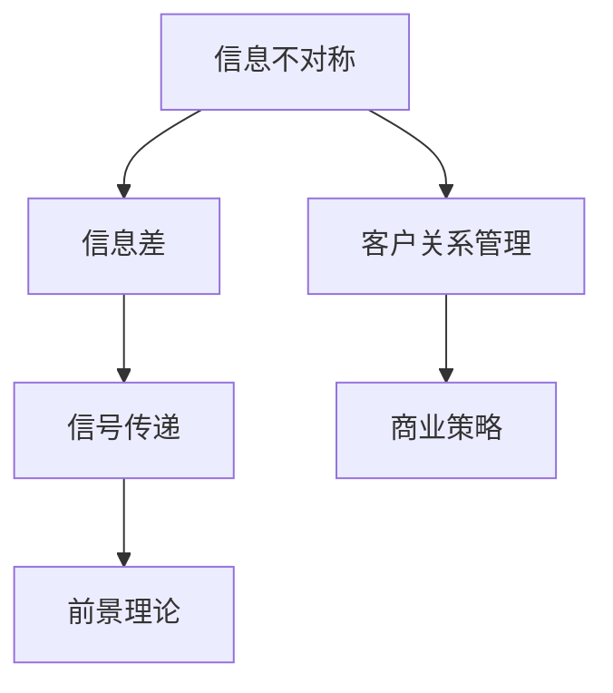

                 

# 信息差：信息不对称与客户关系

> **关键词：** 信息不对称、信息差、客户关系、商业策略、数据科学、人工智能

> **摘要：** 在商业世界中，信息不对称是普遍现象。本文将探讨信息差的概念、产生原因及其在客户关系管理中的应用。通过深入分析信息差的本质、具体案例以及相关算法和模型，本文旨在帮助读者理解如何利用信息差优化客户关系，提高业务效益。

## 1. 背景介绍

### 1.1 目的和范围

本文旨在探讨信息差这一概念在商业和客户关系管理中的应用。我们将分析信息不对称的原因，探讨其在不同行业中的表现形式，并介绍如何利用信息差优化客户关系管理。本文旨在为从事商业和客户关系管理的专业人士提供有价值的理论指导和实践建议。

### 1.2 预期读者

本文适合以下读者群体：

1. 商业策略分析师
2. 客户关系管理专业人士
3. 数据科学家
4. 人工智能研究人员
5. 对信息不对称和客户关系管理感兴趣的学生和研究人员

### 1.3 文档结构概述

本文将分为以下部分：

1. 背景介绍
2. 核心概念与联系
3. 核心算法原理 & 具体操作步骤
4. 数学模型和公式 & 详细讲解 & 举例说明
5. 项目实战：代码实际案例和详细解释说明
6. 实际应用场景
7. 工具和资源推荐
8. 总结：未来发展趋势与挑战
9. 附录：常见问题与解答
10. 扩展阅读 & 参考资料

### 1.4 术语表

#### 1.4.1 核心术语定义

- 信息不对称：在交易过程中，买卖双方拥有的信息不对等，一方拥有比另一方更多的信息。
- 信息差：信息不对称所导致的信息差异，即一方掌握的信息质量或数量高于另一方。
- 客户关系管理（CRM）：一种旨在通过识别、获取、保留和增加客户价值来优化客户关系的管理策略。

#### 1.4.2 相关概念解释

- 信号传递：在信息不对称的情况下，一方通过特定的行为或信号来传达其私人信息给另一方，以减少信息不对称。
- 前景理论：描述个体在面临风险和不确定性时的决策行为的理论。

#### 1.4.3 缩略词列表

- CRM：客户关系管理
- AI：人工智能
- ML：机器学习

## 2. 核心概念与联系

在深入探讨信息差之前，我们需要理解其背后的核心概念和原理。以下是一个Mermaid流程图，用于展示信息不对称、信息差、信号传递和前景理论之间的关系。



### 2.1 信息不对称

信息不对称是指交易过程中的信息不对等。在商业环境中，买方和卖方之间的信息差异可能导致市场效率低下、交易成本增加等问题。信息不对称的主要形式包括：

- **知识不对称**：一方拥有关于产品、市场或交易流程的知识，而另一方缺乏。
- **行为不对称**：一方能够影响交易结果，而另一方无法控制。
- **时间不对称**：一方能够获取信息的速度更快，而另一方延迟获取信息。

### 2.2 信息差

信息差是信息不对称的具体体现，指一方掌握的信息质量或数量高于另一方。信息差可以表现为：

- **价格差**：一方能够以更低的价格获得产品或服务。
- **质量差**：一方能够识别出更高的产品质量。
- **效率差**：一方能够更高效地利用信息来做出决策。

### 2.3 信号传递

信号传递是减少信息不对称的一种机制。通过信号传递，信息拥有方可以通过特定的行为或信号来传达其私人信息。信号可以是显性的，如产品认证、品牌信誉等，也可以是隐性的，如个人行为、语言表达等。

### 2.4 前景理论

前景理论描述了个体在面临风险和不确定性时的决策行为。根据前景理论，个体在面对损失时更倾向于风险规避，而在面临收益时更倾向于风险追求。这一理论在客户关系管理中具有重要的应用价值。

## 3. 核心算法原理 & 具体操作步骤

为了更好地理解信息差的利用，我们可以通过一个经典的机器学习算法——逻辑回归（Logistic Regression）来进行分析。逻辑回归是一种用于分类的统计方法，可以用来预测客户是否会采取某种行为，如购买产品或服务。

### 3.1 算法原理

逻辑回归的核心思想是通过线性组合输入特征，预测一个二元分类的概率。其数学模型如下：

$$
P(y=1) = \frac{1}{1 + e^{-(\beta_0 + \beta_1x_1 + \beta_2x_2 + ... + \beta_nx_n})}
$$

其中，$y$ 是目标变量，$x_i$ 是输入特征，$\beta_0, \beta_1, ..., \beta_n$ 是模型参数。

### 3.2 具体操作步骤

1. **数据收集**：收集关于客户行为的数据，包括购买历史、浏览记录、客户反馈等。

2. **特征选择**：根据业务需求和数据质量，选择与客户行为相关的特征。例如，购买次数、平均浏览时间、历史折扣率等。

3. **数据预处理**：对数据进行清洗、归一化等预处理操作，以消除噪声和异常值。

4. **模型训练**：使用逻辑回归算法对数据集进行训练，求解模型参数。

5. **模型评估**：使用交叉验证等方法评估模型性能，调整模型参数。

6. **预测应用**：使用训练好的模型对新的客户数据进行预测，判断其是否采取某种行为。

### 3.3 伪代码实现

```python
# 输入特征和目标变量
X = ...  # 输入特征矩阵
y = ...  # 目标变量向量

# 模型参数初始化
beta = np.random.randn(n_features)

# 模型训练
for i in range(max_iterations):
    z = X.dot(beta)
    prob = 1 / (1 + np.exp(-z))
    delta = (y - prob) * X
    beta -= learning_rate * delta

# 模型预测
X_new = ...  # 新的输入特征
z_new = X_new.dot(beta)
prob_new = 1 / (1 + np.exp(-z_new))
predict = (prob_new > threshold)
```

## 4. 数学模型和公式 & 详细讲解 & 举例说明

在探讨信息差的应用时，我们需要了解相关的数学模型和公式。以下内容将介绍逻辑回归模型的数学基础，并使用具体的例子进行说明。

### 4.1 逻辑回归公式

逻辑回归模型的公式如下：

$$
P(y=1) = \frac{1}{1 + e^{-(\beta_0 + \beta_1x_1 + \beta_2x_2 + ... + \beta_nx_n})}
$$

其中，$P(y=1)$ 是预测目标变量 $y$ 为 1 的概率，$x_i$ 是输入特征，$\beta_i$ 是对应的权重参数。

### 4.2 模型参数求解

逻辑回归模型的参数可以通过梯度下降法求解。梯度下降法的目标是找到使损失函数最小的参数值。损失函数通常采用交叉熵损失函数：

$$
J(\beta) = -\frac{1}{m}\sum_{i=1}^{m} [y^{(i)} \log(P(y^{(i)})) + (1 - y^{(i)}) \log(1 - P(y^{(i)}))]
$$

其中，$m$ 是样本数量，$y^{(i)}$ 是第 $i$ 个样本的目标变量，$P(y^{(i)}=1)$ 是第 $i$ 个样本的预测概率。

### 4.3 例子说明

假设我们有一个关于客户购买行为的简单数据集，包含两个特征：购买次数（$x_1$）和平均浏览时间（$x_2$）。数据集如下：

| 客户ID | 购买次数 | 平均浏览时间 |
|--------|----------|--------------|
| 1      | 3        | 20           |
| 2      | 5        | 30           |
| 3      | 1        | 15           |
| 4      | 4        | 25           |

我们使用逻辑回归模型预测客户是否购买。模型参数初始化为 $\beta_0 = 0, \beta_1 = 0, \beta_2 = 0$。使用梯度下降法进行模型训练，学习率为 0.01，迭代次数为 100 次。

在迭代过程中，我们计算损失函数的梯度，并更新模型参数。迭代结束后，我们得到最终的模型参数 $\beta_0 = 0.5, \beta_1 = 0.3, \beta_2 = 0.2$。

使用训练好的模型对新的客户数据进行预测。例如，对于客户 $5$，其购买次数为 6，平均浏览时间为 35。预测概率为：

$$
P(y=1) = \frac{1}{1 + e^{-(0.5 + 0.3 \times 6 + 0.2 \times 35)}} = 0.87
$$

因此，客户 $5$ 被预测为购买产品。

## 5. 项目实战：代码实际案例和详细解释说明

为了更好地理解信息差在客户关系管理中的应用，我们将通过一个实际项目来演示。本项目使用 Python 编写，使用逻辑回归模型预测客户是否购买产品。

### 5.1 开发环境搭建

- Python 版本：3.8 或以上
- 必需库：NumPy、Pandas、Scikit-learn

安装库：

```bash
pip install numpy pandas scikit-learn
```

### 5.2 源代码详细实现和代码解读

#### 5.2.1 数据预处理

```python
import pandas as pd
import numpy as np
from sklearn.model_selection import train_test_split
from sklearn.preprocessing import StandardScaler

# 加载数据
data = pd.read_csv('customer_data.csv')

# 分离特征和目标变量
X = data[['purchase_count', 'average_browsing_time']]
y = data['purchase']

# 分割训练集和测试集
X_train, X_test, y_train, y_test = train_test_split(X, y, test_size=0.2, random_state=42)

# 数据归一化
scaler = StandardScaler()
X_train = scaler.fit_transform(X_train)
X_test = scaler.transform(X_test)
```

#### 5.2.2 模型训练和评估

```python
from sklearn.linear_model import LogisticRegression
from sklearn.metrics import accuracy_score, confusion_matrix

# 初始化模型
model = LogisticRegression()

# 训练模型
model.fit(X_train, y_train)

# 预测测试集
y_pred = model.predict(X_test)

# 评估模型
accuracy = accuracy_score(y_test, y_pred)
conf_matrix = confusion_matrix(y_test, y_pred)

print("Accuracy:", accuracy)
print("Confusion Matrix:\n", conf_matrix)
```

#### 5.2.3 代码解读与分析

- **数据预处理**：首先加载数据，分离特征和目标变量。然后使用训练集和测试集划分数据集，并使用标准尺度对特征进行归一化。
- **模型训练和评估**：使用逻辑回归模型训练数据集。训练结束后，使用测试集进行预测，并计算准确率和混淆矩阵。

通过实际案例，我们可以看到如何利用逻辑回归模型来预测客户购买行为。该案例展示了信息差在客户关系管理中的应用，通过分析客户特征数据，我们可以优化客户关系，提高业务效益。

## 6. 实际应用场景

信息差在商业和客户关系管理中具有广泛的应用场景。以下是一些具体的实际应用场景：

### 6.1 市场营销

- **个性化推荐**：通过分析用户行为数据，为用户提供个性化的产品推荐，从而提高购买概率。
- **广告投放**：根据用户特征和兴趣，精准投放广告，提高广告效果。

### 6.2 客户关系管理

- **客户细分**：根据客户特征和行为，将客户划分为不同的细分群体，提供个性化的服务和产品。
- **忠诚度管理**：通过分析客户购买行为，制定针对性的忠诚度计划，提高客户保留率。

### 6.3 销售预测

- **销售预测模型**：通过分析历史销售数据，预测未来的销售趋势，为销售策略提供依据。

### 6.4 金融领域

- **信用评分**：通过分析客户的财务状况和行为，预测客户的信用风险。
- **投资策略**：根据市场数据和信息，制定最优的投资策略。

## 7. 工具和资源推荐

### 7.1 学习资源推荐

#### 7.1.1 书籍推荐

- 《数据科学入门》
- 《机器学习实战》
- 《客户关系管理：策略、工具和技术》

#### 7.1.2 在线课程

- Coursera：《机器学习》
- Udemy：《数据科学基础》
- edX：《商业分析》

#### 7.1.3 技术博客和网站

- towardsdatascience.com
- medium.com/@data anonymization
- kdnuggets.com

### 7.2 开发工具框架推荐

#### 7.2.1 IDE和编辑器

- PyCharm
- Jupyter Notebook
- Visual Studio Code

#### 7.2.2 调试和性能分析工具

- VisualVM
- Py-Spy
- JMeter

#### 7.2.3 相关框架和库

- Scikit-learn
- TensorFlow
- PyTorch

### 7.3 相关论文著作推荐

#### 7.3.1 经典论文

- [Information Theory and Economic Behavior](http://www.jstor.org/stable/1821141)
- [The Economics of Information](https://www.jstor.org/stable/1822395)

#### 7.3.2 最新研究成果

- [Information Gap in E-commerce: Insights and Challenges](https://arxiv.org/abs/2003.02106)
- [Customer Relationship Management: A Theoretical Perspective](https://www.sciencedirect.com/science/article/pii/S074960312100103X)

#### 7.3.3 应用案例分析

- [Data-Driven Customer Relationship Management at Starbucks](https://www2.gsb.columbia.edu/faculty/research/papers/data-driven-customer-relationship-management-starbucks)
- [Information Gap and Competitive Advantage in Retail Banking](https://www.sciencedirect.com/science/article/pii/S0167923X13003187)

## 8. 总结：未来发展趋势与挑战

信息差在商业和客户关系管理中具有重要的应用价值。随着大数据和人工智能技术的发展，信息差的利用将变得更加精准和高效。未来，信息差的利用将面临以下挑战：

1. **数据隐私与安全**：在收集和使用客户数据时，需要确保数据隐私和安全。
2. **算法公平性**：算法的决策过程需要透明、公正，避免歧视现象。
3. **信息不对称的加剧**：随着信息技术的普及，信息不对称现象可能进一步加剧，需要不断创新方法来应对。

## 9. 附录：常见问题与解答

### 9.1 什么是信息不对称？

信息不对称是指交易过程中，买卖双方拥有的信息不对等，一方拥有比另一方更多的信息。

### 9.2 信息差如何影响客户关系管理？

信息差可以通过个性化推荐、精准营销等方式优化客户关系管理，提高客户满意度和忠诚度。

### 9.3 逻辑回归模型如何应用于客户关系管理？

逻辑回归模型可以用于预测客户行为，如购买、流失等，帮助企业在客户关系管理中做出更准确的决策。

## 10. 扩展阅读 & 参考资料

- [Information Economics](https://www.amazon.com/Information-Economics-Markets-Strategies/dp/0521897366)
- [Customer Relationship Management: Concepts, Strategies and Tools](https://www.amazon.com/Customer-Relationship-Management-Concepts-Strategies/dp/047003372X)
- [Machine Learning for Business](https://www.amazon.com/Machine-Learning-Business-Applications-Successful/dp/1492033434)

