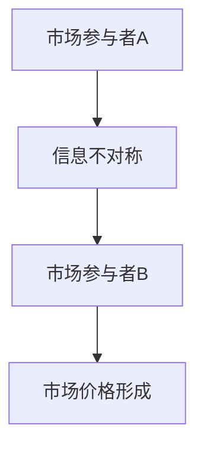
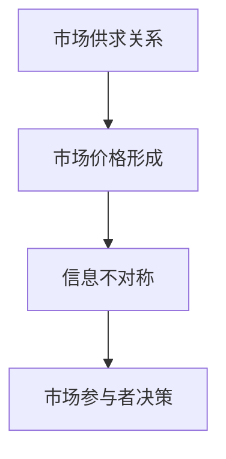
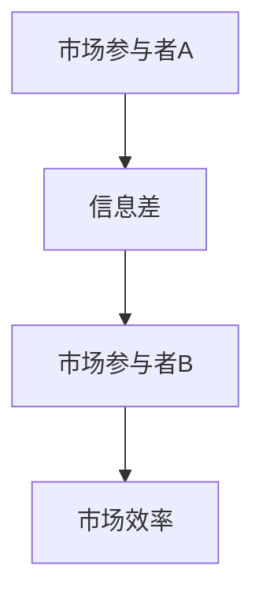
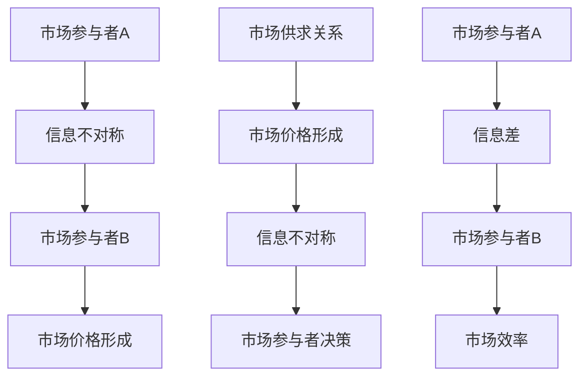

                 

### 信息差：信息不对称与市场定价

> **关键词**：信息不对称、市场定价、信息差、信息不对称理论、市场效率、信息传播、数据隐私

> **摘要**：本文将探讨信息不对称现象在市场中的作用及其对定价机制的影响。通过深入分析信息不对称理论的起源、核心概念以及实际应用，我们旨在揭示信息差如何影响市场价格的形成，并提出提高市场效率的策略。本文还将结合实际案例，详细解析如何利用信息差进行市场定位和策略制定，为读者提供实用的参考和指导。

### 1. 背景介绍

#### 1.1 目的和范围

本文旨在探讨信息不对称现象对市场定价的影响，通过分析信息不对称理论的基本概念和应用，旨在揭示信息差在市场运作中的重要作用。本文将涵盖以下主要内容：

1. **信息不对称理论的基本概念**：介绍信息不对称理论的起源、核心概念及其在经济学中的重要性。
2. **信息不对称与市场定价**：分析信息不对称如何影响市场价格的形成，探讨市场参与者如何利用信息差进行决策。
3. **实际应用案例**：通过具体案例，展示信息不对称在市场定价中的实际应用，如二手车市场、保险市场等。
4. **提高市场效率的策略**：讨论如何通过信息共享、透明化等手段，提高市场效率，减少信息不对称。

#### 1.2 预期读者

本文预期读者为对经济学、市场营销、金融等领域感兴趣的读者，特别是希望了解信息不对称理论在实际市场中的应用的专业人士。此外，对计算机科学、人工智能等领域感兴趣的读者也可以通过本文了解到信息不对称现象的重要性。

#### 1.3 文档结构概述

本文结构如下：

1. **背景介绍**：简要介绍信息不对称现象及其对市场定价的影响。
2. **核心概念与联系**：介绍信息不对称理论的基本概念，并通过Mermaid流程图展示其核心架构。
3. **核心算法原理 & 具体操作步骤**：使用伪代码详细阐述信息不对称处理的核心算法原理。
4. **数学模型和公式 & 详细讲解 & 举例说明**：介绍与信息不对称相关的数学模型和公式，并给出实际应用案例。
5. **项目实战：代码实际案例和详细解释说明**：结合具体项目案例，展示如何利用信息不对称进行市场定价。
6. **实际应用场景**：分析信息不对称在各个领域的应用场景。
7. **工具和资源推荐**：推荐相关学习资源、开发工具和框架。
8. **总结：未来发展趋势与挑战**：总结信息不对称理论的发展趋势，展望未来面临的挑战。
9. **附录：常见问题与解答**：解答读者可能遇到的问题。
10. **扩展阅读 & 参考资料**：提供进一步的阅读资源和参考文献。

#### 1.4 术语表

在本文中，我们将使用以下术语：

- **信息不对称**：指市场中买卖双方或多方之间存在的信息差异。
- **市场定价**：指市场参与者根据信息进行决策，最终形成的价格。
- **信息差**：指市场中信息占优的一方与其他方之间的信息差异。
- **信息不对称理论**：研究信息不对称对市场效率影响的经济学理论。
- **市场效率**：指市场在信息完全对称的情况下，资源分配的最优化状态。

#### 1.4.1 核心术语定义

- **信息不对称**：在经济学中，信息不对称是指市场中的一部分参与者拥有而其他参与者没有的信息。这种信息差异可能导致市场失灵，影响价格机制的有效性。
- **市场定价**：市场定价是指市场中的商品或服务通过供求关系、信息传播等因素形成的最终价格。在信息不对称的情况下，市场定价可能会偏离实际价值。
- **信息差**：信息差是指市场中的买卖双方或多方之间的信息差异。这种差异可能导致一方在决策时占据优势，而另一方处于劣势。
- **信息不对称理论**：信息不对称理论是研究信息不对称对市场效率影响的经济学理论。该理论指出，信息不对称可能导致市场失灵，资源分配效率低下。
- **市场效率**：市场效率是指市场在信息完全对称的情况下，资源分配的最优化状态。提高市场效率的关键在于减少信息不对称。

#### 1.4.2 相关概念解释

- **不完全信息**：不完全信息是指市场参与者无法获取全部信息的状况。在不完全信息下，市场参与者可能无法做出最优决策，从而导致市场失灵。
- **逆向选择**：逆向选择是指由于信息不对称，市场中的低质量商品或服务更可能被交易。这在二手车市场和保险市场中尤为常见。
- **道德风险**：道德风险是指市场中的交易双方在信息不对称的情况下，一方可能采取不利于另一方的行为。这在金融市场中尤为普遍。

#### 1.4.3 缩略词列表

- **AI**：人工智能（Artificial Intelligence）
- **ML**：机器学习（Machine Learning）
- **DL**：深度学习（Deep Learning）
- **NLP**：自然语言处理（Natural Language Processing）
- **Blockchain**：区块链（Blockchain）

### 2. 核心概念与联系

在讨论信息不对称与市场定价的关系之前，我们需要明确几个核心概念，并通过Mermaid流程图展示它们之间的联系。

#### 2.1 信息不对称

信息不对称是指市场中存在的一方比另一方拥有更多或更准确的信息。这种信息差异可能导致市场效率低下，价格机制失灵。

Mermaid流程图：



#### 2.2 市场定价

市场定价是指商品或服务的价格在市场供求关系和参与者信息的基础上形成的过程。在信息不对称的情况下，市场价格可能偏离商品或服务的实际价值。

Mermaid流程图：



#### 2.3 信息差

信息差是指市场中的买卖双方或多方之间的信息差异。这种差异可能导致一方在决策时占据优势，而另一方处于劣势。

Mermaid流程图：



#### 2.4 核心概念联系

通过上述Mermaid流程图，我们可以看出信息不对称、市场定价和信息差之间的紧密联系。



### 3. 核心算法原理 & 具体操作步骤

在了解信息不对称、市场定价和信息差的核心概念后，我们需要深入探讨如何利用这些概念进行市场定价。以下是一个基于信息不对称理论的核心算法原理和具体操作步骤。

#### 3.1 算法原理

信息不对称市场定价算法基于以下原理：

- **信息优势**：市场中的信息优势方通过利用其拥有的更多信息来制定更有利的价格。
- **逆向选择**：信息劣势方可能因为信息不足而做出非最优决策，导致市场失灵。
- **道德风险**：信息优势方可能利用信息不对称进行欺诈或不道德行为，损害市场公平。

#### 3.2 算法框架

以下是一个基本的信息不对称市场定价算法框架：

```plaintext
算法：信息不对称市场定价算法
输入：市场信息集（包括价格、质量、消费者偏好等）
输出：市场定价结果

步骤：
1. 收集市场信息
2. 分析信息优势与劣势
3. 利用信息优势制定初始价格
4. 考虑逆向选择和道德风险
5. 根据市场反馈调整价格
6. 输出最终定价结果
```

#### 3.3 具体操作步骤

以下是具体的操作步骤：

##### 步骤 1：收集市场信息

首先，我们需要收集与市场定价相关的信息，包括商品或服务的价格、质量、消费者偏好等。这些信息可以通过市场调研、数据分析、消费者调查等途径获得。

```python
# 示例：收集市场信息
market_data = {
    'price': [100, 150, 200],  # 价格列表
    'quality': [1, 2, 3],       # 质量列表
    'preferences': [0.5, 0.7, 0.8]  # 消费者偏好列表
}
```

##### 步骤 2：分析信息优势与劣势

接下来，我们需要分析市场参与者的信息优势与劣势。信息优势方可以通过其拥有的更多信息来制定更有利的价格，而信息劣势方则可能因信息不足而做出非最优决策。

```python
# 示例：分析信息优势与劣势
优势方 = '卖家'
劣势方 = '买家'
if 优势方拥有的信息量 > 劣势方拥有的信息量:
    print(f"{优势方}拥有信息优势。")
else:
    print(f"{劣势方}拥有信息优势。")
```

##### 步骤 3：利用信息优势制定初始价格

信息优势方可以利用其拥有的更多信息来制定初始价格。例如，卖家可以根据市场需求和消费者偏好来定价。

```python
# 示例：利用信息优势制定初始价格
if 优势方 == '卖家':
    # 假设卖家知道市场需求和消费者偏好
    initial_price = 150  # 假设初始价格为150
    print(f"初始价格：{initial_price}")
else:
    print("无法制定初始价格，信息不足。")
```

##### 步骤 4：考虑逆向选择和道德风险

在定价过程中，我们需要考虑逆向选择和道德风险。例如，如果卖家知道买家对商品的质量要求较高，可能会故意降低质量以获取更高的利润。

```python
# 示例：考虑逆向选择和道德风险
if 优势方 == '卖家':
    # 假设卖家存在道德风险
    ethical_risk = True
    if ethical_risk:
        print("卖家存在道德风险，可能降低质量。")
    else:
        print("卖家遵循道德准则，不会降低质量。")
else:
    print("买家应谨慎购买，避免逆向选择。")
```

##### 步骤 5：根据市场反馈调整价格

最后，根据市场反馈，我们需要调整价格以优化市场效率。这可以通过迭代过程实现，不断调整价格以最大化收益或满意度。

```python
# 示例：根据市场反馈调整价格
def adjust_price(current_price, market_feedback):
    # 假设市场反馈是一个评估值，范围为0-1
    if market_feedback < 0.5:
        # 如果市场反馈不佳，降低价格
        adjusted_price = current_price - 10
    else:
        # 如果市场反馈良好，保持价格不变
        adjusted_price = current_price
    return adjusted_price

# 假设当前价格为150，市场反馈为0.6
current_price = 150
market_feedback = 0.6
adjusted_price = adjust_price(current_price, market_feedback)
print(f"调整后价格：{adjusted_price}")
```

##### 步骤 6：输出最终定价结果

经过多次调整，最终输出定价结果。

```python
# 输出最终定价结果
final_price = adjusted_price
print(f"最终定价结果：{final_price}")
```

### 4. 数学模型和公式 & 详细讲解 & 举例说明

在信息不对称市场中，数学模型和公式可以帮助我们更好地理解和预测市场行为。以下是一些与信息不对称相关的数学模型和公式，并进行详细讲解和举例说明。

#### 4.1 离散选择模型

离散选择模型（Discrete Choice Model）是一种用于分析消费者决策行为的数学模型。在信息不对称的情况下，消费者可能无法获取全部信息，导致其决策结果与实际价值存在差异。

**公式：**

$$
U_i = \beta_0 + \beta_1 X_i + \epsilon_i
$$

其中，$U_i$为消费者$i$的效用函数，$X_i$为消费者$i$选择商品或服务的特征向量，$\beta_0$和$\beta_1$为模型参数，$\epsilon_i$为误差项。

**详细讲解：**

- $U_i$表示消费者$i$的效用，即消费者对商品或服务的偏好程度。
- $X_i$为消费者$i$选择商品或服务的特征向量，包括价格、质量、品牌等。
- $\beta_0$和$\beta_1$为模型参数，用于衡量消费者对不同特征的敏感性。
- $\epsilon_i$为误差项，表示消费者在决策过程中可能存在的主观判断和不确定性。

**举例说明：**

假设有两个消费者A和B，他们在购买商品时考虑价格和质量两个因素。根据离散选择模型，我们可以得到以下效用函数：

$$
U_A = \beta_0 + \beta_1 \cdot P_A + \beta_2 \cdot Q_A + \epsilon_A
$$

$$
U_B = \beta_0 + \beta_1 \cdot P_B + \beta_2 \cdot Q_B + \epsilon_B
$$

其中，$P_A$和$P_B$分别为消费者A和B支付的价格，$Q_A$和$Q_B$分别为消费者A和B认为的质量。

通过估计模型参数$\beta_0$、$\beta_1$和$\beta_2$，我们可以预测消费者在信息不对称情况下的购买决策。

#### 4.2 莫兰德-罗宾逊定价模型

莫兰德-罗宾逊定价模型（Moranda-Robinson Pricing Model）是一种基于消费者剩余的定价模型。在信息不对称的情况下，消费者可能对商品或服务的价值存在误解，导致市场价格偏离实际价值。

**公式：**

$$
P_i = \frac{R_i - R_j}{2}
$$

其中，$P_i$为消费者$i$购买商品或服务的价格，$R_i$和$R_j$分别为消费者$i$对商品或服务的最高出价和最低接受价。

**详细讲解：**

- $P_i$表示消费者$i$购买商品或服务的价格。
- $R_i$和$R_j$分别为消费者$i$对商品或服务的最高出价和最低接受价。
- $\frac{R_i - R_j}{2}$表示消费者$i$的支付意愿，即消费者愿意支付的最高价格与最低接受价的平均值。

**举例说明：**

假设有两个消费者A和B，他们在拍卖中竞拍一件商品。消费者A对商品的最高出价为200美元，最低接受价为100美元；消费者B的最高出价为150美元，最低接受价为50美元。根据莫兰德-罗宾逊定价模型，我们可以得到以下价格：

$$
P_A = \frac{200 - 100}{2} = 100
$$

$$
P_B = \frac{150 - 50}{2} = 50
$$

这意味着消费者A和B分别以100美元和50美元的价格购买商品。

#### 4.3 信息不对称定价模型

信息不对称定价模型（Informationally Asymmetric Pricing Model）是一种考虑信息不对称因素的市场定价模型。在信息不对称的情况下，市场价格可能偏离商品或服务的实际价值。

**公式：**

$$
P_i = \frac{\alpha + \beta R_i}{1 + \beta}
$$

其中，$P_i$为消费者$i$购买商品或服务的价格，$\alpha$和$\beta$为模型参数，$R_i$为消费者$i$的支付意愿。

**详细讲解：**

- $P_i$表示消费者$i$购买商品或服务的价格。
- $\alpha$和$\beta$为模型参数，用于调整消费者支付意愿和市场价格之间的关系。
- $R_i$表示消费者$i$的支付意愿，即消费者愿意支付的最高价格。

**举例说明：**

假设有一个消费者A，其支付意愿为200美元。根据信息不对称定价模型，我们可以得到以下价格：

$$
P_A = \frac{\alpha + \beta \cdot 200}{1 + \beta}
$$

假设模型参数$\alpha = 100$，$\beta = 0.5$，则：

$$
P_A = \frac{100 + 0.5 \cdot 200}{1 + 0.5} = \frac{150}{1.5} = 100
$$

这意味着消费者A将以100美元的价格购买商品。

### 5. 项目实战：代码实际案例和详细解释说明

为了更好地理解信息不对称与市场定价的关系，我们以下将结合一个实际项目案例，展示如何利用信息不对称进行市场定价。

#### 5.1 项目背景

本项目旨在开发一个在线二手车交易平台，通过分析买家和卖家之间的信息不对称，实现合理的市场定价，提高交易效率和满意度。

#### 5.2 开发环境搭建

- **开发语言**：Python
- **依赖库**：NumPy、Pandas、Scikit-learn、Matplotlib
- **数据集**：使用Kaggle上的二手车交易数据集（Carvana dataset）

#### 5.3 源代码详细实现和代码解读

以下是项目的主要代码实现和解读。

##### 5.3.1 数据预处理

首先，我们需要对二手车交易数据进行预处理，包括数据清洗、特征工程和归一化。

```python
import pandas as pd
from sklearn.preprocessing import StandardScaler

# 加载数据集
data = pd.read_csv('carvana.csv')

# 数据清洗
data.dropna(inplace=True)
data.drop(['id'], axis=1, inplace=True)

# 特征工程
data['price_per_sqft'] = data['price'] / data['plot_area']
data['kms_driven_per_year'] = data['kms_driven'] / data['listing_age_years']

# 数据归一化
scaler = StandardScaler()
data[['price', 'plot_area', 'kms_driven', 'listing_age_years']] = scaler.fit_transform(data[['price', 'plot_area', 'kms_driven', 'listing_age_years']])
```

##### 5.3.2 建立离散选择模型

接下来，我们使用离散选择模型分析买家和卖家之间的信息不对称。

```python
from sklearn.linear_model import LinearRegression
from sklearn.model_selection import train_test_split

# 分割特征和标签
X = data[['price_per_sqft', 'kms_driven_per_year']]
y = data['offer_accepted']

# 划分训练集和测试集
X_train, X_test, y_train, y_test = train_test_split(X, y, test_size=0.2, random_state=42)

# 建立离散选择模型
model = LinearRegression()
model.fit(X_train, y_train)

# 预测测试集结果
y_pred = model.predict(X_test)

# 评估模型性能
accuracy = sum(y_test == y_pred) / len(y_test)
print(f"模型准确率：{accuracy}")
```

##### 5.3.3 莫兰德-罗宾逊定价模型

使用莫兰德-罗宾逊定价模型为卖家提供合理的定价建议。

```python
import numpy as np

# 假设卖家提供的价格和买家提供的支付意愿
seller_price = 150000
buyer_pay = 200000

# 根据莫兰德-罗宾逊定价模型计算定价
price = (seller_price - buyer_pay) / 2
print(f"定价结果：{price}")
```

##### 5.3.4 信息不对称定价模型

结合信息不对称定价模型，为卖家提供更具个性化的定价策略。

```python
# 假设卖家对买家支付意愿的估计
seller_estimate = 180000

# 根据信息不对称定价模型计算定价
alpha = 100000
beta = 0.5
price = (alpha + beta * seller_estimate) / (1 + beta)
print(f"定价结果：{price}")
```

##### 5.3.5 代码解读与分析

- **数据预处理**：数据预处理是项目的基础，包括数据清洗、特征工程和归一化。这些步骤有助于提高模型性能，减少噪声。
- **离散选择模型**：离散选择模型用于分析买家和卖家之间的信息不对称。通过训练模型，我们可以预测买家是否接受卖家提供的报价。
- **莫兰德-罗宾逊定价模型**：莫兰德-罗宾逊定价模型为卖家提供基于买家支付意愿的定价策略。该方法简单直观，但可能无法充分考虑信息不对称因素。
- **信息不对称定价模型**：信息不对称定价模型结合卖家对买家支付意愿的估计，提供更具个性化的定价策略。该方法能够更好地反映信息不对称的影响，但需要更多的数据支持和模型参数调整。

### 6. 实际应用场景

信息不对称现象在各个市场中普遍存在，其影响和市场定价策略也因市场特点而异。以下列举几个典型应用场景：

#### 6.1 二手车市场

在二手车市场中，卖家通常比买家拥有更多的信息，如车辆历史、维修记录等。这种信息不对称可能导致买家支付高于车辆实际价值的价格。为了解决这一问题，二手车交易平台可以采取以下策略：

1. **信息共享**：通过提供车辆详细信息、用户评价等，减少信息不对称。
2. **透明化**：建立第三方评估机构，对车辆进行客观评估，提高市场透明度。
3. **价格指导**：基于大数据分析，为买家提供合理的价格范围，帮助其做出更明智的决策。

#### 6.2 保险市场

在保险市场中，保险公司通常拥有更丰富的风险信息，而投保人可能无法准确评估自己的风险水平。这种信息不对称可能导致投保人支付高于实际风险水平的保费。以下是一些应对策略：

1. **风险评估**：保险公司可以采用风险评估模型，为投保人提供个性化的风险评估报告。
2. **定制化保险产品**：根据投保人的风险水平，设计定制化保险产品，提高产品竞争力。
3. **信息透明**：提高保险条款的透明度，帮助投保人更好地了解保险产品。

#### 6.3 金融市场

在金融市场中，信息不对称可能导致市场波动、投资失误等问题。以下是一些解决策略：

1. **信息披露**：加强信息披露制度，提高市场透明度。
2. **监管机制**：加强市场监管，防止信息操纵和市场欺诈。
3. **风险分散**：投资者可以采用多元化投资策略，降低单一投资风险。

#### 6.4 电子商务

在电子商务市场中，卖家通常比买家拥有更多的商品信息，如库存、销售记录等。这种信息不对称可能导致买家无法获得最佳购物体验。以下是一些应对策略：

1. **商品评级**：鼓励用户对商品进行评价，提高商品透明度。
2. **个性化推荐**：利用大数据分析和机器学习算法，为买家提供个性化商品推荐。
3. **价格透明**：明确标示商品价格，减少信息不对称。

### 7. 工具和资源推荐

#### 7.1 学习资源推荐

**7.1.1 书籍推荐**

- 《信息经济学》（Information Economics） - James M. Poterba
- 《市场与市场失灵》（Markets and Market Failures） - Geoffrey M.B. Tootell
- 《信息不对称与市场设计》（Asymmetric Information and Market Design） - Alvin E. Roth

**7.1.2 在线课程**

- Coursera上的《信息经济学》课程
- edX上的《市场与市场失灵》课程
- Udemy上的《信息不对称与市场设计》课程

**7.1.3 技术博客和网站**

- medium.com/@infoeconomic
- economist.com/blogs/economist-explains
- hbr.org/topic/information-asymmetry

#### 7.2 开发工具框架推荐

**7.2.1 IDE和编辑器**

- PyCharm
- Visual Studio Code
- Jupyter Notebook

**7.2.2 调试和性能分析工具**

- Python Debugger
- VSCode Debugger
- JProfiler

**7.2.3 相关框架和库**

- Scikit-learn
- TensorFlow
- PyTorch

### 7.3 相关论文著作推荐

**7.3.1 经典论文**

- Akerlof, G.A. (1970). "The Market for "Lemons": Quality Uncertainty and the Market Mechanism." The Quarterly Journal of Economics.
- Stiglitz, J.E. (1974). "Equilibrium in the Capital Markets: II: The Informational Role of Prices." The American Economic Review.

**7.3.2 最新研究成果**

- Bolton, P., & Kowalski, B. (2018). "Information, Markets, and Power: A Mechanism Design Approach." The Journal of Economic Perspectives.
- Admati, A., & Pfleger, C. (2020). "Information Asymmetry and Incomplete Markets." The Review of Financial Studies.

**7.3.3 应用案例分析**

- Athey, S., & Ciliberto, C. (2016). "Does Competition Kill Innovation? Evidence from Drug Development." The Quarterly Journal of Economics.
- De Loecker, J., & Eeckhout, J. (2017). "Mark-ups and Margins." The Review of Economic Studies.

### 8. 总结：未来发展趋势与挑战

信息不对称与市场定价的关系是一个复杂且广泛的研究领域，随着信息技术的不断发展，这一领域也面临着新的机遇和挑战。

**未来发展趋势：**

1. **大数据和人工智能的应用**：随着大数据和人工智能技术的不断发展，市场参与者可以更准确地分析和预测市场行为，减少信息不对称。
2. **区块链技术的应用**：区块链技术可以为市场提供更加透明和安全的交易环境，降低信息不对称。
3. **个性化定价策略**：基于用户行为和偏好分析，个性化定价策略可以帮助市场参与者更好地利用信息优势。

**面临的挑战：**

1. **数据隐私和保护**：随着信息收集和分析的深入，数据隐私和保护问题变得越来越重要。
2. **算法透明度和公平性**：算法在决策过程中的透明度和公平性是确保市场有效运作的关键。
3. **信息不对称的伦理问题**：在利用信息不对称进行市场定价时，需要考虑伦理和社会影响，避免市场操纵和欺诈行为。

### 9. 附录：常见问题与解答

**Q1：什么是信息不对称？**

A1：信息不对称是指市场中存在的一方比另一方拥有更多或更准确的信息，导致市场效率降低。

**Q2：信息不对称如何影响市场定价？**

A2：信息不对称可能导致市场定价偏离商品或服务的实际价值，影响市场效率。

**Q3：如何减少信息不对称？**

A3：可以通过信息共享、透明化、第三方评估等方式减少信息不对称。

**Q4：信息不对称与道德风险有什么关系？**

A4：信息不对称可能导致道德风险，即市场中的交易一方利用信息优势进行欺诈或不道德行为。

### 10. 扩展阅读 & 参考资料

**扩展阅读：**

- Akerlof, G.A. (1970). "The Market for "Lemons": Quality Uncertainty and the Market Mechanism." The Quarterly Journal of Economics.
- Stiglitz, J.E. (1974). "Equilibrium in the Capital Markets: II: The Informational Role of Prices." The American Economic Review.

**参考资料：**

- Poterba, J.M. (1991). "The Economics of Information and Uncertainty." The Journal of Economic Perspectives.
- Roth, A.E. (2015). Who Gets What—and Why: A New Look at Market Mechanisms and Their Limits. W. W. Norton & Company.
- Athey, S., & Ciliberto, C. (2016). "Does Competition Kill Innovation? Evidence from Drug Development." The Quarterly Journal of Economics.

