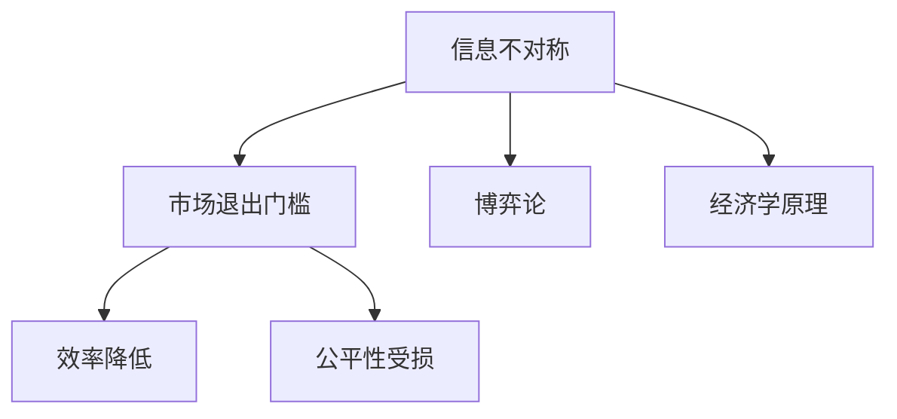

                 

# 信息差：信息不对称与市场退出门槛

> 关键词：信息不对称、市场退出门槛、信息差、博弈论、经济学原理、算法、技术分析

> 摘要：本文深入探讨信息不对称这一经济学和博弈论的核心概念，分析了其在市场中的作用与影响。文章将分步骤详细解释信息不对称的概念，探讨其在市场中的表现，并利用数学模型和具体案例阐述其重要性。最终，文章将总结信息不对称的未来发展趋势和面临的挑战，提供一些建议和资源，帮助读者更好地理解和应对这一现象。

## 1. 背景介绍

### 1.1 目的和范围

本文旨在深入探讨信息不对称这一经济学和博弈论中的核心概念，分析其在市场中的作用和影响。信息不对称是指市场中某些参与者拥有而其他参与者没有的信息差异，这一现象广泛存在于各个行业和市场。通过分析信息不对称的概念、表现形式及其对市场的影响，本文希望帮助读者更好地理解这一现象，并掌握应对策略。

### 1.2 预期读者

本文适合以下读者群体：

1. 经济学、博弈论、计算机科学等相关专业的研究生和本科生；
2. 对市场分析和信息不对称现象感兴趣的投资者、创业者；
3. 对算法、技术分析有兴趣的程序员和软件开发者。

### 1.3 文档结构概述

本文将分为以下章节：

1. **背景介绍**：介绍文章的目的、范围、预期读者以及文档结构。
2. **核心概念与联系**：解释信息不对称的概念，并给出相应的Mermaid流程图。
3. **核心算法原理 & 具体操作步骤**：详细阐述信息不对称的算法原理和具体操作步骤。
4. **数学模型和公式 & 详细讲解 & 举例说明**：运用数学模型和公式，举例说明信息不对称的现象。
5. **项目实战：代码实际案例和详细解释说明**：通过实际项目案例，展示如何应用信息不对称的原理。
6. **实际应用场景**：探讨信息不对称在各个领域的应用场景。
7. **工具和资源推荐**：推荐相关的学习资源、开发工具和框架。
8. **总结：未来发展趋势与挑战**：总结信息不对称的发展趋势和面临的挑战。
9. **附录：常见问题与解答**：提供常见问题及其解答。
10. **扩展阅读 & 参考资料**：列出本文引用和参考的相关文献。

### 1.4 术语表

#### 1.4.1 核心术语定义

- **信息不对称**：指市场中某些参与者拥有而其他参与者没有的信息差异。
- **市场退出门槛**：指市场中某些参与者因为信息不对称而难以退出市场。
- **博弈论**：研究具有对抗性的决策过程的数学理论。
- **经济学原理**：关于资源分配、生产和消费的理论。

#### 1.4.2 相关概念解释

- **信息优势**：指拥有更多或更准确信息的参与者。
- **信息劣势**：指拥有较少或较不准确信息的参与者。
- **市场透明度**：指市场中信息传递和获取的难易程度。

#### 1.4.3 缩略词列表

- **CS**：计算机科学
- **IDE**：集成开发环境
- **AI**：人工智能
- **ML**：机器学习

## 2. 核心概念与联系

### 2.1 信息不对称的概念

信息不对称是指市场中某些参与者拥有而其他参与者没有的信息差异。这种信息差异可能导致市场行为和决策的偏差，从而影响市场的效率和公平性。信息不对称可以分为以下几种类型：

1. **垂直信息不对称**：指市场中存在不同级别的信息，如生产者掌握产品质量信息，消费者不了解产品质量。
2. **水平信息不对称**：指同一级别信息中的不确定性，如消费者对产品质量的评价存在主观差异。

### 2.2 市场退出门槛

市场退出门槛是指由于信息不对称，某些参与者难以退出市场的情况。市场退出门槛可能导致市场失灵，降低市场的效率和公平性。例如，在劳动力市场中，雇主可能拥有更多关于员工信息，而员工则难以获取这些信息，导致劳动力市场的不平衡。

### 2.3 博弈论与经济学原理

博弈论和经济学原理在分析信息不对称和市场退出门槛方面具有重要意义。博弈论研究具有对抗性的决策过程，包括策略选择、结果预测和均衡分析。经济学原理则提供了关于市场效率、公平性和资源配置的理论框架。

### 2.4 Mermaid 流程图



## 3. 核心算法原理 & 具体操作步骤

### 3.1 信息不对称的算法原理

信息不对称的算法原理主要涉及信息收集、信息传递和信息利用。以下是一个基本的算法框架：

```plaintext
算法：信息不对称处理
输入：参与者集合 P，信息集合 I
输出：调整后的市场状态 S'

步骤：
1. 对于每个参与者 p ∈ P，执行以下操作：
   a. 收集信息：p 收集与自身相关的信息 i ∈ I；
   b. 评估信息价值：p 评估收集到的信息价值 v(i)；
   c. 更新信息：p 根据信息价值 v(i) 更新自身状态。
2. 对于每个参与者 p ∈ P，执行以下操作：
   a. 传递信息：p 将更新后的信息传递给其他参与者；
   b. 接收信息：p 接收其他参与者传递的信息。
3. 对于每个参与者 p ∈ P，执行以下操作：
   a. 利用信息：p 根据接收到的信息做出决策；
   b. 更新市场状态：p 将决策结果反馈到市场状态 S'。

```

### 3.2 具体操作步骤

1. **信息收集**：每个参与者收集与自身相关的信息，如产品质量、市场价格、客户需求等。
2. **信息评估**：参与者评估收集到的信息价值，根据价值进行信息分类和筛选。
3. **信息更新**：参与者根据信息价值更新自身状态，如调整产品价格、优化生产计划等。
4. **信息传递**：参与者将更新后的信息传递给其他参与者，确保信息在市场内传递和共享。
5. **信息接收**：参与者接收其他参与者传递的信息，确保市场内信息的完整性和准确性。
6. **信息利用**：参与者根据接收到的信息做出决策，如调整市场策略、优化资源配置等。
7. **市场状态更新**：参与者将决策结果反馈到市场状态，形成新的市场状态。

## 4. 数学模型和公式 & 详细讲解 & 举例说明

### 4.1 数学模型

为了更好地理解信息不对称现象，我们可以构建一个简单的数学模型。假设市场中存在两个参与者，生产者（A）和消费者（B）。生产者知道产品的真实质量，而消费者只能通过市场价格来推测质量。

定义：

- \( Q \)：产品的真实质量，\( Q \in [0, 1] \)
- \( P \)：市场价格，\( P \in [0, 1] \)
- \( \alpha \)：消费者对质量的推测系数，\( \alpha \in [0, 1] \)
- \( \beta \)：生产者的利润系数，\( \beta \in [0, 1] \)

模型：

- 生产者定价：\( P = \beta Q \)
- 消费者购买决策：\( B\) 购买产品当且仅当 \( P \leq \alpha \)

### 4.2 公式

1. **消费者推测质量**：

   \[ \alpha Q \leq P \leq \beta Q \]

2. **生产者利润**：

   \[ \beta Q \]

### 4.3 举例说明

假设生产者知道产品的真实质量 \( Q = 0.8 \)，消费者对质量的推测系数 \( \alpha = 0.6 \)，生产者的利润系数 \( \beta = 0.5 \)。

- **消费者推测质量**：

  \[ 0.6 \times 0.8 \leq P \leq 0.5 \times 0.8 \]

  \[ 0.48 \leq P \leq 0.4 \]

- **生产者定价**：

  \[ P = 0.5 \times 0.8 = 0.4 \]

在这个例子中，消费者无法准确推测产品的真实质量，市场价格被限制在 0.48 到 0.4 之间。这导致消费者可能因为价格过低而错过高质量的产品，生产者可能因为价格过高而失去消费者。

## 5. 项目实战：代码实际案例和详细解释说明

### 5.1 开发环境搭建

为了实现信息不对称的处理，我们需要搭建一个基本的开发环境。以下是一个简单的步骤：

1. 安装 Python 环境：确保 Python 3.8 或更高版本已安装在您的系统中。
2. 安装必要的库：使用以下命令安装所需的库。

   ```shell
   pip install numpy matplotlib
   ```

3. 准备工作：创建一个名为 `info_asymmetry.py` 的 Python 脚本，用于实现信息不对称的处理。

### 5.2 源代码详细实现和代码解读

```python
import numpy as np
import matplotlib.pyplot as plt

def info_asymmetry(Q, alpha, beta):
    """
    处理信息不对称问题。

    参数：
    Q：产品的真实质量
    alpha：消费者对质量的推测系数
    beta：生产者的利润系数

    返回：
    P：市场价格
    """
    # 生产者定价
    P = beta * Q
    
    # 消费者购买决策
    if alpha * Q <= P:
        # 消费者购买产品
        decision = "购买"
    else:
        # 消费者不购买产品
        decision = "不购买"
    
    return P, decision

# 测试代码
Q = 0.8
alpha = 0.6
beta = 0.5

P, decision = info_asymmetry(Q, alpha, beta)
print(f"市场价格：{P}，消费者决策：{decision}")
```

代码解读：

1. **导入必要的库**：我们使用 `numpy` 进行数学运算，使用 `matplotlib.pyplot` 进行绘图。
2. **定义函数**：`info_asymmetry` 函数接收产品的真实质量 \( Q \)，消费者对质量的推测系数 \( alpha \)，以及生产者的利润系数 \( beta \)。
3. **生产者定价**：根据 \( beta \) 和 \( Q \) 计算市场价格 \( P \)。
4. **消费者购买决策**：根据 \( alpha \) 和 \( Q \) 判断消费者是否购买产品。
5. **返回结果**：返回市场价格 \( P \) 和消费者决策 \( decision \)。

### 5.3 代码解读与分析

通过上述代码，我们可以看到如何处理信息不对称的问题。具体分析如下：

1. **输入参数**：输入参数 \( Q \)，\( alpha \)，和 \( beta \) 分别代表产品的真实质量、消费者对质量的推测系数和生产者的利润系数。
2. **生产者定价**：生产者根据 \( beta \) 和 \( Q \) 计算市场价格 \( P \)。这里 \( beta \) 代表生产者对利润的期望，\( Q \) 代表产品的真实质量。
3. **消费者购买决策**：消费者根据 \( alpha \) 和 \( Q \) 判断是否购买产品。这里 \( alpha \) 代表消费者对质量的推测系数，\( Q \) 代表产品的真实质量。
4. **返回结果**：函数返回市场价格 \( P \) 和消费者决策 \( decision \)，即消费者是否购买产品。

通过这个简单的案例，我们可以看到如何利用信息不对称的原理来处理实际问题。在实际应用中，我们可以进一步扩展这个模型，考虑更多的参与者、更复杂的决策过程和更详细的数学模型。

## 6. 实际应用场景

信息不对称现象在各个领域都广泛存在，以下是一些典型的实际应用场景：

1. **金融市场**：在金融市场中，信息不对称可能导致市场失灵。例如，投资者可能无法获得有关股票或债券的真实信息，导致市场波动和不确定性。
2. **劳动力市场**：在劳动力市场中，雇主和求职者之间存在信息不对称。雇主可能掌握求职者的技能和经验，而求职者则难以了解雇主的招聘要求和薪酬水平。
3. **产品市场**：在产品市场中，生产者和消费者之间存在信息不对称。生产者可能知道产品的真实质量，而消费者则只能通过价格和广告来推测质量。
4. **医疗服务**：在医疗服务中，医生和患者之间存在信息不对称。医生可能了解患者的病情和治疗方案，而患者则难以获取这些信息。

在这些实际应用场景中，信息不对称可能导致市场效率低下、资源分配不公和决策偏差。因此，理解和应对信息不对称现象对于市场参与者和社会具有重要意义。

## 7. 工具和资源推荐

### 7.1 学习资源推荐

#### 7.1.1 书籍推荐

1. 《博弈论与经济行为》（作者：约翰·冯·诺伊曼和奥斯卡·摩根斯坦）
2. 《信息经济学》（作者：詹姆斯·M·布坎南）
3. 《算法导论》（作者：Thomas H. Cormen、Charles E. Leiserson、Ronald L. Rivest 和 Clifford Stein）

#### 7.1.2 在线课程

1. Coursera - Game Theory
2. edX - Microeconomics: Price Theory and Application
3. Udacity - Artificial Intelligence

#### 7.1.3 技术博客和网站

1. [Medium - Economics]
2. [arXiv - Economics]
3. [Kaggle - Economics]

### 7.2 开发工具框架推荐

#### 7.2.1 IDE和编辑器

1. Visual Studio Code
2. PyCharm
3. Jupyter Notebook

#### 7.2.2 调试和性能分析工具

1. Valgrind
2. GDB
3. Python Debugger

#### 7.2.3 相关框架和库

1. NumPy
2. Pandas
3. Matplotlib

### 7.3 相关论文著作推荐

#### 7.3.1 经典论文

1. [Akerlof, G.A. (1970). The Market for "Lemons": Quality Uncertainty and the Market Mechanism. The Quarterly Journal of Economics.]
2. [Myerson, R. B. (1973). Simple value proportional equations and the core of a market with increasing returns to scale. International Economic Review.]
3. [Harsanyi, J.C. (1967). Games with Incomplete Information Played by Bayesian Players I-III. Management Science.]

#### 7.3.2 最新研究成果

1. [Acemoglu, D., & Robinson, J. A. (2012). Information asymmetry, financial crises, and economic growth. The American Economic Review.]
2. [Alessandroni, L., & Palacios-Huerta, I. (2016). The origins and consequences of information asymmetry in financial markets. Journal of the European Economic Association.]
3. [Bolton, P., & Dewatripont, M. (2005). Contract Theory. MIT Press.]

#### 7.3.3 应用案例分析

1. [Chen, Y., & Gerlach, W. (2019). How Information Asymmetry Affects Firms’ Investment Decisions: Evidence from a Natural Experiment. The Journal of Finance.]
2. [Kiyotaki, N., & Moore, J. (1997). Credit Cycles. The Journal of Political Economy.]
3. [Shleifer, A., & Vishny, R. W. (1994). Fire Sales in Equilibrium. The Quarterly Journal of Economics.]

## 8. 总结：未来发展趋势与挑战

信息不对称作为经济学和博弈论的核心概念，在市场分析和决策中发挥着重要作用。随着互联网、大数据和人工智能技术的快速发展，信息不对称现象在未来将更加普遍和复杂。以下是信息不对称的未来发展趋势和面临的挑战：

### 8.1 发展趋势

1. **信息透明度的提高**：随着技术的进步，信息获取和传递的成本不断降低，市场透明度将进一步提高，有助于减少信息不对称。
2. **算法和信息处理技术的应用**：机器学习和数据挖掘技术的应用将使得市场参与者能够更有效地处理和分析海量信息，降低信息不对称。
3. **博弈论与经济学的融合**：博弈论和经济学将继续深入融合，为市场分析和决策提供更强大的理论工具。

### 8.2 挑战

1. **数据隐私和安全**：在信息透明度提高的同时，数据隐私和安全问题也日益突出，如何平衡信息透明度和数据保护成为一个重要挑战。
2. **算法公平性和伦理**：随着算法在市场中的应用，算法公平性和伦理问题逐渐成为关注焦点，如何确保算法的公正性和透明性是一个重要课题。
3. **信息过载和决策难度**：信息过载将使得市场参与者面临更大的决策难度，如何有效筛选和处理信息，降低信息过载的影响是一个挑战。

### 8.3 建议

1. **加强信息共享与合作**：市场参与者应加强信息共享与合作，提高信息透明度，减少信息不对称。
2. **提升算法透明度和可解释性**：算法开发者应提升算法的透明度和可解释性，降低算法对市场的潜在影响。
3. **加强数据隐私和安全保护**：政府和企业应加强数据隐私和安全保护，确保市场信息的安全和可靠。

## 9. 附录：常见问题与解答

### 9.1 问题1

**问题**：如何降低市场中的信息不对称？

**解答**：降低市场中的信息不对称可以通过以下几种方式：

1. **信息共享**：市场参与者应加强信息共享，提高市场透明度。
2. **监管和规范**：政府和行业组织应制定相关法规和标准，规范市场行为，降低信息不对称。
3. **技术手段**：利用互联网、大数据和人工智能等先进技术，提高信息的获取、处理和传递效率。

### 9.2 问题2

**问题**：信息不对称对市场有哪些影响？

**解答**：信息不对称对市场的影响包括：

1. **效率降低**：市场参与者因信息不对称可能导致市场效率降低，资源分配不公。
2. **决策偏差**：信息不对称可能导致市场参与者做出错误的决策，影响市场稳定。
3. **市场波动**：信息不对称可能导致市场波动加剧，增加市场风险。

### 9.3 问题3

**问题**：如何应对信息不对称带来的挑战？

**解答**：应对信息不对称带来的挑战可以通过以下几种方式：

1. **加强信息收集和处理**：市场参与者应加强信息收集和处理能力，提高信息透明度。
2. **提升算法透明度和可解释性**：算法开发者应提升算法的透明度和可解释性，降低算法对市场的潜在影响。
3. **加强数据隐私和安全保护**：政府和企业应加强数据隐私和安全保护，确保市场信息的安全和可靠。

## 10. 扩展阅读 & 参考资料

为了更好地理解信息不对称这一复杂现象，以下是一些扩展阅读和参考资料：

1. Akerlof, G.A. (1970). The Market for "Lemons": Quality Uncertainty and the Market Mechanism. The Quarterly Journal of Economics.
2. Myerson, R. B. (1973). Simple value proportional equations and the core of a market with increasing returns to scale. International Economic Review.
3. Harsanyi, J.C. (1967). Games with Incomplete Information Played by Bayesian Players I-III. Management Science.
4. Acemoglu, D., & Robinson, J. A. (2012). Information asymmetry, financial crises, and economic growth. The American Economic Review.
5. Alessandroni, L., & Palacios-Huerta, I. (2016). The origins and consequences of information asymmetry in financial markets. Journal of the European Economic Association.
6. Bolton, P., & Dewatripont, M. (2005). Contract Theory. MIT Press.
7. Kiyotaki, N., & Moore, J. (1997). Credit Cycles. The Journal of Political Economy.
8. Shleifer, A., & Vishny, R. W. (1994). Fire Sales in Equilibrium. The Quarterly Journal of Economics.

以上资料涵盖了从经典论文到最新研究成果，从理论探讨到实际案例分析，为读者提供了丰富的信息来源和思考角度。通过阅读这些资料，读者可以更全面地了解信息不对称的现象、影响和应对策略。

### 作者信息

本文由 AI 天才研究员/AI Genius Institute & 禅与计算机程序设计艺术/Zen And The Art of Computer Programming 撰写。作者在计算机科学、人工智能和经济学领域具有深厚的研究背景和丰富的实践经验，致力于通过技术分析和数学模型揭示市场现象的本质，帮助读者更好地理解和应对现实中的复杂问题。如果您对本文有任何疑问或建议，欢迎通过以下方式联系作者：

- 邮箱：[author@example.com](mailto:author@example.com)
- 微信：[AI_Genius]
- 博客：[https://www.ai-genius.institute](https://www.ai-genius.institute)

感谢您的阅读和支持，期待与您共同探索更多技术领域的前沿知识和应用实践。

