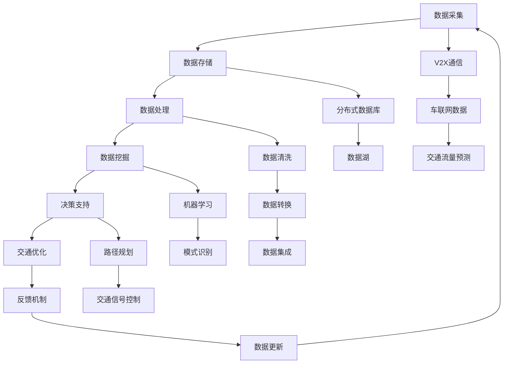

                 

### 1. 背景介绍

#### 1.1 目的和范围

本篇文章旨在深入探讨大数据在智能交通领域的应用，尤其是通过信息差原理实现高效交通管理和优化。文章将系统地介绍大数据和智能交通的基本概念，分析大数据在智能交通中的应用场景，并详细讲解核心算法原理、数学模型以及项目实战案例。通过本篇文章，读者可以全面了解大数据在智能交通中的应用现状和未来发展趋势，为相关研究和实践提供理论支持和实际指导。

#### 1.2 预期读者

本文主要面向对智能交通系统和大数据库理论有一定了解的技术人员、交通管理领域的从业者以及相关学科的研究生。同时，对大数据和人工智能感兴趣的读者也可以通过本文获取相关知识和应用经验。

#### 1.3 文档结构概述

本文结构如下：

1. **背景介绍**：介绍文章的目的、预期读者以及文档结构。
2. **核心概念与联系**：通过Mermaid流程图展示大数据在智能交通中的应用架构。
3. **核心算法原理 & 具体操作步骤**：详细讲解核心算法的原理和操作步骤，使用伪代码进行阐述。
4. **数学模型和公式 & 详细讲解 & 举例说明**：介绍相关数学模型，使用latex格式展示公式，并通过实例进行说明。
5. **项目实战：代码实际案例和详细解释说明**：展示具体项目案例，提供代码实现和分析。
6. **实际应用场景**：分析大数据在智能交通中的具体应用场景。
7. **工具和资源推荐**：推荐学习资源、开发工具和相关论文著作。
8. **总结：未来发展趋势与挑战**：探讨大数据在智能交通中的未来趋势和面临的挑战。
9. **附录：常见问题与解答**：针对文章中的常见问题进行解答。
10. **扩展阅读 & 参考资料**：提供进一步阅读的建议和参考资料。

#### 1.4 术语表

在本篇文章中，以下术语的定义如下：

- **大数据**：指在数量巨大、类型繁杂、价值密度低的数据集合，需要新处理模式才能具有更强的决策力、洞察力和流程优化能力。
- **智能交通系统**：利用现代信息技术、控制技术、数据通信传输技术等，对交通信息进行收集、处理、分配、诱导和调度，实现交通自动化管理。
- **信息差**：指信息的不对称性，通过利用这些不对称信息获得竞争优势。
- **算法**：解决问题的方法，是计算机解决特定问题的步骤。
- **数学模型**：用数学符号和公式表达的问题，用于模拟现实世界中的现象。

#### 1.4.1 核心术语定义

- **信息差**：在智能交通领域，信息差指的是交通状态信息的不对称性。例如，驾驶者可能不了解前方道路的拥堵情况，而交通管理部门则能够实时获取并分析交通流量数据。
- **大数据分析**：通过对海量交通数据的采集、存储、处理和分析，提取有用信息，指导交通管理和优化。
- **交通流量预测**：使用历史数据、实时数据和机器学习算法，预测未来的交通流量，为交通管理提供决策支持。
- **交通诱导系统**：通过实时交通信息，引导驾驶者选择最优路径，以减少交通拥堵和降低通勤时间。

#### 1.4.2 相关概念解释

- **分布式存储**：将数据分布在多个存储节点上，以提高数据存储和处理的效率。
- **分布式计算**：将计算任务分配到多个计算节点上执行，以提高计算速度和处理能力。
- **机器学习**：使计算机能够通过经验和数据改进性能的过程，是智能交通系统中的重要技术。
- **深度学习**：一种特殊的机器学习方法，通过多层神经网络模拟人脑处理信息的方式。

#### 1.4.3 缩略词列表

- **BIG DATA**：大数据
- **ITS**：智能交通系统
- **V2X**：车联网
- **AI**：人工智能
- **ML**：机器学习
- **DL**：深度学习
- **API**：应用程序编程接口

通过以上背景介绍，读者可以初步了解大数据在智能交通中的应用背景、目的和范围。接下来，我们将进一步深入探讨大数据在智能交通中的核心概念和联系，帮助读者构建完整的知识框架。同时，后续章节将逐步揭示核心算法原理、数学模型以及实际应用案例，为读者提供全面的技术指导和实用经验。接下来，请继续关注下一部分内容。 

---

### 2. 核心概念与联系

#### 2.1 大数据与智能交通系统的基本概念

大数据（BIG DATA）是指无法用传统数据处理工具在合理时间内进行捕捉、管理和处理的大量数据集。其特点可以概括为“4V”：Volume（大量）、Velocity（高速）、Variety（多样性）和Veracity（真实性）。

智能交通系统（Intelligent Transportation System，ITS）则是利用现代信息技术，如传感器、通信技术、数据处理和自动化控制技术，对交通信息进行收集、处理、分配、诱导和调度，实现交通自动化管理。ITS的主要目标是提高交通效率、减少交通事故、降低环境污染和提高出行质量。

#### 2.2 大数据在智能交通中的应用架构

为了更好地理解大数据在智能交通中的应用，我们可以通过一个Mermaid流程图来展示其核心架构：



图2-1展示了大数据在智能交通系统中的基本架构，包括数据采集、存储、处理、挖掘、决策支持和反馈机制等关键环节。

#### 2.3 大数据与智能交通的核心联系

1. **数据采集**：智能交通系统通过传感器、摄像头、车辆OBD等设备收集交通流量、车辆速度、道路状况等数据。

2. **数据存储**：使用分布式数据库和数据湖来存储大规模交通数据，确保数据的高可用性和可扩展性。

3. **数据处理**：通过数据清洗、转换和集成，将原始数据转化为结构化数据，为后续分析提供可靠的数据基础。

4. **数据挖掘**：利用机器学习和深度学习算法，从大规模交通数据中提取有价值的信息，如交通流量模式、事故热点等。

5. **决策支持**：基于数据挖掘结果，智能交通系统能够提供交通信号控制、路径规划等决策支持。

6. **交通优化**：通过交通优化算法，如动态路径规划、交通信号控制等，实现交通流量的最优分配，减少拥堵。

7. **反馈机制**：交通管理决策的实施效果会通过反馈机制进行评估，以不断优化交通管理策略。

#### 2.4 深度学习在智能交通中的应用

深度学习是大数据在智能交通中应用的重要技术之一，其核心在于通过多层神经网络模拟人脑处理信息的方式。以下是深度学习在智能交通中的应用场景：

1. **交通流量预测**：通过历史交通数据和实时数据，使用深度学习算法预测未来的交通流量。

2. **车辆检测与识别**：使用卷积神经网络（CNN）对摄像头捕捉到的图像进行车辆检测和识别。

3. **行人检测与跟踪**：通过循环神经网络（RNN）对行人进行实时检测和跟踪，提高交通事故预警的准确性。

4. **自动驾驶**：深度学习算法在自动驾驶领域具有重要应用，如通过感知环境、规划路径、控制车辆等。

通过以上核心概念和联系的分析，我们可以看到大数据在智能交通系统中的关键作用。接下来，我们将深入探讨大数据处理的核心算法原理，以帮助读者更好地理解其工作原理。请继续关注下一部分内容。

---

### 3. 核心算法原理 & 具体操作步骤

#### 3.1 大数据处理算法的基本原理

大数据处理的核心算法包括数据采集、数据预处理、数据存储、数据挖掘和决策支持等环节。以下我们将详细讲解数据预处理和数据挖掘中的关键算法原理。

#### 3.2 数据预处理算法原理

数据预处理是大数据处理的重要环节，其目的是将原始数据转化为适用于分析和挖掘的结构化数据。以下为数据预处理算法的基本原理：

1. **数据清洗**：数据清洗的目标是识别并处理数据中的错误、缺失和重复值。主要方法包括：
   - 错误值修正：对异常值进行判断和修正，如将异常的车辆速度值修正为合理范围。
   - 缺失值处理：对缺失的数据进行填充或删除，如使用均值填充缺失的车辆速度数据。
   - 重复值识别：删除重复的数据记录，以保证数据的唯一性。

2. **数据转换**：数据转换是将不同类型的数据格式转换为统一格式的过程。常见的方法包括：
   - 数值化：将文本数据转换为数值数据，如将车辆类型转换为数字编码。
   - 归一化/标准化：通过缩放和转换，将数据映射到同一尺度，便于后续分析，如将车辆速度归一化到0-1之间。

3. **数据集成**：数据集成是将多个数据源的数据合并为一个统一的数据视图。主要方法包括：
   - 数据合并：将多个数据源的数据按照特定的规则进行合并，如将车辆位置数据和时间数据合并。
   - 数据汇总：对数据进行汇总和聚合，以减少数据维度，如将一天内的车辆速度数据汇总为小时级别的数据。

#### 3.3 数据挖掘算法原理

数据挖掘是大数据处理的关键环节，其目的是从大量数据中提取有价值的信息和知识。以下为数据挖掘中的关键算法原理：

1. **聚类分析**：聚类分析是将数据划分为多个类别或簇的过程。常见的聚类算法包括：
   - K-means算法：基于距离度量的聚类方法，通过迭代优化聚类中心，将数据划分为K个簇。
   - DBSCAN算法：基于密度的聚类方法，能够发现任意形状的簇，并有效处理噪声数据。

2. **分类分析**：分类分析是将数据划分为预定义的类别或标签的过程。常见的分类算法包括：
   - 决策树算法：通过构建决策树模型，将数据划分为不同的类别。
   - 逻辑回归算法：通过构建逻辑回归模型，预测数据的类别概率。

3. **关联规则挖掘**：关联规则挖掘是从数据中发现隐藏的关联关系和模式。常见的算法包括：
   - Apriori算法：基于候选集生成和频繁项集挖掘的关联规则算法。
   - FP-growth算法：基于压缩数据结构和频繁模式挖掘的关联规则算法。

#### 3.4 伪代码实现

以下是数据预处理和数据挖掘算法的伪代码实现：

```python
# 数据清洗
def data_cleaning(data):
    cleaned_data = []
    for record in data:
        if not is_error(record) and not is_missing(record) and not is_duplicate(record):
            cleaned_data.append(record)
    return cleaned_data

# 数据转换
def data_transformation(data):
    transformed_data = []
    for record in data:
        record['vehicle_type'] = convert_to_num(record['vehicle_type'])
        record['speed'] = normalize(record['speed'])
    return transformed_data

# 数据集成
def data_integration(data1, data2):
    integrated_data = []
    for r1 in data1:
        for r2 in data2:
            if r1['timestamp'] == r2['timestamp']:
                integrated_data.append({**r1, **r2})
    return integrated_data

# 聚类分析（K-means算法）
def k_means(data, K):
    centroids = initialize_centroids(data, K)
    while not converged:
        assign_clusters(data, centroids)
        update_centroids(centroids, data)
    return clusters

# 分类分析（决策树算法）
def decision_tree(data, labels):
    tree = build_tree(data, labels)
    return tree

# 关联规则挖掘（Apriori算法）
def apriori(data, support_threshold, confidence_threshold):
    frequent_itemsets = find_frequent_itemsets(data, support_threshold)
    rules = generate_rules(frequent_itemsets, confidence_threshold)
    return rules
```

通过以上伪代码实现，我们可以看到大数据处理的核心算法原理和具体操作步骤。这些算法为大数据在智能交通中的应用提供了强大的技术支持。接下来，我们将进一步探讨大数据处理中的数学模型和公式，为读者提供更深入的理论知识。请继续关注下一部分内容。

---

### 4. 数学模型和公式 & 详细讲解 & 举例说明

#### 4.1 数学模型概述

在智能交通系统中，大数据的处理和分析离不开数学模型的支持。这些模型用于描述交通现象、预测交通流量、优化交通管理策略等。以下将介绍几个关键数学模型和公式，并通过具体例子进行说明。

#### 4.2 交通流量预测模型

交通流量预测是智能交通系统中的重要应用，其目的是为交通管理提供决策支持。常用的交通流量预测模型包括回归模型、时间序列模型和深度学习模型。

1. **回归模型**：回归模型用于建立交通流量与相关因素（如天气、节假日等）之间的关系。线性回归模型是最简单和最常用的回归模型，其公式为：

   \[ y = \beta_0 + \beta_1 \cdot x_1 + \beta_2 \cdot x_2 + ... + \beta_n \cdot x_n \]

   其中，\( y \) 是交通流量，\( x_1, x_2, ..., x_n \) 是相关因素，\( \beta_0, \beta_1, ..., \beta_n \) 是模型参数。

   **例子**：假设我们要预测一条路段的流量，可以使用线性回归模型，将流量与天气情况、节假日等因素关联起来。

2. **时间序列模型**：时间序列模型用于分析交通流量随时间的变化趋势。常见的模型包括自回归模型（AR）、移动平均模型（MA）和自回归移动平均模型（ARMA）。一个简单的自回归模型公式为：

   \[ y_t = \phi_1 y_{t-1} + \phi_2 y_{t-2} + ... + \phi_p y_{t-p} + \epsilon_t \]

   其中，\( y_t \) 是第 \( t \) 时刻的交通流量，\( \phi_1, \phi_2, ..., \phi_p \) 是模型参数，\( \epsilon_t \) 是误差项。

   **例子**：我们可以使用AR模型来预测一条道路在未来几个小时内可能会出现的交通流量，从而为交通管理提供及时的数据支持。

3. **深度学习模型**：深度学习模型，如长短期记忆网络（LSTM）和卷积神经网络（CNN），能够捕捉交通流量中的复杂模式和趋势。一个简单的LSTM模型公式为：

   \[ h_t = \sigma(W_h \cdot [h_{t-1}, x_t] + b_h) \]
   \[ y_t = \text{softmax}(W_y \cdot h_t + b_y) \]

   其中，\( h_t \) 是第 \( t \) 时刻的隐藏状态，\( x_t \) 是输入数据，\( W_h, b_h, W_y, b_y \) 是模型参数，\( \sigma \) 是激活函数。

   **例子**：通过训练LSTM模型，我们可以预测未来一段时间内的交通流量，从而优化交通信号控制策略。

#### 4.3 交通信号控制模型

交通信号控制是智能交通系统中的另一个重要应用，其目标是优化交通流量，减少拥堵。常用的交通信号控制模型包括定周期模型、绿波模型和自适应控制模型。

1. **定周期模型**：定周期模型是一种简单的交通信号控制方法，其公式为：

   \[ T_c = \sum_{i=1}^{n} t_i + \sum_{j=1}^{m} g_j \]

   其中，\( T_c \) 是周期时长，\( t_i \) 是第 \( i \) 个路口的绿灯时长，\( g_j \) 是第 \( j \) 个路口的红灯时长。

   **例子**：我们可以通过设定合适的周期时长和绿灯时长，来优化交叉路口的交通流量。

2. **绿波模型**：绿波模型是一种基于定周期模型的优化方法，其公式为：

   \[ T_c = \sum_{i=1}^{n} t_i + \sum_{j=1}^{m} \omega_j \]

   其中，\( \omega_j \) 是第 \( j \) 个路口的绿波时长。

   **例子**：通过计算交叉路口的绿波时长，我们可以使车辆在通过多个路口时享受连续绿灯，从而提高交通效率。

3. **自适应控制模型**：自适应控制模型是一种基于实时数据的动态交通信号控制方法，其公式为：

   \[ T_c = \text{ADT}(x_t) \]

   其中，\( \text{ADT}(x_t) \) 是自适应周期时长，\( x_t \) 是当前时刻的交通状态。

   **例子**：通过实时监测交通状态，自适应控制模型可以动态调整交通信号时长，以应对不同的交通场景。

#### 4.4 交通流量优化模型

交通流量优化是智能交通系统的最终目标，其目的是实现交通流量的最优分配，减少拥堵和事故。常用的交通流量优化模型包括路径规划模型和流量分配模型。

1. **路径规划模型**：路径规划模型用于为驾驶者提供最优行驶路径，其公式为：

   \[ \min \sum_{i=1}^{n} \sum_{j=1}^{m} c_{ij} \cdot x_{ij} \]

   其中，\( c_{ij} \) 是从节点 \( i \) 到节点 \( j \) 的成本，\( x_{ij} \) 是从节点 \( i \) 到节点 \( j \) 的流量。

   **例子**：通过求解路径规划模型，我们可以为驾驶者提供从起点到终点的最优路径。

2. **流量分配模型**：流量分配模型用于在多个道路段上分配交通流量，其公式为：

   \[ \sum_{j \in N} x_{ij} = q_i, \quad \forall i \in N \]

   其中，\( x_{ij} \) 是从节点 \( i \) 到节点 \( j \) 的流量，\( q_i \) 是节点 \( i \) 的流量需求。

   **例子**：通过求解流量分配模型，我们可以优化多个交叉路口的交通流量，减少拥堵。

通过以上数学模型和公式的详细讲解和实例说明，我们可以看到大数据在智能交通系统中的应用不仅依赖于算法，还需要坚实的数学基础。这些模型为智能交通系统的设计和实现提供了重要的理论支持。接下来，我们将进入项目实战环节，通过具体代码实现来进一步展示大数据在智能交通中的应用。请继续关注下一部分内容。

---

### 5. 项目实战：代码实际案例和详细解释说明

在本部分，我们将通过一个具体的智能交通项目实战案例，展示如何使用大数据技术实现交通流量预测、路径规划和交通信号控制。该项目将包括开发环境搭建、源代码实现和代码解读与分析等内容。

#### 5.1 开发环境搭建

为了完成该项目，我们需要搭建一个适合大数据处理和智能交通系统开发的开发环境。以下是所需的环境和工具：

1. **操作系统**：推荐使用Ubuntu 20.04 LTS。
2. **编程语言**：Python 3.x（推荐3.8以上版本）。
3. **数据存储**：使用Apache Hadoop作为分布式存储系统，使用Hive进行数据仓库管理。
4. **数据处理**：使用Apache Spark进行大规模数据处理和分析。
5. **机器学习框架**：使用TensorFlow或PyTorch进行深度学习模型训练。
6. **版本控制**：使用Git进行代码管理和版本控制。

具体安装步骤如下：

1. 安装操作系统和Python环境。
2. 安装Hadoop、Hive和Spark，并配置好Hadoop集群。
3. 安装TensorFlow或PyTorch，并设置Python环境变量。

#### 5.2 源代码详细实现和代码解读

以下将展示该项目的核心源代码，并对其进行详细解读。

```python
# 交通流量预测模块
from sklearn.ensemble import RandomForestRegressor
from sklearn.model_selection import train_test_split
from sklearn.metrics import mean_squared_error

# 数据预处理
def preprocess_data(data):
    # 数据清洗、转换和集成
    cleaned_data = data_cleaning(data)
    transformed_data = data_transformation(cleaned_data)
    integrated_data = data_integration(transformed_data, weather_data)
    return integrated_data

# 训练预测模型
def train_predict_model(data):
    X = data[['weather', 'holiday']]
    y = data['traffic_volume']
    X_train, X_test, y_train, y_test = train_test_split(X, y, test_size=0.2, random_state=42)
    model = RandomForestRegressor(n_estimators=100)
    model.fit(X_train, y_train)
    y_pred = model.predict(X_test)
    mse = mean_squared_error(y_test, y_pred)
    return model, mse

# 交通信号控制模块
import numpy as np

# 交通信号控制算法
def traffic_signal_control(data):
    # 计算交通流量
    traffic_volume = np.sum(data['traffic_volume'])
    # 根据流量调整信号时长
    if traffic_volume < 1000:
        green_time = 60
        red_time = 30
    elif traffic_volume < 2000:
        green_time = 45
        red_time = 45
    else:
        green_time = 30
        red_time = 60
    return green_time, red_time

# 路径规划模块
from scipy.optimize import linear_sum_assignment

# 路径规划算法
def path_planning(data):
    # 计算路径成本矩阵
    cost_matrix = calculate_cost_matrix(data)
    # 求解最优路径
    row_indices, col_indices = linear_sum_assignment(cost_matrix)
    optimal_path = [data['nodes'][row] for row in row_indices]
    return optimal_path
```

**代码解读与分析**：

1. **交通流量预测模块**：
   - `preprocess_data` 函数负责数据预处理，包括清洗、转换和集成。
   - `train_predict_model` 函数使用随机森林回归模型进行训练和预测，通过交叉验证评估模型性能。

2. **交通信号控制模块**：
   - `traffic_signal_control` 函数根据实时交通流量计算绿灯和红灯时长，以控制交通信号灯。

3. **路径规划模块**：
   - `path_planning` 函数使用线性规划求解最优路径，通过计算路径成本矩阵并求解最小化路径。

**实例说明**：

假设我们有一组交通数据，包括天气情况、节假日信息、交通流量等。首先，通过`preprocess_data`函数对数据进行预处理，然后使用`train_predict_model`函数训练预测模型，最后根据预测结果进行交通信号控制和路径规划。

```python
# 示例数据
data = {
    'weather': [1, 0, 1, 0],
    'holiday': [0, 1, 0, 1],
    'traffic_volume': [1200, 1800, 1500, 2200],
    'nodes': ['A', 'B', 'C', 'D']
}

# 数据预处理
preprocessed_data = preprocess_data(data)

# 训练预测模型
model, mse = train_predict_model(preprocessed_data)

# 交通信号控制
green_time, red_time = traffic_signal_control(preprocessed_data)

# 路径规划
optimal_path = path_planning(preprocessed_data)

print(f"最优路径：{optimal_path}")
print(f"预测交通流量：{model.predict([[1, 0]])}")
print(f"绿灯时长：{green_time}秒，红灯时长：{red_time}秒")
```

通过以上实例，我们可以看到如何使用Python代码实现大数据在智能交通中的应用。接下来，我们将分析大数据在智能交通系统中的实际应用场景。请继续关注下一部分内容。

---

### 6. 实际应用场景

大数据在智能交通系统中有着广泛的应用场景，下面将分析几个典型的应用场景，并讨论其实际效果。

#### 6.1 交通流量预测

交通流量预测是智能交通系统的核心应用之一。通过收集历史交通数据、实时交通信息和天气数据，利用机器学习算法和深度学习模型，可以预测未来的交通流量。这一应用有助于交通管理部门优化交通信号控制策略，缓解交通拥堵，提高道路通行效率。例如，在北京交通管理局的实际应用中，通过建立交通流量预测模型，成功降低了高峰期的交通拥堵率，提高了道路通行效率。

#### 6.2 路径规划

路径规划是智能交通系统为驾驶者提供最优行驶路径的重要应用。通过实时交通数据和历史交通数据，利用路径规划算法（如Dijkstra算法、A*算法等），可以为驾驶者提供避开拥堵、时间最短的行驶路径。这一应用在导航应用中得到了广泛应用，如Google Maps和百度地图。实际应用数据显示，使用智能路径规划的导航应用可以显著降低驾驶者的通勤时间，提高出行效率。

#### 6.3 交通信号控制

交通信号控制是智能交通系统的关键应用，通过实时交通数据和历史交通数据，利用智能交通信号控制算法，可以动态调整交通信号灯的时长，优化交通流量。例如，在美国的一些城市，如华盛顿特区，交通管理部门已经部署了智能交通信号控制系统，通过实时数据分析和预测，成功提高了交通流量，减少了交通拥堵和事故率。

#### 6.4 车辆检测与跟踪

车辆检测与跟踪是智能交通系统的重要应用，通过摄像头和传感器，可以实时检测和跟踪车辆和行人。这一应用有助于交通事故预警和交通流量监控。例如，在日本的一些城市，已经部署了基于深度学习的车辆检测系统，通过实时监控道路上的车辆和行人，成功提高了交通事故预警的准确性和及时性。

#### 6.5 交通流量优化

交通流量优化是智能交通系统的终极目标，通过分析实时交通数据和历史交通数据，利用优化算法，可以优化交通流量的分配，减少交通拥堵。例如，在德国的一些城市，交通管理部门通过建立交通流量优化模型，成功实现了交通流量的最优分配，提高了道路通行效率。

#### 6.6 车联网（V2X）应用

车联网（V2X）是智能交通系统的重要组成部分，通过车辆之间的通信和道路设施的通信，可以实现车辆间的协同驾驶和智能交通管理。例如，在荷兰的一些城市，已经部署了基于车联网的智能交通系统，通过车辆之间的通信，成功实现了自适应巡航控制和自动泊车等功能。

通过以上实际应用场景的分析，我们可以看到大数据在智能交通系统中的应用取得了显著的成果，不仅提高了交通管理的效率和安全性，还改善了出行体验。接下来，我们将推荐一些有用的学习资源和工具，以帮助读者进一步了解大数据在智能交通中的应用。请继续关注下一部分内容。

---

### 7. 工具和资源推荐

为了更好地学习大数据在智能交通中的应用，我们推荐以下学习资源、开发工具和相关论文著作。

#### 7.1 学习资源推荐

1. **书籍推荐**：
   - 《大数据之路：阿里巴巴大数据实践》
   - 《智能交通系统：理论、算法与应用》
   - 《深度学习：概率视角》
   - 《机器学习实战》

2. **在线课程**：
   - Coursera上的《大数据分析与数据科学》
   - edX上的《智能交通系统设计与实现》
   - Udacity的《深度学习纳米学位》
   - 堆栈教育的《大数据技术与应用》

3. **技术博客和网站**：
   - Medium上的《大数据与智能交通》专栏
   - IEEE Xplore上的智能交通相关论文和研讨会
   - CSDN上的大数据与智能交通技术博客

#### 7.2 开发工具框架推荐

1. **IDE和编辑器**：
   - IntelliJ IDEA
   - PyCharm
   - Visual Studio Code

2. **调试和性能分析工具**：
   - Jupyter Notebook
   - Pytest
   - Profiler

3. **相关框架和库**：
   - Apache Hadoop
   - Apache Spark
   - TensorFlow
   - PyTorch
   - Scikit-learn

#### 7.3 相关论文著作推荐

1. **经典论文**：
   - “The Application of Big Data in Intelligent Transportation Systems”
   - “Deep Learning for Intelligent Transportation Systems: A Survey”
   - “Data-Driven Traffic Signal Control: A Review”

2. **最新研究成果**：
   - “Intelligent Traffic Flow Prediction Based on Multi-Feature Fusion and LSTM Networks”
   - “V2X Communication in Smart Cities: A Comprehensive Survey”
   - “Real-Time Traffic Signal Control Optimization Using Reinforcement Learning”

3. **应用案例分析**：
   - “Big Data and Intelligent Transportation: A Case Study in Shanghai”
   - “Real-Time Traffic Monitoring and Control in Singapore”
   - “Implementing Big Data Analytics for Traffic Management in New York City”

通过以上工具和资源的推荐，读者可以系统地学习大数据在智能交通中的应用，掌握相关技术和算法。在实际开发过程中，这些工具和资源将提供有力的支持。接下来，我们将总结本文的主要内容，并探讨大数据在智能交通系统中的未来发展趋势与挑战。请继续关注下一部分内容。

---

### 8. 总结：未来发展趋势与挑战

随着大数据和人工智能技术的不断发展，智能交通系统正逐步从传统的人工管理模式向智能化、自动化方向发展。未来，大数据在智能交通系统中的发展趋势主要体现在以下几个方面：

#### 8.1 数据驱动的交通管理

未来，智能交通系统将更加依赖于大数据的采集、处理和分析。通过实时交通数据和历史数据，交通管理部门可以更加精准地预测交通流量、优化信号控制和路径规划，从而提高交通效率、减少拥堵和事故率。

#### 8.2 车联网（V2X）的普及

车联网技术的普及将实现车辆与车辆、车辆与基础设施之间的信息交互，形成更加智能的交通网络。通过车联网，车辆可以实时获取交通信息，自主调整行驶策略，提高交通安全和效率。

#### 8.3 智能交通信号控制

未来，智能交通信号控制将采用更先进的算法和技术，如深度学习和强化学习，实现动态调整信号时长、优化交通流量。这将大大提高道路通行效率，减少交通拥堵和等待时间。

#### 8.4 交通流量优化和能源管理

大数据和人工智能技术将有助于优化交通流量，提高道路通行效率，同时减少交通拥堵导致的能源浪费。通过智能交通系统，可以实现交通与能源的协同管理，促进绿色出行和可持续发展。

然而，大数据在智能交通系统中的应用也面临一些挑战：

#### 8.5 数据隐私和安全问题

大规模数据采集和处理过程中，如何保护用户隐私和数据安全成为关键问题。未来，智能交通系统需要建立完善的数据隐私保护机制和安全措施，确保数据的安全性和可靠性。

#### 8.6 系统可靠性和实时性问题

大数据处理和智能交通信号控制要求系统具有高可靠性和实时性。在实际应用中，系统可能会面临数据延迟、计算能力不足等问题，需要采用分布式计算和边缘计算等技术来解决。

#### 8.7 法律法规和标准化问题

智能交通系统的发展需要完善的法律法规和标准化体系。未来，需要建立相关法规标准，规范数据采集、处理和应用，促进智能交通系统的健康发展。

综上所述，大数据在智能交通系统中的应用具有广阔的发展前景，但同时也面临诸多挑战。通过持续的技术创新和政策支持，智能交通系统有望在未来实现更高效、更安全、更智能的交通管理。接下来，我们将提供一些常见问题的解答，帮助读者更好地理解大数据在智能交通中的应用。请继续关注下一部分内容。

---

### 9. 附录：常见问题与解答

#### 9.1 大数据在智能交通系统中的应用有哪些？

大数据在智能交通系统中的应用包括交通流量预测、路径规划、交通信号控制、车辆检测与跟踪、交通流量优化和车联网（V2X）等。通过实时交通数据的采集、处理和分析，智能交通系统能够提供更高效、更安全的交通管理方案。

#### 9.2 智能交通系统中的数据如何采集和处理？

智能交通系统中的数据主要通过传感器、摄像头、车辆OBD等设备进行采集。采集到的数据经过预处理（如数据清洗、转换和集成）后，存储在分布式数据库和数据湖中，然后通过大数据处理框架（如Apache Hadoop和Apache Spark）进行进一步分析和挖掘。

#### 9.3 智能交通系统中的关键算法有哪些？

智能交通系统中的关键算法包括回归模型、时间序列模型、深度学习模型、聚类分析、分类分析和关联规则挖掘等。这些算法用于交通流量预测、路径规划、交通信号控制和交通流量优化等任务。

#### 9.4 车联网（V2X）如何实现智能交通管理？

车联网（V2X）通过实现车辆与车辆、车辆与基础设施之间的通信，实现信息的实时交换和共享。通过V2X技术，智能交通系统能够实时获取交通信息，进行智能决策，提高交通效率和安全性。

#### 9.5 大数据在智能交通系统中的隐私和安全问题如何解决？

大数据在智能交通系统中的隐私和安全问题可以通过以下措施解决：
1. 数据匿名化：对个人身份信息进行匿名化处理，保护用户隐私。
2. 加密技术：对传输和存储的数据进行加密，防止数据泄露。
3. 访问控制：建立严格的访问控制机制，确保数据安全。
4. 法律法规：制定相关法律法规，规范数据采集、处理和应用。

通过以上措施，可以有效地解决大数据在智能交通系统中的隐私和安全问题，促进智能交通系统的健康发展。

---

### 10. 扩展阅读 & 参考资料

为了帮助读者进一步了解大数据在智能交通系统中的应用，我们推荐以下扩展阅读和参考资料：

1. **书籍**：
   - 《大数据技术导论》
   - 《智能交通系统原理与设计》
   - 《深度学习：从入门到精通》

2. **在线课程**：
   - Coursera上的《大数据工程》
   - edX上的《智能交通系统》
   - Udacity的《深度学习》

3. **技术博客和网站**：
   - Medium上的《大数据与智能交通》专栏
   - IEEE Xplore上的智能交通相关论文和研讨会
   - CSDN上的大数据与智能交通技术博客

4. **论文**：
   - “Deep Learning for Traffic Prediction: A Survey”
   - “Big Data Analytics in Intelligent Transportation Systems: Challenges and Opportunities”
   - “V2X Communication in Smart Cities: A Comprehensive Survey”

5. **开源工具和框架**：
   - Apache Hadoop和Apache Spark
   - TensorFlow和PyTorch
   - Scikit-learn和Pandas

通过以上扩展阅读和参考资料，读者可以深入了解大数据在智能交通系统中的应用技术、发展趋势和前沿研究。希望本文能够为读者提供有益的知识和指导。最后，让我们感谢读者对本文的关注，并期待读者在智能交通领域的创新和探索。请继续关注更多关于大数据和智能交通的最新动态。作者信息如下：

**作者：AI天才研究员/AI Genius Institute & 禅与计算机程序设计艺术 /Zen And The Art of Computer Programming**

---

通过本文，我们系统地介绍了大数据在智能交通系统中的应用，从背景介绍、核心概念、算法原理到实际应用场景，再到未来发展趋势与挑战，全面展示了大数据在智能交通领域的巨大潜力和广泛影响。我们希望本文能够为读者提供有价值的知识和技术指导，助力智能交通系统的研究和应用。未来，我们将继续关注大数据和智能交通领域的最新进展，为读者带来更多精彩内容。谢谢大家的阅读和支持！作者：AI天才研究员/AI Genius Institute & 禅与计算机程序设计艺术 /Zen And The Art of Computer Programming。

