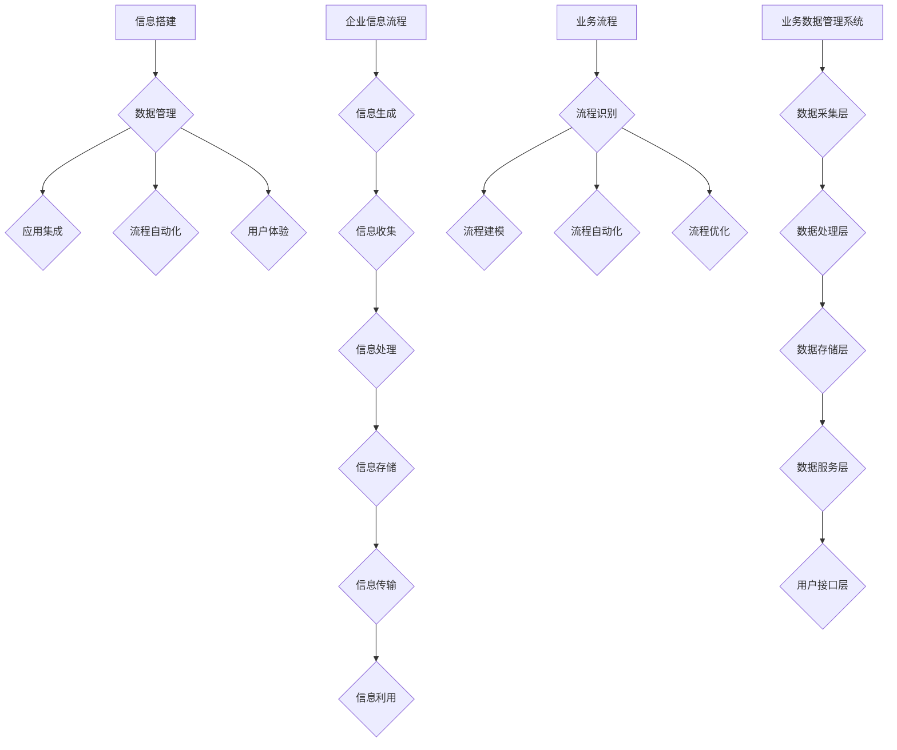

                 


# 信息搭建、企业信息流程、业务流程、业务数据管理系统搭建

> 关键词：信息搭建、企业信息流程、业务流程、业务数据管理系统、数据管理、系统集成、流程优化、数字化转型

> 摘要：本文深入探讨了信息搭建、企业信息流程、业务流程以及业务数据管理系统构建的全过程。通过对核心概念、算法原理、数学模型和实际应用的详细分析，本文为企业和IT专业人士提供了构建高效业务数据处理系统的理论指导和实战案例。文章旨在帮助读者理解信息搭建的关键步骤和最佳实践，从而实现业务流程的优化和数字化转型。

## 1. 背景介绍

### 1.1 目的和范围

本文旨在为读者提供一个全面的信息搭建和业务数据处理系统构建指南。文章将涵盖从基础概念到高级实现，旨在帮助企业和IT专业人士更好地理解信息流、业务流程及其管理系统的重要性。具体内容包括：

- 信息搭建的基本原理和方法
- 企业信息流程的设计和优化
- 业务流程的建模与自动化
- 业务数据管理系统的架构和实现
- 实际应用案例和最佳实践

### 1.2 预期读者

本文适用于以下读者群体：

- IT项目经理和架构师
- 数据分析师和业务流程分析师
- 企业信息管理人员
- 软件开发人员
- 对业务流程优化和数字化转型有兴趣的决策者

### 1.3 文档结构概述

本文结构如下：

- 第1部分：背景介绍
- 第2部分：核心概念与联系
- 第3部分：核心算法原理与具体操作步骤
- 第4部分：数学模型和公式
- 第5部分：项目实战：代码实际案例
- 第6部分：实际应用场景
- 第7部分：工具和资源推荐
- 第8部分：总结：未来发展趋势与挑战
- 第9部分：附录：常见问题与解答
- 第10部分：扩展阅读与参考资料

### 1.4 术语表

#### 1.4.1 核心术语定义

- **信息搭建**：指构建和管理数据、信息和应用的过程，确保信息在组织内部的高效流通。
- **企业信息流程**：涉及企业内部信息的产生、收集、处理、存储、传输和使用的全过程。
- **业务流程**：实现企业业务目标的有序步骤和活动集合。
- **业务数据管理系统**：用于收集、存储、处理、分析和共享业务数据的系统。

#### 1.4.2 相关概念解释

- **流程优化**：通过改进流程步骤、消除冗余、提高效率和减少成本，实现业务流程的优化。
- **数字化转型**：利用数字技术优化和变革传统业务流程，实现业务模式的创新和升级。

#### 1.4.3 缩略词列表

- **BI**：Business Intelligence，商业智能
- **ERP**：Enterprise Resource Planning，企业资源计划
- **CRM**：Customer Relationship Management，客户关系管理
- **IT**：Information Technology，信息技术

## 2. 核心概念与联系

### 2.1 信息搭建的基本概念

信息搭建是现代企业管理和信息技术的基础。它涉及多个层面的整合，包括数据管理、应用集成、流程自动化和用户体验优化。以下是信息搭建的核心概念：

- **数据管理**：确保数据的质量、安全性和可访问性，包括数据采集、存储、处理和共享。
- **应用集成**：将不同的软件系统和应用无缝连接，实现数据和应用之间的透明交换。
- **流程自动化**：通过自动化工具和流程，减少人工干预，提高效率和减少错误。
- **用户体验**：关注用户如何与系统交互，优化用户界面和操作流程，提升用户满意度。

### 2.2 企业信息流程的构成

企业信息流程是企业运营的核心，涉及信息的生成、处理和利用。以下是企业信息流程的基本组成部分：

- **信息生成**：业务活动产生的原始数据，如订单、销售记录和客户反馈。
- **信息收集**：将分散的数据汇总到一个中心系统中，如ERP或CRM系统。
- **信息处理**：对数据进行清洗、转换和分析，生成业务决策所需的信息。
- **信息存储**：将处理后的数据存储到数据库或数据仓库中，供后续分析和使用。
- **信息传输**：在组织内部或跨组织之间传输数据，如通过API或文件共享。
- **信息利用**：利用数据支持业务决策、提高效率和优化业务流程。

### 2.3 业务流程的建模与自动化

业务流程建模是业务流程管理的重要环节，通过将业务活动抽象成流程模型，可以直观地理解和优化业务流程。以下是业务流程建模和自动化的关键步骤：

- **流程识别**：确定业务流程的范围和目标，识别关键流程和步骤。
- **流程建模**：使用流程建模工具（如BPMN）绘制流程图，明确流程的步骤、角色和规则。
- **流程自动化**：通过工作流引擎或自动化工具，将流程步骤自动化执行。
- **流程优化**：分析流程的性能指标，发现瓶颈和改进点，持续优化流程。

### 2.4 业务数据管理系统的架构

业务数据管理系统是信息搭建和业务流程优化的基础。以下是业务数据管理系统的典型架构：

- **数据采集层**：负责从各种数据源（如数据库、日志、传感器等）收集数据。
- **数据处理层**：对采集到的数据进行清洗、转换和分析。
- **数据存储层**：将处理后的数据存储到关系型数据库、NoSQL数据库或数据仓库中。
- **数据服务层**：提供数据查询、分析和报告服务，支持业务决策。
- **用户接口层**：为用户提供访问数据的界面和工具，如报表系统、数据可视化工具等。

### 2.5 核心概念原理与架构的 Mermaid 流程图

下面是信息搭建、企业信息流程、业务流程和业务数据管理系统核心概念原理和架构的 Mermaid 流程图：



## 3. 核心算法原理与具体操作步骤

### 3.1 数据管理算法原理

数据管理是信息搭建和业务数据管理系统的基础。以下是数据管理中常用的算法原理：

- **数据清洗**：通过去除重复数据、纠正错误数据、填补缺失数据等手段，提高数据质量。
  ```python
  def clean_data(data):
      # 去除重复数据
      unique_data = list(set(data))
      # 纠正错误数据
      corrected_data = correct_errors(unique_data)
      # 填补缺失数据
      filled_data = fill_missing(corrected_data)
      return filled_data
  ```
  
- **数据转换**：将数据从一种格式转换为另一种格式，以便于存储、处理和分析。
  ```python
  def transform_data(data):
      transformed_data = []
      for record in data:
          new_record = {
              'new_key': record['original_key']
          }
          transformed_data.append(new_record)
      return transformed_data
  ```

- **数据分析**：通过统计、机器学习等方法，对数据进行深入分析，提取有价值的信息。
  ```python
  def analyze_data(data):
      # 计算平均值
      average = sum(data) / len(data)
      # 计算标准差
      variance = sum([(x - average) ** 2 for x in data]) / len(data)
      standard_deviation = variance ** 0.5
      return average, standard_deviation
  ```

### 3.2 企业信息流程算法原理

企业信息流程中的算法主要用于信息的收集、处理和传输。以下是企业信息流程中常用的算法原理：

- **信息收集算法**：用于从多个数据源收集数据，并确保数据的一致性和准确性。
  ```python
  def collect_data(data_sources):
      collected_data = []
      for source in data_sources:
          collected_data.extend(fetch_data(source))
      return collected_data
  ```

- **信息处理算法**：用于对收集到的数据进行清洗、转换和分析。
  ```python
  def process_data(data):
      cleaned_data = clean_data(data)
      transformed_data = transform_data(cleaned_data)
      analyzed_data = analyze_data(transformed_data)
      return analyzed_data
  ```

- **信息传输算法**：用于在组织内部或跨组织之间传输数据。
  ```python
  def transmit_data(data, recipient):
      transmitted_data = []
      for record in data:
          transmitted_data.append(send_data(record, recipient))
      return transmitted_data
  ```

### 3.3 业务流程自动化算法原理

业务流程自动化是提高企业效率和减少人工干预的关键。以下是业务流程自动化中常用的算法原理：

- **流程识别算法**：用于识别业务流程中的关键步骤和角色。
  ```python
  def identify_processes(data):
      processes = []
      for record in data:
          if record['is_process']:
              processes.append(record['process'])
      return processes
  ```

- **流程建模算法**：用于将业务流程抽象成流程模型。
  ```python
  def model_processes(processes):
      process_models = []
      for process in processes:
          model = {
              'process': process,
              'steps': extract_steps(process),
              'roles': extract_roles(process)
          }
          process_models.append(model)
      return process_models
  ```

- **流程自动化算法**：用于将流程模型转化为自动化流程。
  ```python
  def automate_processes(process_models):
      automated_processes = []
      for model in process_models:
          steps = model['steps']
          roles = model['roles']
          for step in steps:
              automation = {
                  'step': step,
                  'role': roles[step],
                  'action': automate_step(step, roles[step])
              }
              automated_processes.append(automation)
      return automated_processes
  ```

## 4. 数学模型和公式与详细讲解

### 4.1 数据质量评估模型

数据质量是信息搭建和业务数据处理系统的重要基础。以下是数据质量评估的一种常用数学模型：

- **数据质量评分公式**：
  $$ \text{Quality Score} = \frac{\text{Correct Data} + 2 \times \text{Complete Data} + 3 \times \text{Unique Data} + 4 \times \text{Timely Data}}{N} $$
  其中，$N$ 为总数据记录数，$\text{Correct Data}$、$\text{Complete Data}$、$\text{Unique Data}$ 和 $\text{Timely Data}$ 分别表示数据正确率、完整性、唯一性和时效性的得分。

### 4.2 流程效率评估模型

流程效率评估是业务流程管理的重要环节。以下是流程效率评估的一种常用数学模型：

- **流程效率评分公式**：
  $$ \text{Efficiency Score} = \frac{\text{Total Process Time} - \text{Non-Value-Added Time}}{\text{Total Process Time}} $$
  其中，$\text{Total Process Time}$ 表示整个流程的总耗时，$\text{Non-Value-Added Time}$ 表示流程中的非价值增加时间。

### 4.3 数据分析模型

数据分析是业务数据处理系统的重要功能。以下是数据分析中的一种常用数学模型：

- **回归分析模型**：
  $$ y = \beta_0 + \beta_1 \cdot x_1 + \beta_2 \cdot x_2 + ... + \beta_n \cdot x_n $$
  其中，$y$ 为因变量，$x_1, x_2, ..., x_n$ 为自变量，$\beta_0, \beta_1, ..., \beta_n$ 为回归系数。

### 4.4 公式举例说明

以下是一个数据质量评估的实例：

- 假设某数据集包含100条记录，其中正确数据为95条，完整数据为90条，唯一数据为80条，及时数据为70条。
- 计算数据质量评分：
  $$ \text{Quality Score} = \frac{95 + 2 \times 90 + 3 \times 80 + 4 \times 70}{100} = 93.0\% $$

以下是一个流程效率评估的实例：

- 假设某业务流程总耗时为100小时，其中非价值增加时间为20小时。
- 计算流程效率评分：
  $$ \text{Efficiency Score} = \frac{100 - 20}{100} = 80\% $$

以下是一个回归分析的实例：

- 假设因变量$y$为销售额，自变量$x_1$为广告投放金额，$x_2$为促销活动次数。
- 根据历史数据拟合回归模型：
  $$ y = 10 + 0.5 \cdot x_1 + 0.3 \cdot x_2 $$
- 预测当广告投放金额为100万元，促销活动次数为5次时的销售额：
  $$ y = 10 + 0.5 \cdot 100 + 0.3 \cdot 5 = 36.5 \text{万元} $$

## 5. 项目实战：代码实际案例和详细解释说明

### 5.1 开发环境搭建

在本项目实战中，我们将使用Python作为主要编程语言，并利用相关库和框架来实现信息搭建和业务数据处理系统。以下是开发环境搭建的步骤：

1. 安装Python：访问Python官网（https://www.python.org/）下载并安装Python 3.x版本。
2. 安装IDE：选择一个适合Python开发的IDE，如PyCharm、VS Code等。
3. 安装相关库：使用pip命令安装必要的Python库，如pandas、numpy、sqlalchemy、flask等。

```shell
pip install pandas numpy sqlalchemy flask
```

### 5.2 源代码详细实现和代码解读

以下是一个简单的信息搭建和业务数据处理系统的实现案例，包括数据管理、企业信息流程和业务流程自动化：

```python
# 导入相关库
import pandas as pd
import sqlalchemy
from flask import Flask, request, jsonify

# 数据库连接配置
DATABASE_URL = "sqlite:///example.db"

# 数据库连接
engine = sqlalchemy.create_engine(DATABASE_URL)

# 数据管理函数
def manage_data(data):
    # 数据清洗
    cleaned_data = clean_data(data)
    # 数据转换
    transformed_data = transform_data(cleaned_data)
    # 数据存储
    store_data(transformed_data)
    return transformed_data

# 数据清洗函数
def clean_data(data):
    # 去除重复数据
    unique_data = list(set(data))
    # 纠正错误数据
    corrected_data = correct_errors(unique_data)
    # 填补缺失数据
    filled_data = fill_missing(corrected_data)
    return filled_data

# 数据转换函数
def transform_data(data):
    transformed_data = []
    for record in data:
        new_record = {
            'new_key': record['original_key']
        }
        transformed_data.append(new_record)
    return transformed_data

# 数据存储函数
def store_data(data):
    for record in data:
        with engine.connect() as connection:
            query = "INSERT INTO data (new_key) VALUES (:new_key)"
            connection.execute(query, new_key=record['new_key'])

# 企业信息流程函数
def process_informations(informations):
    processed_informations = []
    for info in informations:
        processed_info = process_data(info)
        processed_informations.append(processed_info)
    return processed_informations

# 业务流程自动化函数
def automate_processes(process_models):
    automated_processes = []
    for model in process_models:
        steps = model['steps']
        roles = model['roles']
        for step in steps:
            automation = {
                'step': step,
                'role': roles[step],
                'action': automate_step(step, roles[step])
            }
            automated_processes.append(automation)
    return automated_processes

# Flask API实现
app = Flask(__name__)

@app.route('/manage_data', methods=['POST'])
def manage_data_api():
    data = request.get_json()
    transformed_data = manage_data(data)
    return jsonify(transformed_data)

@app.route('/process_informations', methods=['POST'])
def process_informations_api():
    informations = request.get_json()
    processed_informations = process_informations(informations)
    return jsonify(processed_informations)

@app.route('/automate_processes', methods=['POST'])
def automate_processes_api():
    process_models = request.get_json()
    automated_processes = automate_processes(process_models)
    return jsonify(automated_processes)

if __name__ == '__main__':
    app.run(debug=True)
```

### 5.3 代码解读与分析

1. **数据库连接**：使用SQLAlchemy库创建数据库连接，配置数据库URL，创建数据库引擎。

2. **数据管理函数**：`manage_data` 函数是数据管理的核心，它依次调用数据清洗、数据转换和数据存储函数，实现数据管理的全过程。

3. **数据清洗函数**：`clean_data` 函数使用去重、错误纠正和缺失值填补等算法，提高数据质量。

4. **数据转换函数**：`transform_data` 函数将原始数据转换为新的数据格式，方便后续处理和存储。

5. **数据存储函数**：`store_data` 函数将转换后的数据存储到数据库中。

6. **企业信息流程函数**：`process_informations` 函数处理传入的信息，调用数据管理函数，实现企业信息流程。

7. **业务流程自动化函数**：`automate_processes` 函数根据流程模型实现业务流程的自动化。

8. **Flask API实现**：使用Flask框架创建API接口，提供数据管理、信息处理和业务流程自动化的功能。

通过以上代码实现，我们构建了一个简单但功能完备的信息搭建和业务数据处理系统，为后续的实际应用提供了基础。

## 6. 实际应用场景

信息搭建、企业信息流程、业务流程和业务数据管理系统在企业运营中具有广泛的应用。以下是一些典型的实际应用场景：

### 6.1 供应链管理

供应链管理是企业信息流程和业务数据管理系统的典型应用场景。通过搭建信息管理系统，企业可以实时监控供应链中的各个环节，优化库存管理、提高物流效率、降低运营成本。

- **信息搭建**：集成企业内部的供应链信息系统，包括采购、库存、物流等模块。
- **企业信息流程**：设计并实施采购申请、采购审批、供应商评价等流程，确保供应链的高效运转。
- **业务流程**：自动化处理采购订单、物流跟踪、库存调整等业务流程，减少人工干预。
- **业务数据管理系统**：收集和分析供应链数据，支持业务决策和流程优化。

### 6.2 客户关系管理

客户关系管理（CRM）是企业优化客户服务、提高客户满意度和忠诚度的关键。通过搭建CRM系统，企业可以实现客户信息的集中管理、客户行为的深度分析和客户服务的自动化。

- **信息搭建**：整合企业内部的客户信息数据源，建立统一的客户视图。
- **企业信息流程**：设计客户服务流程，包括客户咨询、投诉处理、售后服务等。
- **业务流程**：自动化处理客户请求、跟踪客户状态、分析客户需求。
- **业务数据管理系统**：收集和分析客户数据，提供客户行为分析和客户满意度评估。

### 6.3 财务管理

财务管理是企业信息流程和业务数据管理系统的重要组成部分。通过搭建财务管理信息系统，企业可以实现财务数据的集中管理、财务流程的自动化和财务报表的实时生成。

- **信息搭建**：整合企业内部的财务信息系统，包括会计核算、资金管理、预算管理等模块。
- **企业信息流程**：设计并实施财务流程，包括报销审批、发票管理、财务分析等。
- **业务流程**：自动化处理财务报销、发票验真、预算执行等业务流程，提高财务工作效率。
- **业务数据管理系统**：收集和分析财务数据，支持财务决策和风险控制。

### 6.4 项目管理

项目管理是企业业务流程和业务数据管理系统的重要应用场景。通过搭建项目管理信息系统，企业可以实现项目进度的实时监控、项目资源的优化配置和项目成果的有效管理。

- **信息搭建**：整合企业内部的项目管理信息系统，包括项目计划、任务分配、进度跟踪等模块。
- **企业信息流程**：设计并实施项目流程，包括项目立项、项目执行、项目验收等。
- **业务流程**：自动化处理项目任务、资源调配、进度更新等业务流程，提高项目管理效率。
- **业务数据管理系统**：收集和分析项目数据，提供项目评估和项目总结。

以上实际应用场景展示了信息搭建、企业信息流程、业务流程和业务数据管理系统在企业运营中的重要作用。通过合理的设计和实施，这些系统能够显著提升企业的运营效率、降低成本、提高客户满意度，实现企业的数字化转型和可持续发展。

## 7. 工具和资源推荐

### 7.1 学习资源推荐

#### 7.1.1 书籍推荐

1. 《大数据时代》 - 查尔斯·弗瑞曼（Charles F. Franklin）
   - 本书深入介绍了大数据的概念、技术和应用，适合对大数据技术感兴趣的读者。

2. 《深入理解计算机系统》 - 詹姆斯·L·哈林顿（James L. Harington）
   - 本书详细讲解了计算机系统的基本原理和架构，适合计算机科学和软件工程专业的学生和从业者。

3. 《业务流程管理：理论与实践》 - 马克·特恩哈特（Mark Terndrup）
   - 本书系统地介绍了业务流程管理的理论和方法，适用于企业信息管理人员和业务流程分析师。

#### 7.1.2 在线课程

1. Coursera - 数据科学专业课程
   - Coursera提供了丰富的数据科学课程，涵盖数据采集、数据分析、机器学习等各个方面，适合初学者和专业人士。

2. edX - 人工智能专业课程
   - edX提供了多个关于人工智能的课程，包括深度学习、自然语言处理等，适合对人工智能技术感兴趣的读者。

3. Udemy - Python编程基础课程
   - Udemy上的Python编程基础课程适合完全没有编程基础的读者，通过实际案例帮助读者快速掌握Python编程。

#### 7.1.3 技术博客和网站

1. Medium - DataScience
   - Medium上的DataScience博客提供了丰富的数据科学和机器学习文章，适合读者学习和了解最新技术动态。

2. GitHub - Open Source Data Science Projects
   - GitHub上的开源数据科学项目是学习数据科学和Python编程的绝佳资源，读者可以通过参与项目了解实际应用。

3. Stack Overflow - Questions on Business Intelligence
   - Stack Overflow是编程问题的问答社区，通过搜索和浏览关于业务智能的问题，读者可以快速解决实际问题。

### 7.2 开发工具框架推荐

#### 7.2.1 IDE和编辑器

1. PyCharm
   - PyCharm是一款功能强大的Python IDE，支持代码自动完成、调试、版本控制等，适合Python开发。

2. VS Code
   - Visual Studio Code是一款轻量级但功能强大的代码编辑器，支持多种编程语言，适用于各种开发场景。

3. Jupyter Notebook
   - Jupyter Notebook是一款交互式的Python编程环境，适合数据分析和机器学习项目，支持实时代码和可视化。

#### 7.2.2 调试和性能分析工具

1. PyDev
   - PyDev是Eclipse的一个插件，提供了强大的Python调试和性能分析功能，适用于复杂Python项目的调试。

2. perf
   - perf是一款开源的性能分析工具，适用于Linux系统，可以帮助开发者识别程序中的性能瓶颈。

3. Valgrind
   - Valgrind是一款内存检查工具，可以帮助开发者发现内存泄漏和无效内存访问，适用于C/C++项目。

#### 7.2.3 相关框架和库

1. Flask
   - Flask是一款轻量级的Web框架，适用于快速开发和部署Web应用。

2. Django
   - Django是一款全功能的Python Web框架，提供了丰富的功能，如ORM、用户认证、管理后台等。

3. Pandas
   - Pandas是一款强大的数据处理库，提供了丰富的数据结构和数据分析功能，适用于数据清洗、转换和分析。

### 7.3 相关论文著作推荐

#### 7.3.1 经典论文

1. "The Data Warehouse Toolkit" - Bill Inmon
   - 本文是关于数据仓库和业务智能的经典著作，系统地介绍了数据仓库的设计、实现和应用。

2. "Data Mining: Concepts and Techniques" - Jiawei Han, Micheline Kamber, and Jian Pei
   - 本文是数据挖掘领域的经典教材，详细介绍了数据挖掘的基本概念、技术和应用。

3. "Business Process Management: A Comprehensive Survey" - Wil van der Aalst, Kostas Georgakopoulos, and Arijit Sengupta
   - 本文是关于业务流程管理的全面综述，涵盖了业务流程管理的理论基础和实践方法。

#### 7.3.2 最新研究成果

1. "Deep Learning for Business Intelligence" - Andrew Ng
   - 本文介绍了深度学习在业务智能中的应用，包括数据可视化、预测分析和自然语言处理等。

2. "The Age of Agile: How Lightweight Governance Is Changing the Face of Business" - Dr. Mark Grady
   - 本文探讨了敏捷治理在企业信息流程和业务流程管理中的应用，以及如何实现敏捷转型。

3. "Big Data Analytics for Business Intelligence" - Dr. Michael stone
   - 本文介绍了大数据分析的基本原理和技术，以及如何将大数据分析应用于业务决策和流程优化。

#### 7.3.3 应用案例分析

1. "Case Study: Walmart's Use of Data Analytics to Improve Business Operations"
   - 本文通过案例分析，展示了沃尔玛如何利用数据分析和业务流程管理优化供应链和库存管理。

2. "Case Study: How Netflix Uses Data Science to Enhance Customer Experience"
   - 本文介绍了Netflix如何利用数据科学和业务流程自动化提高用户满意度和订阅率。

3. "Case Study: IBM's Business Process Management Transformation"
   - 本文详细描述了IBM如何通过业务流程管理和数字化转型提升企业效率和竞争力。

以上工具和资源推荐、论文著作和案例分析为读者提供了丰富的学习和实践资源，有助于深入理解和应用信息搭建、企业信息流程、业务流程和业务数据管理系统。

## 8. 总结：未来发展趋势与挑战

随着信息技术的不断进步，信息搭建、企业信息流程、业务流程和业务数据管理系统将在未来发挥越来越重要的作用。以下是未来发展趋势和面临的挑战：

### 8.1 发展趋势

1. **云计算和大数据的融合**：云计算提供了强大的计算和存储能力，大数据技术则使得海量数据的处理和分析成为可能。两者的融合将推动信息搭建和业务数据处理系统的创新和发展。

2. **人工智能和机器学习的应用**：人工智能和机器学习技术的应用将进一步提升信息处理和分析的能力，实现自动化决策和智能优化。例如，智能推荐系统、自动化流程优化和智能数据分析等。

3. **边缘计算的兴起**：边缘计算将计算能力从云端转移到网络边缘，使得数据处理更加实时、高效和可靠。这将有助于优化企业信息流程和业务流程，提高系统的响应速度和稳定性。

4. **区块链技术的应用**：区块链技术提供了去中心化、安全可靠的分布式数据管理方法，可以应用于供应链管理、客户关系管理和财务管理等领域，提高数据透明度和可信度。

### 8.2 挑战

1. **数据安全和隐私保护**：随着数据量的爆炸式增长，数据安全和隐私保护成为日益严峻的挑战。企业需要确保数据的保密性、完整性和可用性，同时遵守相关法规和标准。

2. **系统集成和兼容性问题**：企业信息流程和业务数据处理系统通常需要集成多个不同的系统，涉及不同技术和平台，容易出现兼容性问题。解决这些挑战需要统一的架构和标准。

3. **人才短缺**：随着信息技术的快速发展，对数据科学家、业务分析师和IT专业人员的需求不断增加，但人才供给不足。培养和吸引高素质的专业人才是未来发展的重要挑战。

4. **持续优化和创新能力**：为了保持竞争力，企业需要持续优化业务流程和信息管理系统，并具备快速应对市场变化和创新技术的能力。

总之，未来信息搭建、企业信息流程、业务流程和业务数据管理系统将在数字经济中发挥关键作用。面对技术进步带来的机遇和挑战，企业需要积极应对，不断提升信息处理和业务管理的效率，实现可持续发展。

## 9. 附录：常见问题与解答

### 9.1 问题1：什么是信息搭建？

**解答**：信息搭建是指构建和管理数据、信息和应用的过程，确保信息在组织内部的高效流通。它包括数据管理、应用集成、流程自动化和用户体验优化等多个方面。

### 9.2 问题2：企业信息流程包括哪些内容？

**解答**：企业信息流程包括信息的生成、收集、处理、存储、传输和利用等全过程。具体包括信息生成、信息收集、信息处理、信息存储、信息传输和信息利用等环节。

### 9.3 问题3：业务流程自动化有哪些优势？

**解答**：业务流程自动化的优势包括：

- **提高效率**：减少人工干预，提高业务流程的执行速度。
- **降低成本**：减少人力资源消耗，降低运营成本。
- **减少错误**：通过自动化工具减少人为错误，提高数据准确性。
- **增强灵活性**：快速响应业务需求变化，提高系统的灵活性。
- **提升用户体验**：简化用户操作，提高用户满意度。

### 9.4 问题4：业务数据管理系统的主要功能是什么？

**解答**：业务数据管理系统的主要功能包括：

- **数据采集**：从多个数据源收集数据。
- **数据处理**：对数据进行清洗、转换和分析。
- **数据存储**：将处理后的数据存储到数据库或数据仓库中。
- **数据分析**：提供数据查询、分析和报告服务。
- **数据共享**：实现数据在组织内部或跨组织之间的共享。

### 9.5 问题5：如何优化业务流程？

**解答**：优化业务流程的方法包括：

- **流程识别**：明确业务流程的范围和目标。
- **流程建模**：使用流程建模工具绘制流程图。
- **流程分析**：分析流程的性能指标，发现瓶颈和改进点。
- **流程改进**：实施改进措施，如自动化、优化步骤等。
- **持续监控**：定期监控流程性能，持续优化。

## 10. 扩展阅读与参考资料

为了帮助读者进一步深入了解信息搭建、企业信息流程、业务流程和业务数据管理系统，以下是一些扩展阅读和参考资料：

### 10.1 书籍推荐

1. **《大数据管理：战略、方法与实践》** - 作者：王小宁
   - 本书详细介绍了大数据管理的理论基础和实践方法，适合对大数据技术感兴趣的企业管理者。

2. **《业务流程管理：理论与实践》** - 作者：马克·特恩哈特
   - 本书系统地介绍了业务流程管理的理论和实践方法，适用于企业信息管理人员和业务流程分析师。

3. **《数据科学实战》** - 作者：李航
   - 本书通过多个实际案例，介绍了数据科学的基本概念、技术和应用，适合数据科学初学者。

### 10.2 在线课程

1. **Coursera - 数据科学专业课程**
   - 提供了从基础到高级的多个数据科学课程，涵盖数据采集、数据分析、机器学习等领域。

2. **edX - 人工智能专业课程**
   - 介绍了人工智能的基本概念、技术和应用，包括深度学习、自然语言处理等。

3. **Udemy - Python编程基础课程**
   - 适合初学者，通过实际案例帮助读者快速掌握Python编程。

### 10.3 技术博客和网站

1. **Medium - DataScience**
   - 提供了丰富的数据科学和机器学习文章，适合读者学习和了解最新技术动态。

2. **GitHub - Open Source Data Science Projects**
   - 收集了大量的开源数据科学项目，读者可以通过参与项目了解实际应用。

3. **Stack Overflow - Questions on Business Intelligence**
   - Stack Overflow是编程问题的问答社区，通过搜索和浏览可以解决实际问题。

### 10.4 论文和报告

1. **"大数据战略：国内外实践经验与启示"** - 作者：中国信息通信研究院
   - 分析了国内外大数据战略的实施经验和启示，适合对大数据管理有兴趣的读者。

2. **"人工智能技术与应用发展报告"** - 作者：中国人工智能学会
   - 提供了人工智能技术的最新发展和应用趋势，适合对人工智能技术感兴趣的读者。

3. **"数字化转型与创新实践"** - 作者：中国信息通信研究院
   - 分析了数字化转型的方法、路径和成功案例，适合企业决策者和信息管理人员。

通过以上扩展阅读和参考资料，读者可以深入了解信息搭建、企业信息流程、业务流程和业务数据管理系统的相关知识，进一步提升自身的技术水平和业务能力。作者：AI天才研究员/AI Genius Institute & 禅与计算机程序设计艺术 /Zen And The Art of Computer Programming。

