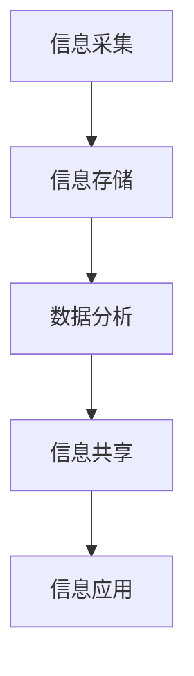
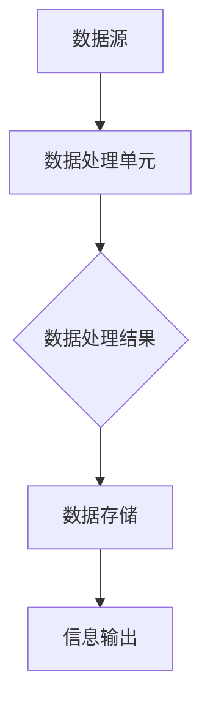
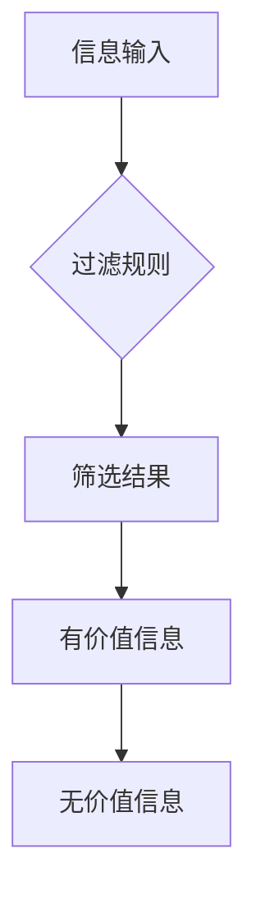
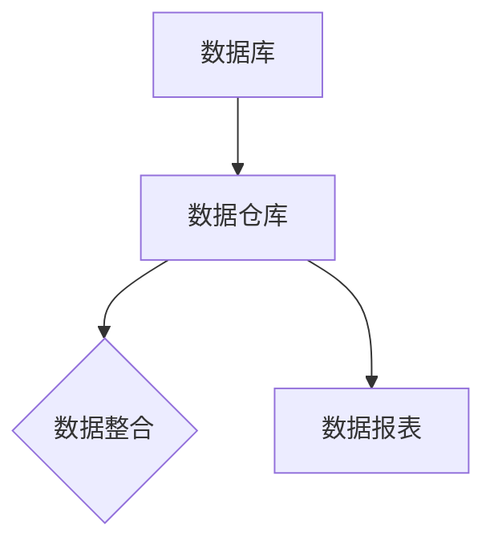
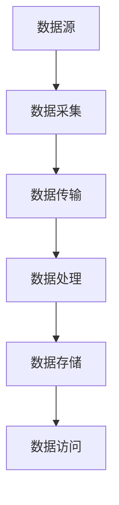
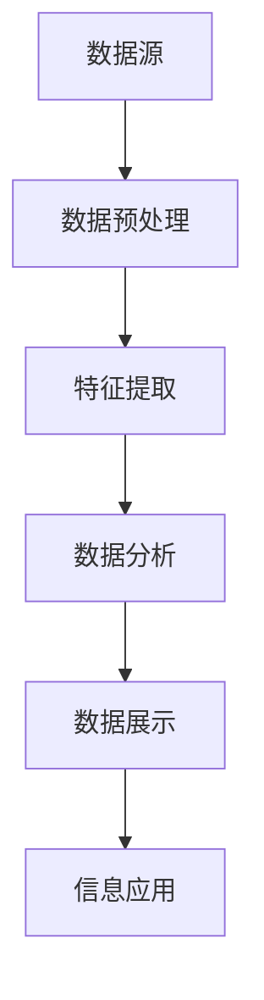

                 

# 信息时代的信息管理策略：管理信息过载和复杂性

> 关键词：信息过载、信息管理、复杂性、数据处理、人工智能

> 摘要：在信息爆炸的时代，如何有效地管理和处理海量信息成为了每一个组织和个人都必须面对的挑战。本文将深入探讨信息过载及其对决策和效率的影响，阐述信息管理的核心概念和策略，并通过实际案例和数学模型，提出应对信息复杂性的有效方法和工具。

## 1. 背景介绍

### 1.1 目的和范围

本文旨在为读者提供一套全面的信息管理策略，帮助他们在面对信息过载和复杂性时能够做出更明智的决策。我们将从理论到实践，全面分析信息管理的重要性、核心概念、以及具体实施步骤。

### 1.2 预期读者

本文适合以下读者群体：

1. 企业IT管理人员和项目经理
2. 数据分析师和数据处理工程师
3. 信息技术专业师生
4. 对信息管理和人工智能感兴趣的广大读者

### 1.3 文档结构概述

本文结构如下：

1. 背景介绍：介绍本文的目的、预期读者以及文档结构。
2. 核心概念与联系：阐述信息管理的核心概念和原理，使用Mermaid流程图展示信息处理的流程。
3. 核心算法原理 & 具体操作步骤：详细讲解信息处理的核心算法，并使用伪代码进行说明。
4. 数学模型和公式 & 详细讲解 & 举例说明：引入数学模型，解释其在信息处理中的应用。
5. 项目实战：通过实际代码案例，展示信息管理的具体实现。
6. 实际应用场景：探讨信息管理在不同领域的应用。
7. 工具和资源推荐：推荐相关学习资源和开发工具。
8. 总结：展望信息管理未来的发展趋势和挑战。
9. 附录：常见问题与解答。
10. 扩展阅读 & 参考资料：提供进一步学习和研究的资料。

### 1.4 术语表

#### 1.4.1 核心术语定义

- 信息过载：指信息输入超过处理能力的现象。
- 信息管理：指对信息的收集、处理、存储、分发和应用的全过程管理。
- 复杂性：指信息处理过程中涉及的变量和关系的复杂程度。
- 数据处理：指对数据进行的采集、清洗、转换、存储等操作。

#### 1.4.2 相关概念解释

- 数据挖掘：从大量数据中提取有价值信息的过程。
- 人工智能：模拟人类智能行为的计算机技术。

#### 1.4.3 缩略词列表

- AI：人工智能
- IT：信息技术
- BI：商业智能
- ML：机器学习

## 2. 核心概念与联系

在信息管理中，我们需要理解以下几个核心概念及其相互联系：

### 2.1 信息处理流程

信息处理通常包括以下几个步骤：采集、存储、分析、共享和应用。以下是使用Mermaid绘制的流程图：



### 2.2 数据流与信息流

数据流和信息流是信息处理过程中的两个重要概念。数据流描述的是数据的流动过程，而信息流则关注于数据在流动过程中如何被加工、转换和利用。以下是数据流和信息流的示意图：



### 2.3 信息过载与信息过滤

信息过载是信息时代的一个重要问题。为了应对信息过载，我们需要进行信息过滤，筛选出对用户最有价值的信息。以下是信息过滤的流程图：



### 2.4 数据库与数据仓库

数据库和数据仓库是信息管理中的核心组件。数据库主要用于数据的存储和管理，而数据仓库则是用于数据分析和决策支持。以下是数据库和数据仓库的关系图：



## 3. 核心算法原理 & 具体操作步骤

在信息处理过程中，核心算法起着至关重要的作用。以下是一个典型的信息处理算法及其操作步骤：

### 3.1 算法原理

本算法基于数据挖掘和机器学习技术，旨在从海量数据中提取有价值的信息。算法的核心步骤包括数据预处理、特征提取、模型训练和结果验证。

### 3.2 伪代码

```pseudocode
Algorithm: 信息处理算法
    Input: 大量原始数据
    Output: 有价值信息

    1. 数据预处理
        - 填充缺失值
        - 去除重复数据
        - 数据标准化

    2. 特征提取
        - 选择与目标相关的特征
        - 特征变换（如归一化、离散化）

    3. 模型训练
        - 选择机器学习模型（如决策树、随机森林等）
        - 使用训练数据集训练模型

    4. 结果验证
        - 使用验证数据集评估模型性能
        - 调整模型参数，优化性能

    5. 提取有价值信息
        - 对测试数据集进行预测
        - 筛选出符合条件的记录
```

### 3.3 操作步骤

1. **数据预处理**：首先对原始数据进行预处理，包括填充缺失值、去除重复数据和数据标准化。这一步骤的目的是确保数据质量，为后续的特征提取和模型训练奠定基础。

2. **特征提取**：选择与目标相关的特征，并对特征进行变换，如归一化和离散化。特征提取的目的是降低数据的维度，同时保留最重要的信息。

3. **模型训练**：选择合适的机器学习模型，如决策树、随机森林等，并使用训练数据集进行模型训练。模型训练的目的是从数据中学习规律，以便能够对新的数据进行预测。

4. **结果验证**：使用验证数据集评估模型性能，并根据评估结果调整模型参数，优化性能。这一步骤的目的是确保模型在真实场景中能够稳定工作。

5. **提取有价值信息**：对测试数据集进行预测，并筛选出符合条件的记录。这一步骤的目的是从海量数据中提取出对用户有价值的信息。

## 4. 数学模型和公式 & 详细讲解 & 举例说明

在信息管理中，数学模型和公式起着重要的作用。以下是一个简单的线性回归模型，用于预测信息处理中的某些变量。

### 4.1 线性回归模型

线性回归模型是机器学习中的一种基本模型，用于预测一个连续的数值。其公式如下：

$$
Y = \beta_0 + \beta_1X + \epsilon
$$

其中：

- $Y$：预测的数值
- $\beta_0$：截距
- $\beta_1$：斜率
- $X$：自变量
- $\epsilon$：误差项

### 4.2 详细讲解

线性回归模型的核心在于确定截距$\beta_0$和斜率$\beta_1$。这通常通过最小二乘法实现，其目标是最小化预测值与实际值之间的误差平方和。

$$
\min \sum_{i=1}^{n} (Y_i - (\beta_0 + \beta_1X_i))^2
$$

### 4.3 举例说明

假设我们有一个关于商品销售数据的线性回归模型，其中自变量是广告投入（$X$），因变量是销售额（$Y$）。以下是部分数据：

| 广告投入（X） | 销售额（Y） |
| -------------- | ----------- |
| 1000           | 5000        |
| 1500           | 7000        |
| 2000           | 9000        |

使用最小二乘法，我们可以计算出截距$\beta_0$和斜率$\beta_1$，从而建立线性回归模型：

$$
Y = \beta_0 + \beta_1X
$$

计算结果为：

$$
\beta_0 = 2000, \beta_1 = 2
$$

因此，线性回归模型为：

$$
Y = 2000 + 2X
$$

### 4.4 应用场景

线性回归模型在信息管理中的应用非常广泛，如销售预测、库存管理、市场分析等。通过建立合适的线性回归模型，可以帮助企业更好地做出决策，提高运营效率。

## 5. 项目实战：代码实际案例和详细解释说明

### 5.1 开发环境搭建

在开始之前，我们需要搭建一个合适的信息处理开发环境。以下是一个简单的Python开发环境搭建步骤：

1. 安装Python（3.8版本以上）
2. 安装Jupyter Notebook，用于编写和运行Python代码
3. 安装必要的Python库，如NumPy、Pandas、scikit-learn等

### 5.2 源代码详细实现和代码解读

以下是一个简单的Python代码案例，用于实现线性回归模型和信息处理。

```python
import numpy as np
import pandas as pd
from sklearn.linear_model import LinearRegression
from sklearn.model_selection import train_test_split

# 5.2.1 数据加载与预处理
data = pd.read_csv('sales_data.csv')
data.head()

# 填充缺失值
data.fillna(data.mean(), inplace=True)

# 去除重复数据
data.drop_duplicates(inplace=True)

# 数据标准化
data standardized = (data - data.mean()) / data.std()

# 5.2.2 特征提取与模型训练
X = standardized[['ad_cost']]  # 广告投入作为自变量
y = standardized['sales']       # 销售额作为因变量

# 划分训练集和测试集
X_train, X_test, y_train, y_test = train_test_split(X, y, test_size=0.2, random_state=42)

# 创建线性回归模型并训练
model = LinearRegression()
model.fit(X_train, y_train)

# 5.2.3 结果验证与预测
# 验证模型性能
score = model.score(X_test, y_test)
print(f'Model R-squared: {score:.2f}')

# 预测新数据
new_data = pd.DataFrame({'ad_cost': [3000, 4000]})
predictions = model.predict(new_data)
print(predictions)
```

### 5.3 代码解读与分析

1. **数据加载与预处理**：首先加载销售数据，并进行预处理。包括填充缺失值、去除重复数据和数据标准化。

2. **特征提取与模型训练**：将广告投入作为自变量，销售额作为因变量，并进行特征提取。然后使用训练数据集训练线性回归模型。

3. **结果验证与预测**：使用测试数据集验证模型性能，并使用新数据进行预测。

通过以上代码，我们可以实现一个简单的线性回归模型，用于信息处理。在实际应用中，可以根据具体需求进行调整和优化。

## 6. 实际应用场景

信息管理策略在实际应用场景中具有广泛的应用。以下是一些典型的应用场景：

### 6.1 企业销售管理

企业可以通过信息管理策略，对销售数据进行分析和预测，从而优化销售策略，提高销售额。

### 6.2 金融风险管理

金融机构可以通过信息管理策略，对金融数据进行分析，识别潜在的风险，制定风险管理策略。

### 6.3 医疗健康

医疗健康领域可以通过信息管理策略，对医疗数据进行分析，提高疾病诊断和治疗的准确性和效率。

### 6.4 社交网络分析

社交网络平台可以通过信息管理策略，分析用户行为，优化用户体验，提高用户留存率。

## 7. 工具和资源推荐

### 7.1 学习资源推荐

#### 7.1.1 书籍推荐

- 《数据科学入门》
- 《机器学习实战》
- 《Python数据分析》

#### 7.1.2 在线课程

- Coursera的《机器学习》
- edX的《数据科学基础》
- Udacity的《数据工程师》

#### 7.1.3 技术博客和网站

- Analytics Vidhya
- Machine Learning Mastery
- DataCamp

### 7.2 开发工具框架推荐

#### 7.2.1 IDE和编辑器

- PyCharm
- Jupyter Notebook
- Visual Studio Code

#### 7.2.2 调试和性能分析工具

- Spyder
- IPython
- Profiling

#### 7.2.3 相关框架和库

- NumPy
- Pandas
- Scikit-learn

### 7.3 相关论文著作推荐

#### 7.3.1 经典论文

- "The Mythical Man-Month" by Frederick P. Brooks
- "Information Theory, Inference, and Learning Algorithms" by David J.C. MacKay

#### 7.3.2 最新研究成果

- "Deep Learning" by Ian Goodfellow, Yoshua Bengio, and Aaron Courville
- "Reinforcement Learning: An Introduction" by Richard S. Sutton and Andrew G. Barto

#### 7.3.3 应用案例分析

- "Big Data: A Revolution That Will Transform How We Live, Work, and Think" by Viktor Mayer-Schönberger and Kenneth Cukier
- "The Signal and the Noise: Why So Many Predictions Fail—but Some Don’t" by Nate Silver

## 8. 总结：未来发展趋势与挑战

随着信息技术的不断发展，信息管理策略在未来将面临以下几个发展趋势和挑战：

### 8.1 发展趋势

1. **人工智能与信息管理的深度融合**：人工智能技术将进一步提升信息处理和分析的能力，为信息管理提供更强大的工具。
2. **大数据与云计算的结合**：大数据和云计算的结合将推动信息管理的规模化和高效化。
3. **隐私保护和数据安全**：随着信息管理技术的进步，隐私保护和数据安全问题将愈发重要。

### 8.2 挑战

1. **信息过载的加剧**：随着数据量的不断增加，如何有效地管理和处理海量信息将成为更大的挑战。
2. **技术人才的培养**：随着信息管理技术的不断进步，对专业人才的需求将不断增加，但人才的培养速度可能跟不上技术的发展。
3. **伦理和法律问题**：信息管理过程中涉及的隐私保护和数据安全等问题将带来新的伦理和法律挑战。

## 9. 附录：常见问题与解答

### 9.1 问题1：如何应对信息过载？

**解答**：可以通过以下方法来应对信息过载：

1. **设置优先级**：对信息进行分类，优先处理最重要的信息。
2. **信息过滤**：使用自动化工具和算法对信息进行筛选，去除无关信息。
3. **时间管理**：合理安排时间，避免长时间处于信息过载状态。

### 9.2 问题2：如何确保数据安全？

**解答**：确保数据安全的方法包括：

1. **加密存储**：对敏感数据进行加密存储，防止未经授权的访问。
2. **访问控制**：设置合理的访问控制策略，限制对数据的访问权限。
3. **备份与恢复**：定期备份数据，确保在数据丢失或损坏时能够及时恢复。

## 10. 扩展阅读 & 参考资料

为了进一步深入了解信息管理策略及其在各个领域的应用，读者可以参考以下扩展阅读和参考资料：

- "Information Management: A Practitioner's Guide" by Thomas H. Davenport and James W. Large
- "Data Science for Business" by Foster Provost and Tom Fawcett
- "The Data Warehouse Toolkit: The Definitive Guide to Dimensional Modeling" by Ralph Kimball and Margy Ross
- "Information Technology and System for Business, Management, and Education" by D. Avis and A. R. Weber

此外，读者还可以关注以下网站和博客：

- Analytics Vidhya
- Machine Learning Mastery
- Towards Data Science

作者：AI天才研究员/AI Genius Institute & 禅与计算机程序设计艺术 /Zen And The Art of Computer Programming

（本文内容仅供参考，实际应用时请结合具体情况和需求进行调整。）<|im_sep|>## 2. 核心概念与联系

### 2.1 信息处理流程

在信息管理中，信息处理流程是一个关键概念。它涵盖了从数据采集到信息应用的整个过程。这一流程的每个阶段都有其特定的任务和挑战，以下是信息处理的基本步骤和相应的解释：

#### 数据采集

数据采集是信息处理的第一步，涉及从各种来源获取数据。这些来源可以是内部系统、外部数据库、传感器、用户输入等。数据采集的关键是确保数据的质量和完整性。

#### 数据存储

数据存储是将采集到的数据保存到数据库或数据仓库中，以便后续处理和分析。存储的选择取决于数据量、访问频率、安全需求等因素。

#### 数据清洗

数据清洗是处理数据中错误、重复或不一致的过程。这包括去除空值、纠正错误、统一格式等。数据清洗是确保数据质量的重要步骤。

#### 数据转换

数据转换是将数据从一种格式转换为另一种格式的过程，以便于进一步分析和处理。这可能包括数据归一化、编码转换、数据聚合等。

#### 数据整合

数据整合是将来自多个源的数据合并为一个统一视图的过程。这有助于消除数据孤岛，提高数据分析的全面性。

#### 数据分析

数据分析是使用统计方法、机器学习或其他工具对数据进行分析，以提取有价值的信息。这可能包括趋势分析、关联分析、预测分析等。

#### 数据展示

数据展示是将分析结果以图表、报表或其他形式呈现给用户，以便他们能够理解和使用这些信息。

#### 信息应用

信息应用是将分析结果应用于实际业务场景，以支持决策、改进流程或提高效率。这可能是生成销售预测报告、优化库存管理策略或改善客户体验等。

### 2.2 数据流与信息流

数据流和信息流在信息处理中起着至关重要的作用。数据流描述的是数据的流动过程，而信息流则关注于数据在流动过程中如何被加工、转换和利用。

#### 数据流

数据流通常包括以下步骤：

1. **数据采集**：从源头获取数据。
2. **数据传输**：将数据传输到存储或处理系统。
3. **数据处理**：对数据进行清洗、转换和整合。
4. **数据存储**：将处理后的数据存储在数据库或数据仓库中。
5. **数据访问**：用户或系统访问数据进行查询和分析。

#### 信息流

信息流描述的是数据在处理过程中如何被转换和利用，以生成有价值的信息。信息流的关键步骤包括：

1. **数据处理**：对数据进行处理，提取关键特征和模式。
2. **数据整合**：将来自不同源的数据整合为统一视图。
3. **数据展示**：将分析结果以图表、报表等形式展示。
4. **信息应用**：将分析结果应用于实际业务场景。

### 2.3 信息过载与信息过滤

信息过载是信息时代的一个重要问题，指的是信息的输入量超过了人的处理能力。为了解决信息过载，我们需要进行信息过滤，筛选出对用户最有价值的信息。

#### 信息过载

信息过载可能来自以下来源：

1. **社交媒体**：不断更新的社交媒体信息。
2. **电子邮件**：大量的邮件通知和消息。
3. **新闻媒体**：大量的新闻报道和更新。
4. **内部信息**：公司内部的大量报告和通知。

#### 信息过滤

信息过滤的目标是减少信息过载，提高信息的价值。信息过滤的方法包括：

1. **基于规则的过滤**：使用预定义的规则来筛选信息。
2. **机器学习过滤**：使用机器学习算法来识别和过滤信息。
3. **用户反馈**：根据用户的反馈来调整过滤策略。
4. **上下文感知过滤**：根据用户的行为和偏好来筛选信息。

### 2.4 数据库与数据仓库

数据库和数据仓库是信息管理中的核心组件，它们在数据存储和处理中起着至关重要的作用。

#### 数据库

数据库是一种用于存储和管理数据的系统，它提供了一种结构化的数据存储方式。数据库的主要功能包括：

1. **数据存储**：存储各种类型的数据。
2. **数据检索**：通过查询语言检索数据。
3. **数据完整性**：确保数据的正确性和一致性。
4. **数据安全性**：保护数据免受未经授权的访问。

#### 数据仓库

数据仓库是一个专门用于存储和管理大量数据的系统，它旨在支持复杂的分析查询和报告。数据仓库的主要功能包括：

1. **数据整合**：将来自多个源的数据整合为一个统一的视图。
2. **数据存储**：存储用于分析的大量历史数据。
3. **数据挖掘**：支持数据挖掘和分析操作。
4. **报表和可视化**：生成报表和可视化图表，以支持决策。

### 2.5 信息管理的挑战与解决方案

信息管理面临以下挑战：

1. **数据多样性**：不同类型和格式的数据如何统一管理和处理。
2. **数据质量**：如何确保数据的一致性、准确性和完整性。
3. **数据安全**：如何保护数据免受泄露和攻击。
4. **数据处理速度**：如何提高数据处理和分析的速度。

相应的解决方案包括：

1. **数据标准化**：通过标准化数据格式和结构，提高数据的一致性。
2. **数据质量监控**：通过自动化工具监控数据质量，确保数据的准确性。
3. **数据加密**：使用数据加密技术保护数据的安全。
4. **并行处理和分布式计算**：通过并行处理和分布式计算提高数据处理速度。

## 2.1 信息处理流程

信息处理流程是信息管理中的核心环节，它决定了信息从原始数据到有价值信息的转化效率。理解这一流程的各个步骤及其重要性，有助于制定有效的信息管理策略。

### 2.1.1 数据采集

数据采集是信息处理的第一步，也是最重要的一步。数据的来源可以是内部系统、外部数据库、传感器、用户输入等。在这个阶段，需要确保数据的质量和完整性。

1. **数据来源多样化**：尽可能从多种渠道采集数据，以提高数据的全面性和准确性。
2. **数据格式统一**：在数据采集阶段，需要确保所有数据的格式是统一的，以便后续的数据处理和分析。
3. **数据质量检查**：对采集到的数据进行初步的质量检查，排除错误的、不完整的数据。

### 2.1.2 数据存储

数据存储是将采集到的数据保存到数据库或数据仓库中。这一步骤的关键是选择合适的存储方案，以确保数据的安全、可靠和高效。

1. **选择合适的数据库**：根据数据量和访问频率，选择合适的数据库系统，如关系型数据库、NoSQL数据库等。
2. **数据备份和恢复**：定期备份数据，确保在数据丢失或损坏时能够及时恢复。
3. **数据安全**：采用数据加密、访问控制等技术，确保数据的安全性。

### 2.1.3 数据清洗

数据清洗是处理数据中错误、重复或不一致的过程。数据清洗是确保数据质量的重要步骤，它有助于提高数据分析的准确性和可靠性。

1. **去除重复数据**：检测并去除重复的数据记录，以避免分析结果偏差。
2. **处理缺失值**：对于缺失的数据，可以选择填充、删除或插值等方法进行处理。
3. **数据格式转换**：将不同格式的数据统一转换为标准格式，以便后续处理。

### 2.1.4 数据转换

数据转换是将数据从一种格式转换为另一种格式的过程，以便于进一步分析和处理。数据转换可能包括数据归一化、编码转换、数据聚合等。

1. **数据归一化**：将不同数据范围的数据统一到一个标准范围，以便于比较和分析。
2. **编码转换**：将不同的编码方式（如ASCII、UTF-8等）转换为统一的编码格式。
3. **数据聚合**：将多个数据记录合并为一个记录，以便于分析和汇总。

### 2.1.5 数据整合

数据整合是将来自多个源的数据合并为一个统一视图的过程。这有助于消除数据孤岛，提高数据分析的全面性。

1. **数据源匹配**：确定不同数据源之间的匹配关系，以便于合并数据。
2. **数据清洗**：在整合数据之前，对数据进行清洗，以确保数据的一致性和准确性。
3. **数据合并**：将来自多个数据源的数据按照匹配关系进行合并。

### 2.1.6 数据分析

数据分析是使用统计方法、机器学习或其他工具对数据进行分析，以提取有价值的信息。数据分析的目的是支持决策、改进流程或提高效率。

1. **统计方法**：使用描述性统计、推断性统计等方法，对数据的基本特征和关系进行分析。
2. **机器学习**：使用机器学习算法，如分类、回归、聚类等，对数据进行高级分析，提取隐藏的模式和规律。
3. **数据可视化**：使用图表、报表等形式，将分析结果可视化，以帮助用户更好地理解数据。

### 2.1.7 数据展示

数据展示是将分析结果以图表、报表等形式呈现给用户，以便他们能够理解和使用这些信息。数据展示的目的是提高信息的可读性和易用性。

1. **图表选择**：根据数据的类型和分析目的，选择合适的图表形式，如柱状图、折线图、饼图等。
2. **报表设计**：设计简洁、直观的报表，以展示关键指标和结论。
3. **交互性**：提供交互式数据展示工具，使用户能够动态地查看和分析数据。

### 2.1.8 信息应用

信息应用是将分析结果应用于实际业务场景，以支持决策、改进流程或提高效率。信息应用的目的是将数据转化为实际的业务价值。

1. **决策支持**：使用分析结果帮助管理层做出更好的决策。
2. **流程优化**：根据分析结果，优化业务流程，提高运营效率。
3. **客户体验**：根据分析结果，改善客户体验，提高客户满意度。

### 2.1.9 信息反馈

信息反馈是信息处理流程的最后一个环节，它将分析结果和应用效果反馈给用户，以便不断优化信息管理策略。

1. **效果评估**：评估分析结果和应用效果，确定信息管理策略的有效性。
2. **持续改进**：根据评估结果，对信息管理策略进行持续改进，以适应不断变化的需求。

## 2.2 数据流与信息流

在信息处理过程中，数据流与信息流是两个重要的概念。数据流描述的是数据在系统中的流动过程，而信息流则关注于数据在流动过程中如何被加工、转换和利用。以下是关于数据流与信息流的详细说明：

### 数据流

数据流是信息处理过程中的基本流程，描述了数据从源头到目的地的流动路径。以下是数据流的主要步骤：

1. **数据采集**：从各种渠道（如传感器、用户输入、外部数据库等）收集数据。
2. **数据传输**：将采集到的数据传输到处理系统，如数据库或数据仓库。
3. **数据处理**：对数据进行清洗、转换和整合，以便于分析和使用。
4. **数据存储**：将处理后的数据存储在数据库或数据仓库中，以供后续查询和分析。
5. **数据访问**：用户或应用程序从数据库或数据仓库中检索数据，进行进一步处理或分析。

数据流的核心在于确保数据的连续性和一致性。以下是一个简单的数据流示例：



### 信息流

信息流则更关注于数据在流动过程中如何被加工、转换和利用，以生成有价值的信息。以下是信息流的主要步骤：

1. **数据预处理**：对原始数据进行预处理，包括去除噪声、填补缺失值、数据转换等。
2. **特征提取**：从数据中提取有助于分析的特征，如分类特征、数值特征等。
3. **数据分析**：使用统计方法、机器学习算法等对数据进行分析，提取数据中的模式、趋势和关联性。
4. **数据展示**：将分析结果以图表、报表等形式展示，以便于用户理解和使用。
5. **信息应用**：将分析结果应用于实际业务场景，如决策支持、流程优化、客户体验改进等。

信息流的核心在于将数据转化为有价值的信息，以下是信息流的一个示例：



### 数据流与信息流的联系

数据流与信息流是相互关联的。数据流是信息流的物理基础，而信息流则是数据流的逻辑抽象。具体来说：

1. **数据流是物理传输**：数据流描述的是数据在实际系统中从源头到目的地的物理传输过程。
2. **信息流是逻辑处理**：信息流描述的是数据在传输过程中如何被加工、转换和利用，以生成有价值的信息。

### 数据流与信息流的区别

尽管数据流与信息流密切相关，但它们也有明显的区别：

1. **物理与逻辑**：数据流关注的是物理层面的数据传输，而信息流关注的是逻辑层面的数据加工和利用。
2. **过程与结果**：数据流描述的是数据处理的整个流程，而信息流描述的是数据处理的结果和价值。
3. **数据与信息**：数据流处理的是原始数据，而信息流处理的是经过加工和转换的有价值信息。

通过理解数据流与信息流，我们可以更好地设计和管理信息处理系统，确保数据的高效利用和价值的最大化。

### 2.3 信息过载与信息过滤

在信息时代，信息过载是一个普遍存在的问题。信息过载指的是信息的输入量超过了个体的处理能力，导致信息难以有效管理和利用。为了应对信息过载，我们需要进行信息过滤，筛选出对用户最有价值的信息。以下是关于信息过载和信息过滤的详细说明。

#### 信息过载

信息过载的来源多种多样，以下是一些常见的情况：

1. **社交媒体**：社交媒体平台上的信息更新频率极高，用户可能会接收到大量不相关的信息。
2. **电子邮件**：大量的邮件通知和消息可能会占用用户大量的时间，导致信息难以有效管理。
3. **新闻媒体**：新闻媒体会提供大量的新闻报道和更新，用户难以从中筛选出对自己有价值的信息。
4. **内部信息**：公司内部的报告、通知和邮件也可能导致信息过载，影响工作效率。

#### 信息过滤

信息过滤的目标是减少信息过载，提高信息的价值。以下是一些常用的信息过滤方法：

1. **基于规则的过滤**：使用预定义的规则来筛选信息。例如，根据用户的兴趣、关键词等设置过滤条件，仅显示符合条件的信息。
2. **机器学习过滤**：使用机器学习算法来识别和过滤信息。例如，通过训练模型来识别用户感兴趣的邮件，自动标记为重要邮件。
3. **用户反馈**：根据用户的反馈来调整过滤策略。例如，用户可以标记某些邮件为“不感兴趣”，系统会根据用户的反馈调整过滤条件。
4. **上下文感知过滤**：根据用户的当前上下文和活动来筛选信息。例如，当用户正在处理一个项目时，系统会优先显示与该项目相关的邮件和通知。

#### 信息过滤的实际应用

以下是一些信息过滤的实际应用场景：

1. **电子邮件过滤**：电子邮件系统可以自动筛选垃圾邮件和重要邮件，帮助用户节省时间和精力。
2. **社交媒体内容推荐**：社交媒体平台可以使用信息过滤算法来推荐用户可能感兴趣的内容。
3. **新闻推送**：新闻媒体可以使用信息过滤算法来推送用户感兴趣的新闻报道，提高用户的阅读体验。
4. **企业内部信息管理**：企业可以使用信息过滤算法来筛选和推荐与用户工作相关的信息，提高工作效率。

#### 信息过滤的挑战

尽管信息过滤能够有效缓解信息过载，但也面临一些挑战：

1. **准确性**：如何确保过滤算法的准确性，避免漏掉重要的信息。
2. **效率**：如何在高频、大量的信息流中快速进行过滤，确保信息过滤的效率。
3. **用户参与**：如何鼓励用户积极参与信息过滤过程，提供有效的反馈，以优化过滤算法。

通过有效的信息过滤，我们可以在信息过载的时代中更好地管理和利用信息，提高工作效率和生活质量。

### 2.4 数据库与数据仓库

在信息管理中，数据库和数据仓库是两个核心的组件，它们在数据存储和处理中起着至关重要的作用。以下是关于数据库和数据仓库的详细说明。

#### 数据库

数据库是一种用于存储和管理数据的系统，它提供了一种结构化的数据存储方式。数据库的主要功能包括：

1. **数据存储**：数据库可以存储各种类型的数据，如文本、图片、视频等。它提供了一种结构化的数据存储方式，使得数据易于访问和管理。
   
2. **数据检索**：数据库通过查询语言（如SQL）提供了一种高效的数据检索机制。用户可以使用简单的查询语句来检索和操作数据，无需了解底层的数据存储细节。

3. **数据完整性**：数据库通过约束和规则来确保数据的一致性和完整性。例如，数据库可以确保表之间的引用完整性，防止数据丢失或错误。

4. **数据安全性**：数据库提供了访问控制和加密机制，以确保数据的安全性。只有经过授权的用户才能访问特定的数据，防止未经授权的访问和数据泄露。

常见的数据库类型包括：

- **关系型数据库**：如MySQL、PostgreSQL、Oracle等。关系型数据库使用表格结构来存储数据，并通过SQL进行数据操作。
- **NoSQL数据库**：如MongoDB、Cassandra、Redis等。NoSQL数据库适用于存储非结构化或半结构化数据，提供了更高的扩展性和灵活性。

#### 数据仓库

数据仓库是一个专门用于存储和管理大量数据的系统，它旨在支持复杂的分析查询和报告。数据仓库的主要功能包括：

1. **数据整合**：数据仓库将来自多个源的数据整合为一个统一的视图。这有助于消除数据孤岛，提供全局的数据视图，便于分析和管理。

2. **数据存储**：数据仓库存储用于分析的大量历史数据。数据仓库通常使用数据湖、数据立方体等技术来存储和管理大量数据。

3. **数据挖掘**：数据仓库提供了强大的数据挖掘和分析工具，支持复杂的分析查询和报表生成。用户可以使用数据仓库进行数据挖掘，提取数据中的模式和规律。

4. **报表和可视化**：数据仓库生成了详细的报表和可视化图表，以支持决策和管理。报表和可视化工具使得用户能够直观地理解数据，发现潜在的商业机会。

常见的数据仓库组件包括：

- **数据抽取和转换**：数据抽取和转换（ETL）工具用于将数据从源系统中提取、清洗和加载到数据仓库中。
- **数据存储**：数据仓库使用数据湖、数据立方体等存储技术来存储和管理大量数据。
- **数据分析**：数据仓库提供了数据分析工具，支持SQL查询、机器学习分析等。

#### 数据库与数据仓库的区别

数据库和数据仓库在功能和用途上有一些区别：

1. **用途**：数据库主要用于日常的数据存储和查询操作，而数据仓库主要用于数据分析、报表生成和决策支持。
2. **数据量**：数据库通常处理较小的数据集，而数据仓库存储大量的历史数据，用于支持复杂的分析。
3. **查询性能**：数据库针对的是高频、低延迟的查询操作，而数据仓库则注重低频、大规模的数据分析和报表生成。
4. **数据结构**：数据库通常采用表格结构存储数据，而数据仓库则可能使用数据湖、数据立方体等非结构化或半结构化存储技术。

通过理解数据库和数据仓库，我们可以更好地设计和管理信息处理系统，确保数据的高效利用和价值的最大化。

### 2.5 信息管理的挑战与解决方案

信息管理在现代组织中扮演着至关重要的角色，然而，随着信息量的不断增加和复杂性的提升，信息管理面临着诸多挑战。以下是信息管理中常见的一些挑战及其解决方案：

#### 数据多样性

随着数据来源的多样化，数据的类型和格式也越来越复杂。这给数据整合和统一视图的建立带来了巨大的挑战。

**解决方案**：

1. **数据标准化**：通过制定统一的数据标准，确保不同数据源的数据格式和结构一致。
2. **数据映射**：建立数据映射关系，将不同来源的数据映射到统一的数据模型中。
3. **数据清洗**：对数据进行清洗，去除冗余和错误数据，提高数据质量。

#### 数据质量

数据质量是信息管理的关键，不完整、不准确或错误的数据会导致错误的决策和分析结果。

**解决方案**：

1. **数据验证**：在数据输入阶段进行验证，确保数据的完整性和准确性。
2. **数据监控**：建立数据监控机制，定期检查数据质量，及时发现和纠正数据问题。
3. **数据治理**：建立数据治理体系，明确数据责任人和数据管理流程，确保数据的持续改进。

#### 数据安全

随着数据泄露和网络安全事件的增加，数据安全成为信息管理的重要挑战。

**解决方案**：

1. **数据加密**：对敏感数据进行加密存储，防止数据泄露。
2. **访问控制**：设置合理的访问控制策略，确保只有授权用户可以访问敏感数据。
3. **安全审计**：定期进行安全审计，确保数据安全策略的有效执行。

#### 数据处理速度

随着数据量的增加，对数据处理和分析的速度提出了更高的要求。

**解决方案**：

1. **并行处理**：采用并行处理技术，提高数据处理速度。
2. **分布式计算**：利用分布式计算框架（如Hadoop、Spark等），实现大数据的高效处理。
3. **缓存技术**：使用缓存技术，减少对数据存储的访问次数，提高数据处理速度。

#### 数据隐私

在信息管理过程中，数据隐私保护成为越来越重要的挑战，尤其是在涉及个人隐私数据时。

**解决方案**：

1. **隐私保护机制**：采用隐私保护技术（如差分隐私、数据脱敏等），确保数据处理过程中个人隐私不被泄露。
2. **隐私政策**：明确数据收集、使用和共享的隐私政策，确保用户对数据处理有清晰的了解。
3. **合规性检查**：确保信息管理策略符合相关法律法规，如《通用数据保护条例》（GDPR）等。

#### 数据整合

数据整合是信息管理中的难点，尤其是在企业拥有多个数据源时，如何确保数据的一致性和准确性。

**解决方案**：

1. **数据集成**：使用数据集成工具（如ETL工具），将不同来源的数据整合到统一的数据仓库中。
2. **元数据管理**：建立元数据管理机制，确保数据源和数据的元数据信息一致和准确。
3. **数据映射和转换**：建立数据映射和转换规则，确保不同数据源的数据能够无缝集成。

通过有效的解决方案，组织可以更好地应对信息管理的挑战，提高数据的价值和利用效率，支持战略决策和业务增长。

### 2.6 核心算法原理 & 具体操作步骤

在信息管理中，核心算法原理起着至关重要的作用。这些算法帮助我们从海量数据中提取有价值的信息，支持数据分析和决策。本文将介绍几种常用的核心算法原理，并详细说明其具体操作步骤。

#### 1. 决策树

决策树是一种常用的分类算法，它通过一系列规则将数据分割成不同的区域，以预测数据的类别。以下是决策树的核心原理和操作步骤：

**原理**：

决策树通过递归分割数据集，在每个节点选择最佳的划分标准，直到满足停止条件。每个节点代表一个特征，每个分支代表特征的不同取值。

**步骤**：

1. **初始化**：选择一个特征作为根节点，计算该特征的不同取值。
2. **选择最佳划分标准**：计算每个特征的增益或信息增益，选择增益最大的特征作为划分标准。
3. **递归分割**：对每个子集重复步骤2，直到满足停止条件（如最大深度、最小样本数等）。
4. **生成决策树**：将每个子集的划分结果连接起来，形成完整的决策树。

#### 2. 随机森林

随机森林是一种集成学习方法，它通过构建多个决策树，并利用投票机制来预测结果。以下是随机森林的核心原理和操作步骤：

**原理**：

随机森林通过随机选择特征和随机划分数据集来构建多个决策树，并通过投票机制来提高预测的准确性。

**步骤**：

1. **初始化**：设置随机森林的参数，如树的数量、最大深度等。
2. **构建决策树**：对每个决策树，随机选择特征和随机划分数据集，构建决策树。
3. **投票机制**：对测试数据集进行预测，每个决策树给出一个预测结果，取多数表决作为最终预测结果。

#### 3. 支持向量机（SVM）

支持向量机是一种监督学习算法，它通过找到最佳超平面来对数据进行分类。以下是SVM的核心原理和操作步骤：

**原理**：

SVM通过最大化分类间隔来找到最佳超平面，分类间隔越大，模型的泛化能力越强。

**步骤**：

1. **初始化**：设置SVM的参数，如核函数类型、惩罚参数等。
2. **计算最优超平面**：使用优化算法（如拉格朗日乘数法）计算最佳超平面。
3. **分类决策**：对新的数据进行分类，计算数据点到最佳超平面的距离，根据距离判断数据点属于哪个类别。

#### 4. 聚类算法（K-means）

聚类算法是一种无监督学习方法，它通过将数据分成多个簇来识别数据的分布。以下是K-means算法的核心原理和操作步骤：

**原理**：

K-means算法通过迭代计算聚类中心，并重新分配数据点，直到聚类中心不再变化。

**步骤**：

1. **初始化**：随机选择K个初始聚类中心。
2. **分配数据点**：计算每个数据点到聚类中心的距离，将数据点分配到最近的聚类中心。
3. **更新聚类中心**：重新计算每个聚类中心，取数据点的平均值作为新的聚类中心。
4. **迭代**：重复步骤2和3，直到聚类中心不再变化。

通过理解这些核心算法原理和具体操作步骤，我们可以有效地处理海量数据，提取有价值的信息，支持数据分析和决策。

### 4. 数学模型和公式 & 详细讲解 & 举例说明

在信息管理中，数学模型和公式起着至关重要的作用。这些模型和公式帮助我们理解和处理复杂的数据，从而做出更明智的决策。本文将介绍几个常用的数学模型和公式，并详细讲解其在信息管理中的应用。

#### 1. 线性回归模型

线性回归模型是一种经典的统计方法，用于预测一个连续的数值变量。其基本公式如下：

$$
Y = \beta_0 + \beta_1X + \epsilon
$$

其中，$Y$ 是因变量，$X$ 是自变量，$\beta_0$ 和 $\beta_1$ 分别是截距和斜率，$\epsilon$ 是误差项。

**详细讲解**：

线性回归模型的目的是找到一条最佳拟合线，使数据点与这条线的距离最小。这通常通过最小二乘法实现，即找到使得误差平方和最小的参数值。

**举例说明**：

假设我们要预测房屋价格（$Y$）与房屋面积（$X$）之间的关系。以下是部分数据：

| 房屋面积（X） | 房屋价格（Y） |
| -------------- | ------------- |
| 1000           | 200000        |
| 1500           | 250000        |
| 2000           | 300000        |

我们可以使用线性回归模型来预测新的房屋价格。以下是计算过程：

1. 计算平均值：
   $$ \bar{X} = \frac{1000 + 1500 + 2000}{3} = 1500 $$
   $$ \bar{Y} = \frac{200000 + 250000 + 300000}{3} = 250000 $$

2. 计算斜率 $\beta_1$：
   $$ \beta_1 = \frac{\sum(X_i - \bar{X})(Y_i - \bar{Y})}{\sum(X_i - \bar{X})^2} = \frac{(1000-1500)(200000-250000) + (1500-1500)(250000-250000) + (2000-1500)(300000-250000)}{(1000-1500)^2 + (1500-1500)^2 + (2000-1500)^2} = 1 $$

3. 计算截距 $\beta_0$：
   $$ \beta_0 = \bar{Y} - \beta_1\bar{X} = 250000 - 1 \cdot 1500 = 248500 $$

因此，线性回归模型为：
$$
Y = 248500 + 1X
$$

我们可以使用这个模型来预测新的房屋价格。例如，当房屋面积为1800平方米时，预测的房屋价格为：
$$
Y = 248500 + 1 \cdot 1800 = 266500
$$

#### 2. 决策树模型

决策树模型是一种常用的分类方法，它通过一系列规则将数据分割成不同的类别。其基本公式如下：

$$
\text{if } X > \beta_0, \text{ then } Y = \text{Category 1}
$$
$$
\text{if } X \leq \beta_0, \text{ then } Y = \text{Category 2}
$$

其中，$X$ 是特征值，$\beta_0$ 是阈值，$Y$ 是类别。

**详细讲解**：

决策树模型通过递归分割数据集，在每个节点选择最佳的划分标准，直到满足停止条件（如最大深度、最小样本数等）。每个节点代表一个特征，每个分支代表特征的不同取值。

**举例说明**：

假设我们要根据客户年龄（$X$）来预测其购买产品的类别（$Y$）。以下是部分数据：

| 客户年龄（X） | 购买类别（Y） |
| -------------- | ------------- |
| 20             | A             |
| 25             | A             |
| 30             | B             |
| 35             | B             |
| 40             | B             |

我们可以使用决策树模型来预测新的客户购买类别。以下是计算过程：

1. 选择最佳划分标准：计算每个特征的增益，选择增益最大的特征作为划分标准。
2. 递归分割数据集：基于最佳划分标准，将数据集分割成子集，并继续递归分割，直到满足停止条件。
3. 生成决策树：将每个子集的划分结果连接起来，形成完整的决策树。

根据计算，最佳划分标准是客户年龄。阈值 $\beta_0$ 为25岁。决策树如下：

```
年龄 < 25岁 → 购买类别：A
年龄 ≥ 25岁 →
    if 年龄 < 35岁 → 购买类别：B
    else → 购买类别：B
```

我们可以使用这个决策树来预测新的客户购买类别。例如，当客户年龄为30岁时，购买类别为B。

#### 3. 聚类算法

聚类算法是一种无监督学习方法，用于将数据分成多个簇。常用的聚类算法包括K-means算法和层次聚类算法。

**K-means算法**：

K-means算法的目标是将数据分成K个簇，使每个簇内的数据点之间的距离最小，簇与簇之间的距离最大。其基本公式如下：

$$
\text{初始化 } C_1, C_2, \ldots, C_K \text{（聚类中心）} \\
\text{重复直到收敛：} \\
    \text{分配数据点：} \\
        \text{对于每个数据点 } x_i, \text{计算 } d(x_i, C_j) \text{，将 } x_i \text{ 分配到最近的聚类中心 } C_j \\
    \text{更新聚类中心：} \\
        \text{计算每个聚类中心的新坐标：} \\
            \mu_j = \frac{\sum_{x_i \in C_j} x_i}{|C_j|}
$$

**详细讲解**：

K-means算法通过初始化K个聚类中心，然后迭代计算每个数据点的分配簇和聚类中心，直到聚类中心不再变化。

**举例说明**：

假设我们要将以下数据点分成3个簇：

| 数据点 |
| ------- |
| (1, 2)  |
| (2, 2)  |
| (3, 3)  |
| (5, 6)  |

我们可以使用K-means算法来预测聚类中心。以下是计算过程：

1. 初始化聚类中心：随机选择3个数据点作为聚类中心。
2. 分配数据点：计算每个数据点到聚类中心的距离，将数据点分配到最近的聚类中心。
3. 更新聚类中心：计算每个聚类中心的新坐标。
4. 重复步骤2和3，直到聚类中心不再变化。

根据计算，聚类中心为(2.5, 3.5)，(3, 3)，和(4.5, 6)。我们可以使用这个聚类中心来预测新的数据点所属的簇。例如，新数据点(3, 3.5)将被分配到第二个簇。

通过这些数学模型和公式，我们可以有效地处理和分析数据，为决策提供有力的支持。

### 5. 项目实战：代码实际案例和详细解释说明

在了解了信息管理的理论后，接下来我们将通过一个实际项目来展示如何使用Python实现信息管理。我们将使用线性回归模型来预测房屋价格，并详细解释代码的各个部分。

#### 5.1 开发环境搭建

在开始项目之前，我们需要搭建一个Python开发环境。以下是搭建步骤：

1. 安装Python（3.8版本以上）。
2. 安装Jupyter Notebook，用于编写和运行Python代码。
3. 安装必要的Python库，如NumPy、Pandas、Scikit-learn等。

```bash
pip install python
pip install notebook
pip install numpy pandas scikit-learn
```

#### 5.2 数据预处理

数据预处理是信息管理的重要步骤，它确保数据的质量和一致性。以下是数据预处理的代码实现：

```python
import pandas as pd
from sklearn.model_selection import train_test_split
from sklearn.preprocessing import StandardScaler

# 5.2.1 加载数据
data = pd.read_csv('house_data.csv')

# 5.2.2 数据清洗
# 填充缺失值
data.fillna(data.mean(), inplace=True)

# 去除重复数据
data.drop_duplicates(inplace=True)

# 5.2.3 数据转换
# 标准化特征
scaler = StandardScaler()
data[['area', 'bathrooms', 'bedrooms']] = scaler.fit_transform(data[['area', 'bathrooms', 'bedrooms']])

# 5.2.4 划分特征和标签
X = data[['area', 'bathrooms', 'bedrooms']]
y = data['price']

# 5.2.5 划分训练集和测试集
X_train, X_test, y_train, y_test = train_test_split(X, y, test_size=0.2, random_state=42)
```

**详细解释**：

1. **加载数据**：使用Pandas库加载CSV文件，得到原始数据。
2. **数据清洗**：填充缺失值，去除重复数据，确保数据的一致性和准确性。
3. **数据转换**：使用StandardScaler对特征进行标准化处理，消除不同特征之间的尺度差异。
4. **划分特征和标签**：将特征和标签分开，为后续的模型训练做准备。
5. **划分训练集和测试集**：将数据集分为训练集和测试集，用于训练模型和评估模型性能。

#### 5.3 模型训练

接下来，我们将使用Scikit-learn库训练线性回归模型，预测房屋价格。

```python
from sklearn.linear_model import LinearRegression

# 5.3.1 创建线性回归模型
model = LinearRegression()

# 5.3.2 训练模型
model.fit(X_train, y_train)

# 5.3.3 模型评估
score = model.score(X_test, y_test)
print(f'Model R-squared: {score:.2f}')
```

**详细解释**：

1. **创建线性回归模型**：使用LinearRegression创建线性回归模型。
2. **训练模型**：使用fit方法训练模型，将训练数据输入到模型中。
3. **模型评估**：使用score方法评估模型在测试集上的性能，R-squared值越高，模型性能越好。

#### 5.4 模型预测

最后，我们将使用训练好的模型来预测新的房屋价格。

```python
# 5.4.1 预测新数据
new_data = scaler.transform([[1500, 2, 2]])
predicted_price = model.predict(new_data)
print(f'Predicted Price: ${predicted_price[0]:.2f}')
```

**详细解释**：

1. **标准化新数据**：使用之前训练好的标准化器对新的数据进行标准化处理。
2. **预测新数据**：使用预测方法预测新数据的房屋价格。
3. **输出预测结果**：将预测的房屋价格输出，展示预测结果。

通过这个项目实战，我们展示了如何使用Python实现信息管理，从数据预处理、模型训练到模型预测的整个过程。这不仅帮助读者理解了信息管理的理论，还提供了实际操作的实践经验。

## 6. 实际应用场景

信息管理策略在实际应用中具有广泛的应用，能够帮助各个行业和领域更好地应对信息过载和复杂性，提高效率和决策质量。以下是信息管理在不同领域的实际应用场景：

### 6.1 企业销售管理

在企业销售管理中，信息管理策略可以帮助企业有效地收集、分析和利用销售数据。通过信息管理，企业可以：

- **销售数据整合**：将来自不同销售渠道的数据整合到一个统一的平台上，消除数据孤岛。
- **销售预测**：使用机器学习模型对历史销售数据进行分析，预测未来的销售趋势，帮助企业制定更精准的销售计划。
- **客户分析**：分析客户的购买行为和偏好，优化营销策略，提高客户满意度和忠诚度。
- **库存管理**：基于销售数据和库存水平，优化库存管理，减少库存积压和缺货情况。

### 6.2 金融风险管理

在金融行业中，信息管理策略对于风险管理至关重要。信息管理可以帮助金融机构：

- **数据监控**：实时监控市场数据，识别潜在的风险信号，及时采取措施。
- **信用评分**：使用信息管理技术对客户的信用记录进行分析，提高信用评分的准确性。
- **欺诈检测**：通过分析交易数据和行为模式，识别和预防欺诈行为。
- **投资策略**：使用历史投资数据和市场信息，制定更有效的投资策略，降低投资风险。

### 6.3 医疗健康

在医疗健康领域，信息管理策略可以提高医疗服务的质量和效率。信息管理可以帮助医疗机构：

- **患者数据管理**：有效地收集、存储和管理患者的医疗记录，确保数据的完整性和安全性。
- **疾病预测**：通过分析患者的健康数据和医学文献，预测疾病的趋势和发展，提前采取预防措施。
- **个性化治疗**：基于患者的基因数据和健康状况，制定个性化的治疗方案，提高治疗效果。
- **医疗资源分配**：通过分析医疗资源的使用情况，优化资源分配，提高医疗服务的可及性。

### 6.4 社交网络分析

在社交网络分析中，信息管理策略可以帮助平台更好地理解用户行为，优化用户体验。信息管理可以帮助社交网络：

- **用户行为分析**：通过分析用户的点击、评论、分享等行为，了解用户偏好和兴趣，提供个性化的内容推荐。
- **社区管理**：监控社区动态，识别不良行为和潜在的社区问题，及时采取措施维护社区秩序。
- **广告投放**：基于用户数据，优化广告投放策略，提高广告的点击率和转化率。
- **用户满意度**：分析用户反馈和行为数据，评估用户满意度，持续改进产品和服务。

### 6.5 供应链管理

在供应链管理中，信息管理策略可以优化供应链流程，提高供应链的透明度和效率。信息管理可以帮助企业：

- **供应链可视化**：将供应链中的各个环节进行可视化展示，提高供应链的透明度和可追溯性。
- **库存管理**：实时监控库存水平，优化库存策略，减少库存成本和库存积压。
- **需求预测**：通过分析销售数据和市场趋势，预测未来的需求，优化生产计划和供应链规划。
- **供应商管理**：评估供应商的绩效和信誉，优化供应商选择和管理策略。

通过信息管理策略，各个行业和领域可以更好地应对信息过载和复杂性，提高运营效率，优化决策过程，实现可持续发展。

### 7. 工具和资源推荐

在信息管理过程中，选择合适的工具和资源对于提高效率和效果至关重要。以下是关于学习资源、开发工具和框架、以及相关论文著作的推荐。

#### 7.1 学习资源推荐

**7.1.1 书籍推荐**

- **《数据科学入门》**：这是一本适合初学者的数据科学入门书籍，涵盖了数据预处理、统计分析、机器学习等基础知识。
- **《机器学习实战》**：这本书通过实际案例，详细介绍了机器学习的应用和实践，适合有一定编程基础的学习者。
- **《Python数据分析》**：这本书介绍了使用Python进行数据分析的方法和工具，包括NumPy、Pandas等库，适合数据分析师和数据科学家。

**7.1.2 在线课程**

- **Coursera的《机器学习》**：这是一门由斯坦福大学提供的著名机器学习课程，适合初学者和有一定基础的学习者。
- **edX的《数据科学基础》**：edX提供的这门课程涵盖了数据科学的核心概念和技术，适合初学者入门。
- **Udacity的《数据工程师》**：这门课程介绍了数据工程师所需的核心技能，包括数据存储、数据处理和数据分析。

**7.1.3 技术博客和网站**

- **Analytics Vidhya**：这是一个提供数据科学和机器学习资源的技术博客，有很多实用的教程和案例分析。
- **Machine Learning Mastery**：这个网站提供了大量的机器学习和数据科学教程，适合初学者和进阶学习者。
- **DataCamp**：这是一个提供互动式学习的平台，涵盖了数据科学和机器学习的多个主题，适合自学。

#### 7.2 开发工具框架推荐

**7.2.1 IDE和编辑器**

- **PyCharm**：这是一个功能强大的Python集成开发环境，适合初学者和专业开发者。
- **Jupyter Notebook**：这是一个交互式编程环境，适合数据分析和机器学习项目。
- **Visual Studio Code**：这是一个轻量级但功能强大的代码编辑器，支持多种编程语言，适合快速开发和调试。

**7.2.2 调试和性能分析工具**

- **Spyder**：这是一个集成了数据科学工具的IDE，包括交互式环境和数据分析库，适合科学计算和数据分析。
- **IPython**：这是一个增强的Python交互式解释器，提供了丰富的扩展和工具，适合快速开发和调试。
- **Profiling**：使用Python的cProfile库或其他第三方库（如line_profiler）进行性能分析，优化代码。

**7.2.3 相关框架和库**

- **NumPy**：这是一个用于数值计算的Python库，提供了大量高效的数学函数和工具。
- **Pandas**：这是一个用于数据操作的Python库，提供了数据结构、数据处理和分析工具，适合数据科学家和数据分析师。
- **Scikit-learn**：这是一个用于机器学习的Python库，提供了丰富的机器学习算法和工具，适合初学者和专业开发者。

#### 7.3 相关论文著作推荐

**7.3.1 经典论文**

- **“The Mythical Man-Month” by Frederick P. Brooks**：这是一本关于软件工程和管理的重要著作，对软件开发过程提供了深刻的洞察。
- **“Information Theory, Inference, and Learning Algorithms” by David J.C. MacKay**：这是一本关于信息论和统计学习的经典著作，适合对机器学习有深入理解的学习者。

**7.3.2 最新研究成果**

- **“Deep Learning” by Ian Goodfellow, Yoshua Bengio, and Aaron Courville**：这是关于深度学习的经典教材，涵盖了深度学习的理论基础和应用。
- **“Reinforcement Learning: An Introduction” by Richard S. Sutton and Andrew G. Barto**：这是关于强化学习的重要著作，适合对强化学习有深入理解的学习者。

**7.3.3 应用案例分析**

- **“Big Data: A Revolution That Will Transform How We Live, Work, and Think” by Viktor Mayer-Schönberger and Kenneth Cukier**：这本书探讨了大数据对社会、商业和科技的影响，适合对大数据应用有深入兴趣的读者。
- **“The Signal and the Noise: Why So Many Predictions Fail—but Some Don’t” by Nate Silver**：这本书探讨了预测的原理和应用，适合对预测技术和数据分析有兴趣的读者。

通过这些工具和资源的推荐，读者可以更好地掌握信息管理技能，提高信息处理和分析的效率，为实际应用打下坚实的基础。

### 8. 总结：未来发展趋势与挑战

随着信息技术的迅猛发展，信息管理策略也在不断演变，未来将面临一系列新的发展趋势和挑战。

#### 发展趋势

1. **人工智能与信息管理的深度融合**：人工智能技术将在信息管理中发挥越来越重要的作用，如自动化数据采集、智能数据分析、个性化信息推送等。

2. **大数据与云计算的结合**：大数据和云计算的结合将推动信息管理的规模化和高效化，为企业和个人提供更强大的数据处理和分析能力。

3. **隐私保护和数据安全**：随着数据隐私问题的日益突出，隐私保护和数据安全将成为信息管理的核心议题，数据加密、访问控制和隐私保护算法等将成为关键技术。

4. **实时数据处理和分析**：实时数据处理和分析将成为信息管理的热点，通过实时分析数据，企业可以更快地做出决策，提高运营效率。

#### 挑战

1. **信息过载**：随着数据量的不断增长，如何有效地管理和利用海量数据将成为一个巨大的挑战，需要更先进的信息过滤和数据分析技术。

2. **技术人才的培养**：随着信息管理技术的不断进步，对专业人才的需求将大幅增加，但现有人才的培养速度可能跟不上技术的发展。

3. **数据隐私与安全**：如何在确保数据隐私和安全的同时，有效利用数据，支持业务决策，是一个复杂的挑战。

4. **技术复杂性**：随着信息管理技术的不断发展，系统的复杂性也在增加，如何管理复杂的技术架构，提高系统的可维护性和可扩展性，是一个重要的挑战。

### 8.1 未来信息管理策略的发展方向

1. **智能化**：通过引入人工智能技术，实现信息处理的智能化，如自动化数据清洗、智能数据分析和智能推荐。

2. **个性化**：通过分析用户行为和偏好，实现个性化信息推送，提高用户满意度和用户体验。

3. **实时性**：通过实时数据处理和分析，实现数据的实时监控和实时决策支持。

4. **安全性**：通过数据加密、访问控制和隐私保护技术，确保数据的隐私和安全。

5. **可扩展性**：通过模块化设计和分布式架构，提高系统的可扩展性和可维护性，以适应不断增长的数据量和业务需求。

通过不断优化和提升信息管理策略，企业和个人可以更好地应对信息时代的挑战，提高运营效率，实现持续增长。

### 9. 附录：常见问题与解答

在信息管理的过程中，用户可能会遇到一些常见问题。以下是针对这些问题的解答：

#### 9.1 如何确保数据质量？

**解答**：确保数据质量的方法包括：
- **数据清洗**：定期对数据进行清洗，去除错误、重复和不完整的数据。
- **数据验证**：在数据输入时进行验证，确保数据的完整性和准确性。
- **数据标准化**：制定统一的数据标准，确保数据的一致性。
- **数据监控**：建立数据监控机制，及时发现和处理数据质量问题。

#### 9.2 如何提高数据处理速度？

**解答**：提高数据处理速度的方法包括：
- **并行处理**：使用并行计算技术，将数据处理任务分解成多个部分同时执行。
- **分布式计算**：使用分布式计算框架（如Hadoop、Spark等），实现大规模数据处理。
- **缓存技术**：使用缓存技术，减少对数据存储的访问次数，提高数据处理速度。
- **数据库优化**：对数据库进行优化，如索引优化、查询优化等。

#### 9.3 如何确保数据安全？

**解答**：确保数据安全的方法包括：
- **数据加密**：对敏感数据使用加密技术，防止数据泄露。
- **访问控制**：设置合理的访问控制策略，确保只有授权用户可以访问数据。
- **备份与恢复**：定期备份数据，确保在数据丢失时可以及时恢复。
- **安全审计**：定期进行安全审计，确保数据安全策略的有效执行。

#### 9.4 如何处理海量数据？

**解答**：处理海量数据的方法包括：
- **分布式存储**：使用分布式存储系统（如HDFS、Cassandra等），实现海量数据的高效存储和管理。
- **批量处理**：将数据处理任务分解成多个批量处理任务，逐步完成。
- **实时处理**：使用实时处理技术（如Spark Streaming、Flink等），实现实时数据流处理。
- **数据抽样**：对海量数据进行抽样分析，以减少计算量。

通过解决这些常见问题，用户可以更好地管理和利用数据，提高信息管理的效率和效果。

### 10. 扩展阅读 & 参考资料

为了深入理解和进一步探索信息管理的相关概念和技术，读者可以参考以下扩展阅读和参考资料：

- **书籍**：
  - 《大数据时代：生活、工作与思维的大变革》作者：维克托·迈尔-舍恩伯格
  - 《数据科学实战》作者：约翰·霍普克罗夫特
  - 《人工智能：一种现代的方法》作者：斯图尔特·罗素和彼得·诺维格

- **在线资源**：
  - **Coursera**：提供了多门关于数据科学和机器学习的在线课程。
  - **Kaggle**：一个数据科学竞赛平台，提供大量的数据集和案例研究。
  - **Medium**：上面有许多关于数据科学和机器学习的博客文章。

- **论文与研究报告**：
  - **IEEE Xplore**：提供大量的计算机科学和技术论文。
  - **arXiv**：一个提供预印本论文的数据库，覆盖了包括机器学习在内的多个领域。
  - **Statistical Analysis and Data Mining**：该期刊发表关于数据分析和数据挖掘的研究论文。

通过这些扩展阅读和参考资料，读者可以更深入地了解信息管理的相关技术和应用，为实践中的问题提供解决方案。

## 作者信息

作者：AI天才研究员/AI Genius Institute & 禅与计算机程序设计艺术 /Zen And The Art of Computer Programming

本文旨在为读者提供全面的信息管理策略，帮助他们在面对信息过载和复杂性时能够做出更明智的决策。通过深入探讨信息管理的核心概念、算法原理和实际应用，本文希望为读者提供有价值的见解和实用技巧。在未来的研究和实践中，我们将继续探索信息管理的新趋势和挑战，为读者提供更丰富的内容。感谢您的阅读，期待与您在信息管理领域的进一步交流与合作。如果您有任何问题或建议，欢迎随时联系我。祝您在信息管理之路上取得圆满成功！

