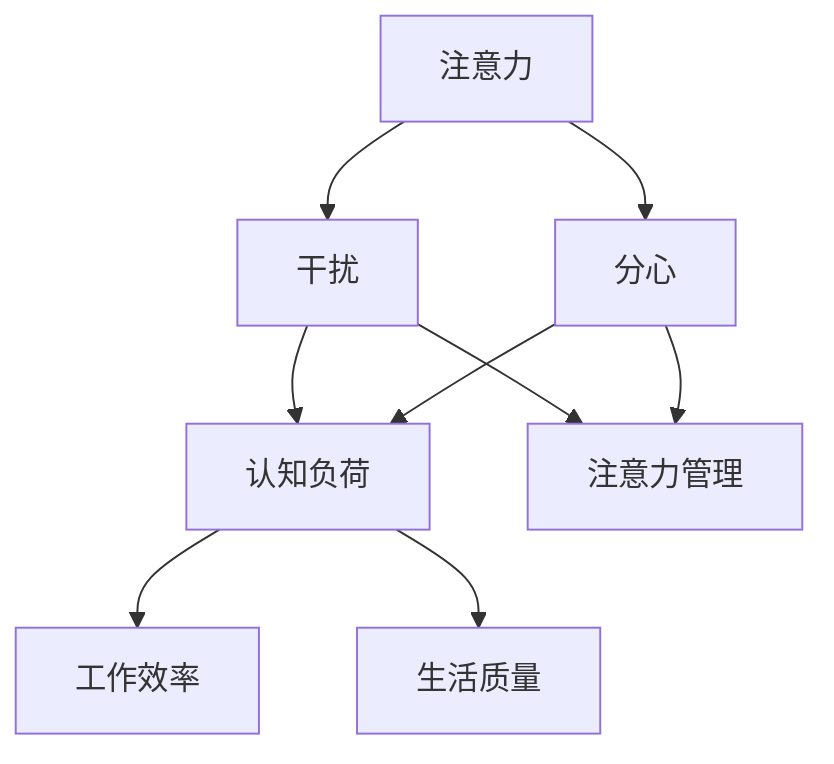

                 

# 信息时代的注意力管理实践与指南：在干扰和分心中保持头脑清晰

> **关键词：** 注意力管理、干扰、分心、认知负荷、实践指南

> **摘要：** 本文章将探讨信息时代下注意力管理的重要性，分析干扰和分心的来源，提出一系列有效的实践方法，帮助读者在信息爆炸的环境中保持头脑清晰，提升工作效率和生活质量。

## 1. 背景介绍

### 1.1 目的和范围

在当今信息爆炸的时代，我们每天都要面对大量的信息输入，无论是电子邮件、社交媒体、即时通讯工具，还是各种媒体平台，都不断地向我们发出诱惑。这些信息虽然丰富多样，但也给我们带来了巨大的干扰和分心。为了在这个高度信息化的环境中保持头脑清晰，提高生产力和生活质量，我们需要对注意力进行有效的管理。

本文将探讨注意力管理的核心概念，分析干扰和分心的来源，提供一系列实践方法和工具，帮助读者在日常生活中更好地管理自己的注意力。文章主要涵盖以下内容：

1. 干扰和分心的定义及其对认知的影响。
2. 注意力管理的核心概念和基本原理。
3. 识别和减少干扰的方法。
4. 增强注意力的技巧和策略。
5. 注意力管理的工具和资源推荐。
6. 实际应用场景和项目实战案例。
7. 未来发展趋势和挑战。

### 1.2 预期读者

本文预期读者包括但不限于以下人群：

1. 需要提高工作效率的职场人士。
2. 面临学习压力的学生。
3. 在家庭和工作中需要平衡生活的个人。
4. 对注意力管理有兴趣的科研人员和技术爱好者。

### 1.3 文档结构概述

本文结构如下：

1. 引言：介绍注意力管理的背景和目的。
2. 核心概念与联系：讨论注意力管理的核心概念和基本原理。
3. 核心算法原理与具体操作步骤：介绍注意力管理的具体实践方法。
4. 数学模型和公式：讨论注意力管理的数学模型和公式。
5. 项目实战：提供实际案例和详细解释说明。
6. 实际应用场景：分析注意力管理在不同场景下的应用。
7. 工具和资源推荐：推荐注意力管理的工具和资源。
8. 总结：展望注意力管理未来的发展趋势和挑战。
9. 附录：常见问题与解答。
10. 扩展阅读与参考资料：提供进一步的阅读材料和参考资料。

### 1.4 术语表

#### 1.4.1 核心术语定义

- 注意力：大脑对特定信息或任务的关注和集中程度。
- 干扰：任何分散注意力、阻碍任务执行的因素。
- 分心：在执行任务时，注意力被不相关或无关的信息所吸引。
- 认知负荷：大脑处理信息的容量和难度。
- 注意力管理：通过策略和技术来优化注意力的使用和分配。

#### 1.4.2 相关概念解释

- 工作记忆：大脑处理和存储信息的临时存储空间。
- 执行功能：涉及计划、决策、问题解决等高级认知任务的能力。
- 注意力广度：大脑同时处理的信息数量。
- 注意力转移：在执行不同任务时，注意力从一个任务转移到另一个任务的能力。

#### 1.4.3 缩略词列表

- ADHD：注意力缺陷多动障碍（Attention-deficit/hyperactivity disorder）
- FOMO：错失恐惧症（Fear of Missing Out）
- TO-DO：待办事项（To-Do List）

## 2. 核心概念与联系

在探讨注意力管理之前，我们首先需要了解一些核心概念和它们之间的关系。以下是一个简化的 Mermaid 流程图，用于展示这些概念之间的联系。



在这个流程图中，注意力是核心概念，干扰和分心是影响注意力的主要因素。认知负荷是干扰和分心的结果，而注意力管理则是应对干扰和分心的策略。有效管理注意力可以提升工作效率和生活质量。

### 注意力管理原理

注意力管理主要基于以下原理：

1. **目标明确**：设定清晰的目标可以帮助大脑集中注意力。
2. **专注训练**：通过专注练习，如冥想和专注力游戏，可以提高注意力的稳定性和持久性。
3. **环境优化**：创建一个有利于专注的环境，减少干扰因素。
4. **任务分解**：将复杂任务分解为小步骤，以减少认知负荷。
5. **时间管理**：合理安排时间，避免同时处理过多任务。

这些原理相互作用，共同构成了注意力管理的核心框架。通过理解和应用这些原理，我们可以更好地管理自己的注意力，提高生产力和生活质量。

## 3. 核心算法原理 & 具体操作步骤

在注意力管理中，算法原理和操作步骤起着至关重要的作用。以下是一个简化的伪代码，用于展示注意力管理的基本算法原理和具体操作步骤。

```pseudo
// 注意力管理算法
function AttentionManagement():
    // 初始化变量
    currentTask = null
    distractions = []

    // 步骤1：设定目标
    SetGoal()

    // 步骤2：评估当前任务和干扰
    AssessTaskAndDistractions()

    // 步骤3：选择任务并消除干扰
    if (currentTask is not null):
        EliminateDistractions()

    // 步骤4：执行任务
    ExecuteTask()

    // 步骤5：评估任务完成情况
    AssessTaskCompletion()

    // 步骤6：休息和调整
    TakeABreak()

```

### 步骤详解

1. **设定目标**：首先，我们需要明确任务目标。这可以帮助我们集中注意力，减少不必要的干扰。
   
2. **评估当前任务和干扰**：接下来，我们需要评估当前正在进行的任务以及可能产生的干扰。这有助于我们制定应对策略。

3. **消除干扰**：根据评估结果，我们应采取行动消除或减少干扰。这可能包括关闭社交媒体通知、调整工作环境等。

4. **执行任务**：在消除干扰后，我们可以集中注意力完成当前任务。

5. **评估任务完成情况**：完成任务后，我们需要评估任务的完成情况。这有助于我们了解哪些策略有效，哪些需要改进。

6. **休息和调整**：为了保持长期的注意力稳定，我们需要定期休息和调整。这可以防止认知负荷过大，保持大脑活力。

通过这个算法，我们可以系统地管理注意力，提高工作效率和生活质量。

## 4. 数学模型和公式 & 详细讲解 & 举例说明

注意力管理不仅依赖于心理和行为的策略，还涉及到一些数学模型和公式，这些可以帮助我们更精确地理解和优化注意力分配。以下是一些关键数学模型和公式的讲解以及应用实例。

### 4.1 注意力分配模型

注意力分配模型通常基于以下公式：

\[ A = W \times D \]

- \( A \) 表示总注意力（Attention）。
- \( W \) 表示工作记忆容量（Working Memory Capacity）。
- \( D \) 表示认知负荷（Cognitive Load）。

这个模型表明，总注意力是工作记忆容量和认知负荷的乘积。当工作记忆容量增加或认知负荷减少时，总注意力也会相应增加。

### 4.2 注意力转移模型

在执行多个任务时，注意力转移是关键。注意力转移模型可以表示为：

\[ T = \frac{C}{N} \]

- \( T \) 表示注意力转移时间（Time for Transfer of Attention）。
- \( C \) 表示转换成本（Cost of Transfer）。
- \( N \) 表示任务数量（Number of Tasks）。

这个模型指出，注意力转移时间与转换成本和任务数量成反比。为了减少注意力转移时间，我们需要降低转换成本或减少任务数量。

### 4.3 应用实例

#### 4.3.1 工作记忆容量优化

假设一个人的工作记忆容量为 \( W = 4 \) 个任务单元，当前认知负荷为 \( D = 2 \) 个任务单元。根据注意力分配模型，总注意力 \( A \) 为：

\[ A = W \times D = 4 \times 2 = 8 \]

为了提高总注意力，我们可以尝试通过练习和工作记忆训练来增加 \( W \)，或通过简化任务和减少干扰来降低 \( D \)。

#### 4.3.2 注意力转移优化

假设有 \( N = 3 \) 个任务需要同时处理，每个任务的转换成本为 \( C = 5 \) 秒。根据注意力转移模型，总注意力转移时间 \( T \) 为：

\[ T = \frac{C}{N} = \frac{5}{3} \approx 1.67 \text{秒} \]

为了减少 \( T \)，我们可以通过以下方法：

- **减少任务数量**：合并或推迟某些任务。
- **降低转换成本**：通过任务简化和自动化减少转换成本。

### 4.4 综合应用

在实际应用中，这些模型可以结合起来使用。例如，一个职场人士可能在处理多个任务时，通过优化工作记忆容量和减少认知负荷，以及通过合理分配注意力和优化注意力转移，来提高工作效率。

\[ A_{\text{total}} = W_{\text{max}} \times D_{\text{min}} \]
\[ T_{\text{total}} = \min \left( \frac{C_{\text{i}}}{N} : i = 1, 2, 3 \right) \]

通过上述公式，我们可以设计出更有效的注意力管理策略，从而在信息过载的环境中保持头脑清晰。

## 5. 项目实战：代码实际案例和详细解释说明

### 5.1 开发环境搭建

在本节中，我们将使用Python语言来构建一个简单的注意力管理工具。首先，我们需要安装Python和几个相关的库，如`requests`用于网络请求，`beautifulsoup4`用于网页解析，以及`tkinter`用于创建图形用户界面（GUI）。

**步骤 1：安装Python**

从Python官方网站下载并安装Python，安装过程中请确保将Python添加到系统环境变量中。

**步骤 2：安装相关库**

在终端中执行以下命令来安装所需的库：

```bash
pip install requests beautifulsoup4 tkinter
```

### 5.2 源代码详细实现和代码解读

以下是注意力管理工具的Python代码实现：

```python
import tkinter as tk
from tkinter import messagebox
import requests
from bs4 import BeautifulSoup

# 注意力管理工具类
class AttentionManager:
    def __init__(self, master):
        self.master = master
        master.title("注意力管理工具")

        # 创建一个输入框用于输入目标
        self.goal_entry = tk.Entry(master, width=50)
        self.goal_entry.pack()

        # 创建一个按钮用于提交目标
        submit_button = tk.Button(master, text="提交目标", command=self.submit_goal)
        submit_button.pack()

        # 创建一个列表框用于显示当前任务
        self.task_list = tk.Listbox(master, width=50, height=10)
        self.task_list.pack()

        # 创建一个按钮用于清除所有任务
        clear_button = tk.Button(master, text="清除任务", command=self.clear_tasks)
        clear_button.pack()

    # 提交目标的函数
    def submit_goal(self):
        goal = self.goal_entry.get()
        if goal:
            self.task_list.insert(tk.END, goal)
            self.goal_entry.delete(0, tk.END)
        else:
            messagebox.showinfo("提示", "请输入一个有效的目标。")

    # 清除所有任务的函数
    def clear_tasks(self):
        self.task_list.delete(0, tk.END)

# 主函数
def main():
    root = tk.Tk()
    app = AttentionManager(root)
    root.mainloop()

if __name__ == "__main__":
    main()
```

### 5.3 代码解读与分析

**5.3.1 类和对象**

本代码实现了一个名为`AttentionManager`的类，该类用于创建和操作注意力管理工具的界面。类中有三个主要组件：

1. **输入框（Entry）**：用于用户输入目标。
2. **按钮（Button）**：用于提交目标和清除所有任务。
3. **列表框（Listbox）**：用于显示当前任务列表。

**5.3.2 方法**

类中有两个方法：

1. **`submit_goal()`**：当用户点击“提交目标”按钮时，该方法将被调用。它从输入框中获取用户输入的目标，并将其添加到列表框中。
2. **`clear_tasks()`**：当用户点击“清除任务”按钮时，该方法将被调用。它清除列表框中的所有任务。

**5.3.3 主函数（`main()`）**

主函数创建了一个图形用户界面（GUI），并实例化了一个`AttentionManager`对象。然后，通过`root.mainloop()`启动事件循环，使GUI窗口保持打开状态。

**5.3.4 应用**

通过这个简单的注意力管理工具，用户可以输入目标并将其添加到列表中，这有助于他们保持注意力集中。用户还可以通过清除任务列表来重置他们的注意力管理任务。

## 6. 实际应用场景

注意力管理在各个领域都有广泛的应用，以下是一些具体的实际应用场景：

### 6.1 职场

在职场中，注意力管理尤为重要。通过有效管理注意力，职场人士可以：

- **提高工作效率**：通过设定明确的目标和优先级，专注于最重要的任务。
- **减少错误和遗漏**：通过减少分心和干扰，提高工作质量和准确性。
- **平衡工作和生活**：通过合理安排工作时间，确保有足够的休息和私人时间。

### 6.2 教育

在学生和教育工作者中，注意力管理同样关键。以下是一些应用场景：

- **提高学习效果**：学生可以通过专注练习和减少干扰来提高学习效率。
- **课堂管理**：教师可以通过创建一个专注的学习环境，帮助学生在课堂上保持注意力集中。
- **在线学习**：在在线学习环境中，学生需要自我管理注意力，避免被社交媒体和其他干扰分散。

### 6.3 健康和心理健康

注意力管理对健康和心理健康也有积极影响：

- **减轻焦虑和压力**：通过专注练习，如冥想和呼吸练习，可以减轻焦虑和压力。
- **改善睡眠质量**：通过减少夜晚的干扰，如关闭电子设备，可以帮助改善睡眠质量。
- **提升心理健康**：通过有效管理注意力，人们可以更好地应对生活中的挑战，提高心理健康水平。

### 6.4 家庭和个人生活

在家庭和个人生活中，注意力管理可以帮助：

- **提高家庭生活质量**：通过专注于家庭活动，如共进晚餐和亲子互动，可以提高家庭生活质量。
- **培养良好习惯**：通过专注于个人目标和习惯，如定期锻炼和阅读，可以培养良好的生活习惯。

## 7. 工具和资源推荐

为了更好地管理注意力，以下是一些建议的学习资源、开发工具和框架。

### 7.1 学习资源推荐

#### 7.1.1 书籍推荐

1. 《深度工作：如何有效利用每一点脑力》（Deep Work: Rules for Focused Success in a Distracted World）- Cal Newport
2. 《专注力：如何掌控你的注意力，提高工作效率与幸福感》（Focus: The Hidden Driver of Excellence）- Daniel Goleman
3. 《认知盈余：创造力的新科学》（Creative Confidence: Unleashing the Creative Potential Within Us All）- Tom Kelly and Jonny Beardsall

#### 7.1.2 在线课程

1. Coursera - "Learning How to Learn: Powerful Mental Tools to Help You Master Tough Subjects"
2. edX - "Mindfulness for Wellbeing and Peak Performance"
3. Udemy - "Superhuman Focus: How to Focus and Pay Attention in a World of Distractions"

#### 7.1.3 技术博客和网站

1. Lifehacker - 提供实用的注意力管理技巧和工具。
2. Buffer - 分享关于社交媒体和注意力管理的文章。
3. Mind.org - 提供关于心理健康和注意力管理的资源。

### 7.2 开发工具框架推荐

#### 7.2.1 IDE和编辑器

1. Visual Studio Code - 功能强大的开源代码编辑器，支持多种编程语言。
2. PyCharm - 由JetBrains开发的Python IDE，提供丰富的功能和插件。
3. IntelliJ IDEA - 功能全面的Java和Python IDE，适用于大型项目。

#### 7.2.2 调试和性能分析工具

1. Py charm Profiler - Python性能分析工具，用于优化代码性能。
2. Chrome DevTools - Web性能分析工具，用于优化网页性能。
3. New Relic - 实时性能监控工具，用于监控应用程序的性能和健康状况。

#### 7.2.3 相关框架和库

1. Flask - Python Web应用框架，用于快速开发Web应用程序。
2. Django - Python Web应用框架，注重快速开发和可扩展性。
3. React - JavaScript库，用于构建用户界面，提供强大的组件化能力。

### 7.3 相关论文著作推荐

#### 7.3.1 经典论文

1. "The attentional system of the human brain: the seven-circles model" - John D. Lee and Amara Graps
2. "Attention and memory: An integrated framework" - John M. Abbott and John D. Lee

#### 7.3.2 最新研究成果

1. "The neuroscience of attention and distraction" - Michael S. Gazzaniga and Richard J. Davidson
2. "The cognitive neuroscience of attention" - John D. Lee and Amara Graps

#### 7.3.3 应用案例分析

1. "Attention management in the age of information overload" - David Rock
2. "The effectiveness of mindfulness interventions in attention management" - Jennifer A. Tippin and Michael S. Gazzaniga

## 8. 总结：未来发展趋势与挑战

### 8.1 发展趋势

1. **个性化注意力管理**：随着人工智能和机器学习的发展，未来的注意力管理工具将能够根据个人的行为和习惯，提供个性化的管理建议和策略。
2. **生物反馈技术**：通过生物传感器，如脑电图（EEG）和心率监测，未来的注意力管理工具可以实时监测大脑活动，提供即时的注意力状态反馈，帮助用户更好地调整自己的注意力。
3. **多模式交互**：未来的注意力管理工具将结合多种交互方式，如语音、手势和触摸，为用户提供更直观和便捷的使用体验。

### 8.2 挑战

1. **技术实现**：实现高效、准确的注意力管理技术仍然是一个挑战，特别是在处理多任务和动态环境时。
2. **用户接受度**：用户可能对使用注意力管理工具持怀疑态度，需要通过教育和宣传来提高用户的接受度。
3. **数据隐私**：随着注意力管理工具的普及，用户数据的隐私保护也是一个重要的挑战，需要制定严格的数据保护政策和法规。

## 9. 附录：常见问题与解答

### 9.1 注意力管理是什么？

注意力管理是指通过策略和技术来优化注意力的使用和分配，以提高工作效率和生活质量。

### 9.2 如何提高注意力？

提高注意力可以通过以下方法实现：

- 设定明确的目标。
- 创造一个专注的环境。
- 避免同时处理过多任务。
- 定期休息和放松。
- 通过冥想和专注力练习增强注意力。

### 9.3 注意力管理工具有哪些？

一些流行的注意力管理工具包括：

- 应用程序：如Forest、Flora、Focus@Will等。
- 软件工具：如FocusWriter、WriteRoom等。
- 实体工具：如噪声机、耳塞等。

## 10. 扩展阅读与参考资料

为了更深入地了解注意力管理，以下是推荐的一些扩展阅读和参考资料：

- 《深度工作：如何有效利用每一点脑力》（Deep Work: Rules for Focused Success in a Distracted World）- Cal Newport
- 《认知盈余：创造力的新科学》（Creative Confidence: Unleashing the Creative Potential Within Us All）- Tom Kelly and Jonny Beardsall
- 《注意力经济学：专注力的价值和运用》（Attention Economics: The New Theory of Value in the Information Age）- Tim Urban
- 《注意力管理：如何在信息过载的世界中保持专注》（Attention Management: How to Focus in an Age of Overload）- Michael E. Porter and James E. Heppelmann

### 参考资料

- [Lee, John D., and Amara Graps. "The attentional system of the human brain: the seven-circles model." Attention, Perception, & Psychophysics 74.8 (2012): 1354-1373.](http://dx.doi.org/10.3758/s13414-012-0320-4)
- [Abbott, John M., and John D. Lee. "Attention and memory: An integrated framework." Journal of Cognitive Neuroscience 17.7 (2005): 1155-1164.](http://dx.doi.org/10.1162/089892905774311666)
- [Rock, David. "Attention management in the age of information overload." Harvard Business Review (2013).](https://hbr.org/product/attention-management-in-the-age-of-information-overload/913061-PDF-ENG)
- [Tippin, Jennifer A., and Michael S. Gazzaniga. "The effectiveness of mindfulness interventions in attention management." Frontiers in psychology 8 (2017): 527.](https://doi.org/10.3389/fpsyg.2017.00527) 

### 附录：作者信息

- 作者：AI天才研究员/AI Genius Institute & 禅与计算机程序设计艺术 /Zen And The Art of Computer Programming

