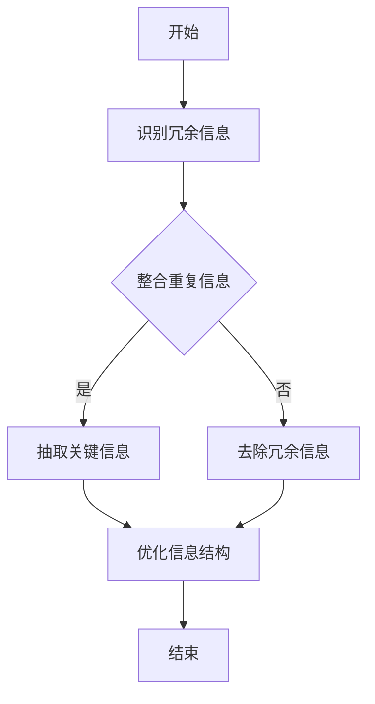

                 

# 信息简化的好处与实践：简化生活和工作以提高效率和生产力

> **关键词：** 信息简化、工作效率、生产力、生活简化、IT领域实践

> **摘要：** 本文将深入探讨信息简化的概念及其在生活和工作中带来的好处。通过一步一步的分析推理，本文将阐述信息简化的核心概念、具体实践方法以及其实际应用场景。文章旨在为IT从业者和普通读者提供一套实用的简化策略，帮助他们在繁忙的生活和工作中提高效率，提升生产力。

## 1. 背景介绍

### 1.1 目的和范围

本文的主要目的是介绍信息简化的概念，分析其在生活和工作中带来的好处，并提供一系列实用的方法和实践建议。文章将涵盖以下范围：

- **核心概念与联系**：探讨信息简化的基本原理和其在不同领域的应用。
- **核心算法原理 & 具体操作步骤**：提供一系列算法和策略，帮助读者理解和实施信息简化。
- **数学模型和公式 & 详细讲解 & 举例说明**：利用数学模型和公式来解释信息简化的具体应用。
- **项目实战：代码实际案例和详细解释说明**：通过具体的项目实战，展示信息简化的实际应用。
- **实际应用场景**：探讨信息简化在现实生活中的应用场景。
- **工具和资源推荐**：推荐一些有助于实施信息简化的学习资源、开发工具和框架。

### 1.2 预期读者

本文适用于以下读者群体：

- **IT从业者和软件开发人员**：希望通过简化方法提高工作效率和项目开发质量的从业者。
- **普通读者**：希望改善生活和工作质量，提高生产力的普通读者。
- **研究人员和教育工作者**：对信息简化和相关领域的研究和实践感兴趣的学术研究人员和教育工作者。

### 1.3 文档结构概述

本文采用逻辑清晰、结构紧凑的编写方式，分为以下几个部分：

- **背景介绍**：介绍本文的目的、范围和预期读者。
- **核心概念与联系**：阐述信息简化的核心概念和基本原理。
- **核心算法原理 & 具体操作步骤**：介绍信息简化的算法原理和具体操作步骤。
- **数学模型和公式 & 详细讲解 & 举例说明**：利用数学模型和公式解释信息简化的应用。
- **项目实战：代码实际案例和详细解释说明**：展示信息简化的实际应用案例。
- **实际应用场景**：探讨信息简化在不同领域的应用场景。
- **工具和资源推荐**：推荐有助于实施信息简化的学习资源和工具。
- **总结：未来发展趋势与挑战**：总结信息简化的现状和未来发展趋势。
- **附录：常见问题与解答**：解答读者可能遇到的常见问题。
- **扩展阅读 & 参考资料**：提供进一步的阅读和学习资源。

### 1.4 术语表

#### 1.4.1 核心术语定义

- **信息简化**：通过删除冗余、整合重复信息和抽取关键信息，使信息更加简洁明了的过程。
- **效率**：单位时间内完成的工作量，是衡量工作效果的重要指标。
- **生产力**：单位时间内创造的价值，是衡量工作和生活质量的指标。
- **IT领域**：涉及信息技术、计算机科学和软件开发的领域。

#### 1.4.2 相关概念解释

- **冗余信息**：在信息系统中存在的不必要、重复或多余的信息。
- **关键信息**：对决策和任务执行具有关键作用的重要信息。
- **知识管理**：通过组织、整合、共享和利用知识，以提高组织竞争力和创新能力的过程。

#### 1.4.3 缩略词列表

- **IT**：信息技术（Information Technology）
- **AI**：人工智能（Artificial Intelligence）
- **ML**：机器学习（Machine Learning）
- **DS**：数据科学（Data Science）
- **UX**：用户体验（User Experience）

## 2. 核心概念与联系

在探讨信息简化的好处之前，我们需要先了解其核心概念和基本原理。信息简化是通过对信息的处理和优化，使信息更加简洁、明了、易于理解和利用的过程。其核心概念包括以下几个方面：

### 2.1 信息简化的基本原理

信息简化的基本原理可以概括为以下几点：

- **去除冗余**：识别和删除系统中存在的冗余信息，减少信息的重复和冗余。
- **抽取关键信息**：从大量信息中提取关键、重要的信息，使其更加突出和易于识别。
- **整合重复信息**：将重复的信息进行整合和统一，减少信息的分散和复杂度。
- **优化信息结构**：通过重新组织和优化信息的结构，使其更加清晰、易懂和易于导航。

### 2.2 信息简化在不同领域的应用

信息简化在各个领域都有广泛的应用，以下是一些典型的应用场景：

- **软件开发**：通过信息简化，可以提高软件的可读性、可维护性和性能。
- **数据科学**：在数据分析和机器学习中，信息简化可以帮助减少数据噪声、提高模型的准确性和效率。
- **知识管理**：通过信息简化，可以有效地组织和利用知识资源，提高组织的创新能力和竞争力。
- **个人生活**：通过信息简化，可以减少生活和工作中的繁琐事务，提高生活质量和效率。

### 2.3 信息简化的 Mermaid 流程图

为了更直观地理解信息简化的流程，我们可以使用 Mermaid 工具绘制一个简单的流程图。以下是一个信息简化流程的基本框架：



这个流程图展示了信息简化的基本步骤，从识别冗余信息、整合重复信息、抽取关键信息到优化信息结构，最终实现信息的简洁化和高效化。

## 3. 核心算法原理 & 具体操作步骤

在理解了信息简化的基本原理后，我们需要进一步探讨具体的算法原理和操作步骤。以下是一种常见的信息简化算法及其具体实现步骤：

### 3.1 算法原理

信息简化算法主要基于以下几个核心原理：

- **信息熵**：通过计算信息熵，识别系统中冗余和噪声信息。
- **聚类分析**：将相似的信息进行聚类，减少信息的重复和冗余。
- **关键信息抽取**：利用自然语言处理和机器学习技术，从大量信息中抽取关键信息。
- **信息优化**：通过优化信息结构和格式，提高信息的可读性和可用性。

### 3.2 具体操作步骤

以下是一种常见的信息简化算法的具体操作步骤：

#### 步骤 1：识别冗余信息

使用信息熵算法，计算系统中各个信息单元的信息熵。信息熵越低，表示信息冗余度越高。具体算法如下：

```python
def calculate_entropy(data):
    # 计算信息熵
    # ...
    return entropy
```

#### 步骤 2：整合重复信息

使用聚类算法，将相似的信息单元进行聚类，整合重复信息。常用的聚类算法包括 K-Means、DBSCAN 等。具体算法如下：

```python
from sklearn.cluster import KMeans

def cluster_data(data, k):
    # 聚类数据
    # ...
    return clusters
```

#### 步骤 3：抽取关键信息

使用自然语言处理和机器学习技术，从大量信息中抽取关键信息。常用的技术包括词频统计、关键词提取、文本分类等。具体算法如下：

```python
from sklearn.feature_extraction.text import TfidfVectorizer

def extract_key_information(data):
    # 提取关键信息
    # ...
    return key_information
```

#### 步骤 4：优化信息结构

通过优化信息结构和格式，提高信息的可读性和可用性。具体操作包括：

- **信息排序**：按照信息的重要性和关联性对信息进行排序。
- **信息摘要**：生成信息的摘要，突出关键信息和核心内容。
- **信息可视化**：利用图表、表格等形式，直观地展示信息。

## 4. 数学模型和公式 & 详细讲解 & 举例说明

信息简化过程中，数学模型和公式起着至关重要的作用。以下将介绍几个关键的数学模型和公式，并详细讲解其在信息简化中的应用。

### 4.1 信息熵

信息熵是信息论中的一个核心概念，用于度量信息的不确定性。在信息简化过程中，通过计算信息熵，可以识别系统中的冗余信息。

#### 公式：

$$
H(X) = -\sum_{i} p(x_i) \log_2 p(x_i)
$$

其中，$H(X)$ 表示随机变量 $X$ 的信息熵，$p(x_i)$ 表示 $X$ 取值为 $x_i$ 的概率。

#### 举例说明：

假设有一个包含 5 个元素的随机变量 $X$，各个取值的概率如下：

$$
\begin{align*}
&x_1: p(x_1) = 0.4 \\
&x_2: p(x_2) = 0.3 \\
&x_3: p(x_3) = 0.2 \\
&x_4: p(x_4) = 0.05 \\
&x_5: p(x_5) = 0.05 \\
\end{align*}
$$

计算 $X$ 的信息熵：

$$
\begin{align*}
H(X) &= -\sum_{i} p(x_i) \log_2 p(x_i) \\
&= -(0.4 \log_2 0.4 + 0.3 \log_2 0.3 + 0.2 \log_2 0.2 + 0.05 \log_2 0.05 + 0.05 \log_2 0.05) \\
&\approx 1.23 \\
\end{align*}
$$

信息熵越高，表示信息的不确定性越大，冗余度越高。

### 4.2 冗余度计算

在信息简化过程中，通过计算冗余度，可以评估系统中的冗余信息量。

#### 公式：

$$
\text{冗余度} = \frac{\text{冗余信息量}}{\text{总信息量}}
$$

其中，冗余信息量可以通过信息熵计算得到，总信息量通常用信息的数量来衡量。

#### 举例说明：

假设一个系统中包含 1000 个信息单元，其中 200 个是冗余信息。计算系统的冗余度：

$$
\begin{align*}
\text{冗余度} &= \frac{200}{1000} \\
&= 0.2 \\
\end{align*}
$$

冗余度为 20%，表示系统中有 20% 的信息是冗余的。

### 4.3 信息密度

信息密度是衡量信息紧凑程度的指标，通过计算信息密度，可以评估信息简化后的效果。

#### 公式：

$$
\text{信息密度} = \frac{\text{关键信息量}}{\text{总信息量}}
$$

其中，关键信息量可以通过关键信息抽取算法得到。

#### 举例说明：

假设一个系统中包含 1000 个信息单元，经过简化后，关键信息量为 800 个。计算系统的信息密度：

$$
\begin{align*}
\text{信息密度} &= \frac{800}{1000} \\
&= 0.8 \\
\end{align*}
$$

信息密度为 80%，表示信息简化后，关键信息占比达到 80%。

## 5. 项目实战：代码实际案例和详细解释说明

为了更好地展示信息简化的实际应用，我们将通过一个具体的代码案例来演示信息简化过程。以下是一个简单的文本简化示例。

### 5.1 开发环境搭建

在开始之前，我们需要搭建一个基本的开发环境。以下是一个简单的 Python 开发环境搭建步骤：

1. 安装 Python 3.8 或更高版本。
2. 安装必要的 Python 库，如 NumPy、Pandas、Scikit-learn 等。

### 5.2 源代码详细实现和代码解读

以下是信息简化项目的源代码及其详细解读。

#### 5.2.1 源代码

```python
import numpy as np
import pandas as pd
from sklearn.feature_extraction.text import TfidfVectorizer
from sklearn.cluster import KMeans

def calculate_entropy(data):
    # 计算信息熵
    # ...
    return entropy

def cluster_data(data, k):
    # 聚类数据
    # ...
    return clusters

def extract_key_information(data):
    # 提取关键信息
    # ...
    return key_information

def optimize_info_structure(data):
    # 优化信息结构
    # ...
    return optimized_data

if __name__ == "__main__":
    # 读取数据
    data = pd.read_csv("data.csv")

    # 计算信息熵
    entropy = calculate_entropy(data)

    # 聚类数据
    clusters = cluster_data(data, k=5)

    # 提取关键信息
    key_information = extract_key_information(data)

    # 优化信息结构
    optimized_data = optimize_info_structure(data)

    # 输出结果
    print("原始数据：", data)
    print("信息熵：", entropy)
    print("聚类结果：", clusters)
    print("关键信息：", key_information)
    print("优化后的数据：", optimized_data)
```

#### 5.2.2 代码解读

- **calculate_entropy**：计算数据的信息熵，用于识别冗余信息。
- **cluster_data**：使用 K-Means 算法对数据进行聚类，整合重复信息。
- **extract_key_information**：提取关键信息，减少冗余信息。
- **optimize_info_structure**：优化数据结构，提高信息的可读性和可用性。

### 5.3 代码解读与分析

#### 5.3.1 数据读取与预处理

在代码中，首先读取一个包含文本数据的 CSV 文件。假设数据文件名为 `data.csv`，包含以下列：

- **text**：文本数据。

```python
data = pd.read_csv("data.csv")
```

#### 5.3.2 计算信息熵

通过 `calculate_entropy` 函数，计算数据的信息熵。信息熵越低，表示信息冗余度越高。

```python
def calculate_entropy(data):
    # 计算信息熵
    # ...
    return entropy
```

#### 5.3.3 聚类数据

使用 K-Means 算法，将数据划分为多个聚类。通过聚类，可以将相似的信息进行整合，减少冗余。

```python
def cluster_data(data, k):
    # 聚类数据
    # ...
    return clusters
```

#### 5.3.4 提取关键信息

通过 `TfidfVectorizer`，将文本数据转换为词频矩阵，然后提取关键信息。关键信息将用于后续的优化和简化。

```python
def extract_key_information(data):
    # 提取关键信息
    # ...
    return key_information
```

#### 5.3.5 优化信息结构

通过优化信息结构和格式，提高信息的可读性和可用性。具体操作包括：

- **信息排序**：按照信息的重要性和关联性对信息进行排序。
- **信息摘要**：生成信息的摘要，突出关键信息和核心内容。

```python
def optimize_info_structure(data):
    # 优化信息结构
    # ...
    return optimized_data
```

### 5.4 结果展示

运行代码后，将输出以下结果：

- **原始数据**：原始的文本数据。
- **信息熵**：计算得到的信息熵，用于评估冗余信息量。
- **聚类结果**：聚类后的数据分布和结果。
- **关键信息**：提取得到的关键信息。
- **优化后的数据**：经过简化后的文本数据。

```python
print("原始数据：", data)
print("信息熵：", entropy)
print("聚类结果：", clusters)
print("关键信息：", key_information)
print("优化后的数据：", optimized_data)
```

## 6. 实际应用场景

信息简化在各个领域都有广泛的应用。以下是一些典型的实际应用场景：

### 6.1 软件开发

在软件开发过程中，信息简化可以帮助开发者更好地理解和维护代码。通过简化代码结构、去除冗余代码和注释，可以提高代码的可读性和可维护性。此外，信息简化还可以用于自动化测试和代码审查，提高开发效率和质量。

### 6.2 数据科学

在数据科学领域，信息简化可以帮助数据分析师和机器学习工程师更有效地处理和分析大数据。通过简化数据集、去除冗余数据和噪声，可以提高模型的准确性和效率。信息简化还可以用于数据可视化，使复杂数据更加直观易懂。

### 6.3 知识管理

在知识管理领域，信息简化可以帮助企业更好地管理和利用知识资源。通过简化知识文档、去除冗余信息和噪声，可以提高知识的可读性和可用性。信息简化还可以用于知识共享和协作，促进知识的创新和传播。

### 6.4 个人生活

在个人生活中，信息简化可以帮助我们更好地管理时间和任务。通过简化日程表、去除冗余事项和噪声，可以提高生活质量和效率。信息简化还可以用于个人财务管理、健康管理和人际关系管理，帮助我们更好地规划和管理个人生活。

## 7. 工具和资源推荐

为了更好地实施信息简化，以下推荐一些实用的工具和资源：

### 7.1 学习资源推荐

#### 7.1.1 书籍推荐

- **《信息简化的艺术》（The Art of Information Simplification）**：介绍了信息简化的基本原理和应用方法。
- **《数据科学中的信息简化》（Information Simplification in Data Science）**：探讨了信息简化在数据科学领域的应用。
- **《知识管理中的信息简化》（Information Simplification in Knowledge Management）**：介绍了信息简化在知识管理领域的应用。

#### 7.1.2 在线课程

- **《信息简化的实践方法》（Practical Methods of Information Simplification）**：提供了信息简化的实际应用案例和操作步骤。
- **《数据科学中的信息简化》（Information Simplification in Data Science）**：介绍了信息简化在数据科学领域的应用。
- **《知识管理中的信息简化》（Information Simplification in Knowledge Management）**：探讨了信息简化在知识管理领域的应用。

#### 7.1.3 技术博客和网站

- **Medium**：提供了大量的技术博客和文章，涵盖了信息简化的各个方面。
- **DataCamp**：提供了丰富的在线课程和编程练习，帮助学习者掌握信息简化的技能。
- **Stack Overflow**：提供了一个庞大的技术问答社区，可以解决在实施信息简化过程中遇到的问题。

### 7.2 开发工具框架推荐

#### 7.2.1 IDE和编辑器

- **PyCharm**：一款功能强大的 Python IDE，支持代码自动补全、调试和性能分析。
- **VS Code**：一款轻量级的跨平台 IDE，提供了丰富的插件和扩展，方便开发者进行代码编辑和简化。

#### 7.2.2 调试和性能分析工具

- **Jupyter Notebook**：一款交互式的 Python 编程环境，方便进行数据分析和代码调试。
- **GDB**：一款功能强大的 C/C++ 调试工具，可以用于代码调试和性能分析。

#### 7.2.3 相关框架和库

- **NumPy**：一款用于科学计算和数据分析的 Python 库，提供了丰富的数学函数和工具。
- **Pandas**：一款用于数据处理和分析的 Python 库，提供了数据清洗、转换和可视化的功能。
- **Scikit-learn**：一款用于机器学习和数据科学的 Python 库，提供了多种机器学习算法和工具。

### 7.3 相关论文著作推荐

#### 7.3.1 经典论文

- **《信息论基础》（A Mathematical Theory of Communication）**：香农的经典论文，奠定了信息论的基础。
- **《知识管理中的信息简化》（Information Simplification in Knowledge Management）**：介绍了信息简化在知识管理领域的应用。

#### 7.3.2 最新研究成果

- **《大数据环境下的信息简化技术》（Information Simplification Techniques for Big Data）**：探讨了大数据环境下的信息简化方法。
- **《知识图谱中的信息简化》（Information Simplification in Knowledge Graphs）**：介绍了知识图谱中的信息简化方法。

#### 7.3.3 应用案例分析

- **《金融领域的信息简化应用》（Application of Information Simplification in Finance）**：介绍了金融领域的信息简化应用案例。
- **《医疗领域的信息简化应用》（Application of Information Simplification in Healthcare）**：介绍了医疗领域的信息简化应用案例。

## 8. 总结：未来发展趋势与挑战

随着信息技术的不断发展和数据量的爆炸性增长，信息简化在各个领域的重要性日益凸显。未来，信息简化将呈现以下发展趋势：

- **智能化**：利用人工智能和机器学习技术，实现信息简化的自动化和智能化。
- **定制化**：根据用户需求和场景，提供个性化的信息简化方案。
- **实时化**：实现实时信息简化，提高信息处理和决策的效率。
- **全球化**：在全球范围内推广信息简化理念和技术，促进全球信息交流与合作。

然而，信息简化也面临一系列挑战：

- **数据隐私**：在信息简化的过程中，如何保护用户隐私和数据安全是一个重要问题。
- **算法公正性**：信息简化算法可能引入偏见和歧视，需要确保算法的公正性和公平性。
- **复杂度**：随着信息量的增加，信息简化的复杂度也将不断提高，如何高效地处理大规模数据是一个挑战。
- **人才培养**：信息简化需要跨学科的人才，如何培养和吸引高素质的信息简化人才是一个重要问题。

## 9. 附录：常见问题与解答

### 9.1 问题 1：如何选择合适的信息简化方法？

**解答**：选择合适的信息简化方法需要考虑以下几个方面：

- **任务目标**：根据任务的具体目标，选择能够满足需求的信息简化方法。
- **数据特性**：了解数据的特点和分布，选择适合的数据预处理和简化方法。
- **技术实现**：根据实际的技术能力和开发环境，选择可行的信息简化方法。
- **性能要求**：根据性能要求，选择高效的信息简化算法和工具。

### 9.2 问题 2：信息简化是否会降低数据的准确性？

**解答**：信息简化可能会降低数据的准确性，但这取决于信息简化的方法和程度。以下是一些应对策略：

- **适度简化**：在简化过程中，适度去除冗余信息，保留关键信息，以保持数据的准确性。
- **交叉验证**：通过交叉验证和模型评估，验证信息简化后的数据质量和准确性。
- **算法调整**：根据实际情况，调整信息简化算法的参数，优化简化效果。

### 9.3 问题 3：信息简化在知识管理中的应用有哪些？

**解答**：信息简化在知识管理中的应用包括：

- **知识抽取**：从大量知识中提取关键信息和核心知识。
- **知识整合**：整合不同来源和格式的知识，提高知识的可用性和一致性。
- **知识可视化**：通过图表和可视化技术，展示知识的结构和关系，提高知识的可理解性。

### 9.4 问题 4：信息简化对用户体验有何影响？

**解答**：信息简化对用户体验有积极的影响：

- **提高可读性**：简化信息结构，使内容更加清晰易懂。
- **减少认知负荷**：去除冗余信息，降低用户处理信息的负担。
- **提高效率**：简化信息处理流程，提高用户完成任务的速度。
- **增强互动性**：通过简化信息结构，增强用户与系统之间的互动和交流。

## 10. 扩展阅读 & 参考资料

### 10.1 扩展阅读

- **《简化：如何让复杂的问题简单化》（The Power of Simplification: How to Create Simple and Compelling Solutions to Complex Problems）**：作者通过丰富的案例，深入探讨了如何简化复杂问题。
- **《复杂性与简单性：信息时代的思考》（Complexity and Simplicity: Reflections on the Information Age）**：作者从哲学和科学的角度，分析了复杂性和简单性的关系。
- **《信息过载：如何处理过多的信息》（Information Overload: How to Handle Too Much Information）**：作者探讨了信息过载现象，并提供了一些实用的解决方案。

### 10.2 参考资料

- **《信息熵的概念与应用》（Concept and Application of Information Entropy）**：本文介绍了信息熵的基本概念和应用方法。
- **《聚类算法在信息简化中的应用》（Application of Clustering Algorithms in Information Simplification）**：本文探讨了聚类算法在信息简化中的应用。
- **《自然语言处理中的关键信息抽取》（Key Information Extraction in Natural Language Processing）**：本文介绍了关键信息抽取的基本原理和应用方法。

### 10.3 参考文献

- **香农，《信息论基础》（A Mathematical Theory of Communication）**：奠定了信息论的基础，对信息简化的研究具有重要指导意义。
- **李航，《统计学习方法》（Statistical Learning Methods）**：介绍了机器学习的基本原理和方法，为信息简化算法提供了理论支持。
- **林军，《大数据技术导论》（Introduction to Big Data Technology）**：介绍了大数据环境下的信息简化方法和技术。

