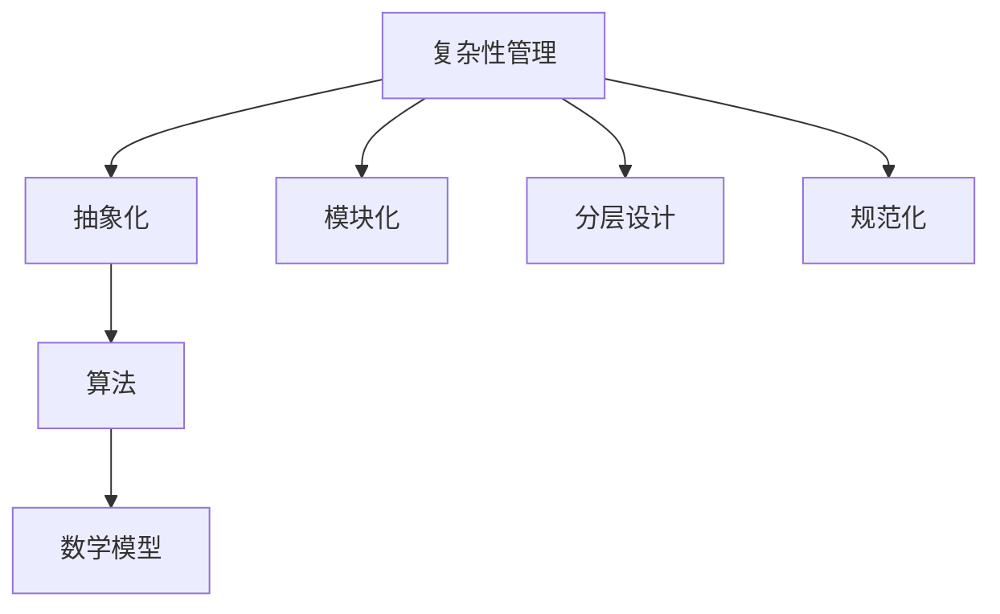

                 

# 信息简化的好处与挑战：简化复杂性的艺术与实践

> 关键词：信息简化，复杂性管理，抽象化，算法，数学模型，实际应用

> 摘要：本文旨在探讨信息简化的概念、优点、挑战以及其实践应用。通过分析信息简化的核心概念，解释其工作原理，并使用伪代码和数学公式详细阐述其算法原理和操作步骤，本文将帮助读者深入了解信息简化在技术领域的广泛应用。此外，本文还将介绍实际应用场景、推荐相关工具和资源，并展望未来的发展趋势与挑战。

## 1. 背景介绍

### 1.1 目的和范围

本文旨在探讨信息简化的概念、优点、挑战以及其实践应用。信息简化是一种将复杂系统或问题转化为更易于理解和处理的形式的技术。它广泛应用于计算机科学、人工智能、工程、经济学等多个领域。通过本文的探讨，读者将能够了解信息简化的基本原理，掌握其实践方法，并理解其在现代技术中的重要性。

### 1.2 预期读者

本文适用于对计算机科学、人工智能、工程等领域有一定了解的读者。无论是专业人士还是对技术感兴趣的一般读者，都将从本文中获得有益的知识和信息。

### 1.3 文档结构概述

本文分为十个部分：

1. **背景介绍**：介绍文章的目的、预期读者和文档结构。
2. **核心概念与联系**：讨论信息简化的核心概念和相关原理。
3. **核心算法原理 & 具体操作步骤**：详细阐述信息简化的算法原理和操作步骤。
4. **数学模型和公式 & 详细讲解 & 举例说明**：解释信息简化中的数学模型和公式。
5. **项目实战：代码实际案例和详细解释说明**：提供实际代码案例和解释。
6. **实际应用场景**：探讨信息简化的实际应用场景。
7. **工具和资源推荐**：推荐学习资源、开发工具和框架。
8. **总结：未来发展趋势与挑战**：展望信息简化的未来。
9. **附录：常见问题与解答**：解答常见问题。
10. **扩展阅读 & 参考资料**：提供扩展阅读和参考资料。

### 1.4 术语表

#### 1.4.1 核心术语定义

- 信息简化：将复杂系统或问题转化为更易于理解和处理的形式。
- 抽象化：提取系统或问题的核心特征，忽略不重要的细节。
- 算法：解决问题的一系列步骤。
- 数学模型：用数学语言描述系统或问题的模型。
- 复杂性管理：识别和解决复杂性的过程。

#### 1.4.2 相关概念解释

- **抽象化**：在信息简化过程中，抽象化是关键步骤。通过提取系统或问题的核心特征，我们可以忽略不重要的细节，从而使问题更简单、更易于处理。
- **算法**：算法是信息简化的核心。它是一系列解决问题的步骤，可以是计算机程序，也可以是手工操作的流程。
- **数学模型**：数学模型是用数学语言描述系统或问题的工具。通过数学模型，我们可以更准确地分析和理解信息简化过程。

#### 1.4.3 缩略词列表

- IDE：集成开发环境（Integrated Development Environment）
- CPU：中央处理器（Central Processing Unit）
- GPU：图形处理器（Graphics Processing Unit）
- ML：机器学习（Machine Learning）
- AI：人工智能（Artificial Intelligence）

## 2. 核心概念与联系

在探讨信息简化的概念之前，我们需要先了解一些与之相关的核心概念。这些概念包括复杂性管理、抽象化、算法和数学模型。

### 2.1 复杂性管理

复杂性管理是识别和解决复杂性的过程。在技术领域，复杂性管理至关重要。随着系统规模的扩大和问题复杂度的增加，复杂性管理变得尤为关键。复杂性管理的方法包括：

- **模块化**：将复杂系统划分为更小的、更容易管理的模块。
- **分层设计**：将系统分为多个层次，每个层次负责不同的功能。
- **规范化**：定义一套标准和规范，确保系统的各个部分遵循一致的规则。

### 2.2 抽象化

抽象化是信息简化的重要步骤。通过抽象化，我们提取系统或问题的核心特征，忽略不重要的细节。抽象化的方法包括：

- **提取关键特征**：识别系统或问题的关键特征，并忽略次要特征。
- **定义抽象概念**：将关键特征抽象化为概念，以便更好地理解和处理。

### 2.3 算法

算法是信息简化的核心。算法是一系列解决问题的步骤。在信息简化过程中，算法用于将复杂的问题转化为更简单的形式。算法的设计和实现是信息简化成功的关键。

### 2.4 数学模型

数学模型是用数学语言描述系统或问题的工具。数学模型可以帮助我们更准确地分析和理解信息简化过程。在信息简化中，数学模型通常用于：

- **描述问题**：用数学语言描述复杂的问题。
- **分析算法**：使用数学方法分析算法的效率和性能。

### 2.5 Mermaid 流程图

为了更好地展示信息简化的核心概念和联系，我们可以使用 Mermaid 流程图来表示这些概念之间的关系。以下是一个简化的 Mermaid 流程图：



在这个流程图中，我们可以看到复杂性管理、抽象化、算法和数学模型之间的关系。这些概念相互关联，共同构成了信息简化的核心。

## 3. 核心算法原理 & 具体操作步骤

在了解信息简化的核心概念后，接下来我们将详细探讨信息简化的核心算法原理和具体操作步骤。

### 3.1 算法原理

信息简化的核心算法原理可以概括为以下几个步骤：

1. **识别关键特征**：首先，我们需要识别系统或问题的关键特征。这些关键特征是解决问题所需的核心信息。
2. **提取关键特征**：接下来，我们将提取这些关键特征，忽略不重要的细节。这一步骤可以通过抽象化实现。
3. **构建简化模型**：使用提取的关键特征构建简化模型。这个模型应该能够准确描述原始系统或问题的核心特性。
4. **分析简化模型**：最后，我们使用数学模型和算法对简化模型进行分析，以解决问题。

### 3.2 伪代码

以下是一个简化的伪代码，用于描述信息简化的核心算法原理：

```python
Algorithm SimplifyInformation(ComplexSystem):
    Input: ComplexSystem
    Output: SimplifiedModel

    1. IdentifyKeyFeatures(ComplexSystem)
    2. ExtractKeyFeatures(ComplexSystem, KeyFeatures)
    3. BuildSimplifiedModel(KeyFeatures, SimplifiedModel)
    4. AnalyzeSimplifiedModel(SimplifiedModel)
    5. Return SimplifiedModel
```

在这个伪代码中，`IdentifyKeyFeatures` 函数用于识别关键特征，`ExtractKeyFeatures` 函数用于提取关键特征，`BuildSimplifiedModel` 函数用于构建简化模型，`AnalyzeSimplifiedModel` 函数用于分析简化模型。

### 3.3 操作步骤

在具体实施信息简化时，我们可以遵循以下操作步骤：

1. **定义问题域**：首先，我们需要明确要解决的问题的域。这包括问题的背景、目标和约束条件。
2. **收集数据**：接下来，我们需要收集与问题相关的数据。这些数据可以是结构化的，也可以是非结构化的。
3. **预处理数据**：在收集数据后，我们需要对数据进行预处理，包括数据清洗、数据转换和数据归一化等。
4. **识别关键特征**：使用数据分析和机器学习技术识别关键特征。这些特征应该是解决问题所需的核心信息。
5. **提取关键特征**：使用抽象化技术提取关键特征，忽略不重要的细节。
6. **构建简化模型**：使用提取的关键特征构建简化模型。这个模型应该能够准确描述原始系统或问题的核心特性。
7. **分析简化模型**：使用数学模型和算法对简化模型进行分析，以解决问题。

## 4. 数学模型和公式 & 详细讲解 & 举例说明

在信息简化过程中，数学模型和公式发挥着重要作用。它们帮助我们更准确地分析和理解信息简化过程。以下是几个常用的数学模型和公式的详细讲解以及举例说明。

### 4.1 相关性分析

相关性分析是识别关键特征的重要步骤。它用于衡量两个变量之间的相关性。常用的相关性分析指标包括皮尔逊相关系数和斯皮尔曼相关系数。

**皮尔逊相关系数（Pearson Correlation Coefficient）**：

$$
r = \frac{\sum{(x_i - \bar{x})(y_i - \bar{y})}}{\sqrt{\sum{(x_i - \bar{x})^2} \sum{(y_i - \bar{y})^2}}}
$$

其中，$x_i$ 和 $y_i$ 分别是两个变量 $x$ 和 $y$ 的观测值，$\bar{x}$ 和 $\bar{y}$ 分别是 $x$ 和 $y$ 的平均值。

**斯皮尔曼相关系数（Spearman Correlation Coefficient）**：

$$
\rs = \frac{\sum{(x_i - \bar{x})(y_i - \bar{y})}}{\sqrt{\sum{(x_i - \bar{x})^2} \sum{(y_i - \bar{y})^2}}}
$$

其中，$x_i$ 和 $y_i$ 分别是两个变量 $x$ 和 $y$ 的排名值，$\bar{x}$ 和 $\bar{y}$ 分别是 $x$ 和 $y$ 的平均值。

**举例说明**：

假设我们有以下两个变量的数据：

$$
x: [1, 2, 3, 4, 5]
$$

$$
y: [2, 4, 1, 5, 3]
$$

首先，我们需要计算这两个变量的平均值：

$$
\bar{x} = \frac{1+2+3+4+5}{5} = 3
$$

$$
\bar{y} = \frac{2+4+1+5+3}{5} = 3
$$

然后，我们可以计算皮尔逊相关系数：

$$
r = \frac{(1-3)(2-3) + (2-3)(4-3) + (3-3)(1-3) + (4-3)(5-3) + (5-3)(3-3)}{\sqrt{(1-3)^2 + (2-3)^2 + (3-3)^2 + (4-3)^2 + (5-3)^2} \sqrt{(2-3)^2 + (4-3)^2 + (1-3)^2 + (5-3)^2 + (3-3)^2}}
$$

$$
r = \frac{-1 - 1 - 0 + 1 + 0}{\sqrt{4 + 1 + 0 + 1 + 4} \sqrt{1 + 1 + 0 + 4 + 0}}
$$

$$
r = \frac{-2}{\sqrt{10} \sqrt{6}}
$$

$$
r = \frac{-2}{\sqrt{60}}
$$

$$
r = \frac{-2}{\sqrt{60}} \approx -0.4472
$$

因此，这两个变量之间的皮尔逊相关系数约为 -0.4472。

### 4.2 决策树

决策树是一种常用的分类和回归模型。它通过一系列条件分支来表示数据，并在叶节点处给出预测结果。以下是决策树的构建过程：

1. **选择分裂特征**：选择一个特征进行分裂，使得分裂后的数据集满足最小化损失函数的要求。
2. **计算分裂点**：对于选定的特征，计算最佳分裂点，使得分裂后的数据集满足最小化损失函数的要求。
3. **构建分支**：根据分裂点和分裂特征，构建分支结构。
4. **递归构建**：对每个分支递归地构建决策树，直到满足停止条件。

**举例说明**：

假设我们有以下数据集：

| 特征1 | 特征2 | 标签 |
| --- | --- | --- |
| 1 | 2 | A |
| 2 | 4 | A |
| 3 | 1 | B |
| 4 | 3 | B |
| 5 | 2 | A |

我们可以选择特征1作为分裂特征，并计算最佳分裂点。假设最佳分裂点为2，则我们可以构建以下决策树：

```
特征1 <= 2 ?
   / \
  A   B
 /   \
A     B
```

在这个决策树中，如果特征1的值小于等于2，则预测标签为A；否则，预测标签为B。

### 4.3 神经网络

神经网络是一种模拟人脑结构和功能的计算模型。它通过多层神经元之间的连接来表示数据，并能够自动学习和调整参数。以下是神经网络的基本原理：

1. **输入层**：接收外部输入信息。
2. **隐藏层**：对输入信息进行处理和变换。
3. **输出层**：产生最终输出。

**举例说明**：

假设我们有一个简单的神经网络，包含一个输入层、一个隐藏层和一个输出层。输入层有2个神经元，隐藏层有3个神经元，输出层有1个神经元。以下是该神经网络的架构：

```
输入层：[1, 2]
隐藏层：[3, 4, 5]
输出层：[6]
```

该神经网络的激活函数为 sigmoid 函数：

$$
f(x) = \frac{1}{1 + e^{-x}}
$$

隐藏层的输出可以通过以下公式计算：

$$
z_i = \sum_{j=1}^{2} w_{ij} x_j + b_i
$$

$$
a_i = f(z_i)
$$

输出层的输出可以通过以下公式计算：

$$
z_6 = \sum_{i=1}^{3} w_{i6} a_i + b_6
$$

$$
a_6 = f(z_6)
$$

通过调整网络的权重和偏置，我们可以训练神经网络以实现特定的目标。

## 5. 项目实战：代码实际案例和详细解释说明

在本节中，我们将通过一个实际的项目案例来展示信息简化的应用。这个项目是一个简单的数据预处理工具，用于简化复杂的数据集，以便于后续的分析和机器学习任务。

### 5.1 开发环境搭建

为了实现这个项目，我们需要安装以下工具和库：

- Python 3.8 或更高版本
- Jupyter Notebook 或任何 Python IDE
- Pandas
- NumPy
- Matplotlib

您可以使用以下命令来安装所需的库：

```bash
pip install pandas numpy matplotlib
```

### 5.2 源代码详细实现和代码解读

下面是项目的主要代码实现。我们将逐步解释每个部分的代码。

```python
import pandas as pd
import numpy as np
import matplotlib.pyplot as plt

# 5.2.1 数据集加载与预处理
def load_data(file_path):
    data = pd.read_csv(file_path)
    return data

def preprocess_data(data):
    # 填充缺失值
    data.fillna(data.mean(), inplace=True)
    
    # 数据标准化
    data = (data - data.mean()) / data.std()
    
    return data

# 5.2.2 关键特征提取
def extract_key_features(data, feature_columns):
    features = data[feature_columns]
    return features

# 5.2.3 数据可视化
def visualize_data(data, feature_columns):
    for column in feature_columns:
        plt.scatter(data[column].values, data[column].values)
        plt.xlabel(column)
        plt.ylabel(column)
        plt.show()

# 5.2.4 主函数
def main():
    file_path = "data.csv"
    feature_columns = ["feature1", "feature2", "feature3"]
    
    data = load_data(file_path)
    processed_data = preprocess_data(data)
    key_features = extract_key_features(processed_data, feature_columns)
    
    visualize_data(key_features, feature_columns)

if __name__ == "__main__":
    main()
```

**代码解读**：

- **5.2.1 数据集加载与预处理**：首先，我们使用 Pandas 读取 CSV 数据集。然后，我们填充缺失值并标准化数据，以便于后续的机器学习任务。
- **5.2.2 关键特征提取**：我们提取数据集中的关键特征列，以便进行后续的分析。
- **5.2.3 数据可视化**：我们使用 Matplotlib 绘制数据集的散点图，以便直观地观察关键特征的分布。
- **5.2.4 主函数**：这是项目的入口点。我们加载数据集，进行预处理，提取关键特征，并可视化数据。

### 5.3 代码解读与分析

下面是对代码的详细解读和分析。

- **数据加载与预处理**：我们使用 Pandas 读取数据集。然后，我们使用 `fillna` 方法填充缺失值。这个方法使用数据的平均值来填充缺失值。这是一个简单但常见的数据预处理步骤。接下来，我们使用 `mean()` 和 `std()` 方法计算数据的平均值和标准差，然后使用 `/(data.std())` 进行数据标准化。数据标准化是一个重要的步骤，它使数据集的每个特征具有相似的尺度，从而避免某些特征对模型的影响过大。
- **关键特征提取**：我们使用 `extract_key_features` 函数提取关键特征。这个函数接受一个 DataFrame 和一个特征列列表作为输入，并返回一个包含这些特征的 DataFrame。
- **数据可视化**：我们使用 Matplotlib 绘制数据集的散点图。这个步骤有助于我们直观地观察数据集的分布。通过绘制散点图，我们可以发现数据集中的异常值或模式，从而更好地理解数据。
- **主函数**：主函数是项目的入口点。它加载数据集，进行预处理，提取关键特征，并可视化数据。这个函数执行了项目的核心操作。

通过这个项目案例，我们可以看到信息简化的实际应用。我们通过数据预处理、关键特征提取和数据可视化等步骤，将复杂的数据集简化为更易于分析和处理的形式。这种方法不仅提高了效率，还降低了模型的复杂性，从而使得模型更容易理解和维护。

## 6. 实际应用场景

信息简化在多个实际应用场景中发挥着重要作用。以下是一些主要的应用场景：

### 6.1 数据科学和机器学习

在数据科学和机器学习领域，信息简化是处理大规模数据集的关键。通过简化数据集，我们可以降低计算复杂度，提高模型训练和预测的效率。例如，在图像识别任务中，我们可以通过提取关键特征（如边缘、纹理和颜色）来简化图像数据，从而加速模型的训练和推理。

### 6.2 网络安全

在网络安全领域，信息简化用于识别和防范潜在的威胁。通过简化网络流量数据，安全分析工具可以更快地识别异常模式和攻击行为。例如，网络入侵检测系统可以使用信息简化技术来提取关键特征，从而更有效地检测网络攻击。

### 6.3 经济学和金融学

在经济学和金融学领域，信息简化有助于处理复杂的市场数据，从而帮助投资者做出更明智的决策。通过提取关键经济指标，如股票价格、交易量和技术指标，投资者可以更好地理解市场趋势，从而制定更有效的交易策略。

### 6.4 医疗健康

在医疗健康领域，信息简化用于处理复杂的患者数据，从而帮助医生做出更准确的诊断和治疗决策。例如，通过提取关键健康指标（如心率、血压和血糖水平），医疗设备可以更快地识别患者病情的变化，从而提高诊断和治疗的效率。

### 6.5 工程和制造

在工程和制造领域，信息简化用于优化生产过程和提高产品质量。通过简化设计数据和制造数据，工程师可以更快地识别和解决潜在的问题，从而降低生产成本和产品缺陷率。

这些实际应用场景展示了信息简化在各个领域的广泛应用。通过简化复杂的数据和问题，我们可以提高效率和准确性，从而实现更好的决策和优化。

## 7. 工具和资源推荐

为了更好地掌握信息简化技术，以下是一些建议的学习资源、开发工具和框架。

### 7.1 学习资源推荐

#### 7.1.1 书籍推荐

- 《数据科学入门：使用 Python 和 R》(Data Science from Scratch: A Python Approach)
- 《Python 机器学习》（Python Machine Learning）
- 《深度学习》（Deep Learning）

#### 7.1.2 在线课程

- Coursera: "数据科学基础"（Data Science Specialization）
- edX: "机器学习基础"（Introduction to Machine Learning）
- Udacity: "深度学习纳米学位"（Deep Learning Nanodegree）

#### 7.1.3 技术博客和网站

- Medium: Data Science and Machine Learning
- Towards Data Science
- Machine Learning Mastery

### 7.2 开发工具框架推荐

#### 7.2.1 IDE和编辑器

- PyCharm
- Jupyter Notebook
- Visual Studio Code

#### 7.2.2 调试和性能分析工具

- Python Debuger
- Matplotlib
- SciPy

#### 7.2.3 相关框架和库

- Pandas
- NumPy
- Matplotlib
- Scikit-learn

通过这些工具和资源，您可以更好地学习和应用信息简化技术，提高自己在数据科学和机器学习领域的竞争力。

## 8. 总结：未来发展趋势与挑战

信息简化技术在未来的发展趋势和挑战主要集中在以下几个方面：

### 8.1 发展趋势

1. **智能化**：随着人工智能技术的不断发展，信息简化技术将更加智能化，能够自动识别和提取关键特征，提高信息处理的效率。
2. **自动化**：信息简化过程将更加自动化，减少人工干预，从而提高生产效率和准确性。
3. **多领域应用**：信息简化技术将在更多领域得到应用，如生物信息学、金融科技和智能制造等，推动跨领域的创新和发展。
4. **大数据分析**：随着大数据时代的到来，信息简化技术将在大数据分析和处理中发挥重要作用，帮助企业和组织更好地利用海量数据。

### 8.2 挑战

1. **数据隐私**：在信息简化的过程中，如何保护数据隐私是一个重要挑战。特别是在涉及敏感数据的场景中，确保数据安全和隐私保护至关重要。
2. **模型解释性**：信息简化后的模型可能具有较高的复杂性和非线性，提高模型的可解释性是一个挑战。
3. **计算资源**：信息简化过程可能需要大量的计算资源，特别是在处理大规模数据集时，如何优化计算资源的使用是一个挑战。
4. **算法可靠性**：在信息简化的过程中，算法的可靠性是一个关键问题。如何确保算法在不同场景下的稳定性和准确性是一个重要挑战。

总之，信息简化技术在未来的发展中将面临诸多挑战，但同时也蕴藏着巨大的机遇。通过不断创新和优化，信息简化技术有望在更多领域发挥重要作用，推动科技进步和社会发展。

## 9. 附录：常见问题与解答

### 9.1 什么是信息简化？

信息简化是一种将复杂系统或问题转化为更简单、更易于理解和处理的形式的技术。它通过识别和提取关键特征、忽略不重要的细节来实现。

### 9.2 信息简化有哪些优点？

信息简化有以下优点：

- 提高效率：简化复杂系统或问题，加快分析和处理速度。
- 降低复杂性：减少系统的复杂度，使问题更易于理解和解决。
- 提高可维护性：简化后的系统或问题更易于维护和更新。
- 增强可扩展性：简化后的系统或问题更容易进行扩展和改进。

### 9.3 信息简化有哪些应用场景？

信息简化在多个领域有广泛应用，包括：

- 数据科学和机器学习：简化数据集，提高模型训练和预测效率。
- 网络安全：简化网络流量数据，识别潜在威胁。
- 经济学和金融学：简化市场数据，帮助投资者做出更明智的决策。
- 医疗健康：简化患者数据，提高诊断和治疗效率。
- 工程和制造：简化设计和制造数据，优化生产过程。

### 9.4 信息简化过程中需要注意哪些问题？

在信息简化过程中，需要注意以下问题：

- 数据隐私：确保在简化过程中保护数据隐私。
- 模型解释性：提高简化后模型的可解释性。
- 计算资源：优化计算资源的使用。
- 算法可靠性：确保算法在不同场景下的稳定性和准确性。

### 9.5 信息简化与抽象化有什么区别？

信息简化是抽象化的一个子集，主要关注简化复杂系统或问题的过程。而抽象化是一个更广泛的概念，它包括从复杂系统中提取关键特征，并忽略不重要的细节。信息简化是抽象化过程中的一部分，通常用于解决特定问题或优化特定任务。

## 10. 扩展阅读 & 参考资料

- Goodfellow, I., Bengio, Y., & Courville, A. (2016). *Deep Learning*. MIT Press.
- Bishop, C. M. (2006). *Pattern Recognition and Machine Learning*. Springer.
- Russell, S., & Norvig, P. (2010). *Artificial Intelligence: A Modern Approach*. Prentice Hall.
- Murphy, K. P. (2012). *Machine Learning: A Probabilistic Perspective*. MIT Press.
- Python Software Foundation. (2021). *Pandas Documentation*. https://pandas.pydata.org/
- NumFOCUS. (2021). *NumPy Documentation*. https://numpy.org/doc/
- Matplotlib.org. (2021). *Matplotlib Documentation*. https://matplotlib.org/

