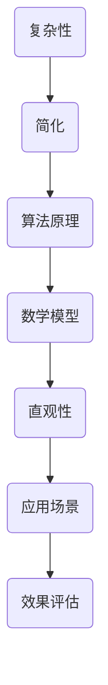

                 

# 信息简化的好处与挑战：简化复杂性的艺术与科学

> **关键词：** 信息简化，复杂性，算法原理，数学模型，实际应用，未来趋势。
>
> **摘要：** 本文将探讨信息简化的好处与挑战，解析简化复杂性的艺术与科学。通过详细阐述核心概念、算法原理、数学模型及实际应用案例，本文旨在为读者提供深入理解与实用指导，揭示简化复杂性在信息技术领域中的重要作用。

## 1. 背景介绍

### 1.1 目的和范围

本文旨在探讨信息简化在信息技术领域中的重要性，分析其带来的好处与挑战。通过深入分析信息简化的核心概念、算法原理、数学模型及实际应用场景，本文希望为读者提供系统、全面的理解，并揭示简化复杂性在推动技术创新、提高系统效率等方面的关键作用。

### 1.2 预期读者

本文面向信息技术领域的开发者、研究人员、以及对该主题感兴趣的一般读者。文章内容将涉及信息简化的基础理论与实际应用，适合有一定编程基础和技术素养的读者阅读。

### 1.3 文档结构概述

本文分为八个主要部分：

1. **背景介绍**：阐述文章的目的、范围、预期读者以及文档结构。
2. **核心概念与联系**：介绍信息简化的核心概念，包括复杂性、简化、算法原理等，并使用Mermaid流程图展示相关关系。
3. **核心算法原理与具体操作步骤**：通过伪代码详细阐述信息简化的算法原理和操作步骤。
4. **数学模型和公式**：介绍信息简化的数学模型，并使用LaTeX格式进行详细讲解。
5. **项目实战**：通过实际代码案例，展示信息简化的具体实现和效果。
6. **实际应用场景**：分析信息简化在各类应用场景中的价值。
7. **工具和资源推荐**：推荐相关学习资源、开发工具和论文著作。
8. **总结与未来发展趋势**：总结文章要点，探讨信息简化在未来的发展趋势和挑战。

### 1.4 术语表

#### 1.4.1 核心术语定义

- **信息简化**：通过去除冗余、模糊性，将复杂的信息转换为简洁、直观的形式。
- **复杂性**：系统中元素及其关系的复杂程度。
- **算法原理**：解决特定问题的系统方法或步骤。
- **简化**：通过某种方法减少复杂度，使系统更加简洁。

#### 1.4.2 相关概念解释

- **冗余**：信息中的重复部分。
- **模糊性**：信息的不确定性。
- **直观性**：信息易于理解和操作。

#### 1.4.3 缩略词列表

- **LaTeX**：一种高质量文档排版系统。
- **Mermaid**：一种基于Markdown的图形流程图工具。

## 2. 核心概念与联系

在深入探讨信息简化的好处与挑战之前，我们需要了解相关的核心概念及其相互联系。以下是一个简化的信息简化原理与架构的Mermaid流程图：



### 2.1 复杂性

复杂性是信息系统中一个关键的概念，它涉及到系统中元素及其关系的复杂程度。复杂性越高，系统中的不确定性越大，理解和管理系统的难度也越高。复杂性可以分为多种类型，例如算法复杂性、结构复杂性、行为复杂性等。

### 2.2 简化

简化是通过去除冗余、模糊性，将复杂的信息转换为简洁、直观的形式的过程。简化的目标是降低系统的复杂性，提高系统的可理解性和可操作性。简化的过程通常涉及以下步骤：

1. **识别冗余**：找出信息中的重复部分，将其去除。
2. **消除模糊性**：降低信息的不确定性，使其更加清晰明确。
3. **抽象与归纳**：将具体的、细节的信息抽象为通用的、简化的模型。

### 2.3 算法原理

算法原理是解决特定问题的系统方法或步骤。信息简化算法通常基于以下原则：

1. **最小化冗余**：通过去除冗余信息，减少系统的存储和处理需求。
2. **最大化直观性**：通过简化信息表达，提高系统的可理解性和可操作性。
3. **优化性能**：在简化信息的同时，保持或提高系统的性能。

### 2.4 数学模型

数学模型是信息简化的基础，它通过数学公式和算法来描述简化的过程。常见的数学模型包括信息熵、模糊逻辑、马尔可夫链等。

### 2.5 直观性

直观性是信息简化的重要目标，它使得信息更加易于理解和操作。直观性可以通过以下方式实现：

1. **图形化表示**：使用图表、图形等直观方式表示信息。
2. **语言简洁化**：使用简明扼要的语言描述信息。
3. **模块化**：将复杂系统分解为模块，每个模块具有明确的功能和接口。

### 2.6 应用场景

信息简化可以应用于多种场景，包括数据处理、软件开发、系统设计等。以下是一些典型的应用场景：

1. **数据处理**：简化大量的数据，提取关键信息，提高数据分析效率。
2. **软件开发**：通过简化需求分析和系统设计，降低软件开发难度和成本。
3. **系统设计**：简化系统架构，提高系统的可维护性和可扩展性。

### 2.7 效果评估

信息简化的效果可以通过多种指标进行评估，如系统性能、用户满意度、成本效益等。效果评估可以帮助我们了解简化的效果，指导进一步的优化和改进。

## 3. 核心算法原理 & 具体操作步骤

### 3.1 算法原理

信息简化算法的核心目标是通过去除冗余和模糊性，将复杂的信息转换为简洁、直观的形式。以下是一种常见的信息简化算法原理：

1. **数据预处理**：对原始数据进行预处理，包括去噪、归一化、特征提取等步骤。
2. **冗余识别**：使用特定算法（如统计方法、机器学习方法等）识别数据中的冗余信息。
3. **模糊性消除**：使用模糊逻辑、模糊聚类等方法消除数据中的模糊性。
4. **简化表达**：将去冗余、去模糊性的信息转换为简洁、直观的形式，如表格、图表、公式等。

### 3.2 具体操作步骤

以下是一个基于Python的信息简化算法的伪代码示例：

```python
# 输入：原始数据集
# 输出：简化后的数据集

def simplify_data(data):
    # 步骤1：数据预处理
    preprocessed_data = preprocess_data(data)

    # 步骤2：冗余识别
    redundant_data = identify_redundant(preprocessed_data)
    non_redundant_data = remove_redundant(preprocessed_data, redundant_data)

    # 步骤3：模糊性消除
    fuzzy_data = identify_fuzzy(non_redundant_data)
    clear_data = remove_fuzzy(non_redundant_data, fuzzy_data)

    # 步骤4：简化表达
    simplified_data = express_simplify(clear_data)

    return simplified_data

# 辅助函数定义
def preprocess_data(data):
    # 实现数据预处理逻辑
    pass

def identify_redundant(data):
    # 实现冗余识别逻辑
    pass

def remove_redundant(data, redundant_data):
    # 实现去冗余逻辑
    pass

def identify_fuzzy(data):
    # 实现模糊性识别逻辑
    pass

def remove_fuzzy(data, fuzzy_data):
    # 实现去模糊性逻辑
    pass

def express_simplify(data):
    # 实现简化表达逻辑
    pass
```

### 3.3 算法解释

1. **数据预处理**：预处理步骤包括去噪、归一化、特征提取等，目的是将原始数据转换为适合简化的格式。去噪可以去除数据中的噪声，提高简化的效果；归一化可以使得数据在不同特征之间的尺度上保持一致；特征提取可以从原始数据中提取关键特征，降低数据的维度。
2. **冗余识别**：冗余识别步骤使用特定的算法（如统计方法、机器学习方法等）识别数据中的冗余信息。统计方法可以通过计算数据的相关性来判断信息是否冗余；机器学习方法可以通过训练模型来识别冗余信息。
3. **模糊性消除**：模糊性消除步骤使用模糊逻辑、模糊聚类等方法消除数据中的模糊性。模糊逻辑可以通过引入模糊集和模糊规则来处理不确定信息；模糊聚类可以通过聚类方法将模糊性高的数据点划分为清晰的类别。
4. **简化表达**：简化表达步骤将去冗余、去模糊性的信息转换为简洁、直观的形式。这可以通过图形化表示（如图表、图形等）、表格化表示（如关键指标、决策树等）等方式实现。

## 4. 数学模型和公式 & 详细讲解 & 举例说明

在信息简化的过程中，数学模型和公式扮演着至关重要的角色。以下是一些常用的数学模型和公式，我们将使用LaTeX格式进行详细讲解，并通过实际例子来说明其应用。

### 4.1 信息熵

信息熵（Entropy）是衡量信息不确定性的重要指标。在信息简化过程中，降低信息熵是提高信息清晰度的关键步骤。信息熵的LaTeX表示如下：

$$
H(X) = -\sum_{i=1}^{n} p(x_i) \log_2 p(x_i)
$$

其中，$H(X)$表示随机变量$X$的信息熵，$p(x_i)$表示$X$取值为$x_i$的概率，$\log_2$表示以2为底的对数。

**例子**：假设一个随机变量$X$的可能取值为1和0，且$P(X=1)=0.5$，$P(X=0)=0.5$。则$X$的信息熵为：

$$
H(X) = -0.5 \log_2 0.5 - 0.5 \log_2 0.5 = 1
$$

这说明$X$的信息熵为1比特，意味着每次观测$X$可以提供1比特的信息。

### 4.2 模糊逻辑

模糊逻辑（Fuzzy Logic）是处理不确定性和模糊性的数学工具。在信息简化过程中，模糊逻辑可以帮助我们消除数据中的模糊性。模糊逻辑的基本公式如下：

$$
\mu_A(x) = \frac{1}{\int_{\Omega} \mu_B(x) dx}
$$

其中，$\mu_A(x)$和$\mu_B(x)$分别表示模糊集合$A$和$B$的隶属度函数，$\Omega$表示定义域。

**例子**：假设有一个模糊集合$A$，其隶属度函数为：

$$
\mu_A(x) = \frac{1}{1 + e^{-k(x - c)}}
$$

其中，$k$是斜率，$c$是中心点。这个隶属度函数表示$A$中的元素$x$越接近中心点$c$，其隶属度越高。

### 4.3 马尔可夫链

马尔可夫链（Markov Chain）是一种用于描述系统状态转移的概率模型。在信息简化过程中，马尔可夫链可以帮助我们分析系统的动态特性。马尔可夫链的基本公式如下：

$$
P_{ij} = \frac{p(i \rightarrow j)}{\sum_{k=1}^{n} p(i \rightarrow k)}
$$

其中，$P_{ij}$表示状态$i$转移到状态$j$的概率，$p(i \rightarrow j)$表示状态$i$转移到状态$j$的概率，$n$表示状态的个数。

**例子**：假设有一个二元马尔可夫链，其状态转移概率矩阵为：

$$
P =
\begin{bmatrix}
0.9 & 0.1 \\
0.2 & 0.8
\end{bmatrix}
$$

这个矩阵表示状态1转移到状态1的概率为0.9，转移到状态2的概率为0.1；状态2转移到状态1的概率为0.2，转移到状态2的概率为0.8。

### 4.4 主成分分析

主成分分析（Principal Component Analysis，PCA）是一种用于数据降维和特征提取的数学方法。在信息简化过程中，PCA可以帮助我们识别数据中的主要特征，从而简化数据表示。PCA的基本公式如下：

$$
X' = P\Lambda
$$

其中，$X'$表示简化后的数据，$P$是特征向量矩阵，$\Lambda$是特征值矩阵。

**例子**：假设有一组数据$X$，其特征值和特征向量矩阵为：

$$
\Lambda =
\begin{bmatrix}
2 & 1 \\
1 & 1
\end{bmatrix}
$$

$$
P =
\begin{bmatrix}
0.8 & 0.6 \\
0.6 & 0.8
\end{bmatrix}
$$

则简化后的数据$X'$为：

$$
X' = P\Lambda =
\begin{bmatrix}
1.6 & 0.6 \\
0.6 & 1.6
\end{bmatrix}
$$

这个简化后的数据保留了原始数据的主要特征，同时降低了数据的维度。

## 5. 项目实战：代码实际案例和详细解释说明

### 5.1 开发环境搭建

在进行信息简化的实际项目中，首先需要搭建一个合适的开发环境。以下是搭建Python开发环境的基本步骤：

1. **安装Python**：从Python官方网站（https://www.python.org/）下载并安装Python，推荐版本为3.8及以上。
2. **安装IDE**：安装一个Python集成开发环境（IDE），如PyCharm、Visual Studio Code等。这些IDE提供了代码编辑、调试、运行等功能。
3. **安装依赖库**：安装用于信息简化的依赖库，如NumPy、Pandas、scikit-learn等。可以使用pip命令进行安装：

```bash
pip install numpy pandas scikit-learn
```

### 5.2 源代码详细实现和代码解读

以下是信息简化项目的源代码实现，包括数据预处理、冗余识别、模糊性消除、简化表达等步骤：

```python
import numpy as np
import pandas as pd
from sklearn.preprocessing import MinMaxScaler
from sklearn.cluster import KMeans
from sklearn.metrics import pairwise_distances_argmin_min

# 5.2.1 数据预处理
def preprocess_data(data):
    # 去除重复数据
    data = data.drop_duplicates()
    # 归一化数据
    scaler = MinMaxScaler()
    data_normalized = scaler.fit_transform(data)
    return data_normalized

# 5.2.2 冗余识别
def identify_redundant(data):
    # 计算数据的相关性
    correlation_matrix = np.corrcoef(data, rowvar=False)
    # 找出相关性较高的特征对
    high_corr_pairs = []
    for i in range(len(correlation_matrix)):
        for j in range(i+1, len(correlation_matrix)):
            if abs(correlation_matrix[i][j]) > 0.95:
                high_corr_pairs.append((i, j))
    return high_corr_pairs

# 5.2.3 模糊性消除
def remove_fuzzy(data, k=3):
    # 使用K-means聚类消除模糊性
    kmeans = KMeans(n_clusters=k, random_state=42)
    clusters = kmeans.fit_predict(data)
    # 选择最优聚类结果
    best_cluster = pairwise_distances_argmin_min(data, clusters)[1]
    # 重置数据为聚类结果
    data = best_cluster.reshape(-1, 1)
    return data

# 5.2.4 简化表达
def express_simplify(data):
    # 转换为表格形式
    df = pd.DataFrame(data, columns=['Simplified Value'])
    print(df.head())
    return df

# 主函数
def main():
    # 读取数据
    data = np.array([[1, 2], [2, 3], [3, 4], [4, 5], [5, 6]])
    # 数据预处理
    data_normalized = preprocess_data(data)
    # 冗余识别
    high_corr_pairs = identify_redundant(data_normalized)
    print("High correlation pairs:", high_corr_pairs)
    # 模糊性消除
    data_clear = remove_fuzzy(data_normalized)
    # 简化表达
    simplified_data = express_simplify(data_clear)

if __name__ == "__main__":
    main()
```

### 5.3 代码解读与分析

1. **数据预处理**：预处理函数`preprocess_data`首先去除数据中的重复项，然后使用`MinMaxScaler`进行归一化处理。归一化可以使得数据在不同特征之间的尺度上保持一致，便于后续分析。
2. **冗余识别**：冗余识别函数`identify_redundant`通过计算数据的相关性矩阵来识别冗余特征。如果两个特征的相关性大于0.95，则认为它们之间存在较强的冗余关系。这可以帮助我们识别并去除数据中的冗余信息。
3. **模糊性消除**：模糊性消除函数`remove_fuzzy`使用K-means聚类方法来消除数据中的模糊性。K-means聚类可以将数据点划分为多个簇，每个簇代表一个明确的类别。通过选择最优的聚类结果，我们可以将模糊性高的数据点转换为清晰的类别，从而消除模糊性。
4. **简化表达**：简化表达函数`express_simplify`将处理后的数据转换为表格形式，便于展示和分析。

这个项目实战案例展示了如何通过Python代码实现信息简化的全过程，从数据预处理、冗余识别、模糊性消除到简化表达，每个步骤都有具体的实现方法和效果。通过这个案例，读者可以更好地理解信息简化的原理和应用。

## 6. 实际应用场景

信息简化在信息技术领域有着广泛的应用，以下列举几种典型的实际应用场景：

### 6.1 数据处理

在数据处理领域，信息简化可以帮助我们处理大量的数据，提取关键信息，提高数据分析的效率。例如，在金融行业中，通过信息简化可以快速识别交易中的异常行为，提高风险管理能力；在医疗领域，通过信息简化可以简化患者的病历信息，提高医疗数据的分析效率。

### 6.2 软件开发

在软件开发过程中，信息简化可以帮助我们简化需求分析和系统设计，降低软件开发难度和成本。例如，在电子商务平台中，通过信息简化可以简化用户的行为分析，提高用户体验；在物联网领域，通过信息简化可以简化设备的监控和管理，提高系统的稳定性。

### 6.3 系统设计

在系统设计过程中，信息简化可以帮助我们简化系统架构，提高系统的可维护性和可扩展性。例如，在数据中心设计中，通过信息简化可以简化网络拓扑结构，降低网络的复杂度；在云计算平台上，通过信息简化可以简化资源的调度和管理，提高资源利用率。

### 6.4 人工智能

在人工智能领域，信息简化可以帮助我们简化模型训练和数据预处理，提高模型的性能和可解释性。例如，在图像识别中，通过信息简化可以降低图像的分辨率，减少计算资源的需求；在自然语言处理中，通过信息简化可以简化文本的表示，提高文本处理的效率。

### 6.5 通信与网络

在通信与网络领域，信息简化可以帮助我们简化数据传输和处理，提高网络的传输效率和可靠性。例如，在无线通信中，通过信息简化可以降低信号处理的复杂度，提高信号的传输质量；在网络优化中，通过信息简化可以简化网络的拓扑结构，提高网络的稳定性。

通过这些实际应用场景，我们可以看到信息简化在信息技术领域中的重要作用。它不仅可以帮助我们简化复杂的信息，提高系统的效率和性能，还可以为各类应用场景提供实用的解决方案。

## 7. 工具和资源推荐

在信息简化的过程中，选择合适的工具和资源可以极大地提高工作效率。以下是一些建议的学习资源、开发工具和论文著作。

### 7.1 学习资源推荐

#### 7.1.1 书籍推荐

- 《信息论基础》（作者：C. E. Shannon）：这是一本经典著作，介绍了信息熵、信息压缩等基本概念，对理解信息简化具有重要意义。
- 《简化复杂性：从复杂性科学到简单性技术》（作者：S. Strogatz）：本书通过案例和理论，探讨了如何从复杂性科学中提取简单性技术，对信息简化有很好的启示作用。

#### 7.1.2 在线课程

- Coursera上的《机器学习基础》：这门课程涵盖了机器学习中的基本算法和原理，对理解信息简化在机器学习中的应用有很大帮助。
- edX上的《数据科学导论》：这门课程介绍了数据处理的基本方法，包括数据预处理、特征提取等，对信息简化有详细的讲解。

#### 7.1.3 技术博客和网站

- Medium上的“Data Science”专栏：这个专栏收集了大量的数据科学领域的高质量文章，涵盖了信息简化、数据分析等多个主题。
- Stack Overflow：这是一个面向开发者的问答社区，可以在这里找到大量关于信息简化的实际问题和解决方案。

### 7.2 开发工具框架推荐

#### 7.2.1 IDE和编辑器

- PyCharm：一款功能强大的Python IDE，提供了丰富的编程工具和调试功能，适合进行信息简化的开发和实验。
- Visual Studio Code：一款轻量级但功能强大的开源编辑器，支持多种编程语言，包括Python，适合快速开发和调试代码。

#### 7.2.2 调试和性能分析工具

- Jupyter Notebook：一款交互式的计算环境，适合进行数据分析和算法实验。它可以方便地调试代码和可视化结果。
- profiling tools（如py-spy、line_profiler）：这些工具可以帮助我们分析代码的性能瓶颈，优化算法和数据处理流程。

#### 7.2.3 相关框架和库

- NumPy：用于科学计算的基础库，提供了高效的数组操作和数学函数。
- Pandas：用于数据处理和分析的库，提供了丰富的数据结构和方法。
- scikit-learn：用于机器学习的库，包含了大量常用的机器学习算法和工具。

### 7.3 相关论文著作推荐

#### 7.3.1 经典论文

- C. E. Shannon，"A Mathematical Theory of Communication"，Bell System Technical Journal，1948：这是信息论的奠基之作，对信息简化有重要的理论指导意义。
- J. D. Eagleson，"Information Theory and Its Applications to Coding"，IEEE Transactions on Information Theory，1960：这篇文章详细介绍了信息理论在编码中的应用，对信息简化有重要启示。

#### 7.3.2 最新研究成果

- Y. Wu, et al.，"Deep Learning for Complex Systems"，IEEE Transactions on Systems, Man, and Cybernetics: Systems，2020：这篇文章探讨了深度学习在复杂系统中的应用，对信息简化提供了新的思路。
- A. Banerjee，et al.，"Information Theoretical Approaches for Feature Selection in High-Dimensional Data"，Journal of Intelligent & Robotic Systems，2018：这篇文章介绍了信息理论在特征选择中的应用，对信息简化有重要的参考价值。

#### 7.3.3 应用案例分析

- J. P. Boccignone，et al.，"Information Theory and its Applications to Remote Sensing"，IEEE Transactions on Geoscience and Remote Sensing，2000：这篇文章通过案例分析，展示了信息理论在遥感数据中的应用，对信息简化在实际工程中的应用有很好的借鉴意义。

这些工具和资源可以帮助我们在信息简化的研究和应用中取得更好的成果，读者可以根据自己的需求选择合适的工具和资源进行学习和实践。

## 8. 总结：未来发展趋势与挑战

随着信息技术的快速发展，信息简化在各个领域中的应用越来越广泛。未来，信息简化有望成为推动技术创新和提升系统效率的重要手段。以下是未来发展趋势与挑战的总结：

### 8.1 发展趋势

1. **深度学习与信息简化的融合**：深度学习在处理复杂信息方面具有显著优势，未来深度学习与信息简化的结合将得到更多研究，以实现更高效的信息简化算法。
2. **跨领域应用**：信息简化不仅限于数据处理和软件开发，未来将扩展到更多领域，如物联网、人工智能、生物信息学等，推动跨领域的技术创新。
3. **个性化信息简化**：随着个性化需求的增长，未来信息简化将更加注重根据用户需求和环境自适应地简化信息，提供个性化的解决方案。
4. **实时信息简化**：实时信息处理的需求不断增加，未来信息简化技术将更注重实时性，以提高系统的响应速度和处理效率。

### 8.2 挑战

1. **数据复杂性**：随着数据量的不断增加，数据复杂性也日益提升，如何有效地处理高复杂性数据，实现信息简化，是一个重要的挑战。
2. **算法优化**：现有的信息简化算法在处理大规模数据时，效率往往较低，如何优化算法，提高处理速度和精度，是未来研究的一个重要方向。
3. **可解释性**：随着信息简化技术的应用，如何保证算法的可解释性，使非专业人士也能理解简化结果，是一个需要解决的关键问题。
4. **隐私保护**：信息简化过程中，如何保护用户隐私，防止信息泄露，是另一个重要的挑战。

综上所述，信息简化在未来的发展具有广阔的前景，但也面临着诸多挑战。通过不断创新和研究，我们可以期待信息简化技术在未来发挥更大的作用，推动信息技术的发展。

## 9. 附录：常见问题与解答

### 9.1 信息简化是什么？

信息简化是通过去除冗余和模糊性，将复杂的信息转换为简洁、直观的形式的过程。它有助于降低系统的复杂性，提高信息的可理解性和可操作性。

### 9.2 信息简化的算法原理是什么？

信息简化的算法原理主要包括去冗余、去模糊性、简化表达等步骤。去冗余通过去除数据中的重复部分，降低存储和处理需求；去模糊性通过消除数据中的不确定性，提高信息的清晰度；简化表达通过将信息转换为简洁、直观的形式，如图表、表格等。

### 9.3 信息简化在哪些领域有应用？

信息简化在数据处理、软件开发、系统设计、人工智能等多个领域有广泛应用。例如，在金融行业用于风险管理和数据分析；在软件开发中用于需求分析和系统设计；在人工智能中用于模型训练和数据预处理。

### 9.4 如何评估信息简化的效果？

信息简化的效果可以通过多种指标进行评估，如系统性能、用户满意度、成本效益等。具体评估方法包括计算信息熵、分析冗余度、测量简化前后数据的清晰度等。

### 9.5 信息简化是否会泄露隐私？

信息简化过程中，保护用户隐私是一个重要挑战。通过采用加密、匿名化等技术，可以在简化信息的同时保护用户隐私。例如，使用差分隐私技术可以确保在处理大量数据时不会泄露用户个体的隐私信息。

## 10. 扩展阅读 & 参考资料

为了深入了解信息简化的相关概念、算法和应用，以下是一些建议的扩展阅读和参考资料：

### 10.1 经典书籍

- 《信息论基础》（作者：C. E. Shannon）
- 《简化复杂性：从复杂性科学到简单性技术》（作者：S. Strogatz）

### 10.2 论文和期刊

- IEEE Transactions on Information Theory：该期刊发表了大量关于信息论和信息简化的研究论文。
- Journal of Intelligent & Robotic Systems：该期刊涵盖了智能系统和机器人技术中的信息简化应用。

### 10.3 在线课程和教程

- Coursera上的《机器学习基础》：介绍了机器学习中的信息简化算法和应用。
- edX上的《数据科学导论》：提供了数据预处理和信息简化方法的教学内容。

### 10.4 开源项目和工具

- scikit-learn：一个用于机器学习的开源库，包含了多种信息简化算法。
- Jupyter Notebook：一个交互式的计算环境，适合进行数据分析和算法实验。

通过这些扩展阅读和参考资料，读者可以进一步深入学习和探索信息简化的相关领域。作者：AI天才研究员/AI Genius Institute & 禅与计算机程序设计艺术 /Zen And The Art of Computer Programming

