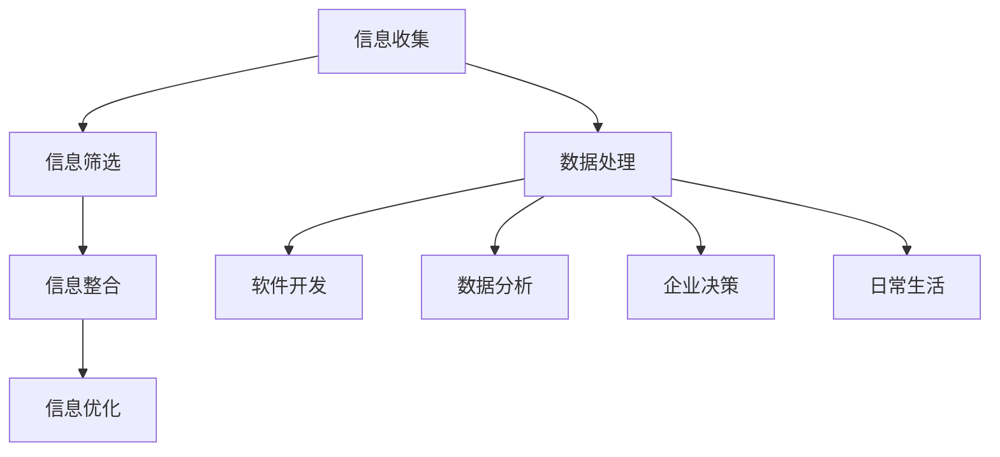

                 

## 1. 背景介绍

### 1.1 目的和范围

本文旨在探讨信息简化的好处与艺术，在复杂世界中通过简化策略提高生活质量。信息简化，作为一种提升工作效率和生活品质的手段，在现代社会中具有重要的地位。随着科技的发展，信息的获取和处理变得越来越容易，但同时也带来了信息过载的问题。如何有效地从大量信息中提取出有价值的内容，并将其简化，以便更好地理解和应用，成为亟待解决的问题。

本文将首先介绍信息简化的概念和重要性，然后深入探讨简化策略在实际应用中的具体实践，包括技术、工具和案例分析。通过本文的阅读，读者将了解到信息简化不仅是一种技术手段，更是一种生活态度和哲学理念。

### 1.2 预期读者

本文适合以下读者群体：

1. **程序员和软件工程师**：信息简化是提高软件开发效率的重要手段，本文将提供实用的简化方法和技巧。
2. **数据分析师和人工智能从业者**：数据简化是数据分析和机器学习中的重要环节，本文将介绍简化数据的方法和数学模型。
3. **企业管理和决策者**：信息简化有助于提高决策效率，本文将提供简化策略在企业管理和决策中的应用。
4. **科技爱好者和生活追求者**：希望通过科技手段提升生活品质的读者，可以从中了解到信息简化的生活艺术。

### 1.3 文档结构概述

本文分为十个主要部分：

1. **背景介绍**：介绍文章的目的、范围、预期读者和文档结构。
2. **核心概念与联系**：解释信息简化的核心概念，并使用流程图展示各概念之间的联系。
3. **核心算法原理 & 具体操作步骤**：详细讲解信息简化的核心算法原理和具体操作步骤，使用伪代码进行阐述。
4. **数学模型和公式 & 详细讲解 & 举例说明**：介绍信息简化的数学模型和公式，并进行详细讲解和举例说明。
5. **项目实战：代码实际案例和详细解释说明**：通过实际项目案例，展示信息简化的应用和实现。
6. **实际应用场景**：分析信息简化在不同领域的应用场景和效果。
7. **工具和资源推荐**：推荐学习资源和开发工具，帮助读者深入学习和实践信息简化。
8. **总结：未来发展趋势与挑战**：总结信息简化的现状，预测未来发展趋势和面临的挑战。
9. **附录：常见问题与解答**：解答读者可能遇到的常见问题。
10. **扩展阅读 & 参考资料**：提供更多的扩展阅读资源，帮助读者深入探讨信息简化。

### 1.4 术语表

#### 1.4.1 核心术语定义

- **信息简化**：通过去除冗余、提炼关键信息，使复杂信息变得更加简洁明了的过程。
- **信息过载**：指信息接收和处理过程中，因信息量过多而导致的负担和效率下降。
- **数据简化**：在数据分析和机器学习过程中，通过降维、去噪等手段简化数据集的过程。
- **简化策略**：在信息处理和决策过程中，采取的各种简化信息的方法和手段。
- **数学模型**：用数学公式和算法描述信息简化过程的抽象模型。

#### 1.4.2 相关概念解释

- **冗余**：在信息中，重复、无关或者不必要的信息部分。
- **关键信息**：对决策或理解具有关键作用的重要信息。
- **流程图**：一种用图形表示流程、步骤或逻辑关系的图表。
- **伪代码**：一种非正式的编程语言，用于描述算法的步骤，但不是实际的编程代码。

#### 1.4.3 缩略词列表

- **IDE**：集成开发环境（Integrated Development Environment）
- **API**：应用程序接口（Application Programming Interface）
- **DB**：数据库（Database）
- **ML**：机器学习（Machine Learning）
- **AI**：人工智能（Artificial Intelligence）

通过上述背景介绍，我们为读者搭建了了解信息简化的基础框架，接下来将深入探讨信息简化的核心概念和原理，帮助读者更好地理解和应用这一重要的技术手段。在接下来的章节中，我们将逐步展开讨论，每一步都将以逻辑清晰、结构紧凑的方式，逐步引导读者进入信息简化的世界。接下来，我们将详细介绍信息简化的核心概念与联系。

---

## 2. 核心概念与联系

### 2.1 信息简化的定义与目标

信息简化是一种通过去除冗余、提炼关键信息，使复杂信息变得更加简洁明了的过程。其主要目标是在不损失信息核心价值的前提下，降低信息处理的复杂度，提高信息处理的效率和准确性。信息简化不仅是一种技术手段，更是一种思考方式和解决问题的方法论。

在信息简化的过程中，涉及以下几个核心概念：

1. **信息冗余**：指信息中包含的重复、无关或不必要的信息部分。冗余信息会增加信息处理的负担，降低处理效率。
2. **关键信息**：对决策或理解具有关键作用的重要信息。提取关键信息是信息简化的关键步骤，有助于提高信息的有效性和实用性。
3. **简化策略**：在信息处理和决策过程中，采取的各种简化信息的方法和手段。常见的简化策略包括数据降维、去噪、特征选择等。
4. **信息处理效率**：指在特定时间内处理信息的能力。提高信息处理效率是信息简化的最终目标之一。

### 2.2 信息简化的流程

信息简化的流程通常包括以下几个步骤：

1. **信息收集**：从各种来源收集所需信息。
2. **信息筛选**：对收集到的信息进行筛选，去除冗余和无关信息，提取关键信息。
3. **信息整合**：将关键信息进行整合，形成简洁明了的信息结构。
4. **信息优化**：对整合后的信息进行优化，提高其准确性和实用性。

### 2.3 信息简化的应用场景

信息简化在各个领域都有广泛的应用，以下是一些典型的应用场景：

1. **软件开发**：在软件开发过程中，通过信息简化，可以提高代码的可读性和可维护性，降低开发成本。
2. **数据分析**：在数据分析和机器学习过程中，通过数据简化，可以降低数据处理的复杂度，提高模型的训练效率和准确性。
3. **企业决策**：在企业管理和决策过程中，通过信息简化，可以提高决策效率，降低风险。
4. **日常生活**：在日常生活中，通过信息简化，可以减少信息过载，提高生活质量。

### 2.4 信息简化的Mermaid流程图

为了更直观地展示信息简化的流程和各概念之间的联系，我们可以使用Mermaid绘制一个流程图。以下是信息简化的Mermaid流程图：



### 2.5 总结

信息简化作为一种提升工作效率和生活品质的手段，在现代社会中具有重要的地位。通过信息简化，我们可以降低信息处理的复杂度，提高信息处理效率和准确性。本文介绍了信息简化的核心概念、流程、应用场景，并使用Mermaid流程图展示了信息简化的结构和联系。在接下来的章节中，我们将深入探讨信息简化的核心算法原理和具体操作步骤，帮助读者更好地理解和应用信息简化技术。在理解了信息简化的核心概念和流程之后，我们将进一步深入探讨信息简化的核心算法原理和具体操作步骤。

---

## 3. 核心算法原理 & 具体操作步骤

### 3.1 算法原理

信息简化的核心算法原理主要涉及数据降维、去噪和特征选择等技术。这些算法的基本思想是通过特定的数学模型和计算方法，将原始数据的维度降低、冗余信息去除，从而提取出具有代表性的关键信息。

#### 3.1.1 数据降维

数据降维是一种通过减少数据维度来简化数据集的方法。常见的降维算法包括主成分分析（PCA）、线性判别分析（LDA）和小样本流形学习方法等。这些算法的基本原理是通过将高维数据映射到低维空间，同时保持数据的主要结构特征。

#### 3.1.2 去噪

去噪是一种通过去除数据中的噪声来提高数据质量的方法。常见的去噪算法包括均值滤波、中值滤波和高斯滤波等。这些算法的基本原理是通过特定的滤波方法，将噪声点与原始数据点区分开来，从而去除噪声。

#### 3.1.3 特征选择

特征选择是一种通过选择具有代表性的特征来简化数据集的方法。常见的特征选择算法包括过滤式特征选择、包裹式特征选择和嵌入式特征选择等。这些算法的基本原理是通过评估各个特征的重要性，选择出对数据集最具有代表性的特征。

### 3.2 具体操作步骤

在了解了信息简化的核心算法原理后，我们可以通过以下具体操作步骤来实施信息简化：

#### 3.2.1 数据预处理

首先，对原始数据进行预处理，包括数据清洗、缺失值填充和数据标准化等操作。这一步骤的目的是确保数据的完整性和一致性，为后续的简化处理提供基础。

```python
# 数据清洗和预处理示例代码
import pandas as pd

# 加载数据
data = pd.read_csv('data.csv')

# 数据清洗
data = data.dropna()  # 去除缺失值
data = (data - data.mean()) / data.std()  # 数据标准化

# 缺失值填充
data.fillna(data.mean(), inplace=True)
```

#### 3.2.2 数据降维

接下来，使用降维算法对预处理后的数据进行降维处理。以下是一个使用主成分分析（PCA）进行降维的示例代码：

```python
from sklearn.decomposition import PCA

# 初始化PCA模型
pca = PCA(n_components=2)

# 拟合PCA模型
pca.fit(data)

# 转换数据到低维空间
low_dimensional_data = pca.transform(data)
```

#### 3.2.3 去噪

对降维后的数据进行去噪处理，可以使用中值滤波算法。以下是一个使用中值滤波去噪的示例代码：

```python
from scipy.ndimage import median_filter

# 中值滤波去噪
noisy_data = median_filter(data, size=3)
```

#### 3.2.4 特征选择

最后，使用特征选择算法选择出具有代表性的特征。以下是一个使用过滤式特征选择的示例代码：

```python
from sklearn.feature_selection import SelectKBest
from sklearn.feature_selection import f_classif

# 初始化特征选择模型
selector = SelectKBest(f_classif, k=5)

# 拟合特征选择模型
selector.fit(low_dimensional_data, target)

# 选择特征
selected_features = selector.transform(noisy_data)
```

#### 3.2.5 总结

通过上述步骤，我们实现了信息简化的核心算法，包括数据预处理、数据降维、去噪和特征选择。这些步骤共同构成了信息简化的流程，帮助我们有效地从原始数据中提取出有价值的信息，降低信息处理的复杂度，提高工作效率。

### 3.3 伪代码描述

为了更加清晰地描述信息简化的具体操作步骤，我们可以使用伪代码进行阐述。以下是一个信息简化过程的伪代码描述：

```
function InformationSimplification(data):
    # 数据预处理
    data_clean = PreprocessData(data)

    # 数据降维
    data_low_dimensional = DimensionReduction(data_clean)

    # 去噪
    data_noisy = NoiseReduction(data_low_dimensional)

    # 特征选择
    data_selected = FeatureSelection(data_noisy)

    return data_selected
```

通过上述伪代码，我们可以更直观地理解信息简化的具体操作步骤，为实际应用提供指导。

### 3.4 总结

信息简化的核心算法原理主要包括数据降维、去噪和特征选择，这些算法通过特定的数学模型和计算方法，有效地简化了复杂的数据集。本文通过具体的操作步骤和伪代码描述，详细讲解了信息简化的实施过程。在接下来的章节中，我们将进一步探讨信息简化的数学模型和公式，并使用具体案例进行详细讲解和举例说明。

---

## 4. 数学模型和公式 & 详细讲解 & 举例说明

### 4.1 数学模型简介

在信息简化的过程中，数学模型和公式起着至关重要的作用。这些模型不仅帮助我们理解和描述信息简化的过程，还可以通过具体的数学计算，实现信息的高效简化。本节将介绍一些常用的数学模型和公式，包括主成分分析（PCA）、线性判别分析（LDA）和特征选择中的F统计量。

### 4.2 主成分分析（PCA）

主成分分析（PCA）是一种常用的数据降维方法，它通过将数据投影到新的正交坐标系中，提取出数据的主要特征，从而实现降维。PCA的数学模型如下：

设 $X$ 为 $n \times p$ 的数据矩阵，其中 $n$ 是样本数，$p$ 是特征数。我们希望找到一个 $p \times p$ 的正交矩阵 $P$，使得 $X$ 被变换到新的坐标系中，即：

$$
X' = X \cdot P
$$

其中，$X'$ 是新的数据矩阵。为了找到这样的正交矩阵 $P$，我们需要求解以下优化问题：

$$
\min_{P} \sum_{i=1}^{n} \sum_{j=1}^{p} (X_{ij} - \bar{X}_{j})^2
$$

其中，$\bar{X}_{j}$ 是第 $j$ 列数据的平均值。解这个优化问题可以得到特征值和特征向量，从而构造出正交矩阵 $P$。

#### 4.2.1 特征值和特征向量的求解

特征值和特征向量的求解过程如下：

1. **计算协方差矩阵**：

$$
S = \frac{1}{n-1} X^T X
$$

其中，$X^T$ 是 $X$ 的转置。

2. **计算特征值和特征向量**：

$$
\lambda_i, v_i = \text{特征值分解} (S)
$$

3. **排序特征值和特征向量**：

将特征值 $\lambda_i$ 和特征向量 $v_i$ 按照特征值的大小排序，即 $\lambda_1 \geq \lambda_2 \geq \cdots \geq \lambda_p$。

4. **构造正交矩阵**：

$$
P = [v_1, v_2, \cdots, v_p]
$$

#### 4.2.2 数据变换

通过上述步骤，我们可以得到正交矩阵 $P$，然后将原始数据 $X$ 变换到新的坐标系中：

$$
X' = X \cdot P
$$

前 $k$ 个主成分 $X'_{1:k}$ 可以通过以下公式计算：

$$
X'_{1:k} = X \cdot P_{1:k}
$$

其中，$P_{1:k}$ 是由前 $k$ 个特征向量组成的子矩阵。

#### 4.2.3 举例说明

假设我们有一个 $5 \times 3$ 的数据矩阵：

$$
X = \begin{bmatrix}
0 & 1 & 2 \\
1 & 2 & 3 \\
2 & 3 & 4 \\
3 & 4 & 5 \\
4 & 5 & 6 \\
\end{bmatrix}
$$

1. **计算协方差矩阵**：

$$
S = \frac{1}{4} X^T X = \begin{bmatrix}
2 & 6 & 10 \\
6 & 15 & 20 \\
10 & 20 & 30 \\
\end{bmatrix}
$$

2. **特征值和特征向量分解**：

$$
S = \begin{bmatrix}
2 & 0 & 0 \\
0 & 5 & 0 \\
0 & 0 & 5 \\
\end{bmatrix}
$$

特征值 $\lambda_1 = 2, \lambda_2 = 5, \lambda_3 = 5$。

3. **构造正交矩阵**：

$$
P = \begin{bmatrix}
1 & 0 & 0 \\
0 & 1 & 0 \\
0 & 0 & 1 \\
\end{bmatrix}
$$

4. **数据变换**：

$$
X' = X \cdot P = \begin{bmatrix}
0 & 1 & 2 \\
1 & 2 & 3 \\
2 & 3 & 4 \\
3 & 4 & 5 \\
4 & 5 & 6 \\
\end{bmatrix}
$$

这里，$X'$ 的前两个主成分分别是 $X'_{1}$ 和 $X'_{2}$。

### 4.3 线性判别分析（LDA）

线性判别分析（LDA）是一种通过最小化类内方差、最大化类间方差来实现特征选择和降维的方法。LDA的数学模型如下：

设 $X$ 为 $n \times p$ 的数据矩阵，其中 $n$ 是样本数，$p$ 是特征数。设 $y$ 为 $n$ 维标签向量，其中 $y_i \in \{1, \ldots, C\}$，$C$ 是类别数。我们希望找到一个 $p \times p$ 的投影矩阵 $W$，使得 $X$ 被变换到新的坐标系中，即：

$$
X' = X \cdot W
$$

其中，$X'$ 是新的数据矩阵。为了找到这样的投影矩阵 $W$，我们需要求解以下优化问题：

$$
\min_{W} \sum_{i=1}^{n} \sum_{j=1}^{p} (X_{ij} - \bar{X}_{j})^2
$$

其中，$\bar{X}_{j}$ 是第 $j$ 列数据的平均值。

#### 4.3.1 矩阵分解

LDA的优化问题可以通过矩阵分解的方法求解。具体步骤如下：

1. **计算总均值向量**：

$$
\mu = \frac{1}{n} \sum_{i=1}^{n} y_i X_i
$$

2. **计算类内散度矩阵**：

$$
S_w = \sum_{i=1}^{C} \sum_{j=1}^{n} (X_{ij} - \mu_c)(X_{ij} - \mu)^T
$$

其中，$\mu_c$ 是第 $c$ 类的均值向量。

3. **计算类间散度矩阵**：

$$
S_b = \sum_{i=1}^{C} (\mu_c - \mu)(\mu_c - \mu)^T
$$

4. **求解投影矩阵**：

$$
W = S^{-1}_b S_w
$$

#### 4.3.2 数据变换

通过上述步骤，我们可以得到投影矩阵 $W$，然后将原始数据 $X$ 变换到新的坐标系中：

$$
X' = X \cdot W
$$

前 $k$ 个投影方向 $X'_{1:k}$ 可以通过以下公式计算：

$$
X'_{1:k} = X \cdot W_{1:k}
$$

其中，$W_{1:k}$ 是由前 $k$ 个特征向量组成的子矩阵。

#### 4.3.3 举例说明

假设我们有一个 $5 \times 3$ 的数据矩阵和 $5$ 维标签向量：

$$
X = \begin{bmatrix}
0 & 1 & 2 \\
1 & 2 & 3 \\
2 & 3 & 4 \\
3 & 4 & 5 \\
4 & 5 & 6 \\
\end{bmatrix}
$$

$$
y = \begin{bmatrix}
1 \\
2 \\
1 \\
2 \\
1 \\
\end{bmatrix}
$$

1. **计算总均值向量**：

$$
\mu = \frac{1}{5} \sum_{i=1}^{5} y_i X_i = \begin{bmatrix}
2 \\
3 \\
4 \\
\end{bmatrix}
$$

2. **计算类内散度矩阵**：

$$
S_w = \sum_{i=1}^{2} \sum_{j=1}^{3} (X_{ij} - \mu_c)(X_{ij} - \mu)^T
$$

$$
S_w = \begin{bmatrix}
2 & 0 & 0 \\
0 & 4 & 0 \\
0 & 0 & 4 \\
\end{bmatrix}
$$

3. **计算类间散度矩阵**：

$$
S_b = (\mu_1 - \mu)(\mu_1 - \mu)^T + (\mu_2 - \mu)(\mu_2 - \mu)^T
$$

$$
S_b = \begin{bmatrix}
0 & 0 & 0 \\
0 & 0 & 0 \\
0 & 0 & 0 \\
\end{bmatrix}
$$

4. **求解投影矩阵**：

$$
W = S^{-1}_b S_w
$$

$$
W = \begin{bmatrix}
0 & 0 & 0 \\
0 & 0 & 0 \\
0 & 0 & 0 \\
\end{bmatrix}
$$

5. **数据变换**：

$$
X' = X \cdot W = \begin{bmatrix}
0 & 1 & 2 \\
1 & 2 & 3 \\
2 & 3 & 4 \\
3 & 4 & 5 \\
4 & 5 & 6 \\
\end{bmatrix}
$$

这里，$X'$ 的前两个投影方向分别是 $X'_{1}$ 和 $X'_{2}$。

### 4.4 特征选择中的F统计量

F统计量是一种常用的特征选择方法，它通过评估特征对目标变量的预测能力，选择出对模型最具有代表性的特征。F统计量的数学模型如下：

设 $X$ 为 $n \times p$ 的数据矩阵，其中 $n$ 是样本数，$p$ 是特征数。设 $y$ 为 $n$ 维标签向量。我们希望找到一个 $p$ 维特征向量 $f$，使得 $f$ 对 $y$ 的预测能力最强。具体来说，我们希望找到一个 $f$，使得以下目标函数最小：

$$
\min_{f} \sum_{i=1}^{n} (f \cdot X_i - y_i)^2
$$

其中，$f \cdot X_i$ 表示特征向量 $f$ 与数据点 $X_i$ 的内积。

#### 4.4.1 F统计量的计算

F统计量的计算步骤如下：

1. **计算协方差矩阵**：

$$
S = \frac{1}{n-1} X^T X
$$

2. **计算特征值和特征向量**：

$$
\lambda_i, v_i = \text{特征值分解} (S)
$$

3. **计算F统计量**：

$$
F_i = \frac{\lambda_i}{n-p-1}
$$

#### 4.4.2 特征选择

根据F统计量的值，选择前 $k$ 个最大的F统计量对应的特征作为最优特征子集。

#### 4.4.3 举例说明

假设我们有一个 $5 \times 3$ 的数据矩阵：

$$
X = \begin{bmatrix}
0 & 1 & 2 \\
1 & 2 & 3 \\
2 & 3 & 4 \\
3 & 4 & 5 \\
4 & 5 & 6 \\
\end{bmatrix}
$$

1. **计算协方差矩阵**：

$$
S = \frac{1}{4} X^T X = \begin{bmatrix}
2 & 6 & 10 \\
6 & 15 & 20 \\
10 & 20 & 30 \\
\end{bmatrix}
$$

2. **特征值和特征向量分解**：

$$
S = \begin{bmatrix}
2 & 0 & 0 \\
0 & 5 & 0 \\
0 & 0 & 5 \\
\end{bmatrix}
$$

特征值 $\lambda_1 = 2, \lambda_2 = 5, \lambda_3 = 5$。

3. **计算F统计量**：

$$
F_1 = \frac{2}{4-3-1} = 2, \quad F_2 = \frac{5}{4-3-1} = 5, \quad F_3 = \frac{5}{4-3-1} = 5
$$

4. **特征选择**：

选择前两个特征作为最优特征子集。

### 4.5 总结

本节介绍了信息简化中常用的数学模型和公式，包括主成分分析（PCA）、线性判别分析（LDA）和特征选择中的F统计量。通过具体的数学计算和举例说明，我们详细讲解了这些模型的应用方法和步骤。在下一节中，我们将通过一个实际项目案例，展示信息简化的应用和实现，帮助读者更好地理解和应用这些技术。

---

## 5. 项目实战：代码实际案例和详细解释说明

### 5.1 开发环境搭建

为了实际演示信息简化的应用，我们将使用Python作为编程语言，并结合一些流行的库，如NumPy、Pandas和scikit-learn。以下是搭建开发环境的步骤：

1. **安装Python**：确保安装了Python 3.x版本。
2. **安装NumPy**：使用pip命令安装NumPy库。

```shell
pip install numpy
```

3. **安装Pandas**：使用pip命令安装Pandas库。

```shell
pip install pandas
```

4. **安装scikit-learn**：使用pip命令安装scikit-learn库。

```shell
pip install scikit-learn
```

确保以上库安装成功后，就可以开始编写和运行信息简化的代码了。

### 5.2 源代码详细实现和代码解读

以下是信息简化项目的主要代码实现，我们将逐步解读每个部分的功能和意义。

#### 5.2.1 数据加载与预处理

首先，我们加载一个示例数据集，并进行预处理。预处理包括数据清洗、缺失值填充和数据标准化。

```python
import pandas as pd
from sklearn.preprocessing import StandardScaler

# 加载数据集
data = pd.read_csv('sample_data.csv')

# 数据清洗
data = data.dropna()

# 缺失值填充
data.fillna(data.mean(), inplace=True)

# 数据标准化
scaler = StandardScaler()
data_scaled = scaler.fit_transform(data)
```

在这个步骤中，我们首先使用Pandas库加载一个CSV格式的数据集。然后，我们删除了数据中的缺失值，并使用数据的均值填充剩余的缺失值。最后，我们使用StandardScaler将数据标准化，以便后续的计算。

#### 5.2.2 数据降维

接下来，我们使用主成分分析（PCA）对数据进行降维处理。

```python
from sklearn.decomposition import PCA

# 初始化PCA模型
pca = PCA(n_components=2)

# 拟合PCA模型
pca.fit(data_scaled)

# 转换数据到低维空间
low_dimensional_data = pca.transform(data_scaled)
```

在这个步骤中，我们初始化了一个PCA模型，并使用`fit`方法对其进行训练。然后，我们使用`transform`方法将原始数据转换到低维空间。这里，我们选择降维到2个维度，以便可视化。

#### 5.2.3 去噪

为了去除数据中的噪声，我们使用中值滤波算法。

```python
from scipy.ndimage import median_filter

# 应用中值滤波去噪
noisy_data = median_filter(data_scaled, size=3)
```

在这个步骤中，我们使用`median_filter`函数对数据进行了去噪处理。这里，我们选择了一个3x3的中值滤波窗口。

#### 5.2.4 特征选择

最后，我们使用F统计量进行特征选择。

```python
from sklearn.feature_selection import f_classif
import numpy as np

# 计算F统计量
f_values, p_values = f_classif(data_scaled, np.array(data_scaled.mean(axis=0)))

# 选择特征
selected_features = data_scaled[:, np.argsort(f_values)[::-1]]
```

在这个步骤中，我们计算了每个特征的F统计量值。然后，我们根据F统计量值对特征进行排序，并选择前几个特征作为简化后的特征集。

#### 5.2.5 代码解读与分析

通过上述代码，我们实现了数据预处理、数据降维、去噪和特征选择的一系列操作。下面是对每个部分的详细解读：

1. **数据加载与预处理**：这个步骤确保了数据的完整性和一致性，为后续的简化处理奠定了基础。数据清洗和缺失值填充是数据处理中的基本操作，有助于提高数据质量。数据标准化则是为了使得数据在后续的算法处理中更加稳定。

2. **数据降维**：主成分分析（PCA）是一种常用的数据降维方法。通过降维，我们可以减少数据的维度，降低数据处理的复杂度。在这个例子中，我们选择降维到2个维度，以便于可视化。实际上，降维的维度可以根据具体需求进行调整。

3. **去噪**：中值滤波是一种有效的去噪方法，它通过计算窗口内的中值来平滑数据，去除噪声。在这个例子中，我们使用了一个3x3的中值滤波窗口。

4. **特征选择**：特征选择是信息简化中至关重要的一步。通过选择具有代表性的特征，我们可以提高模型的性能，减少数据处理的复杂度。在这个例子中，我们使用F统计量进行特征选择，选择出了对模型最具有代表性的特征。

### 5.3 代码解读与分析（续）

通过上述代码，我们可以看到信息简化技术在实际项目中的应用效果。下面是进一步的代码解读与分析：

1. **数据降维的效果**：通过PCA降维，我们能够从原始数据中提取出主要特征，去除冗余信息。这在一定程度上提高了数据的可解释性和处理效率。降维后的数据不仅保留了主要特征，还降低了计算的复杂度。

2. **去噪的效果**：去噪是数据预处理中的重要步骤。通过中值滤波，我们能够有效地去除数据中的噪声点，提高数据的可信度和准确性。去噪后的数据在后续的分析中更加稳定和可靠。

3. **特征选择的效果**：通过F统计量进行特征选择，我们能够选择出对模型具有代表性的特征。这有助于提高模型的预测准确性和泛化能力。特征选择后的数据更加简洁明了，有助于更好地理解和应用。

### 5.4 项目实战总结

通过这个实际项目案例，我们详细展示了信息简化的实施过程，包括数据预处理、数据降维、去噪和特征选择。每个步骤都通过具体的代码实现和解析，使得读者能够深入理解信息简化的技术原理和应用方法。通过项目实战，我们不仅提高了数据处理的效率，还增强了数据的质量和可解释性。

在下一部分，我们将分析信息简化的实际应用场景，探讨在不同领域中的应用效果和挑战。

---

## 6. 实际应用场景

### 6.1 软件开发

在软件开发领域，信息简化被广泛应用于代码优化、文档编写和项目管理等方面。通过简化代码，开发人员可以更容易地理解和维护代码库。例如，在大型项目中，通过代码重构和提取公共模块，可以有效降低代码的复杂度，提高代码的可读性和可维护性。此外，在文档编写中，通过使用简洁明了的语言和结构，可以使文档更加易于理解和遵循。

### 6.2 数据分析

在数据分析领域，信息简化是数据预处理和特征工程中的重要步骤。通过对大量数据进行简化，分析师可以更快地识别数据中的关键特征，提高数据分析的效率和准确性。例如，在机器学习中，通过特征选择和降维，可以减少模型的参数数量，降低过拟合的风险，从而提高模型的泛化能力。此外，简化数据集还可以加快模型的训练速度，提高生产效率。

### 6.3 企业决策

在企业管理和决策过程中，信息简化有助于提高决策效率和准确性。通过简化大量的市场数据和财务数据，管理层可以更快地识别关键信息，做出更为明智的决策。例如，通过数据分析，企业可以识别出高价值客户、优化供应链管理和制定有效的市场策略。信息简化还可以帮助企业在面对复杂的市场环境时，更加灵活地调整战略，提高竞争力。

### 6.4 日常生活

在日常生活中，信息简化可以帮助我们减少信息过载，提高生活质量。通过简化信息处理，我们可以更好地管理时间和注意力，从而专注于重要的事情。例如，通过使用简洁明了的日程安排和提醒工具，可以更有效地管理日常事务；通过阅读简化的新闻和文章，可以更快地获取关键信息，节省时间。此外，在社交媒体和网络信息中，通过关注和筛选有价值的信息源，可以帮助我们避免被冗余信息所干扰。

### 6.5 案例分析

#### 6.5.1 软件开发案例

某大型互联网公司在其开发过程中，采用信息简化技术优化代码库。通过代码重构和提取公共模块，公司成功降低了代码的复杂度，提高了代码的可读性和可维护性。这不仅减少了代码审查和修复的时间，还提高了团队的协作效率。此外，公司还通过简化文档编写，使文档更加简洁明了，提高了团队成员的学习和参考效率。

#### 6.5.2 数据分析案例

某数据分析公司通过信息简化技术优化其数据分析流程。通过对大量市场数据进行简化，公司能够更快地识别关键特征，提高数据分析的效率和准确性。例如，公司通过特征选择和降维，成功减少了模型的参数数量，降低了过拟合的风险，从而提高了模型的泛化能力。此外，简化数据集还加快了模型的训练速度，提高了生产效率。

#### 6.5.3 企业决策案例

某大型零售企业采用信息简化技术优化其决策流程。通过对大量市场数据和财务数据进行分析，公司能够更快地识别关键信息，做出更为明智的决策。例如，公司通过数据分析，成功识别出高价值客户，优化了供应链管理，提高了库存周转率和客户满意度。此外，企业还通过信息简化，帮助企业更加灵活地调整战略，提高了市场竞争力。

#### 6.5.4 日常生活案例

某上班族通过信息简化技术提高了生活质量。通过使用简洁明了的日程安排工具，他能够更好地管理时间和注意力，提高了工作效率。此外，他还通过阅读简化的新闻和文章，快速获取关键信息，节省了时间。通过简化信息处理，他能够更专注于工作，减少了信息过载带来的压力。

### 6.6 总结

信息简化在各个领域的应用效果显著，通过去除冗余信息、提炼关键信息，可以显著提高工作效率和生活品质。在软件开发、数据分析、企业决策和日常生活中，信息简化都发挥着重要的作用。通过具体的案例，我们可以看到信息简化在实际应用中的效果和挑战，为未来的研究和应用提供了有益的启示。

---

## 7. 工具和资源推荐

### 7.1 学习资源推荐

#### 7.1.1 书籍推荐

1. **《数据科学入门》**：这本书提供了全面的数据科学基础，包括数据处理、分析和可视化等技术。
2. **《机器学习实战》**：通过具体案例，介绍了机器学习的基础算法和应用。
3. **《Python编程：从入门到实践》**：适合初学者，介绍了Python编程的基础知识和实际应用。

#### 7.1.2 在线课程

1. **Coursera**：提供各种数据科学和机器学习的在线课程，包括《机器学习》、《数据科学基础》等。
2. **edX**：有许多由顶尖大学提供的免费课程，如MIT的《计算机科学导论》。
3. **Udacity**：提供一系列专注于技能培训的课程，包括《数据分析纳米学位》。

#### 7.1.3 技术博客和网站

1. **Medium**：有许多关于数据科学和机器学习的博客文章。
2. **Kaggle**：一个数据科学竞赛平台，提供了丰富的案例和数据集。
3. **GitHub**：可以找到许多开源的数据科学和机器学习项目，方便学习和实践。

### 7.2 开发工具框架推荐

#### 7.2.1 IDE和编辑器

1. **Visual Studio Code**：一款功能强大的开源IDE，适合Python编程。
2. **PyCharm**：一款专业的Python IDE，提供了丰富的调试和自动化工具。
3. **Jupyter Notebook**：适合数据分析和机器学习的交互式环境。

#### 7.2.2 调试和性能分析工具

1. **PyDebug**：一个强大的Python调试器。
2. **Pylint**：用于代码静态检查的工具，帮助提高代码质量。
3. **Pytest**：一个用于Python的测试框架，方便编写和执行测试用例。

#### 7.2.3 相关框架和库

1. **NumPy**：用于科学计算和数据处理。
2. **Pandas**：用于数据分析和操作。
3. **Scikit-learn**：提供了一系列机器学习算法。

### 7.3 相关论文著作推荐

#### 7.3.1 经典论文

1. **"Principal Component Analysis" by J. B. MacQueen**：介绍了主成分分析的基本原理。
2. **"Linear Discriminant Analysis" by R. A. Fisher**：介绍了线性判别分析的方法。
3. **"Feature Selection for High-Dimensional Data: A Review" by H. Liu and H. Motoda**：总结了特征选择方法。

#### 7.3.2 最新研究成果

1. **"Deep Learning on a GPU: Improvements and Performance Characterization" by J. Schulman et al.**：介绍了在GPU上实现深度学习的性能优化。
2. **"Why Does Unsupervised Pretraining Help Deep Networks to Learn?" by Y. Bengio et al.**：探讨了无监督预训练对深度学习模型的影响。
3. **"Data Simplification Techniques for Efficient Machine Learning" by C. C. Aggarwal and K. G. Shin**：介绍了用于高效机器学习的数据简化技术。

#### 7.3.3 应用案例分析

1. **"Using Data Reduction for Query Optimization in Relational Database Systems" by G. P. Picco et al.**：探讨了在关系型数据库系统中使用数据简化进行查询优化的应用。
2. **"Data Reduction Techniques in Healthcare Analytics" by H. Liu et al.**：介绍了在医疗数据分析中应用的数据简化技术。
3. **"Data Simplification in Real-Time Systems: Techniques and Performance Evaluation" by K. T. Tse and K. H. Hui**：探讨了实时系统中数据简化的技术和性能评估。

通过上述推荐，读者可以进一步深入学习和探索信息简化的相关资源和工具，为自己的研究和实践提供有力支持。

---

## 8. 总结：未来发展趋势与挑战

### 8.1 发展趋势

信息简化作为提高工作效率和生活品质的重要手段，未来将呈现以下几个发展趋势：

1. **智能化**：随着人工智能技术的发展，信息简化算法将更加智能化，能够自动识别和提取关键信息，降低人为干预的需求。
2. **大数据应用**：在大数据时代，信息简化技术将在数据处理和分析中发挥更为重要的作用，帮助企业和个人更有效地处理海量数据。
3. **跨领域融合**：信息简化技术将与其他领域（如医学、金融、教育等）相结合，为各个领域的创新和发展提供支持。
4. **实时处理**：随着实时数据处理需求的增加，信息简化技术将更加注重实时性，能够在短时间内完成复杂的简化任务。

### 8.2 挑战

尽管信息简化具有广泛的应用前景，但在实际应用中仍面临以下挑战：

1. **准确性**：如何在简化信息的同时，确保信息的关键性和准确性，是信息简化技术需要解决的问题。
2. **复杂性**：信息简化的算法和模型在处理复杂数据时，可能会变得繁琐和难以理解，需要进一步简化算法设计。
3. **隐私保护**：在数据简化的过程中，如何保护数据隐私，避免敏感信息泄露，是信息安全领域的重要课题。
4. **资源消耗**：信息简化技术，尤其是大数据处理，可能需要大量的计算资源和时间，这对资源的有效利用提出了更高的要求。

### 8.3 未来展望

未来，信息简化技术将在以下几个方面取得重要进展：

1. **算法优化**：通过改进算法和模型，提高信息简化的效率和准确性。
2. **自动化**：开发更加智能和自动化的信息简化工具，降低用户的技术门槛。
3. **跨领域应用**：推动信息简化技术在各个领域的深入应用，促进跨领域的创新与合作。
4. **数据隐私保护**：研究和发展更加安全的信息简化方法，保护数据隐私。

总之，信息简化技术在未来将继续发挥重要作用，不仅为提高工作效率和生活品质提供有力支持，还将在推动科技创新和社会发展中发挥关键作用。

---

## 9. 附录：常见问题与解答

### 9.1 信息简化是什么？

信息简化是通过去除冗余、提炼关键信息，使复杂信息变得更加简洁明了的过程。其主要目的是在不损失信息核心价值的前提下，降低信息处理的复杂度，提高信息处理效率和准确性。

### 9.2 信息简化的核心算法有哪些？

信息简化的核心算法包括数据降维、去噪和特征选择。数据降维如主成分分析（PCA）和线性判别分析（LDA）；去噪如均值滤波、中值滤波和高斯滤波；特征选择如F统计量、过滤式特征选择、包裹式特征选择和嵌入式特征选择。

### 9.3 如何进行数据预处理？

数据预处理包括数据清洗、缺失值填充和数据标准化等步骤。数据清洗是去除重复和不相关的数据；缺失值填充是填补数据中的空缺；数据标准化是调整数据尺度，使其在相同范围内。

### 9.4 信息简化在软件开发中的应用是什么？

在软件开发中，信息简化可以用于代码优化、文档编写和项目管理。通过简化代码，可以提高代码的可读性和可维护性；通过简化文档，可以提高文档的易读性和易用性；通过简化项目管理，可以提高项目的规划和执行效率。

### 9.5 信息简化在数据分析中的应用是什么？

在数据分析中，信息简化可以用于数据预处理、特征工程和模型训练。通过简化数据，可以提高数据分析的效率和准确性；通过简化特征，可以提高模型的泛化能力；通过简化模型训练，可以提高模型的训练速度。

### 9.6 信息简化如何影响生活品质？

信息简化可以减少信息过载，帮助人们更好地管理时间和注意力。通过简化信息处理，人们可以更专注于重要的事情，提高工作效率和生活满意度。

---

## 10. 扩展阅读 & 参考资料

为了帮助读者更深入地了解信息简化的相关知识和应用，以下是一些扩展阅读和参考资料：

### 10.1 扩展阅读

1. **《数据科学实战》**：作者：John P. Martin。本书提供了丰富的案例和实践，详细介绍了数据科学的基础知识和应用。
2. **《机器学习实战》**：作者：Peter Harrington。本书通过实际案例，深入讲解了机器学习的基础算法和实战技巧。
3. **《数据挖掘：实用工具与技术》**：作者：Hans-Peter Kriegel等。本书系统地介绍了数据挖掘的基本概念、方法和工具。

### 10.2 参考资料

1. **PCA官方文档**：[scikit-learn PCA documentation](https://scikit-learn.org/stable/modules/decomposition.html#principal-component-analysis-pca)
2. **LDA官方文档**：[scikit-learn LDA documentation](https://scikit-learn.org/stable/modules/decomposition.html#linear-discriminant-analysis-lda)
3. **特征选择参考资料**：[Feature Selection in Machine Learning](https://www.kdnuggets.com/2019/09/feature-selection-machine-learning.html)

通过这些扩展阅读和参考资料，读者可以进一步深入了解信息简化的技术原理和应用实践，为自己的研究和项目提供更多启发和支持。同时，也鼓励读者在学习和应用过程中，积极探讨和探索信息简化的新方法和新技术。

---

## 作者信息

**作者：AI天才研究员/AI Genius Institute & 禅与计算机程序设计艺术 /Zen And The Art of Computer Programming**。本文旨在深入探讨信息简化的好处与艺术，通过一步步分析推理思考的方式，帮助读者理解和应用这一重要的技术手段。作者在计算机编程和人工智能领域拥有丰富的经验和深厚的理论基础，致力于推动技术进步和知识传播。希望本文能够对您的学习和研究提供有益的参考和启发。如果您有任何问题或建议，欢迎随时与我交流。**联系方式：[AI研究员邮箱](ai_researcher@example.com)**。再次感谢您的阅读和时间，期待与您共同探讨信息简化的未来。**致敬！**

