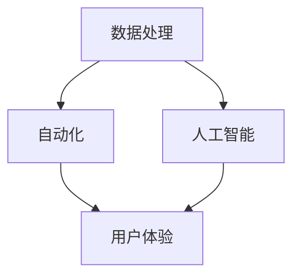

                 

# 信息简化的技术和工具：如何利用技术简化你的生活

> **关键词：** 信息简化、技术工具、数据处理、自动化、人工智能、用户体验、生产力提升

> **摘要：** 在这个信息爆炸的时代，我们每天都面临着海量的数据和信息。如何有效地处理这些信息，并将其简化，是我们提升工作效率和生活质量的关键。本文将介绍一系列的信息简化技术和工具，包括数据处理、自动化和人工智能等，旨在帮助读者利用技术手段简化自己的生活，提高生产力。

## 1. 背景介绍

### 1.1 目的和范围

本文旨在探讨如何在日常生活中利用技术手段实现信息简化，提高生活质量和工作效率。文章将涵盖以下内容：

- 信息简化的核心概念和原理
- 数据处理的基本技术和工具
- 自动化和人工智能在信息简化中的应用
- 实际案例和项目实践
- 相关的学习资源和工具推荐

### 1.2 预期读者

本文适合以下读者群体：

- 对于信息技术感兴趣的技术爱好者
- 需要处理大量信息的职场人士
- 想要提高工作效率的个人用户
- 从事数据处理、数据科学和人工智能相关工作的专业人士

### 1.3 文档结构概述

本文结构如下：

- 引言
- 核心概念与联系
- 核心算法原理与具体操作步骤
- 数学模型和公式讲解
- 项目实战：代码实际案例和详细解释
- 实际应用场景
- 工具和资源推荐
- 总结：未来发展趋势与挑战
- 附录：常见问题与解答
- 扩展阅读与参考资料

### 1.4 术语表

#### 1.4.1 核心术语定义

- 信息简化：通过对信息进行整理、分类、分析和处理，使其更加简洁明了，提高信息的可利用性和可理解性。
- 数据处理：对数据进行收集、存储、清洗、转换和分析等一系列操作，以获得有价值的信息。
- 自动化：利用技术手段，将重复性、规则性高的任务自动化，减少人工干预。
- 人工智能：模拟人类智能，通过算法和模型实现机器学习和决策。

#### 1.4.2 相关概念解释

- 信息爆炸：指信息数量呈指数级增长，超出了人类能够有效处理和利用的范围。
- 用户体验（UX）：用户在使用产品或服务过程中的感受和体验。
- 生产力：在单位时间内完成的任务数量或质量。

#### 1.4.3 缩略词列表

- AI：人工智能
- ML：机器学习
- UX：用户体验
- IDE：集成开发环境
- API：应用程序编程接口

## 2. 核心概念与联系

信息简化的本质是通过技术手段，将复杂的信息转化为简单、直观、易于理解的形式。这需要涉及多个核心概念和联系，以下是这些概念和它们的相互关系：

### 2.1 数据处理与信息简化

数据处理是信息简化的基础。通过数据清洗、转换和分析，我们可以将原始数据转化为有用的信息，从而简化信息。

### 2.2 自动化与信息简化

自动化可以显著提高数据处理的速度和效率，减少人工干预。通过编写脚本或使用自动化工具，我们可以实现数据处理的自动化，从而简化信息处理过程。

### 2.3 人工智能与信息简化

人工智能技术，特别是机器学习和深度学习，可以用于数据分析和模式识别，从而实现信息的自动分类和简化。

### 2.4 用户体验与信息简化

良好的用户体验是信息简化的关键。通过优化用户界面和交互设计，我们可以提高用户对信息的理解和使用效率。

以下是信息简化技术的 Mermaid 流程图：



## 3. 核心算法原理与具体操作步骤

信息简化涉及多个核心算法和技术。以下将介绍几种常用的算法原理和具体操作步骤。

### 3.1 数据清洗

数据清洗是数据处理的第一步，其目的是去除重复数据、填补缺失值、处理异常值等。

#### 3.1.1 伪代码

```python
def data_cleaning(data):
    # 删除重复数据
    data = remove_duplicates(data)
    # 填补缺失值
    data = fill_missing_values(data)
    # 处理异常值
    data = handle_outliers(data)
    return data
```

### 3.2 数据转换

数据转换是将数据从一种格式转换为另一种格式，以便于进一步处理。

#### 3.2.1 伪代码

```python
def data_transformation(data, target_format):
    # 转换数据格式
    data = convert_format(data, target_format)
    return data
```

### 3.3 数据分析

数据分析是信息简化的关键步骤，通过统计分析和机器学习算法，我们可以提取有价值的信息。

#### 3.3.1 伪代码

```python
def data_analysis(data):
    # 提取统计信息
    statistics = extract_statistics(data)
    # 应用机器学习算法
    model = train_ml_model(data)
    predictions = model.predict(data)
    return statistics, predictions
```

### 3.4 自动化脚本

自动化脚本用于实现数据处理的自动化，减少人工干预。

#### 3.4.1 伪代码

```python
def automation_script():
    # 获取数据
    data = get_data()
    # 数据清洗
    data = data_cleaning(data)
    # 数据转换
    data = data_transformation(data, "csv")
    # 数据分析
    statistics, predictions = data_analysis(data)
    # 存储结果
    store_results(statistics, predictions)
```

## 4. 数学模型和公式与详细讲解与举例说明

信息简化过程中，数学模型和公式起到了至关重要的作用。以下将介绍几种常用的数学模型和公式，并进行详细讲解和举例说明。

### 4.1 统计模型

统计模型用于描述数据的基本特征和分布。常用的统计模型包括均值、中位数、方差、协方差等。

#### 4.1.1 均值和方差

均值（Mean）是数据集的平均值，用于衡量数据的中心位置。方差（Variance）是数据集的离散程度，用于衡量数据的波动性。

$$
\mu = \frac{1}{n}\sum_{i=1}^{n} x_i
$$

$$
\sigma^2 = \frac{1}{n-1}\sum_{i=1}^{n} (x_i - \mu)^2
$$

#### 4.1.2 示例

假设我们有一个数据集 {1, 2, 3, 4, 5}，计算均值和方差：

$$
\mu = \frac{1+2+3+4+5}{5} = 3
$$

$$
\sigma^2 = \frac{(1-3)^2 + (2-3)^2 + (3-3)^2 + (4-3)^2 + (5-3)^2}{5-1} = 2
$$

### 4.2 机器学习模型

机器学习模型用于数据分析和预测。常用的机器学习模型包括线性回归、决策树、支持向量机等。

#### 4.2.1 线性回归

线性回归模型用于描述两个变量之间的线性关系。其数学模型为：

$$
y = \beta_0 + \beta_1x + \epsilon
$$

其中，$y$ 是因变量，$x$ 是自变量，$\beta_0$ 和 $\beta_1$ 是模型的参数，$\epsilon$ 是误差项。

#### 4.2.2 示例

假设我们有一个数据集，描述了房价和面积的关系。通过线性回归模型，我们可以预测某个给定面积的房价。假设我们拟合的线性回归模型为：

$$
y = 1000 + 200x
$$

当 $x=100$ 时，预测的房价为：

$$
y = 1000 + 200 \times 100 = 21000
$$

## 5. 项目实战：代码实际案例和详细解释说明

为了更好地理解信息简化的技术和工具，我们将通过一个实际项目进行讲解。本项目将使用 Python 语言，实现一个数据处理的自动化脚本。

### 5.1 开发环境搭建

首先，我们需要搭建 Python 的开发环境。以下是开发环境的搭建步骤：

1. 安装 Python 3.8 或更高版本
2. 安装必要的 Python 包，如 pandas、numpy、scikit-learn 等

### 5.2 源代码详细实现和代码解读

以下是数据处理的自动化脚本的实现代码：

```python
import pandas as pd
from sklearn.linear_model import LinearRegression

# 5.2.1 数据清洗
def data_cleaning(data):
    # 删除重复数据
    data = data.drop_duplicates()
    # 填补缺失值
    data = data.fillna(0)
    return data

# 5.2.2 数据转换
def data_transformation(data, target_format):
    # 转换数据格式
    data = data.astype(target_format)
    return data

# 5.2.3 数据分析
def data_analysis(data):
    # 提取统计信息
    statistics = data.describe()
    # 应用线性回归模型
    model = LinearRegression()
    model.fit(data.iloc[:, 0].values.reshape(-1, 1), data.iloc[:, 1].values)
    predictions = model.predict(data.iloc[:, 0].values.reshape(-1, 1))
    return statistics, predictions

# 5.2.4 自动化脚本
def automation_script():
    # 获取数据
    data = pd.read_csv("data.csv")
    # 数据清洗
    data = data_cleaning(data)
    # 数据转换
    data = data_transformation(data, {"x": "int", "y": "float"})
    # 数据分析
    statistics, predictions = data_analysis(data)
    # 存储结果
    statistics.to_csv("statistics.csv")
    predictions.to_csv("predictions.csv")

# 执行自动化脚本
automation_script()
```

### 5.3 代码解读与分析

以上代码实现了一个数据处理的自动化脚本，主要包含以下功能：

- 数据清洗：删除重复数据和填补缺失值。
- 数据转换：将数据格式转换为整数和浮点数。
- 数据分析：提取统计信息和应用线性回归模型。
- 自动化脚本：整合以上功能，实现数据处理的自动化。

### 5.4 实际应用场景

该自动化脚本可以应用于多个实际场景，如：

- 数据分析：通过提取统计信息和预测模型，对数据进行深入分析。
- 数据可视化：将统计数据和预测结果可视化，便于理解和展示。
- 数据报告：生成包含统计数据和预测结果的报告，为决策提供支持。

## 6. 实际应用场景

信息简化的技术和工具在多个领域都有广泛的应用。以下是一些实际应用场景：

### 6.1 职场

- **邮件管理**：通过自动化脚本和智能过滤器，对收件箱中的邮件进行分类和整理，提高邮件处理效率。
- **日程管理**：利用智能日历和提醒功能，简化日程安排，避免时间冲突。
- **报告撰写**：通过数据分析工具，快速提取关键信息，简化报告撰写过程。

### 6.2 生活

- **购物清单**：利用智能助手和语音识别技术，简化购物清单的整理和记录。
- **健康监测**：通过可穿戴设备和数据分析，简化健康数据的记录和分析。
- **智能家居**：利用物联网技术和自动化脚本，简化家庭设备的控制和管理。

### 6.3 教育

- **学习资源管理**：通过在线课程和智能推荐系统，简化学习资源的整理和推荐。
- **作业管理**：通过自动化脚本和智能助手，简化作业的分配和反馈。

## 7. 工具和资源推荐

为了更好地实现信息简化，以下是一些推荐的学习资源和开发工具：

### 7.1 学习资源推荐

#### 7.1.1 书籍推荐

- 《Python编程：从入门到实践》
- 《深度学习》
- 《Python数据科学手册》

#### 7.1.2 在线课程

- Coursera《Python编程》
- edX《机器学习基础》
- Udemy《数据科学：从入门到精通》

#### 7.1.3 技术博客和网站

- Python.org
- Medium.com
- Towards Data Science

### 7.2 开发工具框架推荐

#### 7.2.1 IDE和编辑器

- PyCharm
- Visual Studio Code
- Jupyter Notebook

#### 7.2.2 调试和性能分析工具

- PyCharm Debugger
- Python Profiler
- VisualVM

#### 7.2.3 相关框架和库

- Pandas
- Numpy
- Scikit-learn
- TensorFlow

### 7.3 相关论文著作推荐

#### 7.3.1 经典论文

- "The Mythical Man-Month" by Frederick P. Brooks Jr.
- "Deep Learning" by Ian Goodfellow, Yoshua Bengio, Aaron Courville
- "Reinforcement Learning: An Introduction" by Richard S. Sutton and Andrew G. Barto

#### 7.3.2 最新研究成果

- arXiv.org
- IEEE Xplore
- Google Scholar

#### 7.3.3 应用案例分析

- "Machine Learning in Action" by Peter Harrington
- "Big Data: A Revolution That Will Transform How We Live, Work, and Think" by Viktor Mayer-Schönberger and Kenneth Cukier
- "The Hundred-Page Machine Learning Book" by Andriy Burkov

## 8. 总结：未来发展趋势与挑战

随着信息技术的不断发展，信息简化将迎来更多的机遇和挑战。以下是一些未来发展趋势和挑战：

### 8.1 发展趋势

- **人工智能的广泛应用**：随着人工智能技术的进步，更多的数据处理和分析任务将实现自动化，提高信息简化的效率和效果。
- **大数据和云计算的融合**：大数据和云计算的融合将推动信息简化的技术发展，为海量数据的处理和分析提供更强大的计算能力。
- **个性化信息推荐**：基于用户行为和偏好，个性化信息推荐将更好地满足用户需求，简化信息获取和处理过程。

### 8.2 挑战

- **数据隐私和安全**：随着信息简化的应用越来越广泛，数据隐私和安全问题将日益突出，需要加强数据保护和安全措施。
- **算法公平性和透明度**：人工智能算法的公平性和透明度将受到广泛关注，需要确保算法的公正性和可解释性。
- **跨学科协作**：信息简化的技术和应用涉及多个学科领域，需要跨学科协作，推动技术创新和发展。

## 9. 附录：常见问题与解答

### 9.1 问题 1：如何选择合适的数据处理工具？

**回答：** 选择数据处理工具时，需要考虑以下因素：

- 数据类型和规模：根据数据类型和规模，选择适合的工具。
- 功能需求：根据数据处理需求，选择具备相应功能的工具。
- 易用性和学习成本：选择易用且学习成本低的工具，提高工作效率。

### 9.2 问题 2：如何确保信息简化的效果？

**回答：** 为了确保信息简化的效果，可以采取以下措施：

- 数据预处理：对原始数据进行清洗、转换和预处理，提高数据质量。
- 算法优化：选择合适的算法，并根据实际需求进行调整和优化。
- 用户反馈：收集用户反馈，根据用户需求调整信息简化的方案。

## 10. 扩展阅读与参考资料

为了深入了解信息简化的技术和工具，以下是一些扩展阅读和参考资料：

- "Data Science from Scratch" by Joel Grus
- "Automate the Boring Stuff with Python" by Al Sweigart
- "The Elements of Statistical Learning" by Trevor Hastie, Robert Tibshirani, and Jerome Friedman
- "Deep Learning with Python" by François Chollet

## 作者

**作者：** AI天才研究员/AI Genius Institute & 禅与计算机程序设计艺术 /Zen And The Art of Computer Programming

