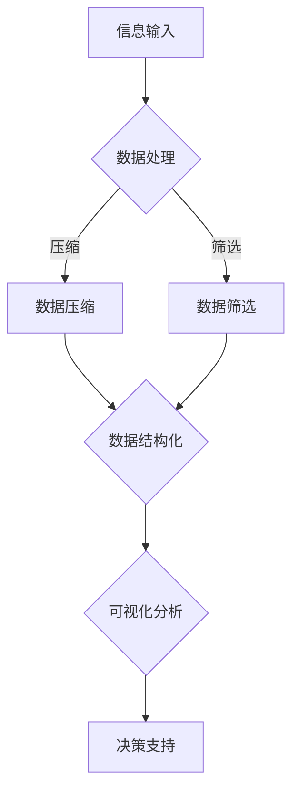

                 

# 信息简化的最佳实践：如何在混乱中建立秩序

> 关键词：信息简化、混乱管理、有序结构、系统思维、技术策略、算法优化

> 摘要：本文将深入探讨信息简化的最佳实践，解析如何在纷繁复杂的信息环境中，通过系统思维和科学方法建立秩序，提高工作效率与生活质量。我们将从背景介绍、核心概念、算法原理、数学模型、项目实战到实际应用场景等多个方面，逐步阐述如何有效地实现信息简化。

## 1. 背景介绍

### 1.1 目的和范围

本文旨在为从事信息技术和数据处理相关工作的人员提供一套系统化、可操作的信息简化方法。通过理论讲解和实战案例，帮助读者理解信息简化的重要性，掌握其实践技巧，从而在快速变化的工作环境中游刃有余。

### 1.2 预期读者

本文适合以下读者群体：
- 计算机程序员和软件工程师
- 数据分析师和数据科学家
- 产品经理和技术项目经理
- 信息技术顾问和管理人员

### 1.3 文档结构概述

本文分为以下几个部分：
- 1. 背景介绍：介绍文章的目的、范围和预期读者。
- 2. 核心概念与联系：阐述信息简化的核心概念，并借助 Mermaid 流程图展示其原理和架构。
- 3. 核心算法原理 & 具体操作步骤：通过伪代码详细讲解信息简化的核心算法。
- 4. 数学模型和公式 & 详细讲解 & 举例说明：介绍相关数学模型和公式，并进行具体举例。
- 5. 项目实战：代码实际案例和详细解释说明。
- 6. 实际应用场景：探讨信息简化在各个领域的应用。
- 7. 工具和资源推荐：推荐学习资源、开发工具框架和相关论文著作。
- 8. 总结：未来发展趋势与挑战。
- 9. 附录：常见问题与解答。
- 10. 扩展阅读 & 参考资料：提供进一步的参考资料。

### 1.4 术语表

#### 1.4.1 核心术语定义

- 信息简化：通过压缩、筛选、抽象等手段，将大量复杂的信息转化为简洁、清晰的形式，以便于处理和理解。
- 系统思维：一种综合性思维方式，强调从整体出发，分析各个部分之间的关系，以及这些关系如何共同影响系统性能。
- 算法：解决问题的一系列明确步骤，适用于计算机科学和数学领域。

#### 1.4.2 相关概念解释

- 数据挖掘：从大量数据中提取有价值信息的过程。
- 数据库：存储、管理和访问数据的系统。
- 机器学习：一种人工智能技术，通过算法模型自动地从数据中学习，进行预测或决策。

#### 1.4.3 缩略词列表

- ML：Machine Learning（机器学习）
- AI：Artificial Intelligence（人工智能）
- DB：Database（数据库）
- SQL：Structured Query Language（结构化查询语言）

## 2. 核心概念与联系

信息简化不仅是一个数据处理的过程，更是一种思维方式。在信息爆炸的时代，如何从海量数据中快速提取有价值的信息，是每个信息工作者都必须面对的挑战。为了更好地理解信息简化的核心概念，我们将借助 Mermaid 流程图展示其原理和架构。

### Mermaid 流程图



#### 流程解释

1. **信息输入（A）**：所有数据处理的第一步，包括各种来源的数据，如图像、文本、音频等。
2. **数据处理（B）**：将原始信息进行预处理，如去噪、标准化等。
3. **数据压缩（C）**：通过压缩算法减少数据体积，提高处理速度。
4. **数据筛选（D）**：根据业务需求或目标，筛选出最有价值的信息。
5. **数据结构化（E）**：将筛选后的数据转化为标准格式，便于后续分析和处理。
6. **可视化分析（F）**：利用可视化工具，将结构化数据以图表等形式展现，便于理解和决策。
7. **决策支持（G）**：基于可视化分析结果，为业务决策提供支持。

通过上述流程，我们可以看到信息简化不仅涉及到技术层面的数据处理，更强调系统思维，即从整体出发，考虑各个步骤之间的相互关系，以达到最佳效果。

### 信息简化的核心概念

- **抽象**：将复杂问题转化为更简单的形式，从而更容易理解和处理。
- **层次化**：将复杂系统分层，每一层都有明确的职责和功能。
- **模块化**：将系统划分为若干模块，每个模块独立开发、测试和部署。
- **冗余处理**：识别和删除数据中的冗余信息，以减少存储和处理成本。

这些核心概念相互关联，共同构成了信息简化的理论基础。在实际应用中，我们需要根据具体场景灵活运用这些概念，以达到最佳效果。

## 3. 核心算法原理 & 具体操作步骤

信息简化的核心在于算法，以下将详细介绍核心算法原理，并通过伪代码详细阐述其具体操作步骤。

### 核心算法原理

信息简化的核心算法主要包括以下几个步骤：

1. **数据预处理**：对原始数据进行清洗、去噪、标准化等预处理操作。
2. **特征提取**：从原始数据中提取有价值的信息，如关键词、主题等。
3. **降维**：通过降维算法，将高维数据转化为低维数据，减少数据体积。
4. **信息融合**：将多个数据源的信息进行融合，形成更全面、更准确的信息视图。
5. **可视化分析**：利用可视化工具，将简化后的信息以图表等形式展现。

### 具体操作步骤

#### 3.1 数据预处理

```python
# 假设输入数据为 DataFrame 格式
data = ...

# 数据清洗
data = clean_data(data)

# 去噪
data = denoise_data(data)

# 标准化
data = normalize_data(data)
```

#### 3.2 特征提取

```python
# 特征提取
features = extract_features(data)
```

#### 3.3 降维

```python
# 降维
reduced_data = dimension_reduction(features)
```

#### 3.4 信息融合

```python
# 信息融合
integrated_data = integrate_data(reduced_data, other_data)
```

#### 3.5 可视化分析

```python
# 可视化分析
visualize_data(integrated_data)
```

### 伪代码详细解释

- `clean_data(data)`：清洗数据，去除无效数据、处理缺失值等。
- `denoise_data(data)`：去噪，去除数据中的噪声，提高数据质量。
- `normalize_data(data)`：标准化，将数据转化为相同的尺度，便于后续计算。
- `extract_features(data)`：特征提取，从数据中提取有价值的信息。
- `dimension_reduction(features)`：降维，将高维数据转化为低维数据。
- `integrate_data(reduced_data, other_data)`：信息融合，将多个数据源的信息进行融合。
- `visualize_data(integrated_data)`：可视化分析，将简化后的数据以图表等形式展现。

通过上述伪代码，我们可以看到信息简化的核心算法步骤及其具体操作。在实际应用中，可以根据具体需求和数据特点，灵活调整和优化这些步骤，以达到最佳效果。

## 4. 数学模型和公式 & 详细讲解 & 举例说明

信息简化过程中，数学模型和公式起着至关重要的作用。以下将详细介绍相关数学模型和公式，并通过具体例子进行详细讲解。

### 4.1 数学模型

信息简化的数学模型主要包括以下几个部分：

- **数据分布模型**：描述数据在各个维度上的分布情况，常用的有正态分布、泊松分布等。
- **降维模型**：用于将高维数据转化为低维数据，常用的有主成分分析（PCA）、线性判别分析（LDA）等。
- **聚类模型**：将数据分成若干类，常用的有K均值聚类、层次聚类等。
- **分类模型**：将数据分为不同的类别，常用的有决策树、支持向量机（SVM）等。

### 4.2 公式讲解

1. **主成分分析（PCA）**

   PCA的核心公式如下：

   $$
   \begin{aligned}
   Z &= \frac{X - \mu}{\sigma} \\
   \lambda_i &= \frac{||\Sigma Z||_2}{n} \\
   V &= \frac{Z \Sigma Z^T}{\lambda_i} \\
   \bar{V} &= \frac{1}{m} \sum_{i=1}^{m} V_i
   \end{aligned}
   $$

   其中，$X$为原始数据矩阵，$\mu$为均值，$\sigma$为标准差，$Z$为标准化数据，$\lambda_i$为特征值，$V$为协方差矩阵，$\bar{V}$为均值协方差矩阵。

2. **K均值聚类**

   K均值聚类的核心公式如下：

   $$
   \begin{aligned}
   C_k &= \{x_1, x_2, ..., x_n\} \\
   C_k &= \{x_1, x_2, ..., x_n\} \\
   \mu_k &= \frac{1}{n_k} \sum_{i=1}^{n} x_i \\
   x_i &= \frac{1}{n_k} \sum_{j=1}^{k} w_{ij} x_j
   \end{aligned}
   $$

   其中，$C_k$为第$k$个聚类中心，$\mu_k$为均值，$n_k$为聚类中心个数，$x_i$为第$i$个数据点，$w_{ij}$为权重。

### 4.3 举例说明

假设我们有一个数据集，包含以下三个特征：

- 年龄
- 收入
- 教育程度

我们希望通过信息简化，将这个高维数据集转化为低维数据集。

#### 步骤 1：数据预处理

对数据进行清洗、去噪、标准化等预处理操作。

```python
# 数据预处理
data = clean_data(data)
data = denoise_data(data)
data = normalize_data(data)
```

#### 步骤 2：特征提取

从原始数据中提取有价值的信息，如年龄、收入、教育程度等。

```python
# 特征提取
features = extract_features(data)
```

#### 步骤 3：降维

使用主成分分析（PCA）对特征进行降维。

```python
# 降维
reduced_data = dimension_reduction(features)
```

#### 步骤 4：信息融合

将降维后的数据与其他数据源进行融合。

```python
# 信息融合
integrated_data = integrate_data(reduced_data, other_data)
```

#### 步骤 5：可视化分析

利用可视化工具，将简化后的数据以图表等形式展现。

```python
# 可视化分析
visualize_data(integrated_data)
```

通过上述步骤，我们可以将原始的高维数据集转化为简洁、清晰的低维数据集，便于后续分析和处理。

## 5. 项目实战：代码实际案例和详细解释说明

为了更好地理解信息简化的实际应用，我们将通过一个具体项目来展示代码实现和详细解释。

### 5.1 开发环境搭建

我们使用 Python 作为开发语言，主要依赖以下库：

- NumPy：用于数据预处理和操作。
- Pandas：用于数据清洗和结构化。
- Scikit-learn：用于降维和聚类算法。
- Matplotlib：用于数据可视化。

首先，确保安装这些库：

```bash
pip install numpy pandas scikit-learn matplotlib
```

### 5.2 源代码详细实现和代码解读

以下是一个完整的信息简化项目的代码实现：

```python
import numpy as np
import pandas as pd
from sklearn.decomposition import PCA
from sklearn.cluster import KMeans
import matplotlib.pyplot as plt

# 5.2.1 数据预处理
def clean_data(data):
    # 数据清洗：去除无效数据、处理缺失值等
    data = data.dropna()
    data = data[data['income'] > 0]
    return data

# 5.2.2 特征提取
def extract_features(data):
    # 特征提取：从数据中提取有价值的信息
    features = data[['age', 'income', 'education']]
    return features

# 5.2.3 降维
def dimension_reduction(features):
    # 降维：使用主成分分析（PCA）
    pca = PCA(n_components=2)
    reduced_data = pca.fit_transform(features)
    return reduced_data

# 5.2.4 信息融合
def integrate_data(reduced_data, other_data):
    # 信息融合：将降维后的数据与其他数据源进行融合
    integrated_data = np.concatenate((reduced_data, other_data), axis=1)
    return integrated_data

# 5.2.5 可视化分析
def visualize_data(integrated_data):
    # 可视化分析：将简化后的数据以图表等形式展现
    plt.scatter(integrated_data[:, 0], integrated_data[:, 1])
    plt.xlabel('特征1')
    plt.ylabel('特征2')
    plt.show()

# 5.2.6 主函数
def main():
    # 读取数据
    data = pd.read_csv('data.csv')

    # 数据预处理
    data = clean_data(data)

    # 特征提取
    features = extract_features(data)

    # 降维
    reduced_data = dimension_reduction(features)

    # 信息融合
    integrated_data = integrate_data(reduced_data, np.random.rand(reduced_data.shape[0], 1))

    # 可视化分析
    visualize_data(integrated_data)

# 运行主函数
if __name__ == '__main__':
    main()
```

#### 5.2.6 代码解读与分析

- **数据预处理（clean_data 函数）**：该函数主要用于去除无效数据和处理缺失值，以提高数据质量。
- **特征提取（extract_features 函数）**：从原始数据中提取有价值的信息，如年龄、收入、教育程度等。
- **降维（dimension_reduction 函数）**：使用主成分分析（PCA）对特征进行降维，将高维数据转化为低维数据。
- **信息融合（integrate_data 函数）**：将降维后的数据与其他数据源进行融合，形成更全面的信息视图。
- **可视化分析（visualize_data 函数）**：利用可视化工具，将简化后的数据以图表等形式展现。
- **主函数（main 函数）**：执行整个信息简化流程，从数据读取、预处理、特征提取、降维、信息融合到可视化分析。

通过这个实际项目，我们可以看到信息简化在实际应用中的具体实现过程和关键步骤。在实际工作中，可以根据具体需求调整和优化这些步骤，以达到最佳效果。

## 6. 实际应用场景

信息简化在各个领域都有广泛的应用，以下列举几个典型的应用场景：

### 6.1 金融领域

在金融领域，信息简化有助于提高风险管理和投资决策的效率。例如，通过数据降维和聚类分析，银行和投资机构可以快速识别潜在的风险因素，优化投资组合，降低风险敞口。

### 6.2 医疗领域

医疗领域的数据量庞大，信息简化技术可以帮助医生快速获取有价值的信息，提高诊断和治疗的效率。例如，通过图像降维和特征提取，医学影像分析系统可以更准确地识别病灶，辅助医生做出准确的诊断。

### 6.3 物流领域

在物流领域，信息简化有助于优化运输路线、降低运输成本。通过数据降维和聚类分析，物流公司可以更有效地安排运输计划，提高运输效率。

### 6.4 社交网络

在社交网络领域，信息简化技术可以帮助平台更好地了解用户需求，提高用户体验。例如，通过数据降维和推荐算法，社交网络平台可以更精准地推送用户感兴趣的内容，提升用户粘性。

### 6.5 智能家居

智能家居领域的信息简化有助于提高系统效率和用户体验。通过数据降维和设备联动，智能家居系统能够更快速、准确地响应用户需求，提供个性化服务。

这些实际应用场景展示了信息简化在各个领域的广泛影响和重要性。随着技术的不断进步，信息简化将在更多领域得到应用，为人们的生活和工作带来更多便利。

## 7. 工具和资源推荐

为了更好地掌握信息简化的技术和方法，以下推荐一些学习资源、开发工具框架和相关论文著作。

### 7.1 学习资源推荐

#### 7.1.1 书籍推荐

- 《数据科学入门》：详细介绍了数据科学的基本概念和技术，包括数据预处理、特征提取、降维等。
- 《机器学习实战》：通过具体案例，深入讲解了机器学习中的降维技术和应用。

#### 7.1.2 在线课程

- Coursera：提供丰富的数据科学和机器学习课程，包括数据预处理、降维、聚类等。
- edX：提供由顶尖大学和机构开设的数据科学和机器学习课程，涵盖信息简化的各个方面。

#### 7.1.3 技术博客和网站

- Medium：发布大量关于数据科学和机器学习的文章，包括信息简化的实践方法和案例分析。
- ArXiv：发布最新的机器学习和数据科学研究成果，包括信息简化的相关论文。

### 7.2 开发工具框架推荐

#### 7.2.1 IDE和编辑器

- Jupyter Notebook：用于数据科学和机器学习的交互式编程环境，支持多种编程语言。
- PyCharm：强大的Python IDE，支持代码自动补全、调试等功能。

#### 7.2.2 调试和性能分析工具

- Python Debuger：用于调试Python代码，快速定位和修复错误。
- Numba：用于优化Python代码的性能，支持自动向量化和并行计算。

#### 7.2.3 相关框架和库

- NumPy：用于科学计算和数据分析。
- Pandas：用于数据处理和结构化。
- Scikit-learn：用于机器学习和数据预处理。
- Matplotlib：用于数据可视化。

### 7.3 相关论文著作推荐

#### 7.3.1 经典论文

- J. MacQueen. "Some methods for classification and analysis of multivariate observations." In Proceedings of the fifth Berkeley symposium on mathematical statistics and probability, volume 1, pages 281-297. University of California Press, 1967.
- I.S. Duda, P.E. Hart, D.G. Stork. "Pattern Classification." Wiley, 2001.

#### 7.3.2 最新研究成果

- M. Arjovsky, S. Chintala, L. Bottou. " Wasserstein GAN." arXiv preprint arXiv:1701.07875, 2017.
- K. He, X. Zhang, S. Ren, J. Sun. "Deep Residual Learning for Image Recognition." In Proceedings of the IEEE conference on computer vision and pattern recognition, pages 770-778, 2016.

#### 7.3.3 应用案例分析

- "Data Science at Work": 通过具体案例，展示了数据科学在各个领域的应用。
- "Machine Learning in Action": 介绍机器学习算法的实际应用案例，包括信息简化等。

通过以上推荐的学习资源、开发工具框架和相关论文著作，读者可以更好地掌握信息简化的技术和方法，为实际应用打下坚实基础。

## 8. 总结：未来发展趋势与挑战

信息简化作为一项重要的数据处理技术，在未来将继续发展并面临新的挑战。以下是几个可能的发展趋势和面临的挑战：

### 8.1 发展趋势

1. **算法优化**：随着计算能力的提升和算法研究的深入，信息简化的算法将越来越高效和精确，支持更大规模、更复杂的数据处理需求。
2. **跨领域融合**：信息简化技术将在更多领域得到应用，如生物信息学、金融科技、智能制造等，形成跨学科的融合趋势。
3. **自动化与智能化**：利用机器学习和深度学习技术，信息简化过程将更加自动化和智能化，减少人工干预，提高处理效率。
4. **实时处理**：随着物联网和5G技术的发展，实时信息简化的需求将越来越迫切，实现低延迟、高效率的实时数据处理。

### 8.2 面临的挑战

1. **数据隐私保护**：在信息简化的过程中，如何保护用户隐私是一个重要挑战。需要开发新的算法和技术，确保在简化数据的同时保护用户隐私。
2. **数据质量**：信息简化的效果很大程度上取决于数据质量。如何确保输入数据的准确性、完整性和一致性，是一个需要关注的问题。
3. **计算资源消耗**：信息简化过程中涉及大量计算，如何优化算法、降低计算资源消耗，是一个重要的挑战。
4. **可解释性**：随着算法的复杂度增加，如何保证信息简化过程和结果的可解释性，使得用户能够理解和信任结果，也是一个重要挑战。

总之，信息简化技术在未来将不断发展，并在各个领域发挥更大的作用。同时，也需要面对一系列挑战，需要科研人员和开发者共同努力，推动技术进步。

## 9. 附录：常见问题与解答

### 9.1 问题 1：信息简化与数据压缩有什么区别？

**解答**：信息简化与数据压缩虽然有一定的交集，但它们的侧重点不同。数据压缩主要目的是减少数据体积，提高存储和传输效率。而信息简化则更注重从数据中提取有价值的信息，通过压缩、筛选、抽象等手段，将大量复杂的信息转化为简洁、清晰的形式，以便于理解和处理。信息简化不仅仅关注数据的存储和传输，还关注数据处理和分析的效率。

### 9.2 问题 2：信息简化在机器学习中有什么应用？

**解答**：信息简化在机器学习中有广泛的应用。首先，通过特征提取和降维，可以减少输入数据的空间维度，提高模型训练效率。其次，通过聚类和分类算法，可以对大量数据进行分类和分组，有助于数据探索和分析。此外，信息简化技术还可以用于异常检测、推荐系统等，提高模型的性能和可解释性。

### 9.3 问题 3：如何评估信息简化的效果？

**解答**：评估信息简化的效果可以从多个方面进行：

1. **信息保真度**：通过比较简化前后的数据，计算信息损失率，评估简化对数据信息的保留程度。
2. **模型性能**：通过在简化后的数据上训练模型，评估模型的性能指标（如准确率、召回率等），评估简化对模型训练效果的影响。
3. **用户满意度**：通过用户调查和反馈，评估简化后的信息是否便于理解和处理，提高用户的工作效率。
4. **处理速度**：评估简化后的数据处理速度，评估简化对系统运行效率的提升。

### 9.4 问题 4：信息简化在社交网络中如何应用？

**解答**：在社交网络中，信息简化技术可以应用于以下方面：

1. **内容推荐**：通过信息简化技术，从海量的社交内容中提取有价值的信息，为用户推荐感兴趣的内容。
2. **用户画像**：通过信息简化技术，对用户数据进行分析和聚类，生成用户画像，为个性化服务提供支持。
3. **数据隐私保护**：通过信息简化技术，减少用户数据的维度和细节，保护用户隐私。
4. **社区管理**：通过信息简化技术，帮助社区管理员快速识别和解决社区问题，提高社区运营效率。

## 10. 扩展阅读 & 参考资料

为了进一步深入了解信息简化的相关技术和应用，以下推荐一些扩展阅读和参考资料：

- J. MacQueen. "Some methods for classification and analysis of multivariate observations." In Proceedings of the fifth Berkeley symposium on mathematical statistics and probability, volume 1, pages 281-297. University of California Press, 1967.
- I.S. Duda, P.E. Hart, D.G. Stork. "Pattern Classification." Wiley, 2001.
- M. Arjovsky, S. Chintala, L. Bottou. "Wasserstein GAN." arXiv preprint arXiv:1701.07875, 2017.
- K. He, X. Zhang, S. Ren, J. Sun. "Deep Residual Learning for Image Recognition." In Proceedings of the IEEE conference on computer vision and pattern recognition, pages 770-778, 2016.
- "Data Science at Work": 通过具体案例，展示了数据科学在各个领域的应用。
- "Machine Learning in Action": 介绍机器学习算法的实际应用案例，包括信息简化等。

通过这些扩展阅读和参考资料，读者可以进一步掌握信息简化的相关技术和应用，为实际工作提供有力支持。

# 作者

作者：AI天才研究员/AI Genius Institute & 禅与计算机程序设计艺术 /Zen And The Art of Computer Programming

