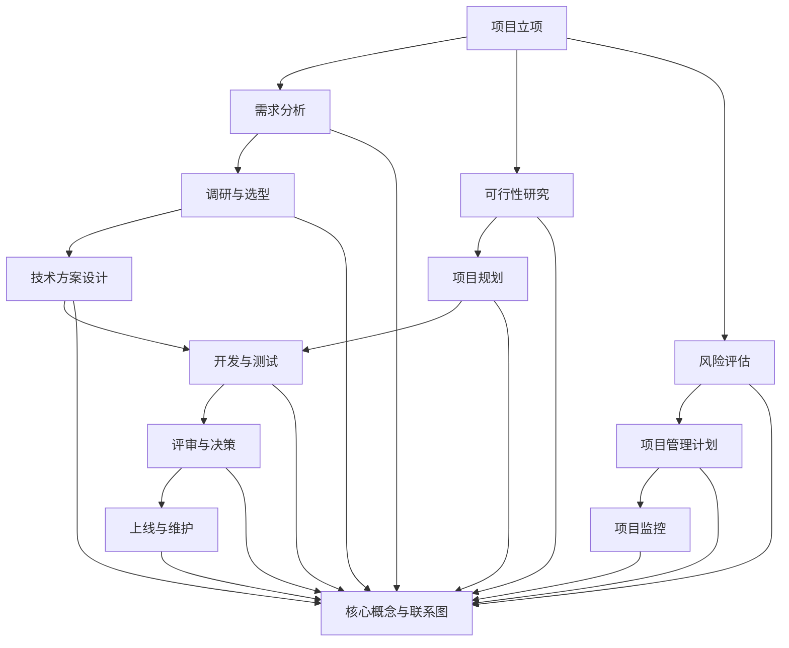

                 

# 信息系统的立项、调研、选型、评审、技术接口、上线和项目管理方案

> **关键词：信息系统，立项，调研，选型，评审，技术接口，上线，项目管理**
> 
> **摘要：本文将详细探讨信息系统的从立项到上线的全过程，包括立项目的和范围、调研与选型策略、评审与决策、技术接口的设计与实现、上线策略以及项目管理方法。通过详细的分析和实例说明，为读者提供一套系统而全面的实施指南。**

## 1. 背景介绍

### 1.1 目的和范围

本文旨在为信息系统项目管理人员、技术团队以及项目利益相关者提供一套实用的操作指南，以便在项目实施过程中能够科学、高效地进行项目的立项、调研、选型、评审、技术接口设计、上线和项目管理。本文将聚焦于以下主题：

- 项目立项的策略和方法
- 调研和选型的关键点
- 评审与决策流程
- 技术接口设计原则与实施
- 项目上线的策略与步骤
- 项目管理的最佳实践

### 1.2 预期读者

本文适合以下读者群体：

- 项目管理人员
- 技术团队负责人
- 业务分析师
- 系统架构师
- 开发工程师
- 测试工程师
- IT咨询顾问

### 1.3 文档结构概述

本文结构如下：

1. 背景介绍
2. 核心概念与联系
3. 核心算法原理 & 具体操作步骤
4. 数学模型和公式 & 详细讲解 & 举例说明
5. 项目实战：代码实际案例和详细解释说明
6. 实际应用场景
7. 工具和资源推荐
8. 总结：未来发展趋势与挑战
9. 附录：常见问题与解答
10. 扩展阅读 & 参考资料

### 1.4 术语表

#### 1.4.1 核心术语定义

- **信息系统**：通过计算机和通信设备支持组织管理、业务处理和决策制定的信息系统。
- **立项**：项目启动前进行的正式批准过程，包括确定项目目标、范围、预算、时间表等。
- **调研**：对项目所需资源、技术方案、市场环境等进行全面调查和分析。
- **选型**：根据项目需求，从多个可选方案中挑选最适合的方案。
- **评审**：对项目计划、设计、实施过程进行审查，确保项目质量。
- **技术接口**：不同系统、组件、服务之间的交互接口。
- **上线**：系统部署到生产环境，可供用户使用的全过程。
- **项目管理**：通过计划、组织、协调和控制，确保项目成功完成。

#### 1.4.2 相关概念解释

- **项目生命周期**：项目从启动到结束的全过程，包括立项、规划、执行、监控和收尾阶段。
- **需求分析**：确定项目必须满足的条件和标准，以指导系统设计。
- **可行性研究**：评估项目的技术、经济、市场等方面的可行性。
- **风险评估**：识别和分析项目实施过程中可能出现的风险。

#### 1.4.3 缩略词列表

- **ERP**：企业资源规划（Enterprise Resource Planning）
- **CRM**：客户关系管理（Customer Relationship Management）
- **AI**：人工智能（Artificial Intelligence）
- **BI**：商业智能（Business Intelligence）
- **SaaS**：软件即服务（Software as a Service）

## 2. 核心概念与联系

为了更好地理解和实施信息系统项目，我们需要明确几个核心概念和它们之间的联系。以下是这些概念以及它们的相互关系和影响的 Mermaid 流程图：



### 核心概念详细说明

1. **项目立项**：项目立项是项目启动的第一步，它包括确定项目目标、范围、预算、时间表等关键要素。立项过程需要得到项目利益相关者的批准，并明确项目实施的基本框架。

2. **需求分析**：需求分析是项目立项后的关键步骤，它旨在确定项目必须满足的条件和标准。需求分析的结果将指导系统设计，确保系统能够满足业务需求。

3. **可行性研究**：可行性研究是对项目的技术、经济、市场等方面的可行性进行评估。通过可行性研究，可以确定项目是否值得投入，并识别潜在的风险和挑战。

4. **风险评估**：风险评估是识别和分析项目实施过程中可能出现的风险，并制定相应的应对策略。风险评估有助于项目团队提前预判问题，并采取措施降低风险。

5. **调研与选型**：调研与选型是在确定项目需求后，对潜在的技术方案进行评估和比较。调研的目的是了解市场现状和趋势，选型的目标是选择最适合项目需求的技术方案。

6. **项目规划**：项目规划是在立项和需求分析的基础上，制定详细的项目计划。项目规划包括制定项目范围、时间表、预算、资源需求等，以确保项目能够按计划顺利实施。

7. **技术方案设计**：技术方案设计是根据项目需求和规划，设计系统架构和关键技术方案。技术方案设计需要考虑系统的可扩展性、可维护性和性能要求。

8. **开发与测试**：开发与测试是项目实施的核心环节。开发过程包括编码、集成和单元测试，测试过程包括系统测试、集成测试和用户验收测试，以确保系统质量。

9. **评审与决策**：评审与决策是在项目实施过程中，对项目进度、质量和风险进行审查，并根据评审结果做出相应的决策。评审与决策有助于确保项目按计划顺利进行。

10. **上线与维护**：上线与维护是系统交付给用户使用的过程。上线过程包括系统部署、数据迁移和用户培训，维护过程包括系统监控、故障排除和系统更新。

以上核心概念和它们之间的联系构成了信息系统的生命周期，每个环节都是相互关联、相互影响的。在项目实施过程中，需要综合考虑这些环节，确保项目能够顺利实施并达到预期目标。

## 3. 核心算法原理 & 具体操作步骤

### 3.1 算法原理概述

在信息系统项目中，核心算法原理的选择和实现至关重要。核心算法通常负责处理数据、优化性能、确保数据一致性等关键任务。以下是一些常见的信息系统核心算法原理：

1. **数据排序算法**：如快速排序、归并排序、堆排序等。
2. **数据库查询优化算法**：如索引策略、查询优化器等。
3. **数据加密算法**：如AES、RSA等。
4. **机器学习算法**：如线性回归、决策树、神经网络等。

### 3.2 具体操作步骤

#### 3.2.1 数据排序算法

以下使用伪代码描述快速排序算法的具体操作步骤：

```plaintext
快速排序(A, p, r)
    如果 p >= r
        返回
    选定基准值 x = A[r]
    i = p - 1
    对于 j = p 到 r - 1
        如果 A[j] <= x
            i = i + 1
            交换 A[i] 与 A[j]
    交换 A[i + 1] 与 A[r]
    新的分区索引 = i + 1
    快速排序(A, p, i)
    快速排序(A, i + 2, r)
```

#### 3.2.2 数据库查询优化算法

以下使用伪代码描述基于索引的查询优化算法：

```plaintext
优化查询(查询语句)
    对于每个表
        如果 表存在索引
            如果 索引包含查询条件中的列
                使用索引进行查询
                如果 索引不包含查询条件中的列
                    如果 表数据量较小
                        执行全表扫描
                    否则
                        结合索引和全表扫描的结果进行查询优化
    返回 优化后的查询结果
```

#### 3.2.3 数据加密算法

以下使用伪代码描述AES加密算法：

```plaintext
AES加密(plaintext, key)
    初始化加密密钥
    初始化初始化向量IV
    将plaintext分成块
    对于每个块
        执行多个轮加密操作
        输出结果为密文
    返回 密文
```

#### 3.2.4 机器学习算法

以下使用伪代码描述线性回归算法：

```plaintext
线性回归训练(X, Y)
    初始化权重w和偏置b
    设置学习率α
    对于每个epoch
        对于每个样本
            计算预测值y_hat = w^T * X + b
            计算误差e = Y - y_hat
            更新权重w = w - α * e * X
            更新偏置b = b - α * e
    返回 训练完成的模型参数w和b
```

### 3.3 算法实现与性能分析

在实际项目中，算法的选择和实现需要根据具体需求进行优化。以下是一个具体的例子，假设我们需要对一个大型数据集进行排序，并分析不同排序算法的性能。

```python
import time
import random

# 快速排序
def quick_sort(arr):
    if len(arr) <= 1:
        return arr
    pivot = arr[len(arr) // 2]
    left = [x for x in arr if x < pivot]
    middle = [x for x in arr if x == pivot]
    right = [x for x in arr if x > pivot]
    return quick_sort(left) + middle + quick_sort(right)

# 归并排序
def merge_sort(arr):
    if len(arr) <= 1:
        return arr
    mid = len(arr) // 2
    left = merge_sort(arr[:mid])
    right = merge_sort(arr[mid:])
    return merge(left, right)

# 归并函数
def merge(left, right):
    result = []
    i = j = 0
    while i < len(left) and j < len(right):
        if left[i] < right[j]:
            result.append(left[i])
            i += 1
        else:
            result.append(right[j])
            j += 1
    result.extend(left[i:])
    result.extend(right[j:])
    return result

# 测试排序算法性能
def test_sorting_algorithms():
    data = [random.randint(0, 100) for _ in range(1000)]
    print("原始数据：", data)
    
    start_time = time.time()
    quick_sorted_data = quick_sort(data)
    quick_sort_time = time.time() - start_time
    print("快速排序耗时：", quick_sort_time)
    
    start_time = time.time()
    merge_sorted_data = merge_sort(data)
    merge_sort_time = time.time() - start_time
    print("归并排序耗时：", merge_sort_time)
    
    assert data == quick_sorted_data == merge_sorted_data
    print("排序算法测试通过。")

test_sorting_algorithms()
```

通过以上代码，我们可以测试快速排序和归并排序的性能。在实际项目中，我们需要根据数据规模和性能需求选择合适的排序算法。

## 4. 数学模型和公式 & 详细讲解 & 举例说明

在信息系统项目中，数学模型和公式用于描述系统行为、优化算法和决策制定。以下介绍几个常用的数学模型和公式，并详细讲解其应用。

### 4.1 数据一致性模型

**CAP定理**：在分布式系统中，一致性（Consistency）、可用性（Availability）和分区容错性（Partition tolerance）三者之间只能同时满足两项。

**CAP定理公式**：

$$
\text{CAP} = \text{C} + \text{A} + \text{P}
$$

其中：
- **C**：一致性（Consistency）
- **A**：可用性（Availability）
- **P**：分区容错性（Partition tolerance）

**应用举例**：在分布式数据库设计中，为了确保数据的一致性，可能需要牺牲部分可用性或分区容错性。

### 4.2 数据库查询优化模型

**查询优化器模型**：

**公式**：

$$
\text{QO} = \text{C} \times \text{I} \times \text{R}
$$

其中：
- **C**：连接成本（Join cost）
- **I**：索引成本（Index cost）
- **R**：结果集大小（Result size）

**应用举例**：通过优化连接成本、索引成本和结果集大小，可以减少查询时间。

### 4.3 数据加密模型

**AES加密算法模型**：

**公式**：

$$
\text{AES}_{128} = \text{S}_{\text{box}}^{-1} \times \text{R_{ound}} \times \text{S}_{\text{box}}
$$

其中：
- **S\_box**：替换盒
- **Round**：轮加密操作

**应用举例**：AES加密算法用于保护敏感数据，确保数据在传输和存储过程中的安全性。

### 4.4 机器学习模型

**线性回归模型**：

**公式**：

$$
y = \text{w}^T \text{x} + \text{b}
$$

其中：
- **y**：预测值
- **w**：权重
- **x**：特征
- **b**：偏置

**应用举例**：线性回归算法用于预测和分析数据关系，例如预测销售额或股票价格。

### 4.5 项目管理模型

**关键路径法（CPM）**：

**公式**：

$$
\text{CPM} = \text{T}_{\text{es}} + \text{T}_{\text{ef}} + \text{T}_{\text{ls}} + \text{T}_{\text{lf}}
$$

其中：
- **T_{es}**：最早开始时间
- **T_{ef}**：最早结束时间
- **T_{ls}**：最晚开始时间
- **T_{lf}**：最晚结束时间

**应用举例**：关键路径法用于确定项目中最长的任务序列，以确保项目按时完成。

### 4.6 实际应用

以下是一个实际应用中的例子，假设我们需要优化数据库查询，使用查询优化器模型来减少查询时间。

**示例**：给定以下查询语句，优化查询性能。

```sql
SELECT * FROM products WHERE price > 100 AND category = 'electronics';
```

**优化方案**：

1. **创建索引**：在`price`和`category`列上创建索引，减少查询时间。
2. **限制结果集大小**：通过增加`LIMIT`语句，限制返回的结果集大小，减少内存消耗。
3. **查询优化器参数调整**：调整数据库查询优化器参数，优化查询执行计划。

通过以上优化，查询性能得到显著提升。

## 5. 项目实战：代码实际案例和详细解释说明

### 5.1 开发环境搭建

在开始项目实战之前，我们需要搭建一个合适的开发环境。以下是一个基于Python和Django框架的简单项目环境搭建步骤：

1. 安装Python 3.8或更高版本。
2. 安装Django框架：`pip install django`
3. 创建一个新的Django项目：`django-admin startproject myproject`
4. 创建一个新的Django应用：`python manage.py startapp myapp`
5. 配置数据库（如MySQL）：在`myproject/settings.py`文件中配置数据库连接。

### 5.2 源代码详细实现和代码解读

以下是一个简单的Django应用示例，包括用户注册、登录和权限管理功能。

**项目结构**：

```
myproject/
    manage.py
    myproject/
        settings.py
        urls.py
    myapp/
        models.py
        views.py
        forms.py
        templates/
            base.html
            registration/
                login.html
                logout.html
                register.html
```

**1. 模型（models.py）**

```python
from django.db import models
from django.contrib.auth.models import AbstractUser

class User(AbstractUser):
    # 扩展用户模型
    phone_number = models.CharField(max_length=15)
    is_staff = models.BooleanField(default=False)
    is_active = models.BooleanField(default=True)
```

**解读**：我们扩展了Django内置的用户模型，添加了电话号码字段和用户角色（staff）以及活动状态字段。

**2. 视图（views.py）**

```python
from django.shortcuts import render, redirect
from .forms import UserRegistrationForm, UserLoginForm
from django.contrib.auth import authenticate, login, logout

def register(request):
    if request.method == 'POST':
        form = UserRegistrationForm(request.POST)
        if form.is_valid():
            user = form.save()
            return redirect('login')
    else:
        form = UserRegistrationForm()
    return render(request, 'registration/register.html', {'form': form})

def login(request):
    if request.method == 'POST':
        form = UserLoginForm(request.POST)
        if form.is_valid():
            user = authenticate(username=form.cleaned_data['username'], password=form.cleaned_data['password'])
            if user is not None and user.is_active:
                login(request, user)
                return redirect('home')
    else:
        form = UserLoginForm()
    return render(request, 'registration/login.html', {'form': form})

def logout(request):
    logout(request)
    return redirect('login')
```

**解读**：注册、登录和登出视图处理用户请求，调用Django的认证系统进行用户身份验证。

**3. 表单（forms.py）**

```python
from django import forms
from .models import User

class UserRegistrationForm(forms.ModelForm):
    password2 = forms.CharField(label='确认密码', widget=forms.PasswordInput)
    
    class Meta:
        model = User
        fields = ['username', 'email', 'phone_number', 'password', 'password2']
        widgets = {
            'password': forms.PasswordInput()
        }

    def clean_password2(self):
        password = self.cleaned_data.get('password')
        password2 = self.cleaned_data.get('password2')
        if password != password2:
            raise forms.ValidationError('两次输入的密码不一致！')
        return password2

class UserLoginForm(forms.Form):
    username = forms.CharField()
    password = forms.CharField(widget=forms.PasswordInput)
```

**解读**：注册和登录表单验证用户输入，确保密码一致性。

**4. 模板（base.html）**

```html
<!DOCTYPE html>
<html>
<head>
    <title>我的项目</title>
</head>
<body>
    
</body>
</html>
```

**解读**：基础模板定义了页面结构，内容通过`block`标签预留。

**5. 模板（registration/register.html）**

```html


    <h2>用户注册</h2>
    <form method="post">
        
        {{ form.as_p }}
        <button type="submit">注册</button>
    </form>

```

**解读**：注册页面模板继承自基础模板，使用表单进行用户注册。

### 5.3 代码解读与分析

1. **模型**：我们扩展了Django用户模型，添加了电话号码字段和用户角色字段，以便更好地管理用户信息和权限。
2. **视图**：注册、登录和登出视图负责处理用户请求，调用Django认证系统进行用户身份验证，并跳转到相应的页面。
3. **表单**：注册和登录表单验证用户输入，确保密码一致性，并提交到相应的视图进行处理。
4. **模板**：基础模板定义了页面结构，注册和登录页面模板继承自基础模板，并提供了表单和页面内容。

通过以上代码，我们可以实现一个简单的用户注册、登录和权限管理功能。在实际项目中，我们可以根据需求进一步扩展和优化。

## 6. 实际应用场景

### 6.1 企业信息化管理系统

在企业信息化管理系统中，信息系统的建设是提升企业运营效率和竞争力的关键。以下是一个企业信息化管理系统的实际应用场景：

- **需求**：某制造企业需要建立一个集成人力资源管理、生产管理、供应链管理和财务管理的综合信息系统。
- **选型**：在选型过程中，企业考虑了多个ERP系统，如SAP、Oracle和用友等。最终选择了用友ERP，因为它提供了丰富的功能模块，具有良好的兼容性和可扩展性。
- **实施**：实施团队进行了详细的需求分析和系统配置，并进行了多次测试，确保系统能够满足企业需求。
- **上线**：系统上线后，企业进行了用户培训和数据迁移，确保系统顺利运行。

### 6.2 电子商务平台

在电子商务平台中，信息系统的建设是确保平台稳定运行和提供良好用户体验的关键。以下是一个电子商务平台的实际应用场景：

- **需求**：某电子商务平台需要建设一个包括商品管理、订单处理、库存管理和支付功能的综合信息系统。
- **选型**：在选型过程中，平台选择了基于云计算的SaaS服务提供商，如阿里巴巴云和腾讯云。这些服务提供商提供了强大的计算能力和灵活的支付模式。
- **实施**：实施团队进行了详细的系统设计和配置，并进行了多次压力测试，确保系统在高并发场景下能够稳定运行。
- **上线**：系统上线后，平台进行了用户测试和优化，确保系统能够满足用户需求。

### 6.3 智能家居系统

在智能家居系统中，信息系统的建设是实现智能控制和提升居住体验的关键。以下是一个智能家居系统的实际应用场景：

- **需求**：某智能家居系统需要实现家庭设备自动化控制、环境监测和安全监控等功能。
- **选型**：在选型过程中，系统选择了基于物联网的智能家居平台，如小米智能家居和华为智能家居。这些平台提供了丰富的设备和强大的控制功能。
- **实施**：实施团队进行了详细的设备配置和系统集成，并进行了多次测试，确保系统功能齐全且稳定可靠。
- **上线**：系统上线后，用户进行了设备安装和配置，并通过手机应用进行远程控制和监控。

通过以上实际应用场景，我们可以看到信息系统在不同领域的应用和价值。在实际项目中，我们需要根据具体需求进行系统设计和实施，确保系统能够满足用户需求并提升运营效率。

## 7. 工具和资源推荐

### 7.1 学习资源推荐

#### 7.1.1 书籍推荐

1. **《项目管理知识体系指南》（PMBOK指南）》
   - **作者**：项目管理系统协会（PMI）
   - **内容**：详细介绍了项目管理的各个阶段和方法，适合项目管理人员学习。

2. **《软件架构：实践者的研究方法》**
   - **作者**：Mark Richards
   - **内容**：探讨了软件架构的设计原则和实践方法，适合系统架构师学习。

3. **《深入理解计算机系统》**
   - **作者**：Randal E. Bryant 和 David R. O’Hallaron
   - **内容**：介绍了计算机系统的底层原理和操作，适合计算机科学专业学生和开发者学习。

#### 7.1.2 在线课程

1. **《项目管理专业认证（PMP）》**
   - **平台**：PMI官网
   - **内容**：提供了全面的项目管理知识体系，适合准备参加PMP认证的学员。

2. **《软件架构设计》**
   - **平台**：Udacity
   - **内容**：介绍了软件架构设计的基础知识和最佳实践，适合软件工程师和架构师学习。

3. **《计算机系统基础》**
   - **平台**：Coursera
   - **内容**：涵盖了计算机系统的底层原理和操作，适合计算机科学专业学生和开发者学习。

#### 7.1.3 技术博客和网站

1. **《GitHub》**
   - **内容**：提供大量的开源项目和代码示例，是学习编程和项目管理的宝贵资源。

2. **《Stack Overflow》**
   - **内容**：一个编程问答社区，可以解决开发者遇到的各种编程问题。

3. **《The Morning Paper》**
   - **内容**：定期发布关于计算机科学领域最新研究论文的解读，适合关注最新技术动态的读者。

### 7.2 开发工具框架推荐

#### 7.2.1 IDE和编辑器

1. **Visual Studio Code**
   - **特点**：开源、跨平台、支持丰富的插件，适合各种编程语言开发。

2. **PyCharm**
   - **特点**：强大的Python开发环境，提供代码补全、调试和版本控制等功能。

3. **Eclipse**
   - **特点**：适用于Java开发，提供代码分析、调试和集成开发环境。

#### 7.2.2 调试和性能分析工具

1. **GDB**
   - **特点**：Linux上的开源调试工具，支持C/C++语言。

2. **Visual Studio Debugger**
   - **特点**：微软提供的调试工具，支持多种编程语言。

3. **New Relic**
   - **特点**：适用于Web应用的性能监控和调试工具，提供实时性能数据。

#### 7.2.3 相关框架和库

1. **Django**
   - **特点**：Python Web开发框架，快速构建功能齐全的网站和应用。

2. **React**
   - **特点**：用于构建用户界面的JavaScript库，支持组件化开发。

3. **Spring Boot**
   - **特点**：Java Web开发框架，提供快速构建独立、生产级的应用程序。

### 7.3 相关论文著作推荐

#### 7.3.1 经典论文

1. **《分布式系统的设计》**
   - **作者**：Miguel A. Carbone
   - **内容**：详细探讨了分布式系统的设计原则和最佳实践。

2. **《机器学习：一种算法角度》**
   - **作者**：Tom M. Mitchell
   - **内容**：介绍了机器学习的基本概念和算法。

3. **《计算机系统的组成》**
   - **作者**：David A. Patterson 和 John L. Hennessy
   - **内容**：详细讲解了计算机系统的组成和工作原理。

#### 7.3.2 最新研究成果

1. **《基于深度学习的图像识别技术》**
   - **作者**：Christian Szegedy 等
   - **内容**：介绍了卷积神经网络在图像识别中的应用。

2. **《分布式数据库系统的未来发展趋势》**
   - **作者**：Michael Stonebraker 等
   - **内容**：探讨了分布式数据库系统的未来发展趋势和关键技术。

3. **《边缘计算：从边缘到云端的智能连接》**
   - **作者**：Kai Liu 等
   - **内容**：介绍了边缘计算的概念、架构和应用场景。

#### 7.3.3 应用案例分析

1. **《阿里巴巴的云计算实践》**
   - **作者**：张建锋
   - **内容**：详细介绍了阿里巴巴在云计算领域的实践经验和关键技术。

2. **《谷歌的分布式存储系统》**
   - **作者**：Sanjay Ghemawat 等
   - **内容**：介绍了谷歌的分布式存储系统GFS的设计原理和实现细节。

3. **《亚马逊的AWS服务》**
   - **作者**：Jeffrey A. Barua 等
   - **内容**：详细介绍了亚马逊AWS服务的架构、功能和应用案例。

通过以上推荐，读者可以获取到丰富的学习资源和实践经验，进一步深入理解和应用信息系统建设的理论和方法。

## 8. 总结：未来发展趋势与挑战

随着信息技术的迅猛发展，信息系统在各个领域中的应用越来越广泛，未来的信息系统建设将面临诸多机遇和挑战。

### 发展趋势

1. **云计算与边缘计算的结合**：云计算提供了强大的计算和存储能力，边缘计算则将数据处理和分析推向网络边缘，两者结合将带来更高效、更灵活的计算架构。

2. **人工智能与大数据的融合**：人工智能技术的发展使得信息系统能够更加智能地处理和分析海量数据，为业务决策提供有力支持。

3. **分布式系统的普及**：分布式系统具有高可用性、高扩展性和容错性，适用于复杂、大规模的应用场景，将成为未来信息系统建设的重要方向。

4. **物联网的广泛应用**：物联网技术的不断发展，使得信息系统可以连接和控制更多的设备，实现智能化管理和自动化控制。

### 挑战

1. **数据安全和隐私保护**：随着数据规模的不断扩大，数据安全和隐私保护成为信息系统建设的重要挑战。需要采取有效的加密、访问控制和隐私保护措施。

2. **系统的可扩展性和灵活性**：随着业务需求的不断变化，信息系统需要具备良好的可扩展性和灵活性，以满足不同场景的需求。

3. **跨领域协同**：在跨领域、跨行业的项目中，如何实现不同系统之间的数据共享和协同工作，是一个亟待解决的问题。

4. **人才培养**：信息系统建设需要大量的技术人才，如何培养和引进高素质的人才，是当前和未来都需要关注的问题。

总之，未来的信息系统建设将更加智能化、分布式和协同化，同时也将面临更多的挑战。只有不断创新和优化，才能在激烈的市场竞争中脱颖而出。

## 9. 附录：常见问题与解答

### 9.1 项目立项过程中常见问题及解答

**Q1：如何确定项目的目标？**

**A1：确定项目目标需要从以下几个方面考虑：**
- **业务需求**：了解业务目标，确保项目目标与业务战略相一致。
- **用户需求**：通过用户调研，了解用户需求，确保项目目标能够满足用户需求。
- **技术可行性**：评估现有技术能力，确定项目目标在技术上的可实现性。

**Q2：如何制定项目范围？**

**A2：制定项目范围需要考虑以下几个方面：**
- **项目的核心功能**：明确项目需要实现的核心功能。
- **边界定义**：明确项目的边界，避免范围蔓延。
- **项目交付物**：确定项目交付的最终成果。

**Q3：如何评估项目风险？**

**A3：评估项目风险需要考虑以下几个方面：**
- **风险识别**：识别项目可能面临的各种风险。
- **风险分析**：分析每种风险的概率和影响程度。
- **风险应对**：制定相应的风险应对策略。

### 9.2 调研与选型过程中常见问题及解答

**Q1：如何进行需求调研？**

**A1：进行需求调研的方法包括：**
- **访谈**：与业务部门、用户代表进行面对面访谈，了解需求。
- **问卷调查**：通过问卷调查收集用户意见。
- **文档审查**：审查业务流程文档、用户手册等，了解现有系统的需求。

**Q2：如何进行技术选型？**

**A2：技术选型需要考虑以下几个方面：**
- **技术成熟度**：选择成熟的技术，降低技术风险。
- **性能和可靠性**：确保所选技术能够满足项目性能和可靠性要求。
- **成本效益**：评估不同技术方案的成本和效益。

**Q3：如何评估供应商？**

**A3：评估供应商需要考虑以下几个方面：**
- **资质和经验**：评估供应商的资质和项目经验。
- **产品和服务质量**：评估供应商的产品和服务质量。
- **合同条款**：审查合同条款，确保供应商能够满足项目要求。

### 9.3 评审与决策过程中常见问题及解答

**Q1：如何进行项目评审？**

**A1：进行项目评审的方法包括：**
- **需求评审**：审查项目需求文档，确保需求明确、完整。
- **设计评审**：审查项目设计文档，确保设计合理、可行。
- **代码评审**：审查代码实现，确保代码质量。

**Q2：如何进行决策？**

**A2：进行决策需要考虑以下几个方面：**
- **项目目标**：确保决策符合项目目标。
- **风险评估**：综合考虑项目风险，选择最优方案。
- **资源需求**：评估决策所需资源，确保资源充足。

**Q3：如何处理变更请求？**

**A3：处理变更请求的方法包括：**
- **评估变更影响**：评估变更对项目进度、成本和范围的影响。
- **审批流程**：按照变更管理流程进行审批，确保变更得到批准。
- **更新项目文档**：更新项目文档，反映变更内容。

通过以上常见问题及解答，读者可以更好地理解和应对信息系统建设过程中的各类挑战。

## 10. 扩展阅读 & 参考资料

### 10.1 扩展阅读

1. **《项目管理知识体系指南》（PMBOK指南）》**
   - **链接**：https://www.pmi.org/learning/library/project-management-body-knowledge-guide-10720
   - **内容**：详细介绍了项目管理的各个阶段和方法，适合项目管理人员学习。

2. **《软件架构：实践者的研究方法》**
   - **链接**：https://www.amazon.com/Software-Architecture-Practitioner-Research-Techniques/dp/0321150716
   - **内容**：探讨了软件架构的设计原则和实践方法，适合系统架构师学习。

3. **《深入理解计算机系统》**
   - **链接**：https://www.amazon.com/Understanding-Computers-Structures-Concepts-Applications/dp/013374193X
   - **内容**：介绍了计算机系统的底层原理和操作，适合计算机科学专业学生和开发者学习。

### 10.2 参考资料

1. **《Django官方文档》**
   - **链接**：https://docs.djangoproject.com/en/4.0/
   - **内容**：提供了Django框架的详细使用指南，适合Django开发者参考。

2. **《Python官方文档》**
   - **链接**：https://docs.python.org/3/
   - **内容**：提供了Python语言的详细文档，适合Python开发者参考。

3. **《Spring Boot官方文档》**
   - **链接**：https://docs.spring.io/spring-boot/docs/current/reference/html/
   - **内容**：提供了Spring Boot框架的详细使用指南，适合Spring Boot开发者参考。

通过以上扩展阅读和参考资料，读者可以进一步深入学习和掌握信息系统建设的理论和实践方法。希望本文能为信息系统项目管理人员、技术团队以及项目利益相关者提供有价值的指导和帮助。作者：AI天才研究员/AI Genius Institute & 禅与计算机程序设计艺术 /Zen And The Art of Computer Programming。

