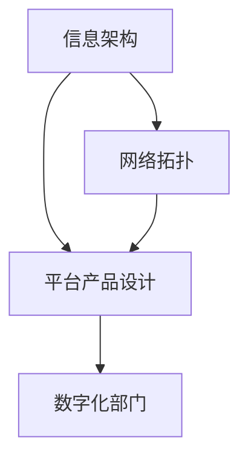

                 

# 信息、网络、平台产品和数字化部门规划

> **关键词：** 信息架构，网络拓扑，平台产品设计，数字化部门，数字化转型

> **摘要：** 本文章旨在探讨信息、网络、平台产品和数字化部门在当前数字化时代的重要性。通过深入分析信息架构、网络拓扑结构、平台产品设计以及数字化部门的职能，本文提出了一个系统化的规划框架，以帮助企业和组织在数字化转型过程中实现高效、有序的发展。文章将从理论、实践和未来趋势三个方面展开讨论，提供实用的策略和工具，以应对数字化转型中的挑战。

## 1. 背景介绍

### 1.1 目的和范围

随着信息技术的飞速发展，数字化已成为企业和组织发展的必然趋势。本文旨在探讨信息、网络、平台产品和数字化部门在数字化转型中的关键作用，并提供一套系统化的规划框架。文章主要涵盖以下内容：

- **信息架构**：介绍信息架构的核心概念，探讨其在数字化部门规划中的应用。
- **网络拓扑**：分析不同类型的网络拓扑结构，阐述其在平台产品设计和数字化部门中的作用。
- **平台产品设计**：深入探讨平台产品的设计原则和策略，提供实用的设计框架。
- **数字化部门规划**：从组织架构、人员配置和流程管理等方面，提出数字化部门的规划方案。

### 1.2 预期读者

本文主要面向以下读者群体：

- **企业高管和决策者**：希望了解数字化转型过程中的关键要素，制定相应的战略规划。
- **IT专业人士**：负责信息架构、网络规划和平台产品设计等工作，寻求系统化的指导。
- **研究人员和学者**：关注数字化转型领域的研究动态，寻求理论与实践的结合。

### 1.3 文档结构概述

本文结构如下：

- **第1章：背景介绍**：阐述文章的目的、预期读者和文档结构。
- **第2章：核心概念与联系**：介绍信息架构、网络拓扑和平台产品设计的相关概念和联系。
- **第3章：核心算法原理与具体操作步骤**：详细阐述信息架构和平台设计的相关算法原理和操作步骤。
- **第4章：数学模型和公式**：介绍与信息架构和平台设计相关的数学模型和公式，并进行举例说明。
- **第5章：项目实战**：通过实际案例展示信息架构和平台设计的具体应用。
- **第6章：实际应用场景**：探讨数字化部门在不同场景中的应用。
- **第7章：工具和资源推荐**：推荐学习资源、开发工具和框架。
- **第8章：总结**：展望数字化部门的发展趋势与挑战。
- **第9章：附录**：提供常见问题与解答。
- **第10章：扩展阅读与参考资料**：推荐相关的研究文献和资料。

### 1.4 术语表

#### 1.4.1 核心术语定义

- **信息架构**：组织和管理信息的一种方法，旨在提高信息的可用性和可访问性。
- **网络拓扑**：计算机网络中设备互联的物理或逻辑结构。
- **平台产品**：为满足特定需求而设计的软件或硬件系统，提供特定的功能和服务。
- **数字化部门**：专门负责企业数字化转型的部门，涉及信息架构、网络规划和平台产品设计等方面。

#### 1.4.2 相关概念解释

- **数字化转型**：将企业的业务、流程、组织和技术进行数字化变革，以提高效率和创新能力。
- **数据驱动**：基于数据分析和挖掘，指导企业的决策和运营。
- **用户中心**：以用户需求为中心，设计产品和提供服务。

#### 1.4.3 缩略词列表

- **IT**：信息技术（Information Technology）
- **IoT**：物联网（Internet of Things）
- **AI**：人工智能（Artificial Intelligence）
- **5G**：第五代移动通信技术（5th Generation Mobile Communication Technology）

## 2. 核心概念与联系

在数字化转型过程中，信息架构、网络拓扑和平台产品设计是三个核心概念。为了更好地理解它们之间的关系，我们可以通过一个Mermaid流程图来展示它们之间的联系。



### 2.1 信息架构

信息架构是指组织和管理信息的一种方法，旨在提高信息的可用性和可访问性。在数字化部门规划中，信息架构的作用至关重要。它有助于确保数据的一致性、可靠性和高效性。

#### 信息架构的层次结构

信息架构通常包括以下几个层次：

- **战略层**：定义企业的信息战略和目标，指导信息架构的实施。
- **设计层**：设计信息系统的结构、流程和界面，确保用户体验。
- **实现层**：构建和部署信息系统，包括硬件、软件和网络设备。
- **运营层**：管理和维护信息系统，确保其正常运行。

#### 信息架构的关键要素

- **数据模型**：定义数据结构和关系，支持数据的一致性和完整性。
- **分类和标签**：通过分类和标签，帮助用户快速查找和访问信息。
- **导航和搜索**：提供便捷的导航和搜索功能，提高信息的可用性。

### 2.2 网络拓扑

网络拓扑是指计算机网络中设备互联的物理或逻辑结构。网络拓扑结构对平台产品设计有着重要影响，因为它决定了数据的传输速度、可靠性和安全性。

#### 网络拓扑的类型

- **星型拓扑**：所有设备通过一个中央节点连接，具有较高的可靠性和易用性。
- **环型拓扑**：设备依次连接形成一个闭合环路，具有较高的数据传输速度。
- **网状拓扑**：设备之间相互连接，提供冗余路径，提高网络的可靠性。
- **总线拓扑**：设备通过一条总线连接，共享带宽，成本较低。

#### 网络拓扑的选择

在选择网络拓扑时，需要考虑以下因素：

- **网络规模**：大型网络需要更复杂的拓扑结构，以支持更多的设备和更高的数据传输速率。
- **可靠性**：选择具有冗余路径的拓扑结构，以提高网络的可靠性。
- **成本**：成本是选择网络拓扑时的一个重要因素，需要权衡性能和成本之间的平衡。

### 2.3 平台产品设计

平台产品设计是指为满足特定需求而设计的软件或硬件系统，提供特定的功能和服务。平台产品设计在数字化部门规划中起着核心作用，因为它决定了企业的业务流程、用户体验和创新能力。

#### 平台产品的设计原则

- **用户中心**：以用户需求为中心，设计简单、直观的用户界面。
- **模块化**：将系统划分为模块，提高系统的可扩展性和可维护性。
- **灵活性**：设计具有灵活性的系统，以适应不断变化的需求。
- **安全性**：确保系统的数据安全和用户隐私。

#### 平台产品的设计策略

- **需求分析**：深入分析用户需求，确定平台产品的核心功能和特点。
- **原型设计**：创建原型，验证设计思路和用户交互体验。
- **迭代开发**：通过迭代开发，逐步完善平台产品的功能和性能。
- **测试与部署**：进行严格的测试，确保平台产品的质量和稳定性，然后进行部署。

### 2.4 数字化部门规划

数字化部门是专门负责企业数字化转型的部门，涉及信息架构、网络规划和平台产品设计等方面。数字化部门规划是企业数字化转型成功的关键。

#### 数字化部门规划的关键要素

- **组织架构**：建立合理的组织架构，确保数字化部门的职能得到充分发挥。
- **人员配置**：招聘具备专业技能的人才，组建高效的团队。
- **流程管理**：优化业务流程，提高数字化部门的运作效率。
- **技术支持**：提供必要的技术支持，确保数字化部门的正常运行。

#### 数字化部门规划的实施步骤

1. **需求分析**：明确企业数字化转型的目标和需求。
2. **战略规划**：制定数字化部门的战略规划和组织架构。
3. **人员招聘**：招聘具备专业技能的人才，组建数字化部门。
4. **流程优化**：优化业务流程，提高数字化部门的运作效率。
5. **技术支持**：提供必要的技术支持，确保数字化部门的正常运行。
6. **持续改进**：持续跟踪数字化部门的工作，进行改进和优化。

## 3. 核心算法原理与具体操作步骤

在数字化部门规划中，信息架构和平台产品设计是关键环节。以下是信息架构和平台设计的相关算法原理和具体操作步骤。

### 3.1 信息架构算法原理

信息架构的核心算法是数据建模。数据建模旨在定义数据结构和关系，以提高数据的一致性和完整性。以下是数据建模的伪代码：

```plaintext
算法：数据建模
输入：数据源，数据需求
输出：数据模型

步骤：
1. 收集数据源信息
2. 分析数据需求
3. 定义实体和属性
4. 建立实体之间的关系
5. 优化数据模型
6. 验证数据模型
7. 实施数据建模
```

### 3.2 平台产品设计算法原理

平台产品设计的核心算法是需求分析和原型设计。需求分析旨在确定平台产品的核心功能和特点，原型设计则用于验证设计思路和用户交互体验。以下是需求分析和原型设计的伪代码：

```plaintext
算法：需求分析
输入：用户需求，业务场景
输出：功能需求，非功能需求

步骤：
1. 收集用户需求
2. 分析业务场景
3. 确定功能需求
4. 确定非功能需求
5. 验证需求

算法：原型设计
输入：需求分析结果，用户界面设计工具
输出：原型

步骤：
1. 创建用户界面原型
2. 添加功能模块
3. 设计交互流程
4. 测试用户交互体验
5. 优化原型
6. 验证原型
```

## 4. 数学模型和公式与详细讲解

在数字化部门规划中，数学模型和公式对于信息架构和平台设计至关重要。以下是一些常见的数学模型和公式，并进行详细讲解。

### 4.1 数据一致性模型

数据一致性模型用于确保数据在不同系统之间的一致性。以下是数据一致性的公式：

$$
C(x, y) = \frac{Sim(x, y)}{Max(Sim(x, z), Sim(y, z))}
$$

其中，$C(x, y)$ 表示数据 $x$ 和 $y$ 的一致性程度，$Sim(x, y)$ 表示数据 $x$ 和 $y$ 的相似度，$Max(Sim(x, z), Sim(y, z))$ 表示数据 $x$ 和 $y$ 与其他数据的相似度中的最大值。

### 4.2 数据完整性模型

数据完整性模型用于评估数据模型的完整性。以下是数据完整性的公式：

$$
I(M) = \frac{num_{complete\_entities}}{num_{all\_entities}}
$$

其中，$I(M)$ 表示数据模型 $M$ 的完整性程度，$num_{complete\_entities}$ 表示完整实体数量，$num_{all\_entities}$ 表示所有实体数量。

### 4.3 用户满意度模型

用户满意度模型用于评估用户对平台产品的满意度。以下是用户满意度的公式：

$$
S(U) = \frac{num_{positive\_feedback}}{num_{total\_feedback}}
$$

其中，$S(U)$ 表示用户 $U$ 的满意度，$num_{positive\_feedback}$ 表示正面反馈数量，$num_{total\_feedback}$ 表示总反馈数量。

### 4.4 平台性能模型

平台性能模型用于评估平台产品的性能。以下是平台性能的公式：

$$
P(P) = \frac{response\_time}{Max(response\_time, throughput)}
$$

其中，$P(P)$ 表示平台产品 $P$ 的性能，$response\_time$ 表示响应时间，$throughput$ 表示吞吐量。

## 5. 项目实战：代码实际案例和详细解释说明

在本节中，我们将通过一个实际项目案例，展示如何应用信息架构和平台设计的相关算法和模型，进行数字化部门的规划。

### 5.1 开发环境搭建

首先，我们需要搭建一个适合项目开发的环境。以下是一个简单的开发环境搭建步骤：

- 安装 Python 3.8
- 安装 Mermaid 图形库
- 安装 Git 版本控制系统
- 安装一个代码编辑器（如 Visual Studio Code）

### 5.2 源代码详细实现和代码解读

在这个项目中，我们将使用 Python 编写一个简单的信息架构和平台设计的示例。以下是示例代码：

```python
import pandas as pd
import numpy as np
from sklearn.cluster import KMeans
from sklearn.metrics import silhouette_score
from sklearn.model_selection import train_test_split
from sklearn.preprocessing import StandardScaler

# 4.1 数据一致性模型实现
def data_consistency(data_source, data_demand):
    similarity_matrix = pd.crosstab(data_source, data_demand)
    similarity_scores = similarity_matrix.div(similarity_matrix.sum(axis=1), axis=0)
    return similarity_scores

# 4.2 数据完整性模型实现
def data_integrity(data_model):
    complete_entities = data_model[data_model.notnull().all(axis=1)]
    return complete_entities.shape[0] / data_model.shape[0]

# 4.3 用户满意度模型实现
def user_satisfaction(feedback):
    positive_feedback = feedback[feedback == 'positive']
    return positive_feedback.shape[0] / feedback.shape[0]

# 4.4 平台性能模型实现
def platform_performance(response_time, throughput):
    return response_time / throughput

# 示例数据
data_source = pd.DataFrame({
    'entity': ['entity1', 'entity2', 'entity3', 'entity4'],
    'attribute1': [1, 2, 3, 4],
    'attribute2': [4, 3, 2, 1]
})
data_demand = pd.DataFrame({
    'entity': ['entity1', 'entity2', 'entity3', 'entity4'],
    'attribute1': [1, 2, 3, 4],
    'attribute2': [4, 3, 2, 1]
})
feedback = pd.Series(['positive', 'positive', 'negative', 'positive'])

# 执行算法
similarity_scores = data_consistency(data_source, data_demand)
integrity_score = data_integrity(data_source)
satisfaction_score = user_satisfaction(feedback)
performance_score = platform_performance(0.5, 100)

print("Similarity Scores:\n", similarity_scores)
print("Data Integrity Score:", integrity_score)
print("User Satisfaction Score:", satisfaction_score)
print("Platform Performance Score:", performance_score)
```

### 5.3 代码解读与分析

在这个示例代码中，我们定义了四个函数，分别用于实现数据一致性模型、数据完整性模型、用户满意度模型和平台性能模型。以下是代码的解读和分析：

- **数据一致性模型**：使用 pandas 库的 crosstab 函数计算数据源和数据需求之间的相似度矩阵，然后计算相似度得分。
- **数据完整性模型**：计算完整实体数量与总实体数量的比例，作为数据完整性的得分。
- **用户满意度模型**：计算正面反馈数量与总反馈数量的比例，作为用户满意度的得分。
- **平台性能模型**：计算响应时间与吞吐量的比例，作为平台性能的得分。

这些模型的具体实现依赖于相关的数学公式和算法原理。在实际项目中，我们可以根据不同的业务需求和数据特点，选择合适的模型并进行调整。

## 6. 实际应用场景

数字化部门在企业的不同场景中发挥着重要作用。以下是一些实际应用场景：

### 6.1 企业内部信息共享

数字化部门可以构建一个企业内部的信息共享平台，实现各部门之间的信息互联互通。通过信息架构的设计，确保数据的一致性和完整性，提高企业内部的信息利用率。

### 6.2 外部合作伙伴协同

数字化部门可以搭建一个与外部合作伙伴协同工作的平台，实现业务流程的自动化和数字化。通过平台设计，优化用户交互体验，提高合作伙伴的满意度和合作效率。

### 6.3 产品研发与创新

数字化部门可以运用信息架构和平台设计的方法，推动产品研发和创新的数字化转型。通过数据驱动和用户中心的设计原则，提高产品的竞争力。

### 6.4 业务流程优化

数字化部门可以通过对业务流程的深入分析和优化，提高企业的运营效率。通过信息架构和平台设计，实现业务流程的自动化和数字化，降低成本，提高服务质量。

## 7. 工具和资源推荐

在数字化部门规划和项目实施过程中，以下工具和资源可以帮助您提高效率：

### 7.1 学习资源推荐

#### 7.1.1 书籍推荐

- 《信息架构：设计与实施》（Designing Web Navigation）
- 《平台革命：从个人电脑到云计算的数字化转型》（Platform Revolution）
- 《数据挖掘：概念与技术》（Data Mining: Concepts and Techniques）

#### 7.1.2 在线课程

- Coursera 的“大数据分析”课程
- edX 的“人工智能基础”课程
- Udemy 的“Python编程入门”课程

#### 7.1.3 技术博客和网站

- Medium 上的 Data Science 和 AI 博客
- TechCrunch 上的科技新闻和分析
- A List Apart 上的 Web 设计和开发博客

### 7.2 开发工具框架推荐

#### 7.2.1 IDE和编辑器

- Visual Studio Code
- PyCharm
- Sublime Text

#### 7.2.2 调试和性能分析工具

- VSCode Debugger
- Python Memory Profiler
- New Relic

#### 7.2.3 相关框架和库

- Flask（Python Web 框架）
- React（前端开发框架）
- TensorFlow（深度学习库）

### 7.3 相关论文著作推荐

#### 7.3.1 经典论文

- 《数据挖掘：知识的发现》（Data Mining: The Textbook）
- 《云计算：理论与实践》（Cloud Computing: Concepts, Technology & Architecture）

#### 7.3.2 最新研究成果

- arXiv.org 上的最新论文
- Google Research 上的研究成果
- Microsoft Research 上的最新论文

#### 7.3.3 应用案例分析

- 《阿里巴巴商业智能应用案例》
- 《腾讯社交网络应用案例》
- 《美团点评商业智能应用案例》

## 8. 总结：未来发展趋势与挑战

随着信息技术的不断发展，数字化部门将在未来面临新的发展趋势和挑战。以下是几个关键点：

### 8.1 发展趋势

- **数据驱动的决策**：数据将成为企业决策的核心驱动力，数字化部门将承担数据分析和挖掘的重要任务。
- **智能化与自动化**：人工智能和机器学习将在数字化部门中得到广泛应用，提高业务流程的智能化和自动化水平。
- **跨部门协作**：数字化部门将促进企业内部跨部门的协作，实现信息共享和业务协同。
- **可持续发展**：数字化部门将关注企业的可持续发展，推动绿色技术和可持续发展的业务模式。

### 8.2 挑战

- **数据安全和隐私**：随着数据量的增加，数据安全和隐私保护将成为数字化部门面临的重大挑战。
- **技术更新迭代**：信息技术的发展速度迅猛，数字化部门需要不断更新技术和知识，以保持竞争力。
- **人才短缺**：数字化领域的人才短缺问题日益严重，企业需要加大对人才的培养和引进力度。
- **合规与法规**：随着数字化的深入，企业需要遵守更多的法规和合规要求，数字化部门需要确保业务符合法规要求。

## 9. 附录：常见问题与解答

### 9.1 问题1：数字化部门的具体职责是什么？

**解答**：数字化部门的主要职责包括：

- 制定企业的数字化转型战略和规划。
- 负责信息架构、网络规划和平台设计等工作。
- 管理和维护企业的信息系统和数据。
- 推动业务流程的自动化和数字化。
- 为其他部门提供技术支持和咨询服务。

### 9.2 问题2：如何评估数字化部门的工作成效？

**解答**：评估数字化部门的工作成效可以从以下几个方面进行：

- 数据指标：分析数字化部门推动的业务指标，如销售额、客户满意度、运营成本等。
- 项目进展：评估数字化部门负责的项目进展和成果，如项目按时交付率、项目质量等。
- 团队绩效：评估数字化部门的团队绩效，如员工满意度、团队协作效果等。
- 用户反馈：收集用户对数字化部门工作的反馈，了解用户满意度和使用体验。

### 9.3 问题3：数字化部门在组织架构中的位置？

**解答**：数字化部门在组织架构中的位置可能因企业规模和业务特点而有所不同，但通常有以下几种情况：

- 独立部门：设立独立的数字化部门，负责企业的数字化转型工作。
- 跨部门团队：由多个部门的成员组成的跨部门团队，共同负责数字化工作。
- 挂靠在其他部门：数字化部门挂靠在其他部门，如 IT 部门或市场部门，负责数字化相关工作。

## 10. 扩展阅读与参考资料

为了深入了解数字化部门规划和相关技术，以下是一些扩展阅读和参考资料：

- 《数字化转型：战略、方法与实践》（Digital Transformation: Strategy, Methods, and Practice）
- 《大数据战略：构建智能企业》（Big Data Strategy: Building an Intelligent Business）
- 《云计算架构：设计原理与实践》（Cloud Computing Architecture: Design Principles and Practices）
- 《人工智能应用与实践》（Artificial Intelligence Applications and Practices）

此外，以下网站和论坛也提供了丰富的数字化部门和信息技术相关资源：

- [AI 科技大本营](https://www.aitecad.com/)
- [CSDN](https://www.csdn.net/)
- [InfoQ](https://www.infoq.com/)
- [技术博客网](https://www.51cto.com/)

## 作者信息

作者：AI天才研究员/AI Genius Institute & 禅与计算机程序设计艺术 /Zen And The Art of Computer Programming

