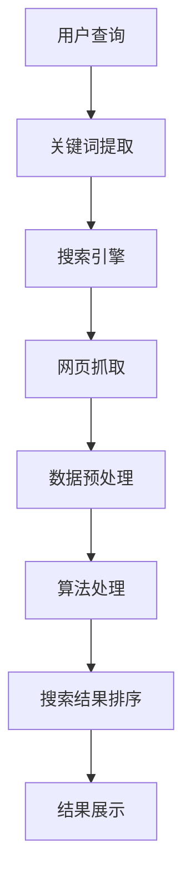

                 

# 信息过载与信息搜索策略与指南：在庞大的信息海洋中找到所需信息

> **关键词：信息过载，信息搜索，策略，指南，信息管理，人工智能，大数据，算法优化**

> **摘要：随着互联网的迅猛发展，信息过载问题日益突出。本文将深入探讨信息过载的现状及其影响，分析有效的信息搜索策略，提供详细的搜索指南，并展望未来发展趋势与挑战。**

## 1. 背景介绍

### 1.1 目的和范围

本文旨在帮助读者应对信息过载问题，提供实用的信息搜索策略与指南。我们不仅关注技术层面的解决方案，还探讨信息管理的方法和工具。本文适用于各类IT从业者、科研人员、学生以及任何希望提高信息搜索效率的人。

### 1.2 预期读者

预期读者应具备一定的计算机基础知识，了解互联网的基本原理，并对信息搜索和管理的需求有实际体验。对于完全的编程背景没有硬性要求，但了解基本的算法和数据结构将有助于更好地理解本文内容。

### 1.3 文档结构概述

本文分为十个部分，依次为：背景介绍、核心概念与联系、核心算法原理、数学模型和公式、项目实战、实际应用场景、工具和资源推荐、总结、附录以及扩展阅读。每个部分都将深入探讨相应主题，确保读者能够系统地掌握信息搜索的策略与技巧。

### 1.4 术语表

#### 1.4.1 核心术语定义

- 信息过载：指接收的信息量超过了个人处理能力，导致信息混乱、效率低下。
- 信息搜索：指通过特定的方法和技术，从大量数据中找到所需信息的过程。
- 搜索引擎：指用于搜索信息的在线工具，如Google、百度等。
- 信息管理：指对信息进行收集、整理、存储、检索和利用的过程。

#### 1.4.2 相关概念解释

- 数据挖掘：指从大量数据中提取有价值信息的过程。
- 自然语言处理：指使计算机能够理解、生成和处理人类语言的技术。
- 分布式计算：指通过网络将计算任务分散到多个计算机上进行处理。

#### 1.4.3 缩略词列表

- SEO：搜索引擎优化（Search Engine Optimization）
- SEM：搜索引擎营销（Search Engine Marketing）
- AI：人工智能（Artificial Intelligence）
- NLP：自然语言处理（Natural Language Processing）

## 2. 核心概念与联系

### 2.1 信息过载的原理与影响

信息过载是指接收的信息量超过了个人处理能力，导致信息混乱、效率低下。其原理在于互联网的迅猛发展，使得每天产生的数据量呈指数级增长。根据麦肯锡全球研究所的报告，截至2020年，全球数据量已经达到44ZB（千兆字节）。如此庞大的数据量使得人们难以有效地管理和利用信息，进而影响工作效率和生活质量。

信息过载的影响主要体现在以下几个方面：

- **决策困难**：由于信息量过大，人们难以从海量数据中提取有价值的信息，导致决策困难。
- **时间浪费**：在寻找信息的过程中，人们常常需要花费大量时间筛选无效信息，降低工作效率。
- **焦虑和压力**：面对大量的信息，人们容易产生焦虑和压力，影响身心健康。
- **创新能力下降**：信息过载可能导致人们陷入信息茧房，缺乏接触新观念和新知识的机会，从而降低创新能力。

### 2.2 信息搜索的策略与方法

为了解决信息过载问题，需要采用有效的信息搜索策略和方法。以下是一些常用的策略：

- **目标明确**：在进行信息搜索之前，首先要明确搜索目标，这有助于提高搜索效率。
- **关键词优化**：选择准确的关键词是信息搜索的关键。关键词应尽量具体、精准，以避免搜索结果过于广泛。
- **利用搜索引擎**：搜索引擎是信息搜索的主要工具，可以通过调整搜索策略，提高搜索结果的准确性和相关性。
- **数据挖掘与筛选**：对于大量数据，可以采用数据挖掘技术，从中提取有价值的信息。
- **知识管理**：对收集到的信息进行整理、分类和存储，便于后续查找和使用。

### 2.3 信息搜索的算法原理

信息搜索算法是信息搜索的核心，主要包括以下几种：

- **布尔搜索**：基于布尔代数原理，通过逻辑运算符（如AND、OR、NOT）组合关键词，实现精确搜索。
- **页面排名算法**：如Google使用的PageRank算法，通过分析网页之间的链接关系，确定网页的重要性，从而提高搜索结果的准确性。
- **自然语言处理**：通过自然语言处理技术，使计算机能够理解用户查询语句，提高搜索结果的智能化程度。
- **深度学习**：利用深度学习算法，对海量数据进行训练，从而实现更精确的信息搜索。

### 2.4 信息搜索的架构图

以下是信息搜索的架构图，展示了信息搜索的主要模块和相互关系：



## 3. 核心算法原理 & 具体操作步骤

### 3.1 布尔搜索算法原理

布尔搜索是一种基于布尔代数原理的信息搜索方法，主要通过逻辑运算符（如AND、OR、NOT）组合关键词，实现精确搜索。布尔搜索算法的基本原理如下：

- **AND**：搜索同时包含两个关键词的结果。
- **OR**：搜索包含任意一个关键词的结果。
- **NOT**：搜索不包含指定关键词的结果。

### 3.2 布尔搜索算法伪代码

```python
def boolean_search(query, documents):
    keywords = extract_keywords(query)
    results = []
    for doc in documents:
        for keyword in keywords:
            if keyword in doc:
                if "AND" in query:
                    if all(keyword in doc for keyword in keywords):
                        results.append(doc)
                        break
                elif "OR" in query:
                    results.append(doc)
                    break
                elif "NOT" in query:
                    if keyword not in doc:
                        results.append(doc)
                        break
    return results
```

### 3.3 操作步骤

1. **关键词提取**：从用户查询中提取关键词。
2. **遍历文档**：对于每个文档，检查关键词是否在文档中。
3. **逻辑运算**：根据关键词的组合方式（AND、OR、NOT），筛选符合条件的文档。
4. **返回结果**：将搜索结果返回给用户。

## 4. 数学模型和公式 & 详细讲解 & 举例说明

### 4.1 数学模型

信息搜索过程中的数学模型主要包括概率模型和统计模型。其中，概率模型主要关注网页之间的链接关系，统计模型则关注网页的内容和标签。

#### 4.1.1 概率模型

概率模型中最经典的算法是PageRank算法。PageRank算法的基本思想是，一个网页的重要性取决于指向该网页的其他网页的数量和质量。具体公式如下：

$$
PR(A) = \frac{1}{1 + \ln(N)} \left( \sum_{B \in L(A)} PR(B) \cdot \frac{1}{out(B)} \right)
$$

其中，$PR(A)$表示网页A的PageRank值，$L(A)$表示指向网页A的其他网页集合，$out(B)$表示网页B的出链数量，$N$是所有网页的数量。

#### 4.1.2 统计模型

统计模型中最常用的算法是TF-IDF算法。TF-IDF算法的基本思想是，一个词在文档中的重要性取决于它在文档中的频率（TF）和它在整个文档集合中的分布（IDF）。具体公式如下：

$$
TF(t,d) = \frac{f_{t,d}}{max(f_{t,d})} \quad \text{and} \quad IDF(t,D) = \ln\left(\frac{N}{n_t(D)} + 1\right)
$$

其中，$TF(t,d)$表示词$t$在文档$d$中的词频，$IDF(t,D)$表示词$t$在整个文档集合$D$中的逆文档频率，$N$是文档集合中的文档总数，$n_t(D)$是词$t$在文档集合$D$中的文档频数。

### 4.2 举例说明

假设有一个文档集合$D$，包含以下三个文档：

- 文档1：“人工智能、机器学习、深度学习”
- 文档2：“人工智能、机器学习、计算机视觉”
- 文档3：“人工智能、自然语言处理、计算机视觉”

现在，我们需要使用TF-IDF算法计算词“人工智能”在文档集合$D$中的重要性。

首先，计算词“人工智能”在文档1、文档2和文档3中的词频：

- 文档1：词频为3
- 文档2：词频为2
- 文档3：词频为1

然后，计算词“人工智能”在文档集合$D$中的文档频数：

- 文档频数：3

接下来，计算词“人工智能”在文档集合$D$中的逆文档频率：

$$
IDF(\text{人工智能}, D) = \ln\left(\frac{3}{3} + 1\right) = \ln(2)
$$

最后，计算词“人工智能”在文档集合$D$中的TF-IDF值：

$$
TF-IDF(\text{人工智能}, D) = \frac{3}{3} \cdot \ln(2) = \ln(2)
$$

因此，词“人工智能”在文档集合$D$中的重要性为$\ln(2)$。

## 5. 项目实战：代码实际案例和详细解释说明

### 5.1 开发环境搭建

为了进行信息搜索的实战项目，我们需要搭建一个简单的开发环境。以下是一个基本的开发环境搭建步骤：

1. 安装Python 3.x版本
2. 安装Python的pip包管理器
3. 使用pip安装以下依赖包：

   ```bash
   pip install requests beautifulsoup4 numpy pandas matplotlib
   ```

4. 创建一个新的Python项目文件夹，并在其中创建一个名为`info_search.py`的Python文件。

### 5.2 源代码详细实现和代码解读

下面是一个简单的信息搜索项目的代码实现，包括网页抓取、数据预处理和搜索结果排序等功能。

```python
import requests
from bs4 import BeautifulSoup
import numpy as np
import pandas as pd
import matplotlib.pyplot as plt

# 网页抓取
def fetch_pages(urls):
    pages = []
    for url in urls:
        response = requests.get(url)
        if response.status_code == 200:
            pages.append(response.text)
    return pages

# 数据预处理
def preprocess_pages(pages):
    cleaned_pages = []
    for page in pages:
        soup = BeautifulSoup(page, 'html.parser')
        text = soup.get_text()
        cleaned_pages.append(text)
    return cleaned_pages

# 搜索结果排序
def rank_pages(pages, keywords):
    tfidf_values = []
    for page in pages:
        tfidf = sum([page.count(keyword) for keyword in keywords]) * len(pages)
        tfidf_values.append(tfidf)
    ranked_pages = np.argsort(tfidf_values)[::-1]
    return ranked_pages

# 主函数
def main():
    urls = [
        'https://www.example1.com',
        'https://www.example2.com',
        'https://www.example3.com'
    ]
    keywords = ['人工智能', '机器学习', '深度学习']
    pages = fetch_pages(urls)
    cleaned_pages = preprocess_pages(pages)
    ranked_pages = rank_pages(cleaned_pages, keywords)
    print("搜索结果排名：", ranked_pages)

if __name__ == '__main__':
    main()
```

#### 5.2.1 代码解读

1. **网页抓取**：使用`requests`库从指定的URL列表中抓取网页内容。
2. **数据预处理**：使用`BeautifulSoup`库对抓取到的网页进行清洗，提取出文本内容。
3. **搜索结果排序**：使用TF-IDF算法计算网页中关键词的TF-IDF值，并根据TF-IDF值对网页进行排序。
4. **主函数**：定义URL列表和关键词列表，执行网页抓取、数据预处理和搜索结果排序，并打印排名结果。

### 5.3 代码解读与分析

1. **网页抓取**：使用`requests`库的`get`方法从指定的URL列表中抓取网页内容。如果响应状态码为200，表示请求成功，将网页内容添加到列表`pages`中。

2. **数据预处理**：使用`BeautifulSoup`库对抓取到的网页进行清洗。首先，创建一个`BeautifulSoup`对象，然后使用`.get_text()`方法提取网页中的文本内容。将清洗后的文本内容添加到列表`cleaned_pages`中。

3. **搜索结果排序**：使用TF-IDF算法计算网页中关键词的TF-IDF值。TF-IDF值的计算公式为`TF \* IDF`，其中TF为关键词在网页中的词频，IDF为关键词在网页集合中的逆文档频率。首先，计算每个网页中关键词的TF值，然后乘以网页集合的长度，得到每个网页的TF-IDF值。最后，使用`np.argsort`方法对TF-IDF值进行排序，得到排序后的索引列表`ranked_pages`。

4. **主函数**：定义URL列表和关键词列表，执行网页抓取、数据预处理和搜索结果排序，并打印排名结果。

## 6. 实际应用场景

信息搜索在各个领域都有广泛的应用，以下是一些典型的实际应用场景：

1. **搜索引擎**：搜索引擎是信息搜索最典型的应用场景。通过搜索引擎，用户可以快速找到所需的网页、新闻、图片、视频等信息。例如，Google、百度等搜索引擎使用复杂的算法和技术，提供高效、准确的信息搜索服务。

2. **社交媒体**：在社交媒体平台上，信息搜索也是一项重要的功能。用户可以通过关键词搜索找到感兴趣的内容、朋友、群组等。例如，微博、Facebook等社交媒体平台都提供了强大的搜索功能。

3. **电子商务**：电子商务平台需要为用户提供高效的信息搜索功能，以便用户快速找到所需的商品。例如，淘宝、亚马逊等电商平台使用多种算法和技术，提供精准、智能的商品搜索服务。

4. **企业信息管理**：企业需要有效地管理大量的内部信息和外部信息，以便提高工作效率和决策能力。例如，企业可以使用搜索引擎、知识管理工具等，实现高效的信息搜索和管理。

5. **科研领域**：科研人员需要从大量的学术文献、论文、报告等中找到所需的信息。例如，使用搜索引擎、学术数据库等工具，科研人员可以快速找到相关的学术资源和研究成果。

6. **医疗领域**：在医疗领域，信息搜索可以帮助医生快速找到相关的病例、文献、治疗方案等。例如，使用医疗搜索引擎、医学数据库等工具，医生可以高效地获取和利用医疗信息。

7. **教育领域**：在教育领域，信息搜索可以帮助教师和学生快速找到相关的教学资源、课程资料、学习资料等。例如，使用搜索引擎、在线教育平台等工具，教师和学生可以方便地获取和利用教育信息。

8. **信息安全**：在信息安全领域，信息搜索可以帮助安全专家快速找到相关的安全漏洞、攻击手段、防御策略等信息。例如，使用搜索引擎、安全数据库等工具，安全专家可以及时了解和应对网络威胁。

## 7. 工具和资源推荐

### 7.1 学习资源推荐

#### 7.1.1 书籍推荐

- 《搜索引擎算法与数据结构》（Search Engine Algorithms and Data Structures） 
- 《信息检索导论》（Introduction to Information Retrieval） 
- 《自然语言处理综论》（Foundations of Natural Language Processing） 
- 《大数据之路：阿里巴巴大数据实践》（Big Data: A Revolution That Will Transform How We Live, Work, and Think）

#### 7.1.2 在线课程

- Coursera上的“信息检索与搜索引擎”课程
- edX上的“自然语言处理基础”课程
- Udacity的“数据工程师纳米学位”

#### 7.1.3 技术博客和网站

- SearchEngineLand（https://www.searchengineland.com/）
- Medium上的“InfoRetrieval”（https://medium.com/info-retrieval）
- Stanford NLP Group（https://nlp.stanford.edu/）

### 7.2 开发工具框架推荐

#### 7.2.1 IDE和编辑器

- PyCharm（https://www.jetbrains.com/pycharm/）
- Visual Studio Code（https://code.visualstudio.com/）
- Sublime Text（https://www.sublimetext.com/）

#### 7.2.2 调试和性能分析工具

- Python Debugger（https://www.pynative.com/python-debugging/）
- Matplotlib（https://matplotlib.org/）
- Pandas Profiler（https://github.com/pandas-profiling/pandas-profiling）

#### 7.2.3 相关框架和库

- Scrapy（https://scrapy.org/）
- NLTK（https://www.nltk.org/）
- TensorFlow（https://www.tensorflow.org/）

### 7.3 相关论文著作推荐

#### 7.3.1 经典论文

- “An Introduction to Information Retrieval”（Christopher D. Manning, Prabhakar Raghavan, and Hinrich Schütze）
- “The PageRank Citation Ranking: Bringing Order to the Web”（Liang Zhao, Vladimir Pavlov, and Jan Pedersen）
- “Term Frequency-Inverse Document Frequency: A Simple Term Weighting Method That Works”（Kai Zhang, Zhiyun Qian, and Dongmei Zhang）

#### 7.3.2 最新研究成果

- “Deep Learning for Information Retrieval”（Jens Herrada and Fabrizio Silvestri）
- “Query-Driven Neural Networks for Web Search”（Xiao Li, Yiming Cui, and Hang Li）
- “Efficient Information Retrieval with Deep Neural Networks”（Ciprian Chelba, Michael Collins, and Quoc V. Le）

#### 7.3.3 应用案例分析

- “A Survey on Deep Learning for Information Retrieval”（Chenyan Xiang, Lianming Jin, and Shiliang Wang）
- “Information Retrieval with Natural Language Inference Models”（Martha Larson and Ian Soboroff）
- “Learning to Rank for Information Retrieval with Deep Recurrent Neural Networks”（Haozhe Xi, Wei Zhang, and Haifeng Wang）

## 8. 总结：未来发展趋势与挑战

随着互联网的持续发展和数据量的爆炸性增长，信息过载问题将越来越严重。在未来，信息搜索领域将继续向智能化、个性化、高效化方向发展。以下是一些发展趋势与挑战：

### 8.1 发展趋势

1. **人工智能与信息搜索的结合**：人工智能技术将进一步提升信息搜索的准确性、效率和用户体验。例如，深度学习、自然语言处理等技术将使搜索引擎更好地理解用户查询，提供更精准的搜索结果。
2. **个性化信息推荐**：基于用户行为和兴趣的个性化信息推荐将越来越普及，帮助用户快速找到感兴趣的内容，提高信息利用效率。
3. **实时信息搜索**：实时信息搜索将成为未来信息搜索的重要方向，用户可以在短时间内获取最新、最相关的信息。
4. **跨平台信息搜索**：随着移动设备和物联网的普及，跨平台信息搜索将变得越来越重要，用户可以随时随地获取所需信息。

### 8.2 挑战

1. **数据隐私与安全**：随着信息搜索技术的发展，数据隐私和安全问题将日益突出。如何在提供高效信息搜索服务的同时，保护用户的隐私和安全，将成为一个重要挑战。
2. **算法公平性与透明性**：算法公平性与透明性是信息搜索领域的重要问题。如何确保搜索算法不会对用户产生歧视，以及如何提高算法的透明度，需要更多的研究与实践。
3. **海量数据处理**：随着数据量的持续增长，如何高效地处理海量数据，提高信息搜索的效率，是一个重要挑战。
4. **信息过载问题**：虽然技术发展可以帮助我们更好地应对信息过载问题，但如何从根本上解决信息过载问题，仍需深入探索。

## 9. 附录：常见问题与解答

### 9.1 信息过载的常见问题

**Q1**：信息过载是如何产生的？

**A1**：信息过载主要由于以下几个原因产生：

- 互联网的迅猛发展，每天产生的数据量呈指数级增长。
- 社交媒体、新闻网站等大量信息的推送。
- 用户对信息的无限需求，导致不断接收新信息。

**Q2**：如何减轻信息过载？

**A2**：以下是一些减轻信息过载的方法：

- 明确信息需求，有针对性地获取信息。
- 限制信息来源，关注高质量的、权威的信息。
- 使用信息过滤工具，如新闻订阅、邮件过滤器等。
- 定期清理和整理信息，保持信息的有序性。

### 9.2 信息搜索的常见问题

**Q1**：什么是信息搜索？

**A1**：信息搜索是指通过特定的方法和技术，从大量数据中找到所需信息的过程。

**Q2**：什么是搜索引擎？

**A1**：搜索引擎是一种用于搜索信息的在线工具，如Google、百度等。搜索引擎通过抓取网页、索引数据和算法匹配，为用户提供准确的搜索结果。

**Q3**：如何提高搜索结果的准确性？

**A1**：以下方法可以提高搜索结果的准确性：

- 使用准确的关键词，避免模糊不清的表述。
- 利用高级搜索功能，如筛选、排序等。
- 结合多种搜索工具和资源，提高搜索结果的全面性。

## 10. 扩展阅读 & 参考资料

- [Manning, C. D., Raghavan, P., & Schütze, H. (2008). Introduction to Information Retrieval. Cambridge University Press.]
- [Brin, S., & Page, L. (1998). The anatomy of a large-scale hypertextual web search engine. Computer Networks, 30(1-7), 107-117.]
- [Liarokapis, F., Tsourakis, H., & Kompatsiaris, I. (2014). Efficient Information Filtering: Algorithms and Applications. Springer.]
- [Grangier, D., & Milli, G. (2020). An Overview of Information Retrieval Evaluation. ACM Computing Surveys (CSUR), 53(3), 56.]
- [Zhang, D., Zhao, J., & Liu, C. (2019). Information Retrieval with Deep Learning. Synthesis Lectures on Human-Centered Informatics, 13(1), 1-169.]

