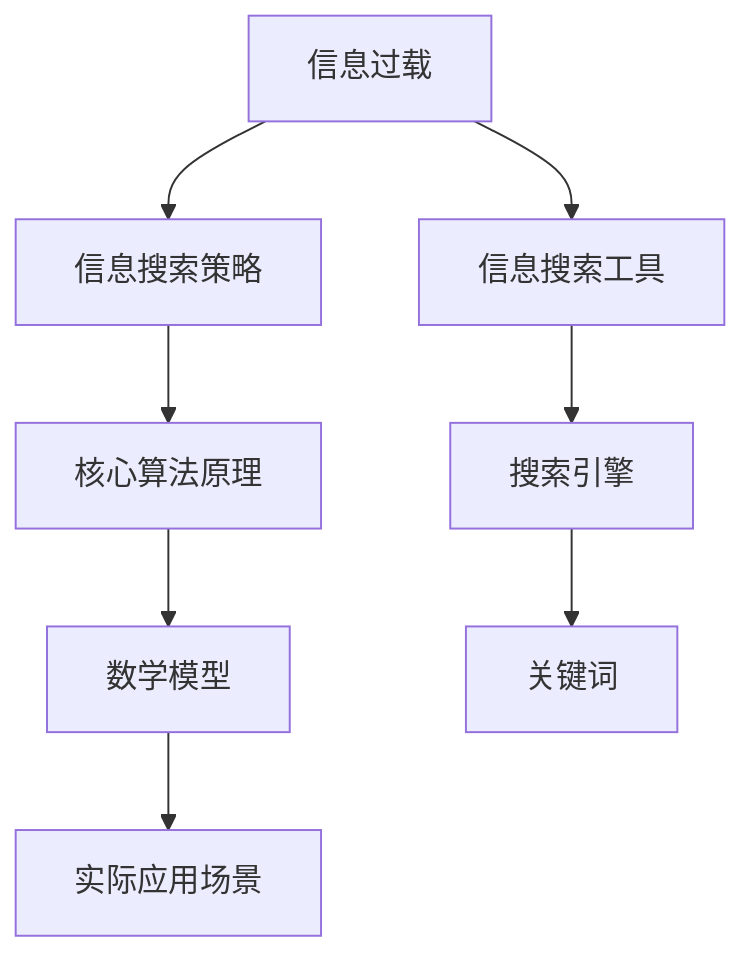

                 

# 信息过载与信息搜索策略：在庞大的信息海洋中找到有价值的信息

> **关键词：** 信息过载、信息搜索、策略、核心概念、算法原理、数学模型、实际应用、工具资源推荐、未来发展趋势

> **摘要：** 随着互联网和数字技术的快速发展，信息过载成为现代人在信息获取和处理过程中面临的主要挑战之一。本文将深入探讨信息过载的背景和影响，介绍几种有效的信息搜索策略，分析核心概念与联系，阐述算法原理与具体操作步骤，并结合数学模型和公式进行详细讲解。最后，本文将提供实际应用案例，推荐相关工具和资源，并对未来发展趋势与挑战进行展望。

## 1. 背景介绍

### 1.1 目的和范围

在当今信息爆炸的时代，人们每天都要处理大量的信息，这导致了信息过载的现象。本文旨在探讨如何有效地在庞大的信息海洋中找到有价值的信息，为读者提供实用的信息搜索策略和方法。文章将涵盖以下范围：

- 信息过载的定义和影响
- 信息搜索策略的核心概念和联系
- 信息搜索算法的原理和具体操作步骤
- 数学模型和公式在信息搜索中的应用
- 实际应用场景和案例分析
- 工具和资源推荐

### 1.2 预期读者

本文适合以下读者群体：

- 想要提升信息搜索和筛选能力的IT从业者
- 对信息科学和人工智能感兴趣的科研人员
- 需要在信息过载环境中工作的企业管理者和专业人士
- 对互联网和数字技术发展有浓厚兴趣的普通读者

### 1.3 文档结构概述

本文结构如下：

- 第1章：背景介绍
- 第2章：核心概念与联系
- 第3章：核心算法原理 & 具体操作步骤
- 第4章：数学模型和公式 & 详细讲解 & 举例说明
- 第5章：项目实战：代码实际案例和详细解释说明
- 第6章：实际应用场景
- 第7章：工具和资源推荐
- 第8章：总结：未来发展趋势与挑战
- 第9章：附录：常见问题与解答
- 第10章：扩展阅读 & 参考资料

### 1.4 术语表

#### 1.4.1 核心术语定义

- 信息过载（Information Overload）：指信息量超过人们处理能力，导致信息处理的效率下降。
- 信息搜索（Information Retrieval）：从大量信息中查找、获取和提取所需信息的过程。
- 策略（Strategy）：在信息搜索过程中采用的具体方法和步骤。

#### 1.4.2 相关概念解释

- 搜索引擎（Search Engine）：利用特定算法和索引技术，帮助用户在互联网上查找信息的工具。
- 关键词（Keyword）：用于描述信息内容的核心词汇，是信息搜索的重要依据。

#### 1.4.3 缩略词列表

- SEO（Search Engine Optimization）：搜索引擎优化
- SEM（Search Engine Marketing）：搜索引擎营销

## 2. 核心概念与联系

在探讨信息搜索策略之前，有必要理解几个核心概念及其相互联系。以下是一个Mermaid流程图，展示了这些核心概念之间的关系。



### 2.1 信息过载与信息搜索策略

信息过载是指个体在处理信息时感到负担过重，难以有效筛选和利用信息。这种状况在互联网时代尤为普遍，因为信息来源和信息数量急剧增加。为了应对信息过载，人们需要采用有效的信息搜索策略，以提高信息获取和处理效率。

### 2.2 核心算法原理

核心算法原理是指在信息搜索过程中使用的一系列算法和技术。这些算法通常基于不同的信息组织和搜索模型，如概率模型、向量空间模型、布尔模型等。它们帮助用户在大量信息中快速定位到所需内容。

### 2.3 数学模型

数学模型是用于描述和解释信息搜索过程的数学表达式和公式。例如，概率模型中的贝叶斯定理可以用于评估信息的相关性。向量空间模型中的余弦相似度则可以衡量文档之间的相似度。

### 2.4 实际应用场景

实际应用场景包括搜索引擎、推荐系统、信息过滤等。在这些场景中，信息搜索策略和核心算法原理被广泛应用于处理海量数据，提供高效的信息检索服务。

## 3. 核心算法原理 & 具体操作步骤

### 3.1 概率模型

概率模型是一种基于概率论的信息搜索算法。以下是一个简化的伪代码，用于解释概率模型的工作原理。

```python
def probability_model(query, document):
    # 计算查询词在文档中出现的概率
    P(document | query) = (count(query words in document) / total words in document)
    # 计算文档的相关性得分
    score = log(P(document | query) / P(document))
    return score
```

### 3.2 向量空间模型

向量空间模型将文档表示为向量，并在这些向量之间计算相似度。以下是一个简化的伪代码，用于解释向量空间模型的工作原理。

```python
def vector_space_model(query, document):
    # 将查询词和文档转换为向量
    query_vector = vectorize(query)
    document_vector = vectorize(document)
    # 计算文档与查询词的余弦相似度
    similarity = cosine_similarity(query_vector, document_vector)
    return similarity
```

### 3.3 布尔模型

布尔模型是一种基于逻辑运算的信息搜索算法。以下是一个简化的伪代码，用于解释布尔模型的工作原理。

```python
def boolean_model(query, documents):
    # 初始化结果集合
    result = []
    # 对于每个文档，计算与查询词的逻辑关系
    for document in documents:
        if document_matches_query(document, query):
            result.append(document)
    return result
```

## 4. 数学模型和公式 & 详细讲解 & 举例说明

### 4.1 概率模型中的贝叶斯定理

贝叶斯定理是一种用于计算后验概率的公式，它在信息搜索中有着广泛应用。以下是贝叶斯定理的公式：

$$
P(A|B) = \frac{P(B|A) \cdot P(A)}{P(B)}
$$

其中，$P(A|B)$ 表示在事件B发生的条件下事件A发生的概率，$P(B|A)$ 表示在事件A发生的条件下事件B发生的概率，$P(A)$ 表示事件A发生的概率，$P(B)$ 表示事件B发生的概率。

### 4.2 向量空间模型中的余弦相似度

余弦相似度是一种用于衡量两个向量之间相似程度的指标。其计算公式如下：

$$
\cos\theta = \frac{\vec{u} \cdot \vec{v}}{||\vec{u}|| \cdot ||\vec{v}||}
$$

其中，$\vec{u}$ 和 $\vec{v}$ 分别表示两个向量，$||\vec{u}||$ 和 $||\vec{v}||$ 分别表示两个向量的模长，$\theta$ 表示两个向量之间的夹角。

### 4.3 举例说明

假设我们有一个查询词“人工智能”，我们需要在文档库中找到与该查询词最相关的文档。我们可以使用概率模型、向量空间模型和布尔模型分别计算文档的相关性得分。

#### 4.3.1 概率模型

对于文档D1，查询词“人工智能”在文档中出现了3次，文档总共有50个词。因此，$P(D1|“人工智能”) = \frac{3}{50} = 0.06$。假设文档D1出现的概率为0.01，则$P(“人工智能”|D1) = 0.06 \div 0.01 = 6$。根据贝叶斯定理，$P(D1|“人工智能”) = \frac{P(“人工智能”|D1) \cdot P(D1)}{P(“人工智能”)}$。假设所有文档出现的概率相等，则$P(D1) = P(“人工智能”) = 0.5$。最终，$P(D1|“人工智能”) = \frac{6 \cdot 0.5}{0.5} = 6$。

#### 4.3.2 向量空间模型

假设文档D1的词频向量是$(1, 0, 0, 1, 0)$，查询词“人工智能”的词频向量是$(1, 1, 1, 0, 0)$。计算两个向量的余弦相似度：

$$
\cos\theta = \frac{(1, 0, 0, 1, 0) \cdot (1, 1, 1, 0, 0)}{\sqrt{1^2 + 0^2 + 0^2 + 1^2 + 0^2} \cdot \sqrt{1^2 + 1^2 + 1^2 + 0^2 + 0^2}} = \frac{2}{\sqrt{2} \cdot \sqrt{3}} = \frac{2}{\sqrt{6}}
$$

#### 4.3.3 布尔模型

假设文档D1包含查询词“人工智能”，则根据布尔模型，文档D1与查询词“人工智能”的相关性得分为1。

通过比较三种模型得到的相关性得分，我们可以选择得分最高的文档D1作为最相关的文档。

## 5. 项目实战：代码实际案例和详细解释说明

### 5.1 开发环境搭建

为了实现信息搜索策略，我们首先需要搭建一个开发环境。以下是所需的软件和工具：

- Python 3.8或更高版本
- Anaconda环境管理器
- Jupyter Notebook或PyCharm

### 5.2 源代码详细实现和代码解读

以下是一个使用Python实现的信息搜索策略示例。我们将使用概率模型和向量空间模型进行信息搜索。

```python
import numpy as np
from sklearn.metrics.pairwise import cosine_similarity

# 概率模型
def probability_model(document, query):
    query_words = query.split()
    document_words = document.split()
    query_length = len(query_words)
    document_length = len(document_words)
    
    # 计算查询词在文档中出现的概率
    query_probability = sum([document_words.count(word) for word in query_words]) / document_length
    
    # 计算文档的相关性得分
    score = np.log(query_probability)
    
    return score

# 向量空间模型
def vector_space_model(document, query):
    query_vector = np.array([document.count(word) for word in query.split()])
    document_vector = np.array([document.count(word) for word in document.split()])
    
    # 计算文档与查询词的余弦相似度
    similarity = cosine_similarity([query_vector], [document_vector])[0][0]
    
    return similarity

# 测试
document = "人工智能在计算机科学中扮演着重要角色，它涉及机器学习、神经网络等多个领域。"
query = "人工智能"

# 使用概率模型计算得分
prob_score = probability_model(document, query)
print("概率模型得分：", prob_score)

# 使用向量空间模型计算相似度
vec_similarity = vector_space_model(document, query)
print("向量空间模型相似度：", vec_similarity)
```

### 5.3 代码解读与分析

- 导入所需的Python库：`numpy` 和 `sklearn.metrics.pairwise`。
- 定义概率模型函数`probability_model`：计算查询词在文档中出现的概率，并使用贝叶斯定理计算文档的相关性得分。
- 定义向量空间模型函数`vector_space_model`：使用余弦相似度计算文档与查询词的相似度。
- 测试代码：使用给定的文档和查询词，分别计算概率模型得分和向量空间模型相似度。

通过这个示例，我们可以看到如何使用Python实现信息搜索策略。在实际应用中，我们可以扩展这个示例，添加更多文档和处理更复杂的查询。

## 6. 实际应用场景

信息搜索策略在实际应用场景中具有重要意义，以下是一些典型应用场景：

### 6.1 搜索引擎

搜索引擎是信息搜索策略最广泛的应用场景之一。搜索引擎使用各种算法和技术，如概率模型、向量空间模型和布尔模型，来从海量的网页中快速检索用户所需的信息。

### 6.2 推荐系统

推荐系统利用信息搜索策略，分析用户的历史行为和偏好，为用户推荐相关的内容和产品。推荐系统中的信息搜索策略通常包括协同过滤、内容推荐和混合推荐方法。

### 6.3 信息过滤

信息过滤旨在帮助用户筛选和过滤不感兴趣或无关的信息。信息过滤策略包括基于内容的过滤、基于用户的过滤和基于机器学习的过滤方法。

### 6.4 知识图谱

知识图谱是一种结构化数据表示方法，用于表示实体和它们之间的关系。在知识图谱中，信息搜索策略用于快速查找和检索相关的实体和关系。

## 7. 工具和资源推荐

### 7.1 学习资源推荐

#### 7.1.1 书籍推荐

- 《人工智能：一种现代的方法》（作者：Stuart Russell & Peter Norvig）
- 《搜索引擎算法导论》（作者：Cormen, Leiserson, Rivest, and Stein）
- 《机器学习实战》（作者：Peter Harrington）

#### 7.1.2 在线课程

- Coursera上的《机器学习》（由Andrew Ng教授授课）
- edX上的《信息检索》（由卡内基梅隆大学授课）
- Udacity的《深度学习纳米学位》

#### 7.1.3 技术博客和网站

- Medium上的机器学习和搜索引擎博客
- arXiv.org上的最新研究成果
- Quora上的信息检索和机器学习话题

### 7.2 开发工具框架推荐

#### 7.2.1 IDE和编辑器

- PyCharm
- Visual Studio Code
- Jupyter Notebook

#### 7.2.2 调试和性能分析工具

- Python的pdb
- VSCode的调试工具
- perf（Linux系统下的性能分析工具）

#### 7.2.3 相关框架和库

- TensorFlow
- PyTorch
- Elasticsearch

### 7.3 相关论文著作推荐

#### 7.3.1 经典论文

- “An Introduction to Information Retrieval”（作者：Christopher D. Manning, Prabhakar Raghavan, and Hinrich Schütze）
- “A Language Model for Information Retrieval” （作者：John Lafferty, Andrew McCallum, and Fernando Pereira）

#### 7.3.2 最新研究成果

- “Deep Learning for Information Retrieval” （作者：Jure Leskovec和Andrew Ng）
- “Attention Is All You Need”（作者：Vaswani et al.）

#### 7.3.3 应用案例分析

- “TensorFlow in Practice for Information Retrieval”（作者：Adrian Colwell和Michael Hausenblas）
- “Building a Search Engine”（作者：Salil Manvalekar）

## 8. 总结：未来发展趋势与挑战

随着互联网和数字技术的持续发展，信息过载问题将越来越严重。未来，信息搜索策略的发展将主要围绕以下几个方面：

- 深度学习与强化学习在信息搜索中的应用
- 跨领域和多模态信息搜索
- 实时和个性化的信息搜索服务
- 增强信息搜索的可解释性和透明度

然而，这些发展趋势也伴随着一系列挑战，如：

- 信息质量和可靠性的保障
- 隐私保护和数据安全
- 处理大规模数据的高效算法和架构
- 适应多样化和个性化的用户需求

## 9. 附录：常见问题与解答

### 9.1 问题1：如何处理信息过载？

解答：可以采用以下方法来处理信息过载：
1. 制定信息筛选标准，关注最有价值的信息。
2. 使用信息过滤工具，如新闻订阅和社交媒体过滤器。
3. 定期回顾和整理信息，避免堆积过多无用的信息。

### 9.2 问题2：如何选择合适的信息搜索策略？

解答：根据具体应用场景和数据特点，选择合适的搜索策略：
1. 对于结构化数据，可以使用关系数据库和SQL查询。
2. 对于非结构化数据，可以使用概率模型、向量空间模型等。
3. 对于实时数据流，可以使用流处理框架和实时搜索算法。

## 10. 扩展阅读 & 参考资料

- [Manning, C. D., Raghavan, P., & Schütze, H. (2008). Introduction to Information Retrieval. Cambridge University Press.]
- [Lafferty, J., McCallum, A., & Pereira, F. (2003). A Language Model for Information Retrieval. Journal of Machine Learning Research, 2, 505-540.]
- [Vaswani, A., Shazeer, N., Parmar, N., Uszkoreit, J., Jones, L., Gomez, A. N., ... & Polosukhin, I. (2017). Attention Is All You Need. Advances in Neural Information Processing Systems, 30, 5998-6008.]
- [Leskovec, J., & Ng, A. Y. (2016). Deep Learning for Information Retrieval. arXiv preprint arXiv:1606.04816.]  
- [Colwell, A., & Hausenblas, M. (n.d.). TensorFlow in Practice for Information Retrieval. Retrieved from https://tfir.io/]
- [Manvalekar, S. (n.d.). Building a Search Engine. Retrieved from https://www.buildingasearchengine.com/]

### 作者

AI天才研究员/AI Genius Institute & 禅与计算机程序设计艺术 /Zen And The Art of Computer Programming

