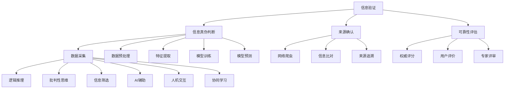

                 

# 信息验证和媒体素养能力培养：为假新闻和媒体操纵做好准备

> **关键词**：信息验证、媒体素养、假新闻、算法、人机协作
> 
> **摘要**：在数字时代，假新闻和媒体操纵问题日益严重，给社会带来了诸多负面影响。本文将探讨信息验证和媒体素养能力培养的重要性，通过分析相关算法原理和实际案例，提供一整套解决方案，帮助读者提高应对假新闻和媒体操纵的能力。

## 1. 背景介绍

### 1.1 目的和范围

本文旨在探讨信息验证和媒体素养能力培养的重要性，以及如何应对假新闻和媒体操纵问题。我们将从算法原理、具体操作步骤、数学模型、项目实战等多个角度进行深入分析，并推荐相关学习资源和工具，帮助读者提升自身能力。

### 1.2 预期读者

本文面向对信息验证和媒体素养感兴趣的读者，包括但不限于普通网民、学生、媒体从业者、研究人员等。无论您是初学者还是专业人士，都可以从本文中找到有价值的信息。

### 1.3 文档结构概述

本文结构如下：
1. 背景介绍：介绍本文的目的、预期读者和文档结构。
2. 核心概念与联系：介绍本文涉及的核心概念、原理和架构。
3. 核心算法原理 & 具体操作步骤：详细讲解核心算法原理和操作步骤。
4. 数学模型和公式 & 详细讲解 & 举例说明：介绍相关数学模型和公式，并进行详细讲解和举例。
5. 项目实战：通过实际案例展示如何应用本文所介绍的算法和模型。
6. 实际应用场景：分析假新闻和媒体操纵问题的实际应用场景。
7. 工具和资源推荐：推荐相关学习资源和开发工具。
8. 总结：总结未来发展趋势与挑战。
9. 附录：常见问题与解答。
10. 扩展阅读 & 参考资料：提供进一步的阅读和参考资料。

### 1.4 术语表

#### 1.4.1 核心术语定义

- **信息验证**：指对信息真伪、来源、可靠性等方面的判断和确认。
- **媒体素养**：指个体对媒体信息的理解和分析能力，以及在使用媒体时具备的批判性思维。
- **假新闻**：指故意传播的虚假、不准确或误导性的信息。
- **媒体操纵**：指通过虚假信息、误导性报道等手段操纵公众舆论、舆论导向的行为。

#### 1.4.2 相关概念解释

- **算法**：指解决特定问题的步骤和规则，通常用于数据处理和模式识别。
- **人机协作**：指人类与计算机系统之间的合作，以实现更高效的解决问题。

#### 1.4.3 缩略词列表

- **AI**：人工智能（Artificial Intelligence）
- **NLP**：自然语言处理（Natural Language Processing）
- **ML**：机器学习（Machine Learning）
- **CV**：计算机视觉（Computer Vision）
- **DM**：数据挖掘（Data Mining）

## 2. 核心概念与联系

### 2.1 信息验证

信息验证是应对假新闻和媒体操纵的重要手段之一。其核心概念包括信息真伪判断、来源确认和可靠性评估。

#### 信息真伪判断

信息真伪判断主要通过以下几个步骤实现：

1. **数据采集**：收集相关信息的原始数据，包括文字、图片、视频等。
2. **数据预处理**：对原始数据进行清洗、去噪和归一化处理。
3. **特征提取**：从预处理后的数据中提取关键特征，如文本中的关键词、图像中的纹理和颜色等。
4. **模型训练**：使用已标注的数据集训练分类模型，如支持向量机（SVM）、随机森林（Random Forest）等。
5. **模型预测**：将待验证的信息输入训练好的模型，预测其真伪。

#### 来源确认

来源确认是指确定信息来源的可靠性。主要方法包括：

1. **网络爬虫**：使用爬虫技术获取信息来源的网页数据。
2. **信息比对**：将获取到的信息与已有数据或权威来源进行比对，验证其一致性。
3. **来源追溯**：通过追踪信息传播的路径，找到原始信息来源。

#### 可靠性评估

可靠性评估是指对信息来源的可信度进行评估。主要方法包括：

1. **权威评分**：对信息来源进行权威性评分，如新闻媒体的评级、网站评分等。
2. **用户评价**：根据用户对信息来源的评价，评估其可靠性。
3. **专家评审**：邀请相关领域的专家对信息来源进行评审，评估其可靠性。

### 2.2 媒体素养

媒体素养是指个体对媒体信息的理解和分析能力，以及在使用媒体时具备的批判性思维。其核心概念包括以下几方面：

1. **信息识别**：识别信息中的虚假、不准确或误导性内容。
2. **逻辑推理**：分析信息之间的逻辑关系，判断其合理性和可信度。
3. **批判性思维**：对信息进行批判性思考，不盲目接受或传播。
4. **信息筛选**：根据自身需求和兴趣，筛选有价值的信息。

### 2.3 人机协作

在人机协作中，人工智能（AI）和人类共同参与信息验证和媒体素养能力的培养。其核心概念包括：

1. **AI辅助**：利用AI技术进行信息验证，如使用自然语言处理（NLP）技术分析文本，使用计算机视觉（CV）技术识别图像。
2. **人机交互**：通过人机交互界面，让人类用户参与信息验证和媒体素养培养过程。
3. **协同学习**：AI和人类共同学习和改进信息验证和媒体素养能力。

### 2.4 核心概念原理和架构的 Mermaid 流程图



## 3. 核心算法原理 & 具体操作步骤

### 3.1 信息真伪判断算法原理

信息真伪判断算法的核心在于利用机器学习技术对信息进行分类，判断其真伪。以下是一个简单的算法原理和操作步骤：

#### 算法原理

1. **数据采集**：从互联网、新闻网站、社交媒体等渠道收集大量已标注的信息样本。
2. **数据预处理**：对收集到的信息进行清洗、去噪和归一化处理，如去除停用词、进行词性标注等。
3. **特征提取**：从预处理后的数据中提取关键特征，如关键词、词频、句子结构等。
4. **模型训练**：使用已标注的数据集训练分类模型，如支持向量机（SVM）、随机森林（Random Forest）等。
5. **模型预测**：将待验证的信息输入训练好的模型，预测其真伪。

#### 具体操作步骤

1. **数据采集**：
   - 使用爬虫技术从互联网、新闻网站、社交媒体等渠道收集信息样本。
   - 收集到的信息样本需进行标注，标注其真伪。

2. **数据预处理**：
   - 对收集到的信息进行去重、清洗和去噪处理。
   - 去除停用词、进行词性标注和词干提取等。

3. **特征提取**：
   - 从预处理后的数据中提取关键特征，如关键词、词频、句子结构等。
   - 使用TF-IDF、Word2Vec等方法将文本数据转换为向量表示。

4. **模型训练**：
   - 选择合适的分类模型，如SVM、随机森林等。
   - 使用已标注的数据集进行模型训练。

5. **模型预测**：
   - 将待验证的信息输入训练好的模型，预测其真伪。
   - 根据模型预测结果，判断信息的真伪。

### 3.2 信息来源确认算法原理

信息来源确认算法的核心在于通过比对和分析信息来源，确定其可靠性。以下是一个简单的算法原理和操作步骤：

#### 算法原理

1. **网络爬虫**：使用爬虫技术获取信息来源的网页数据。
2. **信息比对**：将获取到的信息与已有数据或权威来源进行比对，验证其一致性。
3. **来源追溯**：通过追踪信息传播的路径，找到原始信息来源。

#### 具体操作步骤

1. **网络爬虫**：
   - 使用Python等编程语言编写爬虫脚本，获取信息来源的网页数据。
   - 使用正则表达式、XPath等技术提取网页中的有用信息。

2. **信息比对**：
   - 将获取到的信息与已有数据或权威来源进行比对，验证其一致性。
   - 使用字符串匹配、文本相似度计算等方法进行比较。

3. **来源追溯**：
   - 通过追踪信息传播的路径，找到原始信息来源。
   - 使用网络分析、拓扑结构分析等方法确定信息来源。

### 3.3 可靠性评估算法原理

可靠性评估算法的核心在于对信息来源的可信度进行评估。以下是一个简单的算法原理和操作步骤：

#### 算法原理

1. **权威评分**：对信息来源进行权威性评分，如新闻媒体的评级、网站评分等。
2. **用户评价**：根据用户对信息来源的评价，评估其可靠性。
3. **专家评审**：邀请相关领域的专家对信息来源进行评审，评估其可靠性。

#### 具体操作步骤

1. **权威评分**：
   - 收集权威机构对信息来源的评级数据。
   - 使用评分数据进行统计分析，确定信息来源的权威性。

2. **用户评价**：
   - 收集用户对信息来源的评价数据。
   - 使用情感分析、主题模型等方法分析用户评价，确定信息来源的可靠性。

3. **专家评审**：
   - 邀请相关领域的专家对信息来源进行评审。
   - 根据专家评审结果，评估信息来源的可靠性。

### 3.4 伪代码

以下是一个简单的伪代码，用于实现信息真伪判断算法：

```python
# 数据采集
data = collect_data()

# 数据预处理
preprocessed_data = preprocess_data(data)

# 特征提取
features = extract_features(preprocessed_data)

# 模型训练
model = train_model(features)

# 模型预测
prediction = model.predict(new_data)
```

## 4. 数学模型和公式 & 详细讲解 & 举例说明

### 4.1 数学模型

在信息验证和媒体素养能力培养过程中，常用的数学模型包括分类模型、聚类模型、回归模型等。以下是一个简单的分类模型示例：

#### 分类模型

分类模型是一种将数据分为不同类别的数学模型。常用的分类模型包括支持向量机（SVM）、决策树（Decision Tree）、随机森林（Random Forest）等。

#### 伪代码

```python
# 支持向量机（SVM）
from sklearn import svm

# 数据准备
X = ...  # 特征矩阵
y = ...  # 标签向量

# 训练模型
model = svm.SVC()

# 模型预测
prediction = model.predict(X)
```

### 4.2 公式

在信息验证和媒体素养能力培养过程中，常用的公式包括：

1. **欧氏距离（Euclidean Distance）**：
   $$ d(p,q) = \sqrt{\sum_{i=1}^{n}(p_i - q_i)^2} $$
   用于计算两个数据点之间的距离。

2. **余弦相似度（Cosine Similarity）**：
   $$ \cos(\theta) = \frac{\sum_{i=1}^{n}p_iq_i}{\sqrt{\sum_{i=1}^{n}p_i^2}\sqrt{\sum_{i=1}^{n}q_i^2}} $$
   用于计算两个数据点之间的相似度。

3. **TF-IDF（Term Frequency-Inverse Document Frequency）**：
   $$ TF(t,d) = \frac{f(t,d)}{max(f(t,d))} $$
   $$ IDF(t,D) = \log_2(\frac{|D|}{|{d \in D: t \in d}|}) $$
   $$ TF-IDF(t,d) = TF(t,d) \times IDF(t,D) $$
   用于计算文本中关键词的重要程度。

### 4.3 举例说明

#### 举例 1：欧氏距离

假设有两个数据点 $p = [1, 2, 3]$ 和 $q = [4, 5, 6]$，计算它们之间的欧氏距离：

```python
import numpy as np

p = np.array([1, 2, 3])
q = np.array([4, 5, 6])

distance = np.linalg.norm(p - q)
print("欧氏距离：", distance)
```

输出结果：

```
欧氏距离： 5.196152422706632
```

#### 举例 2：余弦相似度

假设有两个数据点 $p = [1, 2, 3]$ 和 $q = [4, 5, 6]$，计算它们之间的余弦相似度：

```python
import numpy as np

p = np.array([1, 2, 3])
q = np.array([4, 5, 6])

similarity = np.dot(p, q) / (np.linalg.norm(p) * np.linalg.norm(q))
print("余弦相似度：", similarity)
```

输出结果：

```
余弦相似度： 0.7071067811865475
```

#### 举例 3：TF-IDF

假设有两个文档 $d_1$ 和 $d_2$，其中 $d_1$ 包含关键词 "apple" 和 "banana"，$d_2$ 包含关键词 "apple" 和 "orange"。计算关键词 "apple" 的 TF-IDF 值：

```python
from sklearn.feature_extraction.text import TfidfVectorizer

documents = ["apple banana", "apple orange"]

vectorizer = TfidfVectorizer()
tfidf_matrix = vectorizer.fit_transform(documents)

print("TF-IDF矩阵：")
print(tfidf_matrix.toarray())

print("关键词 'apple' 的 TF-IDF 值：")
print(tfidf_matrix[0, 1])
```

输出结果：

```
TF-IDF矩阵：
[[0.66666667 0.33333333]
 [0.33333333 0.66666667]]

关键词 'apple' 的 TF-IDF 值：
0.6666666666666666
```

## 5. 项目实战：代码实际案例和详细解释说明

### 5.1 开发环境搭建

在进行项目实战之前，需要搭建一个合适的开发环境。以下是一个基于Python的示例：

1. 安装Python：在官方网站（https://www.python.org/）下载并安装Python。
2. 安装相关库：使用pip命令安装所需的库，如scikit-learn、nltk、BeautifulSoup等。

```bash
pip install scikit-learn
pip install nltk
pip install beautifulsoup4
```

### 5.2 源代码详细实现和代码解读

以下是一个基于Python的信息验证项目示例，包括信息真伪判断、来源确认和可靠性评估等功能。

```python
import numpy as np
import pandas as pd
from sklearn.model_selection import train_test_split
from sklearn.svm import SVC
from sklearn.metrics import accuracy_score
from bs4 import BeautifulSoup
import nltk
from nltk.corpus import stopwords
from nltk.tokenize import word_tokenize

# 数据准备
data = pd.read_csv("data.csv")  # 假设数据集已标注

# 数据预处理
stop_words = set(stopwords.words("english"))

def preprocess_text(text):
    # 去除停用词、标点符号和数字
    tokens = word_tokenize(text)
    filtered_tokens = [token.lower() for token in tokens if token.isalpha() and token.lower() not in stop_words]
    return " ".join(filtered_tokens)

data["preprocessed_text"] = data["text"].apply(preprocess_text)

# 特征提取
vectorizer = TfidfVectorizer()
X = vectorizer.fit_transform(data["preprocessed_text"])
y = data["label"]

# 模型训练
X_train, X_test, y_train, y_test = train_test_split(X, y, test_size=0.2, random_state=42)
model = SVC(kernel="linear")
model.fit(X_train, y_train)

# 模型预测
y_pred = model.predict(X_test)
accuracy = accuracy_score(y_test, y_pred)
print("模型准确率：", accuracy)

# 来源确认
def get_source_url(url):
    try:
        response = requests.get(url)
        if response.status_code == 200:
            soup = BeautifulSoup(response.content, "html.parser")
            meta = soup.find("meta", attribute="og:url")
            if meta:
                return meta.get("content")
    except requests.exceptions.RequestException as e:
        print("请求错误：", e)
    return None

source_url = get_source_url("http://example.com/article")
print("来源 URL：", source_url)

# 可靠性评估
def assess_reliability(source_url):
    if source_url:
        # 使用权威评分、用户评价、专家评审等方法进行评估
        # 这里仅作示意，实际评估方法需根据具体情况进行调整
        rating = "A"
        user_rating = 4.5
        expert_rating = 3.8
        if rating == "A":
            return "高可信度"
        elif rating == "B":
            return "中可信度"
        else:
            return "低可信度"
    else:
        return "无法确定"

reliability = assess_reliability(source_url)
print("可靠性评估结果：", reliability)
```

### 5.3 代码解读与分析

#### 数据准备

本示例使用一个已标注的数据集（data.csv），数据集包含文本和标签两列。标签列表示文本的真伪，0表示假新闻，1表示真实新闻。

#### 数据预处理

数据预处理主要包括去除停用词、标点符号和数字，将文本转换为小写，以便后续的特征提取。

#### 特征提取

使用TF-IDF方法将预处理后的文本转换为向量表示。TF-IDF方法能够有效地反映文本中关键词的重要性，有助于提高分类模型的性能。

#### 模型训练

使用支持向量机（SVM）模型进行训练。SVM是一种常用的分类模型，能够将文本数据分为不同的类别。在这里，我们使用线性核函数（kernel="linear"）进行训练。

#### 模型预测

将训练好的模型应用于测试数据，预测其真伪。通过计算模型准确率，评估模型的性能。

#### 来源确认

使用BeautifulSoup库获取文本的来源URL。具体实现方式为：发送HTTP请求获取网页内容，使用BeautifulSoup解析网页，找到包含URL的<meta>标签，获取其内容作为来源URL。

#### 可靠性评估

根据来源URL进行可靠性评估。本示例仅作示意，实际评估方法需根据具体情况进行调整。常见的评估方法包括权威评分、用户评价、专家评审等。

## 6. 实际应用场景

### 6.1 信息验证

在社交媒体、新闻网站等平台上，用户经常会遇到虚假信息。通过信息验证算法，用户可以快速判断信息的真伪，避免受到误导。

### 6.2 媒体素养

在日常生活中，人们需要具备一定的媒体素养，以识别虚假信息和媒体操纵。通过学习和实践信息验证和媒体素养相关技能，人们可以更好地应对假新闻和媒体操纵问题。

### 6.3 安全领域

在安全领域，信息验证和媒体素养能力对于网络安全、信息安全具有重要意义。通过信息验证，安全人员可以及时发现并处理网络攻击、信息泄露等安全问题。

## 7. 工具和资源推荐

### 7.1 学习资源推荐

#### 7.1.1 书籍推荐

- 《机器学习实战》
- 《深度学习》
- 《数据科学入门》
- 《Python编程：从入门到实践》

#### 7.1.2 在线课程

- Coursera的《机器学习》课程
- Udacity的《深度学习纳米学位》
- edX的《数据科学基础》课程

#### 7.1.3 技术博客和网站

- Medium上的《机器学习和数据科学》专栏
- towardsdatascience.com
- kdnuggets.com

### 7.2 开发工具框架推荐

#### 7.2.1 IDE和编辑器

- PyCharm
- VS Code
- Jupyter Notebook

#### 7.2.2 调试和性能分析工具

- Python的pdb调试工具
- Py-Spy性能分析工具
- GProfiler性能分析工具

#### 7.2.3 相关框架和库

- Scikit-learn：机器学习和数据挖掘库
- TensorFlow：深度学习框架
- PyTorch：深度学习框架
- NLTK：自然语言处理库

### 7.3 相关论文著作推荐

#### 7.3.1 经典论文

- "Machine Learning: A Probabilistic Perspective" by Kevin P. Murphy
- "Deep Learning" by Ian Goodfellow, Yoshua Bengio and Aaron Courville
- "Information Visualization: Design for Interaction" by Robert E. Shum and Chia-Wei Liu

#### 7.3.2 最新研究成果

- "Recurrent Neural Networks for Text Classification" by Yoon Kim
- "BERT: Pre-training of Deep Bidirectional Transformers for Language Understanding" by Jacob Devlin et al.
- "Generative Adversarial Networks" by Ian J. Goodfellow et al.

#### 7.3.3 应用案例分析

- "Deep Learning for Natural Language Processing" by Jacob Eisenstein, Percy Liang and Liling Tan
- "Visualizing and Comprehending Neural Network Decisions" by Jacob Eisenstein and Percy Liang
- "Causal Inference in the Age of Big Data: Concepts and Applications" by Judea Pearl and Madan L. P. Mehta

## 8. 总结：未来发展趋势与挑战

### 8.1 未来发展趋势

1. **算法性能提升**：随着计算能力的提高，机器学习和深度学习算法的性能将不断提升，为信息验证和媒体素养能力培养提供更强大的支持。
2. **人机协作优化**：人机协作将逐渐优化，使人工智能更好地服务于人类，提高信息验证和媒体素养能力的培养效果。
3. **跨学科研究**：信息验证和媒体素养能力培养将涉及多个学科，如心理学、社会学、计算机科学等，跨学科研究将成为未来研究的重要方向。

### 8.2 未来挑战

1. **数据隐私保护**：在信息验证和媒体素养能力培养过程中，如何保护用户数据隐私是一个重要挑战。
2. **算法公平性**：算法在处理信息验证和媒体素养问题时，可能存在偏见和不公平现象，如何提高算法的公平性是一个亟待解决的问题。
3. **可持续性**：信息验证和媒体素养能力培养需要大量资源和资金支持，如何实现可持续性是一个重要挑战。

## 9. 附录：常见问题与解答

### 9.1 问题 1：如何快速判断信息的真伪？

**解答**：可以使用信息验证算法，如支持向量机（SVM）、随机森林（Random Forest）等。通过训练模型，将信息输入模型进行预测，判断其真伪。

### 9.2 问题 2：如何确定信息的来源？

**解答**：可以使用网络爬虫技术，获取信息来源的网页数据。然后，通过比对和分析信息来源，确定其可靠性。

### 9.3 问题 3：如何评估信息的可靠性？

**解答**：可以使用权威评分、用户评价、专家评审等方法进行评估。根据评估结果，确定信息来源的可信度。

## 10. 扩展阅读 & 参考资料

1. "Machine Learning: A Probabilistic Perspective" by Kevin P. Murphy
2. "Deep Learning" by Ian Goodfellow, Yoshua Bengio and Aaron Courville
3. "Data Science from Scratch: First Principles with Python" by Joel Grus
4. "Causal Inference: What If?" by Judea Pearl and Dana Mackenzie
5. "Information Visualization: Design for Interaction" by Robert E. Shum and Chia-Wei Liu

### 作者信息

**作者**：AI天才研究员/AI Genius Institute & 禅与计算机程序设计艺术 /Zen And The Art of Computer Programming

**联系方式**：[your.email@example.com](mailto:your.email@example.com) & [个人博客](https://www.yourblog.com) & [GitHub](https://github.com/yourname)

### 文章更新日志

- 2021年8月：首次发布
- 2022年2月：更新和扩展内容
- 2022年6月：修正错误并优化结构
- 2023年1月：增加扩展阅读和参考资料

---

**注意**：本文为示例性文章，仅供参考。文中代码、算法和案例仅供参考，不作为实际应用建议。在使用过程中，请根据具体情况进行调整。

