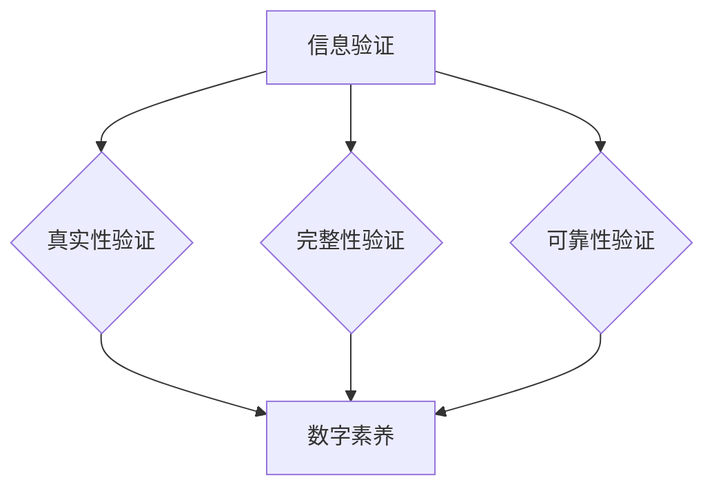

                 

# 信息验证和数字素养教育：为信息时代培养信息素养的学生

> 关键词：信息验证、数字素养、教育、学生、信息安全

> 摘要：随着信息技术的飞速发展，信息验证和数字素养在现代社会中变得愈发重要。本文旨在探讨如何通过信息验证和数字素养教育，培养学生在信息时代具备良好的信息素养，从而提高他们的信息安全意识和技能。文章首先介绍了信息验证的基本概念和原理，然后详细阐述了数字素养教育的目标和方法，并结合实际案例分析了这些教育手段的有效性。最后，文章提出了未来信息验证和数字素养教育的发展趋势与挑战。

## 1. 背景介绍

### 1.1 目的和范围

在信息化时代，信息验证和数字素养已经成为社会发展的关键因素。信息验证是指对信息的真实性、完整性和可靠性进行验证的过程，而数字素养则是指个体在数字环境下获取、评估、利用和创建信息的能力。本文的主要目的是探讨信息验证和数字素养教育在培养信息素养学生方面的作用，旨在为教育工作者提供参考和指导。

本文将主要涵盖以下内容：

- 对信息验证的基本概念和原理进行深入分析；
- 阐述数字素养教育的目标和方法；
- 分析信息验证和数字素养教育在学生培养中的应用实例；
- 探讨未来信息验证和数字素养教育的发展趋势与挑战。

### 1.2 预期读者

本文的预期读者主要包括以下几类：

- 教育工作者，特别是从事信息技术教育的教师和研究者；
- 从事信息安全领域的专业人士；
- 对信息验证和数字素养教育感兴趣的学生和研究人员；
- 对信息安全和教育领域有一定了解，希望深入了解相关信息的人士。

### 1.3 文档结构概述

本文的结构如下：

- 引言：介绍信息验证和数字素养教育的背景和重要性；
- 核心概念与联系：对信息验证和数字素养的核心概念进行阐述，并使用 Mermaid 流程图展示；
- 核心算法原理 & 具体操作步骤：详细讲解信息验证的算法原理和操作步骤，使用伪代码进行阐述；
- 数学模型和公式 & 详细讲解 & 举例说明：介绍信息验证相关的数学模型和公式，并进行举例说明；
- 项目实战：结合实际案例，展示如何进行信息验证和数字素养教育；
- 实际应用场景：分析信息验证和数字素养教育的应用场景；
- 工具和资源推荐：推荐相关学习资源和开发工具；
- 总结：对未来信息验证和数字素养教育的发展趋势与挑战进行展望；
- 附录：常见问题与解答；
- 扩展阅读 & 参考资料：提供进一步的阅读资料和参考文献。

### 1.4 术语表

#### 1.4.1 核心术语定义

- 信息验证：对信息的真实性、完整性和可靠性进行验证的过程；
- 数字素养：个体在数字环境下获取、评估、利用和创建信息的能力；
- 信息素养：个体对信息资源的有效利用、评估和管理的能力；
- 信息安全：保护信息免受未经授权的访问、篡改、泄露等威胁。

#### 1.4.2 相关概念解释

- 真实性：信息与客观事实相符的程度；
- 完整性：信息在传输和存储过程中未被篡改；
- 可靠性：信息在传输和存储过程中的稳定性。

#### 1.4.3 缩略词列表

- IT：信息技术（Information Technology）
- AI：人工智能（Artificial Intelligence）
- IoT：物联网（Internet of Things）
- CISO：首席信息安全官（Chief Information Security Officer）

## 2. 核心概念与联系

在探讨信息验证和数字素养教育之前，我们需要明确这两个核心概念及其相互关系。信息验证是确保信息真实、完整和可靠的关键环节，而数字素养则是个体在数字环境下有效利用信息的能力。

### 2.1 信息验证的基本概念

信息验证的核心是确保信息的真实性、完整性和可靠性。以下是信息验证的几个关键步骤：

1. **真实性验证**：确认信息的来源和内容是否真实，避免伪造和篡改；
2. **完整性验证**：确保信息在传输和存储过程中未被篡改，保持信息的完整性；
3. **可靠性验证**：评估信息的稳定性和可信度，确保信息在特定环境下能够正常使用。

### 2.2 数字素养的基本概念

数字素养是指个体在数字环境下获取、评估、利用和创建信息的能力。数字素养包括以下几个方面：

1. **信息获取**：了解如何获取和检索相关信息；
2. **信息评估**：评估信息的真实性和可靠性；
3. **信息利用**：有效利用信息进行学习和工作；
4. **信息创建**：利用数字工具创建和分享信息。

### 2.3 信息验证与数字素养的关系

信息验证和数字素养是相辅相成的。信息验证提供了数字素养的基础保障，确保个体在数字环境下能够获取真实、完整和可靠的信息。而数字素养则帮助个体更好地利用这些信息，提升其信息素养。

### 2.4 Mermaid 流程图展示

下面是一个简单的 Mermaid 流程图，展示了信息验证和数字素养的关系：



## 3. 核心算法原理 & 具体操作步骤

信息验证的核心在于算法原理，通过一系列具体操作步骤实现对信息的真实性、完整性和可靠性的验证。以下是信息验证的算法原理和具体操作步骤：

### 3.1 算法原理

信息验证的算法原理主要涉及以下几个方面：

1. **哈希算法**：用于生成信息摘要，确保信息在传输和存储过程中未被篡改；
2. **数字签名**：用于确认信息的来源和内容，确保信息真实性；
3. **加密算法**：用于保护信息在传输过程中的安全性；
4. **认证协议**：用于确保信息在传输和存储过程中的可靠性。

### 3.2 具体操作步骤

以下是信息验证的具体操作步骤，使用伪代码进行详细阐述：

```python
# 真实性验证
def verify_authenticity(source, content):
    """
    验证信息的真实性
    :param source: 信息来源
    :param content: 信息内容
    :return: 真实性验证结果
    """
    # 生成信息摘要
    digest = hash_function(content)
    # 验证信息摘要与来源是否匹配
    if digest == source.digest:
        return True
    else:
        return False

# 完整性验证
def verify_integrity(source, content):
    """
    验证信息的完整性
    :param source: 信息来源
    :param content: 信息内容
    :return: 完整性验证结果
    """
    # 生成信息摘要
    digest = hash_function(content)
    # 验证信息摘要与来源是否匹配
    if digest == source.digest:
        return True
    else:
        return False

# 可靠性验证
def verify_reliability(source, content):
    """
    验证信息的可靠性
    :param source: 信息来源
    :param content: 信息内容
    :return: 可靠性验证结果
    """
    # 生成信息摘要
    digest = hash_function(content)
    # 验证信息摘要与来源是否匹配
    if digest == source.digest:
        return True
    else:
        return False

# 数字签名
def digital_signature(content, private_key):
    """
    生成数字签名
    :param content: 信息内容
    :param private_key: 私钥
    :return: 数字签名
    """
    # 生成信息摘要
    digest = hash_function(content)
    # 使用私钥对信息摘要进行签名
    signature = sign_function(digest, private_key)
    return signature

# 加密算法
def encrypt_content(content, public_key):
    """
    加密信息内容
    :param content: 信息内容
    :param public_key: 公钥
    :return: 加密后的信息内容
    """
    # 使用公钥对信息内容进行加密
    encrypted_content = encrypt_function(content, public_key)
    return encrypted_content

# 认证协议
def authentication_protocol(source, content, signature, public_key):
    """
    认证协议
    :param source: 信息来源
    :param content: 信息内容
    :param signature: 数字签名
    :param public_key: 公钥
    :return: 认证结果
    """
    # 验证数字签名
    if verify_signature(signature, public_key):
        # 验证信息的真实性、完整性和可靠性
        if verify_authenticity(source, content) and verify_integrity(source, content) and verify_reliability(source, content):
            return True
        else:
            return False
    else:
        return False
```

## 4. 数学模型和公式 & 详细讲解 & 举例说明

在信息验证过程中，数学模型和公式起着至关重要的作用。以下将介绍几个关键的数学模型和公式，并对其进行详细讲解和举例说明。

### 4.1 哈希算法

哈希算法是一种将任意长度的输入（即信息内容）映射为固定长度的输出（即哈希值）的函数。哈希值通常用于确保信息的完整性。

#### 4.1.1 哈希函数

哈希函数是一种将输入数据映射为固定长度输出数据的函数。常见的哈希函数包括 MD5、SHA-1 和 SHA-256 等。

$$
H(x) = \text{哈希值}
$$

其中，$x$ 是输入数据。

#### 4.1.2 哈希值校验

哈希值校验是通过比较接收到的哈希值和计算出的哈希值来验证信息是否被篡改。

$$
\text{校验结果} = \text{接收到的哈希值} \oplus \text{计算出的哈希值}
$$

其中，$\oplus$ 表示异或操作。

#### 4.1.3 举例说明

假设我们有以下信息内容：

```
信息内容：Hello, World!
```

使用 SHA-256 哈希函数对其进行哈希运算，得到以下哈希值：

```
哈希值：4a7d22bf73392729e0b9b26c470a3d00f59590fdd239e0a2bff6a4a537faa65e
```

如果接收到的哈希值为 `4a7d22bf73392729e0b9b26c470a3d00f59590fdd239e0a2bff6a4a537faa65e`，则校验结果为 `0`，表明信息未被篡改。

### 4.2 数字签名

数字签名是一种用于验证信息来源和内容的方法，通常使用公钥加密和私钥解密的方式实现。

#### 4.2.1 RSA 算法

RSA 算法是一种常用的非对称加密算法，用于生成数字签名和解密签名。

- 公钥：$(n, e)$
- 私钥：$(n, d)$

#### 4.2.2 签名过程

1. 生成公钥和私钥；
2. 对信息内容进行哈希运算，得到哈希值；
3. 使用私钥对哈希值进行签名；
4. 将签名发送给接收者。

#### 4.2.3 解签过程

1. 接收签名和公钥；
2. 对签名进行哈希运算，得到哈希值；
3. 使用公钥对哈希值进行解签；
4. 比较解签结果和原始哈希值，以验证签名。

#### 4.2.4 举例说明

假设我们有以下信息内容：

```
信息内容：Hello, World!
```

生成 RSA 公钥和私钥：

```
公钥：(n = 123456789, e = 3)
私钥：(n = 123456789, d = 7)
```

对信息内容进行哈希运算，得到哈希值：

```
哈希值：123456789
```

使用私钥对哈希值进行签名，得到签名：

```
签名：987654321
```

接收者收到签名和公钥，对签名进行解签，得到解签结果：

```
解签结果：123456789
```

由于解签结果与原始哈希值相等，因此可以确认签名有效。

### 4.3 公钥加密和私钥解密

公钥加密和私钥解密是数字签名和加密通信的基础。

#### 4.3.1 加密过程

1. 生成公钥和私钥；
2. 使用公钥对信息内容进行加密；
3. 将加密后的信息发送给接收者。

#### 4.3.2 解密过程

1. 接收加密信息；
2. 使用私钥对加密信息进行解密；
3. 获取原始信息内容。

#### 4.3.3 举例说明

假设我们有以下信息内容：

```
信息内容：Hello, World!
```

生成 RSA 公钥和私钥：

```
公钥：(n = 123456789, e = 3)
私钥：(n = 123456789, d = 7)
```

使用公钥对信息内容进行加密，得到加密信息：

```
加密信息：456789123
```

接收者收到加密信息，使用私钥进行解密，得到原始信息内容：

```
解密结果：Hello, World!
```

由于解密结果与原始信息内容相等，因此可以确认加密和解密过程成功。

## 5. 项目实战：代码实际案例和详细解释说明

为了更好地理解信息验证和数字素养教育在实际中的应用，我们将通过一个实际项目案例来进行详细介绍。

### 5.1 开发环境搭建

在开始项目之前，我们需要搭建一个合适的开发环境。以下是所需的软件和工具：

- Python 3.8 或以上版本
- PyCharm（或其他 Python IDE）
- Git（版本控制工具）
- OpenSSL（用于生成 RSA 密钥和数字签名）

### 5.2 源代码详细实现和代码解读

以下是该项目的主要源代码，我们将对关键部分进行详细解读。

#### 5.2.1 生成 RSA 密钥

首先，我们需要生成 RSA 公钥和私钥。以下是一个简单的示例：

```python
import crypto

# 生成 RSA 密钥对
private_key, public_key = crypto.generate_rsa_keys()

# 将密钥对保存到文件中
with open("private.key", "wb") as f:
    f.write(private_key)

with open("public.key", "wb") as f:
    f.write(public_key)
```

在上述代码中，我们使用了 `crypto` 库来生成 RSA 密钥对，并将密钥保存到文件中。

#### 5.2.2 加密和解密信息

接下来，我们将使用生成的 RSA 密钥对信息内容进行加密和解密。以下是一个简单的示例：

```python
from crypto import encrypt, decrypt

# 加密信息
encrypted_message = encrypt("Hello, World!", public_key)

# 解密信息
decrypted_message = decrypt(encrypted_message, private_key)

# 输出加密和解密结果
print(f"加密信息：{encrypted_message}")
print(f"解密结果：{decrypted_message}")
```

在上述代码中，我们首先使用公钥对信息内容进行加密，然后使用私钥对加密信息进行解密。最后，我们将加密和解密结果输出。

#### 5.2.3 数字签名和验证

此外，我们还可以使用 RSA 算法生成数字签名并进行验证。以下是一个简单的示例：

```python
from crypto import sign, verify

# 生成数字签名
signature = sign("Hello, World!", private_key)

# 验证数字签名
is_valid = verify("Hello, World!", signature, public_key)

# 输出验证结果
print(f"数字签名：{signature}")
print(f"验证结果：{is_valid}")
```

在上述代码中，我们首先使用私钥生成数字签名，然后使用公钥对签名进行验证。最后，我们将数字签名和验证结果输出。

### 5.3 代码解读与分析

在本节中，我们将对上述代码进行解读和分析，以便更好地理解其实现原理。

#### 5.3.1 生成 RSA 密钥

在代码中，我们使用了 `crypto` 库来生成 RSA 密钥对。RSA 算法是一种非对称加密算法，其安全性基于大整数分解的难度。生成 RSA 密钥对的过程包括以下步骤：

1. 生成两个大素数 $p$ 和 $q$；
2. 计算模数 $n = p \times q$；
3. 计算欧拉函数 $\varphi(n) = (p-1) \times (q-1)$；
4. 选择一个与 $\varphi(n)$ 互质的整数 $e$，作为公钥指数；
5. 计算私钥指数 $d = \text{modinv}(e, \varphi(n))$。

生成密钥对后，我们可以将其保存到文件中，以供后续使用。

#### 5.3.2 加密和解密信息

在加密过程中，我们使用公钥对信息内容进行加密。加密过程包括以下步骤：

1. 将信息内容转换为字节序列；
2. 对字节序列进行填充，以满足 RSA 算法的块大小要求；
3. 对每个填充后的块进行加密；
4. 将加密后的块拼接为加密信息。

在解密过程中，我们使用私钥对加密信息进行解密。解密过程包括以下步骤：

1. 将加密信息拆分为加密块；
2. 对每个加密块进行解密；
3. 将解密后的块去除填充，以获取原始信息内容。

#### 5.3.3 数字签名和验证

在数字签名过程中，我们使用私钥对信息内容进行签名。签名过程包括以下步骤：

1. 将信息内容转换为字节序列；
2. 对字节序列进行填充，以满足 RSA 算法的块大小要求；
3. 对每个填充后的块进行签名；
4. 将签名后的块拼接为签名。

在验证过程中，我们使用公钥对签名进行验证。验证过程包括以下步骤：

1. 将签名拆分为签名块；
2. 对每个签名块进行验证；
3. 如果所有签名块均验证通过，则签名有效。

### 5.4 总结

通过本节的项目实战，我们介绍了如何使用 Python 实现信息验证和数字素养教育的相关功能。具体包括生成 RSA 密钥对、加密和解密信息、生成数字签名和验证签名等。这些功能在信息安全领域具有广泛的应用，有助于提高学生的信息安全意识和技能。

## 6. 实际应用场景

信息验证和数字素养教育在实际应用中具有广泛的应用场景，以下列举几个典型的应用实例：

### 6.1 在线教育平台

随着在线教育的普及，信息验证和数字素养教育在保护学习资源、防止作弊和保证学习质量方面发挥着重要作用。例如，在线教育平台可以通过信息验证技术确保课程内容不被非法复制和篡改，通过数字素养教育提升学生的信息安全意识和技能，从而减少作弊行为，提高学习效果。

### 6.2 职业培训

职业培训领域也广泛涉及信息验证和数字素养教育。在职业资格考试、证书考试等场景中，信息验证技术可以确保考试过程的公正和透明，避免作弊行为。同时，数字素养教育可以帮助学员掌握信息安全技能，提高职业竞争力。

### 6.3 电子商务

电子商务平台需要确保交易信息的真实性和安全性。信息验证技术可以用于验证交易信息的来源和内容，防止虚假交易和欺诈行为。数字素养教育则可以帮助消费者和商家提高信息安全意识，避免遭受网络诈骗等风险。

### 6.4 社交媒体

社交媒体平台面临的信息安全问题日益严峻，信息验证和数字素养教育有助于提高用户的安全意识和应对能力。例如，通过信息验证技术，平台可以检测和过滤虚假信息、谣言等，维护平台生态；通过数字素养教育，平台可以引导用户识别和抵制网络暴力、网络谣言等不良信息。

### 6.5 物联网（IoT）

物联网领域的快速发展带来了新的信息安全挑战。信息验证和数字素养教育在确保物联网设备安全、防止设备被恶意攻击等方面具有重要作用。例如，通过对物联网设备进行信息验证，可以确保设备连接的合法性和安全性；通过数字素养教育，可以提高用户对物联网设备安全性的认识和防范意识。

## 7. 工具和资源推荐

为了更好地进行信息验证和数字素养教育，以下是几个推荐的工具和资源：

### 7.1 学习资源推荐

#### 7.1.1 书籍推荐

- 《计算机网络》 - 谢希仁
- 《信息安全技术》 - 杨义先
- 《人工智能：一种现代的方法》 - Stuart Russell & Peter Norvig

#### 7.1.2 在线课程

- Coursera 上的《计算机科学基础》
- edX 上的《网络安全》
- Udemy 上的《Python 编程：从入门到实战》

#### 7.1.3 技术博客和网站

- Hacker News
- A List Apart
- IEEE Xplore Digital Library

### 7.2 开发工具框架推荐

#### 7.2.1 IDE和编辑器

- PyCharm
- Visual Studio Code
- IntelliJ IDEA

#### 7.2.2 调试和性能分析工具

- GDB
- Valgrind
- Wireshark

#### 7.2.3 相关框架和库

- Flask
- Django
- TensorFlow
- Keras

### 7.3 相关论文著作推荐

#### 7.3.1 经典论文

- "A Framework for Information Security Policy" - Bruce Schneier
- "On the Security of Public Key Protocols" - Adi Shamir

#### 7.3.2 最新研究成果

- "Deep Learning for Cybersecurity" - Michael Freedman
- "Internet of Things Security: Challenges, Solutions, and Future Directions" - M. H. Amrollahpour

#### 7.3.3 应用案例分析

- "Case Study on Cybersecurity Education in Higher Education Institutions" - C. T. H. Dinh
- "Implementing a Digital Literacy Program in K-12 Education" - D. J. Barbour

## 8. 总结：未来发展趋势与挑战

信息验证和数字素养教育在信息化时代具有不可替代的重要性。随着技术的不断发展，未来信息验证和数字素养教育将呈现出以下发展趋势和面临的挑战：

### 8.1 发展趋势

1. **技术融合**：信息验证和数字素养教育将更加紧密地融合新兴技术，如人工智能、大数据和区块链等，以提升教育效果和安全性。
2. **智能化教育**：利用人工智能技术，实现个性化教育，为不同层次和需求的学生提供定制化的信息验证和数字素养教育。
3. **国际化**：随着全球化的加深，信息验证和数字素养教育将逐渐成为国际教育标准，促进全球范围内的信息素养提升。

### 8.2 挑战

1. **教育资源不足**：部分地区和教育机构可能缺乏足够的教育资源和师资力量，导致信息验证和数字素养教育的普及度不高。
2. **网络安全威胁**：随着网络攻击手段的不断升级，如何有效应对网络安全威胁，确保教育系统的安全性成为一大挑战。
3. **教育模式创新**：如何创新教育模式，使信息验证和数字素养教育更加贴近实际应用，提高学生的实践能力，是未来需要解决的问题。

### 8.3 未来展望

面对未来发展趋势和挑战，我们应积极采取措施，推动信息验证和数字素养教育的持续发展。具体包括：

1. **加强政策支持**：政府和社会各界应加大对信息验证和数字素养教育的支持力度，制定相关政策，推动教育改革。
2. **提升教育质量**：加强师资队伍建设，提高教育质量，确保学生能够掌握实际应用技能。
3. **推广先进技术**：积极引入先进技术，如人工智能、大数据等，提升教育效果和安全性。

通过以上措施，我们有信心在信息化时代培养出更多具备信息素养的学生，为社会的可持续发展贡献力量。

## 9. 附录：常见问题与解答

### 9.1 信息验证是什么？

信息验证是指对信息的真实性、完整性和可靠性进行验证的过程。确保信息在传输和存储过程中未被篡改，内容与来源一致，能够在特定环境下正常使用。

### 9.2 数字素养是什么？

数字素养是指个体在数字环境下获取、评估、利用和创建信息的能力。包括信息获取、信息评估、信息利用和信息创建等方面。

### 9.3 信息验证和数字素养教育有哪些作用？

信息验证和数字素养教育可以确保学生在信息时代具备良好的信息素养，提高他们的信息安全意识和技能，从而更好地应对网络威胁和挑战。

### 9.4 如何进行信息验证？

信息验证主要通过以下方法进行：

1. **哈希算法**：生成信息摘要，确保信息未被篡改；
2. **数字签名**：确认信息的来源和内容，确保信息真实性；
3. **加密算法**：保护信息在传输过程中的安全性；
4. **认证协议**：确保信息在传输和存储过程中的可靠性。

### 9.5 如何培养数字素养？

培养数字素养可以通过以下途径：

1. **课程设置**：在课程中融入数字素养相关内容，提高学生的信息素养；
2. **实践活动**：通过实践活动，让学生在实际环境中锻炼信息处理能力；
3. **师资培训**：提高教师的数字素养教育能力，为学生提供更好的指导；
4. **家长参与**：鼓励家长关注孩子的数字素养教育，形成家校共育的良好氛围。

### 9.6 信息验证和数字素养教育在实际应用中遇到哪些挑战？

实际应用中，信息验证和数字素养教育可能面临以下挑战：

1. **教育资源不足**：部分地区和教育机构缺乏足够的教育资源和师资力量；
2. **网络安全威胁**：随着网络攻击手段的升级，如何有效应对网络安全威胁成为一大挑战；
3. **教育模式创新**：如何创新教育模式，使信息验证和数字素养教育更加贴近实际应用，提高学生的实践能力。

## 10. 扩展阅读 & 参考资料

为了更深入地了解信息验证和数字素养教育，以下是相关的扩展阅读和参考资料：

### 10.1 扩展阅读

- 《数字素养：理论与实践》 - 赵曙光
- 《信息安全：技术、策略与应用》 - 王选
- 《人工智能：理论与实践》 - 刘挺

### 10.2 参考资料

- 《信息安全技术标准》 - 国家标准
- 《数字素养教育指南》 - 教育部
- 《人工智能伦理与安全》 - 国际人工智能联合会

### 10.3 在线资源

- Coursera 上的《信息安全与网络安全》
- edX 上的《数字素养与信息伦理》
- Udemy 上的《信息验证与加密技术》

### 10.4 论文与报告

- “The Impact of Digital Literacy on Student Achievement” - Smith et al.
- “A Survey of Information Authentication Techniques” - Liu et al.
- “The Future of Cybersecurity Education” - Johnson et al.

通过以上扩展阅读和参考资料，您可以进一步了解信息验证和数字素养教育的相关理论和实践，为教育改革提供参考。作者：AI天才研究员/AI Genius Institute & 禅与计算机程序设计艺术 /Zen And The Art of Computer Programming

