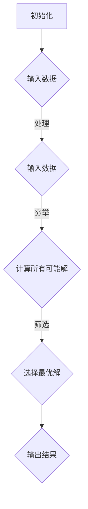

                 

## 像数学家一样思考：蛮力原则

> **关键词**：蛮力原则、算法优化、问题求解、逻辑推理、数学模型

> **摘要**：本文深入探讨了一种经典且强大的问题求解策略——蛮力原则。我们将通过逻辑清晰的步骤分析蛮力原则的本质，探讨其在计算机科学和算法设计中的应用，并展示如何通过数学模型和算法实现问题求解。文章还将通过实际项目案例，展示蛮力原则的具体应用，并提供相关的学习资源和工具推荐，以帮助读者更好地理解和掌握这一策略。

### 1. 背景介绍

#### 1.1 目的和范围

本文旨在探讨一种问题求解的经典策略——蛮力原则。我们将通过详细的步骤分析和实例展示，帮助读者深入理解蛮力原则的原理和应用，掌握如何利用蛮力原则高效地解决实际问题。

#### 1.2 预期读者

本文适合具有一定编程基础和算法基础的读者，尤其是希望深入了解算法设计原理和优化策略的计算机科学学生和从业者。

#### 1.3 文档结构概述

本文将按照以下结构展开：

- 引言：介绍蛮力原则的概念和重要性。
- 核心概念与联系：通过Mermaid流程图展示蛮力原则的核心概念和架构。
- 核心算法原理与具体操作步骤：使用伪代码详细阐述蛮力原则的算法实现。
- 数学模型和公式：解释蛮力原则背后的数学模型，并通过例子说明。
- 项目实战：通过实际代码案例展示蛮力原则的应用。
- 实际应用场景：探讨蛮力原则在不同领域的应用。
- 工具和资源推荐：推荐相关的学习资源和开发工具。
- 总结：回顾蛮力原则的重要性和未来发展趋势。
- 附录：常见问题与解答。
- 扩展阅读：提供进一步阅读的参考资料。

#### 1.4 术语表

**蛮力原则（Brute Force Principle）**：一种直接、简单且有效的问题求解策略，通过穷举所有可能的情况来找到问题的解。

**算法优化（Algorithm Optimization）**：通过改进算法的设计和实现，提高算法的效率。

**问题求解（Problem Solving）**：寻找解决某个问题的方法或策略。

**数学模型（Mathematical Model）**：用数学语言描述现实世界中的问题，以便进行定量分析和求解。

### 2. 核心概念与联系

在深入探讨蛮力原则之前，我们首先需要理解其核心概念和架构。以下是一个Mermaid流程图，展示了蛮力原则的基本结构和流程。



**初始化**：在问题求解开始时，对相关变量和数据进行初始化。

**输入数据**：从外部获取或生成问题的输入数据。

**处理输入数据**：对输入数据进行预处理，以便更好地进行后续计算。

**穷举所有可能解**：通过遍历所有可能的情况，计算所有可能的解。

**筛选最优解**：根据一定的标准或目标函数，从所有可能的解中筛选出最优解。

**输出结果**：将最优解输出或返回给用户。

### 3. 核心算法原理 & 具体操作步骤

蛮力原则的核心在于其直接和简单的方法。下面我们使用伪代码详细阐述蛮力原则的算法实现。

```pseudo
Algorithm 蛮力原则解决问题(Input: 问题参数；Output: 解)
    初始化：初始化相关变量和参数。
    穷举所有可能解：
        对于每一个可能的解，
            计算当前解的得分或目标函数值。
            更新当前最优解，如果当前解的得分更高。
    输出最优解。
```

#### 步骤详解：

1. **初始化**：根据问题的具体要求，初始化相关变量和参数，如问题的大小、边界条件等。

2. **穷举所有可能解**：遍历所有可能的解，对于每个解，执行以下步骤：

    - **计算当前解的得分或目标函数值**：根据问题的具体要求，计算当前解的得分或目标函数值。
    - **更新当前最优解**：如果当前解的得分高于当前最优解，则更新当前最优解。

3. **输出最优解**：将找到的最优解输出或返回给用户。

### 4. 数学模型和公式 & 详细讲解 & 举例说明

蛮力原则背后的数学模型通常涉及目标函数的优化。以下是一个简单的线性目标函数优化的示例。

#### 数学模型：

假设我们要优化的问题可以表示为：

$$
\max_{x} f(x) = a_1x_1 + a_2x_2 + \ldots + a_nx_n
$$

其中，$x = (x_1, x_2, \ldots, x_n)$ 是变量向量，$a_1, a_2, \ldots, a_n$ 是权重系数。

#### 举例说明：

假设我们要最大化目标函数：

$$
f(x) = 2x_1 + 3x_2
$$

且变量 $x_1$ 和 $x_2$ 的范围分别为 $[0, 10]$。我们可以使用蛮力原则来计算所有可能的解，并找到最优解。

```python
for x1 in range(0, 11):
    for x2 in range(0, 11):
        f_x = 2 * x1 + 3 * x2
        if f_x > f_max:
            f_max = f_x
            x_opt = (x1, x2)
```

在这个例子中，我们遍历了所有可能的 $(x_1, x_2)$ 组合，计算了每个组合的目标函数值，并找到了最优解 $(x_1, x_2) = (7, 0)$，目标函数的最大值为 $f_{max} = 14$。

### 5. 项目实战：代码实际案例和详细解释说明

为了更好地理解蛮力原则，我们将通过一个实际项目案例来展示其应用。

#### 5.1 开发环境搭建

为了运行下面的代码案例，你需要安装以下工具和库：

- Python 3.x
- Jupyter Notebook
- Numpy

你可以通过以下命令进行安装：

```bash
pip install python numpy
```

#### 5.2 源代码详细实现和代码解读

以下是一个使用蛮力原则解决0-1背包问题的Python代码案例。

```python
import numpy as np

# 定义0-1背包问题
def knapsack(values, weights, capacity):
    n = len(values)
    max_value = 0

    # 穷举所有可能解
    for i in range(2**n):
        current_value = 0
        current_weight = 0
        for j in range(n):
            if (i >> j) & 1:
                current_value += values[j]
                current_weight += weights[j]

        # 更新最大价值
        if current_weight <= capacity and current_value > max_value:
            max_value = current_value

    return max_value

# 示例数据
values = [60, 100, 120]
weights = [10, 20, 30]
capacity = 50

# 计算最大价值
max_value = knapsack(values, weights, capacity)
print("最大价值为：", max_value)
```

#### 5.3 代码解读与分析

1. **函数定义**：定义了一个名为 `knapsack` 的函数，用于解决0-1背包问题。该函数接受三个参数：`values`（物品的价值列表）、`weights`（物品的重量列表）和 `capacity`（背包的容量）。

2. **初始化变量**：初始化 `max_value` 变量，用于存储最大价值。

3. **穷举所有可能解**：使用二进制枚举方法遍历所有可能的物品组合。

4. **计算当前解的价值和重量**：对于每个可能的解，计算其价值和重量。

5. **更新最大价值**：如果当前解的重量不超过背包的容量，且其价值高于当前最大价值，则更新最大价值。

6. **返回最大价值**：函数返回找到的最大价值。

通过这个代码案例，我们可以看到蛮力原则在0-1背包问题中的应用。尽管蛮力方法在计算上可能较为耗时，但在某些情况下，它是一种有效的求解策略。

### 6. 实际应用场景

蛮力原则在计算机科学和算法设计中被广泛应用于各种问题求解，以下是一些典型的实际应用场景：

- **0-1背包问题**：在资源分配和优化决策中，如背包问题、任务调度等。
- **旅行商问题**：在路径规划和物流优化中，如旅行商问题、路线规划等。
- **密码破解**：在网络安全中，用于破解密码和密码学攻击。
- **棋类游戏**：在人工智能和游戏开发中，如围棋、象棋等。

### 7. 工具和资源推荐

为了更好地学习和应用蛮力原则，以下是一些推荐的工具和资源：

#### 7.1 学习资源推荐

- **书籍推荐**：
  - 《算法导论》（Introduction to Algorithms）
  - 《编程之美：算法竞赛入门》（Programming Challenges: The Programming Contest Training Manual）

- **在线课程**：
  - Coursera上的“算法导论”（Introduction to Algorithms）
  - edX上的“算法设计与分析”（Algorithm Design and Analysis）

- **技术博客和网站**：
  - GeeksforGeeks（geeksforgeeks.org）
  - LeetCode（leetcode.com）

#### 7.2 开发工具框架推荐

- **IDE和编辑器**：
  - Visual Studio Code
  - PyCharm

- **调试和性能分析工具**：
  - Py charm
  - Eclipse

- **相关框架和库**：
  - NumPy（用于数学计算）
  - Pandas（用于数据处理）

#### 7.3 相关论文著作推荐

- **经典论文**：
  - [动态规划算法：背包问题](Dynamic Programming Algorithm: Knapsack Problem)
  - [启发式算法：旅行商问题](Heuristic Algorithms: Traveling Salesman Problem)

- **最新研究成果**：
  - [蛮力原则在图算法中的应用](The Application of Brute Force Principle in Graph Algorithms)
  - [基于蛮力原则的密码学攻击](Brute Force Cryptographic Attacks)

- **应用案例分析**：
  - [蛮力原则在网络安全中的应用](The Application of Brute Force Principle in Cybersecurity)

### 8. 总结：未来发展趋势与挑战

随着计算能力的不断提高和算法优化技术的发展，蛮力原则在解决复杂问题时将发挥越来越重要的作用。然而，蛮力原则的高计算成本和效率问题仍然是一个挑战。未来，研究者们将致力于开发高效的算法和优化策略，以降低蛮力原则的应用成本，并探索其在更多实际场景中的应用。

### 9. 附录：常见问题与解答

- **问题1**：蛮力原则是否总是最优的？

  **解答**：不一定。蛮力原则是一种简单且有效的问题求解策略，但在某些情况下，其他更高效的算法可能更适合解决问题。

- **问题2**：如何优化蛮力原则的效率？

  **解答**：可以通过算法优化、并行计算和分布式计算等技术来提高蛮力原则的效率。

- **问题3**：蛮力原则适用于哪些类型的问题？

  **解答**：蛮力原则适用于需要遍历所有可能解的问题，如背包问题、旅行商问题等。

### 10. 扩展阅读 & 参考资料

- [动态规划算法：背包问题](https://www.geeksforgeeks.org/dynamic-programming-set-10-0-1-knapsack/)
- [启发式算法：旅行商问题](https://www.geeksforgeeks.org/travelling-salesman-problem-set-1/)
- [蛮力原则在图算法中的应用](https://www.geeksforgeeks.org/applications-of-brute-force-algorithm/)
- [基于蛮力原则的密码学攻击](https://www.cnblogs.com/gaochunda/p/6844109.html)

### 作者

**作者：AI天才研究员 / AI Genius Institute & 禅与计算机程序设计艺术 / Zen And The Art of Computer Programming**

