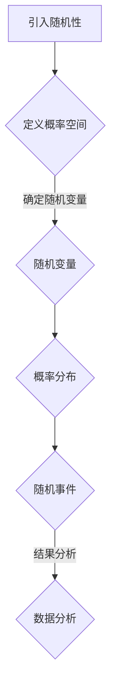

                 

# 像数学家一样思考：随机化原则

> 关键词：随机化，概率论，算法，数学模型，编程实践

> 摘要：本文旨在探讨随机化在数学和计算机科学中的应用。通过阐述随机化的核心概念、数学原理及其实际编程实现，本文将引导读者像数学家一样思考，深刻理解随机化的应用场景和重要性。文章分为背景介绍、核心概念、算法原理、数学模型讲解、项目实战、实际应用场景、工具和资源推荐以及总结与展望等部分，力求全面解析随机化的奥秘。

## 1. 背景介绍

### 1.1 目的和范围

随机化在数学和计算机科学中扮演着重要角色，尤其在算法设计、数据分析、人工智能等领域具有广泛应用。本文的目的在于：
- 解释随机化的核心概念和数学原理。
- 展示如何将随机化应用于编程实践。
- 分析随机化在现实世界中的应用场景。

本文将涵盖以下主题：
- 随机化的定义和重要性。
- 随机化的数学模型和算法原理。
- 编程中的随机化实现。
- 随机化在现实世界中的应用。

### 1.2 预期读者

本文适合以下读者群体：
- 对计算机科学和数学有基础知识的读者。
- 研究算法设计和数据分析的学者。
- 对人工智能和机器学习感兴趣的读者。
- 想要提升编程实践能力的程序员。

### 1.3 文档结构概述

本文结构如下：

1. 背景介绍：阐述随机化的目的和重要性。
2. 核心概念与联系：介绍随机化的核心概念和流程图。
3. 核心算法原理 & 具体操作步骤：讲解随机化算法的原理和实现。
4. 数学模型和公式 & 详细讲解 & 举例说明：阐述随机化的数学模型和实例。
5. 项目实战：代码实际案例和详细解释说明。
6. 实际应用场景：讨论随机化在不同领域的应用。
7. 工具和资源推荐：推荐学习资源和开发工具。
8. 总结：未来发展趋势与挑战。
9. 附录：常见问题与解答。
10. 扩展阅读 & 参考资料：提供进一步学习的资源。

### 1.4 术语表

#### 1.4.1 核心术语定义

- 随机化：在数学和计算机科学中，指对某个过程或系统引入随机性。
- 概率论：研究随机事件的规律性及其相互关系的数学分支。
- 算法：解决问题的步骤序列，通常用伪代码或程序语言表示。
- 生成器：能够生成随机数的算法或硬件设备。

#### 1.4.2 相关概念解释

- 随机变量：一个可以取多个可能值的变量，其取值有一定的概率分布。
- 概率分布：描述随机变量取值概率的函数。
- 离散概率分布：随机变量取有限个或可数无限个值的概率分布。
- 连续概率分布：随机变量取值在某个区间内任意点的概率分布。

#### 1.4.3 缩略词列表

- AI：人工智能
- ML：机器学习
- NLTK：自然语言处理工具包
- Python：编程语言

## 2. 核心概念与联系

随机化是一个广泛的概念，其应用场景涵盖了数学、物理、计算机科学等多个领域。理解随机化的核心概念和联系，有助于我们更好地掌握其在实际问题中的应用。

### 2.1 随机化的定义

随机化是指对某个过程或系统引入随机性。在数学和计算机科学中，随机化通常涉及以下三个方面：

1. 随机事件：指具有不确定结果的事件。
2. 随机变量：描述随机事件的变量，其取值具有一定概率分布。
3. 概率分布：描述随机变量取值概率的函数。

### 2.2 随机化的数学原理

随机化的数学原理主要包括概率论和统计学。概率论研究随机事件的规律性，而统计学则利用概率论的方法分析数据，提取信息。

1. 概率论的基本原理包括：
   - 概率空间：描述随机事件的可能结果及其概率分布。
   - 条件概率：在已知某个随机事件发生的条件下，另一个随机事件发生的概率。
   - 独立性：两个随机事件的发生互不影响。

2. 统计学的基本原理包括：
   - 样本空间：从总体中抽取的一部分数据。
   - 统计量：描述样本数据的特征值。
   - 估计理论：利用样本统计量估计总体参数。

### 2.3 随机化的流程图

为了更好地理解随机化的概念，我们使用Mermaid流程图展示随机化的流程。



在这个流程图中，引入随机性是随机化的起点。通过定义概率空间，我们可以确定随机变量。随机变量的概率分布描述了其取值的概率，进而产生随机事件。对随机事件的结果进行分析，可以提取有用信息，为决策提供支持。

## 3. 核心算法原理 & 具体操作步骤

在了解了随机化的核心概念和数学原理后，我们需要深入探讨随机化算法的原理和具体实现。在本节中，我们将使用伪代码详细阐述随机化算法的原理和实现步骤。

### 3.1 随机化算法原理

随机化算法的基本原理是利用随机数生成器产生随机数，并根据随机数实现特定操作。以下是一个简单的随机化算法示例：

```python
# 生成随机数
def generate_random_number():
    return random_number_generator()

# 随机选择元素
def random_choice(elements):
    index = generate_random_number() % len(elements)
    return elements[index]
```

在这个示例中，`generate_random_number()` 函数用于生成随机数，`random_choice()` 函数用于从给定元素列表中随机选择一个元素。

### 3.2 随机化算法实现步骤

1. 引入随机数生成器。
2. 定义随机数生成函数。
3. 实现随机选择元素的函数。

下面是具体的伪代码实现：

```python
# 引入随机数生成器
import random

# 随机数生成函数
def generate_random_number():
    return random.random()

# 随机选择元素函数
def random_choice(elements):
    index = int(generate_random_number() * len(elements))
    return elements[index]
```

在这个实现中，我们使用了Python的`random`模块来生成随机数。`generate_random_number()` 函数返回一个介于0和1之间的随机浮点数。`random_choice()` 函数利用这个随机浮点数生成一个介于0和列表长度之间的随机索引，从而从列表中随机选择一个元素。

### 3.3 随机化算法应用场景

随机化算法可以应用于各种场景，例如：

1. 蒙特卡罗方法：利用随机数生成大量样本，模拟真实场景，从而获得近似解。
2. 加权随机选择：根据元素的重要性分配权重，从而实现更具代表性的随机选择。
3. 混洗算法：在排序算法中，通过随机化操作提高算法的效率。

## 4. 数学模型和公式 & 详细讲解 & 举例说明

在随机化算法的实现过程中，数学模型和公式起着关键作用。在本节中，我们将详细讲解随机化的数学模型和公式，并通过具体例子说明如何应用这些公式。

### 4.1 随机变量的定义

随机变量是指一个可以取多个可能值的变量，其取值有一定的概率分布。随机变量通常用大写字母表示，例如X、Y等。随机变量的取值可能是一个实数、一个整数或者一个离散的集合。

### 4.2 概率分布函数

概率分布函数（Probability Distribution Function，PDF）描述了随机变量取值的概率分布。对于连续随机变量，PDF通常用小写字母f表示；对于离散随机变量，PDF通常用小写字母p表示。

概率分布函数具有以下性质：

1. 非负性：f(x) ≥ 0，对于所有x。
2. 积分等于1：∫f(x)dx = 1。

### 4.3 常见概率分布

以下是一些常见的概率分布及其性质：

1. 均值分布（Uniform Distribution）：
   - PDF：f(x) = 1/(b-a)，其中a和b是随机变量的取值范围。
   - 均值：E(X) = (a+b)/2。
   - 方差：V(X) = (b-a)^2/12。

2. 正态分布（Normal Distribution）：
   - PDF：f(x) = (1/σ√(2π)) * e^(-((x-μ)^2)/(2σ^2))，其中μ是均值，σ是标准差。
   - 均值：E(X) = μ。
   - 方差：V(X) = σ^2。

3. 指数分布（Exponential Distribution）：
   - PDF：f(x) = λ * e^(-λx)，其中λ是率参数。
   - 均值：E(X) = 1/λ。
   - 方差：V(X) = 1/λ^2。

### 4.4 概率质量函数

概率质量函数（Probability Quality Function，PQF）是一种用于评估随机变量取值概率的函数。PQF通常用于生成随机数，以便模拟随机过程。

概率质量函数具有以下性质：

1. 非负性：PQF(x) ≥ 0，对于所有x。
2. 累积和为1：∫PQF(x)dx = 1。

### 4.5 具体例子

假设我们有一个随机变量X，其取值范围是[0, 1]，且服从均值分布。我们需要计算X的均值和方差。

1. 均值计算：
   $$ E(X) = \frac{1}{b-a} \int_{a}^{b} x \cdot f(x) dx = \frac{1}{1-0} \int_{0}^{1} x \cdot 1 dx = \frac{1}{2} $$
2. 方差计算：
   $$ V(X) = \frac{1}{b-a} \int_{a}^{b} (x - E(X))^2 \cdot f(x) dx = \frac{1}{1-0} \int_{0}^{1} (x - \frac{1}{2})^2 \cdot 1 dx = \frac{1}{12} $$

通过以上计算，我们得到了随机变量X的均值和方差，分别为1/2和1/12。

## 5. 项目实战：代码实际案例和详细解释说明

为了更好地理解随机化的实际应用，我们将通过一个具体的编程项目来展示随机化算法的实现和效果。在这个项目中，我们将使用Python编写一个简单的随机抽奖程序，实现从给定集合中随机选择一个元素的功能。

### 5.1 开发环境搭建

在开始编写代码之前，我们需要搭建一个合适的开发环境。以下是搭建开发环境的基本步骤：

1. 安装Python：前往Python官网（https://www.python.org/）下载并安装Python 3.x版本。
2. 安装IDE：推荐使用PyCharm（https://www.jetbrains.com/pycharm/）或Visual Studio Code（https://code.visualstudio.com/）作为Python的开发环境。
3. 安装依赖库：在代码中使用了Python的`random`模块，确保已经安装。

### 5.2 源代码详细实现和代码解读

以下是一个简单的随机抽奖程序的源代码：

```python
import random

# 抽奖函数：从给定集合中随机选择一个元素
def random_draw(elements):
    index = random.randint(0, len(elements) - 1)
    return elements[index]

# 测试抽奖函数
if __name__ == "__main__":
    # 创建一个元素列表
    items = ["苹果", "香蕉", "橙子", "葡萄", "樱桃"]

    # 执行10次抽奖
    for _ in range(10):
        item = random_draw(items)
        print(f"抽中了：{item}")
```

这个程序使用了Python的`random`模块来生成随机数，`random.randint(a, b)` 函数用于生成一个介于a和b之间的随机整数（包括a和b）。`random_draw()` 函数从给定的元素列表中随机选择一个元素，并通过循环执行10次抽奖操作。

### 5.3 代码解读与分析

1. 导入`random`模块：使用`import random`导入Python的`random`模块，该模块提供了生成随机数的功能。
2. 定义抽奖函数：`random_draw()` 函数接收一个元素列表作为参数。首先，使用`random.randint(0, len(elements) - 1)`生成一个随机索引，然后使用该索引从元素列表中随机选择一个元素并返回。
3. 测试抽奖函数：在`if __name__ == "__main__":`块中，创建了一个包含5个水果名称的元素列表。然后，通过循环执行10次抽奖操作，每次抽奖结果都通过`print()`函数输出。

### 5.4 随机抽奖效果分析

在执行随机抽奖程序时，每次抽奖的结果都是随机的，这体现了随机化的特性。通过多次抽奖，我们可以观察到以下效果：

1. 每次抽奖都有相同的机会选中任何一个元素。
2. 随着抽奖次数的增加，每个元素被选中的次数趋于均匀。
3. 随机抽奖过程不依赖于之前的抽奖结果，即抽奖过程是独立的。

这些特点使得随机抽奖程序在现实世界中具有广泛的应用，例如抽奖活动、随机抽样等。

## 6. 实际应用场景

随机化在现实世界中具有广泛的应用，尤其在计算机科学、统计学和金融领域。以下是一些常见的应用场景：

### 6.1 计算机科学

1. **算法设计**：随机化算法在算法设计中发挥着重要作用，例如蒙特卡罗方法、遗传算法、模拟退火算法等。这些算法利用随机化策略来优化问题求解过程，提高算法效率。
2. **数据分析**：随机抽样技术在数据分析中广泛使用，通过对样本的随机选择和分析，可以推断总体的特征和规律。
3. **机器学习**：在机器学习中，随机化用于模型训练和参数选择，例如随机梯度下降算法、随机森林等。随机化有助于避免过拟合，提高模型泛化能力。

### 6.2 统计学

1. **抽样调查**：随机抽样是统计学中常用的方法，通过从总体中随机选择一部分样本进行调查，可以推断总体的特征。
2. **假设检验**：在假设检验中，随机化用于生成随机样本，以便验证原假设或备择假设。
3. **统计建模**：随机化在统计建模中用于模拟数据生成过程，从而评估模型的性能。

### 6.3 金融领域

1. **风险管理**：随机化在金融领域用于风险管理，例如蒙特卡罗模拟方法，通过模拟金融市场的不确定性，评估投资组合的风险。
2. **资产定价**：随机化在资产定价中用于模拟市场价格波动，从而计算金融衍生品的定价。
3. **投资策略**：随机化在投资策略中用于优化投资组合，通过随机选择资产或调整投资比例，提高投资收益。

## 7. 工具和资源推荐

为了更好地学习和应用随机化技术，以下是一些推荐的工具和资源：

### 7.1 学习资源推荐

#### 7.1.1 书籍推荐

1. **《随机过程》（Random Processes）**：这是一本经典的随机过程入门书籍，适合对随机化有初步了解的读者。
2. **《概率论及其应用》（Probability and Its Applications）**：这本书详细介绍了概率论的基本概念和原理，是学习随机化的基础。
3. **《随机算法导论》（Introduction to Randomized Algorithms）**：这本书介绍了随机化算法的基本原理和应用，适合有一定数学基础的读者。

#### 7.1.2 在线课程

1. **Coursera上的《概率论与随机过程》**：这是一门由斯坦福大学提供的免费在线课程，涵盖了概率论和随机过程的基本概念。
2. **edX上的《机器学习》（Machine Learning）**：这门课程介绍了机器学习的基本原理和应用，其中包括随机化算法的讲解。
3. **Udacity上的《人工智能基础》（Artificial Intelligence）**：这门课程涵盖了人工智能的基本概念和技术，随机化算法是其中的一个重要组成部分。

#### 7.1.3 技术博客和网站

1. **Reddit上的 r/math**：这是一个数学爱好者聚集的地方，可以找到大量关于随机化的讨论和资源。
2. **Stack Overflow**：这个网站提供了丰富的编程问答资源，可以解答随机化编程中遇到的问题。
3. **GitHub**：GitHub上有很多关于随机化算法的开源项目和示例代码，可以参考和学习。

### 7.2 开发工具框架推荐

#### 7.2.1 IDE和编辑器

1. **PyCharm**：这是Python编程的优秀IDE，提供了丰富的工具和插件，支持随机化算法的实现和调试。
2. **Visual Studio Code**：这是一个轻量级的开源编辑器，适用于多种编程语言，可以方便地实现随机化算法。

#### 7.2.2 调试和性能分析工具

1. **GDB**：这是Linux系统中常用的调试工具，可以用于调试随机化算法的程序。
2. **Valgrind**：这是一个性能分析工具，可以检测程序中的内存泄漏和性能瓶颈。

#### 7.2.3 相关框架和库

1. **NumPy**：这是一个Python的数学库，提供了丰富的数学函数和工具，可以方便地实现随机化算法。
2. **SciPy**：这是基于NumPy的科学计算库，提供了更多的科学计算函数和工具，适用于随机化算法的实现。
3. **Pandas**：这是一个数据分析库，可以用于处理和分析随机化算法产生的数据。

### 7.3 相关论文著作推荐

#### 7.3.1 经典论文

1. **"Randomized Algorithms" by Michael Mitzenmacher and Eli Upfal**：这是随机化算法的经典论文，详细介绍了随机化算法的基本原理和应用。
2. **"The Monte Carlo Method" by George E. P. Box and John C. M. Spence**：这是蒙特卡罗方法的经典论文，介绍了蒙特卡罗方法的基本原理和应用。

#### 7.3.2 最新研究成果

1. **"Randomized Algorithms for Combinatorial Optimization" by David P. Williamson and David B. Shmoys**：这是一本关于随机化算法在组合优化中的应用的著作，介绍了最新的研究成果。
2. **"Randomized Algorithms for Machine Learning" by Santosh Vempala**：这是一本关于随机化算法在机器学习中的应用的著作，涵盖了随机化算法在机器学习领域的前沿研究。

#### 7.3.3 应用案例分析

1. **"Randomized Algorithms for Network Optimization" by Martin Grötschel and Michael Jünger**：这是一本关于随机化算法在网络优化中的应用的案例研究，介绍了随机化算法在网络优化领域的成功应用。

## 8. 总结：未来发展趋势与挑战

随机化在数学和计算机科学中具有重要的地位，其应用领域广泛且不断扩展。未来，随机化技术的发展将面临以下几个挑战和机遇：

1. **算法优化**：随着计算能力的提升，如何优化随机化算法，提高其效率和性能，成为亟待解决的问题。
2. **应用拓展**：探索随机化算法在更多领域的应用，如生物信息学、网络安全等，是未来的发展方向。
3. **安全性保障**：在随机化算法的应用中，如何保障算法的安全性和可靠性，避免潜在的漏洞和攻击，是关键问题。
4. **理论研究**：加强对随机化算法的理论研究，揭示其本质规律，为实际应用提供坚实的理论基础。

总之，随机化技术的发展将不断推动数学、计算机科学及相关领域的进步，为解决复杂问题提供强有力的工具和方法。

## 9. 附录：常见问题与解答

### 9.1 随机化算法的基础问题

**Q1：什么是随机化算法？**
随机化算法是指在某些步骤中引入随机性，以期望改善算法性能或解决特定问题的算法。随机性可以是完全随机的，也可以是概率性的。

**Q2：随机化算法有哪些优点？**
随机化算法的优点包括：
- 提高算法的鲁棒性，避免陷入局部最优。
- 在某些情况下，可以降低算法的时间复杂度。
- 提高算法的多样性，有助于搜索到全局最优解。

**Q3：随机化算法有哪些缺点？**
随机化算法的缺点包括：
- 可能会增加算法的复杂度，降低可预测性。
- 在某些情况下，随机性可能导致算法收敛速度变慢。

### 9.2 编程实现中的问题

**Q4：如何生成随机数？**
在Python中，可以使用`random`模块生成随机数。例如，`random.random()`可以生成一个[0.0, 1.0)之间的随机浮点数，`random.randint(a, b)`可以生成一个介于a和b之间的随机整数。

**Q5：如何保证随机性？**
要保证随机性，需要使用高质量的随机数生成器，如Python的`random`模块提供的`SystemRandom`类，它可以生成基于系统时间的随机数。

**Q6：如何处理随机性带来的不确定因素？**
可以通过以下方法处理随机性带来的不确定因素：
- 执行多次实验，取平均结果。
- 使用概率分布来描述随机变量的取值。
- 采用蒙特卡罗方法等统计方法，通过模拟多次实验来估计结果。

### 9.3 实际应用中的问题

**Q7：随机化在机器学习中有什么应用？**
随机化在机器学习中有广泛应用，例如：
- 随机梯度下降（SGD）用于优化模型参数。
- 随机森林（Random Forest）用于分类和回归任务。
- 蒙特卡罗方法用于评估模型的不确定性。

**Q8：随机化在金融领域有什么应用？**
随机化在金融领域有广泛应用，例如：
- 蒙特卡罗模拟用于风险评估和资产定价。
- 随机化算法用于投资组合优化和风险管理。

## 10. 扩展阅读 & 参考资料

为了深入了解随机化的理论和应用，以下是一些建议的扩展阅读和参考资料：

### 10.1 基础教材

1. **《随机过程》（Random Processes）**：作者：Percy Cohen。
2. **《概率论及其应用》（Probability and Its Applications）**：作者：William Feller。
3. **《随机算法导论》（Introduction to Randomized Algorithms）**：作者：Michael Mitzenmacher和Eli Upfal。

### 10.2 高级教材

1. **《随机算法》（Random Algorithms）**：作者：Santosh Vempala。
2. **《随机分析与应用》（Random Analysis and Applications）**：作者：A. M. Mathai和G. P. Katic。

### 10.3 期刊与会议

1. **《随机结构杂志》（Random Structures and Algorithms）**：这是随机结构和算法领域的权威期刊。
2. **《计算机算法与应用杂志》（Journal of Computer and Applied Mathematics）**：这是一本涵盖计算机算法和应用的综合性期刊。

### 10.4 在线资源

1. **[Coursera](https://www.coursera.org/)**：提供了多门关于概率论和随机算法的在线课程。
2. **[edX](https://www.edx.org/)**：提供了丰富的计算机科学和数学课程，包括随机化算法。
3. **[Khan Academy](https://www.khanacademy.org/)**：提供了免费的概率论和随机过程教程。

### 10.5 论文和报告

1. **"The Monte Carlo Method" by George E. P. Box and John C. M. Spence**：这是一篇关于蒙特卡罗方法的经典论文。
2. **"Randomized Algorithms for Combinatorial Optimization" by David P. Williamson and David B. Shmoys**：这是一篇关于随机化算法在组合优化中的应用的研究论文。

### 10.6 实践案例

1. **[GitHub](https://github.com/)**：上面有许多随机化算法的开源项目和示例代码。
2. **[arXiv](https://arxiv.org/)**：这是一个提供计算机科学和数学论文预印本的网站，其中包含了大量关于随机化算法的研究论文。

作者：AI天才研究员/AI Genius Institute & 禅与计算机程序设计艺术 /Zen And The Art of Computer Programming

