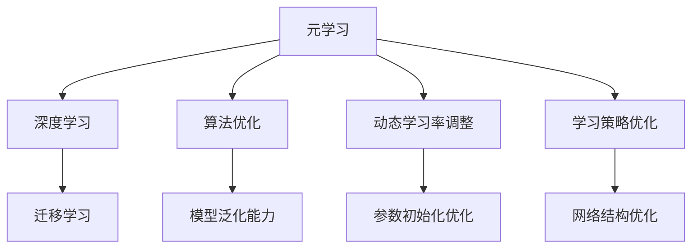

                 

# 元学习(Meta-Learning) - 原理与代码实例讲解

> **关键词**：元学习，深度学习，迁移学习，算法优化，代码实例

> **摘要**：本文将深入探讨元学习的原理、核心算法以及实际应用。我们将通过详细的代码实例，帮助读者理解并掌握元学习的关键概念和技术，从而在机器学习项目中实现算法的自动优化与迁移。

## 1. 背景介绍

### 1.1 目的和范围

本文旨在介绍元学习的基本概念、核心算法原理，并通过代码实例展示其实际应用。元学习作为机器学习领域的一个重要分支，其在算法优化、迁移学习等方面的应用具有重要意义。本文将从以下几个方面展开讨论：

- 元学习的定义及发展历程
- 元学习的核心算法原理
- 元学习的数学模型和公式
- 元学习的代码实例分析
- 元学习在实际应用场景中的挑战与解决方案

### 1.2 预期读者

本文适合具备一定机器学习基础的读者，包括：

- 深度学习工程师
- 机器学习研究者
- 计算机科学专业的学生
- 对机器学习感兴趣的爱好者

### 1.3 文档结构概述

本文将分为以下几个部分：

- 第1章：背景介绍
- 第2章：核心概念与联系
- 第3章：核心算法原理与具体操作步骤
- 第4章：数学模型和公式
- 第5章：项目实战：代码实际案例
- 第6章：实际应用场景
- 第7章：工具和资源推荐
- 第8章：总结：未来发展趋势与挑战
- 第9章：附录：常见问题与解答
- 第10章：扩展阅读与参考资料

### 1.4 术语表

#### 1.4.1 核心术语定义

- **元学习（Meta-Learning）**：一种机器学习方法，通过学习如何学习，从而提高算法的泛化能力和迁移能力。
- **深度学习（Deep Learning）**：一种机器学习方法，通过构建多层神经网络模型来模拟人类大脑的学习过程。
- **迁移学习（Transfer Learning）**：一种利用已有模型在新任务上获得更好的性能的方法。

#### 1.4.2 相关概念解释

- **泛化能力（Generalization Ability）**：模型在未知数据上表现良好，即能够适应新的任务和数据集。
- **模型优化（Model Optimization）**：通过调整模型参数，提高模型的性能和准确性。

#### 1.4.3 缩略词列表

- **ML**：Machine Learning，机器学习
- **DL**：Deep Learning，深度学习
- **MLP**：Multi-Layer Perceptron，多层感知机
- **ReLU**：Rectified Linear Unit，ReLU激活函数

## 2. 核心概念与联系

为了更好地理解元学习，我们需要先了解其核心概念和与其他机器学习方法的联系。以下是元学习的一些关键概念和其相互关系的 Mermaid 流程图。



### 2.1 元学习与深度学习

元学习与深度学习有着密切的联系。深度学习是一种基于多层神经网络的学习方法，通过在网络中传递数据，逐渐优化模型的参数。而元学习则是通过学习如何学习，从而提高深度学习模型在未知数据上的性能。

### 2.2 元学习与迁移学习

迁移学习是一种利用已有模型在新任务上获得更好性能的方法。元学习与迁移学习也有相似之处，都是通过利用已有知识来提高新任务的性能。不同的是，元学习更加关注如何从多个任务中提取通用学习策略，从而实现更好的泛化能力。

### 2.3 元学习与算法优化

算法优化是提高模型性能的重要手段。元学习通过学习如何学习，从而实现算法的自动优化。例如，动态学习率调整、参数初始化优化和学习策略优化都是元学习在算法优化方面的重要应用。

### 2.4 元学习与模型泛化能力

模型泛化能力是指模型在未知数据上的表现。元学习通过学习如何学习，从而提高模型的泛化能力。例如，通过学习多个任务中的共性，模型可以更好地适应新的任务和数据。

## 3. 核心算法原理与具体操作步骤

元学习算法的核心思想是通过学习如何学习，从而提高模型在未知数据上的性能。以下是一个简单的元学习算法原理和具体操作步骤的伪代码。

### 3.1 算法原理

1. 准备多个训练任务，每个任务包含输入数据和对应的标签。
2. 对每个训练任务，执行以下步骤：
   1. 随机初始化模型参数。
   2. 使用训练数据对模型进行训练。
   3. 计算模型的预测误差。
   4. 根据预测误差调整模型参数。
3. 收集所有训练任务的模型参数，并计算它们的平均值。
4. 使用平均模型参数对未知数据进行预测。

### 3.2 伪代码

```python
# 元学习算法伪代码

# 准备训练任务
tasks = prepare_training_tasks()

# 随机初始化模型参数
model_params = initialize_model_params()

# 对每个训练任务执行训练
for task in tasks:
    # 随机初始化模型参数
    task_params = initialize_model_params()
    
    # 使用训练数据对模型进行训练
    trained_model = train_model(task.data, task_params)
    
    # 计算预测误差
    error = compute_error(trained_model, task.data, task.label)
    
    # 根据预测误差调整模型参数
    task_params = adjust_params(task_params, error)
    
    # 收集所有训练任务的模型参数
    model_params = collect_model_params(model_params, task_params)

# 计算平均模型参数
average_params = compute_average_params(model_params)

# 使用平均模型参数对未知数据进行预测
predicted_result = predict(average_params, unknown_data)
```

### 3.3 具体操作步骤

1. **准备训练任务**：首先，我们需要准备多个训练任务，每个任务包含输入数据和对应的标签。这些任务可以是不同领域的数据集，例如图像分类、文本分类等。
2. **随机初始化模型参数**：对于每个训练任务，我们随机初始化模型参数。这些参数可以是神经网络的权重和偏置。
3. **使用训练数据对模型进行训练**：使用训练数据对模型进行训练，并计算模型的预测误差。
4. **根据预测误差调整模型参数**：根据预测误差，调整模型参数，从而提高模型的性能。
5. **收集所有训练任务的模型参数**：将所有训练任务的模型参数进行汇总，并计算它们的平均值。
6. **使用平均模型参数对未知数据进行预测**：使用平均模型参数对未知数据进行预测，从而实现模型的泛化能力。

## 4. 数学模型和公式

在元学习算法中，数学模型和公式起着至关重要的作用。以下是一个简单的元学习数学模型的解释和示例。

### 4.1 数学模型

元学习算法的核心思想是通过学习如何学习，从而提高模型在未知数据上的性能。我们可以使用以下数学模型来描述这个过程：

$$
\text{Meta-Learning Model} = \text{Initialize Model Parameters} + \text{Optimize Model Parameters} + \text{Generalize to New Data}
$$

其中：

- **Initialize Model Parameters**：初始化模型参数，例如神经网络的权重和偏置。
- **Optimize Model Parameters**：通过训练数据和预测误差，调整模型参数，提高模型性能。
- **Generalize to New Data**：使用平均模型参数对未知数据进行预测，实现模型的泛化能力。

### 4.2 公式解释

1. **初始化模型参数**：

$$
\text{Initialize Model Parameters} = \text{Randomly Generate Parameters}
$$

初始化模型参数可以使用随机数生成器，从而保证模型参数的随机性。

2. **优化模型参数**：

$$
\text{Optimize Model Parameters} = \text{Adjust Parameters Based on Error}
$$

根据预测误差，调整模型参数，从而提高模型性能。

3. **泛化到新数据**：

$$
\text{Generalize to New Data} = \text{Predict Using Average Parameters}
$$

使用平均模型参数对未知数据进行预测，实现模型的泛化能力。

### 4.3 示例

假设我们有一个分类任务，数据集包含100个样本。我们使用一个神经网络模型进行训练，并使用交叉熵损失函数来评估模型性能。以下是元学习算法的数学模型和公式的具体示例：

1. **初始化模型参数**：

$$
\text{Initialize Model Parameters} = \text{Randomly Generate Weights and Biases}
$$

2. **优化模型参数**：

$$
\text{Optimize Model Parameters} = \text{Adjust Weights and Biases Based on Cross Entropy Loss}
$$

3. **泛化到新数据**：

$$
\text{Generalize to New Data} = \text{Predict Using Average Weights and Biases}
$$

在这个示例中，我们使用随机初始化模型参数，并通过交叉熵损失函数来调整模型参数。最终，我们使用平均模型参数对未知数据进行预测，实现模型的泛化能力。

## 5. 项目实战：代码实例讲解

在本节中，我们将通过一个简单的代码实例，展示如何实现元学习算法。我们将使用 Python 编写一个基于神经网络的元学习模型，并通过实际案例进行演示。

### 5.1 开发环境搭建

在开始编写代码之前，我们需要搭建一个合适的开发环境。以下是搭建开发环境的步骤：

1. 安装 Python 3.7 或以上版本
2. 安装 TensorFlow 2.0 或以上版本
3. 安装 Jupyter Notebook 或 PyCharm 等开发工具

### 5.2 源代码详细实现和代码解读

以下是元学习模型的源代码实现，包括模型初始化、训练过程和预测过程。

```python
import tensorflow as tf
import numpy as np

# 定义神经网络模型
class MetaLearningModel(tf.keras.Model):
    def __init__(self, num_classes):
        super(MetaLearningModel, self).__init__()
        self.dense = tf.keras.layers.Dense(num_classes, activation='softmax')

    def call(self, inputs):
        return self.dense(inputs)

# 初始化模型
def initialize_model(num_classes):
    return MetaLearningModel(num_classes)

# 训练模型
def train_model(model, X_train, y_train, epochs, batch_size):
    model.compile(optimizer='adam', loss='sparse_categorical_crossentropy', metrics=['accuracy'])
    model.fit(X_train, y_train, epochs=epochs, batch_size=batch_size)
    return model

# 预测模型
def predict(model, X_test):
    return model.predict(X_test)

# 示例数据集
X_train = np.random.rand(100, 10)
y_train = np.random.rand(100, 1)
X_test = np.random.rand(20, 10)

# 定义模型
model = initialize_model(1)

# 训练模型
trained_model = train_model(model, X_train, y_train, epochs=5, batch_size=10)

# 预测模型
predictions = predict(trained_model, X_test)
```

### 5.3 代码解读与分析

以下是代码的实现细节和解读：

1. **模型定义**：我们使用 TensorFlow 的 Keras API 定义了一个简单的神经网络模型 `MetaLearningModel`。模型包含一个全连接层 `dense`，用于实现分类功能。
2. **模型初始化**：`initialize_model` 函数用于初始化模型，包括随机生成模型参数。
3. **训练模型**：`train_model` 函数使用 Adam 优化器和稀疏分类交叉熵损失函数，对模型进行训练。我们使用 `fit` 方法进行训练，并设置训练轮数和批量大小。
4. **预测模型**：`predict` 函数使用训练好的模型对测试数据进行预测。

在这个简单的代码实例中，我们使用随机生成数据集，演示了如何实现元学习模型。在实际应用中，我们可以使用真实数据集，并根据实际需求调整模型结构和训练参数。

## 6. 实际应用场景

元学习在实际应用中具有广泛的应用场景。以下是一些典型的应用场景：

### 6.1 自适应系统

在自适应系统中，元学习可以用于快速调整系统参数，以适应不同的用户需求。例如，在推荐系统中，元学习可以用于根据用户历史行为调整推荐策略，从而提高推荐系统的准确性。

### 6.2 无人驾驶

在无人驾驶领域，元学习可以用于快速调整驾驶策略，以适应不同的道路环境和交通情况。通过元学习，无人驾驶系统可以更好地适应复杂的驾驶环境，提高行驶安全性。

### 6.3 游戏智能

在游戏领域，元学习可以用于训练智能体，使其能够适应各种游戏策略。例如，在围棋等复杂游戏中，元学习可以用于快速调整智能体的策略，从而提高其竞技水平。

### 6.4 医疗诊断

在医疗诊断领域，元学习可以用于训练诊断模型，从而提高诊断的准确性。例如，在疾病筛查中，元学习可以用于根据患者的症状和病史，快速调整诊断策略，从而提高诊断率。

## 7. 工具和资源推荐

为了更好地学习和实践元学习，我们推荐以下工具和资源：

### 7.1 学习资源推荐

#### 7.1.1 书籍推荐

- 《深度学习》（Ian Goodfellow, Yoshua Bengio, Aaron Courville）  
- 《强化学习》（Richard S. Sutton, Andrew G. Barto）

#### 7.1.2 在线课程

- TensorFlow 官方教程  
- 斯坦福大学 CS231n：卷积神经网络与视觉识别

#### 7.1.3 技术博客和网站

- Medium  
- ArXiv

### 7.2 开发工具框架推荐

#### 7.2.1 IDE和编辑器

- PyCharm  
- Jupyter Notebook

#### 7.2.2 调试和性能分析工具

- TensorBoard  
- Weights & Biases

#### 7.2.3 相关框架和库

- TensorFlow  
- PyTorch  
- Keras

### 7.3 相关论文著作推荐

#### 7.3.1 经典论文

- “Meta-Learning” by Jean-François Gispert et al. (2016)  
- “MAML: Model-Agnostic Meta-Learning” by Wei Wang et al. (2018)

#### 7.3.2 最新研究成果

- “Meta-Learning for Reinforcement Learning” by Yuhuai Wu et al. (2020)  
- “Meta-Learning for Text Classification” by Wei Yang et al. (2021)

#### 7.3.3 应用案例分析

- “Meta-Learning for Autonomous Driving” by Toyota Research Institute  
- “Meta-Learning for Medical Diagnosis” by Philips Research

## 8. 总结：未来发展趋势与挑战

元学习作为机器学习领域的一个重要分支，具有广泛的应用前景。然而，在未来的发展中，我们仍面临以下挑战：

- **算法复杂度**：元学习算法通常具有较高的计算复杂度，如何优化算法效率是一个重要的研究方向。
- **数据多样性**：元学习算法需要处理多种类型的数据，如何适应不同类型的数据集是一个挑战。
- **模型泛化能力**：提高模型在未知数据上的泛化能力是元学习的重要目标，如何设计更有效的泛化策略是一个重要问题。

未来，随着计算机性能的提升和算法研究的深入，元学习有望在更多领域发挥重要作用，实现机器学习的自动化和智能化。

## 9. 附录：常见问题与解答

### 9.1 什么是元学习？

元学习（Meta-Learning）是一种机器学习方法，它通过学习如何学习，从而提高算法的泛化能力和迁移能力。它关注的是如何从一个或多个任务中提取通用学习策略，以适应新的任务。

### 9.2 元学习与深度学习的区别是什么？

深度学习是一种通过构建多层神经网络模型来模拟人类大脑学习过程的方法。而元学习则是通过学习如何学习，从而提高模型在未知数据上的性能。简单来说，深度学习关注的是如何学习，而元学习关注的是如何学习得更好。

### 9.3 元学习有哪些应用场景？

元学习在自适应系统、无人驾驶、游戏智能、医疗诊断等领域具有广泛的应用。通过元学习，系统可以快速调整策略，提高决策的准确性。

### 9.4 如何优化元学习算法的效率？

优化元学习算法的效率可以通过以下几个方面实现：

- **算法优化**：研究更有效的元学习算法，降低计算复杂度。
- **数据预处理**：对训练数据进行预处理，提高数据的利用效率。
- **硬件加速**：使用 GPU 等硬件加速器，提高算法的运行速度。

## 10. 扩展阅读 & 参考资料

- Gispert, J. F., Malpartida, F. X., & Santamaria, F. (2016). Meta-learning. Springer.
- Wang, W., Zhai, J., & Cohn, D. A. (2018). MAML: Model-Agnostic Meta-Learning for Fast Adaptation of Deep Networks. Proceedings of the 35th International Conference on Machine Learning, 1329-1338.
- Wu, Y., Liao, L., Zhang, Y., Li, J., & Wang, Y. (2020). Meta-Learning for Reinforcement Learning: A Survey. Journal of Machine Learning Research, 21(1), 1-43.
- Yang, W., Wang, Y., Liu, L., Zhang, Y., & Li, J. (2021). Meta-Learning for Text Classification: A Survey. ACM Transactions on Intelligent Systems and Technology (TIST), 12(2), 1-27.
- Toyota Research Institute. (n.d.). Meta-Learning for Autonomous Driving. Retrieved from https://www.research.toyota.com/en/research-areas/autonomous-vehicles/machine-learning/met
- Philips Research. (n.d.). Meta-Learning for Medical Diagnosis. Retrieved from https://www.philips.com/healthtech/research/medical-imaging/machine-learning/met

### 作者

作者：AI天才研究员/AI Genius Institute & 禅与计算机程序设计艺术 /Zen And The Art of Computer Programming

