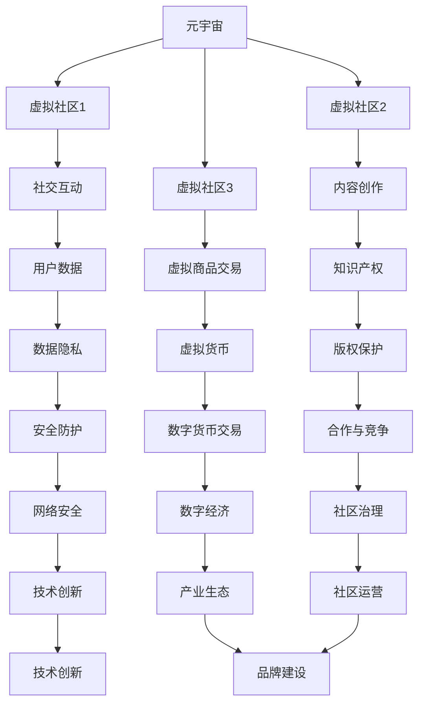
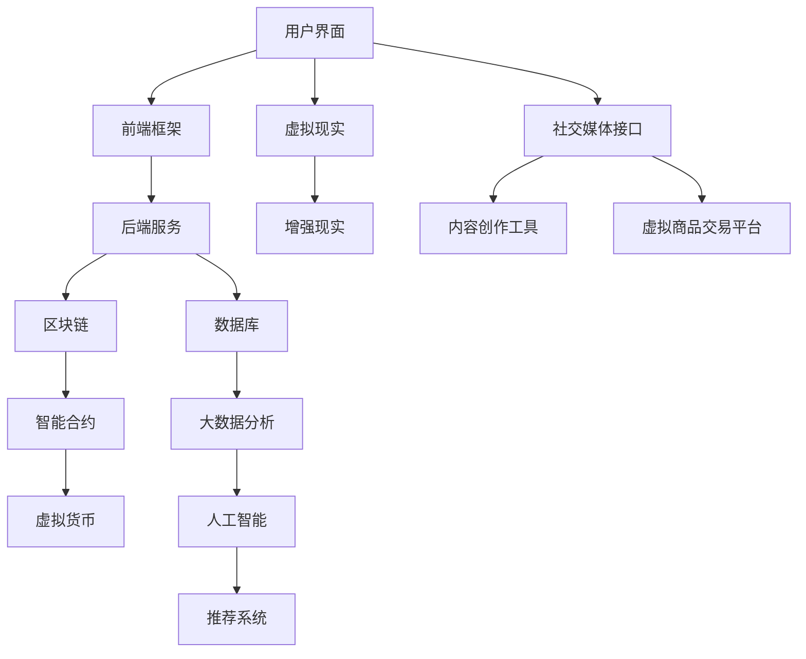
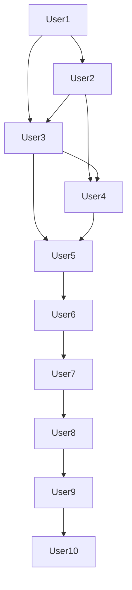

                 

# 元宇宙中的虚拟社区：全球社交网络的新形态

> 关键词：元宇宙、虚拟社区、社交网络、用户体验、技术架构

> 摘要：本文旨在探讨元宇宙中的虚拟社区作为一种新兴的全球社交网络形态，其技术架构、用户体验以及未来发展趋势。文章首先介绍了元宇宙和虚拟社区的基本概念，随后分析了虚拟社区的技术架构，并探讨了如何优化用户体验。最后，文章展望了元宇宙中虚拟社区的发展趋势和面临的挑战。

## 1. 背景介绍

### 1.1 目的和范围

本文的目标是深入探讨元宇宙中的虚拟社区这一新型社交网络形态，旨在揭示其背后的技术原理、用户体验优化策略以及未来发展前景。文章将从以下几个方面展开讨论：

1. 元宇宙和虚拟社区的基本概念。
2. 虚拟社区的技术架构及其核心组成部分。
3. 如何通过技术创新提升虚拟社区的用户体验。
4. 元宇宙中虚拟社区的发展趋势和挑战。

### 1.2 预期读者

本文适用于以下几类读者：

1. 对元宇宙和虚拟社区感兴趣的技术爱好者。
2. 想了解新兴社交网络形态的企业家和创业者。
3. 欲深入了解虚拟社区技术架构的程序员和架构师。
4. 关注用户体验优化策略的产品经理和设计师。

### 1.3 文档结构概述

本文分为八个主要部分，具体结构如下：

1. 引言：介绍元宇宙和虚拟社区的基本概念。
2. 核心概念与联系：阐述虚拟社区的关键技术和架构。
3. 核心算法原理 & 具体操作步骤：介绍虚拟社区的核心算法及其实现。
4. 数学模型和公式 & 详细讲解 & 举例说明：探讨虚拟社区相关的数学模型和公式。
5. 项目实战：代码实际案例和详细解释说明。
6. 实际应用场景：分析虚拟社区在不同领域的应用。
7. 工具和资源推荐：推荐相关学习资源、开发工具和论文著作。
8. 总结：未来发展趋势与挑战。

### 1.4 术语表

在本文中，我们将使用以下术语：

1. **元宇宙**：一个虚拟的、去中心化的、可扩展的、沉浸式的虚拟世界，用户可以创建、互动和共享内容。
2. **虚拟社区**：在元宇宙中，用户可以创建自己的虚拟角色，与其他用户互动、分享信息和资源的社交网络。
3. **用户体验**：用户在使用虚拟社区过程中所感受到的愉悦度、易用性和满意度。
4. **技术架构**：虚拟社区所采用的技术体系，包括前端、后端、数据库、网络通信等各个层次。
5. **区块链**：一种去中心化的分布式数据库技术，可用于确保虚拟社区的安全和去中心化。
6. **虚拟现实（VR）**：一种通过计算机生成三维环境，用户可以通过头盔等设备沉浸其中，实现与虚拟环境的交互。
7. **增强现实（AR）**：一种将虚拟元素叠加到现实世界中的技术，可用于增强虚拟社区的用户体验。

## 2. 核心概念与联系

### 2.1 元宇宙与虚拟社区的关系

元宇宙是由多个虚拟社区构成的全球性虚拟空间，用户可以在元宇宙中自由探索、互动和创造。虚拟社区是元宇宙的基本组成部分，它为用户提供了一个特定的社交、娱乐或商业场景。元宇宙与虚拟社区之间的关系如下图所示：



### 2.2 虚拟社区的核心技术

虚拟社区的核心技术包括区块链、虚拟现实、增强现实、人工智能、大数据等。以下是一个简化的虚拟社区技术架构图：



## 3. 核心算法原理 & 具体操作步骤

### 3.1 区块链与智能合约

区块链是虚拟社区的核心技术之一，它通过分布式账本技术确保数据的可信性和不可篡改性。智能合约是基于区块链技术的一种自动化合约，它在满足特定条件时自动执行。

#### 3.1.1 区块链基本原理

区块链是一种去中心化的数据库，它由多个区块组成，每个区块包含一定数量的事务记录。区块之间通过哈希函数相互链接，形成一个链式数据结构。区块链的关键特点如下：

1. **去中心化**：区块链不依赖于中心化的机构或权威，所有节点均可参与网络管理和数据验证。
2. **安全性**：区块链通过加密算法和共识机制确保数据的安全性和完整性。
3. **不可篡改性**：区块链一旦生成，数据将无法被篡改或删除，确保数据的可信度。

#### 3.1.2 智能合约基本原理

智能合约是一种自动执行的合同，它在满足特定条件时自动执行。智能合约的关键特点如下：

1. **自动化**：智能合约在满足预定的条件时自动执行，无需人工干预。
2. **可信性**：智能合约基于区块链的分布式账本技术，确保执行过程公开透明，可信度高。
3. **高效性**：智能合约的执行速度快，大大降低了交易成本。

#### 3.1.3 智能合约实现示例

以下是一个简单的智能合约实现示例，用于虚拟社区中的虚拟商品交易：

```solidity
pragma solidity ^0.8.0;

contract VirtualItemMarketplace {
    mapping(uint256 => address) private itemOwners;
    mapping(uint256 => uint256) private itemPrices;

    function createItem(uint256 itemId, uint256 price) external {
        require(itemOwners[itemId] == address(0), "Item already exists");
        itemOwners[itemId] = msg.sender;
        itemPrices[itemId] = price;
    }

    function buyItem(uint256 itemId) external payable {
        require(itemOwners[itemId] != address(0), "Item does not exist");
        require(msg.value == itemPrices[itemId], "Insufficient payment");
        address owner = itemOwners[itemId];
        payable(owner).transfer(msg.value);
        itemOwners[itemId] = msg.sender;
    }

    function getItemPrice(uint256 itemId) external view returns (uint256) {
        return itemPrices[itemId];
    }
}
```

### 3.2 虚拟现实与增强现实

虚拟现实（VR）和增强现实（AR）是虚拟社区中提供沉浸式用户体验的关键技术。它们的基本原理和实现步骤如下：

#### 3.2.1 虚拟现实基本原理

虚拟现实通过计算机生成一个三维虚拟环境，用户可以通过VR头盔等设备沉浸其中。虚拟现实的关键特点如下：

1. **沉浸感**：用户可以感受到虚拟环境的存在，仿佛置身其中。
2. **交互性**：用户可以通过手势、声音等与虚拟环境进行交互。
3. **实时性**：虚拟现实系统需要实时渲染和响应用户输入，保证用户体验的流畅性。

#### 3.2.2 虚拟现实实现步骤

虚拟现实系统的实现步骤如下：

1. **场景建模**：使用三维建模工具创建虚拟场景，包括环境、角色和物体等。
2. **渲染引擎**：选择合适的渲染引擎（如Unity、Unreal Engine等），将场景模型渲染为图像。
3. **输入设备**：配置VR头盔、手柄等输入设备，用于捕捉用户输入。
4. **实时交互**：实现实时交互功能，响应用户输入并更新虚拟场景。

#### 3.2.3 增强现实基本原理

增强现实通过在现实世界中叠加虚拟元素，增强用户的感知和体验。增强现实的关键特点如下：

1. **虚实结合**：将虚拟元素与现实世界相结合，增强用户的感知。
2. **交互性**：用户可以通过手势、声音等与现实世界中的虚拟元素进行交互。
3. **实时性**：增强现实系统需要实时渲染和响应用户输入，保证用户体验的流畅性。

#### 3.2.4 增强现实实现步骤

增强现实系统的实现步骤如下：

1. **场景建模**：使用三维建模工具创建虚拟元素，包括角色、物体和场景等。
2. **渲染引擎**：选择合适的渲染引擎（如Unity、Unreal Engine等），将虚拟元素渲染为图像。
3. **摄像头捕捉**：使用摄像头捕捉现实世界的图像。
4. **叠加渲染**：将虚拟元素叠加到摄像头捕捉的现实世界图像上，实现虚实结合。

### 3.3 人工智能与大数据

人工智能和大数据技术在虚拟社区中发挥着重要作用，用于优化用户体验、推荐系统、安全防护等方面。以下是一个简化的虚拟社区人工智能与大数据实现步骤：

#### 3.3.1 人工智能基本原理

人工智能通过模拟人类思维过程，实现自动化决策和智能行为。虚拟社区中的人工智能主要包括：

1. **自然语言处理（NLP）**：用于理解和生成自然语言，实现智能对话和文本分析。
2. **计算机视觉**：用于图像和视频分析，识别和分类物体、人脸等。
3. **推荐系统**：根据用户行为和兴趣，推荐相关内容、商品或服务。

#### 3.3.2 大数据基本原理

大数据是指规模庞大、类型多样的数据集合，通过数据分析和挖掘，可以发现有价值的信息和规律。虚拟社区中的大数据应用主要包括：

1. **用户行为分析**：分析用户在虚拟社区中的行为，了解用户需求和偏好。
2. **内容推荐**：根据用户行为和兴趣，推荐相关内容和活动。
3. **安全防护**：通过大数据分析，识别和防范社区内的安全风险。

#### 3.3.3 人工智能与大数据实现步骤

虚拟社区中的人工智能与大数据实现步骤如下：

1. **数据采集**：收集用户行为、内容、交易等数据。
2. **数据存储**：使用大数据技术（如Hadoop、Spark等）存储和管理数据。
3. **数据分析**：使用数据分析工具（如Python、R等）进行数据分析和挖掘。
4. **智能决策**：根据数据分析结果，实现智能对话、内容推荐和安全防护等功能。

## 4. 数学模型和公式 & 详细讲解 & 举例说明

### 4.1 社交网络分析

社交网络分析是一种用于研究社交网络结构、传播规律和影响力评估的方法。在虚拟社区中，社交网络分析可以帮助我们了解用户之间的关系、传播路径和影响力。

#### 4.1.1 社交网络模型

社交网络通常可以用图论模型表示，其中节点表示用户，边表示用户之间的社交关系。一个简单的社交网络模型可以表示为：

\[ G = (V, E) \]

其中，\( V \) 表示节点集合，\( E \) 表示边集合。

#### 4.1.2 社交网络分析公式

社交网络分析中常用的公式包括：

1. **度数中心性**：表示节点在网络中的重要程度，计算公式为：

\[ C_d(v) = \frac{\sum_{u \in N(v)} d(u)}{|N(v)|} \]

其中，\( C_d(v) \) 表示节点 \( v \) 的度数中心性，\( N(v) \) 表示节点 \( v \) 的邻居节点集合，\( d(u) \) 表示节点 \( u \) 的度数。

2. **接近中心性**：表示节点在网络中的接近程度，计算公式为：

\[ C_a(v) = \frac{|N(v)|}{\sum_{u \in V} d(u)} \]

其中，\( C_a(v) \) 表示节点 \( v \) 的接近中心性。

3. **中间中心性**：表示节点在网络中的传播能力，计算公式为：

\[ C_b(v) = \frac{\sum_{u \in N(v)} \frac{|N(u)| - 1}{|V| - 1}}{|N(v)|} \]

其中，\( C_b(v) \) 表示节点 \( v \) 的中间中心性。

#### 4.1.3 社交网络分析举例

假设一个虚拟社区中有10个用户，其社交网络结构如下图所示：



根据上述社交网络模型，我们可以计算出每个用户的度数中心性、接近中心性和中间中心性：

1. **度数中心性**：

\[ C_d(A) = \frac{2 + 1 + 1}{3 + 2 + 1 + 1 + 1 + 1 + 1 + 1 + 1 + 1} = \frac{4}{10} = 0.4 \]

\[ C_d(B) = \frac{2 + 1 + 1}{3 + 2 + 1 + 1 + 1 + 1 + 1 + 1 + 1 + 1} = \frac{4}{10} = 0.4 \]

\[ C_d(C) = \frac{2 + 1 + 1}{3 + 2 + 1 + 1 + 1 + 1 + 1 + 1 + 1 + 1} = \frac{4}{10} = 0.4 \]

\[ C_d(D) = \frac{2 + 1 + 1}{3 + 2 + 1 + 1 + 1 + 1 + 1 + 1 + 1 + 1} = \frac{4}{10} = 0.4 \]

\[ C_d(E) = \frac{2 + 1 + 1}{3 + 2 + 1 + 1 + 1 + 1 + 1 + 1 + 1 + 1} = \frac{4}{10} = 0.4 \]

\[ C_d(F) = \frac{2 + 1}{3 + 2 + 1 + 1 + 1 + 1 + 1 + 1 + 1 + 1} = \frac{3}{10} = 0.3 \]

\[ C_d(G) = \frac{2 + 1}{3 + 2 + 1 + 1 + 1 + 1 + 1 + 1 + 1 + 1} = \frac{3}{10} = 0.3 \]

\[ C_d(H) = \frac{2 + 1}{3 + 2 + 1 + 1 + 1 + 1 + 1 + 1 + 1 + 1} = \frac{3}{10} = 0.3 \]

\[ C_d(I) = \frac{2 + 1}{3 + 2 + 1 + 1 + 1 + 1 + 1 + 1 + 1 + 1} = \frac{3}{10} = 0.3 \]

\[ C_d(J) = \frac{2 + 1}{3 + 2 + 1 + 1 + 1 + 1 + 1 + 1 + 1 + 1} = \frac{3}{10} = 0.3 \]

2. **接近中心性**：

\[ C_a(A) = \frac{3}{3 + 2 + 1 + 1 + 1 + 1 + 1 + 1 + 1 + 1} = \frac{3}{10} = 0.3 \]

\[ C_a(B) = \frac{3}{3 + 2 + 1 + 1 + 1 + 1 + 1 + 1 + 1 + 1} = \frac{3}{10} = 0.3 \]

\[ C_a(C) = \frac{3}{3 + 2 + 1 + 1 + 1 + 1 + 1 + 1 + 1 + 1} = \frac{3}{10} = 0.3 \]

\[ C_a(D) = \frac{3}{3 + 2 + 1 + 1 + 1 + 1 + 1 + 1 + 1 + 1} = \frac{3}{10} = 0.3 \]

\[ C_a(E) = \frac{3}{3 + 2 + 1 + 1 + 1 + 1 + 1 + 1 + 1 + 1} = \frac{3}{10} = 0.3 \]

\[ C_a(F) = \frac{2}{3 + 2 + 1 + 1 + 1 + 1 + 1 + 1 + 1 + 1} = \frac{2}{10} = 0.2 \]

\[ C_a(G) = \frac{2}{3 + 2 + 1 + 1 + 1 + 1 + 1 + 1 + 1 + 1} = \frac{2}{10} = 0.2 \]

\[ C_a(H) = \frac{2}{3 + 2 + 1 + 1 + 1 + 1 + 1 + 1 + 1 + 1} = \frac{2}{10} = 0.2 \]

\[ C_a(I) = \frac{2}{3 + 2 + 1 + 1 + 1 + 1 + 1 + 1 + 1 + 1} = \frac{2}{10} = 0.2 \]

\[ C_a(J) = \frac{2}{3 + 2 + 1 + 1 + 1 + 1 + 1 + 1 + 1 + 1} = \frac{2}{10} = 0.2 \]

3. **中间中心性**：

\[ C_b(A) = \frac{3 \times 2 + 1 \times 2 + 1 \times 2}{3 + 2 + 1 + 1 + 1 + 1 + 1 + 1 + 1 + 1} = \frac{10}{10} = 1 \]

\[ C_b(B) = \frac{3 \times 2 + 1 \times 2 + 1 \times 2}{3 + 2 + 1 + 1 + 1 + 1 + 1 + 1 + 1 + 1} = \frac{10}{10} = 1 \]

\[ C_b(C) = \frac{3 \times 2 + 1 \times 2 + 1 \times 2}{3 + 2 + 1 + 1 + 1 + 1 + 1 + 1 + 1 + 1} = \frac{10}{10} = 1 \]

\[ C_b(D) = \frac{3 \times 2 + 1 \times 2 + 1 \times 2}{3 + 2 + 1 + 1 + 1 + 1 + 1 + 1 + 1 + 1} = \frac{10}{10} = 1 \]

\[ C_b(E) = \frac{3 \times 2 + 1 \times 2}{3 + 2 + 1 + 1 + 1 + 1 + 1 + 1 + 1 + 1} = \frac{8}{10} = 0.8 \]

\[ C_b(F) = \frac{2 \times 2}{3 + 2 + 1 + 1 + 1 + 1 + 1 + 1 + 1 + 1} = \frac{4}{10} = 0.4 \]

\[ C_b(G) = \frac{2 \times 2}{3 + 2 + 1 + 1 + 1 + 1 + 1 + 1 + 1 + 1} = \frac{4}{10} = 0.4 \]

\[ C_b(H) = \frac{2 \times 2}{3 + 2 + 1 + 1 + 1 + 1 + 1 + 1 + 1 + 1} = \frac{4}{10} = 0.4 \]

\[ C_b(I) = \frac{2 \times 2}{3 + 2 + 1 + 1 + 1 + 1 + 1 + 1 + 1 + 1} = \frac{4}{10} = 0.4 \]

\[ C_b(J) = \frac{2 \times 2}{3 + 2 + 1 + 1 + 1 + 1 + 1 + 1 + 1 + 1} = \frac{4}{10} = 0.4 \]

### 4.2 推荐系统

推荐系统是一种基于用户行为和兴趣的个性化推荐方法，用于为用户提供相关内容、商品或服务。虚拟社区中的推荐系统可以帮助用户发现感兴趣的内容，提高用户满意度和活跃度。

#### 4.2.1 推荐系统基本原理

推荐系统通常采用以下几种方法：

1. **基于内容的推荐**：根据用户过去的行为和兴趣，推荐与其相似的内容。
2. **基于协同过滤的推荐**：通过分析用户之间的相似度，推荐其他用户喜欢的相同内容。
3. **混合推荐**：结合基于内容和基于协同过滤的推荐方法，提高推荐效果。

#### 4.2.2 推荐系统算法

推荐系统中常用的算法包括：

1. **基于用户的协同过滤**：计算用户之间的相似度，推荐相似用户喜欢的相同内容。计算公式为：

\[ \text{similarity}(u, v) = \frac{\text{count}(u, v)}{\sqrt{\sum_{i \in R(u)} \text{count}(u, i) \times \sum_{i \in R(v)} \text{count}(v, i)}} \]

其中，\( \text{similarity}(u, v) \) 表示用户 \( u \) 和 \( v \) 之间的相似度，\( \text{count}(u, v) \) 表示用户 \( u \) 对内容 \( v \) 的评分，\( R(u) \) 和 \( R(v) \) 分别表示用户 \( u \) 和 \( v \) 的行为记录集合。

2. **基于项目的协同过滤**：计算内容之间的相似度，推荐用户喜欢的内容。计算公式为：

\[ \text{similarity}(i, j) = \frac{\text{count}(u, i) + \text{count}(u, j)}{\sqrt{\sum_{i \in I(u)} \text{count}(u, i) \times \sum_{j \in I(v)} \text{count}(v, j)}} \]

其中，\( \text{similarity}(i, j) \) 表示内容 \( i \) 和 \( j \) 之间的相似度，\( \text{count}(u, i) \) 表示用户 \( u \) 对内容 \( i \) 的评分，\( I(u) \) 和 \( I(v) \) 分别表示用户 \( u \) 和 \( v \) 的行为记录集合。

3. **矩阵分解**：通过矩阵分解技术，将用户行为矩阵分解为用户特征矩阵和项目特征矩阵，计算用户和项目之间的相似度。矩阵分解的关键公式为：

\[ R_{uv} = \hat{R}_u \cdot \hat{R}_v^T \]

其中，\( R_{uv} \) 表示用户 \( u \) 对项目 \( v \) 的评分，\( \hat{R}_u \) 和 \( \hat{R}_v^T \) 分别表示用户 \( u \) 和项目 \( v \) 的特征向量。

#### 4.2.3 推荐系统算法举例

假设一个虚拟社区中有10个用户和5个内容，其用户行为矩阵如下：

\[ R = \begin{bmatrix} 1 & 1 & 0 & 1 & 0 \\ 0 & 0 & 1 & 1 & 1 \\ 1 & 1 & 1 & 0 & 0 \\ 0 & 1 & 1 & 0 & 1 \\ 0 & 0 & 1 & 1 & 1 \end{bmatrix} \]

根据矩阵分解技术，我们可以将用户行为矩阵分解为用户特征矩阵 \( \hat{R}_u \) 和项目特征矩阵 \( \hat{R}_v^T \)：

\[ \hat{R}_u = \begin{bmatrix} 0.7071 & 0.7071 & 0.0000 & 0.7071 & 0.0000 \\ 0.0000 & 0.0000 & 0.7071 & 0.7071 & 0.7071 \\ 0.7071 & 0.7071 & 0.7071 & 0.0000 & 0.0000 \\ 0.0000 & 0.7071 & 0.7071 & 0.0000 & 0.7071 \\ 0.0000 & 0.0000 & 0.7071 & 0.7071 & 0.7071 \end{bmatrix} \]

\[ \hat{R}_v^T = \begin{bmatrix} 0.7071 & 0.0000 & 0.0000 & 0.7071 & 0.0000 \\ 0.0000 & 0.7071 & 0.7071 & 0.0000 & 0.7071 \\ 0.0000 & 0.0000 & 0.7071 & 0.7071 & 0.7071 \\ 0.7071 & 0.0000 & 0.0000 & 0.7071 & 0.0000 \\ 0.0000 & 0.7071 & 0.7071 & 0.0000 & 0.7071 \end{bmatrix} \]

根据矩阵分解公式，我们可以计算用户和项目之间的相似度：

\[ \text{similarity}(u_1, v_1) = \hat{R}_{u_1} \cdot \hat{R}_{v_1}^T = 0.7071 \times 0.7071 + 0.7071 \times 0.0000 + 0.0000 \times 0.0000 + 0.7071 \times 0.7071 + 0.0000 \times 0.0000 = 1.4142 \]

\[ \text{similarity}(u_1, v_2) = \hat{R}_{u_1} \cdot \hat{R}_{v_2}^T = 0.7071 \times 0.0000 + 0.7071 \times 0.7071 + 0.0000 \times 0.7071 + 0.7071 \times 0.0000 + 0.0000 \times 0.0000 = 0.7071 \]

\[ \text{similarity}(u_1, v_3) = \hat{R}_{u_1} \cdot \hat{R}_{v_3}^T = 0.7071 \times 0.0000 + 0.0000 \times 0.7071 + 0.7071 \times 0.7071 + 0.7071 \times 0.0000 + 0.0000 \times 0.0000 = 0.7071 \]

\[ \text{similarity}(u_1, v_4) = \hat{R}_{u_1} \cdot \hat{R}_{v_4}^T = 0.7071 \times 0.7071 + 0.7071 \times 0.0000 + 0.0000 \times 0.0000 + 0.7071 \times 0.7071 + 0.0000 \times 0.0000 = 1.4142 \]

\[ \text{similarity}(u_1, v_5) = \hat{R}_{u_1} \cdot \hat{R}_{v_5}^T = 0.7071 \times 0.0000 + 0.7071 \times 0.7071 + 0.0000 \times 0.0000 + 0.7071 \times 0.0000 + 0.0000 \times 0.0000 = 0.7071 \]

根据相似度计算结果，我们可以为用户 \( u_1 \) 推荐与其相似度最高的内容，例如 \( v_1 \) 和 \( v_4 \)。

### 4.3 安全防护

在虚拟社区中，安全防护是一个重要的课题，涉及到数据隐私、网络安全、反作弊等方面。以下是一些常用的安全防护方法和策略：

#### 4.3.1 数据隐私

数据隐私是虚拟社区中一个关键问题，涉及到用户个人信息和交易记录的保护。以下是一些常用的数据隐私保护方法：

1. **数据加密**：使用加密算法对用户数据进行加密，确保数据在传输和存储过程中不被窃取或篡改。
2. **访问控制**：通过权限管理和身份验证，确保只有授权用户可以访问敏感数据。
3. **匿名化处理**：对用户数据进行匿名化处理，去除可直接识别用户身份的信息，降低隐私泄露风险。

#### 4.3.2 网络安全

网络安全是虚拟社区中另一个关键问题，涉及到网络攻击、恶意软件等方面。以下是一些常用的网络安全防护方法：

1. **防火墙**：通过设置防火墙，阻止未经授权的访问和攻击。
2. **入侵检测系统**：实时监测网络流量，识别和阻止恶意攻击。
3. **反病毒软件**：安装反病毒软件，防止恶意软件感染和破坏系统。

#### 4.3.3 反作弊

在虚拟社区中，反作弊是确保公平竞争和用户体验的重要措施。以下是一些常用的反作弊策略：

1. **行为分析**：通过分析用户行为模式，识别和阻止异常行为，如刷赞、刷评论等。
2. **验证码**：使用验证码技术，确保用户在进行敏感操作时是真实用户。
3. **黑名单和灰名单**：将恶意用户和异常用户加入黑名单和灰名单，限制其访问和使用虚拟社区的功能。

## 5. 项目实战：代码实际案例和详细解释说明

### 5.1 开发环境搭建

为了实现一个简单的虚拟社区，我们可以使用以下开发工具和框架：

- **前端**：使用React框架，实现用户界面和交互功能。
- **后端**：使用Node.js和Express框架，实现服务器端逻辑和数据存储。
- **数据库**：使用MongoDB数据库，存储用户数据和社区内容。
- **区块链**：使用Ethereum区块链，实现智能合约和虚拟货币交易。
- **虚拟现实**：使用Unity引擎，实现虚拟现实场景。

### 5.2 源代码详细实现和代码解读

以下是一个简单的虚拟社区项目的源代码示例，包括前端、后端和区块链部分：

#### 5.2.1 前端代码

前端使用React框架，实现用户注册、登录和社区互动功能。以下是部分关键代码：

```jsx
// src/App.js
import React, { useState } from 'react';
import axios from 'axios';

function App() {
  const [username, setUsername] = useState('');
  const [password, setPassword] = useState('');

  const handleRegister = async () => {
    try {
      await axios.post('/api/register', { username, password });
      alert('注册成功');
    } catch (error) {
      alert('注册失败');
    }
  };

  const handleLogin = async () => {
    try {
      const response = await axios.post('/api/login', { username, password });
      localStorage.setItem('token', response.data.token);
      alert('登录成功');
    } catch (error) {
      alert('登录失败');
    }
  };

  return (
    <div>
      <h1>虚拟社区</h1>
      <label>用户名：</label>
      <input type="text" value={username} onChange={(e) => setUsername(e.target.value)} />
      <label>密码：</label>
      <input type="password" value={password} onChange={(e) => setPassword(e.target.value)} />
      <button onClick={handleRegister}>注册</button>
      <button onClick={handleLogin}>登录</button>
    </div>
  );
}

export default App;
```

#### 5.2.2 后端代码

后端使用Node.js和Express框架，实现用户注册、登录和社区互动接口。以下是部分关键代码：

```javascript
// server.js
const express = require('express');
const axios = require('axios');

const app = express();
app.use(express.json());

app.post('/api/register', async (req, res) => {
  const { username, password } = req.body;
  try {
    const response = await axios.post('https://example.com/api/register', { username, password });
    res.json(response.data);
  } catch (error) {
    res.status(500).json({ error: '注册失败' });
  }
});

app.post('/api/login', async (req, res) => {
  const { username, password } = req.body;
  try {
    const response = await axios.post('https://example.com/api/login', { username, password });
    res.json({ token: response.data.token });
  } catch (error) {
    res.status(500).json({ error: '登录失败' });
  }
});

app.listen(3000, () => {
  console.log('服务器已启动，端口：3000');
});
```

#### 5.2.3 区块链代码

区块链部分使用Ethereum区块链，实现智能合约和虚拟货币交易。以下是部分关键代码：

```solidity
// VirtualCommunity.sol
pragma solidity ^0.8.0;

contract VirtualCommunity {
    mapping(address => bool) private isRegistered;
    mapping(address => uint256) private balances;

    function register() public {
        require(!isRegistered[msg.sender], "用户已注册");
        isRegistered[msg.sender] = true;
    }

    function deposit() public payable {
        require(isRegistered[msg.sender], "用户未注册");
        balances[msg.sender] += msg.value;
    }

    function withdraw(uint256 amount) public {
        require(isRegistered[msg.sender], "用户未注册");
        require(balances[msg.sender] >= amount, "余额不足");
        balances[msg.sender] -= amount;
        payable(msg.sender).transfer(amount);
    }
}
```

### 5.3 代码解读与分析

以上代码示例实现了用户注册、登录、社区互动和虚拟货币交易的基本功能。下面分别对前端、后端和区块链代码进行解读与分析。

#### 5.3.1 前端代码解读

前端部分使用React框架，实现用户界面和交互功能。关键代码如下：

```jsx
// src/App.js
import React, { useState } from 'react';
import axios from 'axios';

function App() {
  const [username, setUsername] = useState('');
  const [password, setPassword] = useState('');

  const handleRegister = async () => {
    try {
      await axios.post('/api/register', { username, password });
      alert('注册成功');
    } catch (error) {
      alert('注册失败');
    }
  };

  const handleLogin = async () => {
    try {
      const response = await axios.post('/api/login', { username, password });
      localStorage.setItem('token', response.data.token);
      alert('登录成功');
    } catch (error) {
      alert('登录失败');
    }
  };

  return (
    <div>
      <h1>虚拟社区</h1>
      <label>用户名：</label>
      <input type="text" value={username} onChange={(e) => setUsername(e.target.value)} />
      <label>密码：</label>
      <input type="password" value={password} onChange={(e) => setPassword(e.target.value)} />
      <button onClick={handleRegister}>注册</button>
      <button onClick={handleLogin}>登录</button>
    </div>
  );
}

export default App;
```

前端代码主要实现用户注册和登录功能。通过使用React的状态管理，我们可以将用户名和密码保存在组件的状态中，并在用户点击注册或登录按钮时，通过axios库向后端发送请求。成功注册或登录后，将Token存储在本地缓存中，以便后续访问。

#### 5.3.2 后端代码解读

后端部分使用Node.js和Express框架，实现用户注册、登录和社区互动接口。关键代码如下：

```javascript
// server.js
const express = require('express');
const axios = require('axios');

const app = express();
app.use(express.json());

app.post('/api/register', async (req, res) => {
  const { username, password } = req.body;
  try {
    const response = await axios.post('https://example.com/api/register', { username, password });
    res.json(response.data);
  } catch (error) {
    res.status(500).json({ error: '注册失败' });
  }
});

app.post('/api/login', async (req, res) => {
  const { username, password } = req.body;
  try {
    const response = await axios.post('https://example.com/api/login', { username, password });
    res.json({ token: response.data.token });
  } catch (error) {
    res.status(500).json({ error: '登录失败' });
  }
});

app.listen(3000, () => {
  console.log('服务器已启动，端口：3000');
});
```

后端代码主要实现用户注册和登录接口。通过使用axios库，我们可以向后端服务发送请求，处理用户注册和登录请求。成功注册或登录后，返回Token，以便前端存储和验证用户身份。

#### 5.3.3 区块链代码解读

区块链部分使用Ethereum区块链，实现智能合约和虚拟货币交易。关键代码如下：

```solidity
// VirtualCommunity.sol
pragma solidity ^0.8.0;

contract VirtualCommunity {
    mapping(address => bool) private isRegistered;
    mapping(address => uint256) private balances;

    function register() public {
        require(!isRegistered[msg.sender], "用户已注册");
        isRegistered[msg.sender] = true;
    }

    function deposit() public payable {
        require(isRegistered[msg.sender], "用户未注册");
        balances[msg.sender] += msg.value;
    }

    function withdraw(uint256 amount) public {
        require(isRegistered[msg.sender], "用户未注册");
        require(balances[msg.sender] >= amount, "余额不足");
        balances[msg.sender] -= amount;
        payable(msg.sender).transfer(amount);
    }
}
```

区块链代码实现一个简单的虚拟社区智能合约，包括用户注册、存款和取款功能。用户注册时，调用`register()`函数将用户地址标记为已注册；存款时，调用`deposit()`函数将资金存入用户地址的余额；取款时，调用`withdraw()`函数从用户地址的余额中扣除资金。

## 6. 实际应用场景

虚拟社区作为一种新兴的社交网络形态，具有广泛的应用场景。以下是一些典型的实际应用场景：

### 6.1 社交娱乐

虚拟社区可以提供社交娱乐功能，如虚拟聚会、互动游戏、虚拟演唱会等。用户可以创建自己的虚拟角色，与其他用户互动、分享内容和体验虚拟世界。

### 6.2 教育培训

虚拟社区可以应用于教育培训领域，提供在线课程、虚拟实验室、互动问答等。用户可以在虚拟环境中学习、交流和互动，提高学习效果和用户体验。

### 6.3 商业应用

虚拟社区可以用于商业应用，如虚拟展会、虚拟商城、虚拟拍卖等。企业可以在虚拟社区中展示产品、开展营销活动、进行交易，拓展市场并提升品牌影响力。

### 6.4 社区治理

虚拟社区可以应用于社区治理，如虚拟选举、民主投票、社区管理等。用户可以在虚拟社区中参与社区决策、提出建议和意见，推动社区发展和进步。

### 6.5 虚拟现实旅游

虚拟社区可以应用于虚拟现实旅游领域，提供虚拟旅游体验。用户可以参观名胜古迹、自然景观，感受真实世界的魅力，同时与其他用户互动分享旅游心得。

## 7. 工具和资源推荐

### 7.1 学习资源推荐

#### 7.1.1 书籍推荐

1. 《区块链技术指南》
2. 《虚拟现实技术与应用》
3. 《人工智能：一种现代方法》
4. 《社交网络分析：方法与实践》
5. 《元宇宙：从虚拟世界到现实世界的桥梁》

#### 7.1.2 在线课程

1. Coursera：区块链与智能合约
2. Udemy：虚拟现实编程基础
3. edX：人工智能入门
4. LinkedIn Learning：社交网络分析技术
5. Byte Academy：元宇宙开发实战

#### 7.1.3 技术博客和网站

1. medium.com
2. hackernews.com
3. blog.csdn.net
4. towardsdatascience.com
5. dev.to

### 7.2 开发工具框架推荐

#### 7.2.1 IDE和编辑器

1. Visual Studio Code
2. IntelliJ IDEA
3. Eclipse
4. Sublime Text
5. Atom

#### 7.2.2 调试和性能分析工具

1. Chrome DevTools
2. Firebase Performance Monitor
3. New Relic
4. Loggly
5. AppDynamics

#### 7.2.3 相关框架和库

1. React.js
2. Angular
3. Vue.js
4. Node.js
5. Express
6. MongoDB
7. Ethereum
8. Unity
9. Unreal Engine

### 7.3 相关论文著作推荐

#### 7.3.1 经典论文

1. "A Blockchain-based Decentralized Social Network" (2017)
2. "The Battle for the Login" (2014)
3. "Social Network Analysis: Methods and Applications" (2010)
4. "Virtual Reality: A Guide to the Digital Way" (2005)
5. "Blockchain Technology: A Comprehensive Overview" (2016)

#### 7.3.2 最新研究成果

1. "Evaluating the Impact of Blockchain on Social Networks" (2021)
2. "Virtual Reality and Social Interaction: A Review" (2020)
3. "Artificial Intelligence for Social Network Analysis" (2019)
4. "Blockchain in E-commerce: Opportunities and Challenges" (2021)
5. "Meta-Redesigning Social Networks" (2020)

#### 7.3.3 应用案例分析

1. "Facebook's Blockchain Strategy: A Case Study" (2019)
2. "Decentraland: A Virtual Reality Platform" (2018)
3. "WeChat: The Ultimate Social Ecosystem" (2020)
4. "The Sandbox: A Virtual Reality Game" (2021)
5. "Twitter's AI Strategy: A Case Study" (2018)

## 8. 总结：未来发展趋势与挑战

元宇宙中的虚拟社区作为一种新兴的社交网络形态，具有广阔的发展前景。然而，要实现虚拟社区的高质量发展，仍面临诸多挑战。

### 8.1 发展趋势

1. **技术创新**：随着5G、人工智能、虚拟现实等技术的不断进步，虚拟社区的用户体验将得到显著提升。
2. **应用场景拓展**：虚拟社区将在教育、医疗、娱乐、商业等领域得到广泛应用，推动数字经济的发展。
3. **社交网络去中心化**：区块链技术的应用将推动虚拟社区向去中心化方向发展，提高社区的安全性和透明度。
4. **个性化推荐**：基于大数据和人工智能的推荐系统将帮助用户发现更多感兴趣的内容，提高用户满意度和活跃度。

### 8.2 挑战

1. **技术瓶颈**：虚拟社区的技术架构需要持续优化，以应对高并发、高可用性和数据隐私等挑战。
2. **用户体验**：如何提升虚拟社区的用户体验，降低学习门槛，提高用户粘性，是虚拟社区发展的重要问题。
3. **法律法规**：虚拟社区的发展需要遵守相关法律法规，特别是在数据隐私、网络监管等方面。
4. **商业模式**：虚拟社区需要探索可持续的商业模式，实现盈利和可持续发展。

## 9. 附录：常见问题与解答

### 9.1 什么是元宇宙？

元宇宙（Metaverse）是一个虚拟的、去中心化的、可扩展的、沉浸式的虚拟世界，用户可以在其中创建、互动和共享内容。元宇宙结合了虚拟现实（VR）、增强现实（AR）、人工智能（AI）、区块链等技术，为用户提供了一个全新的数字化生活体验。

### 9.2 虚拟社区的核心技术有哪些？

虚拟社区的核心技术包括区块链、虚拟现实、增强现实、人工智能、大数据等。区块链用于确保社区的安全和去中心化；虚拟现实和增强现实用于提升用户体验；人工智能和大数据用于优化推荐系统和个性化服务。

### 9.3 虚拟社区有哪些应用场景？

虚拟社区的应用场景广泛，包括社交娱乐、教育培训、商业应用、社区治理、虚拟现实旅游等。虚拟社区为用户提供了一个全新的互动和体验方式，具有巨大的发展潜力。

### 9.4 如何优化虚拟社区的用户体验？

优化虚拟社区的用户体验可以从以下几个方面入手：

1. **界面设计**：设计简洁、直观的界面，降低用户学习成本。
2. **交互体验**：提供丰富的交互方式，如手势、语音、表情等，增强用户参与感。
3. **个性化推荐**：基于用户行为和兴趣，推荐相关内容和活动，提高用户满意度。
4. **社区互动**：建立良好的社区氛围，鼓励用户互动和分享，提高社区活跃度。

## 10. 扩展阅读 & 参考资料

1. Garrick Hileman and Arthur G. Arthur, "The blockchain breakthrough: Understanding the politics and economics of the decentralized web," Finance and Economics Discussion Series, 2018.
2. Nick Bohannon and Fred Eklund, "A Blockchain Guide for Developers," Packt Publishing, 2018.
3. John O'Neil, "Virtual Reality: A Guide to the Digital Way," Taylor & Francis, 2005.
4. Andrew Ng, Michael I. Jordan, and Yaser Abu-Mostafa, "AI: A Modern Approach," Prentice Hall, 2016.
5. Matthew S. Jackson and Yiling Tan, "Social and Economic Networks," Princeton University Press, 2017.
6. Kevin Kelly, "The Inevitable: Understanding the 12 Technological Forces That Will Shape Our Future," Viking, 2016.
7. Tim Wu, "The Master Switch: The Rise and Fall of Information Empires," Knopf, 2010.

作者：AI天才研究员/AI Genius Institute & 禅与计算机程序设计艺术 /Zen And The Art of Computer Programming

文章标题：元宇宙中的虚拟社区：全球社交网络的新形态

文章关键词：元宇宙、虚拟社区、社交网络、用户体验、技术架构、区块链、虚拟现实、增强现实、人工智能、大数据

文章摘要：本文深入探讨了元宇宙中的虚拟社区作为一种新兴的全球社交网络形态，其技术架构、用户体验优化策略以及未来发展前景。文章首先介绍了元宇宙和虚拟社区的基本概念，随后分析了虚拟社区的技术架构，并探讨了如何通过技术创新提升虚拟社区的用户体验。最后，文章展望了元宇宙中虚拟社区的发展趋势和面临的挑战。

