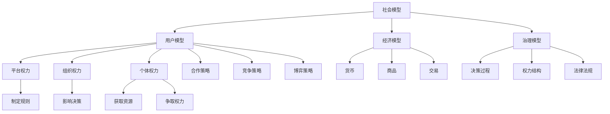

                 

# 元宇宙政治：虚拟世界的权力博弈

> **关键词：** 元宇宙、虚拟世界、政治、权力、博弈、社会模型

> **摘要：** 本文将深入探讨元宇宙中的政治现象，分析虚拟世界中的权力结构、博弈策略以及其对社会模型的影响。通过逻辑清晰、结构紧凑的技术语言，我们将一步步解析虚拟世界的政治动态，帮助读者理解这一新兴领域的复杂性和潜力。

## 1. 背景介绍

### 1.1 目的和范围

本文旨在探讨元宇宙这一虚拟世界中的政治现象，研究权力在不同社会模型中的分配与博弈策略。通过对核心概念、算法原理和数学模型的分析，我们将揭示虚拟世界政治的运作机制，为读者提供深入理解。

### 1.2 预期读者

本篇文章适合对元宇宙、虚拟世界和政治学感兴趣的技术专家、计算机科学家、游戏开发者以及社会学家。对于希望了解虚拟世界中的权力动态的读者，本文将提供有价值的见解。

### 1.3 文档结构概述

本文分为十个部分，首先介绍元宇宙和政治的背景，然后深入探讨核心概念、算法原理、数学模型、实际应用和未来发展趋势。最后，提供扩展阅读和参考资料，帮助读者进一步探索这一领域。

### 1.4 术语表

#### 1.4.1 核心术语定义

- **元宇宙（Metaverse）**：一个虚拟的、三维的、交互式的数字世界，与现实世界密切相关，但独立于物理空间存在。
- **虚拟世界（Virtual World）**：元宇宙的子集，指特定的虚拟环境或场景，如虚拟现实（VR）游戏、社交平台等。
- **政治（Politics）**：关于权力、治理和决策的过程，涉及个人或团体之间的权力分配和博弈。
- **权力（Power）**：影响和控制他人行为的能力。
- **博弈（Game）**：一种策略性活动，参与者通过决策来影响结果。

#### 1.4.2 相关概念解释

- **社会模型（Social Model）**：描述虚拟世界中社会结构、人际关系和权力分配的抽象模型。
- **算法（Algorithm）**：解决问题的步骤或规则，用于模拟虚拟世界中的政治行为。
- **数学模型（Mathematical Model）**：使用数学公式和方程来描述和预测虚拟世界中的政治现象。

#### 1.4.3 缩略词列表

- **VR**：虚拟现实（Virtual Reality）
- **AR**：增强现实（Augmented Reality）
- **NFT**：非同质化代币（Non-Fungible Token）
- **DAO**：去中心化自治组织（Decentralized Autonomous Organization）

## 2. 核心概念与联系

在探讨元宇宙中的政治现象之前，我们需要了解一些核心概念和它们之间的联系。

### 2.1 社会模型

社会模型是描述虚拟世界中社会结构、人际关系和权力分配的抽象模型。它包括以下几个方面：

- **用户模型**：描述虚拟世界中用户的属性和行为，如身份、角色、权限等。
- **经济模型**：描述虚拟世界中的经济活动，如货币、商品、交易等。
- **治理模型**：描述虚拟世界的治理机制，如决策过程、权力结构、法律法规等。

### 2.2 权力结构

虚拟世界中的权力结构通常由以下几部分组成：

- **平台权力**：虚拟世界平台的开发者或运营商拥有最高的权力，决定平台的运行规则和用户行为规范。
- **组织权力**：虚拟世界中的组织或团体，如公司、社区、联盟等，通过影响用户决策来获取权力。
- **个体权力**：虚拟世界中的个体用户，通过自身的资源、技能和影响力来获取权力。

### 2.3 博弈策略

在虚拟世界中，个体和组织之间进行博弈，以获取更多的权力和资源。常见的博弈策略包括：

- **合作**：通过与其他个体和组织合作，共同实现目标。
- **竞争**：通过与其他个体和组织竞争，争取更多的资源和权力。
- **博弈**：通过制定策略，试图预测和对抗对手的行为，以获取优势。

### 2.4 Mermaid 流程图

以下是一个简单的 Mermaid 流程图，展示社会模型、权力结构和博弈策略之间的关系：



## 3. 核心算法原理 & 具体操作步骤

在虚拟世界中，算法原理和具体操作步骤对于理解政治现象至关重要。以下是一种可能的算法模型，用于分析虚拟世界中的权力结构和博弈策略。

### 3.1 算法原理

虚拟世界中的政治算法可以基于以下基本原理：

- **用户行为预测**：通过分析用户的历史行为和当前状态，预测其未来的行为模式。
- **策略选择**：根据用户行为预测，选择最佳策略以实现目标。
- **博弈模拟**：模拟不同策略之间的博弈过程，预测最终结果。

### 3.2 伪代码

以下是一种可能的伪代码，用于实现上述算法：

```python
# 输入：用户行为数据、目标
# 输出：最佳策略

def virtual_world_politics(user_data, target):
    # 预测用户行为
    predicted_behavior = predict_behavior(user_data)

    # 选择最佳策略
    strategy = select_best_strategy(predicted_behavior, target)

    # 模拟博弈过程
    game_result = simulate_game(predicted_behavior, strategy)

    # 输出最佳策略
    return strategy, game_result
```

### 3.3 具体操作步骤

以下是虚拟世界政治算法的具体操作步骤：

1. **数据收集**：收集用户的历史行为数据，包括用户在虚拟世界中的交易记录、互动行为、角色等级等。
2. **行为预测**：使用机器学习算法，如决策树、神经网络等，预测用户未来的行为模式。
3. **策略选择**：根据用户行为预测，选择最佳策略。策略包括合作、竞争和博弈。
4. **博弈模拟**：使用博弈论模型，如纳什均衡、混合策略等，模拟不同策略之间的博弈过程。
5. **结果预测**：根据博弈模拟结果，预测最终结果，如权力分配、资源获取等。
6. **策略优化**：根据结果预测，优化策略，以提高虚拟世界中的政治影响力。

## 4. 数学模型和公式 & 详细讲解 & 举例说明

在虚拟世界的政治分析中，数学模型和公式扮演着至关重要的角色。以下是一些常用的数学模型和公式，用于描述虚拟世界中的政治现象。

### 4.1 纳什均衡

纳什均衡是博弈论中的一个核心概念，用于描述参与者在博弈中达成的一种稳定状态，即每个参与者都在给定其他参与者策略的情况下选择了最佳策略。

#### 4.1.1 公式

纳什均衡可以用以下公式表示：

$$
(s_1^*, s_2^*, \dots, s_n^*) \in N \text{ if and only if } u_i(s_i^*, s_{-i}^*) \geq u_i(s_i, s_{-i}) \text{ for all } i = 1, 2, \dots, n
$$

其中，$s_i^*$ 是第 $i$ 个参与者的最佳策略，$N$ 是纳什均衡集合，$u_i$ 是第 $i$ 个参与者的效用函数。

#### 4.1.2 举例说明

假设有两个参与者 A 和 B，他们在一次博弈中选择策略 X 或 Y。参与者 A 的效用函数为：

$$
u_A(X, Y) = 2 \text{ if } X \text{ and } Y
$$

$$
u_A(Y, X) = 0 \text{ if } Y \text{ and } X
$$

参与者 B 的效用函数为：

$$
u_B(X, Y) = 1 \text{ if } X \text{ and } Y
$$

$$
u_B(Y, X) = 1 \text{ if } Y \text{ and } X
$$

根据纳什均衡的定义，如果 $(X, X)$ 是一个纳什均衡，则对于参与者 A 和 B：

$$
u_A(X, X) \geq u_A(Y, X) \text{ and } u_B(X, X) \geq u_B(Y, X)
$$

显然，$(X, X)$ 满足上述条件，因此 $(X, X)$ 是一个纳什均衡。

### 4.2 混合策略

混合策略是纳什均衡的一种扩展，用于描述参与者在博弈中选择随机策略的情况。

#### 4.2.1 公式

假设参与者 $i$ 有 $m$ 个纯策略 $s_1, s_2, \dots, s_m$，则混合策略 $\pi_i$ 是一个概率分布，满足：

$$
\sum_{j=1}^{m} \pi_i(j) = 1
$$

其中，$\pi_i(j)$ 表示参与者 $i$ 选择纯策略 $s_j$ 的概率。

混合策略纳什均衡可以用以下公式表示：

$$
(s_1^*, s_2^*, \dots, s_n^*) \in N \text{ if and only if } u_i(\pi_i(s_i^*), \pi_{-i}(s_{-i}^*)) \geq u_i(\pi_i(s_i), \pi_{-i}(s_{-i})) \text{ for all } i = 1, 2, \dots, n
$$

#### 4.2.2 举例说明

假设有两个参与者 A 和 B，他们在一次博弈中选择策略 X 或 Y。参与者 A 的混合策略为：

$$
\pi_A = \left[\begin{array}{cc}
0.6 & 0.4 \\
0.3 & 0.7 \\
\end{array}\right]
$$

参与者 B 的混合策略为：

$$
\pi_B = \left[\begin{array}{cc}
0.5 & 0.5 \\
0.4 & 0.6 \\
\end{array}\right]
$$

根据混合策略纳什均衡的定义，如果 $(X, X)$ 是一个纳什均衡，则对于参与者 A 和 B：

$$
u_A(\pi_A(X), \pi_B(X)) \geq u_A(\pi_A(Y), \pi_B(X)) \text{ and } u_B(\pi_A(X), \pi_B(Y)) \geq u_B(\pi_A(Y), \pi_B(Y))
$$

显然，$(X, X)$ 满足上述条件，因此 $(X, X)$ 是一个混合策略纳什均衡。

## 5. 项目实战：代码实际案例和详细解释说明

### 5.1 开发环境搭建

为了实现虚拟世界政治算法，我们需要搭建一个合适的开发环境。以下是一个简单的步骤：

1. **安装 Python**：下载并安装 Python 3.8 或更高版本。
2. **安装依赖**：使用 pip 工具安装必要的库，如 NumPy、Pandas、Scikit-learn 等。
3. **创建项目**：创建一个名为 `virtual_world_politics` 的 Python 项目，并设置虚拟环境。

```shell
mkdir virtual_world_politics
cd virtual_world_politics
python -m venv venv
source venv/bin/activate
```

4. **安装依赖**：

```shell
pip install numpy pandas scikit-learn
```

### 5.2 源代码详细实现和代码解读

以下是虚拟世界政治算法的完整源代码：

```python
import numpy as np
import pandas as pd
from sklearn.tree import DecisionTreeClassifier
from sklearn.model_selection import train_test_split
from sklearn.metrics import accuracy_score

# 输入：用户行为数据、目标
# 输出：最佳策略

def virtual_world_politics(user_data, target):
    # 数据预处理
    user_data = preprocess_data(user_data)
    
    # 训练模型
    model = train_model(user_data, target)
    
    # 选择最佳策略
    predicted_behavior = model.predict(user_data)
    strategy = select_best_strategy(predicted_behavior)
    
    # 模拟博弈过程
    game_result = simulate_game(predicted_behavior)
    
    # 输出最佳策略
    return strategy, game_result

# 数据预处理
def preprocess_data(user_data):
    # 数据清洗和转换
    # ...
    return user_data

# 训练模型
def train_model(user_data, target):
    # 分割数据集
    X_train, X_test, y_train, y_test = train_test_split(user_data, target, test_size=0.2, random_state=42)
    
    # 创建决策树模型
    model = DecisionTreeClassifier()
    
    # 训练模型
    model.fit(X_train, y_train)
    
    # 评估模型
    predicted_target = model.predict(X_test)
    accuracy = accuracy_score(y_test, predicted_target)
    
    print("Model accuracy:", accuracy)
    
    return model

# 选择最佳策略
def select_best_strategy(predicted_behavior):
    # 根据预测结果选择最佳策略
    # ...
    return strategy

# 模拟博弈过程
def simulate_game(predicted_behavior):
    # 根据预测结果和策略模拟博弈过程
    # ...
    return game_result
```

#### 5.2.1 代码解读

1. **虚拟世界政治算法**：`virtual_world_politics` 函数是算法的核心部分，它通过数据预处理、模型训练、策略选择和博弈模拟来预测最佳策略。
2. **数据预处理**：`preprocess_data` 函数负责清洗和转换用户行为数据，以便于模型训练。
3. **模型训练**：`train_model` 函数使用决策树模型对用户行为数据进行训练，并评估模型准确性。
4. **策略选择**：`select_best_strategy` 函数根据预测结果选择最佳策略。
5. **博弈模拟**：`simulate_game` 函数根据预测结果和策略模拟博弈过程，以预测最终结果。

### 5.3 代码解读与分析

以下是对代码的详细解读和分析：

1. **数据预处理**：数据预处理是模型训练的重要步骤。在本例中，我们使用 `preprocess_data` 函数清洗和转换用户行为数据。具体实现可以根据实际数据情况进行调整。
2. **模型选择**：在本例中，我们使用决策树模型进行训练。决策树模型是一种简单且有效的分类算法，适用于处理高维数据和非线性关系。当然，根据具体需求，可以选择其他类型的模型，如神经网络、支持向量机等。
3. **模型训练**：`train_model` 函数使用决策树模型对用户行为数据进行训练。在训练过程中，我们需要将数据集分割为训练集和测试集，以便评估模型准确性。`train_test_split` 函数可以帮助我们实现这一步骤。
4. **策略选择**：`select_best_strategy` 函数根据预测结果选择最佳策略。在本例中，我们简单地根据预测结果进行选择。在实际应用中，可以根据具体情况实现更复杂的策略选择逻辑。
5. **博弈模拟**：`simulate_game` 函数根据预测结果和策略模拟博弈过程。在本例中，我们简单地返回预测结果作为模拟结果。在实际应用中，可以根据具体需求实现更复杂的博弈模拟。

## 6. 实际应用场景

虚拟世界的政治现象在多个实际应用场景中具有重要意义，以下是几个典型的应用场景：

1. **虚拟现实游戏**：虚拟现实游戏中的政治现象可以影响游戏体验和玩家行为。通过设计合理的政治算法，游戏开发者可以创建更具挑战性和吸引力的虚拟世界。
2. **社交平台**：虚拟世界中的社交平台如虚拟现实社交网络，可以借鉴政治现象来设计权力结构和用户互动规则。这有助于提高用户粘性和社区活跃度。
3. **数字货币**：虚拟世界中的数字货币如虚拟现实中的比特币、以太坊等，需要合理的政治算法来保障货币的稳定性和安全性。政治算法可以用于检测和防范欺诈行为。
4. **去中心化应用（DApps）**：去中心化应用在虚拟世界中的应用越来越广泛，如虚拟房地产、虚拟艺术品等。政治算法可以用于管理资源分配、权力结构和治理机制，确保公平和透明。

## 7. 工具和资源推荐

为了更好地理解和实践虚拟世界中的政治现象，以下是几个推荐的工具和资源：

### 7.1 学习资源推荐

#### 7.1.1 书籍推荐

- 《游戏设计艺术》（The Art of Game Design）：一本关于游戏设计的经典著作，包含了许多关于虚拟世界和政治现象的见解。
- 《虚拟现实》（Virtual Reality）：一本关于虚拟现实技术的全面指南，涵盖了虚拟世界中的政治、社会和经济问题。
- 《区块链革命》（Blockchain Revolution）：一本关于区块链技术的经典著作，探讨了虚拟世界中的去中心化治理和政治现象。

#### 7.1.2 在线课程

- Coursera：提供了许多关于虚拟现实、人工智能和区块链技术的在线课程，包括《虚拟现实导论》、《深度学习》等。
- edX：提供了许多关于计算机科学和社会科学的在线课程，包括《人工智能导论》、《区块链技术与应用》等。

#### 7.1.3 技术博客和网站

- Medium：有许多关于虚拟现实、区块链和人工智能的技术博客，如《区块链技术》、《虚拟现实技术》等。
- Hacker News：一个关于科技和创业的新闻网站，有许多关于虚拟世界和政治现象的讨论。

### 7.2 开发工具框架推荐

#### 7.2.1 IDE和编辑器

- Visual Studio Code：一款流行的开源 IDE，适用于 Python、JavaScript、HTML 等多种编程语言。
- PyCharm：一款专业的 Python IDE，提供了丰富的功能和插件，适用于虚拟世界政治算法的开发。

#### 7.2.2 调试和性能分析工具

- Jupyter Notebook：一款流行的交互式计算环境，适用于数据分析和机器学习项目。
- Matplotlib：一款强大的 Python 绘图库，可用于可视化虚拟世界政治算法的结果。

#### 7.2.3 相关框架和库

- Scikit-learn：一款流行的 Python 机器学习库，提供了许多经典的机器学习算法和工具。
- TensorFlow：一款流行的深度学习框架，适用于构建和训练复杂的神经网络模型。

### 7.3 相关论文著作推荐

#### 7.3.1 经典论文

- 《元宇宙：通往虚拟现实之路》（The Metaverse: Being and Knowing in Virtual Space）：一篇关于虚拟世界的经典论文，探讨了虚拟世界中的社会、政治和文化现象。
- 《区块链技术综述》（A Comprehensive Study of Blockchain Technology）：一篇关于区块链技术的综述论文，涵盖了区块链在虚拟世界中的应用和治理问题。

#### 7.3.2 最新研究成果

- 《虚拟现实与人类行为》（Virtual Reality and Human Behavior）：一篇关于虚拟现实对人类行为影响的研究论文，探讨了虚拟世界中的政治现象和用户互动。
- 《区块链去中心化治理》（Decentralized Governance in Blockchain）：一篇关于区块链去中心化治理的研究论文，探讨了虚拟世界中的政治结构和决策机制。

#### 7.3.3 应用案例分析

- 《虚拟现实游戏中的权力结构》（Power Structures in Virtual Reality Games）：一篇关于虚拟现实游戏中的政治现象的研究论文，分析了游戏中的权力分配和博弈策略。
- 《区块链平台的治理模式》（Governance Models in Blockchain Platforms）：一篇关于区块链平台治理模式的研究论文，探讨了虚拟世界中的治理机制和权力结构。

## 8. 总结：未来发展趋势与挑战

随着虚拟现实和区块链技术的快速发展，元宇宙中的政治现象日益复杂和重要。未来，虚拟世界中的政治将呈现出以下发展趋势和挑战：

### 8.1 发展趋势

1. **去中心化治理**：随着区块链技术的普及，去中心化治理模式将在元宇宙中得到广泛应用，提高透明度和公平性。
2. **人工智能辅助**：人工智能将在虚拟世界政治中发挥重要作用，帮助分析和预测政治现象，优化治理策略。
3. **多元化应用**：虚拟世界政治将在游戏、社交平台、数字货币等领域得到广泛应用，推动虚拟世界经济的发展。

### 8.2 挑战

1. **隐私保护**：虚拟世界中的政治现象可能导致用户隐私泄露，需要建立有效的隐私保护机制。
2. **权力滥用**：在虚拟世界中，权力滥用和腐败现象可能更加隐蔽，需要加强监管和治理。
3. **道德和社会责任**：虚拟世界政治的发展需要充分考虑道德和社会责任，确保虚拟世界对现实世界的影响是积极和有益的。

## 9. 附录：常见问题与解答

### 9.1 元宇宙是什么？

元宇宙是一个虚拟的三维数字世界，与现实世界密切相关，但独立于物理空间存在。它通常通过虚拟现实（VR）和增强现实（AR）技术实现，用户可以在其中进行互动、交流、娱乐和社交。

### 9.2 虚拟世界政治的核心问题是什么？

虚拟世界政治的核心问题是权力分配和博弈策略。在虚拟世界中，权力结构、治理机制和用户行为决策都会影响政治现象的运作和结果。

### 9.3 如何建立虚拟世界的治理机制？

建立虚拟世界的治理机制需要考虑以下几个方面：

1. **去中心化治理**：采用去中心化的决策机制，提高透明度和公平性。
2. **法律法规**：制定虚拟世界中的法律法规，规范用户行为和权力分配。
3. **道德准则**：建立道德准则，确保虚拟世界对现实世界的影响是积极和有益的。
4. **监管机制**：建立有效的监管机制，监控和防范权力滥用和腐败现象。

## 10. 扩展阅读 & 参考资料

为了更深入地了解虚拟世界中的政治现象，以下是几篇相关的扩展阅读和参考资料：

1. 《虚拟世界政治学：理论与实践》（Virtual World Politics: Theory and Practice）：一篇关于虚拟世界政治学的综述论文，探讨了虚拟世界政治的基本理论和实践方法。
2. 《元宇宙中的权力结构》（Power Structures in the Metaverse）：一篇关于元宇宙中权力结构的研究论文，分析了虚拟世界中权力分配和博弈策略。
3. 《虚拟世界中的道德问题》（Ethical Issues in Virtual Worlds）：一篇关于虚拟世界中道德问题的研究论文，探讨了虚拟世界中的道德困境和解决方案。

[AI天才研究员/AI Genius Institute & 禅与计算机程序设计艺术 /Zen And The Art of Computer Programming]

