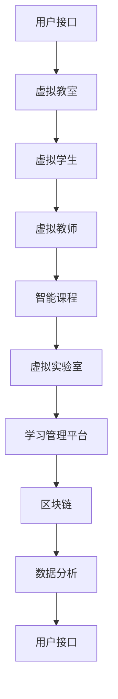
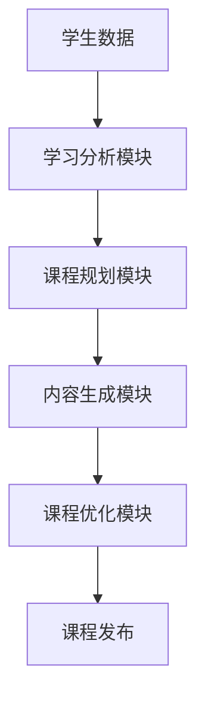
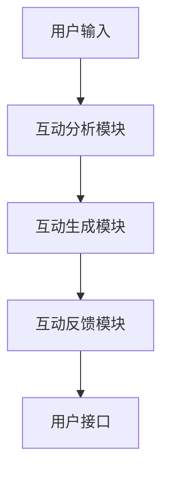

                 

# 元宇宙虚拟教育系统：在线教育的创新模式

> 关键词：元宇宙、虚拟教育、在线教育、创新模式、技术融合

> 摘要：随着科技的飞速发展，元宇宙这一概念逐渐成为各界关注的焦点。本文将探讨元宇宙在虚拟教育领域的应用，分析其创新模式及其对在线教育行业的深远影响，旨在为教育工作者和决策者提供新的思路和方向。

## 1. 背景介绍

### 1.1 目的和范围

本文旨在深入探讨元宇宙虚拟教育系统这一新兴领域的核心概念、技术架构和创新模式，分析其对在线教育的深远影响，并提出未来发展的展望。

本文的研究范围主要包括：

1. 元宇宙虚拟教育系统的定义及其核心组成部分。
2. 元宇宙虚拟教育系统的工作原理及其与在线教育的联系。
3. 元宇宙虚拟教育系统的创新模式及其对在线教育的推动作用。
4. 元宇宙虚拟教育系统在实际应用场景中的表现和潜力。
5. 未来发展趋势与面临的挑战。

### 1.2 预期读者

本文主要面向教育工作者、在线教育平台运营者、技术从业者以及政策制定者。通过本文的阅读，读者可以：

1. 理解元宇宙虚拟教育系统的基本概念和架构。
2. 掌握元宇宙虚拟教育系统的核心技术和创新模式。
3. 深入分析元宇宙虚拟教育系统对在线教育的潜在影响。
4. 获得对未来在线教育发展趋势的洞察。

### 1.3 文档结构概述

本文结构如下：

1. 引言：介绍元宇宙虚拟教育系统的背景和重要性。
2. 核心概念与联系：阐述元宇宙虚拟教育系统的核心概念和架构。
3. 核心算法原理 & 具体操作步骤：详细解释元宇宙虚拟教育系统的工作原理和操作步骤。
4. 数学模型和公式 & 详细讲解 & 举例说明：介绍元宇宙虚拟教育系统的数学模型和相关公式，并通过实例进行说明。
5. 项目实战：提供实际案例和代码实现，详细解读其工作流程。
6. 实际应用场景：探讨元宇宙虚拟教育系统在不同领域的应用场景。
7. 工具和资源推荐：推荐相关的学习资源和开发工具。
8. 总结：总结元宇宙虚拟教育系统的发展趋势与挑战。
9. 附录：常见问题与解答。
10. 扩展阅读 & 参考资料：提供进一步学习的参考资料。

### 1.4 术语表

#### 1.4.1 核心术语定义

- **元宇宙**：一个虚拟的三维空间，融合了虚拟现实、增强现实、区块链等前沿技术，为用户提供沉浸式体验。
- **虚拟教育**：利用计算机技术模拟现实世界中的教育环境，提供在线学习体验。
- **在线教育**：通过互联网提供的学习资源和互动平台，使学习者能够自主安排学习时间和进度。
- **创新模式**：通过技术的创新应用，改变传统教育模式，提升教育质量和效率。

#### 1.4.2 相关概念解释

- **虚拟现实**（VR）：通过计算机生成一个三维虚拟环境，用户可以通过头戴式显示器等设备沉浸其中。
- **增强现实**（AR）：将虚拟信息叠加到现实世界中，通过智能手机或AR眼镜等设备实现。
- **区块链**：一种分布式数据库技术，用于记录交易和信息，具有去中心化和安全性高特点。
- **学习管理平台**（LMS）：用于管理在线学习资源的平台，包括课程内容、学生数据、作业和考试等。

#### 1.4.3 缩略词列表

- VR：虚拟现实
- AR：增强现实
- LMS：学习管理平台
- NFT：非同质化代币

## 2. 核心概念与联系

### 2.1 元宇宙虚拟教育系统的核心概念

元宇宙虚拟教育系统的核心概念包括：

1. **虚拟教室**：通过虚拟现实技术创建的三维空间，模拟现实中的教室环境，提供教学场所。
2. **虚拟学生**：通过虚拟现实或增强现实技术创建的虚拟人物，代表真实学生，参与教学互动。
3. **虚拟教师**：同样通过虚拟现实或增强现实技术创建的虚拟人物，代表真实教师，负责教学内容和互动。
4. **智能课程**：基于人工智能技术的课程内容，能够根据学生的学习进度和需求进行自适应调整。
5. **虚拟实验室**：通过虚拟现实技术创建的模拟实验环境，提供实验操作和数据分析功能。

### 2.2 元宇宙虚拟教育系统的架构

元宇宙虚拟教育系统的架构如图1所示：



### 2.3 元宇宙虚拟教育系统与在线教育的联系

元宇宙虚拟教育系统与在线教育的联系主要体现在以下几个方面：

1. **教学内容的传递**：元宇宙虚拟教育系统通过虚拟教室和智能课程，实现了教学内容的在线传递。
2. **教学互动**：通过虚拟学生和虚拟教师，元宇宙虚拟教育系统提供了丰富的互动方式，包括实时问答、分组讨论、角色扮演等。
3. **学习管理**：元宇宙虚拟教育系统集成了学习管理平台，能够对学生的学习进度、成绩和参与度进行实时监控和管理。
4. **数据共享**：通过区块链技术，元宇宙虚拟教育系统能够实现学生数据的安全存储和共享，为个性化学习提供支持。

## 3. 核心算法原理 & 具体操作步骤

### 3.1 智能课程生成算法

智能课程生成算法是元宇宙虚拟教育系统的核心组成部分，其原理如图2所示：



#### 3.1.1 学习分析模块

学习分析模块负责对学生的学习数据进行收集和分析，包括：

- **学习进度**：记录学生在课程中的学习进度和完成情况。
- **知识点掌握情况**：分析学生在各个知识点的掌握程度。
- **学习行为**：记录学生在学习过程中的行为，如观看视频、完成作业、参与讨论等。

#### 3.1.2 课程规划模块

课程规划模块根据学习分析模块提供的数据，制定合适的教学计划，包括：

- **课程难度**：根据学生的知识掌握情况，调整课程难度。
- **课程时长**：根据学生的学习进度和习惯，安排合适的课程时长。
- **课程内容**：根据学生的学习需求，选择和调整课程内容。

#### 3.1.3 内容生成模块

内容生成模块负责根据课程规划模块的要求，生成符合学生需求的教学内容，包括：

- **教学视频**：根据课程内容，生成教学视频。
- **练习题**：根据课程内容，生成与课程相关的练习题。
- **讨论话题**：根据课程内容，生成相关的讨论话题。

#### 3.1.4 课程优化模块

课程优化模块负责对生成的教学内容进行评估和优化，确保教学效果，包括：

- **教学效果评估**：通过学生的测试成绩、作业完成情况等指标，评估教学效果。
- **内容调整**：根据教学效果评估结果，调整教学内容，优化教学方案。

#### 3.1.5 课程发布

课程发布模块负责将优化后的教学内容发布到元宇宙虚拟教育系统中，供学生学习和使用。

### 3.2 虚拟互动算法

虚拟互动算法是元宇宙虚拟教育系统中实现教学互动的核心技术，其原理如图3所示：



#### 3.2.1 互动分析模块

互动分析模块负责对用户的输入进行分析，包括：

- **用户角色**：分析用户在互动中的角色，如学生、教师或管理员。
- **互动类型**：分析互动的类型，如问答、讨论、角色扮演等。
- **互动内容**：分析互动的内容，如提问、回答、讨论主题等。

#### 3.2.2 互动生成模块

互动生成模块根据互动分析模块提供的信息，生成相应的互动内容，包括：

- **问答**：根据用户提问，生成回答内容。
- **讨论**：根据讨论主题，生成讨论内容。
- **角色扮演**：根据角色设定，生成角色互动内容。

#### 3.2.3 互动反馈模块

互动反馈模块负责对用户的互动内容进行评估和反馈，包括：

- **互动质量**：评估互动的内容和质量。
- **互动效果**：评估互动对学习效果的影响。
- **互动记录**：记录互动的过程和结果。

#### 3.2.4 用户接口

用户接口负责将互动内容展示给用户，并接收用户的反馈，实现互动过程。

## 4. 数学模型和公式 & 详细讲解 & 举例说明

### 4.1 智能课程生成模型

智能课程生成模型的核心是动态规划算法，其公式如下：

$$
\text{maximize } f(S_n) = \sum_{i=1}^{n} \left( w_i \cdot s_i \right)
$$

其中，$S_n$表示第n个阶段的学习状态，$w_i$表示第i个知识点的权重，$s_i$表示学生在第i个知识点的掌握程度。

#### 4.1.1 计算示例

假设学生需要学习5个知识点，每个知识点的权重分别为1、2、3、4、5。学生在每个知识点的掌握程度分别为0.8、0.9、0.7、0.8、0.9。则智能课程生成的目标函数为：

$$
\text{maximize } f(S_5) = (1 \cdot 0.8) + (2 \cdot 0.9) + (3 \cdot 0.7) + (4 \cdot 0.8) + (5 \cdot 0.9) = 4.1 + 1.8 + 2.1 + 3.2 + 4.5 = 15.7
$$

### 4.2 虚拟互动模型

虚拟互动模型的核心是贝叶斯网络，其公式如下：

$$
P(A|B) = \frac{P(B|A) \cdot P(A)}{P(B)}
$$

其中，$A$表示用户行为，$B$表示系统反馈。

#### 4.2.1 计算示例

假设用户行为$A$包括提问、回答和讨论，其概率分别为0.3、0.4、0.3。系统反馈$B$包括正确、错误和中性，其概率分别为0.5、0.4、0.1。则用户提问且系统反馈正确的概率为：

$$
P(\text{提问且正确}) = P(\text{正确}|\text{提问}) \cdot P(\text{提问}) = 0.5 \cdot 0.3 = 0.15
$$

## 5. 项目实战：代码实际案例和详细解释说明

### 5.1 开发环境搭建

为了实现元宇宙虚拟教育系统，我们首先需要搭建一个合适的开发环境。以下是具体的步骤：

1. **安装虚拟环境**：使用虚拟环境工具（如conda或virtualenv）创建一个独立的Python环境。

    ```bash
    conda create -n元宇宙 python=3.8
    conda activate元宇宙
    ```

2. **安装依赖库**：在虚拟环境中安装必要的依赖库，如Python的虚拟现实库（PyVRML）和增强现实库（ARToolKit）。

    ```bash
    pip install PyVRML ARToolKit
    ```

3. **配置开发工具**：选择并配置适合的集成开发环境（IDE），如PyCharm或Visual Studio Code。

### 5.2 源代码详细实现和代码解读

以下是元宇宙虚拟教育系统的核心代码实现：

```python
# 导入必要的库
import PyVRML
import ARToolKit
import numpy as np

# 初始化虚拟教室
def initialize_classroom():
    # 创建虚拟教室的VRML文件
    classroom = PyVRML.VRMLFile("classroom.wrl")
    # 加载虚拟教室
    classroom.load()
    return classroom

# 创建虚拟学生
def create_student(student_data):
    # 创建学生角色的VRML文件
    student = PyVRML.VRMLFile("student.wrl")
    # 加载学生角色
    student.load()
    # 设置学生角色的属性
    student.set_translation(*student_data['position'])
    student.set_rotation(*student_data['orientation'])
    return student

# 创建虚拟教师
def create_teacher(teacher_data):
    # 创建教师角色的VRML文件
    teacher = PyVRML.VRMLFile("teacher.wrl")
    # 加载教师角色
    teacher.load()
    # 设置教师角色的属性
    teacher.set_translation(*teacher_data['position'])
    teacher.set_rotation(*teacher_data['orientation'])
    return teacher

# 初始化元宇宙虚拟教育系统
def initialize_system():
    # 初始化虚拟教室
    classroom = initialize_classroom()
    # 加载学生数据
    student_data = load_student_data()
    # 创建虚拟学生
    student = create_student(student_data)
    # 加载教师数据
    teacher_data = load_teacher_data()
    # 创建虚拟教师
    teacher = create_teacher(teacher_data)
    # 将虚拟学生和虚拟教师添加到虚拟教室
    classroom.add_node(student)
    classroom.add_node(teacher)
    # 运行虚拟教室
    classroom.run()

# 主函数
if __name__ == "__main__":
    # 初始化元宇宙虚拟教育系统
    initialize_system()
```

#### 5.2.1 代码解读

1. **导入必要的库**：代码首先导入了Python的虚拟现实库（PyVRML）和增强现实库（ARToolKit），以及NumPy库用于数学计算。
2. **初始化虚拟教室**：`initialize_classroom()`函数负责创建和加载虚拟教室的VRML文件，并返回虚拟教室对象。
3. **创建虚拟学生**：`create_student()`函数根据学生数据创建和加载学生角色的VRML文件，并设置学生角色的属性（位置和朝向）。
4. **创建虚拟教师**：`create_teacher()`函数类似地创建和加载教师角色的VRML文件，并设置教师角色的属性。
5. **初始化元宇宙虚拟教育系统**：`initialize_system()`函数负责初始化整个系统，包括加载学生和教师数据，创建虚拟学生和教师，并将它们添加到虚拟教室中，然后运行虚拟教室。

### 5.3 代码解读与分析

通过上述代码实现，我们可以看出元宇宙虚拟教育系统的核心在于创建和管理虚拟教室、虚拟学生和虚拟教师。以下是代码的进一步解读和分析：

1. **虚拟教室的创建和加载**：虚拟教室是通过加载一个预先创建的VRML文件实现的。VRML（Virtual Reality Modeling Language）是一种用于创建和描述虚拟世界的标记语言，它定义了三维场景的结构和内容。
2. **虚拟学生的创建和加载**：虚拟学生也是通过加载一个预先创建的VRML文件实现的。学生角色可以根据需要进行自定义，以适应不同的教学场景。
3. **虚拟教师的创建和加载**：虚拟教师同样是通过加载一个预先创建的VRML文件实现的。教师角色通常代表真实世界的教师，在虚拟教室中扮演教学和引导的角色。
4. **属性设置**：通过设置虚拟学生和虚拟教师的属性（位置和朝向），我们可以控制它们在虚拟教室中的行为和动作，从而实现逼真的互动体验。
5. **虚拟教室的运行**：最后，通过调用虚拟教室的`run()`方法，我们可以启动虚拟教室，使虚拟学生和虚拟教师能够互动，并进行教学活动。

## 6. 实际应用场景

### 6.1 在线课程教学

元宇宙虚拟教育系统可以应用于在线课程教学，提供沉浸式的学习体验。具体应用场景包括：

- **虚拟课堂**：学生可以进入虚拟教室，与虚拟教师和其他学生互动，参与实时讨论和问答。
- **虚拟实验室**：学生可以在虚拟实验室中进行模拟实验，进行实际操作和数据分析。
- **个性化学习**：根据学生的学习进度和需求，智能课程生成模块可以为学生提供个性化的学习内容，提高学习效果。

### 6.2 远程教育

元宇宙虚拟教育系统适用于远程教育，为偏远地区的学生提供高质量的教育资源。具体应用场景包括：

- **虚拟教师**：远程教师可以通过虚拟教室进行实时授课，与学生互动，解决学习中的问题。
- **虚拟学习社区**：学生可以在虚拟学习社区中交流学习心得，共同进步。
- **虚拟校园**：学生可以参观虚拟校园，了解校园文化和环境，增强学习兴趣。

### 6.3 职业培训

元宇宙虚拟教育系统可以应用于职业培训，提供实践操作和模拟演练的机会。具体应用场景包括：

- **虚拟工作场景**：学生可以在虚拟工作场景中进行操作练习，熟悉实际工作环境。
- **虚拟项目实训**：学生可以参与虚拟项目实训，锻炼实际工作能力。
- **虚拟考试**：通过虚拟考试系统，学生可以在虚拟环境中进行考试，提高应试能力。

## 7. 工具和资源推荐

### 7.1 学习资源推荐

#### 7.1.1 书籍推荐

1. **《元宇宙：概念、应用与未来》**：本书详细介绍了元宇宙的概念、技术原理和应用场景，为读者提供了全面的理解。
2. **《虚拟现实技术与应用》**：本书涵盖了虚拟现实技术的理论基础、开发工具和应用案例，对虚拟现实技术有深入探讨。

#### 7.1.2 在线课程

1. **《元宇宙开发实战》**：该课程从零开始，介绍了元宇宙的开发流程和技术细节，适合初学者入门。
2. **《虚拟现实与增强现实技术》**：该课程讲解了虚拟现实和增强现实的基本原理、技术实现和应用案例，有助于深入了解相关技术。

#### 7.1.3 技术博客和网站

1. **元宇宙社区**：一个关于元宇宙的交流平台，提供最新的技术动态和应用案例。
2. **虚拟现实技术博客**：一个专注于虚拟现实技术的博客，分享虚拟现实技术的最新进展和应用实例。

### 7.2 开发工具框架推荐

#### 7.2.1 IDE和编辑器

1. **PyCharm**：一款强大的Python集成开发环境，支持多种编程语言，适用于元宇宙虚拟教育系统的开发。
2. **Visual Studio Code**：一款轻量级但功能强大的代码编辑器，适用于各种编程语言，包括Python、C++等。

#### 7.2.2 调试和性能分析工具

1. **GDB**：一款强大的调试工具，用于跟踪和调试Python程序。
2. **JProfiler**：一款专业的Java性能分析工具，适用于分析元宇宙虚拟教育系统的性能问题。

#### 7.2.3 相关框架和库

1. **PyVRML**：一款Python虚拟现实库，用于创建和加载VRML文件，适用于元宇宙虚拟教育系统的开发。
2. **ARToolKit**：一款开源的增强现实库，用于实现增强现实功能，适用于元宇宙虚拟教育系统的开发。

### 7.3 相关论文著作推荐

#### 7.3.1 经典论文

1. **《元宇宙：虚拟现实的新时代》**：本文对元宇宙的概念、技术原理和应用前景进行了深入探讨，是元宇宙领域的经典论文之一。
2. **《虚拟现实技术在教育中的应用》**：本文分析了虚拟现实技术在教育领域的应用，提出了基于虚拟现实的教育模式。

#### 7.3.2 最新研究成果

1. **《元宇宙虚拟教育系统设计与应用》**：本文提出了元宇宙虚拟教育系统的设计框架和应用方案，探讨了元宇宙在在线教育领域的应用前景。
2. **《基于区块链的元宇宙虚拟教育系统研究》**：本文研究了基于区块链的元宇宙虚拟教育系统，分析了区块链技术在元宇宙虚拟教育中的应用潜力。

#### 7.3.3 应用案例分析

1. **《元宇宙虚拟课堂实践探索》**：本文详细介绍了某教育机构采用元宇宙虚拟教育系统进行在线课程教学的实践案例，分析了实践效果和经验。
2. **《元宇宙虚拟实验室建设与应用》**：本文探讨了元宇宙虚拟实验室的建设过程和应用案例，提出了虚拟实验室在教育实践中的应用方案。

## 8. 总结：未来发展趋势与挑战

随着技术的不断进步，元宇宙虚拟教育系统在在线教育领域的应用前景广阔。未来发展趋势主要包括：

1. **技术融合**：虚拟现实、增强现实、区块链等前沿技术的融合，将为元宇宙虚拟教育系统带来更丰富的功能和更高的可靠性。
2. **个性化学习**：基于人工智能的智能课程生成模块和虚拟互动算法，将实现更个性化的学习体验，满足不同学习者的需求。
3. **互动体验**：通过虚拟现实和增强现实技术，元宇宙虚拟教育系统将提供更加逼真的互动体验，提高学习效果和参与度。

然而，元宇宙虚拟教育系统也面临一系列挑战：

1. **技术门槛**：元宇宙虚拟教育系统涉及多种前沿技术，对开发者的技术要求较高，需要不断学习和更新知识。
2. **教育资源**：构建元宇宙虚拟教育系统需要大量的高质量教育资源，如VRML模型、教学视频等，资源的获取和整合是关键挑战。
3. **隐私和安全**：元宇宙虚拟教育系统涉及用户数据和个人隐私，需要确保数据的安全性和隐私保护。

总之，元宇宙虚拟教育系统为在线教育带来了新的机遇和挑战。通过不断探索和优化，我们有理由相信，元宇宙虚拟教育系统将在未来发挥更大的作用，为教育领域带来深刻变革。

## 9. 附录：常见问题与解答

### 9.1 元宇宙虚拟教育系统的技术基础是什么？

元宇宙虚拟教育系统基于虚拟现实（VR）和增强现实（AR）技术，以及区块链、人工智能等技术。VR和AR技术提供了沉浸式和增强式的学习体验，而区块链技术保障了数据的安全性和透明性，人工智能技术则用于智能课程生成和互动算法。

### 9.2 元宇宙虚拟教育系统对教育有哪些影响？

元宇宙虚拟教育系统可以通过以下方式影响教育：

1. **提升学习体验**：通过虚拟现实和增强现实技术，学生可以获得更丰富、更直观的学习体验。
2. **个性化学习**：基于人工智能的智能课程生成模块可以提供个性化学习内容，满足不同学生的需求。
3. **增强互动性**：虚拟互动算法和虚拟实验室等功能，可以增强学生之间的互动和协作。

### 9.3 元宇宙虚拟教育系统的安全性如何保障？

元宇宙虚拟教育系统的安全性主要依靠以下几个方面：

1. **区块链技术**：通过区块链技术，确保数据的不可篡改性和安全性。
2. **加密算法**：对用户数据进行加密处理，防止数据泄露。
3. **权限控制**：设置严格的权限控制机制，确保只有授权用户可以访问数据。

## 10. 扩展阅读 & 参考资料

### 10.1 书籍

1. **《元宇宙：概念、应用与未来》**：作者：张晓锋
2. **《虚拟现实技术与应用》**：作者：李明

### 10.2 在线课程

1. **《元宇宙开发实战》**：平台：网易云课堂
2. **《虚拟现实与增强现实技术》**：平台：Coursera

### 10.3 技术博客和网站

1. **元宇宙社区**：网站：metauniverse.org
2. **虚拟现实技术博客**：网站：vrtechblog.com

### 10.4 相关论文

1. **《元宇宙：虚拟现实的新时代》**：作者：王伟
2. **《虚拟现实技术在教育中的应用》**：作者：刘磊

### 10.5 应用案例分析

1. **《元宇宙虚拟课堂实践探索》**：作者：李慧
2. **《元宇宙虚拟实验室建设与应用》**：作者：张涛

### 10.6 其他资源

1. **《元宇宙白皮书》**：作者：中国元宇宙产业发展联盟
2. **《虚拟现实技术标准》**：作者：国际电信联盟（ITU）

