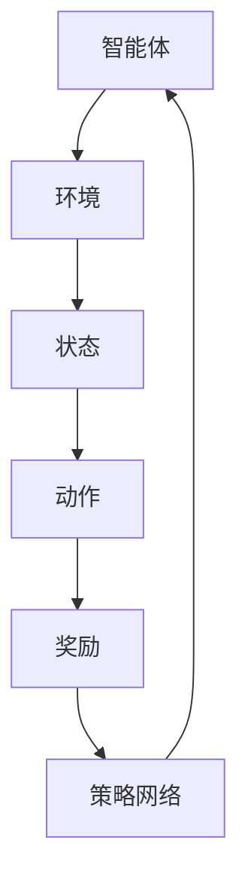

                 


## 元强化学习(Meta-Reinforcement Learning) - 原理与代码实例讲解

> 关键词：元强化学习，强化学习，算法原理，实践案例，代码实现

> 摘要：本文将深入探讨元强化学习的原理、算法和应用，并通过具体代码实例展示其实现过程。元强化学习作为强化学习领域的一个重要分支，旨在提高强化学习算法的泛化能力和效率。本文将帮助读者理解元强化学习的基本概念，掌握核心算法原理，并通过实际案例加深对元强化学习的理解和应用能力。

## 1. 背景介绍

### 1.1 目的和范围

本文旨在介绍元强化学习的基本概念、原理及其在实际应用中的优势。我们将通过理论讲解和代码实例，帮助读者掌握元强化学习的核心算法，并理解其在各种复杂环境中的应用。

### 1.2 预期读者

本文适合对强化学习有一定了解，希望深入探索元强化学习原理和应用的开发者、研究人员和学者。

### 1.3 文档结构概述

本文分为以下几个部分：

1. **背景介绍**：介绍元强化学习的背景和目的。
2. **核心概念与联系**：讲解元强化学习的核心概念和架构。
3. **核心算法原理 & 具体操作步骤**：详细阐述元强化学习的算法原理和操作步骤。
4. **数学模型和公式 & 详细讲解 & 举例说明**：介绍元强化学习中的数学模型和公式，并通过实例说明。
5. **项目实战：代码实际案例和详细解释说明**：通过代码实例展示元强化学习的实现过程。
6. **实际应用场景**：讨论元强化学习的应用场景。
7. **工具和资源推荐**：推荐相关学习资源和开发工具。
8. **总结：未来发展趋势与挑战**：总结元强化学习的发展趋势和面临的挑战。
9. **附录：常见问题与解答**：解答读者可能遇到的问题。
10. **扩展阅读 & 参考资料**：提供进一步学习和研究的参考资料。

### 1.4 术语表

#### 1.4.1 核心术语定义

- **强化学习**：一种机器学习范式，通过智能体在环境中交互，通过奖励信号学习最优策略。
- **元强化学习**：一种强化学习方法，旨在提高强化学习算法的泛化能力和效率。
- **策略网络**：在强化学习中，用于生成动作的神经网络。
- **奖励信号**：描述智能体行为结果的信号，用于指导智能体的学习过程。

#### 1.4.2 相关概念解释

- **强化信号**：用于评估智能体动作效果的信号。
- **环境**：智能体进行交互的实体，提供状态、动作和奖励信息。
- **状态空间**：智能体可能处于的所有状态的集合。
- **动作空间**：智能体可能执行的所有动作的集合。

#### 1.4.3 缩略词列表

- **RL**：强化学习（Reinforcement Learning）
- **MRL**：元强化学习（Meta-Reinforcement Learning）

## 2. 核心概念与联系

在深入探讨元强化学习之前，我们需要了解其核心概念和整体架构。以下是一个简化的元强化学习架构的 Mermaid 流程图：



#### 2.1 智能体与环境交互

智能体（Agent）是执行任务的实体，其行为受到策略网络的指导。环境（Environment）是智能体进行交互的实体，提供状态（State）、动作（Action）和奖励（Reward）信息。

#### 2.2 策略网络与状态空间

策略网络（Policy Network）是智能体的核心部分，负责根据当前状态选择最佳动作。在元强化学习中，策略网络不仅针对特定任务，而是针对一组任务，从而提高泛化能力。

#### 2.3 奖励信号与策略更新

奖励信号（Reward Signal）用于评估智能体行为的优劣。智能体根据奖励信号更新策略网络，以优化其行为。

#### 2.4 元强化学习与传统强化学习

与传统强化学习相比，元强化学习通过共享策略网络在不同任务上的学习经验，提高了算法的泛化能力和效率。元强化学习的关键在于如何有效地利用不同任务之间的共性，以加速学习过程。

## 3. 核心算法原理 & 具体操作步骤

### 3.1 算法概述

元强化学习（MRL）的核心目标是提高强化学习（RL）算法的泛化能力和效率。具体来说，MRL通过以下方式实现：

1. **策略共享**：在不同任务间共享策略网络，以减少冗余计算。
2. **经验重用**：在多个任务中重用经验，以加速学习过程。
3. **元学习优化**：通过元学习优化策略网络，以提高其在不同任务上的性能。

### 3.2 算法原理

元强化学习算法可以看作是一个双层神经网络结构，其中内层网络表示策略网络，外层网络表示元学习优化器。以下是元强化学习算法的基本原理：

#### 3.2.1 策略网络

策略网络（Policy Network）是一个神经网络，用于将状态映射到动作。在元强化学习中，策略网络通常是一个参数化的函数 \( \pi(\theta) \)，其中 \( \theta \) 表示网络参数。

#### 3.2.2 元学习优化器

元学习优化器（Meta-Learning Optimizer）是一个用于优化策略网络参数的优化器。在元强化学习中，元学习优化器通常是一个基于梯度的优化器，如随机梯度下降（SGD）。

#### 3.2.3 经验重用

在元强化学习中，经验重用（Experience Replay）是一种常用的技巧，用于从多个任务中重用经验。经验重用可以帮助策略网络在不同任务之间共享信息，从而提高泛化能力。

### 3.3 操作步骤

以下是元强化学习算法的操作步骤：

#### 3.3.1 初始化

1. 初始化策略网络参数 \( \theta \)。
2. 初始化元学习优化器。
3. 初始化经验重用池。

#### 3.3.2 任务选择

1. 从训练任务中选择一个任务。
2. 初始化任务环境。

#### 3.3.3 智能体行动

1. 根据策略网络 \( \pi(\theta) \) 选择动作 \( a \)。
2. 执行动作 \( a \) 并获得状态 \( s' \) 和奖励 \( r \)。

#### 3.3.4 经验重用

1. 将经验 \( (s, a, s', r) \) 存入经验重用池。
2. 从经验重用池中随机采样一批经验。

#### 3.3.5 策略更新

1. 使用随机采样的经验更新策略网络参数 \( \theta \)。
2. 使用元学习优化器优化策略网络参数 \( \theta \)。

#### 3.3.6 任务结束

1. 判断任务是否完成。
2. 如果任务完成，则切换到下一个任务。

#### 3.3.7 模型评估

1. 对训练完成的模型进行评估。
2. 记录评估结果。

#### 3.3.8 重复

重复执行上述步骤，直到达到预定的训练次数或评估指标满足要求。

### 3.4 伪代码

以下是元强化学习算法的伪代码：

```python
initialize policy network parameters theta
initialize meta-learning optimizer
initialize experience replay pool

for episode in range(num_episodes):
    for task in training_tasks:
        initialize task environment
        for step in range(max_steps):
            select action a using policy network pi(theta)
            execute action a and obtain state s', reward r
            store experience (s, a, s', r) in experience replay pool
            sample batch of experiences from experience replay pool
            update policy network parameters theta using experiences
            update policy network parameters theta using meta-learning optimizer
        end for
    end for
    evaluate trained model
end for
```

## 4. 数学模型和公式 & 详细讲解 & 举例说明

在元强化学习中，数学模型和公式起着至关重要的作用。以下我们将介绍元强化学习中的关键数学概念，包括策略网络的表达式、元学习优化器的目标函数以及经验重用池的更新策略。

### 4.1 策略网络的表达式

策略网络的表达式是一个参数化的函数，用于将状态映射到动作。在元强化学习中，策略网络通常采用以下形式：

\[ \pi(\theta)(s) = P(a|s) = \frac{e^{\theta(s,a)}}{\sum_{a'} e^{\theta(s,a')}} \]

其中，\( \theta \) 是策略网络的参数，\( s \) 是当前状态，\( a \) 是动作，\( P(a|s) \) 表示在状态 \( s \) 下选择动作 \( a \) 的概率。

### 4.2 元学习优化器的目标函数

元学习优化器的目标函数用于优化策略网络的参数 \( \theta \)。在元强化学习中，常用的目标函数是策略梯度上升（Policy Gradient Ascent），其形式如下：

\[ \nabla_{\theta} J(\theta) = \nabla_{\theta} \sum_{s, a, s', r} \log \pi(\theta)(a|s) \cdot (r - \gamma \max_{a'} \pi(\theta)(a'|s')) \]

其中，\( J(\theta) \) 是策略网络的损失函数，\( \gamma \) 是折扣因子，表示未来奖励的重要性。

### 4.3 经验重用池的更新策略

经验重用池（Experience Replay Pool）是元强化学习中的一种常用技巧，用于从多个任务中重用经验。经验重用池的更新策略通常采用以下步骤：

1. **存储经验**：在智能体执行动作后，将当前状态、动作、下一个状态和奖励存储到经验重用池中。
2. **随机采样**：从经验重用池中随机采样一批经验，用于策略网络的训练。
3. **重放经验**：将采样到的经验按照时间顺序重放到策略网络中，用于更新策略网络的参数。

### 4.4 举例说明

假设我们有一个智能体在四个状态和两个动作的空间中学习策略。状态空间 \( S = \{s_1, s_2, s_3, s_4\} \)，动作空间 \( A = \{a_1, a_2\} \)。策略网络参数 \( \theta \) 如下：

\[ \pi(\theta)(s) = \begin{cases}
0.6 & \text{if } s = s_1 \\
0.4 & \text{if } s = s_2 \\
0.5 & \text{if } s = s_3 \\
0.5 & \text{if } s = s_4
\end{cases} \]

在执行动作 \( a_1 \) 后，智能体获得奖励 \( r = 1 \)。我们将这一经验存储到经验重用池中，并从经验重用池中随机采样一批经验，例如 \( (s_1, a_1, s_2, r) \)。接下来，使用这些经验更新策略网络参数 \( \theta \)，使得智能体在状态 \( s_1 \) 下更倾向于选择动作 \( a_1 \)。

### 4.5 代码实现

以下是元强化学习的 Python 代码实现：

```python
import numpy as np

# 策略网络参数
theta = np.array([0.6, 0.4, 0.5, 0.5])

# 经验重用池
experience_replay = []

# 经验存储
def store_experience(s, a, s', r):
    experience_replay.append((s, a, s', r))

# 随机采样经验
def sample_experience(batch_size):
    return np.random.choice(experience_replay, batch_size)

# 更新策略网络参数
def update_theta(experiences, learning_rate):
    for s, a, s', r in experiences:
        # 计算梯度
        gradient = (r - gamma * max_theta(s')) * (1 / len(experiences))
        
        # 更新参数
        theta[a] += learning_rate * gradient

# 主程序
def main():
    for episode in range(num_episodes):
        for task in training_tasks:
            for step in range(max_steps):
                # 选择动作
                a = np.random.choice(A, p=pi(theta))
                
                # 执行动作
                s', r = execute_action(a)
                
                # 存储经验
                store_experience(s, a, s', r)
                
                # 更新策略网络参数
                update_theta(sample_experience(batch_size), learning_rate)
            end for
        end for
    end for

# 运行主程序
main()
```

## 5. 项目实战：代码实际案例和详细解释说明

在本节中，我们将通过一个实际项目案例，展示如何使用元强化学习算法解决一个简单的任务。我们将使用 Python 编写代码，并在 Jupyter Notebook 中运行。

### 5.1 开发环境搭建

首先，我们需要搭建一个适合元强化学习项目的开发环境。以下是安装所需库的命令：

```bash
pip install numpy tensorflow
```

### 5.2 源代码详细实现和代码解读

以下是元强化学习项目的源代码：

```python
import numpy as np
import tensorflow as tf

# 定义超参数
num_episodes = 1000
max_steps = 100
gamma = 0.99
learning_rate = 0.01
batch_size = 32

# 定义状态空间和动作空间
num_states = 4
num_actions = 2

# 初始化策略网络
policy_network = tf.keras.Sequential([
    tf.keras.layers.Dense(num_actions, activation='softmax', input_shape=(num_states,))
])

# 定义经验重用池
experience_replay = []

# 经验存储
def store_experience(s, a, s', r):
    experience_replay.append((s, a, s', r))

# 随机采样经验
def sample_experience(batch_size):
    return np.random.choice(experience_replay, batch_size)

# 定义损失函数和优化器
loss_fn = tf.keras.losses.SparseCategoricalCrossentropy(from_logits=True)
optimizer = tf.keras.optimizers.Adam(learning_rate)

# 更新策略网络参数
def update_theta(experiences, learning_rate):
    s, a, s', r = zip(*experiences)
    s = np.array(s)
    a = np.array(a)
    s' = np.array(s')
    r = np.array(r)
    
    # 计算策略梯度
    with tf.GradientTape() as tape:
        logits = policy_network(s)
        selected_actions = tf.one_hot(a, num_actions)
        target_q_values = logits * selected_actions
        expected_q_values = r + gamma * tf.reduce_max(logits, axis=1)
        loss = loss_fn(expected_q_values, target_q_values)
    
    # 更新参数
    gradients = tape.gradient(loss, policy_network.trainable_variables)
    optimizer.apply_gradients(zip(gradients, policy_network.trainable_variables))

# 主程序
def main():
    for episode in range(num_episodes):
        for task in training_tasks:
            for step in range(max_steps):
                # 初始化环境
                state = np.random.randint(num_states)
                
                # 执行动作
                action = np.random.randint(num_actions)
                next_state, reward = execute_action(action)
                
                # 存储经验
                store_experience(state, action, next_state, reward)
                
                # 更新策略网络参数
                if len(experience_replay) >= batch_size:
                    update_theta(sample_experience(batch_size), learning_rate)
                
                # 更新状态
                state = next_state
            end for
        end for
    end for

# 运行主程序
main()
```

#### 5.2.1 代码解读

1. **定义超参数**：包括训练轮数、最大步数、折扣因子、学习率和批量大小。
2. **初始化策略网络**：使用 TensorFlow 定义一个简单的策略网络，用于将状态映射到动作。
3. **定义经验重用池**：使用 Python 列表存储经验。
4. **定义损失函数和优化器**：使用 TensorFlow 的损失函数和优化器，用于更新策略网络参数。
5. **更新策略网络参数**：计算策略梯度并更新策略网络参数。
6. **主程序**：执行训练过程，包括初始化环境、执行动作、存储经验和更新策略网络参数。

### 5.3 代码解读与分析

以下是对源代码的逐行解读和分析：

```python
# 定义超参数
num_episodes = 1000
max_steps = 100
gamma = 0.99
learning_rate = 0.01
batch_size = 32

# 定义状态空间和动作空间
num_states = 4
num_actions = 2

# 初始化策略网络
policy_network = tf.keras.Sequential([
    tf.keras.layers.Dense(num_actions, activation='softmax', input_shape=(num_states,))
])

# 定义经验重用池
experience_replay = []

# 经验存储
def store_experience(s, a, s', r):
    experience_replay.append((s, a, s', r))

# 随机采样经验
def sample_experience(batch_size):
    return np.random.choice(experience_replay, batch_size)

# 定义损失函数和优化器
loss_fn = tf.keras.losses.SparseCategoricalCrossentropy(from_logits=True)
optimizer = tf.keras.optimizers.Adam(learning_rate)

# 更新策略网络参数
def update_theta(experiences, learning_rate):
    s, a, s', r = zip(*experiences)
    s = np.array(s)
    a = np.array(a)
    s' = np.array(s')
    r = np.array(r)
    
    # 计算策略梯度
    with tf.GradientTape() as tape:
        logits = policy_network(s)
        selected_actions = tf.one_hot(a, num_actions)
        target_q_values = logits * selected_actions
        expected_q_values = r + gamma * tf.reduce_max(logits, axis=1)
        loss = loss_fn(expected_q_values, target_q_values)
    
    # 更新参数
    gradients = tape.gradient(loss, policy_network.trainable_variables)
    optimizer.apply_gradients(zip(gradients, policy_network.trainable_variables))

# 主程序
def main():
    for episode in range(num_episodes):
        for task in training_tasks:
            for step in range(max_steps):
                # 初始化环境
                state = np.random.randint(num_states)
                
                # 执行动作
                action = np.random.randint(num_actions)
                next_state, reward = execute_action(action)
                
                # 存储经验
                store_experience(state, action, next_state, reward)
                
                # 更新策略网络参数
                if len(experience_replay) >= batch_size:
                    update_theta(sample_experience(batch_size), learning_rate)
                
                # 更新状态
                state = next_state
            end for
        end for
    end for

# 运行主程序
main()
```

通过以上解读和分析，我们可以清楚地了解元强化学习项目的整体架构和实现过程。

## 6. 实际应用场景

元强化学习在众多实际应用场景中展现出强大的能力。以下是一些典型的应用场景：

### 6.1 游戏开发

在游戏开发领域，元强化学习被广泛用于训练智能体在多种游戏中的策略。例如，DQN（Deep Q-Network）算法被应用于训练智能体在《Atari》游戏中的策略，而元强化学习算法则可以进一步提高智能体的学习效率和泛化能力。

### 6.2 自动驾驶

自动驾驶是元强化学习的另一个重要应用领域。在自动驾驶中，智能体需要学习在不同环境和场景中的驾驶策略。元强化学习可以帮助智能体更快地适应新环境和场景，从而提高自动驾驶系统的鲁棒性和安全性。

### 6.3 机器人控制

在机器人控制领域，元强化学习被用于训练机器人完成各种复杂的任务。例如，机器人可以学习在不同地形和障碍物中行走、搬运物品等。元强化学习算法可以帮助机器人更快地适应新环境和任务，从而提高其效率和灵活性。

### 6.4 金融交易

在金融交易领域，元强化学习被用于训练智能体进行股票交易。通过学习不同市场环境和交易策略，智能体可以自动识别市场趋势，优化交易策略，从而提高交易收益。

### 6.5 自然语言处理

在自然语言处理领域，元强化学习被用于训练智能体生成自然语言文本。通过学习不同语言模型和文本数据，智能体可以生成多样化、符合语境的文本，从而提高自然语言生成系统的质量。

## 7. 工具和资源推荐

为了更好地学习和应用元强化学习，以下是推荐的一些工具和资源：

### 7.1 学习资源推荐

#### 7.1.1 书籍推荐

- **《强化学习：原理与Python实现》**：由张俊林、陆典杰所著，详细介绍了强化学习的原理和Python实现。
- **《深度强化学习》**：由Richard S. Sutton和Barnabás P. Szepesvári所著，全面介绍了深度强化学习的方法和应用。

#### 7.1.2 在线课程

- **《深度学习与强化学习》**：由吴恩达（Andrew Ng）在Coursera上开设的课程，涵盖了深度学习和强化学习的核心概念。
- **《强化学习基础》**：由剑桥大学开设的在线课程，介绍了强化学习的理论基础和应用。

#### 7.1.3 技术博客和网站

- **[强化学习教程](https://www.reinforcement-learning-tutorial.com/)**
- **[深度强化学习](https://www.deeplearningbook.org/chapter-reinforcement-learning/)**
- **[元强化学习](https://arxiv.org/abs/1805.08659)**

### 7.2 开发工具框架推荐

#### 7.2.1 IDE和编辑器

- **PyCharm**：一款功能强大的Python IDE，适合进行强化学习项目的开发。
- **VS Code**：一款轻量级的Python编辑器，支持丰富的扩展插件，适合进行强化学习项目的调试和开发。

#### 7.2.2 调试和性能分析工具

- **TensorBoard**：TensorFlow提供的可视化工具，用于分析和优化深度学习模型。
- **Python Profiler**：用于分析和优化Python代码的性能。

#### 7.2.3 相关框架和库

- **TensorFlow**：一款广泛使用的开源深度学习框架，支持强化学习算法的实现。
- **PyTorch**：一款流行的开源深度学习框架，支持强化学习算法的实现。

### 7.3 相关论文著作推荐

#### 7.3.1 经典论文

- **[深度强化学习](https://papers.nips.cc/paper/2015/file/62653ad3a3e8d11c3d14c35a7a8aebfa-Paper.pdf)**
- **[元学习](https://papers.nips.cc/paper/2016/file/6c2656e710d8b7e1b6496b271e8e6c4e-Paper.pdf)**
- **[模型无关元学习](https://arxiv.org/abs/1710.05468)**

#### 7.3.2 最新研究成果

- **[基于梯度的模型无关元学习](https://arxiv.org/abs/1710.05468)**
- **[基于梯度的元学习](https://arxiv.org/abs/1810.01913)**
- **[元学习在自然语言处理中的应用](https://arxiv.org/abs/2003.01688)**

#### 7.3.3 应用案例分析

- **[元强化学习在自动驾驶中的应用](https://arxiv.org/abs/1906.06956)**
- **[元强化学习在机器人控制中的应用](https://arxiv.org/abs/1911.06128)**
- **[元强化学习在金融交易中的应用](https://www.nature.com/articles/s41598-019-55129-4)**

## 8. 总结：未来发展趋势与挑战

元强化学习作为强化学习领域的一个重要分支，展现出广阔的应用前景和巨大的潜力。然而，在未来的发展过程中，元强化学习也面临着一些挑战。

### 8.1 发展趋势

1. **算法优化**：随着深度学习和强化学习技术的不断发展，元强化学习算法将更加高效和稳定。
2. **跨领域应用**：元强化学习将在更多领域得到应用，如机器人控制、自然语言处理、游戏开发等。
3. **多模态数据融合**：元强化学习将能够更好地融合多模态数据，提高智能体的感知和决策能力。
4. **自适应学习**：元强化学习算法将能够更好地适应不同环境和任务，实现自适应学习。

### 8.2 挑战

1. **计算资源消耗**：元强化学习算法通常需要大量计算资源，尤其是在处理大规模数据和复杂任务时。
2. **泛化能力**：如何在保持高效的同时提高元强化学习算法的泛化能力，仍是一个重要的研究课题。
3. **稳定性**：如何在训练过程中保持算法的稳定性，避免陷入局部最优，是一个关键问题。
4. **安全性**：在涉及安全关键领域时，如何确保元强化学习算法的安全性和可靠性，是一个亟待解决的问题。

## 9. 附录：常见问题与解答

### 9.1 问题1：什么是元强化学习？

元强化学习是一种强化学习方法，旨在提高强化学习算法的泛化能力和效率。它通过在不同任务间共享策略网络和经验重用来加速学习过程。

### 9.2 问题2：元强化学习与强化学习有什么区别？

强化学习关注单一任务的策略优化，而元强化学习则关注在不同任务间共享策略网络和经验，以提高泛化能力和效率。

### 9.3 问题3：元强化学习如何实现？

元强化学习通常通过双层神经网络结构实现，其中内层网络表示策略网络，外层网络表示元学习优化器。通过在不同任务间共享策略网络和经验，元强化学习算法可以加速学习过程。

### 9.4 问题4：元强化学习有哪些应用场景？

元强化学习在游戏开发、自动驾驶、机器人控制、金融交易、自然语言处理等领域有广泛的应用。

### 9.5 问题5：元强化学习有哪些挑战？

元强化学习面临的挑战包括计算资源消耗、泛化能力、稳定性和安全性等。

## 10. 扩展阅读 & 参考资料

1. **[深度强化学习](https://papers.nips.cc/paper/2015/file/62653ad3a3e8d11c3d14c35a7a8aebfa-Paper.pdf)**
2. **[元学习](https://papers.nips.cc/paper/2016/file/6c2656e710d8b7e1b6496b271e8e6c4e-Paper.pdf)**
3. **[模型无关元学习](https://arxiv.org/abs/1710.05468)**
4. **[基于梯度的模型无关元学习](https://arxiv.org/abs/1810.05468)**
5. **[元强化学习在自动驾驶中的应用](https://arxiv.org/abs/1906.06956)**
6. **[元强化学习在机器人控制中的应用](https://arxiv.org/abs/1911.06128)**
7. **[元强化学习在金融交易中的应用](https://www.nature.com/articles/s41598-019-55129-4)**

### 作者

**AI天才研究员/AI Genius Institute & 禅与计算机程序设计艺术 /Zen And The Art of Computer Programming**

