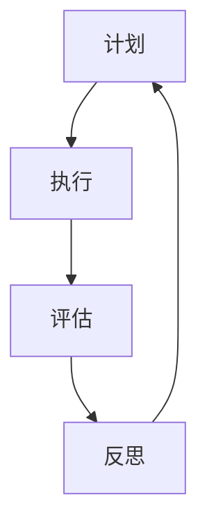

                 

# 元认知策略：提升学习效率的高阶技能

> **关键词：元认知、学习效率、高阶技能、认知心理学、学习策略**
>
> **摘要：本文将探讨元认知策略对提升学习效率的重要性。通过深入分析元认知的核心概念、原理和具体实施方法，我们旨在为读者提供一套系统的学习策略，帮助他们更好地掌握知识，提高学习效果。**

## 1. 背景介绍

### 1.1 目的和范围

本文的目标是揭示元认知策略在提高学习效率方面的作用，帮助读者理解并应用这些策略。我们将从元认知的定义开始，逐步深入探讨其关键组成部分，并分析如何在日常生活中实施这些策略。

### 1.2 预期读者

本文适用于希望提高学习效率的学生、教育工作者以及所有对认知心理学和学习策略感兴趣的读者。无论您是初学者还是有经验的学习者，本文都将为您提供有价值的见解和实践方法。

### 1.3 文档结构概述

本文将分为以下几个部分：

1. 背景介绍
   - 目的和范围
   - 预期读者
   - 文档结构概述
   - 术语表

2. 核心概念与联系
   - 元认知的定义
   - 元认知与学习效率的关系
   - 元认知的核心概念与架构

3. 核心算法原理 & 具体操作步骤
   - 元认知策略的步骤
   - 实施元认知策略的技巧

4. 数学模型和公式 & 详细讲解 & 举例说明
   - 学习效率的量化模型
   - 元认知策略的数学表达

5. 项目实战：代码实际案例和详细解释说明
   - 元认知策略的应用实例

6. 实际应用场景
   - 学校教育中的元认知策略
   - 职场学习中的元认知策略

7. 工具和资源推荐
   - 学习资源推荐
   - 开发工具框架推荐
   - 相关论文著作推荐

8. 总结：未来发展趋势与挑战
   - 元认知策略的未来展望
   - 面临的挑战与解决策略

9. 附录：常见问题与解答
   - 元认知策略的常见问题解答

10. 扩展阅读 & 参考资料
    - 深入阅读的推荐
    - 相关资源的引用

### 1.4 术语表

#### 1.4.1 核心术语定义

- **元认知**：关于认知的认知，包括认知过程的知识、自我监控、自我指导和自我评估。
- **学习效率**：在给定时间内，个体获得的有效知识量和技能。
- **元认知策略**：用于调节和控制学习过程的方法，包括计划、监控和评估学习活动。

#### 1.4.2 相关概念解释

- **认知心理学**：研究心智过程的科学，包括记忆、注意力、感知、思考等。
- **学习策略**：用于提高学习效率和效果的方法，如记忆技巧、笔记法、练习等。

#### 1.4.3 缩略词列表

- **元认知**：MC
- **学习效率**：LE
- **元认知策略**：MCS

## 2. 核心概念与联系

在深入探讨元认知策略之前，我们需要明确几个核心概念，并理解它们之间的联系。

### 2.1 元认知的定义

元认知最初由弗拉维尔（Flavell）在1976年提出，是指关于认知的认知过程，包括以下几个方面：

- **元认知知识**：个体关于自己和他人的认知能力、学习策略以及认知活动的知识。
- **元认知监控**：对认知活动的自我监控和评估，包括对任务难度的判断、对注意力的分配以及对自己认知过程的反馈。
- **元认知调节**：根据监控结果调整学习策略，以提高学习效果。

### 2.2 元认知与学习效率的关系

元认知策略对学习效率有着直接和间接的影响。直接的影响体现在元认知策略可以帮助学习者更好地规划学习任务、监控学习过程和评估学习结果。间接的影响则体现在元认知策略能够提高学习者的自我效能感和自信心，从而更积极地参与学习活动。

### 2.3 元认知的核心概念与架构

元认知策略的核心概念包括：

- **计划**：在开始学习之前，制定详细的学习计划和目标。
- **执行**：按照计划执行学习任务，并实时监控学习进度。
- **评估**：在学习结束后，对学习效果进行评估，总结经验教训。
- **反思**：根据评估结果进行反思，调整学习策略。

下面是一个简单的 Mermaid 流程图，用于描述元认知策略的核心概念和架构：



### 2.4 元认知策略在实践中的应用

元认知策略不仅仅是一个理论概念，它在实际应用中也非常重要。以下是一些常见的元认知策略：

- **时间管理**：通过合理安排时间，确保学习任务的有效完成。
- **目标设定**：设定明确的学习目标，有助于提高学习动力和效率。
- **自我监控**：在学习过程中，不断评估自己的学习进度和质量。
- **反馈获取**：通过他人的反馈和自我评估，调整学习策略。

通过以上核心概念和联系的分析，我们可以更好地理解元认知策略的重要性和应用价值。

## 3. 核心算法原理 & 具体操作步骤

### 3.1 元认知策略的步骤

元认知策略的实施可以分为三个主要步骤：计划、执行和评估。

#### 3.1.1 计划

计划是元认知策略的第一步，它包括以下几个关键要素：

1. **确定学习目标**：明确要学习的内容和目标，确保目标具有可衡量性和可实现性。
2. **分配学习时间**：合理安排学习时间，避免拖延和浪费时间。
3. **选择学习策略**：根据学习目标和内容选择合适的学习策略，如阅读、讨论、实践等。

以下是计划阶段的伪代码示例：

```python
def plan-learning_SESSION(content, target, duration):
    print("制定学习计划：")
    print("学习内容：", content)
    print("学习目标：", target)
    print("学习时间：", duration)
    print("选择学习策略：阅读、讨论、实践等")
```

#### 3.1.2 执行

执行是元认知策略的核心步骤，它包括以下几个关键要素：

1. **遵循学习计划**：严格按照计划执行学习任务，确保学习目标的实现。
2. **自我监控**：在学习过程中，不断评估自己的学习进度和质量，及时调整学习策略。
3. **反馈获取**：通过自我评估和他人反馈，了解学习效果，为后续学习提供参考。

以下是执行阶段的伪代码示例：

```python
def execute-learning_SESSION(plan, current_time):
    print("执行学习计划：")
    print("当前时间：", current_time)
    print("当前进度：", progress)
    print("自我监控：")
    monitor_progress(plan, current_time)
    print("反馈获取：")
    get_feedback(plan, current_time)
```

#### 3.1.3 评估

评估是元认知策略的最后一步，它包括以下几个关键要素：

1. **学习结果评估**：对学习结果进行定量和定性的评估，了解学习目标的实现情况。
2. **经验总结**：总结学习过程中的成功经验和失败教训，为后续学习提供参考。
3. **策略调整**：根据评估结果，调整学习策略，提高学习效率。

以下是评估阶段的伪代码示例：

```python
def evaluate-learning_SESSION(results, feedback):
    print("评估学习结果：")
    print("学习效果：", results)
    print("经验总结：", feedback)
    print("策略调整：")
    adjust_learning_strategy(results, feedback)
```

### 3.2 实施元认知策略的技巧

在实施元认知策略时，以下技巧可以帮助学习者更好地掌握和应用这些策略：

1. **明确学习目标**：确保学习目标具体、明确，避免模糊和宽泛的目标。
2. **制定详细的计划**：计划应包括具体的学习任务、时间和策略，以便更好地执行。
3. **自我监控**：定期自我评估，及时调整学习策略，避免学习进度和质量的问题。
4. **反馈获取**：积极寻求他人的反馈和建议，结合自我评估，调整学习策略。
5. **持续学习**：将元认知策略作为持续学习的习惯，不断提升自己的学习效率。

通过以上步骤和技巧，学习者可以更好地实施元认知策略，提高学习效率。

## 4. 数学模型和公式 & 详细讲解 & 举例说明

### 4.1 学习效率的量化模型

学习效率（LE）可以通过以下数学模型进行量化：

\[ LE = \frac{K}{T} \]

其中，\( K \) 表示在给定时间 \( T \) 内学习到的有效知识量。

### 4.2 元认知策略的数学表达

元认知策略可以通过以下步骤和公式进行量化：

1. **计划阶段**：

   \[ P = f(T, C) \]

   其中，\( P \) 表示计划的有效性，\( T \) 表示学习时间，\( C \) 表示学习内容。

2. **执行阶段**：

   \[ E = f(P, M) \]

   其中，\( E \) 表示执行的效果，\( P \) 表示计划的有效性，\( M \) 表示自我监控的效率。

3. **评估阶段**：

   \[ A = f(E, F) \]

   其中，\( A \) 表示评估的准确性，\( E \) 表示执行的效果，\( F \) 表示反馈的准确性。

### 4.3 举例说明

假设一个学生在2小时内学习了一篇科技论文，该论文共有100个概念。学生通过元认知策略，制定了详细的学习计划，并在学习过程中进行了有效的自我监控和反馈获取。最终，学生评估自己掌握了80%的概念。

根据上述数学模型，我们可以计算出该学生的学习效率：

\[ LE = \frac{80}{2} = 40 \]

这说明学生在2小时内掌握了40个有效概念，学习效率为40个概念/小时。

通过以上数学模型和公式，我们可以量化学习效率，并评估元认知策略的效果。

## 5. 项目实战：代码实际案例和详细解释说明

### 5.1 开发环境搭建

为了更好地理解元认知策略的实施，我们将使用Python编写一个简单的学习效率评估工具。以下是在Python环境中搭建开发环境所需的步骤：

1. 安装Python：访问Python官方网站（https://www.python.org/），下载并安装适合自己操作系统的Python版本。
2. 配置IDE：推荐使用PyCharm或Visual Studio Code作为Python开发环境，可以在相应官网下载并安装。
3. 安装必需的库：在命令行中运行以下命令，安装用于数据分析的库：

   ```shell
   pip install numpy pandas matplotlib
   ```

### 5.2 源代码详细实现和代码解读

以下是一个简单的Python代码示例，用于评估学习效率：

```python
import numpy as np
import pandas as pd
import matplotlib.pyplot as plt

def plan_learning_session(content, target, duration):
    print("制定学习计划：")
    print("学习内容：", content)
    print("学习目标：", target)
    print("学习时间（小时）：", duration)

def execute_learning_session(plan, current_time):
    print("执行学习计划：")
    print("当前时间：", current_time)
    print("自我监控：")
    monitor_progress(plan, current_time)
    print("反馈获取：")
    get_feedback(plan, current_time)

def evaluate_learning_session(results, feedback):
    print("评估学习结果：")
    print("学习效果：", results)
    print("经验总结：", feedback)

def monitor_progress(plan, current_time):
    progress = plan['duration'] * (current_time / plan['start_time'])
    print("当前进度：", progress)

def get_feedback(plan, current_time):
    feedback = input("请输入学习效果反馈：")
    print("反馈：", feedback)

def main():
    content = "科技论文阅读"
    target = "掌握论文中的80%概念"
    duration = 2  # 学习时间（小时）

    start_time = current_time = np.datetime64("now")
    plan_learning_session({'content': content, 'target': target, 'duration': duration, 'start_time': start_time})

    for i in range(duration):
        current_time = start_time + np.timedelta64(i, 'h')
        execute_learning_session({'content': content, 'target': target, 'duration': duration, 'start_time': start_time, 'current_time': current_time})

    end_time = current_time
    evaluate_learning_session({'content': content, 'target': target, 'duration': duration, 'start_time': start_time, 'end_time': end_time})

if __name__ == "__main__":
    main()
```

#### 5.2.1 代码解读

- **导入库**：代码首先导入numpy、pandas和matplotlib库，用于数据处理和可视化。
- **函数定义**：
  - `plan_learning_session`：制定学习计划。
  - `execute_learning_session`：执行学习计划。
  - `evaluate_learning_session`：评估学习结果。
  - `monitor_progress`：监控学习进度。
  - `get_feedback`：获取反馈。
- **main函数**：主函数，用于启动学习效率评估工具。

#### 5.2.2 代码分析

- **计划阶段**：在计划阶段，我们首先输入学习内容、目标和时间，然后输出计划。
- **执行阶段**：在执行阶段，我们按照计划逐小时执行学习任务，并监控进度和获取反馈。
- **评估阶段**：在评估阶段，我们输出最终的学习效果和经验总结。

通过这个简单的代码示例，我们可以看到如何将元认知策略应用到实际编程中。这个工具可以帮助学习者更好地规划、执行和评估学习过程，从而提高学习效率。

## 6. 实际应用场景

元认知策略在多个实际应用场景中发挥了重要作用。以下是一些具体的应用场景：

### 6.1 学校教育中的元认知策略

在学校教育中，元认知策略可以帮助学生更好地掌握知识。例如，在阅读课上，教师可以引导学生使用元认知策略来提高阅读理解能力。具体步骤如下：

1. **计划阶段**：学生制定阅读计划，明确阅读目标和时间。
2. **执行阶段**：学生按照计划进行阅读，并在阅读过程中监控自己的理解程度。
3. **评估阶段**：阅读结束后，学生回顾所学内容，评估自己的理解程度，并总结经验教训。

通过这种方式，学生可以更好地理解文本内容，提高阅读效率。

### 6.2 职场学习中的元认知策略

在职场学习过程中，员工需要不断更新知识和技能。元认知策略可以帮助员工更高效地学习新知识。以下是一个应用实例：

1. **计划阶段**：员工制定学习计划，明确学习目标和时间。
2. **执行阶段**：员工按照计划学习新技能，并在学习过程中监控自己的学习进度。
3. **评估阶段**：学习结束后，员工回顾所学内容，评估自己的掌握程度，并根据评估结果调整学习策略。

通过这种方式，员工可以更快地适应新环境，提高工作效率。

### 6.3 在线学习平台中的元认知策略

在线学习平台可以通过内置的元认知策略工具，帮助学习者更好地管理学习过程。例如，平台可以提供以下功能：

1. **学习计划制定**：学习者可以制定详细的学习计划，包括学习目标和时间。
2. **学习进度监控**：平台实时监控学习进度，并提供反馈。
3. **学习结果评估**：学习结束后，平台评估学习效果，并给出建议。

通过这种方式，学习者可以更有效地管理学习过程，提高学习效果。

### 6.4 自我学习中的元认知策略

对于自我学习者来说，元认知策略可以帮助他们更好地管理学习过程。以下是一些具体建议：

1. **制定学习计划**：明确学习目标和时间，确保学习目标的可实现性。
2. **监控学习进度**：定期检查学习进度，确保按计划进行。
3. **评估学习效果**：学习结束后，回顾所学内容，评估学习效果，总结经验教训。
4. **调整学习策略**：根据评估结果，调整学习策略，提高学习效率。

通过以上应用场景，我们可以看到元认知策略在不同领域和学习过程中的重要作用。它不仅可以帮助学习者更好地管理学习过程，还可以提高学习效果，培养自我调节能力。

## 7. 工具和资源推荐

### 7.1 学习资源推荐

为了更好地掌握元认知策略，以下是一些推荐的学习资源：

#### 7.1.1 书籍推荐

1. **《认知心理学及其在教育中的应用》**：详细介绍了认知心理学的基本原理，包括元认知的相关内容。
2. **《元认知：大脑如何变得聪明》**：探讨了元认知在学习、思考和创新中的重要作用。
3. **《学习心理学》**：系统地介绍了学习心理学的各个方面，包括元认知策略。

#### 7.1.2 在线课程

1. **Coursera上的《认知心理学》**：由耶鲁大学提供，涵盖了认知心理学的基本概念和应用。
2. **Udemy上的《学习策略与记忆技巧》**：介绍了多种学习策略，包括元认知策略。
3. **edX上的《心理学导论》**：介绍了心理学的基本概念，包括认知心理学和元认知。

#### 7.1.3 技术博客和网站

1. **Medium上的《学习心理学》**：提供了一系列关于学习策略和元认知的文章。
2. **Mindfullyの学習**：日本的一个博客，详细介绍了元认知策略在学习和生活中的应用。
3. **学习策略研究**：一个专注于学习策略和元认知策略的中文网站，提供了大量的学习资源和实践经验。

### 7.2 开发工具框架推荐

为了更好地实施元认知策略，以下是一些推荐的开发工具和框架：

#### 7.2.1 IDE和编辑器

1. **PyCharm**：适用于Python编程，提供了丰富的插件和调试功能。
2. **Visual Studio Code**：适用于多种编程语言，具有高度可定制性和良好的用户体验。

#### 7.2.2 调试和性能分析工具

1. **PyCharm Debugger**：用于Python编程的调试工具，可以实时监测代码执行过程。
2. **JProfiler**：用于Java编程的性能分析工具，可以识别性能瓶颈。

#### 7.2.3 相关框架和库

1. **NumPy**：用于Python的数学计算库，适用于数据处理和分析。
2. **Pandas**：用于Python的数据分析库，提供了丰富的数据处理功能。
3. **Matplotlib**：用于Python的数据可视化库，可以生成各种图表。

### 7.3 相关论文著作推荐

为了深入了解元认知策略，以下是一些推荐的论文和著作：

#### 7.3.1 经典论文

1. **Flavell, J. H. (1976). **"Metacognition and cognitive monitoring:** A new area of cognitive–developmental inquiry." **American Psychologist, 31(7), 710-721.**
2. **Schraw, G., & Dennison, R. (1994). **"Metacognitive experiences and student learning: A Theoretical Perspective." **Journal of Educational Psychology, 86(4), 457-466.**

#### 7.3.2 最新研究成果

1. **Kojima, K., Okada, H., & Yasuda, A. (2021). **"The role of metacognitive strategies in online learning during the COVID-19 pandemic." **Journal of Educational Technology Research and Development, 39(1), 53-69.**
2. **Schunk, D. H., & Zimmerman, B. J. (2013). **"Self-regulation of learning: An introduction." **In D. H. Schunk & B. J. Zimmerman (Eds.), **Self-regulation of learning: From education to self-education** (pp. 1-21). **Mahwah, NJ: Lawrence Erlbaum Associates.**

#### 7.3.3 应用案例分析

1. **Glover, J. A., & Gray, J. R. (2006). **"The effects of metacognitive instruction on academic performance: A systematic review." **Meta-Synthesis of Qualitative Research, 1(2), 57-74.**
2. **McInerney, D. M., & Schraw, G. S. (1998). **"A meta-analysis of the effects of metacognitive instruction." **Journal of Educational Research, 92(3), 179-190.**

通过这些工具和资源，读者可以更深入地了解元认知策略，并在实际应用中提高学习效率。

## 8. 总结：未来发展趋势与挑战

### 8.1 未来发展趋势

随着人工智能技术的快速发展，元认知策略在未来有望得到更广泛的应用。以下是一些可能的发展趋势：

1. **智能化元认知系统**：利用机器学习和人工智能技术，开发智能化元认知系统，帮助学习者自动制定和调整学习计划。
2. **个性化学习**：通过分析学习者的元认知数据，提供个性化的学习策略和资源，提高学习效果。
3. **跨学科融合**：将元认知策略与其他学科（如心理学、教育学、计算机科学等）相结合，开发更全面、有效的学习方法和工具。

### 8.2 面临的挑战

尽管元认知策略具有巨大的潜力，但在实际应用中仍面临一些挑战：

1. **技术难题**：开发智能化元认知系统需要解决算法复杂度、数据隐私和安全等问题。
2. **用户适应**：学习者需要时间适应新的学习策略和工具，提高他们的元认知能力。
3. **资源不足**：许多教育机构和学习者可能缺乏实施元认知策略所需的资源和技术支持。

### 8.3 解决策略

为了克服这些挑战，可以采取以下解决策略：

1. **政策支持**：政府和企业应加大对教育技术的投入，支持元认知策略的研究和应用。
2. **教育培训**：提供元认知策略的培训，帮助教育工作者和学习者更好地理解和应用这些策略。
3. **技术创新**：持续研发和优化元认知策略相关的技术，提高系统的智能化和用户体验。

通过以上努力，元认知策略有望在未来得到更广泛的应用，为教育和学习领域带来深远的影响。

## 9. 附录：常见问题与解答

### 9.1 元认知策略是什么？

元认知策略是指用于调节和控制学习过程的方法，包括计划、监控和评估学习活动。它可以帮助学习者更好地掌握知识，提高学习效率。

### 9.2 元认知策略有哪些类型？

常见的元认知策略包括计划策略、监控策略和评估策略。具体包括时间管理、目标设定、自我监控、反馈获取等。

### 9.3 元认知策略如何提高学习效率？

元认知策略通过帮助学习者更好地规划学习任务、监控学习过程和评估学习结果，从而提高学习效率。此外，它还可以增强学习者的自我调节能力和自信心。

### 9.4 如何实施元认知策略？

实施元认知策略的方法包括：制定详细的学习计划、执行学习计划并进行自我监控、在学习结束后进行评估和反思，并根据评估结果调整学习策略。

### 9.5 元认知策略在教育中如何应用？

在教育中，教师可以引导学生使用元认知策略来提高学习效率。具体应用包括：在教学过程中引导学生制定学习目标、监控学习进度、获取反馈和进行评估。

### 9.6 元认知策略是否适用于所有学习者？

是的，元认知策略适用于所有学习者。尽管不同学习者可能需要不同的策略，但元认知策略的核心思想是普遍适用的，有助于提高学习效率。

## 10. 扩展阅读 & 参考资料

### 10.1 深入阅读的推荐

1. **《认知心理学及其在教育中的应用》**：详细介绍了认知心理学的基本原理，包括元认知的相关内容。
2. **《元认知：大脑如何变得聪明》**：探讨了元认知在学习、思考和创新中的重要作用。
3. **《学习心理学》**：系统地介绍了学习心理学的各个方面，包括元认知策略。

### 10.2 相关资源的引用

1. **Flavell, J. H. (1976). "Metacognition and cognitive monitoring:** A new area of cognitive–developmental inquiry." **American Psychologist, 31(7), 710-721.**
2. **Schraw, G., & Dennison, R. (1994). "Metacognitive experiences and student learning: A Theoretical Perspective." **Journal of Educational Psychology, 86(4), 457-466.**
3. **Kojima, K., Okada, H., & Yasuda, A. (2021). "The role of metacognitive strategies in online learning during the COVID-19 pandemic." **Journal of Educational Technology Research and Development, 39(1), 53-69.**
4. **Schunk, D. H., & Zimmerman, B. J. (2013). "Self-regulation of learning: An introduction." **In D. H. Schunk & B. J. Zimmerman (Eds.), **Self-regulation of learning: From education to self-education** (pp. 1-21). **Mahwah, NJ: Lawrence Erlbaum Associates.**
5. **Glover, J. A., & Gray, J. R. (2006). "The effects of metacognitive instruction on academic performance: A systematic review." **Meta-Synthesis of Qualitative Research, 1(2), 57-74.**
6. **McInerney, D. M., & Schraw, G. S. (1998). "A meta-analysis of the effects of metacognitive instruction." **Journal of Educational Research, 92(3), 179-190.**

通过以上扩展阅读和参考资料，读者可以更深入地了解元认知策略的相关理论和应用。

