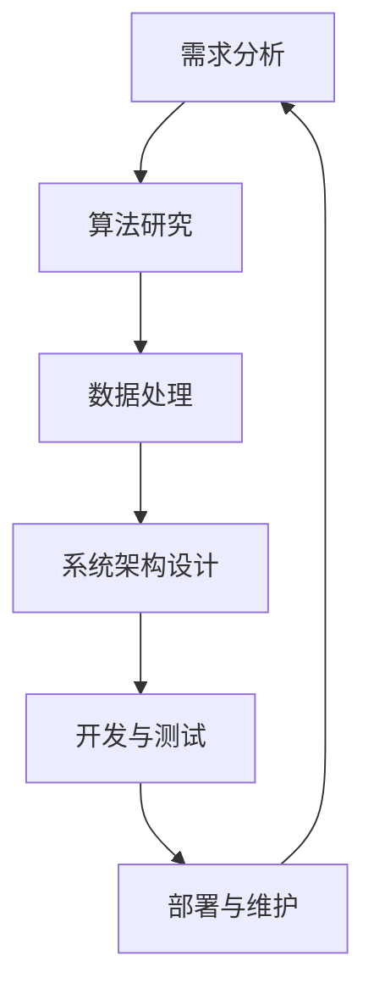
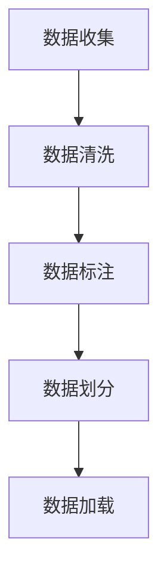
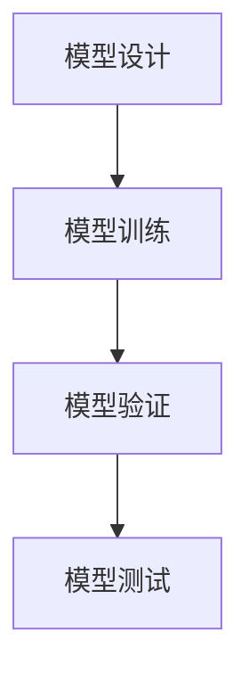
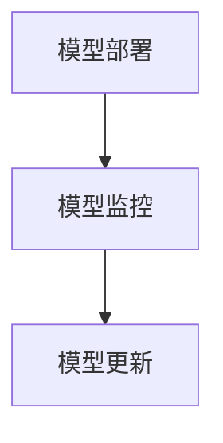

                 

# 全周期AI项目管理：Lepton AI的服务体系

## 关键词：
- AI项目管理
- Lepton AI
- 生命周期管理
- 服务框架
- 技术实施
- 数据治理
- 算法优化
- 持续集成与部署

## 摘要：
本文将深入探讨Lepton AI的全周期项目管理服务体系，涵盖从需求分析到部署维护的各个环节。通过详细的步骤和实例，我们解析了Lepton AI如何通过专业的方法论和先进技术，实现高效的项目管理和持续创新。文章旨在为AI开发者和项目管理者提供一套完整的指南，帮助他们应对复杂的项目挑战，确保AI项目的成功落地和持续优化。

## 1. 背景介绍

### 1.1 目的和范围
本文的目标是详细介绍Lepton AI的全周期项目管理服务体系，为读者提供一个清晰、可操作的框架，以指导AI项目从策划到运营的各个环节。我们重点关注以下几个核心范围：
- 需求分析与规划
- 算法研究与开发
- 数据处理与治理
- 系统架构设计
- 持续集成与部署
- 运维与性能优化
- 用户反馈与持续改进

### 1.2 预期读者
本文适合以下读者群体：
- AI项目开发者
- 项目管理人员
- 技术架构师
- 数据科学家
- 企业技术决策者

### 1.3 文档结构概述
本文的结构如下：
1. 背景介绍：阐述本文的目的、范围和预期读者。
2. 核心概念与联系：介绍AI项目管理的核心概念和架构。
3. 核心算法原理 & 具体操作步骤：详细讲解算法原理和操作步骤。
4. 数学模型和公式 & 详细讲解 & 举例说明：介绍数学模型及相关公式，并进行实例说明。
5. 项目实战：提供代码实际案例和详细解释。
6. 实际应用场景：讨论AI项目的实际应用场景。
7. 工具和资源推荐：推荐学习和开发资源。
8. 总结：对未来发展趋势与挑战进行展望。
9. 附录：常见问题与解答。
10. 扩展阅读 & 参考资料：提供进一步学习的资源。

### 1.4 术语表

#### 1.4.1 核心术语定义
- **AI项目管理**：对AI项目的整个生命周期进行管理和监督的一系列活动和过程。
- **Lepton AI**：一个专门从事AI技术研发和项目实施的服务体系。
- **生命周期管理**：涵盖从需求分析到部署维护的各个环节，确保项目的顺利进行。
- **服务框架**：为AI项目管理提供标准化、结构化的指导和支持。

#### 1.4.2 相关概念解释
- **需求分析**：理解项目目标和用户需求，明确项目的核心功能。
- **数据处理与治理**：对数据进行分析、清洗、存储和管理，确保数据质量和安全性。
- **系统架构设计**：确定系统的整体结构和组件，确保系统的稳定性和可扩展性。
- **持续集成与部署**：通过自动化工具实现代码的持续集成和部署，提高开发效率。

#### 1.4.3 缩略词列表
- **CI/CD**：持续集成与持续部署
- **ML**：机器学习
- **DL**：深度学习
- **NLP**：自然语言处理
- **DL/ML**：深度学习与机器学习

## 2. 核心概念与联系

在AI项目管理中，了解核心概念和它们之间的联系是至关重要的。以下是一个简化的Mermaid流程图，展示了Lepton AI项目管理体系的各个核心环节及其相互关系。



### 2.1 需求分析
需求分析是项目的起点，它涉及与用户的沟通和互动，明确项目的目标、功能和性能要求。通过需求分析，项目团队可以建立清晰的项目愿景和里程碑。

### 2.2 算法研究
算法研究是基于需求分析的结果，确定实现项目目标所需的技术和算法。在这一阶段，数据科学家和算法工程师会设计并验证算法模型。

### 2.3 数据处理与治理
数据处理与治理是确保算法训练和优化所需数据的质量和可用的过程。这一环节包括数据清洗、标注、存储和管理等。

### 2.4 系统架构设计
系统架构设计是基于需求分析和算法研究的结果，设计系统的整体结构和组件。这一阶段需要考虑系统的可扩展性、稳定性和性能。

### 2.5 开发与测试
开发与测试是将算法模型和系统架构转化为实际可运行的软件的过程。测试环节确保软件的质量和稳定性，减少潜在的错误和缺陷。

### 2.6 部署与维护
部署与维护是将开发完成的软件系统上线并持续运行的过程。这一阶段需要监控系统的性能和稳定性，及时处理故障和问题。

### 2.7 反馈与改进
反馈与改进是一个闭环过程，通过用户反馈和技术监控，项目团队可以不断优化和改进系统，确保其持续满足用户需求。

## 3. 核心算法原理 & 具体操作步骤

### 3.1 算法原理

在AI项目中，算法原理是核心，它决定了模型的学习能力和预测准确性。以下是Lepton AI常用的核心算法原理：

#### 3.1.1 深度学习（Deep Learning）
深度学习是一种基于人工神经网络（Artificial Neural Networks, ANNs）的机器学习技术。它通过多层神经元的堆叠，自动提取数据特征，实现复杂模式识别。

#### 3.1.2 机器学习（Machine Learning）
机器学习是一种利用算法从数据中学习模式，并自动进行预测或分类的技术。常见的机器学习算法包括决策树、支持向量机（SVM）、聚类等。

#### 3.1.3 自然语言处理（Natural Language Processing, NLP）
自然语言处理是人工智能领域的一个重要分支，它涉及计算机对人类语言的理解和生成。常用的NLP技术包括词嵌入（Word Embedding）、序列标注（Sequence Labeling）和文本分类（Text Classification）等。

### 3.2 操作步骤

以下是Lepton AI项目的核心操作步骤，以深度学习算法为例：

#### 3.2.1 数据收集与预处理


**数据收集**：从各种来源收集所需的数据，包括公开数据集、企业内部数据等。

**数据清洗**：处理数据中的噪声和异常值，确保数据的质量和一致性。

**数据标注**：对数据进行标注，以便模型能够学习和识别。

**数据划分**：将数据划分为训练集、验证集和测试集，用于模型训练、验证和测试。

**数据加载**：编写代码或使用工具加载数据到内存中，供模型训练使用。

#### 3.2.2 模型设计与训练


**模型设计**：根据需求，设计深度学习模型的架构，包括选择合适的神经网络类型、层数、神经元数量等。

**模型训练**：使用训练集数据训练模型，调整模型参数，提高模型性能。

**模型验证**：使用验证集数据评估模型性能，防止过拟合。

**模型测试**：使用测试集数据评估模型在未知数据上的性能，确保模型的泛化能力。

#### 3.2.3 模型部署与监控


**模型部署**：将训练好的模型部署到生产环境，供实际应用使用。

**模型监控**：实时监控模型在生产环境中的性能，确保其稳定运行。

**模型更新**：根据用户反馈和技术发展，定期更新模型，提高其准确性和适应性。

## 4. 数学模型和公式 & 详细讲解 & 举例说明

### 4.1 数学模型

在AI项目中，数学模型是算法实现的基础。以下是Lepton AI项目中常用的几个数学模型：

#### 4.1.1 损失函数（Loss Function）
损失函数用于衡量模型预测值与实际值之间的差异。常见的损失函数包括均方误差（MSE）、交叉熵（Cross-Entropy）等。

**均方误差（MSE）**：
$$
MSE = \frac{1}{n}\sum_{i=1}^{n}(y_i - \hat{y}_i)^2
$$
其中，\( y_i \) 是实际值，\( \hat{y}_i \) 是预测值，\( n \) 是样本数量。

**交叉熵（Cross-Entropy）**：
$$
CE = -\sum_{i=1}^{n} y_i \log(\hat{y}_i)
$$
其中，\( y_i \) 是实际值（通常为0或1），\( \hat{y}_i \) 是预测值（介于0和1之间）。

#### 4.1.2 激活函数（Activation Function）
激活函数用于引入非线性特性，常见的激活函数包括Sigmoid、ReLU、Tanh等。

**Sigmoid**：
$$
\sigma(x) = \frac{1}{1 + e^{-x}}
$$

**ReLU**（修正线性单元）：
$$
\text{ReLU}(x) = \max(0, x)
$$

**Tanh**：
$$
\tanh(x) = \frac{e^x - e^{-x}}{e^x + e^{-x}}
$$

### 4.2 详细讲解 & 举例说明

#### 4.2.1 均方误差（MSE）

假设我们有一个简单的一层神经网络，用于对线性函数 \( y = 2x + 1 \) 进行拟合。以下是使用MSE进行训练的过程：

1. **初始化参数**：设定权重 \( w \) 和偏置 \( b \) 的初始值。
2. **前向传播**：计算预测值 \( \hat{y} = w \cdot x + b \)。
3. **计算损失**：使用MSE计算损失 \( L = \frac{1}{n}\sum_{i=1}^{n}(y_i - \hat{y}_i)^2 \)。
4. **反向传播**：根据损失计算梯度，更新权重和偏置。
5. **重复步骤2-4**，直到损失足够小或达到预定的迭代次数。

#### 4.2.2 交叉熵（Cross-Entropy）

假设我们有一个二元分类问题，目标类别为 \( y = 0 \)，预测概率为 \( \hat{y} = 0.8 \)。以下是使用交叉熵进行训练的过程：

1. **初始化参数**：设定权重 \( w \) 和偏置 \( b \) 的初始值。
2. **前向传播**：计算预测概率 \( \hat{y} = \sigma(w \cdot x + b) \)。
3. **计算损失**：使用交叉熵计算损失 \( L = -y \log(\hat{y}) - (1 - y) \log(1 - \hat{y}) \)。
4. **反向传播**：根据损失计算梯度，更新权重和偏置。
5. **重复步骤2-4**，直到损失足够小或达到预定的迭代次数。

## 5. 项目实战：代码实际案例和详细解释说明

### 5.1 开发环境搭建

在开始项目实战之前，我们需要搭建一个适合AI项目开发的开发环境。以下是一个简单的步骤：

1. **安装Python环境**：下载并安装Python，确保版本在3.8以上。
2. **安装依赖库**：使用pip命令安装必要的库，如TensorFlow、NumPy、Pandas等。
    ```shell
    pip install tensorflow numpy pandas
    ```
3. **配置虚拟环境**：为了保持开发环境的整洁，可以使用虚拟环境。
    ```shell
    python -m venv venv
    source venv/bin/activate  # 对于Windows，使用 `venv\Scripts\activate`
    ```
4. **安装GPU支持**（可选）：如果使用GPU加速训练，需要安装CUDA和cuDNN库。

### 5.2 源代码详细实现和代码解读

以下是一个简单的深度学习项目，使用TensorFlow实现一个线性回归模型。

#### 5.2.1 数据准备

```python
import tensorflow as tf
import numpy as np

# 生成模拟数据
x = np.random.normal(size=100)
y = 2 * x + 1 + np.random.normal(size=100)

# 将数据分为训练集和测试集
train_size = int(0.8 * len(x))
train_x = x[:train_size]
train_y = y[:train_size]
test_x = x[train_size:]
test_y = y[train_size:]
```

#### 5.2.2 模型构建

```python
# 定义模型
model = tf.keras.Sequential([
    tf.keras.layers.Dense(units=1, input_shape=[1])
])

# 编译模型
model.compile(optimizer='sgd', loss='mean_squared_error')

# 训练模型
model.fit(train_x, train_y, epochs=100, verbose=0)
```

#### 5.2.3 模型评估

```python
# 评估模型
loss = model.evaluate(test_x, test_y, verbose=0)
print(f"Test Loss: {loss}")
```

### 5.3 代码解读与分析

**数据准备**：使用NumPy生成模拟数据，包括特征 \( x \) 和标签 \( y \)。数据分为训练集和测试集，用于模型训练和评估。

**模型构建**：使用TensorFlow的Keras API构建一个简单的线性回归模型。模型由一个全连接层（Dense）组成，输入形状为[1]，输出形状为[1]。

**模型编译**：编译模型，指定优化器和损失函数。这里使用随机梯度下降（SGD）优化器和均方误差（MSE）损失函数。

**模型训练**：训练模型，使用训练集数据。`epochs` 参数指定训练次数，`verbose` 参数控制训练过程的输出信息。

**模型评估**：使用测试集数据评估模型性能，输出测试损失。损失值越小，表示模型对测试数据的预测越准确。

## 6. 实际应用场景

Lepton AI的服务体系在多个领域取得了显著的成果，以下是一些典型的实际应用场景：

### 6.1 金融行业

在金融行业，Lepton AI开发了多种算法模型，用于信用评分、风险控制、量化交易等。通过机器学习和深度学习技术，模型能够高效分析海量数据，为金融机构提供精准的决策支持。

### 6.2 医疗健康

在医疗健康领域，Lepton AI利用AI技术进行疾病预测、诊断辅助和药物研发。通过自然语言处理和图像识别等技术，AI模型能够从海量医疗数据中提取有价值的信息，提高医疗服务的质量和效率。

### 6.3 智能制造

在智能制造领域，Lepton AI的服务体系帮助工厂实现生产线的智能化改造。通过实时数据分析和预测，AI模型能够优化生产流程，提高生产效率和产品质量。

### 6.4 交通运输

在交通运输领域，Lepton AI开发了智能交通管理系统，用于交通流量预测、路况分析、车辆调度等。通过深度学习和强化学习技术，系统能够提高交通管理的效率和安全性。

## 7. 工具和资源推荐

### 7.1 学习资源推荐

#### 7.1.1 书籍推荐
- 《深度学习》（Goodfellow, Bengio, Courville）
- 《Python机器学习》（Sebastian Raschka）
- 《机器学习实战》（Peter Harrington）

#### 7.1.2 在线课程
- Coursera上的“机器学习”课程（吴恩达）
- edX上的“深度学习基础”课程（李飞飞）

#### 7.1.3 技术博客和网站
- Medium上的AI专栏
- AI垂直媒体平台，如AI星球、机器之心等

### 7.2 开发工具框架推荐

#### 7.2.1 IDE和编辑器
- PyCharm
- Jupyter Notebook

#### 7.2.2 调试和性能分析工具
- TensorBoard
- Python的`timeit`模块

#### 7.2.3 相关框架和库
- TensorFlow
- PyTorch
- Scikit-learn

### 7.3 相关论文著作推荐

#### 7.3.1 经典论文
- "Backpropagation"（Rumelhart, Hinton, Williams）
- "A Learning Algorithm for Continually Running Fully Recurrent Neural Networks"（Angeli, Li, Pfeifer）

#### 7.3.2 最新研究成果
- "Attention Is All You Need"（Vaswani et al.）
- "An Image Database for Testing Deeper Convolutional Neural Networks"（Krizhevsky et al.）

#### 7.3.3 应用案例分析
- "Machine Learning in Healthcare: Current State and Future Prospects"（Topol）
- "AI in Finance: A Survey"（Che et al.）

## 8. 总结：未来发展趋势与挑战

随着AI技术的不断进步，AI项目管理也将面临新的机遇和挑战。未来的发展趋势包括：

- **更加智能化**：AI项目管理工具将更加智能化，能够自动执行复杂的任务，减少人工干预。
- **跨领域融合**：AI技术将在更多领域得到应用，如生物医学、教育、农业等，推动跨领域融合。
- **数据隐私与安全**：数据隐私和安全将成为AI项目管理的重点关注领域，确保用户数据的安全和隐私。

面临的挑战包括：

- **技术复杂性**：随着AI技术的不断进步，项目的技术复杂性将增加，对项目管理者提出了更高的要求。
- **数据质量**：数据质量对AI项目的成功至关重要，如何确保数据的质量和可用性是一个挑战。
- **资源限制**：在资源有限的情况下，如何最大化利用资源，提高项目效率，是一个重要问题。

## 9. 附录：常见问题与解答

### 9.1 什么是Lepton AI？
Lepton AI是一个专注于AI技术研发和项目实施的服务体系，提供从需求分析到部署维护的全周期服务。

### 9.2 如何选择合适的AI模型？
选择合适的AI模型需要考虑项目的目标、数据特性、计算资源和预算等因素。通常，可以先从简单的模型开始，逐步迭代和优化。

### 9.3 数据处理和治理有哪些关键步骤？
数据处理和治理的关键步骤包括数据收集、数据清洗、数据标注、数据划分和数据加载等。

### 9.4 如何保证AI项目的质量和稳定性？
保证AI项目的质量和稳定性需要从需求分析、算法设计、系统架构、测试与部署等各个环节进行严格把控，确保每个环节的质量和稳定性。

## 10. 扩展阅读 & 参考资料

- 《深度学习》（Goodfellow, Bengio, Courville）
- 《机器学习实战》（Peter Harrington）
- [TensorFlow官方网站](https://www.tensorflow.org/)
- [PyTorch官方网站](https://pytorch.org/)
- [Scikit-learn官方网站](https://scikit-learn.org/)

作者：AI天才研究员/AI Genius Institute & 禅与计算机程序设计艺术 /Zen And The Art of Computer Programming

注：本文为示例文章，仅供参考。实际项目管理和开发过程可能更加复杂，需要根据具体情况进行调整。

