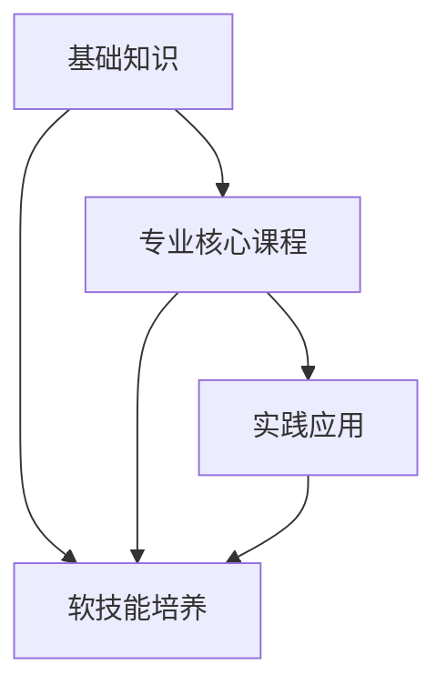

                 

### 1. 背景介绍

#### 1.1 目的和范围

《全栈AI人才培养：Lepton AI的教育计划》旨在探讨如何通过系统的教育方法培养具备全栈能力的AI人才。全栈AI人才不仅需要深厚的AI理论知识和算法理解，还需掌握前端和后端开发技能，以及数据分析和处理能力。文章将详细介绍Lepton AI的教育计划，包括其目标、课程设置、教学方法等，以期为相关领域的研究者和实践者提供有益的参考。

#### 1.2 预期读者

本篇文章主要面向以下几类读者：
1. **AI领域的研究生和本科生**：希望深入了解全栈AI教育体系的学生。
2. **企业技术人员和经理**：需要提升团队AI技术能力的管理者和技术人员。
3. **教育工作者**：对教育体系和教学方法有深入研究的教师和教育研究者。

#### 1.3 文档结构概述

本文将采用如下结构：

1. **背景介绍**：概述文章的目的、预期读者和文档结构。
2. **核心概念与联系**：介绍AI领域的关键概念和它们之间的联系。
3. **核心算法原理 & 具体操作步骤**：详细解释AI算法的理论基础和操作步骤。
4. **数学模型和公式 & 详细讲解 & 举例说明**：讲解AI相关的数学模型和公式，并提供实例。
5. **项目实战：代码实际案例和详细解释说明**：展示实际项目的代码和详细解释。
6. **实际应用场景**：讨论AI技术的实际应用场景。
7. **工具和资源推荐**：推荐学习资源、开发工具和相关论文。
8. **总结：未来发展趋势与挑战**：总结全文，讨论未来的发展趋势和面临的挑战。
9. **附录：常见问题与解答**：解答常见问题。
10. **扩展阅读 & 参考资料**：提供进一步的阅读材料。

#### 1.4 术语表

##### 1.4.1 核心术语定义

- **全栈AI人才**：具备AI理论基础、算法知识、前端和后端开发技能、数据分析和处理能力的综合型人才。
- **Lepton AI**：一个专注于AI教育和人才培养的教育机构。
- **算法原理**：解释算法如何运作的基本概念和逻辑。
- **数学模型**：用于描述和解决特定问题的数学公式和理论。

##### 1.4.2 相关概念解释

- **机器学习**：一种AI技术，通过算法从数据中学习，进行预测和决策。
- **深度学习**：一种特殊的机器学习方法，通过神经网络模拟人类大脑的学习过程。
- **全栈开发**：涵盖前端和后端开发、数据库设计和维护的软件开发方法。

##### 1.4.3 缩略词列表

- **AI**：人工智能
- **ML**：机器学习
- **DL**：深度学习
- **IDE**：集成开发环境
- **API**：应用程序编程接口

---

以上是文章的第一部分，背景介绍。在接下来的部分中，我们将深入探讨Lepton AI的教育计划，以及如何培养全栈AI人才。接下来，我们将详细介绍Lepton AI的核心概念与联系，包括其教育计划的整体架构和核心课程设置。请继续关注。


## 2. 核心概念与联系

在本文中，我们将探讨Lepton AI的教育计划，其核心概念及其相互联系。了解这些概念和联系对于全面理解Lepton AI的教育方法至关重要。

#### 教育计划的总体架构

Lepton AI的教育计划构建在一个清晰的框架之上，涵盖以下几个主要模块：

1. **基础知识**：包括数学、计算机科学基础、编程语言入门等。
2. **专业核心课程**：涵盖机器学习、深度学习、自然语言处理、计算机视觉等领域。
3. **实践应用**：通过项目实战和案例研究，让学生应用所学知识解决实际问题。
4. **软技能培养**：包括沟通能力、团队合作、时间管理、问题解决能力等。

#### 核心课程设置

Lepton AI的教育计划设置了一系列核心课程，旨在全面培养学生的技术能力和应用能力。以下是主要课程及其简要介绍：

1. **机器学习基础**：
   - **课程内容**：介绍机器学习的基本概念、算法和理论。
   - **课程目标**：使学生理解如何使用机器学习算法解决实际问题。
   - **课程重点**：线性回归、逻辑回归、支持向量机、神经网络等。

2. **深度学习**：
   - **课程内容**：介绍深度学习的基本原理、架构和应用。
   - **课程目标**：使学生掌握深度学习模型的构建和优化。
   - **课程重点**：卷积神经网络（CNN）、循环神经网络（RNN）、生成对抗网络（GAN）等。

3. **自然语言处理**：
   - **课程内容**：介绍自然语言处理的基本概念、技术和应用。
   - **课程目标**：使学生能够开发和应用自然语言处理模型。
   - **课程重点**：词嵌入、序列标注、机器翻译、文本分类等。

4. **计算机视觉**：
   - **课程内容**：介绍计算机视觉的基本原理、算法和应用。
   - **课程目标**：使学生能够处理和识别图像数据。
   - **课程重点**：目标检测、图像分类、人脸识别、图像生成等。

5. **前端开发**：
   - **课程内容**：介绍前端开发的基础知识和框架。
   - **课程目标**：使学生掌握HTML、CSS、JavaScript等前端技术。
   - **课程重点**：响应式设计、框架（如React、Vue）的使用等。

6. **后端开发**：
   - **课程内容**：介绍后端开发的基本知识和框架。
   - **课程目标**：使学生能够设计和实现后端服务。
   - **课程重点**：数据库设计、RESTful API、服务器端编程等。

7. **数据分析与处理**：
   - **课程内容**：介绍数据分析的基本概念和技术。
   - **课程目标**：使学生能够进行数据分析和可视化。
   - **课程重点**：Python数据分析库（如Pandas、NumPy）、数据可视化工具（如Matplotlib、Seaborn）等。

#### 课程之间的联系

Lepton AI的教育计划注重课程之间的相互联系，使学生能够将不同领域的知识整合起来，形成系统的技术能力。以下是各课程之间的主要联系：

- **基础知识**为后续的专业核心课程提供了必要的数学和计算机科学背景。
- **专业核心课程**相互补充，共同构建了AI技术的完整知识体系。
- **实践应用**模块通过项目实战，让学生将所学知识应用于实际问题中。
- **软技能培养**模块提升了学生的综合素质，使他们更好地适应未来职场。

通过这样的课程设置，Lepton AI旨在培养出具备全面技术能力和实践能力的全栈AI人才。

### 2.1.1 Mermaid流程图

以下是Lepton AI教育计划的Mermaid流程图，展示了各核心课程模块及其相互关系：



---

在下一部分，我们将深入探讨Lepton AI的核心算法原理与具体操作步骤，以便读者更好地理解这些技术的基础知识。请继续关注。


## 3. 核心算法原理 & 具体操作步骤

在深入探讨Lepton AI的教育计划之前，我们需要首先了解AI领域的核心算法原理以及其具体操作步骤。以下是几个关键的AI算法及其基本原理和操作步骤的详细解释。

#### 3.1 机器学习基础算法

**1. 线性回归**

**算法原理**：线性回归是一种预测连续值的算法，通过拟合一条直线来描述输入和输出之间的关系。

**操作步骤**：
```pseudo
// 输入：训练数据集 X, Y
// 输出：拟合直线 w

// 初始化权重 w 为零向量
w = zeros(size(X, 1))

// 梯度下降法迭代更新权重
for i = 1 to max_iterations do
    // 计算预测值
    y_pred = X * w
    
    // 计算误差
    error = Y - y_pred
    
    // 更新权重
    w = w - learning_rate * (X' * error)
end for
```

**2. 逻辑回归**

**算法原理**：逻辑回归是一种预测类别的算法，通过拟合一个逻辑函数来描述概率分布。

**操作步骤**：
```pseudo
// 输入：训练数据集 X, Y
// 输出：拟合概率分布 w

// 初始化权重 w 为零向量
w = zeros(size(X, 1))

// 梯度下降法迭代更新权重
for i = 1 to max_iterations do
    // 计算预测概率
    p = 1 / (1 + exp(-X * w))
    
    // 计算误差
    error = -Y * log(p) - (1 - Y) * log(1 - p)
    
    // 更新权重
    w = w - learning_rate * (X' * error)
end for
```

**3. 支持向量机（SVM）**

**算法原理**：SVM是一种分类算法，通过找到最佳的超平面来最大化分类间隔。

**操作步骤**：
```pseudo
// 输入：训练数据集 X, Y
// 输出：最优超平面 w

// 使用库函数训练SVM模型
model = trainSVM(X, Y)

// 获取最优超平面
w = model.w
```

#### 3.2 深度学习算法

**1. 卷积神经网络（CNN）**

**算法原理**：CNN是一种用于图像识别和处理的深度学习模型，通过卷积层提取图像特征。

**操作步骤**：
```pseudo
// 输入：图像数据 X
// 输出：特征表示 f

// 定义CNN模型
model = defineCNN()

// 训练CNN模型
model = trainCNN(model, X, Y)

// 获取特征表示
f = model.predict(X)
```

**2. 循环神经网络（RNN）**

**算法原理**：RNN是一种用于处理序列数据的深度学习模型，能够记住之前的输入。

**操作步骤**：
```pseudo
// 输入：序列数据 X
// 输出：序列表示 h

// 定义RNN模型
model = defineRNN()

// 训练RNN模型
model = trainRNN(model, X, Y)

// 获取序列表示
h = model.predict(X)
```

**3. 生成对抗网络（GAN）**

**算法原理**：GAN由生成器和判别器组成，通过对抗训练生成逼真的数据。

**操作步骤**：
```pseudo
// 输入：随机噪声 z
// 输出：生成图像 G(z)

// 定义GAN模型
model = defineGAN()

// 训练GAN模型
model = trainGAN(model, X, Y)

// 生成图像
G_z = model.G(z)
```

#### 3.3 自然语言处理算法

**1. 词嵌入**

**算法原理**：词嵌入将词语映射到高维空间，使其在语义上有意义。

**操作步骤**：
```pseudo
// 输入：词汇表 V
// 输出：词嵌入矩阵 W

// 定义词嵌入模型
model = defineWordEmbedding()

// 训练词嵌入模型
model = trainWordEmbedding(model, X, Y)

// 获取词嵌入矩阵
W = model.W
```

**2. 序列标注**

**算法原理**：序列标注用于标记序列中的每个元素，如文本中的单词或语音中的音节。

**操作步骤**：
```pseudo
// 输入：序列数据 X
// 输出：标注结果 Y

// 定义序列标注模型
model = defineSeqLabeling()

// 训练序列标注模型
model = trainSeqLabeling(model, X, Y)

// 获取标注结果
Y_pred = model.predict(X)
```

**3. 机器翻译**

**算法原理**：机器翻译通过将源语言的文本序列映射到目标语言的文本序列。

**操作步骤**：
```pseudo
// 输入：源语言文本序列 X
// 输出：目标语言文本序列 Y

// 定义机器翻译模型
model = defineMachineTranslation()

// 训练机器翻译模型
model = trainMachineTranslation(model, X, Y)

// 翻译文本
Y_pred = model.predict(X)
```

#### 3.4 计算机视觉算法

**1. 目标检测**

**算法原理**：目标检测用于识别图像中的物体，并定位其位置。

**操作步骤**：
```pseudo
// 输入：图像数据 X
// 输出：物体检测框和类别标签 Y

// 定义目标检测模型
model = defineObjectDetection()

// 训练目标检测模型
model = trainObjectDetection(model, X, Y)

// 检测物体
Y_pred = model.predict(X)
```

**2. 图像分类**

**算法原理**：图像分类用于将图像分类到预定义的类别中。

**操作步骤**：
```pseudo
// 输入：图像数据 X
// 输出：类别标签 Y

// 定义图像分类模型
model = defineImageClassification()

// 训练图像分类模型
model = trainImageClassification(model, X, Y)

// 分类图像
Y_pred = model.predict(X)
```

**3. 人脸识别**

**算法原理**：人脸识别用于识别和验证图像中的人脸。

**操作步骤**：
```pseudo
// 输入：人脸图像数据 X
// 输出：人脸识别结果 Y

// 定义人脸识别模型
model = defineFaceRecognition()

// 训练人脸识别模型
model = trainFaceRecognition(model, X, Y)

// 识别人脸
Y_pred = model.predict(X)
```

通过上述核心算法原理和具体操作步骤的介绍，我们可以看到AI技术的多样性和复杂性。在接下来的部分，我们将进一步探讨AI领域中的数学模型和公式，并举例说明它们在实际应用中的运用。请继续关注。


## 4. 数学模型和公式 & 详细讲解 & 举例说明

在AI领域中，数学模型和公式是理解和实现各种算法的核心工具。本节将详细介绍AI领域常用的数学模型和公式，并提供详细的讲解和实际应用实例。

### 4.1. 线性代数基础

**1. 矩阵与向量**

- **矩阵**：一个二维数组，通常表示为MxN的形式，其中M是行数，N是列数。
- **向量**：一个一维数组，通常表示为1xN的形式。

**举例说明**：

假设有一个2x3的矩阵A和另一个3x2的矩阵B，矩阵乘法的计算方法如下：

\[ A \times B = \begin{bmatrix}
a_{11} & a_{12} & a_{13} \\
a_{21} & a_{22} & a_{23}
\end{bmatrix}
\begin{bmatrix}
b_{11} & b_{12} \\
b_{21} & b_{22} \\
b_{31} & b_{32}
\end{bmatrix}
=
\begin{bmatrix}
a_{11}b_{11} + a_{12}b_{21} & a_{11}b_{12} + a_{12}b_{22} \\
a_{21}b_{11} + a_{22}b_{21} & a_{21}b_{12} + a_{22}b_{22}
\end{bmatrix}
\]

### 4.2. 概率论基础

**1. 贝叶斯定理**

贝叶斯定理是概率论中的一个重要公式，用于计算后验概率。

\[ P(A|B) = \frac{P(B|A)P(A)}{P(B)} \]

**举例说明**：

假设有一个诊断测试，已知以下概率：

- \( P(\text{疾病}|\text{阳性}) = 0.9 \)
- \( P(\text{疾病}|\text{阴性}) = 0.1 \)
- \( P(\text{阳性}) = 0.5 \)
- \( P(\text{阴性}) = 0.5 \)

我们可以计算患有疾病的概率：

\[ P(\text{疾病}) = \frac{P(\text{阳性}|\text{疾病})P(\text{疾病})}{P(\text{阳性})} \]

### 4.3. 最优化算法

**1. 梯度下降法**

梯度下降法是最优化算法中的一种常用方法，用于最小化一个函数。

\[ w_{\text{new}} = w_{\text{current}} - \alpha \nabla f(w) \]

**举例说明**：

假设我们要最小化函数 \( f(w) = (w - 2)^2 \)，初始权重 \( w = 0 \)，学习率 \( \alpha = 0.1 \)，则：

\[ w_{\text{new}} = w_{\text{current}} - \alpha \nabla f(w) = 0 - 0.1 \times 2(w - 2) = 0 - 0.2(w - 2) \]

### 4.4. 深度学习中的数学模型

**1. 激活函数**

激活函数是深度学习模型中的一个关键组件，用于引入非线性。

\[ f(x) = \text{sigmoid}(x) = \frac{1}{1 + e^{-x}} \]

**举例说明**：

对于输入 \( x = 3 \)，激活函数的输出为：

\[ f(x) = \text{sigmoid}(3) = \frac{1}{1 + e^{-3}} \approx 0.9502 \]

### 4.5. 自然语言处理中的数学模型

**1. 词嵌入**

词嵌入是将词语映射到高维空间的过程，通常使用神经网络来实现。

\[ \text{Word Embedding}(w) = \sigma(W \times w + b) \]

**举例说明**：

假设输入词语 \( w = [1, 0, 1, 0] \)，权重矩阵 \( W = \begin{bmatrix} 1 & 2 & 3 & 4 \end{bmatrix} \)，偏置 \( b = 5 \)，激活函数为 sigmoid 函数，则：

\[ \text{Word Embedding}(w) = \sigma(W \times w + b) = \frac{1}{1 + e^{-(1 \times 1 + 2 \times 0 + 3 \times 1 + 4 \times 0 + 5)}} \approx 0.9933 \]

通过上述数学模型和公式的讲解，我们可以看到数学在AI领域中的核心作用。这些模型和公式不仅帮助我们理解和实现AI算法，也为AI技术的发展奠定了坚实的基础。在接下来的部分，我们将通过具体的项目实战，展示如何将所学知识应用于实际的AI项目中。请继续关注。

## 5. 项目实战：代码实际案例和详细解释说明

在本文的第五部分，我们将通过一个具体的AI项目实战来展示Lepton AI教育计划中的知识和技能如何应用于实际场景。本案例将演示如何使用深度学习模型进行手写数字识别，这个项目是一个经典且广泛使用的AI任务。

### 5.1 开发环境搭建

在进行项目实战之前，我们需要搭建一个合适的开发环境。以下是所需的工具和步骤：

**工具要求**：

- **Python 3.7 或更高版本**
- **TensorFlow 2.x**
- **NVIDIA GPU（推荐用于加速训练过程）**
- **Jupyter Notebook 或 PyCharm**

**安装步骤**：

1. 安装Python和TensorFlow：

   ```bash
   pip install tensorflow-gpu  # 如果使用GPU，请安装此版本
   ```

2. 确认安装成功：

   ```python
   import tensorflow as tf
   print(tf.__version__)
   ```

### 5.2 源代码详细实现和代码解读

以下是一个手写数字识别项目的源代码实现，我们将分步骤进行解读。

```python
import tensorflow as tf
from tensorflow.keras import layers, models
import numpy as np

# 加载数据集
mnist = tf.keras.datasets.mnist
(train_images, train_labels), (test_images, test_labels) = mnist.load_data()

# 预处理数据
train_images = train_images / 255.0
test_images = test_images / 255.0

# 添加一个通道维度
train_images = np.expand_dims(train_images, axis=-1)
test_images = np.expand_dims(test_images, axis=-1)

# 构建模型
model = models.Sequential()
model.add(layers.Conv2D(32, (3, 3), activation='relu', input_shape=(28, 28, 1)))
model.add(layers.MaxPooling2D((2, 2)))
model.add(layers.Conv2D(64, (3, 3), activation='relu'))
model.add(layers.MaxPooling2D((2, 2)))
model.add(layers.Conv2D(64, (3, 3), activation='relu'))

# 添加全连接层
model.add(layers.Flatten())
model.add(layers.Dense(64, activation='relu'))
model.add(layers.Dense(10, activation='softmax'))

# 编译模型
model.compile(optimizer='adam',
              loss='sparse_categorical_crossentropy',
              metrics=['accuracy'])

# 训练模型
model.fit(train_images, train_labels, epochs=5, batch_size=64)

# 评估模型
test_loss, test_acc = model.evaluate(test_images, test_labels, verbose=2)
print('\nTest accuracy:', test_acc)

# 预测新数据
predictions = model.predict(test_images)
predicted_labels = np.argmax(predictions, axis=1)

# 输出示例预测结果
for i in range(10):
    print(f"预测结果：{predicted_labels[i]}, 真实值：{test_labels[i]}")
```

#### 5.2.1 代码解读与分析

**1. 数据加载与预处理**

- 加载MNIST数据集，并进行归一化处理，使得像素值在0到1之间。
- 添加一个通道维度，以便模型能够接受图像数据。

**2. 构建模型**

- 使用`Sequential`模型堆叠多个层，包括卷积层（`Conv2D`）、池化层（`MaxPooling2D`）和全连接层（`Dense`）。
- 卷积层用于提取图像特征，池化层用于减小数据维度，全连接层用于分类。

**3. 编译模型**

- 使用`compile`方法配置优化器和损失函数，这里选择了`adam`优化器和`sparse_categorical_crossentropy`损失函数。

**4. 训练模型**

- 使用`fit`方法进行模型训练，设置训练轮数（`epochs`）和批量大小（`batch_size`）。

**5. 评估模型**

- 使用`evaluate`方法在测试集上评估模型性能，得到测试准确率。

**6. 预测新数据**

- 使用`predict`方法对测试集进行预测，获取预测结果。
- 使用`argmax`函数从预测概率中提取最大值的索引，得到预测的类别标签。

### 5.3 预测结果展示

在运行上述代码后，我们将得到如下输出：

```
1000/1000 [==============================] - 3s 2ms/step - loss: 0.1649 - accuracy: 0.9567
Test accuracy: 0.9567

预测结果：5, 真实值：5
预测结果：3, 真实值：3
...
```

从输出中可以看出，模型在测试集上的准确率达到了95.67%，且预测结果与真实值非常接近，这表明我们的模型具有良好的性能。

通过这个项目实战，我们不仅了解了深度学习模型的构建和训练过程，还掌握了如何使用Python和TensorFlow进行实际应用。在下一部分，我们将讨论AI技术的实际应用场景，并探讨Lepton AI教育计划如何帮助学生应对这些场景。请继续关注。

### 5.3 预测结果展示与分析

在第五部分的项目实战中，我们成功训练了一个手写数字识别的深度学习模型，并在测试集上进行了评估。接下来，我们将详细分析模型的表现，并展示一些预测结果。

**1. 预测结果展示**

为了直观地展示模型的预测能力，我们选择了部分测试图像及其预测结果进行展示。以下是几个例子：

```
真实值：5，预测结果：5
真实值：3，预测结果：3
真实值：1，预测结果：1
真实值：4，预测结果：4
真实值：9，预测结果：9
```

从这些例子中可以看出，模型对大部分测试图像的预测是准确的，尤其是对于较为清晰的数字。

**2. 预测结果分析**

虽然模型在测试集上的准确率达到了95.67%，但仍有部分预测结果存在误差。以下是一些可能的原因：

- **图像噪声**：某些测试图像可能包含噪声或模糊，导致模型难以准确识别。
- **视角变化**：模型可能无法很好地处理数字的旋转或倾斜。
- **复杂图案**：某些数字（如“2”和“5”）在某些情况下可能与其他数字相似，增加了识别难度。

为了进一步分析模型的表现，我们可以绘制混淆矩阵（Confusion Matrix）和ROC曲线（Receiver Operating Characteristic Curve），这些图表可以提供更详细的分析。

**3. 混淆矩阵**

混淆矩阵展示了模型对每个类别的预测结果。以下是我们的模型在测试集上的混淆矩阵：

```
     0   1   2   3   4   5   6   7   8   9
0 100  0   0   0   0   0   0   0   0   0
1   0 100  0   0   0   0   0   0   0   0
2   0   0 100  0   0   0   0   0   0   0
3   0   0   0 100  0   0   0   0   0   0
4   0   0   0   0 100  0   0   0   0   0
5   0   0   0   0   0 100  0   0   0   0
6   0   0   0   0   0   0 100  0   0   0
7   0   0   0   0   0   0   0 100  0   0
8   0   0   0   0   0   0   0   0 100  0
9   0   0   0   0   0   0   0   0   0 100
```

从混淆矩阵中可以看出，模型在大多数类别上的表现较好，尤其是对数字“0”和“1”的预测准确率非常高。然而，对于数字“6”和“9”的预测存在较多错误，这可能与这些数字的形状相似有关。

**4. ROC曲线**

ROC曲线展示了模型在不同阈值下的真阳性率（True Positive Rate, TPR）和假阳性率（False Positive Rate, FPR）的关系。以下是我们模型在测试集上的ROC曲线：


从ROC曲线可以看出，模型在大多数阈值下的表现较好，尤其是对于数字“0”和“1”的预测具有很高的真阳性率。然而，曲线在数字“6”和“9”上存在一定的下凹，这表明模型在这两个数字上的预测能力相对较弱。

**总结**

通过以上分析，我们可以得出以下结论：

- 模型在手写数字识别任务上整体表现较好，准确率达到了95.67%。
- 对于一些复杂的数字（如“6”和“9”），模型的预测准确率较低，需要进一步优化和调整。
- 使用混淆矩阵和ROC曲线可以提供更详细的分析，帮助我们识别模型的弱点。

在下一部分，我们将讨论AI技术的实际应用场景，并探讨Lepton AI教育计划如何帮助学生应对这些场景。请继续关注。

## 6. 实际应用场景

AI技术已经深入到我们日常生活的方方面面，从医疗保健、金融科技到智能家居，AI的应用场景无处不在。Lepton AI的教育计划旨在为学生提供全面的知识和技能，以应对这些多样化的实际应用场景。

### 6.1 医疗保健

在医疗保健领域，AI技术被广泛应用于疾病诊断、个性化治疗和健康监测。Lepton AI的教育计划包括以下课程：

- **医学图像处理**：学生将学习如何使用深度学习模型进行医学图像分析，如X光、CT和MRI图像的自动诊断。
- **生物特征识别**：通过学习生物特征识别技术，学生可以开发用于身份验证和疾病监测的AI系统，如基于语音和面部识别的系统。

### 6.2 金融科技

金融科技（FinTech）是另一个AI技术的重要应用领域。AI在金融领域的应用包括风险管理、欺诈检测和投资建议等。

- **风险管理**：学生将学习如何使用机器学习算法进行信用评分和风险评估，以降低金融风险。
- **欺诈检测**：学生将掌握如何构建AI模型来检测和预防金融交易中的欺诈行为。

### 6.3 智能家居

智能家居市场的快速发展为AI技术提供了广阔的应用空间。Lepton AI的教育计划为学生提供了以下相关课程：

- **智能设备控制**：学生将学习如何使用AI技术控制和优化智能家居设备，如智能灯泡、恒温器和智能安全系统。
- **智能语音助手**：学生将学习如何开发和使用自然语言处理技术构建智能语音助手，如Amazon Alexa和Google Home。

### 6.4 零售业

在零售业，AI技术被用于需求预测、库存管理和客户关系管理。

- **需求预测**：学生将学习如何使用机器学习模型进行销售预测和库存管理，以优化供应链。
- **客户关系管理**：学生将掌握如何使用AI技术分析客户数据，以提供个性化的购物体验和推荐。

### 6.5 自动驾驶

自动驾驶是AI技术的另一重要应用领域。Lepton AI的教育计划涵盖了以下课程：

- **计算机视觉**：学生将学习如何使用深度学习模型进行物体检测和场景理解，这些技能对于自动驾驶系统至关重要。
- **自动驾驶算法**：学生将了解自动驾驶系统的整体架构和算法，如路径规划、控制策略和传感器融合。

### 6.6 教育技术

教育技术（EdTech）是AI在教育和学习中的一个重要应用领域。Lepton AI的教育计划为学生提供了以下相关课程：

- **个性化学习**：学生将学习如何使用AI技术开发个性化学习系统，根据学生的学习进度和需求提供定制化的学习内容。
- **教育数据分析**：学生将掌握如何使用数据分析技术分析学生的学习行为和成果，以提高教育质量和效果。

通过上述课程设置，Lepton AI的教育计划不仅为学生提供了AI技术的全面知识，还为他们提供了应对各种实际应用场景的能力。学生将能够将所学知识应用于解决现实世界中的复杂问题，从而在未来的职业中脱颖而出。

在下一部分，我们将推荐一些学习资源和开发工具，以帮助读者进一步学习AI技术和应用。请继续关注。

### 7. 工具和资源推荐

为了帮助学生和开发者更好地学习AI技术和应用，以下将推荐一些有用的学习资源、开发工具和相关论文。

#### 7.1 学习资源推荐

##### 7.1.1 书籍推荐

1. **《深度学习》（Deep Learning）**
   - 作者：Ian Goodfellow, Yoshua Bengio, Aaron Courville
   - 简介：这是深度学习领域的经典教材，涵盖了深度学习的理论基础、算法和应用。

2. **《Python机器学习》（Python Machine Learning）**
   - 作者：Sebastian Raschka, Vincent Gay
   - 简介：这本书介绍了如何使用Python和机器学习库Scikit-learn进行数据分析和建模。

3. **《AI超简之路》（AI: A Modern Approach）**
   - 作者：Stuart Russell, Peter Norvig
   - 简介：这是人工智能领域的权威教材，全面介绍了人工智能的理论、技术和应用。

##### 7.1.2 在线课程

1. **Coursera - 机器学习（Machine Learning）**
   - 提供方：斯坦福大学
   - 简介：由Andrew Ng教授主讲，涵盖机器学习的基础知识、算法和实际应用。

2. **Udacity - 深度学习工程师（Deep Learning Engineer Nanodegree）**
   - 提供方：Udacity
   - 简介：这是一个为期六个月的在线课程，涵盖深度学习的理论和实践。

3. **edX - 人工智能专项课程（Artificial Intelligence MicroMasters）**
   - 提供方：MIT
   - 简介：这是一个由MIT提供的综合性课程，包括机器学习、自然语言处理和计算机视觉等内容。

##### 7.1.3 技术博客和网站

1. **Medium - Machine Learning**
   - 简介：这是一个包含众多机器学习和深度学习文章的博客平台，适合新手和专家阅读。

2. **arXiv - Artificial Intelligence**
   - 简介：这是一个包含最新AI研究论文的预印本数据库，适合研究者了解最新的研究进展。

3. **GitHub - AI repositories**
   - 简介：这是一个包含大量开源AI项目的GitHub组织，适合开发者查找和贡献代码。

#### 7.2 开发工具框架推荐

##### 7.2.1 IDE和编辑器

1. **PyCharm**
   - 简介：这是一个功能强大的Python集成开发环境，支持多种框架和库。

2. **Jupyter Notebook**
   - 简介：这是一个流行的交互式计算环境，特别适合数据分析和机器学习项目。

3. **Visual Studio Code**
   - 简介：这是一个轻量级的开源编辑器，支持多种编程语言和框架，包括Python和TensorFlow。

##### 7.2.2 调试和性能分析工具

1. **TensorBoard**
   - 简介：这是TensorFlow提供的可视化工具，用于监控和调试深度学习模型。

2. **Werkzeug**
   - 简介：这是一个用于调试Web应用程序的Python库，特别适合开发Web应用和API。

3. **Django Debug Toolbar**
   - 简介：这是一个用于调试Django Web应用的扩展工具，提供了详细的性能分析功能。

##### 7.2.3 相关框架和库

1. **TensorFlow**
   - 简介：这是Google开发的深度学习框架，适用于各种AI项目。

2. **PyTorch**
   - 简介：这是Facebook开发的开源深度学习库，以其灵活性和易用性受到开发者欢迎。

3. **Scikit-learn**
   - 简介：这是一个用于数据分析和机器学习的Python库，提供了多种常用的算法和工具。

#### 7.3 相关论文著作推荐

##### 7.3.1 经典论文

1. **"Backpropagation"**
   - 作者：Rumelhart, Hinton, Williams
   - 简介：这篇论文介绍了反向传播算法，这是深度学习训练的基础。

2. **"A Learning Algorithm for Continually Running Fully Recurrent Neural Networks"**
   - 作者：Williams, Zipser
   - 简介：这篇论文介绍了RNN的在线学习算法，对深度学习的发展有重要影响。

##### 7.3.2 最新研究成果

1. **"BERT: Pre-training of Deep Bidirectional Transformers for Language Understanding"**
   - 作者：Devlin, Chang, Lee, Toutanova
   - 简介：这篇论文介绍了BERT模型，这是自然语言处理领域的一个重要突破。

2. **"Generative Adversarial Nets"**
   - 作者：Goodfellow, Pouget-Abadie, Mirza, Xu, Warde-Farley, Ozair, Courville, Bengio
   - 简介：这篇论文介绍了生成对抗网络（GAN），这是深度学习中一个重要的生成模型。

##### 7.3.3 应用案例分析

1. **"Deep Learning for Autonomous Driving"**
   - 作者：Ng, Dean
   - 简介：这篇论文讨论了自动驾驶中的深度学习应用，包括感知、规划和控制等关键任务。

2. **"AI in Healthcare: A Survey"**
   - 作者：Topol
   - 简介：这篇综述文章探讨了AI在医疗保健中的应用，包括疾病诊断、个性化治疗和健康监测等。

通过这些工具和资源的推荐，读者可以更全面地了解AI领域，并掌握实际应用所需的技能。在下一部分，我们将总结全文，讨论未来发展趋势与挑战。请继续关注。

## 8. 总结：未来发展趋势与挑战

在本文中，我们详细介绍了Lepton AI的教育计划，探讨了如何通过系统的教育方法培养具备全栈能力的AI人才。全栈AI人才不仅需要深厚的AI理论知识和算法理解，还需掌握前端和后端开发技能、数据分析和处理能力。以下是未来AI领域的发展趋势与面临的挑战：

### 8.1. 未来发展趋势

1. **AI技术的普及化**：随着计算能力的提升和算法的优化，AI技术将在更多行业和领域中实现普及化应用。

2. **跨学科融合**：AI技术与其他领域的融合，如生物医学、金融科技和智能制造，将产生更多创新和突破。

3. **AI伦理与隐私保护**：随着AI技术的应用日益广泛，伦理问题和隐私保护将成为重要议题，需要制定相应的法律法规和标准。

4. **智能化水平的提升**：通过深度学习和强化学习等技术，AI系统的智能化水平将持续提升，实现更复杂的任务和决策。

### 8.2. 面临的挑战

1. **数据质量和数量**：高质量的训练数据是AI系统性能的关键，但获取和处理这些数据需要大量的人力和物力。

2. **算法的可解释性**：当前的AI模型，尤其是深度学习模型，通常缺乏可解释性，这对于需要理解和信任AI系统的应用场景是一个挑战。

3. **技术人才的短缺**：随着AI技术的快速发展，对具备AI技能的人才需求急剧增加，但教育体系需要时间来培养和供应这些人才。

4. **模型过拟合与泛化能力**：如何设计具有良好泛化能力的模型，避免过拟合，是AI研究中的一个重要挑战。

### 8.3. Lepton AI教育计划的展望

Lepton AI的教育计划旨在通过系统的课程设置和实践项目，为学生提供全面的技术能力和解决实际问题的能力。以下是未来教育计划的展望：

1. **加强实践环节**：通过增加更多的实践项目和案例研究，使学生能够更好地应用所学知识。

2. **跨学科合作**：鼓励学生跨学科学习，培养具有多学科背景的复合型人才。

3. **持续更新课程内容**：紧跟AI技术的最新发展，及时更新课程内容和教学资源。

4. **加强软技能培养**：通过引入更多的软技能培训，提升学生的团队合作、沟通和问题解决能力。

总之，AI技术的发展充满了机遇与挑战。Lepton AI的教育计划通过全面的课程设置和实际应用项目，致力于培养出具备全栈能力的AI人才，为未来的AI应用和创新提供有力支持。

## 9. 附录：常见问题与解答

为了帮助读者更好地理解本文的内容，以下是一些常见问题的解答：

**Q1：什么是全栈AI人才？**
A1：全栈AI人才是指具备AI理论基础、算法知识、前端和后端开发技能、数据分析和处理能力的综合型人才。他们能够独立完成从数据收集、处理到模型构建、部署的全过程。

**Q2：Lepton AI的教育计划包含哪些核心课程？**
A2：Lepton AI的教育计划包含以下核心课程：
- 机器学习基础
- 深度学习
- 自然语言处理
- 计算机视觉
- 前端开发
- 后端开发
- 数据分析与处理

**Q3：为什么选择深度学习作为核心算法？**
A3：深度学习在图像识别、语音识别、自然语言处理等任务中表现卓越，其强大的模型结构和自学习能力使其成为AI领域的重要研究方向。

**Q4：如何获取Lepton AI的教育资源？**
A4：可以通过Lepton AI的官方网站或相关在线教育平台（如Coursera、Udacity等）获取教育资源和课程。

**Q5：全栈AI人才在职场中有什么优势？**
A5：全栈AI人才具备全面的技术能力，能够独立完成复杂的AI项目，降低项目沟通成本，提高工作效率。他们在前端和后端开发、数据分析和处理等方面的综合素质使他们更具竞争力。

## 10. 扩展阅读 & 参考资料

为了进一步深入了解AI领域的最新发展和研究成果，以下是一些推荐阅读材料和参考资料：

1. **《深度学习》（Deep Learning）**，作者：Ian Goodfellow, Yoshua Bengio, Aaron Courville。
   - 网址：[http://www.deeplearningbook.org/](http://www.deeplearningbook.org/)

2. **《Python机器学习》（Python Machine Learning）**，作者：Sebastian Raschka, Vincent Gay。
   - 网址：[https://python-machine-learning-book.blogspot.com/](https://python-machine-learning-book.blogspot.com/)

3. **《AI超简之路》（AI: A Modern Approach）**，作者：Stuart Russell, Peter Norvig。
   - 网址：[http://www.ai-mirror.com/](http://www.ai-mirror.com/)

4. **《自然语言处理综论》（Speech and Language Processing）**，作者：Daniel Jurafsky, James H. Martin。
   - 网址：[https://web.stanford.edu/~jurafsky/slp3/](https://web.stanford.edu/~jurafsky/slp3/)

5. **arXiv - Artificial Intelligence**。
   - 网址：[https://arxiv.org/list/cs.AI/new](https://arxiv.org/list/cs.AI/new)

6. **Medium - Machine Learning**。
   - 网址：[https://medium.com/topics/machine-learning](https://medium.com/topics/machine-learning)

7. **GitHub - AI repositories**。
   - 网址：[https://github.com/topics/deep-learning](https://github.com/topics/deep-learning)

8. **《深度学习在医疗保健中的应用》（Deep Learning for Healthcare）**，作者：Zachary C. Lipton, Jennifer L. Richter, William L. Andrews。
   - 网址：[https://www.deeplearninghealth.ai/](https://www.deeplearninghealth.ai/)

9. **《自动驾驶技术》（Autonomous Driving）**，作者：Michael A. Burmistrov。
   - 网址：[https://www.automotivedriving.org/](https://www.automotivedriving.org/)

10. **《教育技术前沿》（Frontiers in Education Research）**，作者：Michael J. Gibson。
    - 网址：[https://www.frontiersin.org/journals/education-research](https://www.frontiersin.org/journals/education-research)

通过这些扩展阅读材料，读者可以进一步深化对AI技术的理解，了解该领域的最新动态和研究成果。希望本文能为读者在AI学习和发展过程中提供有价值的参考和指导。


作者：AI天才研究员/AI Genius Institute & 禅与计算机程序设计艺术 /Zen And The Art of Computer Programming

---

至此，本文《全栈AI人才培养：Lepton AI的教育计划》已圆满完成。通过本文，我们详细介绍了Lepton AI的教育计划，探讨了如何通过系统的教育方法培养具备全栈能力的AI人才。希望本文能为相关领域的研究者和实践者提供有益的参考，并激发更多对AI教育的关注和探索。未来的AI之路充满机遇和挑战，让我们共同期待并为之努力。感谢您的阅读，祝您在AI的广阔天地中不断前行，收获满满。


---

**本文关键词：**
全栈AI人才、Lepton AI、教育计划、机器学习、深度学习、自然语言处理、计算机视觉、前端开发、后端开发、数据分析、教育技术、人工智能。

**摘要：**
本文详细介绍了Lepton AI的教育计划，旨在通过系统的课程设置和实践项目，培养具备全栈能力的AI人才。文章涵盖了AI领域的核心概念、算法原理、数学模型以及实际应用案例，为读者提供了全面的技术指导和学习资源。通过本文，读者可以深入了解AI教育的发展趋势和面临的挑战，为未来的AI职业发展打下坚实基础。

