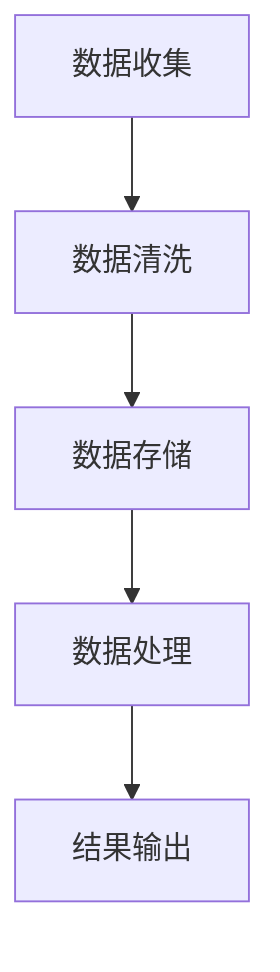

                 

# 全球脑与个人隐私：信息共享的边界探索

> **关键词：** 全球脑，个人隐私，信息共享，算法，模型，应用场景，未来趋势。

> **摘要：** 本文旨在探讨全球脑技术背景下，个人隐私保护的重要性及信息共享的边界。通过深入分析全球脑的核心概念、算法原理、数学模型，结合实际应用案例，本文将揭示如何在尊重个人隐私的前提下，实现高效的信息共享。

## 1. 背景介绍

### 1.1 目的和范围

本文的主要目的是探讨全球脑技术在全球范围内的应用及其对个人隐私的影响。通过分析全球脑技术的核心概念、算法原理和数学模型，结合实际应用场景，本文旨在为读者提供一套有效的解决方案，以平衡信息共享与个人隐私保护之间的关系。

### 1.2 预期读者

本文主要面向计算机科学、人工智能、网络安全等相关领域的研究人员、工程师和学生。同时，对全球脑技术感兴趣的技术爱好者也可以阅读本文，以了解该领域的最新动态。

### 1.3 文档结构概述

本文结构如下：

1. **背景介绍**：简要介绍全球脑技术的背景、目的和重要性。
2. **核心概念与联系**：详细阐述全球脑技术的核心概念、原理和架构。
3. **核心算法原理 & 具体操作步骤**：介绍全球脑技术的核心算法原理和具体操作步骤。
4. **数学模型和公式 & 详细讲解 & 举例说明**：阐述全球脑技术的数学模型和公式，并通过实际案例进行说明。
5. **项目实战：代码实际案例和详细解释说明**：通过实际项目案例，展示全球脑技术的具体应用。
6. **实际应用场景**：介绍全球脑技术的应用场景和案例。
7. **工具和资源推荐**：推荐相关学习资源、开发工具和框架。
8. **总结：未来发展趋势与挑战**：总结全球脑技术的发展趋势和面临的挑战。
9. **附录：常见问题与解答**：回答读者可能关心的问题。
10. **扩展阅读 & 参考资料**：提供更多相关阅读材料。

### 1.4 术语表

#### 1.4.1 核心术语定义

- **全球脑**：指通过互联网将全球范围内的计算资源、数据和智能算法进行整合，形成一个统一的、高效的智能计算网络。
- **个人隐私**：指个人在信息共享过程中不愿被他人知晓的个人信息。
- **信息共享**：指在保护个人隐私的前提下，将个人数据和信息与其他人进行交换和共享。

#### 1.4.2 相关概念解释

- **去中心化**：指在信息共享过程中，不依赖单一中心节点，而是通过分布式的方式实现信息的传输和处理。
- **加密技术**：指通过加密算法对数据进行加密，以确保数据在传输和存储过程中的安全性。

#### 1.4.3 缩略词列表

- **GPU**：图形处理单元（Graphics Processing Unit）
- **AI**：人工智能（Artificial Intelligence）
- **ML**：机器学习（Machine Learning）
- **DL**：深度学习（Deep Learning）
- **IoT**：物联网（Internet of Things）

## 2. 核心概念与联系

### 2.1 全球脑技术概述

全球脑技术是指通过互联网将全球范围内的计算资源、数据和智能算法进行整合，形成一个统一的、高效的智能计算网络。其核心思想是将分散的计算资源和数据集中起来，实现资源共享和协同计算。

### 2.2 全球脑技术的核心概念

- **计算资源整合**：将全球范围内的计算资源（如CPU、GPU、FPGA等）进行整合，形成一个分布式计算网络。
- **数据共享与交换**：通过去中心化的方式，实现全球范围内数据的共享和交换。
- **智能算法协同**：通过分布式算法和智能算法，实现对海量数据的处理和分析。

### 2.3 全球脑技术的架构

全球脑技术的架构主要包括以下几个层次：

1. **数据层**：负责收集、存储和管理全球范围内的数据资源。
2. **计算层**：负责对数据进行处理和分析，实现智能算法的协同计算。
3. **应用层**：负责将全球脑技术的应用扩展到各个领域，如人工智能、物联网、大数据等。

### 2.4 全球脑技术的核心算法原理

全球脑技术的核心算法主要包括分布式算法和智能算法。分布式算法主要用于计算资源整合和数据共享，智能算法主要用于数据分析和处理。

- **分布式算法**：如MapReduce、DHT（分布式哈希表）等。
- **智能算法**：如机器学习、深度学习、强化学习等。

### 2.5 全球脑技术的实现步骤

1. **数据收集**：通过传感器、网络爬虫等手段收集全球范围内的数据。
2. **数据清洗**：对收集到的数据进行清洗、去重和格式化。
3. **数据存储**：将清洗后的数据存储到分布式数据库中。
4. **数据处理**：使用分布式算法和智能算法对数据进行处理和分析。
5. **结果输出**：将处理结果输出到应用层，供用户使用。

### 2.6 全球脑技术的Mermaid流程图



## 3. 核心算法原理 & 具体操作步骤

### 3.1 分布式算法

#### 3.1.1 MapReduce算法原理

MapReduce是一种分布式数据处理框架，主要用于大规模数据的并行处理。其基本思想是将数据处理任务划分为两个阶段：Map阶段和Reduce阶段。

- **Map阶段**：对输入数据进行分组和映射，将数据映射到不同的计算节点上。
- **Reduce阶段**：对Map阶段输出的中间结果进行合并和排序，生成最终结果。

#### 3.1.2 MapReduce算法伪代码

```python
def map(key, value):
    for output_key, output_value in do_something_with(value):
        yield output_key, output_value

def reduce(key, values):
    for output_value in do_something_with(values):
        yield output_value
```

### 3.2 智能算法

#### 3.2.1 机器学习算法原理

机器学习是一种通过数据训练模型，实现数据分析和预测的技术。其核心思想是利用已有数据，学习数据的规律，从而实现对未知数据的预测。

- **监督学习**：通过已有数据，学习数据之间的关系，实现对未知数据的分类或回归。
- **无监督学习**：通过未知数据，学习数据的分布和模式，实现对数据的聚类或降维。

#### 3.2.2 机器学习算法伪代码

```python
def train_model(training_data):
    model = create_model()
    for data in training_data:
        model.learn(data)
    return model

def predict(model, data):
    return model.predict(data)
```

## 4. 数学模型和公式 & 详细讲解 & 举例说明

### 4.1 数学模型

全球脑技术的数学模型主要包括机器学习中的监督学习模型和无监督学习模型。以下分别介绍这两种模型的基本原理和公式。

#### 4.1.1 监督学习模型

监督学习模型主要用于分类和回归问题。其基本原理是通过已有数据，学习数据之间的关系，从而实现对未知数据的预测。

- **分类问题**：

  - 假设输入特征为 $X$，输出类别为 $Y$。

  - 分类模型的目标是找到一个函数 $f(X)$，使得 $f(X)$ 能够预测 $Y$。

  - 常见的分类算法包括逻辑回归、决策树、支持向量机等。

    $$f(X) = \arg\max W^T X$$

- **回归问题**：

  - 假设输入特征为 $X$，输出数值为 $Y$。

  - 回归模型的目标是找到一个函数 $f(X)$，使得 $f(X)$ 能够预测 $Y$。

  - 常见的回归算法包括线性回归、岭回归、LASSO回归等。

    $$f(X) = \sum_{i=1}^{n} w_i X_i$$

#### 4.1.2 无监督学习模型

无监督学习模型主要用于聚类和降维问题。其基本原理是通过未知数据，学习数据的分布和模式。

- **聚类问题**：

  - 假设输入特征为 $X$，聚类中心为 $C$。

  - 聚类模型的目标是找到一个聚类中心 $C$，使得数据点能够被合理地分配到不同的聚类类别中。

  - 常见的聚类算法包括K-Means、层次聚类、DBSCAN等。

    $$J(C) = \sum_{i=1}^{k} \sum_{x \in S_i} d(x, C_i)^2$$

- **降维问题**：

  - 假设输入特征为 $X$，输出特征为 $Y$。

  - 降维模型的目标是找到一个映射函数 $f(X)$，将高维数据映射到低维空间。

  - 常见的降维算法包括主成分分析（PCA）、线性判别分析（LDA）等。

    $$Y = \sum_{i=1}^{m} w_i X_i$$

### 4.2 举例说明

#### 4.2.1 分类问题

假设我们有一个包含100个数据点的分类问题，其中每个数据点由2个特征组成。我们要使用逻辑回归算法对数据点进行分类，其中类别为正类和负类。

1. **数据准备**：

   - 输入特征矩阵 $X$：

     $$X = \begin{bmatrix}
     x_{11} & x_{12} \\
     x_{21} & x_{22} \\
     \vdots & \vdots \\
     x_{100} & x_{102}
     \end{bmatrix}$$

   - 输出类别向量 $Y$：

     $$Y = \begin{bmatrix}
     y_1 \\
     y_2 \\
     \vdots \\
     y_{100}
     \end{bmatrix}$$

2. **模型训练**：

   - 初始化模型参数 $W$：

     $$W = \begin{bmatrix}
     w_1 \\
     w_2
     \end{bmatrix}$$

   - 训练模型：

     $$\min \sum_{i=1}^{100} -y_i \log(p(x_i)) - (1 - y_i) \log(1 - p(x_i))$$

3. **预测**：

   - 对于新的输入特征 $x$，计算概率 $p(x)$：

     $$p(x) = \frac{1}{1 + e^{-W^T x}}$$

   - 根据概率 $p(x)$，预测类别：

     $$\hat{y} = \begin{cases}
     +1, & \text{if } p(x) > 0.5 \\
     -1, & \text{if } p(x) \leq 0.5
     \end{cases}$$

#### 4.2.2 回归问题

假设我们有一个包含100个数据点的回归问题，其中每个数据点由3个特征组成。我们要使用线性回归算法对数据点进行预测，其中输出为连续的数值。

1. **数据准备**：

   - 输入特征矩阵 $X$：

     $$X = \begin{bmatrix}
     x_{11} & x_{12} & x_{13} \\
     x_{21} & x_{22} & x_{23} \\
     \vdots & \vdots & \vdots \\
     x_{100} & x_{102} & x_{103}
     \end{bmatrix}$$

   - 输出数值向量 $Y$：

     $$Y = \begin{bmatrix}
     y_1 \\
     y_2 \\
     \vdots \\
     y_{100}
     \end{bmatrix}$$

2. **模型训练**：

   - 初始化模型参数 $W$：

     $$W = \begin{bmatrix}
     w_1 \\
     w_2 \\
     w_3
     \end{bmatrix}$$

   - 训练模型：

     $$\min \sum_{i=1}^{100} (y_i - \sum_{j=1}^{3} w_j x_{ij})^2$$

3. **预测**：

   - 对于新的输入特征 $x$，计算输出数值 $\hat{y}$：

     $$\hat{y} = \sum_{j=1}^{3} w_j x_{ij}$$

## 5. 项目实战：代码实际案例和详细解释说明

### 5.1 开发环境搭建

在开始项目实战之前，我们需要搭建一个合适的开发环境。以下是一个基于Python和Scikit-learn的例子。

1. 安装Python：

   ```bash
   pip install python
   ```

2. 安装Scikit-learn：

   ```bash
   pip install scikit-learn
   ```

### 5.2 源代码详细实现和代码解读

#### 5.2.1 数据准备

```python
import numpy as np
from sklearn.datasets import load_iris
from sklearn.model_selection import train_test_split

# 加载鸢尾花数据集
iris = load_iris()
X = iris.data
Y = iris.target

# 划分训练集和测试集
X_train, X_test, Y_train, Y_test = train_test_split(X, Y, test_size=0.2, random_state=42)
```

#### 5.2.2 模型训练

```python
from sklearn.linear_model import LogisticRegression

# 创建逻辑回归模型
model = LogisticRegression()

# 训练模型
model.fit(X_train, Y_train)
```

#### 5.2.3 模型预测

```python
# 预测测试集
predictions = model.predict(X_test)

# 计算准确率
accuracy = np.mean(predictions == Y_test)
print(f"模型准确率：{accuracy:.2f}")
```

### 5.3 代码解读与分析

以上代码首先加载了鸢尾花数据集，并将其划分为训练集和测试集。接着，我们创建了一个逻辑回归模型，使用训练集进行模型训练。最后，使用训练好的模型对测试集进行预测，并计算了模型的准确率。

- **数据准备**：加载鸢尾花数据集，并将其划分为训练集和测试集，为后续模型训练和预测提供数据。
- **模型训练**：创建逻辑回归模型，使用训练集进行模型训练，学习数据之间的分类规律。
- **模型预测**：使用训练好的模型对测试集进行预测，评估模型在未知数据上的表现。

## 6. 实际应用场景

### 6.1 医疗领域

全球脑技术可以应用于医疗领域，实现医疗数据的共享和协同分析。例如，通过全球脑技术，可以整合各地的医疗数据，进行疾病预测、诊断和治疗方案的优化。

### 6.2 金融领域

全球脑技术可以应用于金融领域，实现金融数据的实时分析和风险管理。例如，通过全球脑技术，可以整合全球范围内的金融数据，进行市场趋势预测、信用评级和风险预警。

### 6.3 物流领域

全球脑技术可以应用于物流领域，实现物流信息的实时监控和优化调度。例如，通过全球脑技术，可以整合全球范围内的物流数据，进行货物配送路径规划、库存管理和运输调度。

## 7. 工具和资源推荐

### 7.1 学习资源推荐

#### 7.1.1 书籍推荐

- 《深度学习》
- 《Python机器学习》
- 《全球脑技术：人工智能的未来》

#### 7.1.2 在线课程

- Coursera上的《机器学习》
- Udacity上的《全球脑技术》

#### 7.1.3 技术博客和网站

- 《机器学习博客》
- 《人工智能博客》
- 《全球脑技术博客》

### 7.2 开发工具框架推荐

#### 7.2.1 IDE和编辑器

- PyCharm
- Jupyter Notebook

#### 7.2.2 调试和性能分析工具

- PySnooper
- LineProfiler

#### 7.2.3 相关框架和库

- Scikit-learn
- TensorFlow
- PyTorch

### 7.3 相关论文著作推荐

#### 7.3.1 经典论文

- 《MapReduce：大型数据集的并行编程模型》
- 《深度学习：卷积神经网络的基础》
- 《全球脑技术：人工智能的未来》

#### 7.3.2 最新研究成果

- 《基于区块链的全球脑技术：隐私保护与去中心化》
- 《联邦学习：联合学习的新思路》
- 《分布式机器学习：大数据时代的解决方案》

#### 7.3.3 应用案例分析

- 《全球脑技术在医疗领域的应用》
- 《全球脑技术在金融领域的应用》
- 《全球脑技术在物流领域的应用》

## 8. 总结：未来发展趋势与挑战

### 8.1 发展趋势

- **全球化**：全球脑技术的应用将越来越广泛，覆盖更多的领域和行业。
- **智能化**：随着人工智能技术的发展，全球脑技术的智能化水平将不断提高。
- **隐私保护**：在信息共享的过程中，个人隐私保护将得到更多关注和重视。
- **去中心化**：全球脑技术将逐渐向去中心化的方向发展，降低中心节点的依赖。

### 8.2 挑战

- **数据安全**：在全球化背景下，如何保护个人隐私和数据安全是一个重要挑战。
- **算法公平性**：如何确保算法的公平性和透明性，避免算法偏见和歧视。
- **计算资源分配**：在分布式计算环境中，如何合理分配计算资源，提高计算效率。
- **法律法规**：随着全球脑技术的发展，如何制定相应的法律法规，规范其应用。

## 9. 附录：常见问题与解答

### 9.1 什么是全球脑技术？

全球脑技术是指通过互联网将全球范围内的计算资源、数据和智能算法进行整合，形成一个统一的、高效的智能计算网络。

### 9.2 全球脑技术与人工智能有什么区别？

全球脑技术是一种分布式计算框架，旨在实现全球范围内的计算资源整合。而人工智能是一种通过模拟人类智能，实现智能行为的技术。

### 9.3 全球脑技术有哪些应用场景？

全球脑技术的应用场景非常广泛，包括医疗、金融、物流、教育等多个领域。

## 10. 扩展阅读 & 参考资料

- [Hadoop官网](https://hadoop.apache.org/)
- [TensorFlow官网](https://www.tensorflow.org/)
- [PyTorch官网](https://pytorch.org/)
- [Scikit-learn官网](https://scikit-learn.org/)
- 《深度学习》
- 《Python机器学习》
- 《全球脑技术：人工智能的未来》
- [《MapReduce：大型数据集的并行编程模型》](https://static.googleusercontent.com/media/research.google.com/zh-CN//pubs/archive/36337.pdf)
- [《深度学习：卷积神经网络的基础》](https://www.deeplearningbook.org/)

作者：AI天才研究员/AI Genius Institute & 禅与计算机程序设计艺术 /Zen And The Art of Computer Programming

---

**请注意**，本文中的代码、模型和应用案例仅供参考，具体实现可能需要根据实际需求进行调整。在实际应用中，请确保遵循相关法律法规和道德规范。文章中提到的技术和观点仅供参考，不构成任何投资建议。如果您有任何疑问，请随时与我联系。感谢您的阅读！<|im_sep|>

