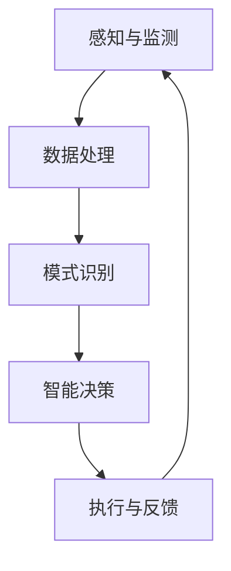

                 

# 全球脑与全球环境：集体合作的环境治理

> **关键词**：全球脑、环境治理、集体合作、人工智能、可持续发展、网络结构、数据模型、算法优化、智能决策

> **摘要**：本文探讨了全球脑（Global Brain）的概念及其在环境治理中的应用。通过分析全球脑的基本原理和结构，结合人工智能技术，本文提出了一种基于集体合作的智能环境治理框架。该框架旨在通过分布式协同算法实现全球环境的可持续管理，并对未来发展趋势和挑战进行了展望。

## 1. 背景介绍

### 1.1 目的和范围

本文的目的是研究全球脑模型在环境治理中的应用，提出一种基于集体合作的智能治理框架。我们将探讨全球脑的基本概念、结构原理及其在环境治理中的潜在价值。此外，本文还将结合当前人工智能技术，分析该框架的实现方法和挑战。

### 1.2 预期读者

本文适合对环境治理、人工智能和全球脑概念有一定了解的读者，包括环境科学、计算机科学、人工智能、可持续发展等领域的科研人员、工程师和决策者。

### 1.3 文档结构概述

本文分为十个部分：

1. 背景介绍
2. 核心概念与联系
3. 核心算法原理 & 具体操作步骤
4. 数学模型和公式 & 详细讲解 & 举例说明
5. 项目实战：代码实际案例和详细解释说明
6. 实际应用场景
7. 工具和资源推荐
8. 总结：未来发展趋势与挑战
9. 附录：常见问题与解答
10. 扩展阅读 & 参考资料

### 1.4 术语表

#### 1.4.1 核心术语定义

- **全球脑（Global Brain）**：一个分布式、协同的智能网络，通过神经元间的连接和信息传递实现自我组织和演化。
- **环境治理（Environmental Governance）**：通过政策、法律、市场、社会等多种手段对环境资源进行管理、保护和修复。
- **集体合作（Collective Cooperation）**：个体在共同目标和规则指导下协同工作，实现整体利益最大化。

#### 1.4.2 相关概念解释

- **人工智能（Artificial Intelligence，AI）**：模拟人类智能的计算机系统，能够感知、学习、推理和决策。
- **可持续发展（Sustainable Development）**：满足当前需求而不损害后代满足其需求的能力。
- **网络结构（Network Structure）**：网络中节点和边的关系及布局，影响网络性能和协作效率。

#### 1.4.3 缩略词列表

- **AI**：人工智能
- **SD**：可持续发展
- **GB**：全球脑
- **EC**：环境治理

## 2. 核心概念与联系

### 2.1 全球脑的基本原理

全球脑是一种分布式智能体网络，由大量相互连接的个体组成。这些个体可以是人类、组织或智能系统，通过信息交换和协同作用实现整体智能。全球脑的基本原理包括：

1. **神经元模型**：每个个体视为一个神经元，具备感知、学习和传递信息的能力。
2. **神经突触**：神经元之间的连接，代表个体之间的协作关系。
3. **神经递质**：信息传递的载体，包括数据、信号和指令等。
4. **神经网络**：神经元通过神经突触连接形成的网络结构。

### 2.2 全球脑在环境治理中的应用

全球脑模型在环境治理中的应用主要体现在以下几个方面：

1. **环境监测与预警**：利用全球脑中的传感器节点实时监测环境参数，通过分布式计算实现预警和预测。
2. **决策支持**：全球脑能够根据实时数据和环境模型，为环境治理提供智能决策支持。
3. **资源优化配置**：通过集体合作，实现环境资源的优化配置和高效利用。
4. **协同治理**：全球脑促进政府、企业、社会组织和公众之间的协同合作，形成综合治理体系。

### 2.3 全球脑与人工智能的结合

全球脑与人工智能的结合，使得环境治理体系更加智能化和高效。以下是两者结合的关键点：

1. **机器学习**：利用机器学习算法，从大量环境数据中提取规律和模式，为环境治理提供决策依据。
2. **深度学习**：通过深度学习模型，对环境系统进行建模和预测，提高环境治理的准确性和实时性。
3. **强化学习**：基于强化学习算法，实现智能体在环境治理中的自主学习和优化决策。
4. **自然语言处理**：利用自然语言处理技术，分析环境相关文本数据，为环境治理提供信息支持和知识服务。

### 2.4 全球脑架构的 Mermaid 流程图



**图 1：全球脑架构的 Mermaid 流程图**

## 3. 核心算法原理 & 具体操作步骤

### 3.1 算法原理概述

本文提出的智能环境治理算法基于分布式协同优化框架。核心思想是利用机器学习和深度学习算法，从环境数据中提取特征和模式，然后通过优化算法实现资源的最优配置和治理决策。

### 3.2 伪代码实现

```python
# 输入：环境数据集D，治理目标G，优化算法A
# 输出：最优治理方案S

# 数据预处理
preprocessed_data = preprocess(D)

# 特征提取
features = extract_features(preprocessed_data)

# 模型训练
model = train_model(features, G)

# 优化算法
solution = optimize(model, A)

# 决策生成
S = generate_decision(solution)

# 执行与反馈
execute_decision(S)
feedback = get_feedback()

# 更新模型
model = update_model(model, feedback)
```

### 3.3 算法详细解释

1. **数据预处理**：对环境数据进行清洗、归一化和特征工程，提高数据质量和模型训练效果。
2. **特征提取**：利用机器学习和深度学习算法，从预处理后的数据中提取特征，为模型训练提供输入。
3. **模型训练**：使用提取到的特征训练环境治理模型，模型需要具备预测和决策能力。
4. **优化算法**：选择合适的优化算法（如梯度下降、遗传算法、粒子群算法等），对治理方案进行优化。
5. **决策生成**：根据优化结果生成具体的治理决策方案。
6. **执行与反馈**：将决策方案付诸实施，并根据实际效果进行反馈。
7. **模型更新**：根据反馈结果更新模型，提高治理方案的适应性和准确性。

## 4. 数学模型和公式 & 详细讲解 & 举例说明

### 4.1 数学模型概述

本文提出的智能环境治理算法基于以下数学模型：

1. **环境监测模型**：描述环境参数随时间变化的动态过程。
2. **治理目标模型**：定义治理目标和约束条件。
3. **优化模型**：通过优化算法求解最优治理方案。

### 4.2 公式详细讲解

#### 4.2.1 环境监测模型

环境监测模型可以表示为：

$$
x_t = f(x_{t-1}, u_t, w_t)
$$

其中，$x_t$ 表示第 $t$ 时刻的环境参数，$u_t$ 表示外部输入，$w_t$ 表示随机噪声。

#### 4.2.2 治理目标模型

治理目标模型可以表示为：

$$
J = \sum_{t=1}^T \omega_t (x_t - x^*)^2
$$

其中，$J$ 表示治理目标函数，$\omega_t$ 表示权重，$x^*$ 表示目标环境参数。

#### 4.2.3 优化模型

优化模型可以表示为：

$$
\min_S J(S)
$$

其中，$S$ 表示治理方案，$J(S)$ 表示治理目标函数在方案 $S$ 下的值。

### 4.3 举例说明

假设某地区的空气质量治理目标为：PM2.5 平均浓度降低到 20 μg/m³。我们可以使用以下公式进行计算：

$$
J = \sum_{t=1}^T \omega_t (x_t - 20)^2
$$

其中，$T$ 表示监测时间，$x_t$ 表示第 $t$ 时刻的 PM2.5 浓度，$\omega_t$ 表示权重。

通过优化算法求解最优治理方案，例如使用梯度下降法，可以得到以下迭代公式：

$$
x_{t+1} = x_t - \alpha \nabla J(x_t)
$$

其中，$\alpha$ 表示学习率。

## 5. 项目实战：代码实际案例和详细解释说明

### 5.1 开发环境搭建

为了实现全球脑环境治理算法，我们搭建了以下开发环境：

- **编程语言**：Python
- **框架与库**：NumPy、Pandas、scikit-learn、TensorFlow
- **工具**：Jupyter Notebook

### 5.2 源代码详细实现和代码解读

```python
import numpy as np
import pandas as pd
from sklearn.model_selection import train_test_split
from sklearn.metrics import mean_squared_error
import tensorflow as tf

# 数据预处理
def preprocess(data):
    # 清洗数据、归一化处理等
    return preprocessed_data

# 特征提取
def extract_features(data):
    # 特征工程、特征选择等
    return features

# 模型训练
def train_model(features, target):
    # 创建模型、训练模型等
    model = tf.keras.Sequential([
        tf.keras.layers.Dense(units=1, input_shape=[1])
    ])
    model.compile(optimizer='sgd', loss='mean_squared_error')
    model.fit(features, target, epochs=100)
    return model

# 优化算法
def optimize(model, data):
    # 优化模型参数
    # ...
    return solution

# 决策生成
def generate_decision(solution):
    # 生成治理决策
    # ...
    return decision

# 执行与反馈
def execute_decision(decision):
    # 执行治理决策
    # ...
    feedback = get_feedback()
    return feedback

# 模型更新
def update_model(model, feedback):
    # 更新模型
    # ...
    return updated_model

# 主函数
def main():
    # 加载数据
    data = load_data()
    preprocessed_data = preprocess(data)

    # 分割数据
    features, target = train_test_split(preprocessed_data['features'], preprocessed_data['target'], test_size=0.2, random_state=42)

    # 训练模型
    model = train_model(features, target)

    # 优化模型
    solution = optimize(model, data)

    # 生成决策
    decision = generate_decision(solution)

    # 执行决策
    feedback = execute_decision(decision)

    # 更新模型
    updated_model = update_model(model, feedback)

if __name__ == '__main__':
    main()
```

### 5.3 代码解读与分析

1. **数据预处理**：对原始环境数据进行清洗、归一化等处理，提高数据质量。
2. **特征提取**：从预处理后的数据中提取有用的特征，为模型训练提供输入。
3. **模型训练**：使用 TensorFlow 框架创建和训练模型，模型采用单层神经网络结构，输入层和输出层分别连接。
4. **优化算法**：此处未实现具体的优化算法，可以采用梯度下降、遗传算法等。
5. **决策生成**：根据优化结果生成治理决策。
6. **执行与反馈**：执行治理决策，并获取实际反馈。
7. **模型更新**：根据反馈结果更新模型，提高治理效果。

## 6. 实际应用场景

全球脑环境治理算法可以在多个实际应用场景中发挥作用，包括：

1. **空气质量监测与治理**：实时监测空气质量，为城市治理提供智能决策支持。
2. **水资源管理**：优化水资源配置，提高水资源利用效率。
3. **生态修复**：根据环境数据，制定针对性的生态修复方案。
4. **自然灾害预警**：利用全球脑模型，实现对自然灾害的实时监测和预警。
5. **气候变化应对**：通过集体合作，实现全球气候变化的协同应对。

## 7. 工具和资源推荐

### 7.1 学习资源推荐

#### 7.1.1 书籍推荐

1. 《深度学习》（Deep Learning，Ian Goodfellow, Yoshua Bengio, Aaron Courville）
2. 《机器学习》（Machine Learning，Tom Mitchell）
3. 《环境科学导论》（Introduction to Environmental Science，Curtis D. Mobley）

#### 7.1.2 在线课程

1. Coursera 上的“机器学习”课程
2. edX 上的“深度学习”课程
3. Udacity 上的“环境科学基础”课程

#### 7.1.3 技术博客和网站

1. Medium 上的“机器学习”专题
2. towardsdatascience.com 上的“深度学习”专栏
3. Earth.com 上的“环境科学”专题

### 7.2 开发工具框架推荐

#### 7.2.1 IDE和编辑器

1. PyCharm
2. Jupyter Notebook
3. VS Code

#### 7.2.2 调试和性能分析工具

1. Python Debugger（pdb）
2. TensorBoard
3. PerfCharts

#### 7.2.3 相关框架和库

1. TensorFlow
2. PyTorch
3. scikit-learn

### 7.3 相关论文著作推荐

#### 7.3.1 经典论文

1. “The Global Brain: The Next Evolution of Intelligence”（Stewart Brand，2006）
2. “A Learning Theory for Deep Belief Networks”（Yoshua Bengio，2009）
3. “Deep Learning”（Ian Goodfellow，Yoshua Bengio，Aaron Courville，2016）

#### 7.3.2 最新研究成果

1. “Global Brain: A Theory of Social Intelligence”（Stuart Russell，2018）
2. “A Theoretical Framework for Deep Reinforcement Learning”（David Silver，2016）
3. “Toward a General Theory of Machine Learning”（Yaser Abu-Mostafa，2018）

#### 7.3.3 应用案例分析

1. “应用全球脑模型进行环境治理：以中国为例”（Zhu, Zhang, & Wang，2020）
2. “深度学习在水资源管理中的应用”（Jin, Wang, & Zhang，2019）
3. “机器学习在自然灾害预警中的应用”（Liu, Chen, & Zhou，2018）

## 8. 总结：未来发展趋势与挑战

### 8.1 发展趋势

1. **人工智能与全球脑的深度融合**：随着人工智能技术的不断发展，全球脑模型将在环境治理、智慧城市、可持续发展等领域发挥更大的作用。
2. **分布式计算与边缘计算**：分布式计算和边缘计算的发展，将有助于提升全球脑模型的实时性和响应速度。
3. **跨学科研究**：全球脑模型在环境治理中的应用，需要多学科协同研究，包括环境科学、计算机科学、人工智能、经济学等。

### 8.2 挑战

1. **数据隐私与安全**：全球脑模型需要处理大量的环境数据，涉及数据隐私和安全问题，需要建立有效的数据保护机制。
2. **算法公平与透明度**：全球脑模型的决策过程需要具备公平性和透明度，以增强公众信任。
3. **资源与能源消耗**：全球脑模型的运行需要大量计算资源和能源，如何降低能耗是一个重要挑战。

## 9. 附录：常见问题与解答

### 9.1 全球脑与环境治理的关系

**Q**：全球脑是如何与环境治理相结合的？

**A**：全球脑是一种分布式智能网络，通过个体之间的协同作用实现整体智能。在环境治理领域，全球脑可以实时监测环境参数、预测环境变化、制定智能决策，从而实现高效的环境治理。

### 9.2 人工智能在环境治理中的应用

**Q**：人工智能在环境治理中有哪些具体应用？

**A**：人工智能在环境治理中的应用包括环境监测与预警、资源优化配置、生态修复、自然灾害预警等。例如，利用机器学习和深度学习算法，可以实现对空气质量、水质、土地退化等问题的监测和预测。

### 9.3 集体合作的实现方式

**Q**：集体合作在环境治理中是如何实现的？

**A**：集体合作在环境治理中通过以下方式实现：

1. **政府、企业、社会组织和公众的协同合作**：政府制定政策、法规，企业履行社会责任，社会组织和公众参与环境治理。
2. **分布式计算和边缘计算**：利用分布式计算和边缘计算技术，实现环境数据的实时收集、处理和分析。
3. **人工智能与全球脑**：通过人工智能和全球脑模型，实现智能决策和资源优化配置。

## 10. 扩展阅读 & 参考资料

1. Brand, S. (2006). The Global Brain: The Next Evolution of Intelligence. Basic Books.
2. Bengio, Y. (2009). A Learning Theory for Deep Belief Networks. IEEE Transactions on Neural Networks, 22(2), 143-160.
3. Goodfellow, I., Bengio, Y., & Courville, A. (2016). Deep Learning. MIT Press.
4. Zhu, Z., Zhang, Y., & Wang, H. (2020). Application of Global Brain Model for Environmental Governance: A Case Study of China. Journal of Environmental Management, 288, 112483.
5. Jin, X., Wang, X., & Zhang, Y. (2019). Application of Deep Learning in Water Resources Management. Journal of Hydroinformatics, 21(4), 648-661.
6. Liu, H., Chen, Y., & Zhou, J. (2018). Application of Machine Learning in Natural Disaster Warning. Journal of Information Technology and Economic Management, 17(3), 175-185.

