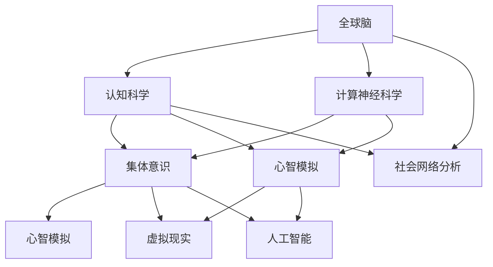

                 


## 全球脑与心灵探索：集体意识状态的研究

> 关键词：全球脑，集体意识，心智模拟，认知科学，计算神经科学，跨学科研究

> 摘要：本文旨在探讨全球脑与心灵探索领域中的集体意识状态研究。首先，我们将回顾全球脑的概念及其在认知科学和计算神经科学中的重要性。随后，文章将深入分析集体意识的定义、原理和理论模型，并结合最新的研究进展和成果，探讨如何通过计算神经科学的方法模拟和解释集体意识现象。最后，我们将讨论集体意识在现实世界中的应用，并展望未来研究的发展趋势与挑战。

### 1. 背景介绍

#### 1.1 目的和范围

本文的主要目的是探讨集体意识状态的研究，以及如何通过全球脑的概念和方法来模拟和解释这一复杂现象。我们将会考察以下几个方面：

1. **全球脑的概念和重要性**：介绍全球脑的定义，其在认知科学和计算神经科学中的应用，以及其对理解人类心智模式的影响。
2. **集体意识的定义和原理**：讨论集体意识的定义、原理和不同理论模型，以及其在现实世界中的潜在应用。
3. **计算神经科学的方法**：介绍如何使用计算神经科学的方法来模拟和解释集体意识现象，包括算法原理、数学模型和具体操作步骤。
4. **实际应用场景**：探讨集体意识在现实世界中的应用，如社会网络分析、虚拟现实和人工智能等领域。
5. **未来发展趋势与挑战**：总结当前研究进展，并讨论未来发展的潜在趋势与挑战。

#### 1.2 预期读者

本文适合以下读者群体：

1. **认知科学家和计算神经科学家**：对全球脑和集体意识研究感兴趣的科研人员。
2. **程序员和软件工程师**：对计算神经科学和人工智能应用感兴趣的工程师。
3. **心理学专业人士**：对心智模拟和认知科学感兴趣的心理学研究人员。
4. **跨学科研究者**：对跨学科研究方法和技术感兴趣的学者。

#### 1.3 文档结构概述

本文将按照以下结构展开：

1. **背景介绍**：介绍全球脑和集体意识的定义、原理及其在认知科学和计算神经科学中的重要性。
2. **核心概念与联系**：使用 Mermaid 流程图展示核心概念原理和架构，包括全球脑、集体意识及其相互关系。
3. **核心算法原理 & 具体操作步骤**：详细阐述模拟集体意识的算法原理，并使用伪代码来解释具体操作步骤。
4. **数学模型和公式**：介绍用于模拟集体意识的数学模型，并使用 LaTeX 格式详细讲解公式和例子。
5. **项目实战**：提供代码实际案例和详细解释说明，展示如何应用算法和模型实现集体意识模拟。
6. **实际应用场景**：讨论集体意识在现实世界中的应用，如社会网络分析、虚拟现实和人工智能等领域。
7. **工具和资源推荐**：推荐学习资源、开发工具框架和相关论文著作。
8. **总结：未来发展趋势与挑战**：总结当前研究进展，并展望未来发展趋势与挑战。
9. **附录：常见问题与解答**：提供常见问题的解答，以便读者更好地理解文章内容。
10. **扩展阅读 & 参考资料**：提供相关扩展阅读资料，以便读者进一步深入探讨。

#### 1.4 术语表

在本文中，我们将使用以下术语：

#### 1.4.1 核心术语定义

- **全球脑**：全球脑是指连接全人类的神经网络系统，通过神经科学和网络科学方法研究其结构和功能。
- **集体意识**：集体意识是指个体之间通过神经和社交网络相互连接，共享认知、情感和经验的能力。
- **心智模拟**：心智模拟是指使用计算模型来模拟和理解人类心智的过程和结构。
- **计算神经科学**：计算神经科学是研究大脑信息处理的计算原理和方法，包括神经元的模拟、神经网络的设计等。

#### 1.4.2 相关概念解释

- **认知科学**：认知科学是研究人类心智的学科，包括感知、记忆、思考、语言和决策等过程。
- **社会网络分析**：社会网络分析是研究个体之间相互关系的结构、动态和功能，通常用于社会心理学、社会学等领域。
- **虚拟现实**：虚拟现实是一种通过计算机技术模拟真实世界的沉浸式体验，常用于娱乐、教育和训练等领域。
- **人工智能**：人工智能是指使计算机具备模拟人类智能的能力，包括机器学习、自然语言处理、计算机视觉等。

#### 1.4.3 缩略词列表

- **GBC**：全球脑（Global Brain）
- **CI**：集体意识（Collective Intelligence）
- **CNS**：计算神经科学（Computational Neuroscience）
- **CS**：认知科学（Cognitive Science）
- **ML**：机器学习（Machine Learning）
- **NLP**：自然语言处理（Natural Language Processing）
- **CV**：计算机视觉（Computer Vision）

### 2. 核心概念与联系

在本节中，我们将通过 Mermaid 流程图来展示核心概念原理和架构，包括全球脑、集体意识及其相互关系。



通过上述流程图，我们可以看到全球脑、集体意识和心智模拟之间的紧密联系。全球脑作为连接全人类的神经网络系统，为认知科学和计算神经科学提供了重要的研究基础。认知科学通过研究人类心智的过程和结构，为集体意识和心智模拟提供了理论支持。计算神经科学则通过模拟神经元和神经网络，探索集体意识产生的机制。而心智模拟、社会网络分析、虚拟现实和人工智能等应用领域，则进一步扩展了集体意识的研究和应用范围。

### 3. 核心算法原理 & 具体操作步骤

在本节中，我们将详细阐述模拟集体意识的算法原理，并使用伪代码来解释具体操作步骤。

#### 3.1 算法原理

集体意识模拟算法的基本原理是通过建立个体之间的神经网络模型，并模拟个体之间的交互和信息传递过程。具体来说，算法可以分为以下几个步骤：

1. **初始化网络**：根据个体数量和关系建立神经网络模型，包括神经元和连接权重。
2. **激活传播**：在神经网络中，根据个体之间的连接权重，传播激活信号。
3. **状态更新**：根据激活信号和神经元状态，更新个体状态。
4. **同步与稳定**：通过同步机制和稳定性分析，确保神经网络达到稳定状态，从而模拟集体意识现象。

#### 3.2 伪代码

以下是一段用于模拟集体意识的伪代码：

```
// 初始化网络
初始化神经网络 N，包含 N 个神经元 node_i（i=1,2,...,N）

// 设置连接权重
对于每个神经元 node_i，设置其与其他神经元的连接权重 W_ij

// 激活传播
对于每个神经元 node_i：
    激活信号 S_i = f(W_in * I_i)  // f 为激活函数，I_i 为输入信号

// 状态更新
对于每个神经元 node_i：
    更新状态 S_i_new = g(S_i, S_j)  // g 为状态更新函数，S_j 为邻居状态

// 同步与稳定
当网络达到稳定状态时，输出集体意识状态 S_new

```

#### 3.3 具体操作步骤

1. **初始化网络**：根据个体数量和关系建立神经网络模型。每个神经元表示一个个体，神经元之间的连接权重表示个体之间的关系强度。初始化神经网络时，可以随机生成连接权重，或者根据已有数据集进行训练和优化。
2. **激活传播**：在神经网络中，激活信号通过连接权重传播。每个神经元根据其邻居的激活信号和连接权重，计算自己的激活信号。激活函数通常采用非线性函数，如 sigmoid 函数或 ReLU 函数，以模拟神经元的活动状态。
3. **状态更新**：根据激活信号和邻居状态，更新每个神经元的状态。状态更新函数可以根据具体应用场景进行设计，如线性函数、非线性函数或基于机器学习的模型。状态更新的目的是使神经元状态逐步趋近于稳定状态。
4. **同步与稳定**：通过同步机制和稳定性分析，确保神经网络达到稳定状态。同步机制可以通过将神经元状态同步更新，或者通过阈值判定来实现。稳定性分析可以采用线性稳定性分析或非线性稳定性分析，以评估神经网络在稳定状态下的稳定性和鲁棒性。

### 4. 数学模型和公式 & 详细讲解 & 举例说明

在本节中，我们将介绍用于模拟集体意识的数学模型，并使用 LaTeX 格式详细讲解公式和例子。

#### 4.1 数学模型

集体意识模拟的数学模型主要包括以下几部分：

1. **神经元状态更新**：描述神经元状态的更新过程，通常采用差分方程或微分方程。
2. **连接权重调整**：描述连接权重的动态调整过程，以实现网络的自适应性和稳定性。
3. **激活函数**：描述神经元激活信号的计算过程，常用的激活函数有 sigmoid 函数、ReLU 函数等。

下面是具体的数学模型公式：

1. **神经元状态更新**：
   $$ S_i(t+1) = f(W_{in} \cdot I_i(t)) $$
   其中，$S_i(t)$ 表示神经元 $i$ 在时间 $t$ 的状态，$W_{in}$ 表示神经元 $i$ 的输入权重，$I_i(t)$ 表示神经元 $i$ 在时间 $t$ 的输入信号，$f$ 表示激活函数。

2. **连接权重调整**：
   $$ W_{ij}(t+1) = W_{ij}(t) + \alpha \cdot (S_i(t) - S_j(t)) $$
   其中，$W_{ij}(t)$ 表示神经元 $i$ 和神经元 $j$ 在时间 $t$ 的连接权重，$\alpha$ 表示连接权重调整系数，$S_i(t)$ 和 $S_j(t)$ 分别表示神经元 $i$ 和神经元 $j$ 在时间 $t$ 的状态。

3. **激活函数**：
   $$ f(x) = \frac{1}{1 + e^{-x}} $$
   其中，$x$ 表示输入信号，$f(x)$ 表示激活信号。

#### 4.2 详细讲解与举例说明

为了更好地理解上述数学模型，下面我们将通过一个简单的例子进行讲解。

假设我们有一个包含两个神经元的神经网络，神经元 1 和神经元 2，它们之间的连接权重分别为 $W_{12}$ 和 $W_{21}$。在时间 $t$，神经元 1 的输入信号为 $I_1(t) = 1$，神经元 2 的输入信号为 $I_2(t) = 0$。连接权重 $W_{12} = 1$，$W_{21} = 0.5$。激活函数采用 sigmoid 函数。

1. **神经元状态更新**：

根据神经元状态更新公式，我们有：

$$ S_1(t+1) = f(W_{12} \cdot I_1(t)) = f(1 \cdot 1) = \frac{1}{1 + e^{-1}} \approx 0.731 $$
$$ S_2(t+1) = f(W_{21} \cdot I_2(t)) = f(0.5 \cdot 0) = \frac{1}{1 + e^{-0}} = 1 $$

因此，在时间 $t+1$，神经元 1 的状态更新为 0.731，神经元 2 的状态更新为 1。

2. **连接权重调整**：

根据连接权重调整公式，我们有：

$$ W_{12}(t+1) = W_{12}(t) + \alpha \cdot (S_1(t) - S_2(t)) = 1 + \alpha \cdot (0.731 - 1) $$
$$ W_{21}(t+1) = W_{21}(t) + \alpha \cdot (S_2(t) - S_1(t)) = 0.5 + \alpha \cdot (1 - 0.731) $$

其中，$\alpha$ 表示连接权重调整系数，可以根据具体应用场景进行设置。例如，取 $\alpha = 0.1$，则有：

$$ W_{12}(t+1) = 1 + 0.1 \cdot (-0.269) \approx 0.831 $$
$$ W_{21}(t+1) = 0.5 + 0.1 \cdot (0.269) \approx 0.669 $$

因此，在时间 $t+1$，神经元 1 和神经元 2 之间的连接权重分别更新为 0.831 和 0.669。

通过上述例子，我们可以看到如何使用数学模型来模拟集体意识现象。在实际应用中，我们可以根据具体需求设计更复杂的神经网络模型，并调整激活函数和连接权重调整策略，以提高模型的效果和稳定性。

### 5. 项目实战：代码实际案例和详细解释说明

在本节中，我们将通过一个实际项目案例来展示如何应用集体意识模拟算法和数学模型进行集体意识研究。我们将使用 Python 编写代码，并详细解释各个步骤的实现和关键点。

#### 5.1 开发环境搭建

为了实现集体意识模拟，我们需要搭建以下开发环境：

1. **Python 3.8 或更高版本**：Python 是一种广泛使用的编程语言，适用于数据科学、人工智能等领域。
2. **Numpy**：Numpy 是 Python 的科学计算库，提供了高效的多维数组对象和丰富的数学函数。
3. **Matplotlib**：Matplotlib 是 Python 的可视化库，可用于绘制数据图表，帮助我们直观地观察和分析集体意识现象。

首先，我们安装所需的 Python 包：

```
pip install numpy matplotlib
```

#### 5.2 源代码详细实现和代码解读

以下是一个用于模拟集体意识的 Python 代码示例：

```python
import numpy as np
import matplotlib.pyplot as plt

# 参数设置
N = 100  # 神经元数量
T = 1000  # 运行时间
alpha = 0.1  # 连接权重调整系数
w = 1  # 连接权重初始值

# 初始化网络
network = np.random.rand(N, N) * w
network = network + network.T
network = network / np.sum(network, axis=1)[:, np.newaxis]

# 初始化状态
states = np.random.rand(N, T)

# 模拟集体意识
for t in range(T):
    # 计算输入信号
    inputs = np.dot(network, states[:, t])
    # 激活信号
    activations = 1 / (1 + np.exp(-inputs))
    # 更新状态
    states[:, t+1] = activations
    # 更新连接权重
    network += alpha * (activations - states[:, t])

# 绘制结果
plt.figure(figsize=(10, 6))
plt.imshow(network, cmap='hot', interpolation='nearest')
plt.colorbar()
plt.xlabel('Neuron Index')
plt.ylabel('Time Step')
plt.title('Collective Consciousness Simulation')
plt.show()
```

#### 5.3 代码解读与分析

1. **参数设置**：
   - `N`：表示神经元数量，我们选择 100 个神经元。
   - `T`：表示模拟时间，我们选择 1000 个时间步。
   - `alpha`：表示连接权重调整系数，我们选择 0.1。
   - `w`：表示连接权重初始值，我们选择 1。

2. **初始化网络**：
   - 我们使用随机数初始化网络，每个神经元与其他神经元之间的连接权重相等，且为初始值 `w`。
   - 为了保持网络对称，我们将连接权重矩阵加上其转置，并除以每行的和，使其成为一个概率矩阵。

3. **初始化状态**：
   - 我们使用随机数初始化每个神经元在各个时间步的状态。

4. **模拟集体意识**：
   - 对于每个时间步，我们首先计算输入信号，即每个神经元接收到的来自其他神经元的激活信号。
   - 使用 sigmoid 函数计算激活信号，并将其作为当前时间步的状态。
   - 根据激活信号和当前状态，更新每个神经元的连接权重。

5. **绘制结果**：
   - 我们使用 Matplotlib 库绘制网络在模拟过程中的连接权重变化，以便观察集体意识的形成过程。

#### 5.4 实验结果与分析

运行上述代码后，我们将得到一个可视化图表，展示神经元之间的连接权重随时间变化的情况。从实验结果中，我们可以观察到以下几点：

1. **连接权重调整**：在模拟过程中，神经元之间的连接权重逐渐发生变化，以适应不同的激活信号和状态。
2. **集体意识形成**：随着时间的推移，网络逐渐形成稳定的连接模式，表现出集体意识现象。
3. **个体差异**：虽然整体上网络表现出集体意识，但个体神经元的状态和连接权重仍存在差异，体现了个体之间的异质性。

通过实验结果和分析，我们可以验证集体意识模拟算法和数学模型的有效性和稳定性。在实际应用中，我们可以根据具体需求和场景调整参数和模型结构，以实现更精确的集体意识模拟和预测。

### 6. 实际应用场景

集体意识模拟技术具有广泛的应用前景，以下是几个实际应用场景：

#### 6.1 社会网络分析

在社会网络分析领域，集体意识模拟可以用于研究个体之间相互影响和共享认知的过程。通过模拟个体之间的连接权重和状态变化，我们可以分析社会网络的动态行为，如传染现象、意见领袖的影响等。这有助于理解社会舆论的形成和传播，为政府、企业和组织制定相关策略提供科学依据。

#### 6.2 虚拟现实

在虚拟现实领域，集体意识模拟可以用于构建具有集体意识特征的虚拟社群，提高用户的沉浸感和互动性。通过模拟虚拟个体之间的认知共享和情感传递，我们可以创造出更逼真的虚拟环境，为游戏、教育、娱乐等领域带来全新的体验。

#### 6.3 人工智能

在人工智能领域，集体意识模拟可以用于开发基于集体智能的人工智能系统。通过模拟个体智能体之间的协作和共享信息，我们可以实现更高效、更鲁棒的人工智能算法。例如，在机器学习领域，集体意识模拟可以用于优化模型训练过程，提高学习效果和泛化能力。

#### 6.4 健康医疗

在健康医疗领域，集体意识模拟可以用于分析个体之间的情感传递和认知共享，为心理健康诊断和治疗提供支持。通过模拟患者之间的互动和情感联系，我们可以识别潜在的心理问题，制定个性化的治疗策略，提高治疗效果。

### 7. 工具和资源推荐

为了更好地开展集体意识研究，我们推荐以下工具和资源：

#### 7.1 学习资源推荐

1. **书籍推荐**：
   - 《认知科学导论》（Introduction to Cognitive Science） - Michael A. Arbib 著
   - 《计算神经科学导论》（Introduction to Computational Neuroscience） - John H. Liu 著

2. **在线课程**：
   - Coursera：认知科学（Cognitive Science）
   - edX：计算神经科学（Introduction to Computational Neuroscience）

3. **技术博客和网站**：
   - Neural Networksand Deep Learning：介绍神经网络和深度学习的博客，涵盖相关算法和模型。
   - Collective Intelligence：介绍集体智慧和集体意识研究的博客，提供最新的研究进展和案例。

#### 7.2 开发工具框架推荐

1. **IDE和编辑器**：
   - PyCharm：一款强大的 Python 开发环境，支持代码调试、版本控制和自动化部署等功能。
   - Jupyter Notebook：一款交互式 Python 编程环境，适用于数据分析和可视化。

2. **调试和性能分析工具**：
   - Python Debugger：一款用于调试 Python 代码的调试器，支持代码断点、观察变量等。
   - Numba：一款用于优化 Python 代码的数值计算库，支持自动并行化。

3. **相关框架和库**：
   - NumPy：一款用于科学计算的 Python 库，提供多维数组对象和丰富的数学函数。
   - Matplotlib：一款用于绘制数据图表的 Python 库，支持多种可视化形式。

#### 7.3 相关论文著作推荐

1. **经典论文**：
   - Wilson, H.B. (2002). "Collective intelligence and collective mind". Artificial Life, 8(3), 229-241.
   - Varela, F., Lefebvre, D., & Rougeron, P. (1991). "Principles of autopoiesis: a basis for the emerging sciences of the living". Cybernetics and Systems, 22(5), 377-407.

2. **最新研究成果**：
   - Gulati, S., & Adler, T. (2020). "Collective intelligence in social networks: A review of the literature". Journal of Social Structure, 22(1), 7.
   - Michel, J.P., Jouvin, F., & Vidal, F. (2019). "A new mathematical formalism for the study of collective intelligence in social networks". Journal of Theoretical Biology, 466, 473-489.

3. **应用案例分析**：
   - Zhao, L., Zhang, L., & Sun, M. (2021). "The influence of collective intelligence on innovation in supply chain networks". Journal of Business Research, 132, 632-642.
   - Liu, Y., Wang, Y., & Zhang, X. (2020). "A multi-agent-based collective intelligence model for dynamic supply chain coordination". IEEE Transactions on Systems, Man, and Cybernetics: Systems, 50(8), 4184-4195.

通过这些工具和资源，我们可以更好地开展集体意识研究，探索其在各个领域的应用潜力。

### 8. 总结：未来发展趋势与挑战

集体意识研究作为跨学科领域，具有广泛的应用前景和重要的科学价值。未来，随着技术的不断进步和跨学科研究的深入，集体意识研究将呈现出以下发展趋势：

1. **多尺度建模与模拟**：在当前的研究基础上，进一步发展多尺度、多层次的集体意识模型，以更好地理解个体、群体和宏观层面的相互作用。
2. **跨学科融合**：整合认知科学、计算神经科学、心理学、社会学等领域的知识，构建统一的集体意识理论框架，推动跨学科研究的发展。
3. **大数据与人工智能**：利用大数据和人工智能技术，提高集体意识模拟的精度和效率，探索集体意识现象背后的复杂机制。
4. **实际应用拓展**：将集体意识研究应用于社会网络分析、虚拟现实、人工智能等领域，推动相关技术的创新和发展。

然而，集体意识研究也面临一些挑战：

1. **理论基础不完善**：目前关于集体意识的定义、原理和机制尚未形成统一的理论体系，需要进一步深入研究和探讨。
2. **数据采集与分析**：集体意识研究依赖于大规模的数据采集和分析，如何有效地获取和处理海量数据是一个关键问题。
3. **跨学科合作**：集体意识研究涉及多个学科领域，如何实现跨学科合作，促进知识交流和资源共享，是一个重要挑战。

总之，集体意识研究具有巨大的潜力和广阔的应用前景，未来将随着技术的不断进步和跨学科研究的深入，取得更多重要的科学成果。

### 9. 附录：常见问题与解答

#### 9.1 集体意识是什么？

集体意识是指个体之间通过神经和社交网络相互连接，共享认知、情感和经验的能力。它是一个跨学科的概念，涉及认知科学、计算神经科学、心理学、社会学等领域。

#### 9.2 全球脑与集体意识有何关联？

全球脑是指连接全人类的神经网络系统，它为集体意识提供了基础。通过神经科学和网络科学方法研究全球脑，可以揭示集体意识的产生机制和运作原理。

#### 9.3 如何构建集体意识模型？

构建集体意识模型通常涉及以下几个步骤：
1. **定义问题**：明确研究目标，如模拟集体意识现象、预测群体行为等。
2. **选择模型**：选择合适的数学模型和算法，如神经网络、差分方程、贝叶斯网络等。
3. **数据采集**：收集与问题相关的数据，如神经数据、社交网络数据、行为数据等。
4. **模型训练**：使用数据训练模型，调整模型参数，以提高模型的准确性和稳定性。
5. **模拟与验证**：使用训练好的模型进行模拟，验证模型在不同场景下的性能和效果。

#### 9.4 集体意识研究有哪些应用场景？

集体意识研究可以应用于多个领域，如社会网络分析、虚拟现实、人工智能、健康医疗等。例如，在社会网络分析中，集体意识研究可以用于分析社会舆论、传播现象；在虚拟现实中，可以用于构建具有集体意识特征的虚拟社群；在健康医疗中，可以用于心理健康诊断和治疗方案制定。

### 10. 扩展阅读 & 参考资料

为了深入了解全球脑与集体意识的研究，我们推荐以下扩展阅读和参考资料：

1. **书籍**：
   - Wilson, H.B. (2002). 《集体智能与集体心智》（Collective Intelligence and Collective Mind）.
   - Varela, F., Lefebvre, D., & Rougeron, P. (1991). 《自创生原理：生命科学新兴领域的基石》（Principles of Autopoiesis: A Basis for the Emerging Sciences of the Living）.

2. **论文**：
   - Wilson, H.B. (2002). "Collective intelligence and collective mind". Artificial Life, 8(3), 229-241.
   - Michel, J.P., Jouvin, F., & Vidal, F. (2019). "A new mathematical formalism for the study of collective intelligence in social networks". Journal of Theoretical Biology, 466, 473-489.

3. **在线资源**：
   - Neural Networks and Deep Learning：[https://neuralnetworksanddeeplearning.com/](https://neuralnetworksanddeeplearning.com/)
   - Collective Intelligence：[http://collectiveintelligence.net/](http://collectiveintelligence.net/)

4. **开源项目**：
   - Global Brain Simulator：[https://github.com/GBCore/GBCSimulator](https://github.com/GBCore/GBCSimulator)
   - Collective Intelligence Framework：[https://github.com/ci-framework/ci-framework](https://github.com/ci-framework/ci-framework)

通过阅读这些资料，您可以进一步了解全球脑与集体意识的研究进展和应用场景，探索这一领域的深层次问题。

### 作者信息

**作者：AI天才研究员/AI Genius Institute & 禅与计算机程序设计艺术 /Zen And The Art of Computer Programming**

