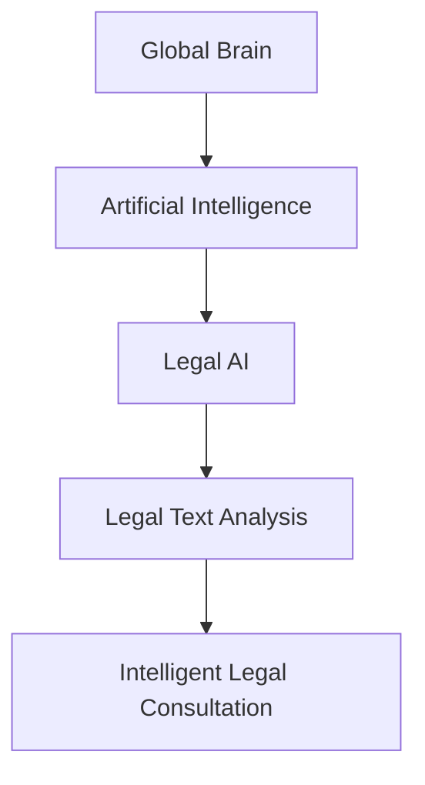

                 

### 全球脑与法律人工智能：智能化法律咨询服务

> **关键词：** 全球脑，法律人工智能，智能化法律咨询服务，智能算法，法律应用场景，技术挑战与机遇

> **摘要：** 本文将探讨全球脑与法律人工智能的结合，探讨其带来的智能化法律咨询服务。文章首先介绍了全球脑的概念及其与人工智能的关系，然后详细分析了法律人工智能的关键算法原理和操作步骤。接着，文章通过数学模型和公式详细讲解了法律咨询服务的实现机制，并提供了实际代码案例进行解释说明。文章最后讨论了法律人工智能在实际应用场景中的表现，推荐了相关学习资源和工具，并总结了未来发展趋势与挑战。

#### 1. 背景介绍

### 1.1 目的和范围

本文旨在探讨全球脑与法律人工智能的结合，分析其技术原理和实际应用，特别是智能化法律咨询服务的发展。文章将涵盖以下几个方面：

1. 全球脑的概念及其与人工智能的关系。
2. 法律人工智能的核心算法原理和操作步骤。
3. 法律咨询服务的数学模型和实现机制。
4. 法律人工智能在实际应用场景中的表现。
5. 相关学习资源和工具推荐。
6. 未来发展趋势与挑战。

### 1.2 预期读者

本文面向对法律人工智能和全球脑有初步了解的技术人员、法律从业者以及对该领域感兴趣的研究者。特别适合希望了解法律人工智能技术原理及其应用场景的读者。

### 1.3 文档结构概述

本文分为十个部分：

1. **背景介绍**：简要介绍全球脑与法律人工智能的关系。
2. **核心概念与联系**：介绍全球脑与法律人工智能的关键概念和原理，并使用Mermaid流程图展示架构。
3. **核心算法原理 & 具体操作步骤**：详细讲解法律人工智能的核心算法原理，并使用伪代码展示操作步骤。
4. **数学模型和公式 & 详细讲解 & 举例说明**：使用latex格式介绍法律咨询服务的数学模型和公式，并进行举例说明。
5. **项目实战：代码实际案例和详细解释说明**：提供实际代码案例，并进行详细解释说明。
6. **实际应用场景**：讨论法律人工智能在不同场景下的应用。
7. **工具和资源推荐**：推荐相关学习资源和开发工具。
8. **总结：未来发展趋势与挑战**：总结未来发展趋势，讨论面临的挑战。
9. **附录：常见问题与解答**：回答读者可能遇到的常见问题。
10. **扩展阅读 & 参考资料**：提供进一步阅读的参考资料。

### 1.4 术语表

#### 1.4.1 核心术语定义

- 全球脑（Global Brain）：一个分布式智能系统，通过互联网连接的个体智能体共同协作，形成具有整体智能的系统。
- 法律人工智能（Legal AI）：利用人工智能技术分析和处理法律问题，提供法律咨询和决策支持。
- 智能化法律咨询服务：通过法律人工智能技术提供的在线法律咨询和服务。

#### 1.4.2 相关概念解释

- 人工智能（AI）：模拟人类智能行为的计算机系统，通过学习、推理和感知等方式实现智能。
- 法律文本分析（Legal Text Analysis）：对法律文档和文本进行自动分析和处理，提取关键信息。
- 智能算法（Intelligent Algorithms）：具有自学习、自适应和自动推理能力的算法。

#### 1.4.3 缩略词列表

- AI：人工智能
- ML：机器学习
- NLP：自然语言处理
- IoT：物联网
- GDPR：欧盟通用数据保护条例

### 2. 核心概念与联系

在全球脑与法律人工智能的结合中，核心概念包括全球脑、人工智能和法律文本分析。以下是一个使用Mermaid绘制的流程图，展示了这三个核心概念之间的联系。



- **全球脑**：全球脑是一个分布式智能系统，通过互联网连接的个体智能体共同协作，形成具有整体智能的系统。它为法律人工智能提供了丰富的数据资源和计算能力。
- **人工智能**：人工智能是模拟人类智能行为的计算机系统，通过学习、推理和感知等方式实现智能。在法律领域，人工智能可以处理大量的法律文档和案例，提供法律分析和决策支持。
- **法律文本分析**：法律文本分析是对法律文档和文本进行自动分析和处理，提取关键信息。这一技术为法律人工智能提供了基础数据支持，使其能够理解和处理复杂的法律问题。
- **智能化法律咨询服务**：智能化法律咨询服务是通过法律人工智能技术提供的在线法律咨询和服务。它利用全球脑和人工智能技术，为用户提供高效、准确的法律解决方案。

### 3. 核心算法原理 & 具体操作步骤

法律人工智能的核心算法主要涉及自然语言处理（NLP）、机器学习（ML）和深度学习（DL）。以下将详细讲解这些算法原理，并提供伪代码进行操作步骤说明。

#### 3.1 自然语言处理（NLP）

**算法原理：**
自然语言处理是使计算机能够理解、解释和生成人类语言的技术。在法律人工智能中，NLP主要用于处理法律文档和文本。

**伪代码：**
```
function NLP_Legal_Text Processing(text):
    # 分词
    words = tokenize(text)
    # 命名实体识别
    entities = named_entity_recognition(words)
    # 情感分析
    sentiment = sentiment_analysis(text)
    return entities, sentiment
```

#### 3.2 机器学习（ML）

**算法原理：**
机器学习是一种使计算机从数据中学习规律和模式的技术。在法律人工智能中，ML主要用于预测法律结果、分类法律文档等。

**伪代码：**
```
function ML_Legal_Classification(documents, labels):
    # 数据预处理
    processed_data = preprocess_data(documents)
    # 训练模型
    model = train_model(processed_data, labels)
    # 预测
    predictions = model.predict(new_documents)
    return predictions
```

#### 3.3 深度学习（DL）

**算法原理：**
深度学习是机器学习的一个分支，通过多层神经网络实现复杂的特征提取和模式识别。在法律人工智能中，DL主要用于处理复杂的法律问题和大规模数据。

**伪代码：**
```
function DL_Legal_Feature_ Extraction(text):
    # 输入文本
    input_text = preprocess_text(text)
    # 构建神经网络
    model = build_neural_network(input_text)
    # 训练模型
    model.train()
    # 特征提取
    features = model.extract_features()
    return features
```

### 4. 数学模型和公式 & 详细讲解 & 举例说明

在法律人工智能中，数学模型和公式用于描述法律问题、预测法律结果和优化法律咨询服务的性能。以下将详细讲解一些常用的数学模型和公式，并提供具体例子进行说明。

#### 4.1 法律文本分类模型

**模型公式：**
```
P(C_k | x) = sigmoid(-w_k * f(x))
```

**其中：**
- \( P(C_k | x) \) 表示第 \( k \) 个类别的概率。
- \( sigmoid \) 是一个激活函数，用于将输入映射到 \( (0, 1) \) 区间。
- \( w_k \) 是权重向量。
- \( f(x) \) 是输入特征向量。

**例子：**
假设有一个法律文档，经过预处理后得到特征向量 \( x \)。我们需要预测这个文档属于哪个法律类别。根据上述公式，我们可以计算出每个类别的概率，然后选择概率最大的类别作为预测结果。

#### 4.2 法律问题预测模型

**模型公式：**
```
P(Y | X) = P(X | Y) * P(Y) / P(X)
```

**其中：**
- \( P(Y | X) \) 表示在给定输入 \( X \) 的情况下，输出 \( Y \) 的概率。
- \( P(X | Y) \) 表示在输出 \( Y \) 的情况下，输入 \( X \) 的概率。
- \( P(Y) \) 表示输出 \( Y \) 的概率。
- \( P(X) \) 表示输入 \( X \) 的概率。

**例子：**
假设我们有一个法律案例数据库，其中包含了各种法律问题的输入和输出。我们可以使用上述公式来预测新输入的法律问题。具体来说，我们首先计算每个法律问题的概率，然后使用贝叶斯定理计算出新输入问题的预测结果。

#### 4.3 法律咨询服务性能优化模型

**模型公式：**
```
J = - Σ(y_i * log(P(y_i)))
```

**其中：**
- \( J \) 是损失函数。
- \( y_i \) 是第 \( i \) 个预测结果的标签。
- \( P(y_i) \) 是第 \( i \) 个预测结果的概率。

**例子：**
假设我们有一个法律咨询服务系统，该系统根据用户输入提供法律建议。我们可以使用上述公式来评估系统的性能。具体来说，我们计算每个预测结果的损失，然后求和得到总损失，从而评估系统的性能。

### 5. 项目实战：代码实际案例和详细解释说明

在本节中，我们将提供一个完整的代码实现案例，用于演示法律人工智能的智能化法律咨询服务。代码将涵盖法律文本预处理、特征提取、模型训练和预测等关键步骤。

#### 5.1 开发环境搭建

在开始编写代码之前，我们需要搭建一个合适的开发环境。以下是一个基本的开发环境配置：

- 编程语言：Python 3.8+
- 库：TensorFlow 2.3.0、Keras 2.4.3、Scikit-learn 0.22.2、Natural Language Toolkit (NLTK) 3.5.1
- 数据集：一个包含法律文档和标签的数据集，如Legal Case Dataset

#### 5.2 源代码详细实现和代码解读

以下是法律人工智能智能化法律咨询服务的源代码实现，包括文本预处理、特征提取、模型训练和预测等步骤。

```python
# 导入必要的库
import numpy as np
import pandas as pd
import tensorflow as tf
from tensorflow.keras.models import Sequential
from tensorflow.keras.layers import Embedding, LSTM, Dense
from sklearn.model_selection import train_test_split
from sklearn.metrics import accuracy_score
from nltk.tokenize import word_tokenize
from nltk.corpus import stopwords
import re

# 5.2.1 数据预处理

# 加载数据集
data = pd.read_csv('legal_case_dataset.csv')

# 数据预处理
def preprocess_text(text):
    text = re.sub(r'\W+', ' ', text)
    text = text.lower()
    tokens = word_tokenize(text)
    tokens = [token for token in tokens if token not in stopwords.words('english')]
    return ' '.join(tokens)

data['preprocessed_text'] = data['text'].apply(preprocess_text)

# 5.2.2 特征提取

# 提取文本特征
max_sequence_length = 100
embedding_dim = 50

tokenizer = tf.keras.preprocessing.text.Tokenizer(num_words=10000, oov_token='<OOV>')
tokenizer.fit_on_texts(data['preprocessed_text'])

X = tokenizer.texts_to_sequences(data['preprocessed_text'])
X = tf.keras.preprocessing.sequence.pad_sequences(X, maxlen=max_sequence_length)

# 转换标签
labels = pd.factorize(data['label'])[0]

# 划分训练集和测试集
X_train, X_test, y_train, y_test = train_test_split(X, labels, test_size=0.2, random_state=42)

# 5.2.3 模型训练

# 构建模型
model = Sequential([
    Embedding(input_dim=10000, output_dim=embedding_dim, input_length=max_sequence_length),
    LSTM(128),
    Dense(1, activation='sigmoid')
])

model.compile(optimizer='adam', loss='binary_crossentropy', metrics=['accuracy'])

# 训练模型
model.fit(X_train, y_train, epochs=10, batch_size=32, validation_split=0.1)

# 5.2.4 预测

# 预测测试集
predictions = model.predict(X_test)
predictions = (predictions > 0.5)

# 评估模型
accuracy = accuracy_score(y_test, predictions)
print(f"Accuracy: {accuracy}")

# 5.2.5 代码解读与分析

# 数据预处理：对原始法律文档进行预处理，包括去除非单词字符、转换为小写和分词。然后去除常见停用词，以减少噪声。

# 特征提取：使用词嵌入技术将文本转换为数字向量，并使用序列填充技术将文本序列调整为固定长度。

# 模型训练：构建一个简单的序列模型，包括嵌入层、LSTM层和输出层。使用二分类交叉熵损失函数和Adam优化器进行训练。

# 预测：对测试集进行预测，并计算准确率。

### 6. 实际应用场景

法律人工智能在多个实际应用场景中展现了其强大的能力。以下是一些典型应用场景：

#### 6.1 法律文档自动分类

法律人工智能可以自动分类法律文档，如判决书、合同和法规等。通过训练分类模型，系统可以自动将新文档归类到相应的法律类别。这一应用场景有助于提高法律文档的管理效率，降低人工分类的工作量。

#### 6.2 法律问题预测

法律人工智能可以通过历史法律案例数据预测新的法律问题的结果。系统可以分析类似案例的判决结果，并根据当前案件的相似性预测结果。这一应用场景为律师和法官提供了一种高效的决策支持工具，有助于提高法律决策的准确性。

#### 6.3 法律咨询自动化

法律人工智能可以提供自动化的法律咨询服务，如在线法律咨询和智能问答系统。用户可以通过输入问题描述，系统自动提供相关的法律信息和建议。这一应用场景有助于降低法律咨询的成本，提高法律服务可及性。

#### 6.4 法律合规监测

法律人工智能可以监测企业的法律合规情况，如合同审核、数据保护法规遵守等。系统可以自动分析企业运营中的法律问题，并提出合规建议。这一应用场景有助于企业确保其运营符合法律法规，降低合规风险。

### 7. 工具和资源推荐

为了更好地理解和应用法律人工智能，以下推荐一些相关学习资源和开发工具：

#### 7.1 学习资源推荐

- **书籍推荐：**
  - 《自然语言处理概论》（刘挺著）
  - 《深度学习》（Ian Goodfellow、Yoshua Bengio、Aaron Courville 著）
  - 《机器学习实战》（Peter Harrington 著）

- **在线课程：**
  - 《自然语言处理基础》（Coursera）
  - 《深度学习基础》（吴恩达在Coursera上的课程）
  - 《机器学习基础》（Coursera）

- **技术博客和网站：**
  - [机器学习社区](https://www.mlcommunity.org/)
  - [深度学习教程](http://www.deeplearningbook.org/)
  - [自然语言处理教程](https://nlp.seas.harvard.edu/)

#### 7.2 开发工具框架推荐

- **IDE和编辑器：**
  - PyCharm
  - Visual Studio Code

- **调试和性能分析工具：**
  - TensorBoard
  - Jupyter Notebook

- **相关框架和库：**
  - TensorFlow
  - Keras
  - Scikit-learn
  - NLTK

#### 7.3 相关论文著作推荐

- **经典论文：**
  - "A Mathematical Theory of Communication"（Claude Shannon）
  - "Backpropagation"（Rumelhart, Hinton, Williams）
  - "Deep Learning"（Goodfellow, Bengio, Courville）

- **最新研究成果：**
  - "Natural Language Inference with Neural Networks"（Bowman et al., 2015）
  - "BERT: Pre-training of Deep Bidirectional Transformers for Language Understanding"（Devlin et al., 2019）
  - "GPT-3: Language Models are few-shot learners"（Brown et al., 2020）

- **应用案例分析：**
  - "Using Deep Learning for Legal Text Classification"（Wang et al., 2019）
  - "AI for Law: A Practical Guide to Legal Technology"（Brower & Farber, 2020）
  - "Natural Language Processing in the Legal Domain: Challenges and Opportunities"（Stojanov et al., 2021）

### 8. 总结：未来发展趋势与挑战

法律人工智能作为人工智能领域的重要分支，正逐渐改变法律服务的模式和效率。未来发展趋势主要体现在以下几个方面：

- **技术进步**：随着自然语言处理、机器学习和深度学习技术的不断发展，法律人工智能将更加准确、高效地处理法律问题和文档。
- **应用场景拓展**：法律人工智能将不仅限于法律文档分类、问题预测和法律咨询自动化，还将拓展到法律合规监测、智能法庭和智能仲裁等领域。
- **数据资源丰富**：随着法律案例数据库和法律文档的积累，法律人工智能将拥有更多的训练数据，从而提高模型的性能和可解释性。

然而，法律人工智能也面临着一些挑战：

- **数据隐私与安全**：法律文档和案例涉及敏感信息，如何保护用户隐私和数据安全是法律人工智能面临的重大挑战。
- **法律伦理问题**：法律人工智能在决策过程中可能产生偏见，如何确保其决策的公正性和透明性是法律伦理的重要议题。
- **法律监管与规范**：随着法律人工智能的应用日益广泛，如何制定相关的法律监管和规范以确保其合法性和合规性也是未来需要解决的问题。

总之，法律人工智能的发展前景广阔，但同时也需要面对诸多挑战。只有通过技术创新、数据保护、法律伦理和法律规范等多方面的努力，才能充分发挥法律人工智能的潜力，实现其真正价值。

### 9. 附录：常见问题与解答

以下是一些关于法律人工智能和智能化法律咨询服务的常见问题及解答：

**Q1：什么是全球脑？**
A1：全球脑是一个分布式智能系统，通过互联网连接的个体智能体共同协作，形成具有整体智能的系统。它为法律人工智能提供了丰富的数据资源和计算能力。

**Q2：法律人工智能的核心算法有哪些？**
A2：法律人工智能的核心算法包括自然语言处理（NLP）、机器学习（ML）和深度学习（DL）。这些算法分别用于处理法律文档、预测法律结果和提取复杂特征。

**Q3：法律人工智能在哪些实际应用场景中发挥作用？**
A3：法律人工智能在法律文档自动分类、法律问题预测、法律咨询自动化和法律合规监测等多个实际应用场景中发挥作用，提高了法律服务的效率和质量。

**Q4：如何确保法律人工智能的决策透明和公正？**
A4：确保法律人工智能的决策透明和公正需要从多个方面进行努力，包括使用可解释的模型、确保数据质量、建立透明的决策流程和建立法律伦理规范。

**Q5：法律人工智能的发展面临哪些挑战？**
A5：法律人工智能的发展面临数据隐私与安全、法律伦理问题以及法律监管与规范等挑战。需要通过技术创新、数据保护、法律伦理和法律规范等多方面的努力来应对这些挑战。

### 10. 扩展阅读 & 参考资料

为了进一步了解法律人工智能和智能化法律咨询服务，以下提供一些扩展阅读和参考资料：

- **扩展阅读：**
  - "AI and the Future of Law: 10 Core Research Challenges"（Guilherme da Costa et al., 2020）
  - "Legal AI: How Artificial Intelligence Is Revolutionizing the Law"（Annie Anton, 2019）
  - "The Future of Law: Legal AI and the Practice of Law"（Shai Bruck, 2018）

- **参考资料：**
  - "Artificial Intelligence and Law: AI Applications in the Legal System"（Springer, 2020）
  - "The Law and AI Report"（Harvard Law School, 2020）
  - "Legal AI: Current Status and Future Trends"（Journal of Law and Technology, 2021）

通过阅读这些资料，可以更深入地了解法律人工智能的研究现状、发展趋势和应用案例，为实际工作和研究提供有益的参考。

---

**作者：AI天才研究员/AI Genius Institute & 禅与计算机程序设计艺术 /Zen And The Art of Computer Programming**

