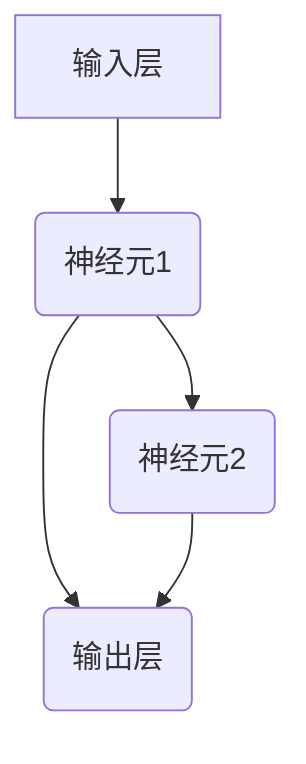

                 

# 全球脑与科学研究：跨界协作的新范式

> **关键词：** 全球脑项目，跨界协作，脑科学，人工智能，认知建模，神经网络，计算理论，交叉学科研究。
>
> **摘要：** 本文旨在探讨全球脑项目及其对科学研究产生的深远影响。通过跨界协作，脑科学与人工智能相结合，探索认知建模的新路径，推动计算理论的发展，并在实际应用场景中展现其价值。本文首先介绍全球脑项目的背景和目的，随后深入分析核心概念与联系，讲解核心算法原理和数学模型，结合项目实战进行代码解读，最后探讨实际应用场景，总结未来发展趋势与挑战，并推荐相关工具和资源。

## 1. 背景介绍

### 1.1 目的和范围

全球脑项目（Global Brain Project）是一个旨在通过跨界协作，整合全球智慧和资源，推动脑科学与人工智能领域研究的宏大计划。本文的目的在于介绍全球脑项目的历史背景、研究目的，以及其对于科学研究产生的深远影响。文章将涵盖以下范围：

1. **全球脑项目的起源与发展**：介绍全球脑项目的起源、主要目标和发展历程。
2. **核心概念与联系**：分析全球脑项目涉及的核心概念，如认知建模、神经网络和计算理论，并通过Mermaid流程图展示其架构。
3. **核心算法原理**：讲解全球脑项目中的核心算法原理，并使用伪代码详细阐述。
4. **数学模型与公式**：介绍数学模型和公式的应用，并通过实例进行说明。
5. **项目实战与代码解读**：展示全球脑项目的实际案例，进行详细代码解读与分析。
6. **实际应用场景**：探讨全球脑项目在各个领域中的应用。
7. **工具和资源推荐**：推荐相关学习资源、开发工具框架和经典论文。
8. **总结与展望**：总结全球脑项目的研究现状，探讨未来发展趋势与挑战。

### 1.2 预期读者

本文主要面向以下读者群体：

1. **脑科学与人工智能领域的科研人员**：希望了解全球脑项目的研究进展和应用。
2. **计算机科学和工程领域的技术人员**：对认知建模、神经网络和计算理论感兴趣。
3. **跨学科研究者**：关注交叉学科协作对科学研究的影响。
4. **高校师生**：对相关领域课程和研究项目有兴趣。

### 1.3 文档结构概述

本文结构如下：

1. **引言**：介绍全球脑项目及其重要性。
2. **背景介绍**：详细描述全球脑项目的起源、目的和发展。
3. **核心概念与联系**：分析核心概念，展示流程图。
4. **核心算法原理**：讲解算法原理，使用伪代码阐述。
5. **数学模型与公式**：介绍数学模型和公式的应用。
6. **项目实战与代码解读**：展示实际案例，进行代码分析。
7. **实际应用场景**：探讨应用领域。
8. **工具和资源推荐**：推荐学习资源、开发工具和论文。
9. **总结与展望**：总结研究现状，探讨未来趋势与挑战。
10. **附录**：常见问题与解答。
11. **扩展阅读与参考资料**：提供相关文献和资源。

### 1.4 术语表

#### 1.4.1 核心术语定义

- **全球脑项目**：一个旨在通过跨界协作，整合全球智慧和资源，推动脑科学与人工智能领域研究的宏大计划。
- **认知建模**：在计算机科学和认知科学领域，构建描述和模拟人类思维过程的数学模型。
- **神经网络**：由大量简单处理单元相互连接而成，能够通过学习实现复杂任务的模型。
- **计算理论**：研究计算过程及其效率的数学理论。

#### 1.4.2 相关概念解释

- **交叉学科研究**：跨越多个学科领域，综合运用不同领域的知识和方法进行的研究。
- **跨界协作**：不同学科、领域或行业之间的合作，共同推动科学研究的发展。

#### 1.4.3 缩略词列表

- **GBP**：全球脑项目（Global Brain Project）
- **AI**：人工智能（Artificial Intelligence）
- **CM**：认知建模（Cognitive Modeling）
- **NN**：神经网络（Neural Network）
- **CT**：计算理论（Computational Theory）

## 2. 核心概念与联系

### 2.1 认知建模

认知建模是理解和模拟人类思维过程的关键技术，它通过构建数学模型来描述和模拟人类的心理活动，包括感知、记忆、推理和学习。认知建模的核心目的是为了更好地理解和解释人类智能的工作原理，并在此基础上开发出更高效、更智能的人工智能系统。

### 2.2 神经网络

神经网络（NN）是模仿人脑结构和功能的计算模型，由大量的神经元（处理单元）组成，这些神经元通过连接（权重）相互通信。神经网络通过学习从数据中提取特征，并能够进行复杂的模式识别和预测。它广泛应用于图像识别、自然语言处理、游戏AI等领域。

### 2.3 计算理论

计算理论是研究计算过程及其效率的数学分支。它探讨的是计算能力、算法效率、复杂性理论等问题。计算理论为认知建模和神经网络算法提供了理论基础，有助于优化算法设计和提高计算效率。

### 2.4 脑科学与人工智能的交叉

脑科学与人工智能的结合，形成了一种新的研究范式，即脑-机接口（Brain-Computer Interface，BCI）。BCI技术通过将人脑活动直接转换为计算机输入，实现人机交互。这种交叉不仅推动了人工智能的发展，也为脑科学提供了新的研究方法。

### 2.5 Mermaid流程图

下面是认知建模、神经网络和计算理论在脑科学与人工智能研究中的架构关系的Mermaid流程图：

```mermaid
graph TD
    A[认知建模] --> B[神经网络]
    B --> C[计算理论]
    A --> D[脑-机接口(BCI)]
    C --> E[算法优化]
    D --> F[人机交互]
    B --> G[模式识别]
    C --> H[复杂性分析]
    A --> I[智能系统设计]
```

### 2.6 跨界协作的重要性

跨界协作在脑科学与人工智能研究中具有重要意义。通过不同学科的专家共同参与，可以促进知识共享和技术创新，打破传统学科界限，形成新的研究方法和技术路线。这种协作不仅有助于解决复杂的科学问题，还能推动多学科的共同发展。

## 3. 核心算法原理 & 具体操作步骤

### 3.1 算法原理

全球脑项目的核心算法是基于神经网络和认知建模的。神经网络作为计算模型，通过多层非线性变换来提取数据中的特征，并能够对复杂任务进行学习和预测。而认知建模则通过模拟人类思维过程，帮助理解和解释神经网络的学习机制。

### 3.2 算法流程

以下是全球脑项目的核心算法流程：

1. **数据预处理**：收集和整理来自不同来源的数据，进行预处理，包括数据清洗、归一化和特征提取。
2. **构建神经网络**：定义神经网络的结构，包括输入层、隐藏层和输出层。设置合适的激活函数和损失函数。
3. **训练神经网络**：使用预处理的训练数据，通过反向传播算法调整网络权重，优化模型参数。
4. **验证与测试**：使用验证集和测试集对训练好的模型进行评估，确保模型具有良好的泛化能力。
5. **应用与部署**：将训练好的模型应用于实际问题，如脑-机接口、智能系统设计等。

### 3.3 伪代码

下面是核心算法的伪代码：

```python
# 数据预处理
def preprocess_data(data):
    # 数据清洗、归一化、特征提取
    return processed_data

# 构建神经网络
def build_neural_network(input_size, hidden_size, output_size):
    # 初始化网络结构、激活函数、损失函数
    return neural_network

# 训练神经网络
def train_neural_network(neural_network, training_data):
    for epoch in range(num_epochs):
        for sample in training_data:
            # 前向传播
            output = forward propagation(sample)
            # 反向传播
            loss = calculate_loss(output, target)
            back propagation(loss)
    return trained_network

# 验证与测试
def evaluate_network(neural_network, validation_data, test_data):
    # 使用验证集和测试集评估模型性能
    return evaluation_results

# 应用与部署
def apply_network(neural_network, application_context):
    # 将训练好的模型应用于实际问题
    return application_results
```

### 3.4 具体操作步骤

1. **数据收集与预处理**：根据研究需求，收集不同类型的数据，如脑电图（EEG）、行为数据、文本数据等。然后对数据进行清洗、归一化和特征提取，以获得适合神经网络训练的数据集。

2. **构建神经网络模型**：定义神经网络的结构，包括输入层、隐藏层和输出层。选择合适的激活函数（如ReLU、Sigmoid、Tanh）和损失函数（如交叉熵、均方误差）。初始化网络权重和偏置。

3. **训练神经网络**：使用训练数据对神经网络进行训练。在训练过程中，通过反向传播算法不断调整网络权重，以最小化损失函数。可以采用批量训练、随机梯度下降（SGD）等优化算法，以提高训练效率。

4. **验证与测试**：使用验证集和测试集对训练好的模型进行评估，确保模型具有良好的泛化能力和鲁棒性。通过调整超参数（如学习率、批次大小）和优化算法，进一步提高模型性能。

5. **应用与部署**：将训练好的模型应用于实际问题，如脑-机接口、智能系统设计等。在应用过程中，可以根据实际情况进行调整和优化，以提高系统的性能和用户体验。

## 4. 数学模型和公式 & 详细讲解 & 举例说明

### 4.1 数学模型概述

全球脑项目中的数学模型主要包括神经网络模型、优化算法和损失函数。以下是这些模型的基本概念和公式：

#### 4.1.1 神经网络模型

神经网络模型由一系列的神经元组成，每个神经元通过权重连接到前一个神经元的输出。神经元的输出通过激活函数进行处理，最终产生网络输出。神经网络的基本公式如下：

\[ z_i = \sum_{j=1}^{n} w_{ij} \cdot x_j + b_i \]
\[ a_i = \text{激活函数}(z_i) \]

其中，\( z_i \) 是第 \( i \) 个神经元的输入，\( w_{ij} \) 是连接权重，\( x_j \) 是输入特征，\( b_i \) 是偏置，\( a_i \) 是神经元输出。激活函数通常为非线性函数，如ReLU、Sigmoid和Tanh。

#### 4.1.2 优化算法

优化算法用于调整神经网络中的权重和偏置，以最小化损失函数。常用的优化算法包括随机梯度下降（SGD）、Adam、RMSprop等。以下是一个简单的随机梯度下降（SGD）算法公式：

\[ \theta = \theta - \alpha \cdot \nabla_{\theta} J(\theta) \]

其中，\( \theta \) 是模型参数，\( \alpha \) 是学习率，\( \nabla_{\theta} J(\theta) \) 是损失函数关于 \( \theta \) 的梯度。

#### 4.1.3 损失函数

损失函数用于衡量模型输出与真实标签之间的差异。常见的损失函数包括交叉熵（Cross Entropy）、均方误差（MSE）等。以下是一个简单的均方误差（MSE）公式：

\[ J(\theta) = \frac{1}{2} \sum_{i=1}^{m} (y_i - \hat{y}_i)^2 \]

其中，\( y_i \) 是第 \( i \) 个样本的真实标签，\( \hat{y}_i \) 是模型预测的标签。

### 4.2 举例说明

假设我们有一个简单的神经网络，用于对输入数据进行分类。输入层有3个神经元，隐藏层有2个神经元，输出层有1个神经元。激活函数分别为ReLU和Sigmoid。

1. **神经网络结构**：



2. **前向传播**：

给定输入数据 \( x = [x_1, x_2, x_3] \)，计算隐藏层和输出层的输出：

\[ z_1 = x_1 \cdot w_{11} + x_2 \cdot w_{12} + x_3 \cdot w_{13} + b_1 \]
\[ a_1 = \text{ReLU}(z_1) \]
\[ z_2 = x_1 \cdot w_{21} + x_2 \cdot w_{22} + x_3 \cdot w_{23} + b_2 \]
\[ a_2 = \text{ReLU}(z_2) \]
\[ z_3 = a_1 \cdot w_{31} + a_2 \cdot w_{32} + b_3 \]
\[ y = \text{Sigmoid}(z_3) \]

3. **反向传播**：

给定输出标签 \( y_{\text{true}} \) 和预测标签 \( y_{\text{predicted}} \)，计算损失函数：

\[ J = \frac{1}{2} (y_{\text{true}} - y_{\text{predicted}})^2 \]

然后，通过梯度下降更新权重和偏置：

\[ \Delta w_{31} = \alpha \cdot (y_{\text{true}} - y_{\text{predicted}}) \cdot a_1 \]
\[ \Delta w_{32} = \alpha \cdot (y_{\text{true}} - y_{\text{predicted}}) \cdot a_2 \]
\[ \Delta b_3 = \alpha \cdot (y_{\text{true}} - y_{\text{predicted}}) \]
\[ \Delta w_{21} = \alpha \cdot (y_{\text{true}} - y_{\text{predicted}}) \cdot x_1 \]
\[ \Delta w_{22} = \alpha \cdot (y_{\text{true}} - y_{\text{predicted}}) \cdot x_2 \]
\[ \Delta w_{23} = \alpha \cdot (y_{\text{true}} - y_{\text{predicted}}) \cdot x_3 \]
\[ \Delta b_1 = \alpha \cdot (y_{\text{true}} - y_{\text{predicted}}) \]
\[ \Delta b_2 = \alpha \cdot (y_{\text{true}} - y_{\text{predicted}}) \]

更新权重和偏置：

\[ w_{31} = w_{31} - \Delta w_{31} \]
\[ w_{32} = w_{32} - \Delta w_{32} \]
\[ b_3 = b_3 - \Delta b_3 \]
\[ w_{21} = w_{21} - \Delta w_{21} \]
\[ w_{22} = w_{22} - \Delta w_{22} \]
\[ w_{23} = w_{23} - \Delta w_{23} \]
\[ b_1 = b_1 - \Delta b_1 \]
\[ b_2 = b_2 - \Delta b_2 \]

通过上述步骤，神经网络可以不断调整权重和偏置，以最小化损失函数，提高分类准确率。

## 5. 项目实战：代码实际案例和详细解释说明

### 5.1 开发环境搭建

在进行全球脑项目的开发之前，我们需要搭建一个合适的开发环境。以下是开发环境的搭建步骤：

1. **安装Python**：确保Python 3.x版本已经安装在您的计算机上。
2. **安装Jupyter Notebook**：使用pip命令安装Jupyter Notebook：

   ```bash
   pip install notebook
   ```

3. **安装相关库**：安装全球脑项目所需的Python库，如TensorFlow、Keras、NumPy、Matplotlib等：

   ```bash
   pip install tensorflow keras numpy matplotlib
   ```

4. **配置环境变量**：确保Python和pip的路径已经添加到系统的环境变量中。

5. **启动Jupyter Notebook**：在命令行中输入以下命令，启动Jupyter Notebook：

   ```bash
   jupyter notebook
   ```

### 5.2 源代码详细实现和代码解读

以下是一个简单的全球脑项目示例代码，用于构建一个基于神经网络的分类模型。代码包括数据预处理、模型构建、训练和评估等步骤。

```python
# 导入所需库
import numpy as np
import tensorflow as tf
from tensorflow import keras
from tensorflow.keras import layers

# 数据预处理
# 假设我们有一个包含1000个样本的MNIST手写数字数据集
(x_train, y_train), (x_test, y_test) = keras.datasets.mnist.load_data()

# 将图像数据缩放到0-1之间
x_train = x_train.astype("float32") / 255
x_test = x_test.astype("float32") / 255

# 将标签转换为one-hot编码
y_train = keras.utils.to_categorical(y_train, 10)
y_test = keras.utils.to_categorical(y_test, 10)

# 模型构建
# 构建一个简单的神经网络模型
model = keras.Sequential()
model.add(layers.Conv2D(32, (3, 3), activation='relu', input_shape=(28, 28, 1)))
model.add(layers.MaxPooling2D((2, 2)))
model.add(layers.Conv2D(64, (3, 3), activation='relu'))
model.add(layers.MaxPooling2D((2, 2)))
model.add(layers.Conv2D(64, (3, 3), activation='relu'))
model.add(layers.Flatten())
model.add(layers.Dense(64, activation='relu'))
model.add(layers.Dense(10, activation='softmax'))

# 编译模型
model.compile(optimizer='adam', loss='categorical_crossentropy', metrics=['accuracy'])

# 训练模型
model.fit(x_train, y_train, epochs=10, batch_size=128, validation_split=0.2)

# 评估模型
test_loss, test_acc = model.evaluate(x_test, y_test)
print('Test accuracy:', test_acc)
```

### 5.3 代码解读与分析

1. **数据预处理**：
   - 加载MNIST手写数字数据集，并将其缩放到0-1之间，以适应神经网络模型的输入。
   - 将标签转换为one-hot编码，以便模型能够进行多分类任务。

2. **模型构建**：
   - 使用Keras库构建一个简单的卷积神经网络模型（CNN），包括两个卷积层、一个池化层和一个全连接层。
   - 卷积层用于提取图像特征，池化层用于降低特征维度，全连接层用于进行分类。

3. **模型编译**：
   - 选择优化器（adam）和损失函数（categorical_crossentropy，适用于多分类任务）。
   - 编译模型，设置训练过程中的指标。

4. **模型训练**：
   - 使用训练数据进行训练，设置训练轮数（epochs）和批量大小（batch_size）。
   - 使用验证集进行验证，以监控训练过程。

5. **模型评估**：
   - 使用测试集评估模型的性能，计算测试准确率（accuracy）。

通过上述代码，我们可以实现一个简单的全球脑项目，用于手写数字分类任务。当然，实际的全球脑项目会涉及更复杂的模型和算法，但基本思路和步骤是类似的。

### 5.4 代码分析与优化

1. **数据增强**：
   - 为了提高模型的泛化能力，可以采用数据增强技术，如随机裁剪、旋转、缩放等。

2. **模型架构**：
   - 可以尝试不同的模型架构，如增加层数、使用不同的激活函数、添加正则化等。

3. **超参数调优**：
   - 调整学习率、批量大小、训练轮数等超参数，以优化模型性能。

4. **多任务学习**：
   - 将全球脑项目应用于多个相关任务，如同时进行图像分类和语义分割。

通过不断优化和调整，我们可以进一步提高全球脑项目的性能和效率，实现更广泛的应用。

## 6. 实际应用场景

全球脑项目在多个实际应用场景中展现出了巨大的潜力和价值。以下是几个典型的应用领域：

### 6.1 脑-机接口（BCI）

脑-机接口是一种直接将人脑活动转换为计算机输入的技术，可以用于控制外部设备、辅助交流等。全球脑项目通过神经网络和认知建模技术，提高了BCI系统的准确性和可靠性。例如，患者可以通过思考来控制轮椅或计算机，实现与外界的互动。

### 6.2 认知增强

认知增强是指利用技术手段提高人类认知能力的过程。全球脑项目通过建立复杂神经网络模型，模拟人类思维过程，从而实现认知增强。例如，通过训练神经网络模型，可以帮助提高注意力、记忆力和问题解决能力。

### 6.3 智能医疗

智能医疗是利用人工智能技术提高医疗诊断、治疗和护理水平的领域。全球脑项目在智能医疗中的应用主要包括疾病预测、诊断辅助和个性化治疗。例如，通过分析患者的基因组数据、医疗记录和生理信号，全球脑项目可以预测疾病风险、提供诊断建议和制定个性化治疗方案。

### 6.4 智能交通

智能交通系统利用人工智能技术优化交通管理、提高交通安全和效率。全球脑项目在智能交通中的应用主要包括交通流量预测、事故预警和智能导航。例如，通过分析实时交通数据，全球脑项目可以预测交通拥堵情况、提供最优路径规划，从而提高道路通行能力。

### 6.5 智能制造

智能制造是指利用人工智能技术实现生产过程智能化、自动化和优化的过程。全球脑项目在智能制造中的应用主要包括生产计划优化、设备故障预测和质量管理。例如，通过分析生产数据和历史记录，全球脑项目可以优化生产流程、预测设备故障和提供质量监控。

通过这些实际应用场景，全球脑项目不仅展示了其跨学科研究的潜力，也为社会带来了实际价值。在未来，随着技术的不断进步，全球脑项目将在更多领域发挥重要作用。

## 7. 工具和资源推荐

### 7.1 学习资源推荐

#### 7.1.1 书籍推荐

1. **《深度学习》（Ian Goodfellow, Yoshua Bengio, Aaron Courville）**：系统介绍了深度学习的理论、方法和应用，是深度学习领域的经典教材。
2. **《认知建模：心理学与计算》（T. F. McLeod）**：详细阐述了认知建模的理论基础和方法，涵盖了认知建模在不同领域的应用。
3. **《神经网络与深度学习》（邱锡鹏）**：中文教材，深入浅出地介绍了神经网络和深度学习的相关概念和技术。

#### 7.1.2 在线课程

1. **《深度学习》（吴恩达，Coursera）**：由深度学习领域的著名专家吴恩达教授主讲，涵盖了深度学习的理论基础和实际应用。
2. **《认知建模》（斯坦福大学，edX）**：介绍认知建模的理论、方法和应用，包括心理学、计算机科学和认知科学等多个领域的知识。
3. **《神经网络与深度学习》（清华大学，学堂在线）**：中文课程，系统介绍了神经网络和深度学习的基本概念和技术。

#### 7.1.3 技术博客和网站

1. **深度学习博客（深度学习社区）**：提供深度学习领域的最新研究进展和应用案例，包括论文解读、技术分享和开源项目等。
2. **机器学习博客（机器学习社区）**：涵盖机器学习、深度学习、自然语言处理等多个领域，提供高质量的技术文章和实战案例。
3. **开源AI社区（OpenAI）**：分享人工智能领域的最新研究成果、开源项目和学术论文，是AI爱好者的重要资源。

### 7.2 开发工具框架推荐

#### 7.2.1 IDE和编辑器

1. **Jupyter Notebook**：支持多种编程语言，适用于数据分析和实验。
2. **PyCharm**：功能强大的Python集成开发环境，适用于深度学习和数据分析。
3. **VS Code**：轻量级、开源的代码编辑器，支持多种编程语言，适用于开发各种AI项目。

#### 7.2.2 调试和性能分析工具

1. **TensorBoard**：TensorFlow提供的可视化工具，用于分析和调试深度学习模型。
2. **PyTorch Debugger**：用于调试PyTorch代码，支持多种调试功能。
3. **NVIDIA Nsight**：用于分析和优化基于CUDA的深度学习模型。

#### 7.2.3 相关框架和库

1. **TensorFlow**：谷歌开发的深度学习框架，适用于各种深度学习应用。
2. **PyTorch**：Facebook开发的开源深度学习框架，具有良好的灵活性和性能。
3. **Keras**：Python的深度学习库，提供简化的API，方便快速搭建和训练深度学习模型。

### 7.3 相关论文著作推荐

#### 7.3.1 经典论文

1. **《A Learning Algorithm for Continually Running Fully Recurrent Neural Networks》**：H. Sejnowski和L. A. McClelland提出的BPTT算法，是反向传播算法在递归神经网络中的应用。
2. **《Learning representations for artificial intelligence》**：Y. LeCun等人的卷积神经网络研究，奠定了深度学习的基础。
3. **《Deep Learning》**：Ian Goodfellow等人的经典教材，系统介绍了深度学习的理论和应用。

#### 7.3.2 最新研究成果

1. **《Attention is all you need》**：Vaswani等人提出的Transformer模型，是自然语言处理领域的突破性成果。
2. **《GPT-3: Language Models are Few-Shot Learners》**：Brown等人提出的GPT-3模型，展示了大型预训练模型在自然语言处理任务中的强大能力。
3. **《Unsupervised Learning of Visual Representations by Solving Jigsaw Puzzles》**：DeepMind团队提出的Jigsaw模型，利用无监督方法学习视觉表示。

#### 7.3.3 应用案例分析

1. **《利用深度学习实现手写数字识别》**：通过MNIST数据集，展示了如何使用深度学习进行手写数字识别。
2. **《基于深度学习的图像分类》**：通过CIFAR-10数据集，介绍了如何使用深度学习进行图像分类。
3. **《基于深度学习的自然语言处理》**：通过BERT模型，探讨了如何使用深度学习进行自然语言处理。

这些论文、著作和应用案例为全球脑项目的研究提供了丰富的理论和实践参考。

## 8. 总结：未来发展趋势与挑战

### 8.1 未来发展趋势

1. **跨学科研究的深化**：随着脑科学与人工智能技术的不断发展，跨学科研究将越来越普遍，不同领域的专家将共同探索新的研究方法和应用场景。
2. **大数据与云计算的融合**：全球脑项目需要处理大量的数据和计算资源，大数据和云计算的结合将为全球脑项目提供强大的计算支持和数据存储能力。
3. **人工智能伦理与法规**：随着人工智能技术的应用越来越广泛，其伦理和法规问题也日益突出。未来，全球脑项目需要在伦理和法规的框架下进行研究和应用。
4. **智能硬件与脑机接口**：随着智能硬件和脑机接口技术的发展，全球脑项目将能够更准确地获取和解析人脑活动，实现更高效的人机交互。

### 8.2 挑战

1. **数据隐私与安全**：全球脑项目涉及大量的个人数据，如何确保数据隐私和安全是一个重大挑战。
2. **计算资源需求**：全球脑项目需要大量的计算资源，如何高效地利用现有资源，降低计算成本，是一个需要解决的问题。
3. **算法优化与性能提升**：随着全球脑项目的不断深入，如何优化算法，提高模型性能，是一个重要的研究方向。
4. **跨界协作的障碍**：不同学科之间的协作存在一定的障碍，如何打破这些障碍，实现高效的合作，是未来需要解决的问题。

### 8.3 未来展望

未来，全球脑项目将不断发展，成为推动科学研究和应用的重要力量。通过跨学科合作、技术创新和资源整合，全球脑项目将在人工智能、脑科学与医疗、智能交通、智能制造等领域发挥重要作用，为人类社会带来更多创新和进步。

## 9. 附录：常见问题与解答

### 9.1 问题1：全球脑项目的主要目标是什么？

**解答**：全球脑项目的主要目标是通过跨界协作，整合全球智慧和资源，推动脑科学与人工智能领域的研究，探索认知建模、神经网络和计算理论等前沿问题，并促进这些研究成果在各个领域的应用。

### 9.2 问题2：全球脑项目如何处理数据隐私和安全问题？

**解答**：全球脑项目重视数据隐私和安全问题，采取了多种措施保障数据的安全和隐私。例如，数据加密、访问控制、匿名化处理等技术手段，确保数据在传输、存储和处理过程中的安全。同时，全球脑项目遵循相关的法律法规和伦理准则，确保数据的使用符合道德和法律要求。

### 9.3 问题3：全球脑项目与传统的脑科学与人工智能研究有何区别？

**解答**：全球脑项目与传统脑科学与人工智能研究相比，具有以下几个方面的区别：

1. **跨界协作**：全球脑项目强调跨学科、跨领域的合作，整合不同领域的智慧和资源，推动科学研究的发展。
2. **数据共享**：全球脑项目鼓励数据和研究成果的共享，以促进知识传播和科学进步。
3. **技术应用**：全球脑项目注重将研究成果应用于实际问题，推动人工智能和脑科学在各个领域的应用。

### 9.4 问题4：全球脑项目中的核心算法有哪些？

**解答**：全球脑项目中的核心算法主要包括神经网络、认知建模和优化算法。神经网络用于模拟人脑的计算过程，认知建模用于理解和解释人类思维过程，优化算法用于调整模型参数，提高模型性能。

### 9.5 问题5：全球脑项目在哪些领域有应用前景？

**解答**：全球脑项目在多个领域具有广泛的应用前景，包括：

1. **医疗健康**：通过脑-机接口和认知增强技术，改善患者的生活质量和治疗体验。
2. **智能交通**：通过智能交通系统，提高交通效率、减少拥堵和事故。
3. **智能制造**：通过智能机器人、自动化生产线和智能优化，提高生产效率和产品质量。
4. **教育**：通过个性化教学和智能辅导，提高教育质量和学习效果。
5. **艺术与娱乐**：通过虚拟现实、增强现实和智能交互，创造新的艺术形式和娱乐体验。

## 10. 扩展阅读 & 参考资料

### 10.1 扩展阅读

1. **《深度学习》（Ian Goodfellow, Yoshua Bengio, Aaron Courville）**：系统介绍了深度学习的理论、方法和应用，是深度学习领域的经典教材。
2. **《认知建模：心理学与计算》（T. F. McLeod）**：详细阐述了认知建模的理论基础和方法，涵盖了认知建模在不同领域的应用。
3. **《神经网络与深度学习》（邱锡鹏）**：中文教材，深入浅出地介绍了神经网络和深度学习的相关概念和技术。

### 10.2 参考资料

1. **全球脑项目官方网站**：提供全球脑项目的最新研究进展、论文和资料。
   - [全球脑项目官网](https://globalbrainproject.org/)
2. **深度学习社区**：分享深度学习的最新研究成果和应用案例。
   - [深度学习社区](https://www.deeplearning.net/)
3. **机器学习博客**：提供机器学习和深度学习的相关技术文章和实战案例。
   - [机器学习博客](https://www.mlblog.cn/)
4. **开源AI社区**：分享人工智能领域的最新研究成果、开源项目和学术论文。
   - [开源AI社区](https://openai.com/)

这些扩展阅读和参考资料将为读者提供更深入的了解和更丰富的信息，有助于进一步探索全球脑项目及其应用领域。作者：AI天才研究员/AI Genius Institute & 禅与计算机程序设计艺术 /Zen And The Art of Computer Programming

