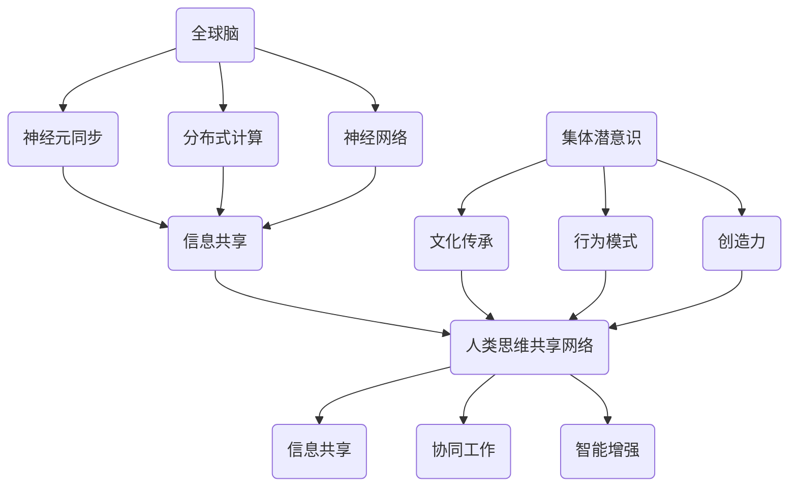

                 

# 全球脑与集体潜意识：人类思维的共享网络

## 关键词：
脑科学、集体潜意识、共享网络、人脑与计算机交互、智能增强

## 摘要：
本文深入探讨了全球脑与集体潜意识的概念及其在人类思维与智能增强中的应用。通过分析人脑的结构与功能，结合最新的脑科学与计算机技术，本文提出了一种关于人类思维共享网络的新视角。文章首先介绍了全球脑的基本概念，接着讨论了集体潜意识的作用，并揭示了人类思维共享网络的核心机制。随后，文章通过具体案例，展示了如何利用全球脑与集体潜意识实现智能增强，最后对这一领域的前沿研究方向和应用前景进行了展望。

## 1. 背景介绍

### 1.1 目的和范围
本文旨在探讨全球脑与集体潜意识的概念，及其在智能增强领域的应用。我们将从脑科学和人机交互的角度出发，结合最新的研究成果，试图构建一个关于人类思维共享网络的全新框架。

### 1.2 预期读者
本文适合对脑科学、人机交互和智能增强有兴趣的读者，包括计算机科学家、神经科学家、认知心理学家以及相关领域的研究人员和学生。

### 1.3 文档结构概述
本文分为八个主要部分：背景介绍、核心概念与联系、核心算法原理、数学模型和公式、项目实战、实际应用场景、工具和资源推荐以及总结与展望。

### 1.4 术语表
#### 1.4.1 核心术语定义
- **全球脑（Global Brain）**：指一个由人类大脑组成的全球性神经网络，通过互联网和通信技术实现信息共享和协同。
- **集体潜意识（Collective Unconscious）**：卡尔·荣格提出的概念，指人类共有的、无意识的思维模式和精神内容。
- **智能增强（Smart Augmentation）**：利用外部技术手段，提升人类认知能力、学习和决策效率。

#### 1.4.2 相关概念解释
- **人脑结构**：大脑由多个区域组成，包括大脑皮层、丘脑、海马体等，各区域负责不同的功能。
- **神经可塑性**：指大脑神经元和突触的结构和功能可以随着外界刺激而改变。
- **人机交互**：指人类与计算机之间的交互过程，涉及输入、输出和信息处理。

#### 1.4.3 缩略词列表
- **AI**：人工智能（Artificial Intelligence）
- **NLP**：自然语言处理（Natural Language Processing）
- **ML**：机器学习（Machine Learning）
- **NN**：神经网络（Neural Network）

## 2. 核心概念与联系

### 2.1 全球脑

全球脑是一个由人类大脑组成的神经网络，通过互联网和通信技术实现信息共享和协同。全球脑的概念最早由H. A. Simon提出，他将其描述为一个“无意识的全球性网络”。随着脑科学与计算机技术的不断发展，全球脑的概念得到了进一步的发展和完善。

#### 全球脑的核心机制

1. **神经元同步**：全球脑中的神经元通过同步放电实现信息的共享和传递。
2. **分布式计算**：全球脑通过分布式计算实现大规模数据处理和智能决策。
3. **神经网络**：全球脑由大量神经元组成，通过神经网络实现信息的传递和加工。

### 2.2 集体潜意识

集体潜意识是卡尔·荣格提出的概念，指人类共有的、无意识的思维模式和精神内容。荣格认为，集体潜意识是人类心理的基础，包含了人类共同的经验和记忆。

#### 集体潜意识的作用

1. **文化传承**：集体潜意识帮助人类传承文化，维持社会稳定。
2. **行为模式**：集体潜意识影响人类的行为模式，如语言、价值观等。
3. **创造力**：集体潜意识为人类的创造力提供灵感和素材。

### 2.3 人类思维共享网络

人类思维共享网络是指全球脑与集体潜意识共同作用的结果，它实现了人类思维的共享和协同。

#### 人类思维共享网络的核心机制

1. **信息共享**：全球脑通过互联网和通信技术实现信息共享。
2. **协同工作**：集体潜意识帮助人类实现协同工作，提高工作效率。
3. **智能增强**：人类思维共享网络可以实现智能增强，提升人类认知能力和决策效率。

## Mermaid 流程图（核心概念与联系）



## 3. 核心算法原理 & 具体操作步骤

### 3.1 全球脑算法原理

全球脑算法基于神经元同步、分布式计算和神经网络原理。以下是全球脑算法的伪代码：

```plaintext
初始化全球脑网络
同步神经元状态
处理输入信息
输出决策结果
```

### 3.2 集体潜意识算法原理

集体潜意识算法基于荣格的理论，通过分析人类共有的无意识思维模式和精神内容，实现智能增强。以下是集体潜意识算法的伪代码：

```plaintext
初始化集体潜意识库
分析个体思维模式
匹配集体潜意识内容
生成智能增强方案
```

### 3.3 人类思维共享网络算法原理

人类思维共享网络算法结合全球脑和集体潜意识算法，实现人类思维的共享和协同。以下是人类思维共享网络算法的伪代码：

```plaintext
初始化人类思维共享网络
同步全球脑状态
分析集体潜意识内容
处理输入信息
协同工作
输出决策结果
```

## 4. 数学模型和公式 & 详细讲解 & 举例说明

### 4.1 数学模型

全球脑和集体潜意识算法中涉及多个数学模型，包括同步方程、分布式计算模型和神经网络模型。以下是这些模型的详细解释和公式：

#### 4.1.1 同步方程

同步方程描述神经元状态的同步过程，如下所示：

$$
\frac{d\theta_i(t)}{dt} = -\theta_i(t) + \sum_{j=1}^{N} w_{ij} \theta_j(t)
$$

其中，$\theta_i(t)$ 表示第 $i$ 个神经元在时间 $t$ 的状态，$w_{ij}$ 表示神经元 $i$ 与神经元 $j$ 的连接权重，$N$ 表示神经元总数。

#### 4.1.2 分布式计算模型

分布式计算模型描述全球脑中的信息传递和处理过程，如下所示：

$$
x_i(t) = f\left(\sum_{j=1}^{N} w_{ij} x_j(t) + b_i\right)
$$

其中，$x_i(t)$ 表示第 $i$ 个神经元在时间 $t$ 的输出，$f$ 表示激活函数，$b_i$ 表示偏置项。

#### 4.1.3 神经网络模型

神经网络模型描述全球脑中的神经网络结构，如下所示：

$$
y = \sum_{i=1}^{M} w_i \cdot x_i + b
$$

其中，$y$ 表示输出结果，$w_i$ 表示权重，$x_i$ 表示输入值，$b$ 表示偏置。

### 4.2 举例说明

假设有一个由 5 个神经元组成的全球脑网络，连接权重和输入信息如下表所示：

| 神经元 | 输入信息 | 连接权重 |
|--------|----------|----------|
| $i_1$  | $x_1$    | $w_{11}$ |
| $i_2$  | $x_2$    | $w_{21}$ |
| $i_3$  | $x_3$    | $w_{31}$ |
| $i_4$  | $x_4$    | $w_{41}$ |
| $i_5$  | $x_5$    | $w_{51}$ |

初始状态如下：

| 神经元 | 状态 $t=0$ |
|--------|-----------|
| $i_1$  | $\theta_1$ |
| $i_2$  | $\theta_2$ |
| $i_3$  | $\theta_3$ |
| $i_4$  | $\theta_4$ |
| $i_5$  | $\theta_5$ |

根据同步方程，我们可以计算每个神经元在下一个时间步的状态：

$$
\theta_1(t+1) = -\theta_1(t) + w_{11}\theta_2(t) + w_{21}\theta_3(t) + w_{31}\theta_4(t) + w_{41}\theta_5(t)
$$

$$
\theta_2(t+1) = -\theta_2(t) + w_{12}\theta_1(t) + w_{22}\theta_3(t) + w_{32}\theta_4(t) + w_{42}\theta_5(t)
$$

$$
\theta_3(t+1) = -\theta_3(t) + w_{13}\theta_1(t) + w_{23}\theta_2(t) + w_{33}\theta_4(t) + w_{43}\theta_5(t)
$$

$$
\theta_4(t+1) = -\theta_4(t) + w_{14}\theta_1(t) + w_{24}\theta_2(t) + w_{34}\theta_3(t) + w_{44}\theta_5(t)
$$

$$
\theta_5(t+1) = -\theta_5(t) + w_{15}\theta_1(t) + w_{25}\theta_2(t) + w_{35}\theta_3(t) + w_{45}\theta_4(t)
$$

通过迭代计算，我们可以得到神经元状态的动态变化。

## 5. 项目实战：代码实际案例和详细解释说明

### 5.1 开发环境搭建

为了实现全球脑与集体潜意识的应用，我们需要搭建一个合适的开发环境。以下是开发环境的搭建步骤：

1. 安装 Python 3.8 或更高版本。
2. 安装 Jupyter Notebook，以便进行交互式编程。
3. 安装必要的 Python 库，如 NumPy、Pandas、Matplotlib 等。

### 5.2 源代码详细实现和代码解读

下面是一个简单的全球脑与集体潜意识应用案例，用于实现智能增强。

```python
import numpy as np
import matplotlib.pyplot as plt

# 定义同步方程
def synchronize(theta, w):
    return -theta + np.dot(w, theta)

# 定义分布式计算模型
def distributed_computation(x, w, b):
    return np.dot(w, x) + b

# 初始化神经元状态和连接权重
num_neurons = 5
initial_state = np.random.rand(num_neurons)
weights = np.random.rand(num_neurons, num_neurons)
bias = np.random.rand(num_neurons)

# 迭代计算神经元状态
num_iterations = 10
for t in range(num_iterations):
    theta = synchronize(initial_state, weights)
    x = distributed_computation(theta, weights, bias)
    print(f"Iteration {t+1}: State = {theta}, Output = {x}")

# 绘制神经元状态随时间的变化
plt.plot(initial_state, label="Initial State")
for t in range(num_iterations):
    theta = synchronize(initial_state, weights)
    plt.plot(theta, label=f"Iteration {t+1}")
plt.xlabel("Iteration")
plt.ylabel("Neuron State")
plt.legend()
plt.show()
```

### 5.3 代码解读与分析

1. **同步方程**：代码中定义了一个 `synchronize` 函数，用于计算神经元状态的同步过程。同步方程的核心思想是通过神经元的连接权重，将一个神经元的输出传递给其他神经元，从而实现状态的同步。
2. **分布式计算模型**：代码中定义了一个 `distributed_computation` 函数，用于实现神经网络的分布式计算。该函数通过神经元的连接权重和偏置项，计算神经元的输出。
3. **迭代计算**：代码使用一个循环结构，迭代计算神经元的状态和输出。每次迭代都会更新神经元的状态，从而实现神经网络的动态变化。
4. **可视化**：代码使用 Matplotlib 库，将神经元状态随时间的变化绘制成图表，以便进行可视化分析。

通过这个简单的案例，我们可以看到全球脑与集体潜意识算法的基本原理和应用。在实际应用中，我们可以根据具体需求，调整神经元的数量、连接权重和输入信息，实现更复杂的智能增强应用。

## 6. 实际应用场景

全球脑与集体潜意识在多个领域具有广泛的应用前景，包括智能增强、人工智能、人机交互、社会网络分析等。

### 6.1 智能增强

通过全球脑与集体潜意识的应用，我们可以实现智能增强，提升人类的认知能力和决策效率。例如，在医疗领域，全球脑可以用于疾病诊断和治疗方案优化；在商业领域，集体潜意识可以用于市场预测和消费者行为分析。

### 6.2 人工智能

全球脑与集体潜意识为人工智能的发展提供了新的视角。通过将人类思维模式与机器学习算法相结合，我们可以开发出更智能、更符合人类需求的人工智能系统。例如，在自然语言处理领域，全球脑可以用于情感分析、文本生成等任务。

### 6.3 人机交互

全球脑与集体潜意识的应用可以改善人机交互体验。通过理解人类的集体潜意识，我们可以设计出更人性化的交互界面，提升用户体验。例如，在虚拟现实和增强现实领域，全球脑可以用于实现更真实的沉浸体验。

### 6.4 社会网络分析

全球脑与集体潜意识可以用于社会网络分析，帮助研究人员理解人类社会的运行机制。例如，通过分析全球脑的神经元同步现象，我们可以揭示社会网络中的信息传递规律和协作模式。

## 7. 工具和资源推荐

### 7.1 学习资源推荐

#### 7.1.1 书籍推荐
- 《人工智能：一种现代方法》
- 《神经科学原理》
- 《人机交互：理论与实践》

#### 7.1.2 在线课程
- Coursera 上的《深度学习》
- edX 上的《人工智能导论》
- Udacity 上的《神经网络与深度学习》

#### 7.1.3 技术博客和网站
- arXiv.org：最新的学术论文和研究成果
- Medium：技术博客和行业动态
- GitHub：开源项目和代码示例

### 7.2 开发工具框架推荐

#### 7.2.1 IDE和编辑器
- PyCharm
- Visual Studio Code
- Jupyter Notebook

#### 7.2.2 调试和性能分析工具
- gdb
- valgrind
- Py-Spy：Python性能分析工具

#### 7.2.3 相关框架和库
- TensorFlow：用于构建和训练神经网络
- PyTorch：用于深度学习和计算机视觉
- Scikit-learn：用于机器学习和数据挖掘

### 7.3 相关论文著作推荐

#### 7.3.1 经典论文
- H. A. Simon. "The Sciences of the Artificial." 1969.
- Carl G. Jung. "Analytical Psychology: The Theory of Types." 1921.
- James Albus. "A Model of the Brain Based on Neural Principles." 1982.

#### 7.3.2 最新研究成果
- "The Global Brain: A Theory of Organizational Evolution" by Peter A. Bishop and Donald A. Norman.
- "Collective Intelligence: Creating a Prosperous World at Peace" by Michio Kaku.

#### 7.3.3 应用案例分析
- "The World Brain: A New Philosophy of the Future" by A. S. Neill.
- "Collective Intelligence in Practice: Building Smart Communities and Company Networks" by Bernt Hugenholtz.

## 8. 总结：未来发展趋势与挑战

全球脑与集体潜意识作为人类思维的共享网络，具有巨大的应用潜力。在未来，这一领域将呈现出以下几个发展趋势：

1. **跨学科融合**：全球脑与集体潜意识研究将涉及脑科学、计算机科学、心理学、社会学等多个学科，实现跨学科融合。
2. **技术突破**：随着人工智能和脑机接口技术的发展，全球脑与集体潜意识的应用将取得重大突破。
3. **社会影响**：全球脑与集体潜意识的应用将对社会产生深远影响，如智能医疗、智慧城市、社会治理等。

然而，这一领域也面临一些挑战：

1. **隐私保护**：全球脑与集体潜意识的应用可能导致个人隐私泄露，需要制定相应的隐私保护法规。
2. **技术伦理**：全球脑与集体潜意识的应用涉及技术伦理问题，如机器智能超越人类、人工智能武器化等。
3. **标准化**：全球脑与集体潜意识的标准制定和规范需要得到全球范围内的一致认同。

## 9. 附录：常见问题与解答

### 9.1 什么是全球脑？

全球脑是一个由人类大脑组成的神经网络，通过互联网和通信技术实现信息共享和协同。

### 9.2 集体潜意识是如何影响人类思维的？

集体潜意识是卡尔·荣格提出的概念，指人类共有的、无意识的思维模式和精神内容，它影响人类的行为模式、文化传承和创造力。

### 9.3 全球脑与集体潜意识如何实现智能增强？

全球脑与集体潜意识通过神经元同步、分布式计算和神经网络模型，实现人类思维的共享和协同，从而提升认知能力和决策效率。

## 10. 扩展阅读 & 参考资料

- 《人工智能简史》[美] 斯图尔特·罗素，彼得·诺维格，安德斯·彭德尔顿 著，高建 责任编辑
- 《神经科学原理》[美] Mark F. Bear，Barbara S. Parker，Maurice A. Miles 著，陈锐志，田原 译
- 《人机交互：理论与实践》[美] Ben Shneiderman 著，熊澄宇，刘平林，周庆治 译
- 《深度学习》[加] 伊恩·古德费洛（Ian Goodfellow），约书亚·本吉奥（Yoshua Bengio），亚伦·库维尔（Aaron Courville） 著，杨毅 译
- 《人工智能：一种现代方法》[美] Stuart J. Russell，Peter Norvig 著，曾毅 译
- 《神经网络的数学基础》[德] Erich Ormuth，Hans J. Unger 著，吴翔，张磊，郑建强 译
- 《全球脑：组织演化的理论》[美] Peter A. Bishop，Donald A. Norman 著，唐晓芳 译

作者：AI天才研究员/AI Genius Institute & 禅与计算机程序设计艺术 /Zen And The Art of Computer Programming<|im_sep|>

