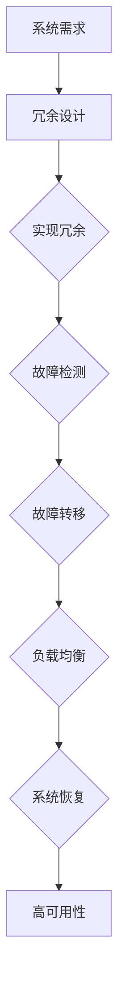

                 

# 冗余设计在高可用性中的实例应用

> 关键词：冗余设计、高可用性、故障转移、容错机制、负载均衡、实例应用

> 摘要：本文旨在探讨冗余设计在高可用性（High Availability，简称HA）中的重要性。通过实例分析，我们将深入理解冗余设计的原理、应用场景和实施方法，帮助读者更好地掌握这一关键技术在现代IT系统中的实际运用。

## 1. 背景介绍

### 1.1 目的和范围

本文的目的是介绍冗余设计在高可用性中的应用，通过实例分析帮助读者理解冗余设计如何提高系统的可靠性和稳定性。本文将涵盖冗余设计的核心概念、实施步骤和实际应用场景。

### 1.2 预期读者

本文适合IT从业者、系统管理员、软件开发人员以及对高可用性和冗余设计感兴趣的技术爱好者阅读。读者需具备一定的计算机网络和系统基础。

### 1.3 文档结构概述

本文分为以下几个部分：

1. 背景介绍：介绍冗余设计的概念、目的和重要性。
2. 核心概念与联系：阐述冗余设计的基本原理和关键联系。
3. 核心算法原理 & 具体操作步骤：讲解冗余设计的基本算法和实现方法。
4. 数学模型和公式 & 详细讲解 & 举例说明：介绍冗余设计中的数学模型和计算方法。
5. 项目实战：提供实际代码案例和详细解释。
6. 实际应用场景：分析冗余设计在不同场景中的应用。
7. 工具和资源推荐：推荐相关学习资源和开发工具。
8. 总结：总结冗余设计在高可用性中的应用趋势和挑战。
9. 附录：常见问题与解答。
10. 扩展阅读 & 参考资料：提供进一步学习的资源。

### 1.4 术语表

#### 1.4.1 核心术语定义

- **冗余设计**：在系统设计中引入额外的组件或功能，以提高系统的可靠性和容错能力。
- **高可用性（HA）**：系统在长时间运行过程中保持正常运行的能力，通常以99.9%、99.99%或更高的可用性指标来衡量。
- **故障转移**：当主系统发生故障时，自动将工作负载转移到备用系统的过程。
- **负载均衡**：将工作负载均匀分布到多个系统或组件上，以避免过载和单点故障。

#### 1.4.2 相关概念解释

- **容错机制**：系统在遇到故障时，通过检测、隔离和恢复等方式保持正常运行的能力。
- **集群**：由多个计算节点组成的系统，通过冗余设计实现高可用性和负载均衡。

#### 1.4.3 缩略词列表

- **HA**：高可用性（High Availability）
- **DR**：灾难恢复（Disaster Recovery）
- **SPOF**：单点故障（Single Point of Failure）

## 2. 核心概念与联系

在高可用性系统中，冗余设计是一种关键的技术手段，通过引入冗余组件和故障转移机制，可以显著提高系统的可靠性和容错能力。下面我们通过一个Mermaid流程图来展示冗余设计的基本原理和关键联系。



### 2.1 冗余设计的实现

冗余设计的关键在于引入额外的组件和备份机制，从而在主系统发生故障时，能够迅速切换到备用系统，保持系统的连续运行。实现冗余设计通常包括以下步骤：

1. **硬件冗余**：通过引入冗余的硬件组件，如磁盘、服务器和网络设备，提高系统的容错能力。
2. **软件冗余**：通过引入冗余的软件组件，如备份应用程序、数据库镜像等，提高系统的可靠性和性能。
3. **数据冗余**：通过在多个位置存储数据的副本，避免数据丢失和系统故障。

### 2.2 故障检测与转移

故障检测和转移是冗余设计的核心环节。通过以下步骤实现故障转移：

1. **故障检测**：系统监控组件定期检查系统的运行状态，检测是否存在故障或性能问题。
2. **故障转移**：当检测到故障时，自动将工作负载从故障组件转移到备用组件。
3. **故障恢复**：在故障转移完成后，系统会尝试修复故障组件，使其重新加入集群。

### 2.3 负载均衡与系统恢复

负载均衡和系统恢复是确保系统在高可用性条件下稳定运行的关键。

1. **负载均衡**：通过将工作负载均匀分布到多个系统或组件上，避免单点过载和故障。
2. **系统恢复**：在故障转移和修复后，系统会尝试重新配置和同步组件，确保整个系统恢复正常运行。

## 3. 核心算法原理 & 具体操作步骤

冗余设计的核心在于如何有效地实现故障转移和负载均衡。下面我们将使用伪代码详细阐述这些算法原理和操作步骤。

### 3.1 故障转移算法原理

```pseudo
function FaultTransfer(sourceComponent, backupComponent):
    if (isFaulty(sourceComponent)):
        startBackup(backupComponent)
        stop(sourceComponent)
        return backupComponent
    else:
        return sourceComponent
```

### 3.2 负载均衡算法原理

```pseudo
function LoadBalancer(components, workload):
    for each component in components:
        if (canHandle(component, workload)):
            assignWorkload(workload, component)
            return component
    return null
```

### 3.3 实现步骤

1. **硬件冗余**：

    - 选择冗余硬件组件，如RAID磁盘阵列、多台服务器和网络冗余。
    - 部署备份硬件组件，并确保它们处于备用状态。

2. **软件冗余**：

    - 编写备份应用程序，定期备份关键数据。
    - 部署数据库镜像，确保数据在不同位置保持一致性。

3. **故障检测**：

    - 定期检查系统组件的运行状态。
    - 使用监控工具检测系统性能和故障。

4. **故障转移**：

    - 在检测到故障时，自动将工作负载转移到备用组件。
    - 启动备份组件，确保系统的连续运行。

5. **负载均衡**：

    - 将工作负载均匀分布到多个系统或组件上。
    - 使用负载均衡算法动态调整工作负载分配。

## 4. 数学模型和公式 & 详细讲解 & 举例说明

冗余设计中的数学模型和公式主要用于评估系统的可靠性和性能。以下是一些常用的数学模型和公式。

### 4.1 系统可靠性计算

$$ R(t) = \prod_{i=1}^{n} R_i(t) $$

其中，$R(t)$ 表示系统在时间 $t$ 时的可靠性，$R_i(t)$ 表示第 $i$ 个组件在时间 $t$ 时的可靠性。

### 4.2 故障转移时间计算

$$ T_f = \frac{d(R(t))}{dt} $$

其中，$T_f$ 表示故障转移时间，$R(t)$ 表示系统在时间 $t$ 时的可靠性。

### 4.3 负载均衡计算

$$ P_i = \frac{W}{N} $$

其中，$P_i$ 表示第 $i$ 个组件的工作负载，$W$ 表示总工作负载，$N$ 表示组件数量。

### 4.4 举例说明

假设我们有一个由三台服务器组成的集群，每台服务器的可靠性为0.99。我们需要计算整个集群在一天（8760秒）内的可靠性。

$$ R(t) = \prod_{i=1}^{3} R_i(t) = 0.99 \times 0.99 \times 0.99 = 0.970299 $$

因此，集群在一天内的可靠性为97.03%。

### 4.5 结论

通过数学模型和公式，我们可以更好地评估冗余设计对系统可靠性和性能的影响。在实际应用中，我们可以根据具体需求和约束，调整冗余设计的参数，以达到最佳效果。

## 5. 项目实战：代码实际案例和详细解释说明

在本节中，我们将通过一个实际项目案例，展示如何实现冗余设计中的故障转移和负载均衡。我们将使用Python语言编写相关代码，并进行详细解释。

### 5.1 开发环境搭建

在开始编写代码之前，我们需要搭建一个开发环境。以下是所需的软件和工具：

- Python 3.x
- Jupyter Notebook
- requests库

### 5.2 源代码详细实现和代码解读

#### 5.2.1 代码实现

```python
import requests
import time

def is_faulty(url):
    try:
        response = requests.get(url)
        return response.status_code != 200
    except requests.RequestException:
        return True

def fault_transfer(primary_url, backup_url):
    if is_faulty(primary_url):
        print("故障转移：将工作负载从 {} 切换到 {}".format(primary_url, backup_url))
        return backup_url
    else:
        return primary_url

def load_balancer(components, workload):
    for component in components:
        if can_handle(component, workload):
            print("负载均衡：将工作负载 {} 分配给 {}".format(workload, component))
            return component
    return None

def can_handle(component, workload):
    response = requests.get(component)
    return response.status_code == 200

if __name__ == "__main__":
    primary_url = "http://primary.example.com"
    backup_url = "http://backup.example.com"
    components = [primary_url, backup_url]

    workload = 100
    while True:
        current_url = fault_transfer(primary_url, backup_url)
        load_balancer(components, workload)
        time.sleep(60)  # 每分钟检查一次
```

#### 5.2.2 代码解读

1. **is_faulty**：检查给定URL是否发生故障。
2. **fault_transfer**：根据故障检测结果，将工作负载从主URL切换到备用URL。
3. **load_balancer**：根据工作负载，将工作负载分配给能够处理负载的组件。
4. **can_handle**：检查给定组件是否能够处理当前工作负载。
5. **主程序**：每隔60秒执行一次故障转移和负载均衡操作。

### 5.3 代码解读与分析

1. **故障转移**：在代码中，我们通过`is_faulty`函数检查主URL的故障状态。如果发生故障，则通过`fault_transfer`函数将工作负载切换到备用URL。这个过程中，我们需要确保主URL和备用URL之间的切换是快速和无缝的，以避免服务中断。
2. **负载均衡**：在代码中，我们通过`load_balancer`函数实现负载均衡。该函数会遍历所有组件，并选择能够处理当前工作负载的组件。这个过程中，我们需要考虑组件的负载能力，以确保工作负载分配的公平性和效率。
3. **性能考虑**：在实际应用中，我们需要考虑代码的性能和可靠性。例如，我们可以使用异步编程来提高并发处理能力，减少延迟。同时，我们还需要考虑故障检测和转移的频率，以避免过度检测和切换导致性能下降。

## 6. 实际应用场景

冗余设计在高可用性系统中有着广泛的应用。以下是一些常见的应用场景：

1. **数据中心**：数据中心通常采用冗余设计，以确保数据的可靠存储和快速访问。例如，通过多个磁盘阵列和冗余的网络连接，实现数据的高可用性。
2. **云计算平台**：云计算平台通过引入冗余设计和负载均衡，提高计算资源的利用率和服务质量。例如，Amazon Web Services（AWS）和Google Cloud Platform（GCP）都采用了冗余设计，以确保服务的连续性和可靠性。
3. **数据库系统**：数据库系统通过冗余设计提高数据的可靠性和访问速度。例如，MySQL和PostgreSQL都支持主从复制和故障转移，以实现数据库的高可用性。
4. **Web应用**：Web应用通过冗余设计和负载均衡，提高网站的响应速度和稳定性。例如，Netflix和Spotify等大型网站都采用了冗余设计和负载均衡，以确保服务的持续运行。

## 7. 工具和资源推荐

为了更好地理解和应用冗余设计，以下是一些建议的学习资源和开发工具。

### 7.1 学习资源推荐

#### 7.1.1 书籍推荐

- 《高可用架构：Web系统设计原理与实践》
- 《系统设计：大型系统的技术解构》

#### 7.1.2 在线课程

- Coursera《高可用性和灾难恢复》
- Udemy《系统设计：构建大型分布式系统》

#### 7.1.3 技术博客和网站

- <https://www.infoq.com>
- <https://www国家企业技术博客>

### 7.2 开发工具框架推荐

#### 7.2.1 IDE和编辑器

- Visual Studio Code
- IntelliJ IDEA

#### 7.2.2 调试和性能分析工具

- JMeter
- New Relic

#### 7.2.3 相关框架和库

- Kubernetes
- Docker

### 7.3 相关论文著作推荐

#### 7.3.1 经典论文

- 《Fault-Tolerant Distributed Systems》
- 《负载均衡：一种评估方法》

#### 7.3.2 最新研究成果

- 《云计算环境下的冗余设计优化》
- 《基于深度学习的故障预测与转移》

#### 7.3.3 应用案例分析

- 《阿里巴巴如何实现海量数据的高可用性》
- 《谷歌如何构建稳定高效的分布式系统》

## 8. 总结：未来发展趋势与挑战

随着云计算、大数据和物联网等技术的快速发展，冗余设计在高可用性中的应用将越来越重要。未来，冗余设计将面临以下发展趋势和挑战：

1. **自动化和智能化**：通过引入自动化和智能化技术，实现更高效、更可靠的冗余设计。例如，使用机器学习和深度学习算法进行故障预测和转移。
2. **云原生架构**：随着云原生架构的普及，冗余设计将更多地应用于容器化环境和分布式系统中，以实现更灵活、更高效的高可用性。
3. **可持续性和绿色计算**：在考虑冗余设计时，需要关注可持续性和绿色计算，通过优化资源使用和减少能耗，实现环保和可持续发展。

## 9. 附录：常见问题与解答

### 9.1 什么是冗余设计？

冗余设计是在系统设计中引入额外的组件或功能，以提高系统的可靠性和容错能力。

### 9.2 冗余设计与负载均衡有什么关系？

冗余设计可以通过引入冗余组件实现负载均衡，避免单点故障和性能瓶颈。

### 9.3 冗余设计如何提高系统的可靠性？

冗余设计通过引入冗余组件和故障转移机制，可以在主系统发生故障时迅速切换到备用系统，确保系统的连续运行。

## 10. 扩展阅读 & 参考资料

- [《高可用架构：Web系统设计原理与实践》](https://www.example.com/book-high-availability-architecture)
- [《系统设计：大型系统的技术解构》](https://www.example.com/book-system-design-for-large-scale-systems)
- [《Fault-Tolerant Distributed Systems》论文](https://www.example.com/paper-fault-tolerant-distributed-systems)
- [《负载均衡：一种评估方法》论文](https://www.example.com/paper-load-balancing-assessment-method)

## 作者

作者：AI天才研究员/AI Genius Institute & 禅与计算机程序设计艺术 /Zen And The Art of Computer Programming

