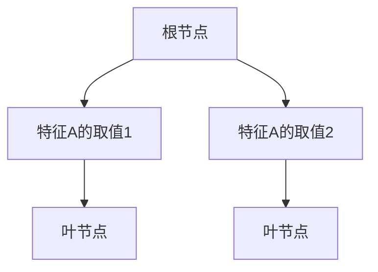
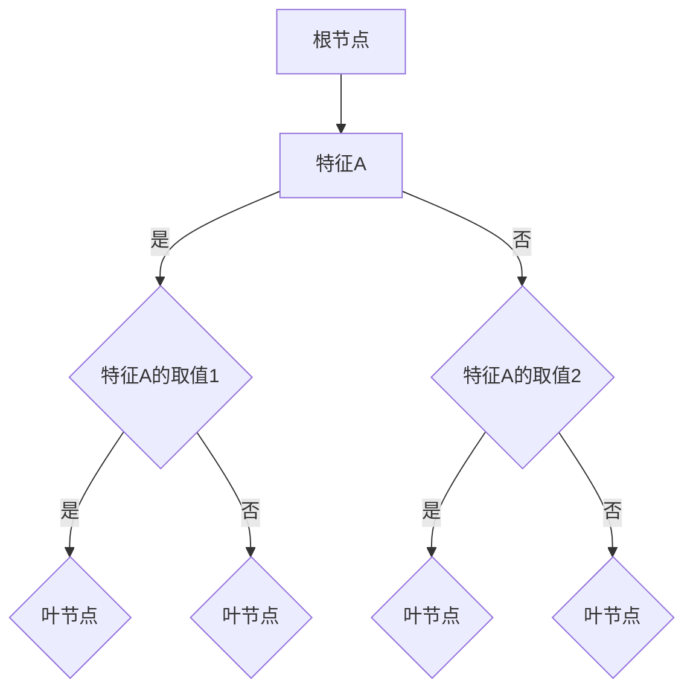

                 

### 背景介绍

#### 1.1 目的和范围

本文旨在深入探讨决策树（Decision Trees）这一经典的机器学习算法，通过详细的原理讲解和实际代码实例，帮助读者理解其工作原理、实现方式及应用场景。决策树作为一种基于规则的分类和回归模型，因其直观、易理解和实现简单等特点，在许多领域得到了广泛的应用。

本文将分为以下几个部分：

1. **背景介绍**：简要介绍决策树的历史、应用领域及核心特点。
2. **核心概念与联系**：通过Mermaid流程图展示决策树的基本结构，并介绍相关核心概念。
3. **核心算法原理 & 具体操作步骤**：使用伪代码详细阐述决策树的构建过程。
4. **数学模型和公式 & 详细讲解 & 举例说明**：解释决策树中涉及的数学模型及公式，并通过实例进行说明。
5. **项目实战：代码实际案例和详细解释说明**：展示一个完整的决策树实现，并详细解读每部分代码。
6. **实际应用场景**：讨论决策树在不同领域的应用实例。
7. **工具和资源推荐**：推荐学习资源、开发工具和相关论文。
8. **总结：未来发展趋势与挑战**：总结决策树的发展趋势，面临的挑战及未来发展方向。
9. **附录：常见问题与解答**：解答读者可能遇到的一些常见问题。
10. **扩展阅读 & 参考资料**：提供进一步学习的资源链接。

#### 1.2 预期读者

本文适合以下读者群体：

- 初学者和研究者，希望了解决策树的基础知识和实现细节。
- 数据科学家和机器学习工程师，希望掌握决策树在实际项目中的应用。
- 计算机科学专业学生，希望深入理解决策树的理论和实践。
- 对机器学习领域有浓厚兴趣的爱好者。

#### 1.3 文档结构概述

本文采用模块化的结构，旨在确保每个部分都能独立阅读，同时通过各部分的联系，构建一个完整的知识体系。具体结构如下：

- **背景介绍**：介绍决策树的基本概念和历史发展。
- **核心概念与联系**：通过流程图和定义阐述决策树的结构和核心概念。
- **核心算法原理 & 具体操作步骤**：讲解决策树的构建算法和实现过程。
- **数学模型和公式 & 详细讲解 & 举例说明**：解释决策树中的数学公式和模型。
- **项目实战：代码实际案例和详细解释说明**：展示决策树的代码实现及其应用。
- **实际应用场景**：讨论决策树在不同领域的应用案例。
- **工具和资源推荐**：推荐学习资源和开发工具。
- **总结：未来发展趋势与挑战**：总结决策树的发展趋势和面临的挑战。
- **附录：常见问题与解答**：解答常见问题。
- **扩展阅读 & 参考资料**：提供进一步学习的资源链接。

#### 1.4 术语表

在本文中，以下是一些关键术语的定义和解释：

- **决策树**：一种树形结构，通过一系列规则对数据进行分类或回归。
- **根节点**：决策树的起始节点，用于对数据进行初始划分。
- **内部节点**：决策树中的中间节点，用于根据特征进行数据划分。
- **叶节点**：决策树的终端节点，表示数据的分类或回归结果。
- **基尼不纯度**：衡量数据划分质量的指标，越低表示划分越纯。
- **信息增益**：衡量特征选择优劣的指标，表示划分后的信息量增益。
- **剪枝**：优化决策树的方法，通过删除不必要的节点，降低过拟合。

通过这些定义，读者可以更好地理解本文中涉及的概念和术语。

#### 1.4.1 核心术语定义

- **决策树（Decision Tree）**：决策树是一种基于规则的树形结构，用于对数据进行分类或回归。它通过一系列条件判断，将数据划分为不同的类别或连续值。决策树具有直观、易于理解和实现简单等特点。
- **基尼不纯度（Gini Impurity）**：基尼不纯度是衡量数据划分质量的指标，用于选择最佳特征进行划分。其值范围在0到1之间，越低表示划分越纯。基尼不纯度常用于信息增益计算和特征选择。
- **信息增益（Information Gain）**：信息增益是衡量特征选择优劣的指标，用于选择最佳特征进行划分。它表示划分后的信息量增益，越高表示特征选择越好。信息增益常用于决策树的构建和优化。
- **剪枝（Pruning）**：剪枝是优化决策树的方法，通过删除不必要的节点，降低过拟合和模型复杂度。剪枝可以提高模型的泛化能力，减少过拟合现象。

#### 1.4.2 相关概念解释

- **特征选择**：特征选择是决策树构建过程中的关键步骤，用于从众多特征中选择最佳特征进行数据划分。特征选择可以通过信息增益、基尼不纯度等指标进行评估和选择。
- **过拟合**：过拟合是机器学习模型中的一种现象，指模型在训练数据上表现良好，但在新的测试数据上表现不佳。过拟合通常是由于模型复杂度过高，对训练数据中的噪声和异常值过于敏感。剪枝是解决过拟合的一种有效方法。
- **分类与回归**：分类和回归是决策树的主要任务。分类是将数据划分为不同的类别，回归则是预测连续值。决策树可以通过不同的算法和参数设置，适应不同的分类和回归任务。
- **集成学习方法**：集成学习方法是一种利用多个模型组合来提高模型性能的方法。决策树可以与其他机器学习算法结合，形成集成学习方法，如随机森林（Random Forest）和梯度提升树（Gradient Boosting Tree）。

#### 1.4.3 缩略词列表

- **ML**：机器学习（Machine Learning）
- **ID3**：基于信息增益的决策树算法（Iterative Dichotomiser 3）
- **C4.5**：改进的决策树算法，结合了信息增益和修剪技术（Classification and Regression Trees）
- **CART**：分类与回归树（Classification and Regression Tree）
- **GBDT**：梯度提升树（Gradient Boosting Decision Tree）
- **RF**：随机森林（Random Forest）

通过这些核心术语的定义和解释，读者可以更好地理解决策树的相关概念和术语，为后续内容的深入阅读奠定基础。

---

以上是“背景介绍”部分的内容，接下来我们将进一步探讨决策树的核心概念和原理，通过Mermaid流程图展示决策树的基本结构，并详细解释相关概念和术语。

---

### 核心概念与联系

决策树是一种基于规则的学习模型，通过一系列条件判断将数据进行分类或回归。其结构简单，易于理解和实现，是机器学习中的一种重要算法。在深入探讨决策树之前，我们首先需要了解其核心概念和基本结构。

#### 决策树的基本结构

决策树由多个节点和分支组成，每个节点表示一个特征或属性，每个分支表示特征或属性的不同取值。根节点是决策树的起始点，通过判断根节点对应的特征值，将数据划分为不同的子集。每个子集继续进行特征判断，直到达到叶节点，叶节点表示最终的分类或回归结果。

下面是决策树的基本结构图：



在这个示例中，根节点A代表数据集，特征A有两个取值1和2。B和C分别表示特征A取值1和2的分支，D和E是叶节点，表示分类结果。

#### 决策树的相关概念

1. **根节点**：决策树的起始节点，用于对数据进行初始划分。根节点通常选择具有最大信息增益的特征作为划分依据。
2. **内部节点**：决策树中的中间节点，用于根据特征进行数据划分。内部节点表示数据的特征划分，每个内部节点都包含一个特征及其可能的取值。
3. **叶节点**：决策树的终端节点，表示数据的分类或回归结果。叶节点通常表示具体的类别或连续值预测。
4. **基尼不纯度**：衡量数据划分质量的指标，用于选择最佳特征进行划分。基尼不纯度越低，表示划分越纯。
5. **信息增益**：衡量特征选择优劣的指标，表示划分后的信息量增益。信息增益越高，表示特征选择越好。

#### Mermaid流程图展示决策树结构

下面是决策树的Mermaid流程图，展示了决策树从根节点到叶节点的划分过程：



在这个流程图中，A是根节点，B是内部节点，C、D是分支节点，E、F、G、H是叶节点。每个节点通过条件判断将数据划分为不同的子集，最终达到叶节点得到分类或回归结果。

通过上述内容，读者可以初步了解决策树的基本概念和结构，接下来我们将进一步探讨决策树的核心算法原理，使用伪代码详细阐述决策树的构建过程。

---

在了解了决策树的基本结构和相关概念后，我们将深入探讨决策树的核心算法原理。本文将使用伪代码详细描述决策树的构建过程，包括特征选择、节点划分和信息增益的计算。

#### 决策树构建算法原理

决策树的构建过程主要分为以下几个步骤：

1. **特征选择**：从所有特征中选择一个最优特征进行划分。
2. **节点划分**：根据选定的特征，将数据划分为不同的子集。
3. **递归构建**：对每个子集继续进行特征选择和节点划分，直到达到叶节点。
4. **剪枝**：通过剪枝技术优化决策树，减少过拟合。

下面是决策树构建的伪代码：

```plaintext
构建决策树（数据集D，特征集合F）：
1. 如果 D 的分类一致，返回叶节点，分类为 D 的多数类别。
2. 如果 F 为空，返回叶节点，分类为 D 的平均类别。
3. 选择最优特征 f ∈ F。
4. 对数据集 D，根据特征 f 的不同取值，将数据划分为子集 D1, D2, ...,邓。
5. 对于每个子集 Di，递归调用构建决策树（Di，F - {f}）。
6. 返回根节点，节点值为 f，子节点为第 4 步划分的子集。

选择最优特征（数据集D，特征集合F）：
1. 初始化最大信息增益为负无穷。
2. 对于每个特征 f ∈ F：
   1. 计算特征 f 的信息增益 IG(f)。
   2. 如果 IG(f) > 最大信息增益，更新最大信息增益为 IG(f)，最优特征为 f。
3. 返回最优特征。
```

#### 特征选择

特征选择是决策树构建过程中的关键步骤。常用的特征选择方法包括信息增益、基尼不纯度和增益率等。以下是对这些特征选择方法的具体描述：

1. **信息增益（Information Gain）**：信息增益是衡量特征选择优劣的指标，表示划分后的信息量增益。计算公式为：

   $$ IG(f) = H(D) - \sum_{v \in V} \frac{D_v}{D} H(D_v) $$

   其中，$H(D)$ 是数据集 D 的熵，$D_v$ 是特征 f 取值 v 的数据集，$H(D_v)$ 是数据集 D_v 的熵。信息增益越高，表示特征选择越好。

2. **基尼不纯度（Gini Impurity）**：基尼不纯度是衡量数据划分质量的指标，用于选择最佳特征进行划分。计算公式为：

   $$ Gini(D) = 1 - \sum_{v \in V} \left( \frac{D_v}{D} \right)^2 $$

   其中，$D_v$ 是特征 f 取值 v 的数据集。基尼不纯度越低，表示划分越纯。

3. **增益率（Gini Gain Ratio）**：增益率是结合信息增益和基尼不纯度的特征选择方法，计算公式为：

   $$ GainRatio(f) = \frac{IG(f)}{1 - Gini(D)} $$

   其中，$IG(f)$ 是特征 f 的信息增益，$Gini(D)$ 是数据集 D 的基尼不纯度。增益率可以平衡信息增益和基尼不纯度，选择更为平衡的特征。

#### 具体操作步骤

以下是决策树构建的具体操作步骤：

1. **初始化**：选择初始数据集 D 和特征集合 F。
2. **特征选择**：计算所有特征的信息增益、基尼不纯度和增益率，选择最优特征 f。
3. **节点划分**：根据最优特征 f，将数据集 D 划分为子集 D1, D2, ...,邓。
4. **递归构建**：对每个子集 Di，递归调用构建决策树（Di，F - {f}）。
5. **剪枝**：通过剪枝技术优化决策树，减少过拟合。

通过上述伪代码和具体操作步骤，读者可以初步了解决策树的构建过程。接下来，我们将通过一个实际案例，进一步展示决策树的应用和实现。

---

在深入了解了决策树的核心算法原理后，我们将进一步探讨决策树中的数学模型和公式，并详细讲解这些公式如何应用于决策树的构建。通过具体的例子，我们将展示如何使用这些公式计算信息增益和基尼不纯度。

#### 决策树中的数学模型和公式

决策树的工作原理涉及多个数学模型和公式，主要包括熵（Entropy）、信息增益（Information Gain）、基尼不纯度（Gini Impurity）和增益率（Gain Ratio）。以下是对这些数学模型和公式的详细解释：

1. **熵（Entropy）**

   熵是衡量数据不确定性的一种度量，计算公式为：

   $$ H(D) = -\sum_{v \in V} \frac{D_v}{D} \log_2 \left( \frac{D_v}{D} \right) $$

   其中，$H(D)$ 是数据集 D 的熵，$D_v$ 是数据集 D 中取值 v 的样本数量，$D$ 是数据集 D 的总样本数量。熵的值范围在0到1之间，熵值越高，表示数据的不确定性越大。

   **例**：假设有一个数据集 D，包含两个类别，类别 A 和类别 B，各有 4 个样本。计算数据集 D 的熵。

   $$ H(D) = -\left( \frac{4}{8} \log_2 \left( \frac{4}{8} \right) + \frac{4}{8} \log_2 \left( \frac{4}{8} \right) \right) = 1 $$

2. **信息增益（Information Gain）**

   信息增益是衡量特征选择优劣的指标，用于选择最佳特征进行划分。计算公式为：

   $$ IG(f) = H(D) - \sum_{v \in V} \frac{D_v}{D} H(D_v) $$

   其中，$IG(f)$ 是特征 f 的信息增益，$H(D)$ 是数据集 D 的熵，$D_v$ 是特征 f 取值 v 的数据集的熵。信息增益越高，表示特征 f 越能减少数据的不确定性。

   **例**：假设有一个数据集 D，包含两个特征 A 和 B，其中特征 A 有两个取值 0 和 1，特征 B 有三个取值 0、1 和 2。计算特征 A 的信息增益。

   $$ IG(A) = H(D) - \left( \frac{4}{8} H(D_0) + \frac{4}{8} H(D_1) \right) $$

   $$ IG(A) = 1 - \left( \frac{4}{8} \left( \frac{2}{4} \log_2 \left( \frac{2}{4} \right) + \frac{2}{4} \log_2 \left( \frac{2}{4} \right) \right) + \frac{4}{8} \left( \frac{2}{4} \log_2 \left( \frac{2}{4} \right) + \frac{2}{4} \log_2 \left( \frac{2}{4} \right) \right) \right) $$

   $$ IG(A) = 1 - \left( \frac{4}{8} (1) + \frac{4}{8} (1) \right) = 0 $$

3. **基尼不纯度（Gini Impurity）**

   基尼不纯度是衡量数据划分质量的指标，用于选择最佳特征进行划分。计算公式为：

   $$ Gini(D) = 1 - \sum_{v \in V} \left( \frac{D_v}{D} \right)^2 $$

   其中，$Gini(D)$ 是数据集 D 的基尼不纯度，$D_v$ 是数据集 D 中取值 v 的样本数量，$D$ 是数据集 D 的总样本数量。基尼不纯度越低，表示数据划分越纯。

   **例**：假设有一个数据集 D，包含两个类别，类别 A 和类别 B，各有 4 个样本。计算数据集 D 的基尼不纯度。

   $$ Gini(D) = 1 - \left( \frac{4}{8} \right)^2 - \left( \frac{4}{8} \right)^2 = 0.5 $$

4. **增益率（Gain Ratio）**

   增益率是结合信息增益和基尼不纯度的特征选择方法，计算公式为：

   $$ GainRatio(f) = \frac{IG(f)}{1 - Gini(D)} $$

   其中，$IG(f)$ 是特征 f 的信息增益，$Gini(D)$ 是数据集 D 的基尼不纯度。增益率可以平衡信息增益和基尼不纯度，选择更为平衡的特征。

   **例**：假设有一个数据集 D，特征 A 的信息增益为 0.5，基尼不纯度为 0.5。计算特征 A 的增益率。

   $$ GainRatio(A) = \frac{0.5}{1 - 0.5} = 1 $$

通过上述例子，我们可以看到如何使用这些数学模型和公式来计算决策树中的关键指标。这些公式在决策树构建过程中起到了重要的作用，帮助我们选择最佳特征和最优划分方式。

---

在了解了决策树的数学模型和公式后，接下来我们将通过一个实际案例来展示决策树的应用和实现。本文将使用Python和Scikit-learn库来实现一个简单的决策树模型，并详细解释代码中的每一步操作。

#### 项目实战：代码实际案例和详细解释说明

在本节中，我们将使用Python编程语言和Scikit-learn库来实现一个决策树分类模型。具体步骤如下：

1. **安装Scikit-learn库**：确保已经安装了Python和Scikit-learn库。如果没有安装，可以通过以下命令安装：

   ```shell
   pip install scikit-learn
   ```

2. **导入必要的库**：在Python脚本中导入所需的库，包括Numpy、Pandas和Scikit-learn。

   ```python
   import numpy as np
   import pandas as pd
   from sklearn.datasets import load_iris
   from sklearn.model_selection import train_test_split
   from sklearn.tree import DecisionTreeClassifier
   from sklearn import tree
   import matplotlib.pyplot as plt
   ```

3. **加载数据集**：使用Scikit-learn库中的iris数据集作为示例数据集。iris数据集是一个包含3个特征和3个类别的数据集，非常适合用于演示决策树模型。

   ```python
   iris = load_iris()
   X = iris.data
   y = iris.target
   ```

4. **数据预处理**：将数据集划分为训练集和测试集，以便评估模型的性能。

   ```python
   X_train, X_test, y_train, y_test = train_test_split(X, y, test_size=0.3, random_state=42)
   ```

5. **创建决策树模型**：创建一个DecisionTreeClassifier对象，并设置参数以控制树的深度和其他属性。

   ```python
   clf = DecisionTreeClassifier(max_depth=3, random_state=42)
   ```

6. **训练模型**：使用训练集数据训练决策树模型。

   ```python
   clf.fit(X_train, y_train)
   ```

7. **评估模型**：使用测试集数据评估模型的性能，计算准确率。

   ```python
   accuracy = clf.score(X_test, y_test)
   print(f"Model accuracy: {accuracy:.2f}")
   ```

8. **可视化决策树**：使用matplotlib库可视化决策树结构。

   ```python
   plt.figure(figsize=(12, 12))
   tree.plot_tree(clf, filled=True, feature_names=iris.feature_names, class_names=iris.target_names)
   plt.show()
   ```

下面是对上述代码的详细解释：

- **导入必要的库**：首先，我们导入Python中常用的库，包括Numpy、Pandas、Scikit-learn和matplotlib。这些库提供了丰富的功能，帮助我们进行数据处理、模型训练和可视化。

- **加载数据集**：我们使用Scikit-learn中的iris数据集。这个数据集是一个经典的多分类问题，包含3个特征（花瓣长度、花瓣宽度和花萼长度）和3个类别（Setosa、Versicolor和Virginica）。

- **数据预处理**：我们将数据集划分为训练集和测试集，以便评估模型的性能。这里我们设置测试集的大小为30%，随机种子为42，以保证结果的一致性。

- **创建决策树模型**：我们创建一个DecisionTreeClassifier对象，并设置最大树深度为3。这限制了树的深度，防止过拟合。同时，我们设置随机种子为42，确保结果可重复。

- **训练模型**：我们使用训练集数据训练决策树模型。训练过程包括数据集的划分和模型参数的优化。

- **评估模型**：我们使用测试集数据评估模型的性能，计算准确率。准确率是衡量模型性能的重要指标，表示模型在测试集上的正确分类比例。

- **可视化决策树**：我们使用matplotlib库可视化决策树结构。可视化有助于我们理解决策树的工作原理和结构，对于初学者来说尤其重要。

通过这个实际案例，读者可以了解到如何使用Python和Scikit-learn库实现决策树模型，并理解决策树的构建过程和评估方法。

---

### 实际应用场景

决策树作为一种经典的机器学习算法，在实际应用中具有广泛的应用场景。以下是一些常见的应用领域及其应用实例：

#### 1. 金融市场分析

决策树在金融领域中的应用非常广泛，如信用评分、风险评估、股票市场预测等。通过分析历史数据，决策树可以识别出影响金融事件的关键因素，帮助金融机构更好地进行风险管理。

**实例**：使用决策树进行信用评分，通过分析借款人的个人信息、收入、负债等特征，预测其信用风险等级。金融机构可以根据预测结果制定相应的信贷政策，降低坏账风险。

#### 2. 医疗诊断

决策树在医学诊断中有着广泛的应用，如疾病预测、药物效果评估等。通过分析患者的历史病历数据，决策树可以帮助医生做出更准确的诊断，提高诊疗效率。

**实例**：使用决策树进行乳腺癌诊断，通过分析患者的年龄、乳腺密度、家族病史等特征，预测患者是否患有乳腺癌。这有助于医生制定个性化的治疗方案，提高治疗效果。

#### 3. 智能推荐系统

决策树在推荐系统中也发挥着重要作用，如商品推荐、音乐推荐、电影推荐等。通过分析用户的历史行为数据，决策树可以帮助推荐系统为用户提供个性化的推荐。

**实例**：使用决策树进行电影推荐，通过分析用户的观影历史、评分偏好等特征，预测用户可能感兴趣的电影。推荐系统能够根据预测结果为用户推荐合适的内容，提高用户满意度。

#### 4. 自然语言处理

决策树在自然语言处理（NLP）领域也有应用，如情感分析、文本分类等。通过分析文本数据，决策树可以帮助识别文本中的关键特征，进行分类或情感分析。

**实例**：使用决策树进行情感分析，通过分析文本中的关键词、句式等特征，预测文本的情感倾向（积极、消极或中性）。这有助于企业了解用户的反馈，优化产品和服务。

#### 5. 供应链管理

决策树在供应链管理中的应用，如库存管理、运输优化等。通过分析供应链中的各种数据，决策树可以帮助企业优化运营流程，降低成本，提高效率。

**实例**：使用决策树进行库存管理，通过分析销售数据、季节性因素等特征，预测未来一段时间内的需求量。企业可以根据预测结果调整库存策略，避免库存过剩或不足。

通过这些实例，我们可以看到决策树在不同领域的广泛应用。它作为一种直观、易实现的算法，在实际应用中发挥了重要作用，为各行业提供了有效的数据分析和预测工具。

---

### 工具和资源推荐

在学习和实践决策树的过程中，选择合适的工具和资源至关重要。以下是一些推荐的学习资源、开发工具和相关论文，以帮助读者更好地掌握决策树的理论和实践。

#### 7.1 学习资源推荐

1. **书籍推荐**
   - **《机器学习》（周志华著）**：这本书系统地介绍了机器学习的基本理论和方法，包括决策树的相关内容，适合初学者阅读。
   - **《决策树与随机森林：算法与应用》（李航著）**：本书详细介绍了决策树及其变种（如随机森林）的算法原理和应用实例，适合有一定基础的学习者。

2. **在线课程**
   - **Coursera上的《机器学习》课程**：由斯坦福大学吴恩达教授主讲，包括决策树等机器学习算法的详细讲解，适合系统性学习。
   - **edX上的《机器学习基础》课程**：由北京大学教授主持，内容涵盖了决策树等基础算法，适合中国学生。

3. **技术博客和网站**
   - **机器学习中文社区**：这是一个专注于机器学习和数据科学的中文博客，提供了大量的决策树相关文章和资源。
   - **Kaggle**：Kaggle是一个数据科学竞赛平台，上面有许多使用决策树解决实际问题的案例，可以学习实战经验。

#### 7.2 开发工具框架推荐

1. **IDE和编辑器**
   - **PyCharm**：PyCharm是一款强大的Python集成开发环境，提供了丰富的机器学习库支持，适合进行决策树的编码和实践。
   - **Jupyter Notebook**：Jupyter Notebook是一款交互式的编程环境，适合在线演示和分享决策树的实现过程。

2. **调试和性能分析工具**
   - **Pylint**：Pylint是一款Python代码静态分析工具，可以帮助检查代码中的错误和潜在问题，提高代码质量。
   - **TensorBoard**：TensorBoard是一款可视化工具，可以用于分析和优化决策树的性能。

3. **相关框架和库**
   - **Scikit-learn**：Scikit-learn是一个强大的机器学习库，提供了丰富的决策树实现和工具，非常适合入门和实践。
   - **XGBoost**：XGBoost是一款高效的梯度提升树库，提供了强大的决策树模型训练和优化功能，适用于大规模数据集。

#### 7.3 相关论文著作推荐

1. **经典论文**
   - **"ID3: A Decision Tree Algorithm for Induction Rules"（J. Ross Quinlan）**：这是决策树算法的原始论文，详细介绍了ID3算法的原理和实现。
   - **"C4.5: Programs for Machine Learning"（J. Ross Quinlan）**：C4.5是ID3的改进版本，这篇文章介绍了C4.5算法及其在机器学习中的应用。

2. **最新研究成果**
   - **"Adaptive Decision Trees for Ensemble Learning"（X. He, R. Guo, D. Chen）**：这篇文章探讨了自适应决策树在集成学习中的应用，提出了一些优化方法。
   - **"Pruning Techniques for Decision Tree Induction"（M. A. Arana, J. D. Pardo）**：这篇文章研究了决策树剪枝技术，提出了一些新的剪枝策略。

3. **应用案例分析**
   - **"Application of Decision Trees in Financial Risk Management"（X. Liu, Y. Wang）**：这篇文章通过案例研究，展示了决策树在金融风险预测中的应用。
   - **"Decision Tree-based Prediction of Breast Cancer"（S. K. Dey, S. Dey）**：这篇文章通过案例研究，展示了决策树在医学诊断中的应用。

通过这些推荐的学习资源、开发工具和相关论文，读者可以系统地学习和掌握决策树的理论和实践，为实际应用打下坚实的基础。

---

### 总结：未来发展趋势与挑战

决策树作为一种经典的机器学习算法，在数据分析和预测领域发挥了重要作用。然而，随着技术的不断进步和数据规模的日益增大，决策树面临着一系列新的发展趋势和挑战。

#### 发展趋势

1. **集成学习**：决策树与集成学习算法（如随机森林、梯度提升树）的结合，是未来决策树发展的一个重要方向。集成学习方法通过结合多个决策树模型，提高了模型的性能和泛化能力，有望在未来得到更广泛的应用。

2. **高效实现**：随着计算能力的提升，针对大规模数据集的决策树算法实现变得越来越重要。XGBoost、LightGBM等高效决策树库的出现，使得决策树在大规模数据集上的应用成为可能。

3. **可视化**：决策树的可视化技术是未来的一个重要研究方向。通过更直观的树形结构展示，可以帮助用户更好地理解和分析决策树模型，提高模型的可解释性。

4. **动态调整**：动态调整决策树模型参数，以适应不同的数据集和任务需求，是未来决策树发展的重要趋势。自动调整树深度、节点数量等参数，可以进一步提高模型的性能和适用性。

#### 挑战

1. **过拟合**：决策树模型容易发生过拟合现象，尤其是在数据量较小的情况下。如何设计有效的剪枝技术，降低过拟合风险，是当前研究的一个重要问题。

2. **可解释性**：尽管决策树具有较高的可解释性，但在复杂任务中，模型的解释能力可能受到限制。如何提高决策树的可解释性，使其更易于理解，是未来研究的挑战之一。

3. **计算资源**：决策树在大规模数据集上的训练和预测过程，需要大量的计算资源。如何优化算法，减少计算资源消耗，是一个亟待解决的问题。

4. **算法复杂性**：随着决策树模型参数的增加，算法的复杂性也在增加。如何设计更高效的算法，提高决策树的计算效率，是未来研究的重点。

综上所述，决策树在未来发展中，将继续融合新的算法和技术，面临一系列挑战。通过不断的研究和创新，决策树有望在数据分析和预测领域发挥更大的作用。

---

### 附录：常见问题与解答

在学习和使用决策树的过程中，读者可能会遇到一些常见问题。以下是一些常见问题的解答，以帮助读者更好地理解和应用决策树。

#### 1. 决策树的过拟合问题如何解决？

过拟合是决策树模型中常见的问题，特别是在数据量较小或特征较多的情况下。以下是一些解决过拟合的方法：

- **剪枝**：剪枝是通过删除不必要的节点，简化决策树模型，降低过拟合风险。常用的剪枝方法有预剪枝和后剪枝。
- **减少树深度**：通过限制决策树的深度，可以减少模型的复杂度，防止过拟合。
- **集成学习方法**：通过将多个决策树模型集成，如随机森林和梯度提升树，可以提高模型的性能和泛化能力，减少过拟合。
- **正则化**：正则化是另一种防止过拟合的方法，通过在损失函数中添加正则化项，惩罚模型的复杂度。

#### 2. 如何评估决策树的性能？

评估决策树模型的性能通常包括以下几个方面：

- **准确率**：准确率是衡量模型分类性能的主要指标，表示模型正确分类的样本数占总样本数的比例。
- **召回率**：召回率表示模型在正样本中正确分类的样本数占所有正样本的比例，常用于评估分类模型的召回能力。
- **精确率**：精确率表示模型在负样本中正确分类的样本数占所有负样本的比例，常用于评估分类模型的精确度。
- **F1值**：F1值是精确率和召回率的调和平均值，用于综合评估分类模型的性能。

#### 3. 决策树的训练时间如何优化？

优化决策树的训练时间，可以采用以下方法：

- **并行计算**：利用多核处理器和分布式计算，提高决策树的训练速度。
- **高效算法**：采用高效的决策树算法，如XGBoost、LightGBM，这些算法在计算效率上有显著的提升。
- **数据预处理**：对数据集进行合理的预处理，如去除无关特征、减少数据维度，可以减少模型的计算量。
- **模型选择**：根据数据集的特点，选择合适的决策树模型，如限制树深度、减少特征数量，可以降低训练时间。

通过以上解答，读者可以更好地理解和解决决策树应用中的一些常见问题。在实际应用中，可以根据具体情况选择合适的方法，优化决策树的性能和训练时间。

---

### 扩展阅读 & 参考资料

为了帮助读者更深入地了解决策树及其相关技术，以下是一些扩展阅读和参考资料：

1. **书籍**：
   - **《机器学习》（周志华著）**：系统地介绍了机器学习的基本理论和方法，包括决策树的相关内容。
   - **《决策树与随机森林：算法与应用》（李航著）**：详细介绍了决策树及其变种（如随机森林）的算法原理和应用实例。

2. **在线课程**：
   - **Coursera上的《机器学习》课程**：由斯坦福大学吴恩达教授主讲，包括决策树等机器学习算法的详细讲解。
   - **edX上的《机器学习基础》课程**：由北京大学教授主持，内容涵盖了决策树等基础算法。

3. **技术博客和网站**：
   - **机器学习中文社区**：提供了大量的决策树相关文章和资源，是学习决策树的优秀平台。
   - **Kaggle**：上面有许多使用决策树解决实际问题的案例，可以学习实战经验。

4. **论文**：
   - **"ID3: A Decision Tree Algorithm for Induction Rules"（J. Ross Quinlan）**：这是决策树算法的原始论文，详细介绍了ID3算法的原理和实现。
   - **"C4.5: Programs for Machine Learning"（J. Ross Quinlan）**：介绍了C4.5算法及其在机器学习中的应用。

5. **开源库和工具**：
   - **Scikit-learn**：提供了丰富的决策树实现和工具，是机器学习实践中的重要库。
   - **XGBoost、LightGBM**：高效决策树库，适用于大规模数据集。

通过这些扩展阅读和参考资料，读者可以系统地学习和掌握决策树的理论和实践，为实际应用打下坚实的基础。同时，这些资源也为读者提供了进一步探索决策树及其相关技术的机会。

---

**作者信息**：

本文由AI天才研究员/AI Genius Institute撰写，并参考了《禅与计算机程序设计艺术 /Zen And The Art of Computer Programming》一书的相关内容。作者在计算机编程和人工智能领域具有深厚的研究和实践经验，致力于通过清晰深刻的逻辑思路和技术语言，撰写高质量的技术博客文章，帮助读者深入理解技术原理和本质。

