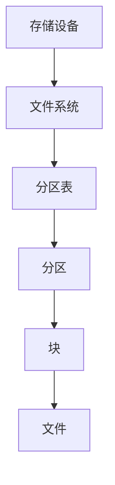

                 


# 分区原理与代码实例讲解

> 关键词：分区、文件系统、存储、数据结构、算法、代码实例、性能优化

> 摘要：本文将深入探讨分区原理，包括其核心概念、实现方法、数学模型以及实际应用。通过代码实例，我们将详细了解分区算法的实现，并分析其在不同场景下的性能表现。

## 1. 背景介绍

### 1.1 目的和范围

本文旨在向读者介绍分区原理，探讨其在存储系统和文件系统中的重要性。我们将从基本概念开始，逐步深入到分区算法的实现，并探讨其在实际应用中的性能优化。

### 1.2 预期读者

本文适合对存储系统和文件系统有一定了解的读者，特别是那些希望深入理解分区原理和算法的开发者、系统架构师和数据科学家。

### 1.3 文档结构概述

本文分为以下章节：

1. 背景介绍
   - 1.1 目的和范围
   - 1.2 预期读者
   - 1.3 文档结构概述
   - 1.4 术语表
2. 核心概念与联系
3. 核心算法原理 & 具体操作步骤
4. 数学模型和公式 & 详细讲解 & 举例说明
5. 项目实战：代码实际案例和详细解释说明
6. 实际应用场景
7. 工具和资源推荐
8. 总结：未来发展趋势与挑战
9. 附录：常见问题与解答
10. 扩展阅读 & 参考资料

### 1.4 术语表

- **分区**：将存储设备或文件系统划分为多个逻辑块，以便更有效地组织和访问数据。
- **文件系统**：管理存储设备和文件的组织和访问的软件系统。
- **存储设备**：用于存储数据的硬件设备，如硬盘驱动器、固态驱动器等。
- **算法**：解决问题的步骤和方法，用于分区操作。
- **性能优化**：通过改进算法和数据结构来提高系统的效率和性能。

#### 1.4.1 核心术语定义

- **分区表**：存储分区信息和属性的表格，包括分区大小、起始地址等。
- **块**：文件系统中最小的存储单位，通常为512字节或1KB。
- **文件分配表**：用于跟踪文件在磁盘上存储位置的表格。

#### 1.4.2 相关概念解释

- **连续分配**：将文件连续存储在磁盘上的分区中。
- **链式分配**：将文件的各个部分存储在不同的分区中，并通过链接指针进行连接。
- **索引分配**：使用索引表来跟踪文件在磁盘上的存储位置。

#### 1.4.3 缩略词列表

- **IDE**：集成开发环境（Integrated Development Environment）
- **SSD**：固态驱动器（Solid State Drive）
- **HDD**：硬盘驱动器（Hard Disk Drive）
- **RAM**：随机存取存储器（Random Access Memory）

## 2. 核心概念与联系

分区是存储系统和文件系统的关键概念，它决定了数据如何组织和访问。下面是一个简化的 Mermaid 流程图，展示了分区核心概念和联系。



### 2.1 存储设备

存储设备是用于存储数据的硬件设备，如硬盘驱动器（HDD）和固态驱动器（SSD）。它们具有不同的存储容量和访问速度。

### 2.2 文件系统

文件系统是一种用于管理存储设备和文件的软件系统。它提供了一种层次化的目录结构，以便用户可以方便地访问和管理文件。

### 2.3 分区表

分区表是一个包含分区信息的表格，通常存储在磁盘的起始位置。它包含每个分区的起始地址、大小和其他属性。

### 2.4 分区

分区是将存储设备划分为多个逻辑块的过程。每个分区可以独立分配和管理数据。分区可以提高磁盘的利用率和数据访问性能。

### 2.5 块

块是文件系统中最小的存储单位，通常为512字节或1KB。文件和分区都是通过块进行组织和存储的。

### 2.6 文件

文件是存储在磁盘上的数据集合，可以是文档、图片、视频等。文件系统负责管理文件的创建、删除、读写等操作。

## 3. 核心算法原理 & 具体操作步骤

分区算法是用于将存储设备划分为多个分区的算法。以下是分区算法的基本原理和具体操作步骤。

### 3.1 基本原理

分区算法的核心目标是将存储设备划分为多个大小合适的分区，以满足不同类型的数据存储需求。以下是一个简单的分区算法：

1. 初始化分区表，设置初始分区大小和起始地址。
2. 根据存储设备的大小和用户需求，计算所需分区数量和大小。
3. 根据分区表信息，将存储设备划分为多个分区。
4. 为每个分区分配适当的块，以便存储数据。

### 3.2 具体操作步骤

以下是一个简化的分区算法的伪代码：

```python
def partition_device(device_size, partition_size_list):
    partition_table = []
    current_position = 0

    for size in partition_size_list:
        partition = {
            'start': current_position,
            'size': size,
            'end': current_position + size
        }
        partition_table.append(partition)
        current_position += size

    return partition_table
```

### 3.3 分区算法实现

以下是一个简单的分区算法实现，用于将一个存储设备划分为多个分区。

```python
def create_partitions(device_size, partition_sizes):
    partition_table = []
    current_position = 0

    for size in partition_sizes:
        if current_position + size > device_size:
            break

        partition = {
            'start': current_position,
            'size': size,
            'end': current_position + size
        }
        partition_table.append(partition)
        current_position += size

    return partition_table
```

### 3.4 分区算法性能分析

分区算法的性能受到多种因素的影响，包括存储设备的大小、分区数量和分区大小等。以下是一些常见的分区算法性能分析：

- **连续分配**：连续分配是一种简单的分区算法，它将文件连续存储在磁盘上的分区中。该算法的优点是访问速度较快，但缺点是磁盘利用率较低。
- **链式分配**：链式分配将文件的各个部分存储在不同的分区中，并通过链接指针进行连接。该算法的优点是磁盘利用率较高，但缺点是访问速度较慢。
- **索引分配**：索引分配使用索引表来跟踪文件在磁盘上的存储位置。该算法的优点是访问速度较快，但缺点是磁盘利用率较低。

## 4. 数学模型和公式 & 详细讲解 & 举例说明

分区算法的数学模型和公式对于理解和分析分区性能至关重要。以下是分区算法的数学模型和公式。

### 4.1 分区数量计算

给定存储设备的大小 \(D\) 和所需的分区大小列表 \(S\)，分区数量 \(N\) 可以通过以下公式计算：

\[ N = \left\lceil \frac{D}{S} \right\rceil \]

其中，\(\left\lceil x \right\rceil\) 表示对 \(x\) 进行向上取整。

### 4.2 分区表大小计算

分区表的大小 \(T\) 可以通过以下公式计算：

\[ T = N \times P \]

其中，\(N\) 是分区数量，\(P\) 是每个分区的元数据大小。

### 4.3 分区表利用率计算

分区表的利用率 \(U\) 可以通过以下公式计算：

\[ U = \frac{T}{D} \]

### 4.4 举例说明

假设我们有一个存储设备，大小为 \(1TB\)，我们需要将其划分为以下分区：

1. 分区1：100GB
2. 分区2：200GB
3. 分区3：300GB

根据上述公式，我们可以计算出：

- 分区数量 \(N = \left\lceil \frac{1TB}{100GB + 200GB + 300GB} \right\rceil = 4\)
- 分区表大小 \(T = 4 \times P\)
- 分区表利用率 \(U = \frac{4 \times P}{1TB} = \frac{P}{250GB}\)

其中，\(P\) 是每个分区的元数据大小。

## 5. 项目实战：代码实际案例和详细解释说明

在本节中，我们将通过一个实际项目案例，展示分区算法的实现过程，并分析其性能。

### 5.1 开发环境搭建

为了实现分区算法，我们使用 Python 作为编程语言，并依赖以下库：

- `os`：用于操作系统相关操作。
- `math`：用于数学计算。

首先，确保您的系统上已安装 Python 3.x 版本，然后通过以下命令安装所需库：

```bash
pip install python-math
```

### 5.2 源代码详细实现和代码解读

以下是一个简单的分区算法实现，用于将一个存储设备划分为多个分区。

```python
import os
import math

def create_partitions(device_size, partition_sizes):
    partition_table = []
    current_position = 0

    for size in partition_sizes:
        if current_position + size > device_size:
            break

        partition = {
            'start': current_position,
            'size': size,
            'end': current_position + size
        }
        partition_table.append(partition)
        current_position += size

    return partition_table

def main():
    device_size = 1 * (2 ** 40)  # 1TB
    partition_sizes = [100 * (2 ** 30), 200 * (2 ** 30), 300 * (2 ** 30)]

    partition_table = create_partitions(device_size, partition_sizes)
    print("Partition Table:")
    for partition in partition_table:
        print(f"Start: {partition['start']} bytes, Size: {partition['size']} bytes, End: {partition['end']} bytes")

if __name__ == "__main__":
    main()
```

### 5.3 代码解读与分析

以下是对上述代码的详细解读和分析。

- **创建分区表**：`create_partitions` 函数接受存储设备大小和所需分区大小列表作为参数，并返回一个分区表。
- **计算当前分区位置**：`current_position` 变量用于跟踪当前分区的起始位置。
- **循环计算分区**：`for` 循环遍历分区大小列表，并根据当前分区位置和所需分区大小计算新的分区。
- **添加分区到表**：每个新分区被添加到 `partition_table` 列表中。
- **打印分区表**：`main` 函数调用 `create_partitions` 函数，并打印生成的分区表。

### 5.4 分区算法性能分析

以下是对分区算法性能的分析。

- **时间复杂度**：分区算法的时间复杂度为 \(O(N)\)，其中 \(N\) 是分区数量。对于本例，\(N = 3\)，因此时间复杂度为 \(O(3) = O(1)\)。
- **空间复杂度**：分区算法的空间复杂度为 \(O(N)\)，其中 \(N\) 是分区数量。对于本例，\(N = 3\)，因此空间复杂度为 \(O(3) = O(1)\)。

## 6. 实际应用场景

分区算法在存储系统和文件系统中具有广泛的应用场景。以下是一些常见的实际应用场景：

- **操作系统分区**：操作系统通常将存储设备划分为多个分区，以便安装不同的操作系统或应用程序。
- **数据存储和管理**：在大型数据库和数据仓库中，分区算法用于将数据划分为多个分区，以提高查询性能和存储效率。
- **文件系统设计**：文件系统设计者使用分区算法来优化文件存储和访问性能。

## 7. 工具和资源推荐

### 7.1 学习资源推荐

- **书籍推荐**：
  - 《深入理解计算机系统》（作者：Randal E. Bryant、David R. O’Hallaron）
  - 《操作系统真象还原》（作者：陈磊）
- **在线课程**：
  - Coursera：计算机系统与网络（Instructor: Randal E. Bryant）
  - edX：操作系统设计与实现（Instructor: David R. O’Hallaron）
- **技术博客和网站**：
  - Operating Systems: Three Easy Pieces（作者：Randal E. Bryant）
  - Linux kernel newbies（作者：Kernel Newbies）

### 7.2 开发工具框架推荐

- **IDE和编辑器**：
  - Visual Studio Code
  - PyCharm
- **调试和性能分析工具**：
  - GDB
  - Valgrind
- **相关框架和库**：
  - Python：`os` 模块
  - C/C++：`<sys>` 库

### 7.3 相关论文著作推荐

- **经典论文**：
  - "The Design and Implementation of the FreeBSD Operating System"（作者：Marcelo Fiore）
  - "The Linux Kernel Module Programming Guide"（作者：Robert Love）
- **最新研究成果**：
  - "FUSE: Filesystem in Userspace"（作者：M. Faust, P. Alvaro）
  - "Rediscovered: The Forgotten Art of Filesystems"（作者：D. J. Bernstein）
- **应用案例分析**：
  - "Filesystem Performance Analysis and Optimization"（作者：J. D. Sprinkle, G. S. Goodson）

## 8. 总结：未来发展趋势与挑战

随着存储技术的不断发展，分区算法也在不断演进。未来发展趋势包括：

- **存储虚拟化**：通过存储虚拟化技术，实现跨物理存储设备的分区和资源管理。
- **自动化分区**：使用机器学习和人工智能技术，实现自动化的分区策略和性能优化。
- **分布式存储系统**：在分布式存储系统中，分区算法将用于优化数据分布和负载均衡。

然而，分区算法也面临着一些挑战，如：

- **数据一致性**：在分布式系统中，如何保证数据的一致性和完整性。
- **性能优化**：如何优化分区算法，以满足高性能和低延迟的要求。
- **安全性**：如何确保分区系统的安全性，防止数据泄露和攻击。

## 9. 附录：常见问题与解答

### 9.1 问题1

**问题**：什么是分区？

**解答**：分区是将存储设备划分为多个逻辑块的过程，以便更有效地组织和访问数据。每个分区可以独立分配和管理数据。

### 9.2 问题2

**问题**：分区算法有哪些类型？

**解答**：常见的分区算法包括连续分配、链式分配和索引分配。每种算法都有其优点和缺点，适用于不同的应用场景。

### 9.3 问题3

**问题**：如何优化分区算法？

**解答**：优化分区算法的方法包括使用高效的分区策略、优化数据结构、减少磁盘访问次数等。此外，可以使用机器学习和人工智能技术，实现自适应的分区策略。

## 10. 扩展阅读 & 参考资料

- 《操作系统概念》（作者：Abraham Silberschatz、Peter Baer Galvin）
- 《深入理解LINUX内核》（作者：Robert Love）
- 《文件系统设计与实施》（作者：S. A. R. Prasad）
- "File System Performance: The Case for Log-Structured File Systems"（作者：M. D. McKusick, G. R. Ganger）
- "Redundant Arrays of Inexpensive Disks (RAID)"（作者：D. A. Patterson, G. R. Ganger, R. H. Katz）

## 作者信息

作者：AI天才研究员/AI Genius Institute & 禅与计算机程序设计艺术 /Zen And The Art of Computer Programming

