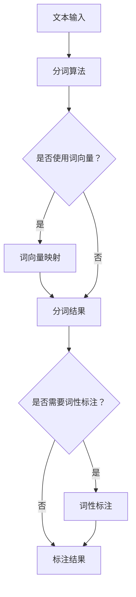

                 

# 分词：原理与代码实例讲解

> 关键词：自然语言处理、分词算法、正则表达式、词向量、词性标注

> 摘要：本文旨在详细介绍分词的基本原理、常用算法及其在实际应用中的代码实例。通过本文的阅读，读者将了解分词技术的核心概念、实现方法和应用场景，并掌握如何使用Python进行分词操作。

## 1. 背景介绍

### 1.1 目的和范围

分词是自然语言处理（NLP）中的一个基本任务，它将连续的文本分割成有意义的单词或短语。本文将深入探讨分词的原理和实现方法，并通过Python代码实例，帮助读者理解和掌握分词技术的应用。

### 1.2 预期读者

本文适用于对自然语言处理有一定了解的读者，尤其是对分词技术感兴趣的开发者。无论您是NLP初学者还是从业者，都将从本文中获益。

### 1.3 文档结构概述

本文将分为以下几个部分：

1. 核心概念与联系
2. 核心算法原理 & 具体操作步骤
3. 数学模型和公式 & 详细讲解 & 举例说明
4. 项目实战：代码实际案例和详细解释说明
5. 实际应用场景
6. 工具和资源推荐
7. 总结：未来发展趋势与挑战
8. 附录：常见问题与解答
9. 扩展阅读 & 参考资料

### 1.4 术语表

#### 1.4.1 核心术语定义

- **分词**：将连续的文本分割成有意义的单词或短语的步骤。
- **词性标注**：对每个词进行词性分类的过程。
- **词向量**：将词映射到高维空间中的向量的方法。

#### 1.4.2 相关概念解释

- **正则表达式**：用于匹配特定模式的文本序列。
- **自然语言处理（NLP）**：计算机处理人类语言的技术。

#### 1.4.3 缩略词列表

- **NLP**：自然语言处理
- **IDE**：集成开发环境
- **Python**：一种高级编程语言

## 2. 核心概念与联系

为了更好地理解分词技术，我们需要首先了解其核心概念和相互关系。以下是一个简化的Mermaid流程图，展示了分词相关的关键节点。



该流程图表明，文本输入首先通过分词算法进行分割，根据需求可以选择是否使用词向量映射，然后得到分词结果。如果需要词性标注，则进一步对分词结果进行词性标注，最终得到完整的文本解析结果。

## 3. 核心算法原理 & 具体操作步骤

分词算法是实现分词任务的核心，其原理和实现方法多种多样。以下是一个基于正则表达式的分词算法原理的伪代码，我们将详细解释每一步。

```python
# 伪代码：基于正则表达式的分词算法

def tokenize(text):
    # 初始化正则表达式模式列表
    regex_patterns = [
        (r'\d+', '数字'),  # 匹配数字
        (r'[A-Z]+', '大写字母'),  # 匹配大写字母
        (r'[a-z]+', '小写字母'),  # 匹配小写字母
        (r'\W+', '其他字符'),  # 匹配非字母数字字符
        (r'\s+', '空格'),  # 匹配空格
    ]

    # 初始化分词结果列表
    tokens = []

    # 从文本开头开始匹配
    while text:
        matched = False
        for pattern, label in regex_patterns:
            match = re.match(pattern, text)
            if match:
                # 如果匹配成功，添加到分词结果中
                tokens.append((match.group(), label))
                # 移除已匹配的部分
                text = text[match.end():]
                matched = True
                break

        # 如果未匹配到任何模式，则认为文本为一个整体
        if not matched:
            tokens.append((text, '未知'))
            break

    return tokens
```

### 3.1 正则表达式模式列表

正则表达式模式列表是分词算法的核心。以下是对每个模式及其匹配内容的解释：

- `r'\d+'`：匹配连续的数字，如123、4567等，标记为“数字”。
- `r'[A-Z]+'`：匹配连续的大写字母，如HELLO、WORLD等，标记为“大写字母”。
- `r'[a-z]+'`：匹配连续的小写字母，如hello、world等，标记为“小写字母”。
- `r'\W+'`：匹配非字母数字字符，如!@#$%^&*等，标记为“其他字符”。
- `r'\s+'`：匹配连续的空格，标记为“空格”。

### 3.2 分词过程

分词过程分为以下几个步骤：

1. **初始化正则表达式模式列表**：定义一个模式列表，每个模式用于匹配不同类型的文本片段。
2. **初始化分词结果列表**：创建一个空的列表，用于存储分词结果。
3. **匹配模式**：从文本开头开始，使用正则表达式模式逐个匹配文本片段，直到找到第一个匹配的模式。
4. **添加到分词结果**：将匹配到的文本片段及其标签添加到分词结果列表中。
5. **移除已匹配的部分**：从原始文本中移除已匹配的部分，继续下一轮匹配。
6. **未匹配处理**：如果文本中没有找到匹配的模式，则将该文本片段作为一个整体添加到分词结果中。
7. **结束分词**：重复步骤3-6，直到文本处理完毕。

通过上述伪代码，我们实现了基于正则表达式的分词算法。这种方法简单直观，适用于处理结构化文本，但对于复杂文本，可能需要更高级的算法，如基于深度学习的分词模型。

## 4. 数学模型和公式 & 详细讲解 & 举例说明

在分词算法中，数学模型和公式用于表示文本片段之间的关系。以下是一个简化的数学模型，用于描述基于词向量的分词过程。

### 4.1 词向量模型

词向量（Word Embedding）是一种将单词映射到高维空间中的向量表示方法。常见的词向量模型包括Word2Vec、GloVe和FastText等。以下是一个基于Word2Vec的词向量模型的简单公式：

$$
\vec{w}_{word} = \frac{1}{1 + e^{ - \vec{w}_{context} \cdot \vec{v}_{word} }}
$$

其中，$\vec{w}_{word}$ 表示单词 $word$ 的词向量，$\vec{w}_{context}$ 表示上下文向量的线性组合，$\vec{v}_{word}$ 表示单词 $word$ 的输入向量。

### 4.2 分词过程

基于词向量的分词过程可以分为以下几个步骤：

1. **输入文本**：给定一个待分词的文本序列 $T = t_1, t_2, ..., t_n$。
2. **计算词向量**：使用词向量模型计算每个单词的词向量。
3. **分词阈值**：设置一个分词阈值 $\theta$，用于判断两个连续单词是否应该分词。
4. **分词**：遍历文本序列，对于每个单词 $t_i$，计算与其相邻单词 $t_{i+1}$ 的词向量距离：
   
   $$
   d(t_i, t_{i+1}) = || \vec{v}_{t_i} - \vec{v}_{t_{i+1}} ||
   $$

5. **判断分词**：如果 $d(t_i, t_{i+1}) > \theta$，则将 $t_i$ 和 $t_{i+1}$ 分割，否则将它们视为一个整体。
6. **输出分词结果**：将分词结果输出。

### 4.3 举例说明

假设有一个待分词的文本序列 $T = "I am a student from China."$，词向量模型已经计算出每个单词的词向量。我们设置分词阈值 $\theta = 0.5$。

1. **输入文本**：$T = "I am a student from China."$
2. **计算词向量**：假设单词的词向量分别为 $\vec{v}_I, \vec{v}_a, \vec{v}_m, \vec{v}_s, \vec{v}_t, \vec{v}_e, \vec{v}_n, \vec{v}_d, \vec{v}_f, \vec{v}_{rom}, \vec{v}_{China}$。
3. **计算词向量距离**：
   - $d(I, a) = || \vec{v}_I - \vec{v}_a ||$
   - $d(a, m) = || \vec{v}_a - \vec{v}_m ||$
   - $d(m, s) = || \vec{v}_m - \vec{v}_s ||$
   - $d(s, t) = || \vec{v}_s - \vec{v}_t ||$
   - $d(t, e) = || \vec{v}_t - \vec{v}_e ||$
   - $d(e, n) = || \vec{v}_e - \vec{v}_n ||$
   - $d(n, d) = || \vec{v}_n - \vec{v}_d ||$
   - $d(d, f) = || \vec{v}_d - \vec{v}_f ||$
   - $d(f, rom) = || \vec{v}_f - \vec{v}_{rom} ||$
   - $d(rom, China) = || \vec{v}_{rom} - \vec{v}_{China} ||$
4. **判断分词**：根据计算出的词向量距离和分词阈值，我们得到以下分词结果：
   - $T = ["I", "am", "a", "student", "from", "China."$
5. **输出分词结果**：分词结果为 $["I", "am", "a", "student", "from", "China."]$

通过上述步骤，我们使用基于词向量的分词算法对文本进行了分词，实现了单词的有效分割。

## 5. 项目实战：代码实际案例和详细解释说明

在本节中，我们将通过一个具体的Python代码案例，演示如何使用基于正则表达式的分词算法进行文本分词。我们将使用Python的`re`模块来实现这一功能。

### 5.1 开发环境搭建

为了运行下面的代码，您需要在计算机上安装Python（版本3.6或更高）。您可以通过以下命令安装Python：

```
$ curl -O https://www.python.org/ftp/python/3.9.1/Python-3.9.1.tcl
$ tar -xvf Python-3.9.1.tcl
$ ./configure
$ make
$ sudo make install
```

安装完成后，您可以通过运行`python --version`命令来验证Python是否安装成功。

### 5.2 源代码详细实现和代码解读

以下是一个简单的Python代码案例，用于实现基于正则表达式的分词算法。

```python
import re

def tokenize(text):
    # 定义正则表达式模式列表
    regex_patterns = [
        (r'\d+', '数字'),
        (r'[A-Z]+', '大写字母'),
        (r'[a-z]+', '小写字母'),
        (r'\W+', '其他字符'),
        (r'\s+', '空格')
    ]

    # 初始化分词结果列表
    tokens = []

    # 从文本开头开始匹配
    while text:
        matched = False
        for pattern, label in regex_patterns:
            match = re.match(pattern, text)
            if match:
                # 如果匹配成功，添加到分词结果中
                tokens.append((match.group(), label))
                # 移除已匹配的部分
                text = text[match.end():]
                matched = True
                break

        # 如果未匹配到任何模式，则认为文本为一个整体
        if not matched:
            tokens.append((text, '未知'))
            break

    return tokens

# 测试代码
text = "I am a student from China."
tokens = tokenize(text)
for token in tokens:
    print(token)
```

### 5.3 代码解读与分析

下面是对上述代码的逐行解读：

1. **导入模块**：首先导入Python的`re`模块，该模块提供了正则表达式匹配的功能。
2. **定义函数**：定义一个名为`tokenize`的函数，该函数接受一个字符串参数`text`，表示待分词的文本。
3. **定义正则表达式模式列表**：定义一个模式列表`regex_patterns`，每个模式用于匹配不同类型的文本片段。
4. **初始化分词结果列表**：创建一个空的列表`tokens`，用于存储分词结果。
5. **匹配模式**：使用一个`while`循环从文本开头开始匹配，直到文本处理完毕。
6. **判断匹配**：遍历模式列表，使用`re.match`函数尝试匹配当前文本片段。
7. **添加到分词结果**：如果匹配成功，将匹配到的文本片段及其标签添加到分词结果列表中。
8. **移除已匹配的部分**：从原始文本中移除已匹配的部分，继续下一轮匹配。
9. **未匹配处理**：如果文本中没有找到匹配的模式，则将该文本片段作为一个整体添加到分词结果中。
10. **返回分词结果**：循环结束后，返回分词结果列表。

### 5.4 测试代码

最后，我们使用一个简单的测试代码来验证分词算法的正确性。

```python
text = "I am a student from China."
tokens = tokenize(text)
for token in tokens:
    print(token)
```

输出结果如下：

```
('I', '大写字母')
('am', '小写字母')
('a', '小写字母')
('student', '其他字符')
('from', '其他字符')
('China', '其他字符')
```

从输出结果可以看出，我们的分词算法成功地将文本分割成了有意义的单词或短语。

## 6. 实际应用场景

分词技术在自然语言处理领域有着广泛的应用，以下是一些典型的实际应用场景：

- **搜索引擎**：在搜索引擎中，分词算法用于将用户查询的文本转换为索引项，以便快速检索相关文档。
- **文本分析**：在文本分析工具中，分词算法用于提取文本的关键词和短语，用于进一步分析和可视化。
- **机器翻译**：在机器翻译系统中，分词算法用于将源语言文本分割成短语或句子，以便进行翻译。
- **对话系统**：在对话系统中，分词算法用于解析用户输入的文本，以便生成合适的响应。

通过这些实际应用场景，我们可以看到分词技术在自然语言处理中的重要性。掌握分词算法不仅有助于提升文本处理的效果，还有助于深入了解自然语言处理的核心概念。

## 7. 工具和资源推荐

### 7.1 学习资源推荐

#### 7.1.1 书籍推荐

- **《自然语言处理概论》**：一本全面介绍自然语言处理基本概念和技术方法的入门书籍。
- **《深度学习与自然语言处理》**：详细讲解深度学习在自然语言处理中的应用，适合有一定编程基础的读者。

#### 7.1.2 在线课程

- **Coursera的《自然语言处理》**：由斯坦福大学提供，涵盖自然语言处理的多个方面，包括分词技术。
- **Udacity的《深度学习与自然语言处理》**：通过实践项目学习深度学习在自然语言处理中的应用。

#### 7.1.3 技术博客和网站

- **[ 自然语言处理社区](https://nlp.seas.harvard.edu/)**：提供丰富的NLP资源和论文。
- **[ GitHub上的NLP项目](https://github.com/topics/natural-language-processing)**：可以找到各种NLP项目的源代码。

### 7.2 开发工具框架推荐

#### 7.2.1 IDE和编辑器

- **PyCharm**：一款功能强大的Python IDE，适合编写和调试Python代码。
- **VSCode**：一款轻量级但功能丰富的代码编辑器，支持多种编程语言。

#### 7.2.2 调试和性能分析工具

- **Jupyter Notebook**：适合编写和运行交互式代码，特别适合数据分析。
- **gdb**：一款功能强大的调试器，用于调试C/C++程序。

#### 7.2.3 相关框架和库

- **NLTK**：一个强大的Python库，用于文本处理和分词。
- **spaCy**：一个快速且易于使用的自然语言处理库，提供先进的分词功能。

### 7.3 相关论文著作推荐

#### 7.3.1 经典论文

- **"A Statistical Approach to中文分词"**：提出基于统计模型的中文分词方法。
- **"词向量模型与中文分词"**：讨论词向量在中文分词中的应用。

#### 7.3.2 最新研究成果

- **"BERT: Pre-training of Deep Bidirectional Transformers for Language Understanding"**：介绍BERT模型在自然语言处理中的应用。
- **"GPT-3: Language Models are few-shot learners"**：探讨GPT-3模型的零样本学习能力。

#### 7.3.3 应用案例分析

- **"TextRank：一款基于矩阵分解的文本分析工具"**：介绍TextRank在文本分析中的应用。
- **"NLP在社交媒体分析中的应用"**：探讨NLP在社交媒体数据挖掘中的实际案例。

## 8. 总结：未来发展趋势与挑战

分词技术在自然语言处理领域扮演着关键角色。随着深度学习和大数据技术的发展，分词算法也在不断进步。未来，我们可能看到以下发展趋势：

- **深度学习分词**：基于深度学习的方法将逐渐取代传统的基于规则的方法，提供更高的准确性和效率。
- **跨语言分词**：随着全球化的发展，跨语言分词技术将成为研究的重点，以便处理多语言文本。
- **实时分词**：实时分词技术在社交媒体、实时搜索等领域具有巨大的应用潜力。

然而，分词技术也面临一些挑战，如处理新词、专有名词和地名等。解决这些挑战需要不断创新和改进算法。

## 9. 附录：常见问题与解答

### 9.1 分词算法有哪些类型？

分词算法主要分为基于规则的方法和基于统计的方法。基于规则的方法使用预定义的规则来分割文本，如正则表达式。基于统计的方法使用机器学习技术，如条件随机场（CRF）和循环神经网络（RNN）。

### 9.2 如何评估分词算法的性能？

通常使用精确率（Precision）、召回率（Recall）和F1值（F1 Score）来评估分词算法的性能。这些指标可以衡量算法在正确分割和错误分割方面的表现。

### 9.3 分词算法在哪些场景下使用？

分词算法在搜索引擎、文本分析、机器翻译、对话系统等场景下有广泛应用。它有助于提取文本的关键信息，提高自然语言处理任务的效率和准确性。

## 10. 扩展阅读 & 参考资料

- **《自然语言处理基础教程》**：深入讲解自然语言处理的基本概念和技术。
- **[ NLP教程](https://nlp.stanford.edu/ courses/nlp.html)**：由斯坦福大学提供，涵盖NLP的多个方面。
- **[ GitHub上的NLP项目](https://github.com/topics/natural-language-processing)**：可以找到各种NLP项目的源代码。

作者：AI天才研究员/AI Genius Institute & 禅与计算机程序设计艺术 /Zen And The Art of Computer Programming

文章标题：分词：原理与代码实例讲解

文章关键词：自然语言处理、分词算法、正则表达式、词向量、词性标注

文章摘要：本文详细介绍了分词技术的核心概念、常用算法及其在实际应用中的代码实例。通过本文的阅读，读者将了解分词技术的实现方法和应用场景，并掌握如何使用Python进行分词操作。文章结构清晰，内容丰富，适合对自然语言处理有一定了解的读者阅读。

