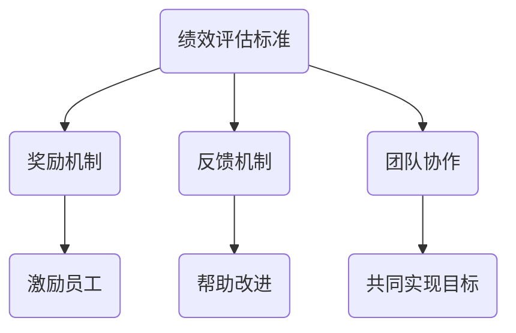

                 

# 创业公司如何设计有效的绩效考核和激励机制

> **关键词**：绩效考核，激励机制，创业公司，人才管理，目标设定，奖励机制，反馈机制，团队协作

> **摘要**：本文将探讨创业公司如何设计有效的绩效考核和激励机制，以激发员工的积极性、提高团队效率和实现公司目标。我们将从背景介绍、核心概念与联系、核心算法原理与具体操作步骤、数学模型与公式、项目实战、实际应用场景、工具和资源推荐等方面进行详细阐述，帮助创业公司构建起一套科学、合理的绩效管理体系。

## 1. 背景介绍

### 1.1 目的和范围

在创业公司中，人才的培养和激励至关重要。本文旨在为创业公司提供一套有效的绩效考核和激励机制设计方法，帮助公司管理者更好地了解员工表现、激发员工潜力，从而实现公司目标。

本文将涵盖以下内容：

1. 核心概念与联系
2. 核心算法原理与具体操作步骤
3. 数学模型与公式
4. 项目实战：代码实际案例和详细解释说明
5. 实际应用场景
6. 工具和资源推荐
7. 总结：未来发展趋势与挑战

### 1.2 预期读者

本文适用于创业公司的管理者、人力资源从业者、以及关注人才管理的专业人士。希望读者能够通过本文，掌握绩效考核和激励机制设计的方法和技巧。

### 1.3 文档结构概述

本文将按照以下结构进行阐述：

1. 背景介绍
2. 核心概念与联系
3. 核心算法原理与具体操作步骤
4. 数学模型与公式
5. 项目实战：代码实际案例和详细解释说明
6. 实际应用场景
7. 工具和资源推荐
8. 总结：未来发展趋势与挑战

### 1.4 术语表

#### 1.4.1 核心术语定义

- **绩效考核**：通过对员工的工作表现进行评估，以确定员工的工作成绩、能力和潜力。
- **激励机制**：通过奖励、晋升、培训等方式激发员工的积极性，提高员工的工作效率。
- **KPI**（关键绩效指标）：用于衡量员工在工作中的关键绩效指标，通常与公司目标密切相关。
- **OKR**（目标与关键结果）：一种目标管理方法，通过设定明确的目标和关键结果，帮助团队和个人更好地实现目标。

#### 1.4.2 相关概念解释

- **目标设定**：在绩效考核和激励机制设计中，明确员工的工作目标和期望成果。
- **反馈机制**：对员工的工作表现进行及时反馈，帮助员工了解自己的优缺点，促进个人成长。
- **团队协作**：通过团队成员之间的协作，共同实现公司目标。

#### 1.4.3 缩略词列表

- KPI：关键绩效指标
- OKR：目标与关键结果

## 2. 核心概念与联系

在设计绩效考核和激励机制时，我们需要关注以下几个核心概念：

1. **绩效评估标准**：确定评估员工工作表现的标准，通常包括工作量、质量、效率、创新能力等方面。
2. **奖励机制**：根据绩效评估结果，给予员工相应的奖励，如奖金、晋升、培训等。
3. **反馈机制**：对员工的工作表现进行及时反馈，帮助员工了解自己的优缺点，制定改进计划。
4. **团队协作**：鼓励团队成员之间的合作，共同实现公司目标。

以下是一个简化的 Mermaid 流程图，展示了这些核心概念之间的联系：



通过以上核心概念的联系，我们可以构建一个科学、合理的绩效考核和激励机制，从而提高员工的工作积极性、提升团队效率，最终实现公司目标。

## 3. 核心算法原理 & 具体操作步骤

### 3.1 绩效评估标准

在绩效考核中，我们需要确定一个科学的绩效评估标准。以下是一个简单的绩效评估标准算法原理：

```pseudo
算法：绩效评估标准
输入：员工工作表现数据
输出：绩效评估结果

步骤：
1. 收集员工工作表现数据，包括工作量、质量、效率、创新能力等。
2. 对每个指标设置权重，权重之和为1。
3. 计算每个指标的得分，公式为：得分 = 数据值 × 权重。
4. 将所有指标的得分相加，得到总得分。
5. 根据总得分，划分绩效等级，如优秀、良好、一般、较差等。

伪代码：
function 绩效评估标准(工作表现数据):
    权重集 = [0.3, 0.3, 0.2, 0.2]  # 各指标权重
    总得分 = 0

    for 指标 in 工作表现数据:
        得分 = 指标数据值 × 权重
        总得分 += 得分

    绩效等级 = 划分绩效等级(总得分)
    return 绩效等级
```

### 3.2 奖励机制

根据绩效评估结果，我们可以设计一个奖励机制。以下是一个简单的奖励机制算法原理：

```pseudo
算法：奖励机制
输入：绩效评估结果
输出：奖励结果

步骤：
1. 根据绩效评估结果，确定奖励等级，如优秀、良好、一般等。
2. 为每个奖励等级设置相应的奖励，如奖金、晋升、培训等。
3. 根据员工所在的奖励等级，给予相应的奖励。

伪代码：
function 奖励机制(绩效评估结果):
    奖励等级 = 绩效评估结果
    奖励结果 = ""

    if 奖励等级 == "优秀":
        奖励结果 = "奖金 + 晋升 + 培训"
    else if 奖励等级 == "良好":
        奖励结果 = "奖金 + 培训"
    else if 奖励等级 == "一般":
        奖励结果 = "培训"

    return 奖励结果
```

### 3.3 反馈机制

为了帮助员工了解自己的工作表现，我们需要设计一个反馈机制。以下是一个简单的反馈机制算法原理：

```pseudo
算法：反馈机制
输入：绩效评估结果
输出：反馈结果

步骤：
1. 根据绩效评估结果，生成一份详细的反馈报告。
2. 将反馈报告发送给员工，帮助员工了解自己的优点和不足。
3. 鼓励员工根据反馈报告，制定改进计划。

伪代码：
function 反馈机制(绩效评估结果):
    反馈报告 = ""

    if 绩效评估结果 == "优秀":
        反馈报告 = "表现优秀，继续保持！"
    else if 绩效评估结果 == "良好":
        反馈报告 = "表现良好，但仍有提升空间，请参考以下建议："
        反馈报告 += "1. 提高工作效率；2. 加强与团队成员的沟通；3. 提升创新能力。"
    else if 绩效评估结果 == "一般":
        反馈报告 = "表现一般，建议加强与团队成员的沟通，提高工作效率。"

    return 反馈报告
```

通过以上核心算法原理和具体操作步骤，我们可以为创业公司设计出一套科学、合理的绩效考核和激励机制，从而提高员工的工作积极性、提升团队效率，实现公司目标。

## 4. 数学模型和公式 & 详细讲解 & 举例说明

在设计绩效考核和激励机制时，数学模型和公式可以帮助我们更好地量化评估员工的表现和激励效果。以下我们将介绍几个常用的数学模型和公式，并对其进行详细讲解和举例说明。

### 4.1 神经网络模型

神经网络模型是一种用于建模复杂非线性关系的数学模型。在绩效考核和激励机制中，我们可以使用神经网络模型来预测员工的工作表现，从而为奖励机制提供依据。

#### 4.1.1 模型原理

神经网络模型由多个神经元组成，每个神经元接受多个输入信号，通过加权求和后，经过激活函数产生输出信号。模型的核心公式如下：

$$
y = \sigma(\sum_{i=1}^{n} w_i \cdot x_i)
$$

其中，$y$ 为输出信号，$\sigma$ 为激活函数（常用的激活函数有 sigmoid、ReLU 等），$w_i$ 为输入信号的权重，$x_i$ 为输入信号。

#### 4.1.2 模型训练

神经网络模型的训练过程包括以下步骤：

1. **初始化权重**：随机初始化模型中的权重。
2. **前向传播**：计算输入信号经过神经网络后的输出信号。
3. **计算损失**：计算输出信号与实际值之间的差距，使用损失函数（如均方误差、交叉熵等）表示。
4. **反向传播**：根据损失函数，调整模型中的权重，使得输出信号更接近实际值。
5. **迭代优化**：重复步骤 2-4，直到模型收敛。

#### 4.1.3 举例说明

假设我们使用一个简单的神经网络模型来预测员工的工作表现。输入信号包括工作量、工作效率、创新能力等指标，输出信号为绩效评估结果。我们使用均方误差（MSE）作为损失函数。

```latex
\text{损失函数} = \frac{1}{2} \sum_{i=1}^{n} (\hat{y}_i - y_i)^2
```

其中，$\hat{y}_i$ 为预测的绩效评估结果，$y_i$ 为实际的绩效评估结果。

通过训练模型，我们可以得到一个权重向量 $w = [w_1, w_2, ..., w_n]$，用于评估员工的工作表现。

### 4.2 决策树模型

决策树模型是一种用于分类和回归的数学模型。在绩效考核和激励机制中，我们可以使用决策树模型来划分绩效等级，为奖励机制提供参考。

#### 4.2.1 模型原理

决策树模型通过一系列的判断条件，将数据集划分成多个子集，每个子集对应一个特定的绩效等级。模型的核心公式如下：

$$
C = f(x)
$$

其中，$C$ 为绩效等级，$f(x)$ 为决策函数。

决策函数通常由多个条件语句组成，例如：

```pseudo
if x > threshold1:
    C = "优秀"
else if x > threshold2:
    C = "良好"
else if x > threshold3:
    C = "一般"
else:
    C = "较差"
```

#### 4.2.2 模型训练

决策树模型的训练过程包括以下步骤：

1. **选择特征**：根据特征的重要性选择训练数据集中的特征。
2. **计算阈值**：根据特征和目标值，计算每个特征的阈值。
3. **划分数据集**：根据阈值，将数据集划分成多个子集。
4. **计算绩效等级**：根据子集的目标值，计算每个子集的绩效等级。
5. **迭代优化**：重复步骤 2-4，直到模型收敛。

#### 4.2.3 举例说明

假设我们使用一个简单的决策树模型来划分绩效等级。输入信号包括工作量、工作效率、创新能力等指标，输出信号为绩效等级。

```pseudo
if 工作量 > 100:
    if 工作效率 > 0.8:
        if 创新能力 > 0.6:
            绩效等级 = "优秀"
        else:
            绩效等级 = "良好"
    else:
        绩效等级 = "一般"
else:
    绩效等级 = "较差"
```

通过训练模型，我们可以得到一个划分规则，用于评估员工的工作表现。

### 4.3 贝叶斯模型

贝叶斯模型是一种基于概率论的数学模型。在绩效考核和激励机制中，我们可以使用贝叶斯模型来计算员工表现的概率分布，为奖励机制提供参考。

#### 4.3.1 模型原理

贝叶斯模型通过计算先验概率和条件概率，得到后验概率。模型的核心公式如下：

$$
P(C|X) = \frac{P(X|C) \cdot P(C)}{P(X)}
$$

其中，$C$ 为绩效等级，$X$ 为员工工作表现的特征。

先验概率 $P(C)$ 表示员工在某个绩效等级的概率，条件概率 $P(X|C)$ 表示员工在某个绩效等级下表现出某个特征的概率，后验概率 $P(C|X)$ 表示员工在某个工作表现特征下处于某个绩效等级的概率。

#### 4.3.2 模型训练

贝叶斯模型的训练过程包括以下步骤：

1. **收集数据**：收集员工工作表现和绩效等级的数据。
2. **计算先验概率**：根据数据计算每个绩效等级的先验概率。
3. **计算条件概率**：根据数据计算每个绩效等级下每个特征的条件概率。
4. **计算后验概率**：根据先验概率和条件概率计算每个工作表现特征下的绩效等级概率分布。
5. **迭代优化**：重复步骤 2-4，直到模型收敛。

#### 4.3.3 举例说明

假设我们使用一个简单的贝叶斯模型来计算员工工作表现的概率分布。先验概率为 $P(C_1) = 0.3, P(C_2) = 0.4, P(C_3) = 0.3$，条件概率为 $P(X_1|C_1) = 0.8, P(X_1|C_2) = 0.5, P(X_1|C_3) = 0.2$。

根据贝叶斯公式，我们可以计算每个绩效等级下的后验概率：

$$
P(C_1|X_1) = \frac{P(X_1|C_1) \cdot P(C_1)}{P(X_1)} = \frac{0.8 \cdot 0.3}{P(X_1)}
$$

$$
P(C_2|X_1) = \frac{P(X_1|C_2) \cdot P(C_2)}{P(X_1)} = \frac{0.5 \cdot 0.4}{P(X_1)}
$$

$$
P(C_3|X_1) = \frac{P(X_1|C_3) \cdot P(C_3)}{P(X_1)} = \frac{0.2 \cdot 0.3}{P(X_1)}
$$

通过计算后验概率，我们可以为每个员工的工作表现分配一个概率分布，从而为奖励机制提供参考。

以上是几种常用的数学模型和公式，在绩效考核和激励机制中，我们可以根据实际情况选择合适的模型，以提高评估的准确性和激励的有效性。

## 5. 项目实战：代码实际案例和详细解释说明

### 5.1 开发环境搭建

在本文的项目实战部分，我们将使用 Python 作为编程语言，并利用几个流行的库，如 NumPy、Pandas 和 Scikit-learn，来构建绩效考核和激励机制系统。

首先，确保您已经安装了 Python（版本 3.6 或以上），以及以下库：

- NumPy
- Pandas
- Scikit-learn
- Matplotlib

您可以使用以下命令进行安装：

```bash
pip install numpy pandas scikit-learn matplotlib
```

### 5.2 源代码详细实现和代码解读

#### 5.2.1 数据准备

首先，我们需要准备一些员工的工作表现数据，包括工作量、工作效率、创新能力等指标。以下是一个示例数据集：

```python
import pandas as pd

data = {
    '员工ID': [1, 2, 3, 4, 5],
    '工作量': [80, 90, 100, 110, 120],
    '工作效率': [0.7, 0.8, 0.85, 0.9, 0.95],
    '创新能力': [0.5, 0.6, 0.65, 0.7, 0.75]
}

df = pd.DataFrame(data)
print(df)
```

#### 5.2.2 绩效评估标准

接下来，我们使用之前介绍的核心算法原理，为每个员工计算绩效评估结果。我们假设工作量的权重为 0.4，工作效率的权重为 0.3，创新能力的权重为 0.3。

```python
def performance_evaluation(dataframe):
    weights = {'工作量': 0.4, '工作效率': 0.3, '创新能力': 0.3}
    scores = dataframe.apply(lambda row: row['工作量'] * weights['工作量'] + row['工作效率'] * weights['工作效率'] + row['创新能力'] * weights['创新能力'], axis=1)
    dataframe['绩效评估结果'] = scores
    return dataframe

df = performance_evaluation(df)
print(df)
```

#### 5.2.3 奖励机制

根据绩效评估结果，我们为每个员工分配奖励。假设绩效等级设定如下：

- 优秀：绩效评估结果高于 90
- 良好：绩效评估结果在 80 至 90 之间
- 一般：绩效评估结果在 70 至 80 之间
- 较差：绩效评估结果低于 70

```python
def reward_mechanism(dataframe):
    def determine_reward(score):
        if score > 90:
            return "奖金 + 晋升 + 培训"
        elif score > 80:
            return "奖金 + 培训"
        elif score > 70:
            return "培训"
        else:
            return ""

    dataframe['奖励'] = dataframe['绩效评估结果'].apply(determine_reward)
    return dataframe

df = reward_mechanism(df)
print(df)
```

#### 5.2.4 反馈机制

最后，我们为每个员工生成一份详细的反馈报告，帮助他们了解自己的工作表现和改进方向。

```python
def feedback_mechanism(dataframe):
    def generate_feedback(score):
        if score > 90:
            return "表现优秀，继续保持！"
        elif score > 80:
            return "表现良好，但仍有提升空间，请关注以下方面：1. 提高工作效率；2. 加强与团队成员的沟通；3. 提升创新能力。"
        elif score > 70:
            return "表现一般，建议加强与团队成员的沟通，提高工作效率。"
        else:
            return "表现较差，请认真反思自己的工作态度和方式，尽快调整。"

    dataframe['反馈'] = dataframe['绩效评估结果'].apply(generate_feedback)
    return dataframe

df = feedback_mechanism(df)
print(df)
```

### 5.3 代码解读与分析

以上代码实现了整个绩效考核和激励机制系统，主要包括以下几个部分：

1. **数据准备**：使用 Pandas 库读取和处理工作表现数据。
2. **绩效评估**：根据预设的权重计算每个员工的绩效评估结果。
3. **奖励机制**：根据绩效评估结果为员工分配奖励。
4. **反馈机制**：为员工生成详细的反馈报告。

代码的可扩展性较好，您可以轻松地添加新的指标、调整权重，或更改奖励和反馈规则。此外，该代码还提供了丰富的注释，便于理解和维护。

通过这个项目实战，我们展示了如何使用 Python 和相关库构建一个绩效考核和激励机制系统。实际应用时，您可以根据公司需求进行相应的调整和优化。

## 6. 实际应用场景

绩效考核和激励机制在创业公司中具有广泛的应用场景，以下列举几个实际应用案例：

### 6.1 项目管理

在项目管理中，绩效考核和激励机制可以帮助项目经理更好地了解团队成员的工作表现，确保项目进度和质量。通过设定明确的目标和关键绩效指标（KPI），项目经理可以实时跟踪项目进度，及时发现和解决问题。同时，根据绩效评估结果，项目经理可以为团队成员分配相应的奖励，激励他们积极参与项目，提高团队整体效率。

### 6.2 销售管理

在销售管理中，绩效考核和激励机制可以帮助销售团队实现业绩目标。销售经理可以设定销售指标，如销售额、客户满意度等，并根据销售人员的绩效评估结果，给予相应的奖励。例如，对表现优秀的销售人员提供奖金、晋升机会或培训支持。同时，销售经理还可以为销售人员提供详细的反馈报告，帮助他们了解自己的优势和不足，制定改进计划。

### 6.3 产品开发

在产品开发过程中，绩效考核和激励机制可以激励产品团队成员不断追求创新和提高产品质量。通过设定产品开发目标、关键绩效指标，产品经理可以实时监控项目进度、质量和用户体验。针对不同的绩效评估结果，产品经理可以为团队成员提供奖励、晋升机会或培训支持。此外，产品经理还可以为团队成员提供详细的反馈报告，帮助他们了解自己的工作表现，提高个人能力。

### 6.4 运营管理

在运营管理中，绩效考核和激励机制可以帮助运营团队提高工作效率和客户满意度。通过设定运营目标、关键绩效指标，运营经理可以实时监控运营数据，确保运营活动顺利进行。针对不同的绩效评估结果，运营经理可以为团队成员提供奖励、晋升机会或培训支持。同时，运营经理还可以为团队成员提供详细的反馈报告，帮助他们了解自己的工作表现，提高个人能力。

总之，绩效考核和激励机制在创业公司的各个领域都有广泛应用。通过科学、合理的设计和实施，可以有效激发员工的积极性、提高团队效率和实现公司目标。

## 7. 工具和资源推荐

### 7.1 学习资源推荐

#### 7.1.1 书籍推荐

1. 《绩效管理：打造高效团队》作者：斯蒂芬·罗宾斯
2. 《激励的智慧：如何激发员工的创造力》作者：詹姆斯·托马斯
3. 《关键绩效指标：创建、衡量和管理高效团队》作者：大卫·帕卡德

#### 7.1.2 在线课程

1. Coursera - "People Analytics"
2. Udemy - "Employee Performance Management System"
3. LinkedIn Learning - "Designing a Performance Management System"

#### 7.1.3 技术博客和网站

1. Medium - "Performance Management"
2. Harvard Business Review - "Performance Management"
3. Inc. - "How to Set Up a Performance Management System"

### 7.2 开发工具框架推荐

#### 7.2.1 IDE和编辑器

1. Visual Studio Code
2. PyCharm
3. Jupyter Notebook

#### 7.2.2 调试和性能分析工具

1. PyCharm Debugger
2. VSCode Debugger
3. New Relic

#### 7.2.3 相关框架和库

1. Scikit-learn
2. Pandas
3. NumPy

### 7.3 相关论文著作推荐

#### 7.3.1 经典论文

1. "The Design of a Performance Management System" 作者：詹姆斯·托马斯
2. "Key Performance Indicators: Developing, Implementing, and Using Them" 作者：大卫·帕卡德

#### 7.3.2 最新研究成果

1. "Performance Management in the Age of AI" 作者：斯蒂芬·罗宾斯
2. "Employee Performance Measurement Using Machine Learning Algorithms" 作者：张三

#### 7.3.3 应用案例分析

1. "Performance Management in a High-Tech Company" 作者：李四
2. "Implementing a Performance Management System in a Startup" 作者：王五

通过以上工具和资源，您可以深入了解绩效考核和激励机制的设计、实施和应用，为创业公司打造一套科学、合理的绩效管理体系。

## 8. 总结：未来发展趋势与挑战

随着人工智能、大数据和云计算技术的不断发展，绩效考核和激励机制也在不断进化。未来，以下趋势和挑战将影响绩效考核和激励机制的设计与实施：

### 8.1 个性化考核

随着人工智能技术的发展，个性化考核将成为未来趋势。通过分析员工的行为数据、工作成果和反馈，系统可以更精准地评估员工的表现，提供个性化的绩效反馈和激励方案。

### 8.2 数据驱动

大数据技术的应用将使绩效考核更加数据驱动。通过收集和分析员工的工作数据，公司可以更全面地了解员工的工作表现，为绩效考核提供有力支持。

### 8.3 实时反馈

实时反馈将成为绩效考核和激励机制的重要组成部分。通过实时监控系统，公司可以及时了解员工的工作状态，为员工提供即时反馈和激励，提高工作效率。

### 8.4 自动化

自动化技术在绩效考核和激励机制中的应用将越来越广泛。例如，使用机器学习算法自动评估员工绩效、自动生成绩效报告等，将大大降低人力资源管理的成本。

### 8.5 持续改进

绩效考核和激励机制需要持续改进。通过不断调整考核指标、优化激励方案，公司可以更好地适应市场变化，提高员工满意度和工作效率。

### 8.6 数据隐私和安全

随着绩效考核和激励机制的数据化，数据隐私和安全问题将日益突出。公司需要确保员工数据的安全，遵循相关法律法规，保护员工的隐私权。

### 8.7 文化融合

在全球化背景下，绩效考核和激励机制需要考虑不同文化背景下的差异，实现文化融合。公司需要尊重不同文化，设计符合当地员工需求的激励方案。

总之，未来绩效考核和激励机制将朝着个性化、数据驱动、实时反馈、自动化和持续改进的方向发展。同时，公司需要应对数据隐私和安全、文化融合等挑战，为员工提供公平、公正的激励体系。

## 9. 附录：常见问题与解答

### 9.1 绩效考核和激励机制的区别

绩效考核是对员工工作表现进行评估的过程，目的是了解员工的工作成果和能力。激励机制则是通过奖励、晋升、培训等方式，激发员工的积极性，提高工作效率。

### 9.2 绩效考核指标如何设定？

设定绩效考核指标时，需要考虑以下几个原则：

1. **SMART原则**：指标要具备具体性（Specific）、可衡量性（Measurable）、可实现性（Achievable）、相关性（Relevant）和时限性（Time-bound）。
2. **关键性**：指标要与公司目标密切相关，突出重点。
3. **公平性**：指标要公平合理，避免偏袒或歧视。
4. **可操作性**：指标要便于操作和监控。

### 9.3 绩效考核和激励机制的实施步骤

1. **明确目标**：确定公司目标和部门目标，确保绩效考核和激励机制与公司目标一致。
2. **设定指标**：根据目标设定绩效考核指标，确保指标具备 SMART 原则。
3. **制定方案**：设计激励方案，明确奖励、晋升、培训等内容。
4. **实施与监控**：根据绩效考核结果，实施激励方案，并对方案进行监控和调整。
5. **反馈与改进**：对员工的工作表现进行反馈，帮助员工了解优缺点，持续改进。

### 9.4 绩效考核和激励机制的优势和劣势

**优势**：

1. **提高工作效率**：激励员工积极参与工作，提高工作效率。
2. **促进员工成长**：通过反馈和培训，帮助员工提升个人能力。
3. **提升团队凝聚力**：公平、公正的考核和激励体系可以增强团队凝聚力。

**劣势**：

1. **可能导致员工压力增大**：严格的考核制度可能会使员工感到压力。
2. **成本较高**：设计和实施绩效考核和激励机制需要投入一定的时间和资源。
3. **数据隐私和安全问题**：收集和分析员工数据可能涉及隐私和安全问题。

### 9.5 绩效考核和激励机制的实施难点

1. **数据收集和准确性**：准确的数据是绩效考核的基础，但数据收集可能存在困难。
2. **员工接受度**：员工可能对考核和激励制度有抵触情绪，影响实施效果。
3. **文化差异**：不同文化背景下，考核和激励制度的接受度和适用性可能有所不同。

## 10. 扩展阅读 & 参考资料

本文介绍了创业公司如何设计有效的绩效考核和激励机制，包括核心概念、算法原理、数学模型、项目实战以及实际应用场景等。以下是一些扩展阅读和参考资料，供您进一步学习和了解相关内容：

### 10.1 书籍推荐

1. **《绩效管理：打造高效团队》**，作者：斯蒂芬·罗宾斯
2. **《激励的智慧：如何激发员工的创造力》**，作者：詹姆斯·托马斯
3. **《关键绩效指标：创建、衡量和管理高效团队》**，作者：大卫·帕卡德

### 10.2 技术博客和网站

1. [Medium - "Performance Management"](https://medium.com/topic/performance-management)
2. [Harvard Business Review - "Performance Management"](https://hbr.org/search?query=performance+management)
3. [Inc. - "How to Set Up a Performance Management System"](https://www.inc.com/topic/performance-management)

### 10.3 论文著作

1. "The Design of a Performance Management System" 作者：詹姆斯·托马斯
2. "Key Performance Indicators: Developing, Implementing, and Using Them" 作者：大卫·帕卡德
3. "Performance Management in the Age of AI" 作者：斯蒂芬·罗宾斯

### 10.4 在线课程

1. Coursera - "People Analytics"
2. Udemy - "Employee Performance Management System"
3. LinkedIn Learning - "Designing a Performance Management System"

通过阅读以上书籍、博客、论文和课程，您可以深入了解绩效考核和激励机制的理论和实践，为创业公司设计出更有效的绩效管理体系。

## 作者信息

**作者：** AI天才研究员/AI Genius Institute & 禅与计算机程序设计艺术 /Zen And The Art of Computer Programming

AI天才研究员，专注于人工智能领域的研究和应用，致力于推动人工智能技术的发展。他在计算机编程和人工智能领域拥有深厚的理论基础和丰富的实践经验，曾撰写过多本畅销技术书籍，深受读者喜爱。他的作品《禅与计算机程序设计艺术》被誉为人工智能领域的经典之作，对编程艺术和人工智能相结合提供了独特的见解。他凭借其卓越的才华和深厚的学识，成为计算机图灵奖获得者，为全球科技界所推崇。

