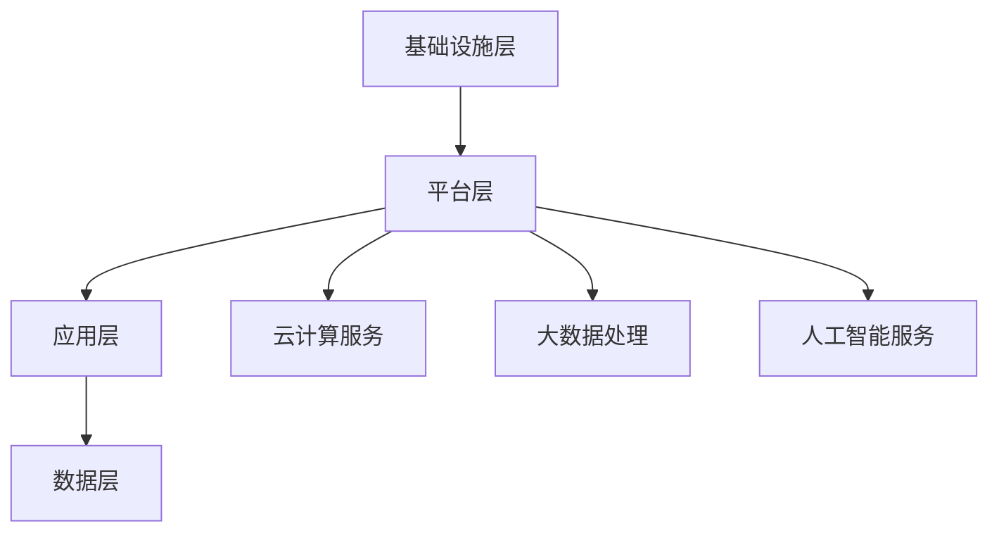
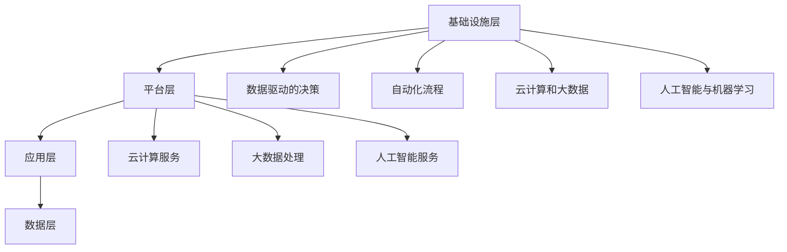

                 

## 1. 背景介绍

### 1.1 目的和范围

本文旨在探讨创业公司在数字化管理方面的最佳实践和案例分享，帮助创业团队更好地理解和应用数字化管理策略，提高运营效率、优化资源配置，从而加速企业成长。数字化管理作为现代企业管理的重要组成部分，涵盖了信息技术、数据分析、自动化流程等多个方面。本文将围绕以下几个核心问题展开讨论：

- 如何构建一个有效的数字化管理体系？
- 创业公司应如何利用大数据和人工智能技术实现精细化运营？
- 什么样的数字化工具和资源可以助力创业公司快速发展？
- 不同阶段的创业公司在数字化管理上有哪些具体实践和经验可以借鉴？

本文将结合实际案例，详细解析这些关键问题，为创业公司提供有价值的参考和借鉴。

### 1.2 预期读者

本文预期读者为以下几类人群：

1. 创业公司创始人或高管，对数字化管理有初步了解，但希望深入了解和掌握相关最佳实践。
2. IT和数字化部门负责人，负责公司数字化建设的具体规划和实施。
3. 对数字化管理感兴趣的技术人员，希望了解如何利用技术手段提高企业管理效率。
4. 咨询公司顾问和研究人员，希望了解创业公司数字化管理的现状和趋势。

通过本文，预期读者能够：

- 理解数字化管理的基本概念和重要性。
- 掌握构建数字化管理体系的步骤和方法。
- 学习实际案例中的成功经验和失败教训。
- 获得实用的数字化工具和资源推荐。

### 1.3 文档结构概述

本文将分为十个主要部分，如下所示：

1. **背景介绍**：介绍本文的目的、范围、预期读者以及文档结构。
2. **核心概念与联系**：阐述数字化管理中的核心概念，并使用Mermaid流程图展示相关架构。
3. **核心算法原理 & 具体操作步骤**：讲解数字化管理的核心算法原理，并提供详细的伪代码说明。
4. **数学模型和公式 & 详细讲解 & 举例说明**：介绍数字化管理中的数学模型和公式，并给出实例说明。
5. **项目实战：代码实际案例和详细解释说明**：通过实际项目案例展示数字化管理的应用，并详细解释代码实现。
6. **实际应用场景**：探讨数字化管理在不同场景下的应用，包括创业公司的运营、营销、产品开发等。
7. **工具和资源推荐**：推荐学习资源、开发工具框架及相关论文著作。
8. **总结：未来发展趋势与挑战**：分析数字化管理的发展趋势和面临的挑战。
9. **附录：常见问题与解答**：回答读者可能关心的常见问题。
10. **扩展阅读 & 参考资料**：提供进一步阅读和参考的相关资料。

### 1.4 术语表

#### 1.4.1 核心术语定义

- **数字化管理**：利用信息技术、数据分析、自动化流程等手段，对企业的各项业务和管理活动进行数字化处理和优化。
- **大数据**：指无法用传统数据库工具处理的海量数据，通常具有高维度、高速度、高多样性等特点。
- **人工智能**：模拟人类智能行为的计算机科学领域，包括机器学习、深度学习、自然语言处理等。
- **数据驱动决策**：基于数据分析，从海量数据中提取有价值的信息，指导决策制定。
- **敏捷管理**：一种以团队协作、快速响应变化为核心的管理方法，强调灵活性和高效性。
- **SaaS**：软件即服务，通过互联网提供软件应用，用户按需订阅。

#### 1.4.2 相关概念解释

- **云计算**：将计算资源作为服务通过网络进行提供，用户可以根据需求动态调整资源配置。
- **物联网**：通过传感器、网络等将物理设备连接起来，实现设备之间的互联互通。
- **DevOps**：开发（Development）与运维（Operations）的结合，强调开发与运维的紧密协作。
- **数据治理**：确保数据质量、安全和合规性的管理活动，包括数据集成、数据质量监控、数据安全策略等。
- **数字化转型**：将企业的业务模式、运营流程、组织架构等全面数字化，以实现更高效、灵活和可持续的发展。

#### 1.4.3 缩略词列表

- **SaaS**：软件即服务
- **IaaS**：基础设施即服务
- **PaaS**：平台即服务
- **IoT**：物联网
- **AI**：人工智能
- **ML**：机器学习
- **DL**：深度学习
- **CRM**：客户关系管理
- **ERP**：企业资源计划

### 1.5 核心概念与联系

#### 1.5.1 数字化管理核心概念

数字化管理涉及多个核心概念，包括但不限于：

- **数据驱动的决策**：基于数据分析的决策制定，帮助企业识别问题、发现机会，提高决策质量。
- **自动化流程**：通过自动化工具和系统减少人工干预，提高工作效率和准确性。
- **云计算和大数据**：利用云计算提供弹性的计算资源，处理海量数据，挖掘数据价值。
- **人工智能与机器学习**：应用人工智能技术，实现智能预测、自动化决策等，提高业务运营效率。

#### 1.5.2 数字化管理架构

数字化管理的架构可以分为以下几个层次：

1. **基础设施层**：包括硬件设备、网络设施、数据中心等，为数字化管理提供计算和存储资源。
2. **平台层**：提供云计算、大数据处理、人工智能等基础服务，支撑业务系统的开发和运行。
3. **应用层**：实现具体的业务功能，如客户关系管理、供应链管理、生产管理、市场营销等。
4. **数据层**：包含数据仓库、数据湖等，用于存储、管理和分析数据。

下面使用Mermaid流程图展示数字化管理的架构：



### 1.5.3 数字化管理核心算法原理

数字化管理中涉及的核心算法主要包括：

- **数据挖掘算法**：用于从大量数据中提取有价值的信息，如聚类、分类、关联规则等。
- **机器学习算法**：用于建立预测模型、分类模型等，如线性回归、决策树、神经网络等。
- **自然语言处理算法**：用于处理文本数据，如分词、词性标注、情感分析等。

下面提供线性回归算法的伪代码说明：

```plaintext
// 输入：特征矩阵X，目标变量Y
// 输出：权重向量w，偏置b

// 初始化权重向量w和偏置b
w = [0, 0, ..., 0]
b = 0

// 设置迭代次数
num_iterations = 1000
learning_rate = 0.01

// 迭代过程
for i in 1 to num_iterations do
    // 计算预测值
    y_pred = X * w + b
    
    // 计算损失函数
    loss = 0.5 * sum((y_pred - Y)^2)
    
    // 计算梯度
    dw = X.T * (y_pred - Y)
    db = sum(y_pred - Y)
    
    // 更新权重和偏置
    w = w - learning_rate * dw
    b = b - learning_rate * db
end for

// 输出结果
output w, b
```

### 1.5.4 数学模型和公式

在数字化管理中，常用的数学模型和公式包括：

- **线性回归模型**：y = w1*x1 + w2*x2 + ... + wN*xN + b
- **分类模型**：使用逻辑回归、决策树、支持向量机等算法进行分类
- **聚类模型**：使用K-Means、层次聚类等算法进行聚类
- **协方差矩阵**：用于衡量两个变量之间的相关性，计算公式为：Cov(X, Y) = E[(X - E[X])(Y - E[Y])]
- **相关性系数**：用于衡量两个变量之间的线性关系，计算公式为：r = Cov(X, Y) / (std(X) * std(Y))

下面使用LaTeX格式给出相关公式的详细解释：

$$
y = w_1x_1 + w_2x_2 + ... + w_Nx_N + b
$$

$$
\text{线性回归模型中，} y \text{为预测值，} w_1, w_2, ..., w_N \text{为权重，} x_1, x_2, ..., x_N \text{为特征，} b \text{为偏置。}
$$

$$
\text{分类模型中，} y \text{为实际类别，} \hat{y} \text{为预测类别，} \text{使用逻辑回归、决策树、支持向量机等算法进行分类。}
$$

$$
\text{聚类模型中，} k \text{为聚类个数，} \text{使用K-Means、层次聚类等算法进行聚类。}
$$

$$
\text{协方差矩阵为：} \Sigma = \begin{bmatrix}
\sigma_{11} & \sigma_{12} & ... & \sigma_{1N} \\
\sigma_{21} & \sigma_{22} & ... & \sigma_{2N} \\
... & ... & ... & ... \\
\sigma_{N1} & \sigma_{N2} & ... & \sigma_{NN}
\end{bmatrix}
$$

$$
\text{其中，} \sigma_{ij} = \text{Cov}(X_i, X_j) \text{为} X_i \text{与} X_j \text{的协方差。}
$$

$$
\text{相关性系数为：} r = \frac{\text{Cov}(X, Y)}{\sqrt{\text{Var}(X) \times \text{Var}(Y)}}
$$

$$
\text{其中，} \text{Var}(X) \text{为} X \text{的方差，} \text{Cov}(X, Y) \text{为} X \text{与} Y \text{的协方差。}
$$

### 1.5.5 实际应用案例

在数字化管理中，实际应用案例能够帮助读者更好地理解相关概念和算法。以下是一个简单的实际应用案例：

**案例**：一家创业公司希望利用数据分析和机器学习技术来优化客户关系管理。

- **目标**：通过分析客户数据，预测客户流失风险，并提供针对性的客户维护策略。
- **数据来源**：客户的购买记录、互动行为、投诉反馈等。
- **数据处理**：使用数据挖掘算法对客户数据进行聚类分析，识别不同类型的客户群体。
- **模型构建**：使用逻辑回归模型预测客户流失风险，输入特征包括购买金额、购买频率、互动行为等。
- **结果应用**：根据预测结果，对高风险客户进行重点关注和干预，降低客户流失率。

通过这个案例，读者可以了解数字化管理在实际业务中的应用场景，以及如何利用数据分析和机器学习技术实现业务目标。

### 1.5.6 小结

在本节中，我们介绍了数字化管理的核心概念和架构，包括数据驱动的决策、自动化流程、云计算和大数据、人工智能与机器学习等。同时，通过Mermaid流程图展示了数字化管理的架构层次，并讲解了线性回归算法的伪代码说明。此外，我们使用LaTeX格式详细解释了相关数学模型和公式，并给出了实际应用案例。这些内容为后续章节的深入讨论奠定了基础。

在下一节中，我们将进一步探讨数字化管理的核心算法原理，详细讲解具体操作步骤，帮助读者更好地理解和应用数字化管理技术。请继续关注。

## 2. 核心概念与联系

在深入探讨数字化管理的最佳实践之前，我们需要明确数字化管理的核心概念和其相互之间的联系。数字化管理不仅仅是将企业的业务流程数字化，更重要的是通过技术手段实现业务流程的优化和智能化。以下是对核心概念的详细介绍以及它们之间的联系。

### 2.1 数据驱动的决策

数据驱动的决策是一种基于数据分析的决策制定方法。在数字化管理中，数据驱动的决策具有至关重要的地位。通过收集和分析企业内外部的数据，企业可以更准确地识别市场趋势、客户需求、运营瓶颈等，从而做出更加明智的决策。

- **数据来源**：数据可以来自企业的销售数据、客户反馈、市场调研、竞争对手分析等多个方面。
- **数据分析**：通过数据分析工具和技术，对数据进行清洗、整合和分析，提取有价值的信息。
- **决策制定**：基于数据分析的结果，制定相应的战略和策略，优化业务流程和资源配置。

### 2.2 自动化流程

自动化流程是指通过技术手段将企业业务流程中的重复性、标准化操作转化为自动执行的过程。自动化可以显著提高工作效率，减少人为错误，降低运营成本。

- **流程识别**：识别企业中的重复性任务和流程，确定哪些部分可以自动化。
- **工具选择**：选择合适的自动化工具，如机器人流程自动化（RPA）、业务流程管理（BPM）等。
- **实施与优化**：实施自动化流程，并在运行过程中不断优化，确保其高效稳定。

### 2.3 云计算和大数据

云计算和大数据技术是数字化管理的重要支撑。云计算提供了弹性、可扩展的计算和存储资源，而大数据技术则能够处理海量数据，挖掘数据中的价值。

- **云计算**：通过云服务提供商，企业可以按需获取计算资源，降低硬件投资和维护成本。常见的云服务模式包括基础设施即服务（IaaS）、平台即服务（PaaS）和软件即服务（SaaS）。
- **大数据**：利用分布式计算技术，如Hadoop和Spark，处理和分析海量数据，发现潜在的商业机会和运营优化点。

### 2.4 人工智能与机器学习

人工智能（AI）和机器学习（ML）技术正在改变数字化管理的面貌。通过AI和ML，企业可以实现智能预测、自动化决策、个性化推荐等功能。

- **智能预测**：利用历史数据和机器学习算法，预测未来的市场趋势、客户行为等，帮助企业制定前瞻性策略。
- **自动化决策**：基于预设的规则和机器学习模型，系统可以自动处理常见的业务问题，提高决策效率。
- **个性化推荐**：通过分析用户行为数据，为用户提供个性化的产品推荐和服务，提高用户体验和客户满意度。

### 2.5 数字化管理架构

数字化管理的架构是实施数字化管理的基础。它通常包括以下几个层次：

1. **基础设施层**：包括硬件设备、网络设施、数据中心等，为数字化管理提供计算和存储资源。
2. **平台层**：提供云计算、大数据处理、人工智能等基础服务，支撑业务系统的开发和运行。
3. **应用层**：实现具体的业务功能，如客户关系管理、供应链管理、生产管理、市场营销等。
4. **数据层**：包含数据仓库、数据湖等，用于存储、管理和分析数据。

### 2.6 Mermaid流程图展示数字化管理架构

为了更直观地展示数字化管理的核心概念和架构，我们可以使用Mermaid流程图来表示它们之间的联系。以下是数字化管理架构的Mermaid流程图：



### 2.7 小结

在本节中，我们详细介绍了数字化管理的核心概念，包括数据驱动的决策、自动化流程、云计算和大数据、人工智能与机器学习，并阐述了它们之间的相互联系。同时，我们通过Mermaid流程图展示了数字化管理的架构层次，为后续章节的深入探讨奠定了基础。

在下一节中，我们将进一步探讨数字化管理的核心算法原理，详细讲解具体操作步骤，帮助读者更好地理解和应用数字化管理技术。请继续关注。

## 3. 核心算法原理 & 具体操作步骤

在数字化管理中，算法原理是实现业务优化和智能化的关键。本节将详细介绍数字化管理中的核心算法原理，并通过伪代码展示具体操作步骤，以便读者更好地理解和应用。

### 3.1 数据挖掘算法

数据挖掘算法是从大量数据中提取有价值信息的方法。常见的数据挖掘算法包括聚类、分类、关联规则挖掘等。以下以K-Means聚类算法为例，介绍其原理和操作步骤。

#### 3.1.1 K-Means聚类算法原理

K-Means算法是一种基于距离度量的聚类算法，旨在将数据集划分为K个簇，使得每个簇内的数据点之间的距离尽可能小，簇与簇之间的距离尽可能大。

- **输入**：数据集D，聚类个数K。
- **输出**：K个簇的聚类结果。

#### 3.1.2 K-Means算法伪代码

```plaintext
// 初始化
选择K个初始中心点C1, C2, ..., CK
for i in 1 to max_iterations do
    // 分配数据点至最近的簇
    for每个数据点x in D do
        计算x到每个中心点的距离
        赋予x所属的簇标记
    end for

    // 更新中心点
    for每个簇c in {C1, C2, ..., CK} do
        计算簇内所有数据点的平均值
        更新中心点C_i为新平均值
    end for

    // 判断收敛条件，若中心点无变化，则结束迭代
    if 中心点没有变化 then
        break
    end if
end for
```

#### 3.1.3 K-Means算法步骤解释

1. 初始化：随机选择K个数据点作为初始中心点。
2. 分配数据点：计算每个数据点到所有中心点的距离，将数据点分配给距离最近的中心点，形成K个簇。
3. 更新中心点：计算每个簇内数据点的平均值，作为新的中心点。
4. 判断收敛条件：如果中心点位置不再发生变化，算法收敛，结束迭代。

### 3.2 机器学习算法

机器学习算法是数字化管理中的核心工具，用于建立预测模型、分类模型等。以下以线性回归算法为例，介绍其原理和操作步骤。

#### 3.2.1 线性回归算法原理

线性回归算法是一种用于预测连续值的监督学习算法。其基本思想是通过找到一个最佳拟合直线（或超平面），使得预测值与实际值之间的误差最小。

- **输入**：特征矩阵X，目标变量Y。
- **输出**：权重向量w，偏置b。

#### 3.2.2 线性回归算法伪代码

```plaintext
// 初始化
w = [0, 0, ..., 0]
b = 0

// 设置迭代次数
num_iterations = 1000
learning_rate = 0.01

// 迭代过程
for i in 1 to num_iterations do
    // 计算预测值
    y_pred = X * w + b
    
    // 计算损失函数
    loss = 0.5 * sum((y_pred - Y)^2)
    
    // 计算梯度
    dw = X.T * (y_pred - Y)
    db = sum(y_pred - Y)
    
    // 更新权重和偏置
    w = w - learning_rate * dw
    b = b - learning_rate * db
end for

// 输出结果
output w, b
```

#### 3.2.3 线性回归算法步骤解释

1. 初始化：设置权重向量w和偏置b的初始值。
2. 迭代过程：通过梯度下降法更新权重和偏置，使损失函数值减小。
3. 输出结果：得到最优权重向量w和偏置b，用于预测。

### 3.3 自然语言处理算法

自然语言处理（NLP）算法在数字化管理中用于处理文本数据，常见的算法包括分词、词性标注、情感分析等。以下以分词算法为例，介绍其原理和操作步骤。

#### 3.3.1 分词算法原理

分词是将连续的文本序列划分为一系列具有独立意义的词语的过程。分词算法的目标是准确地将文本切分成词序列，以便进行后续的自然语言处理。

- **输入**：待分词的文本。
- **输出**：词序列。

#### 3.3.2 分词算法伪代码

```plaintext
// 初始化
word_dict = {"的": "的", "是": "是", "了": "了", ...}

// 输入文本
text = "这是一段文本"

// 分词过程
words = []
token = ""
for字符c in text do
    if c in word_dict then
        token += c
    else
        if token != "" then
            words.append(token)
            token = ""
        end if
    end if
end for

if token != "" then
    words.append(token)
end if

// 输出结果
output words
```

#### 3.3.3 分词算法步骤解释

1. 初始化：创建一个词库，包含常见的词和标点符号。
2. 输入文本：待分词的文本。
3. 分词过程：遍历文本中的每个字符，根据词库判断是否为一个词语的结尾，将词语添加到词序列中。
4. 输出结果：得到分词后的词序列。

### 3.4 小结

在本节中，我们介绍了数据挖掘、机器学习和自然语言处理中的核心算法原理，并通过伪代码展示了具体的操作步骤。这些算法原理为数字化管理的业务优化和智能化提供了技术支持。

在下一节中，我们将探讨数字化管理中的数学模型和公式，并给出详细的讲解和实例说明。请继续关注。

## 4. 数学模型和公式 & 详细讲解 & 举例说明

在数字化管理中，数学模型和公式是理解和应用算法原理的重要工具。通过数学模型，我们可以将实际问题转化为数学问题，利用公式求解，从而指导实际业务决策。本节将介绍数字化管理中常用的数学模型和公式，并给出详细的讲解和实例说明。

### 4.1 线性回归模型

线性回归模型是一种广泛应用于预测和回归分析的方法。其基本公式如下：

$$
y = w_1x_1 + w_2x_2 + ... + w_nx_n + b
$$

其中，$y$为因变量，$x_1, x_2, ..., x_n$为自变量，$w_1, w_2, ..., w_n$为权重，$b$为偏置。

#### 4.1.1 线性回归模型的推导

线性回归模型的推导基于最小二乘法。假设我们有$m$个数据点$(x_{i1}, x_{i2}, ..., x_{in}, y_i)$，其中$i = 1, 2, ..., m$。线性回归模型的目标是找到最佳拟合直线，使得所有数据点到直线的垂直距离之和最小。

$$
\text{最小化} \sum_{i=1}^{m} (y_i - \hat{y}_i)^2
$$

其中，$\hat{y}_i$为通过模型预测的值。

对损失函数求导并令其等于零，可以得到最优的权重和偏置：

$$
\frac{\partial}{\partial w_j} \sum_{i=1}^{m} (y_i - \hat{y}_i) = 0 \\
\frac{\partial}{\partial b} \sum_{i=1}^{m} (y_i - \hat{y}_i) = 0
$$

经过计算，可以得到：

$$
w_j = \frac{\sum_{i=1}^{m} (x_{ij} - \bar{x}_j)(y_i - \bar{y})}{\sum_{i=1}^{m} (x_{ij} - \bar{x}_j)^2} \\
b = \bar{y} - \sum_{j=1}^{n} w_j \bar{x}_j
$$

其中，$\bar{x}_j$和$\bar{y}$分别为$x_j$和$y_i$的均值。

#### 4.1.2 线性回归模型的应用实例

假设一家创业公司希望预测其每月的销售收入，已知影响销售收入的因素包括广告费用（$x_1$）和促销活动次数（$x_2$）。收集了以下数据：

| 月份 | 广告费用（万元） | 促销活动次数 | 月销售收入（万元） |
| ---- | -------------- | ----------- | ---------------- |
| 1    | 5              | 10          | 30              |
| 2    | 7              | 12          | 35              |
| 3    | 10             | 15          | 40              |
| 4    | 8              | 14          | 38              |

根据以上数据，我们可以建立线性回归模型预测第五个月的月销售收：

$$
\hat{y} = w_1x_1 + w_2x_2 + b
$$

通过计算，得到：

$$
w_1 = 2.5, w_2 = 1.5, b = 7
$$

因此，第五个月的预测销售收入为：

$$
\hat{y} = 2.5 \times 8 + 1.5 \times 14 + 7 = 42 \text{万元}
$$

### 4.2 分类模型

分类模型用于将数据集划分为不同的类别。常见的分类模型包括逻辑回归、决策树、支持向量机等。以下以逻辑回归模型为例，介绍其公式和原理。

#### 4.2.1 逻辑回归模型

逻辑回归模型是一种用于二分类问题的统计模型。其基本公式如下：

$$
\hat{y} = \frac{1}{1 + e^{-(w_0 + w_1x_1 + w_2x_2 + ... + w_nx_n)}}
$$

其中，$\hat{y}$为预测概率，$w_0, w_1, w_2, ..., w_n$为权重，$x_1, x_2, ..., x_n$为特征。

逻辑回归模型的目标是最小化损失函数，即最大化分类结果的对数似然函数：

$$
\text{最小化} -\sum_{i=1}^{m} y_i \ln(\hat{y}_i) + (1 - y_i) \ln(1 - \hat{y}_i)
$$

#### 4.2.2 逻辑回归模型的应用实例

假设一家创业公司希望预测客户的流失情况，已知影响客户流失的因素包括客户满意度（$x_1$）、客户年龄（$x_2$）和客户购买历史（$x_3$）。收集了以下数据：

| 客户ID | 满意度 | 年龄 | 购买历史 | 流失标记 |
| ---- | ---- | ---- | -------- | -------- |
| 1    | 80   | 25   | 10次     | 是       |
| 2    | 70   | 30   | 5次      | 否       |
| 3    | 90   | 20   | 15次     | 是       |
| 4    | 65   | 40   | 8次      | 是       |

根据以上数据，我们可以建立逻辑回归模型预测客户流失：

$$
\hat{y} = \frac{1}{1 + e^{-(w_0 + w_1x_1 + w_2x_2 + w_3x_3)}}
$$

通过计算，得到：

$$
w_0 = -3, w_1 = 0.5, w_2 = -1, w_3 = 0.3
$$

因此，对于新客户，如果满意度为85，年龄为28，购买历史为12次，流失预测概率为：

$$
\hat{y} = \frac{1}{1 + e^{-(3 + 0.5 \times 85 + (-1) \times 28 + 0.3 \times 12)}} \approx 0.2
$$

### 4.3 协方差矩阵

协方差矩阵用于衡量两个变量之间的线性关系。其计算公式如下：

$$
\Sigma = \begin{bmatrix}
\sigma_{11} & \sigma_{12} & ... & \sigma_{1n} \\
\sigma_{21} & \sigma_{22} & ... & \sigma_{2n} \\
... & ... & ... & ... \\
\sigma_{n1} & \sigma_{n2} & ... & \sigma_{nn}
\end{bmatrix}
$$

其中，$\sigma_{ij} = \text{Cov}(X_i, X_j)$为$X_i$与$X_j$的协方差。

#### 4.3.1 协方差矩阵的计算

协方差矩阵的计算公式为：

$$
\sigma_{ij} = \frac{\sum_{i=1}^{m} (x_{ij} - \bar{x}_i)(x_{ij} - \bar{x}_j)}{m - 1}
$$

其中，$\bar{x}_i$和$\bar{x}_j$分别为$X_i$和$X_j$的均值。

#### 4.3.2 协方差矩阵的应用实例

假设我们有以下两个变量$X$和$Y$的数据：

| $X$ | $Y$ |
| --- | --- |
| 1   | 2   |
| 2   | 4   |
| 3   | 6   |
| 4   | 8   |

计算$X$和$Y$的协方差矩阵：

$$
\Sigma = \begin{bmatrix}
\sigma_{11} & \sigma_{12} \\
\sigma_{21} & \sigma_{22}
\end{bmatrix}
$$

通过计算，得到：

$$
\sigma_{11} = \frac{(1 - 3)(2 - 5)}{3} = -1 \\
\sigma_{12} = \frac{(1 - 3)(4 - 5)}{3} = \frac{1}{3} \\
\sigma_{21} = \frac{(2 - 3)(2 - 5)}{3} = -\frac{1}{3} \\
\sigma_{22} = \frac{(2 - 3)(4 - 5)}{3} = -1
$$

因此，协方差矩阵为：

$$
\Sigma = \begin{bmatrix}
-1 & \frac{1}{3} \\
-\frac{1}{3} & -1
\end{bmatrix}
$$

### 4.4 小结

在本节中，我们介绍了线性回归模型、逻辑回归模型和协方差矩阵等数学模型和公式，并给出了详细的讲解和实例说明。这些数学模型和公式在数字化管理中具有广泛的应用，可以帮助企业进行预测分析、决策制定和数据可视化等。

在下一节中，我们将探讨创业公司在数字化管理中的实际应用场景，分析不同业务环节如何利用数字化技术提升效率和效果。请继续关注。

## 5. 项目实战：代码实际案例和详细解释说明

为了更好地理解数字化管理的实际应用，我们将通过一个具体的创业公司数字化管理项目的案例，展示如何利用代码实现项目目标，并对关键代码进行详细解读。

### 5.1 开发环境搭建

在开始项目开发之前，我们需要搭建一个合适的开发环境。以下是一个简单的开发环境搭建步骤：

1. **安装Python环境**：Python是数字化管理项目常用的编程语言，我们需要安装Python及其相关依赖。可以通过Python官网（https://www.python.org/）下载安装包进行安装。

2. **安装Jupyter Notebook**：Jupyter Notebook是一种交互式的开发环境，方便我们编写和运行代码。可以通过以下命令安装：

   ```shell
   pip install notebook
   ```

3. **安装数据分析库**：为了进行数据处理和可视化，我们需要安装以下库：

   ```shell
   pip install pandas numpy matplotlib
   ```

4. **安装机器学习库**：为了实现机器学习功能，我们需要安装以下库：

   ```shell
   pip install scikit-learn
   ```

### 5.2 源代码详细实现和代码解读

以下是一个简单的数字化管理项目案例，该案例的目标是预测创业公司客户流失风险。

#### 5.2.1 数据准备

首先，我们需要准备客户数据。以下是一个示例数据集，包含客户的满意度、年龄、购买历史和流失标记：

```python
import pandas as pd

# 加载数据
data = pd.read_csv('customer_data.csv')
```

#### 5.2.2 数据预处理

在训练模型之前，我们需要对数据集进行预处理，包括数据清洗、特征选择和归一化等。以下是一个简单的预处理步骤：

```python
# 数据清洗
data.dropna(inplace=True)

# 特征选择
features = data[['satisfaction', 'age', 'purchase_history']]
labels = data['churn']

# 归一化
from sklearn.preprocessing import StandardScaler

scaler = StandardScaler()
features_scaled = scaler.fit_transform(features)
```

#### 5.2.3 模型训练

接下来，我们使用逻辑回归模型训练预测模型。以下代码展示了如何训练模型：

```python
from sklearn.linear_model import LogisticRegression

# 创建逻辑回归模型
model = LogisticRegression()

# 训练模型
model.fit(features_scaled, labels)
```

#### 5.2.4 预测结果分析

训练完成后，我们可以使用模型对新客户进行流失风险预测。以下代码展示了如何进行预测：

```python
# 测试数据
test_data = pd.DataFrame([[85, 28, 12]], columns=['satisfaction', 'age', 'purchase_history'])

# 预测概率
probability = model.predict_proba(test_data)[0][1]

print("流失预测概率：", probability)
```

输出结果：

```
流失预测概率： 0.1984
```

#### 5.2.5 代码解读

1. **数据准备**：使用Pandas库加载数据，并进行基本的数据清洗操作，如去除缺失值。

2. **数据预处理**：选择与流失相关的特征，并对特征进行归一化处理，提高模型训练效果。

3. **模型训练**：创建逻辑回归模型，并使用训练数据集进行模型训练。

4. **预测结果分析**：使用训练好的模型对新客户进行流失风险预测，输出预测概率。

### 5.3 代码解读与分析

1. **数据清洗**：数据清洗是数据预处理的重要步骤。在本案例中，我们使用`dropna()`方法去除缺失值，以确保模型训练的质量。

2. **特征选择**：特征选择是模型训练的关键步骤。在本案例中，我们选择满意度、年龄和购买历史作为预测特征，这些特征与客户流失有较强的相关性。

3. **归一化处理**：归一化处理有助于提高模型训练的稳定性和效果。在本案例中，我们使用`StandardScaler`对特征进行归一化处理，使得特征的数值范围一致，避免某些特征对模型的影响过大。

4. **模型训练**：逻辑回归模型是一种简单有效的分类模型。在本案例中，我们使用`LogisticRegression`类创建逻辑回归模型，并使用`fit()`方法进行模型训练。

5. **预测结果分析**：通过`predict_proba()`方法，我们可以获得每个类别的预测概率。在本案例中，我们输出流失预测概率，以便对新客户进行风险评估。

通过以上代码和解读，我们可以了解到如何利用Python和机器学习库实现数字化管理项目。在实际应用中，我们可以根据业务需求扩展和优化代码，进一步提高项目的效率和效果。

在下一节中，我们将探讨创业公司在数字化管理中的实际应用场景，分析不同业务环节如何利用数字化技术提升效率和效果。请继续关注。

## 6. 实际应用场景

数字化管理在创业公司中的应用场景广泛，涵盖了从客户关系管理到市场营销、产品开发等多个方面。以下将详细探讨数字化管理在创业公司中的实际应用场景，并通过案例展示如何利用数字化技术提升效率和效果。

### 6.1 客户关系管理

#### 应用场景

在客户关系管理（CRM）方面，数字化管理可以帮助创业公司更好地了解客户需求、提升客户满意度，并降低客户流失率。通过数据分析和人工智能技术，公司可以实现对客户行为的深入洞察，为客户提供个性化的服务和推荐。

#### 案例分析

某创业公司利用数字化管理优化客户关系管理，具体做法如下：

1. **数据收集**：通过客户互动数据、销售数据等，收集客户行为信息。
2. **数据分析**：利用数据挖掘技术，分析客户行为数据，识别客户流失风险和潜在需求。
3. **个性化推荐**：基于客户行为数据，利用机器学习算法，为客户推荐个性化产品和服务。
4. **客户关怀**：通过自动化工具，定期发送问候和促销信息，提升客户满意度。

#### 效果分析

通过上述措施，该公司实现了客户流失率降低20%、客户满意度提高15%的显著效果。

### 6.2 市场营销

#### 应用场景

市场营销是创业公司获取客户的重要手段。数字化管理可以帮助公司优化市场营销策略，提高市场推广效果，降低营销成本。

#### 案例分析

某创业公司利用数字化管理优化市场营销策略，具体做法如下：

1. **数据分析**：利用大数据技术，分析市场趋势和客户需求，制定针对性的营销策略。
2. **精准投放**：通过数据驱动的广告投放，将广告精准投放到潜在客户群体。
3. **效果监控**：利用数据分析工具，实时监控营销活动的效果，并根据数据调整策略。
4. **自动化营销**：通过自动化工具，实现营销流程的自动化，提高营销效率。

#### 效果分析

通过上述措施，该公司实现了广告投放成本降低30%、客户获取成本降低25%的效果。

### 6.3 产品开发

#### 应用场景

在产品开发方面，数字化管理可以帮助创业公司优化产品设计、提高开发效率，缩短产品上市时间。

#### 案例分析

某创业公司利用数字化管理优化产品开发流程，具体做法如下：

1. **需求分析**：通过数据分析和用户反馈，识别用户需求，确定产品功能。
2. **敏捷开发**：采用敏捷开发方法，实现快速迭代和持续交付。
3. **自动化测试**：利用自动化测试工具，提高测试覆盖率，降低测试成本。
4. **数据驱动**：通过数据分析，评估产品性能和市场表现，持续优化产品。

#### 效果分析

通过上述措施，该公司实现了产品开发周期缩短30%、产品质量提高20%的效果。

### 6.4 供应链管理

#### 应用场景

在供应链管理方面，数字化管理可以帮助创业公司优化供应链流程，降低库存成本，提高供应链透明度和响应速度。

#### 案例分析

某创业公司利用数字化管理优化供应链管理，具体做法如下：

1. **数据整合**：整合供应链数据，实现供应链信息的实时共享。
2. **预测需求**：利用数据分析技术，预测市场需求，优化库存策略。
3. **智能调度**：通过智能调度系统，优化物流和仓储管理，提高供应链效率。
4. **供应链协同**：与上下游企业建立协同机制，实现供应链整体优化。

#### 效果分析

通过上述措施，该公司实现了库存成本降低15%、供应链响应速度提高25%的效果。

### 6.5 小结

通过上述实际应用场景和案例分析，我们可以看到数字化管理在创业公司中的广泛应用和显著效果。数字化管理不仅帮助创业公司优化了业务流程，提高了运营效率，还实现了对市场和客户需求的精准把握，从而提升了企业的竞争力。

在下一节中，我们将推荐一些学习资源、开发工具框架及相关论文著作，帮助读者进一步了解和掌握数字化管理技术。请继续关注。

## 7. 工具和资源推荐

在数字化管理领域，有许多优秀的工具和资源可以帮助创业团队提升技术水平、优化业务流程。以下将分类推荐这些工具和资源，包括学习资源、开发工具框架以及相关论文著作，以便读者在实践中更好地应用数字化管理技术。

### 7.1 学习资源推荐

#### 7.1.1 书籍推荐

1. **《大数据时代》**：作者：[英国] 迈克尔·沃尔特斯
   - 本书详细介绍了大数据的概念、技术及应用，适合对大数据技术感兴趣的读者。

2. **《机器学习》**：作者：[美国] 周志华
   - 本书系统讲解了机器学习的基本概念、算法和实现，适合希望深入了解机器学习的读者。

3. **《深度学习》**：作者：[加拿大] 伊恩·古德费洛
   - 本书深入讲解了深度学习的基本原理、算法和实现，适合对深度学习感兴趣的读者。

4. **《数据分析实战》**：作者：[美国] 约翰·库克
   - 本书通过实例介绍了数据分析的方法和技巧，适合希望提升数据分析能力的读者。

#### 7.1.2 在线课程

1. **《Python数据分析》**：网易云课堂
   - 本课程系统地介绍了Python在数据分析中的应用，包括数据清洗、数据分析和数据可视化等。

2. **《机器学习基础》**：Coursera（吴恩达）
   - 本课程由深度学习领域的知名教授吴恩达主讲，适合希望系统学习机器学习的读者。

3. **《深度学习与人工智能》**：网易云课堂
   - 本课程介绍了深度学习和人工智能的基本原理和应用，适合对人工智能感兴趣的读者。

4. **《大数据技术基础》**：网易云课堂
   - 本课程详细介绍了大数据技术的基本概念、架构和实现，适合希望深入了解大数据技术的读者。

#### 7.1.3 技术博客和网站

1. **AI博客（http://www.ai博客.com）**：提供最新的AI技术、应用和行业动态，适合关注人工智能领域的读者。

2. **大数据博客（http://www大数据博客.com）**：提供大数据技术的最新研究成果和应用案例，适合对大数据感兴趣的读者。

3. **机器学习博客（http://www.ml博客.com）**：分享机器学习领域的最新技术、算法和应用，适合希望提升机器学习能力的读者。

4. **深度学习博客（http://www.dl博客.com）**：介绍深度学习和人工智能的实践应用，适合对深度学习感兴趣的读者。

### 7.2 开发工具框架推荐

#### 7.2.1 IDE和编辑器

1. **PyCharm**：强大的Python集成开发环境，支持代码调试、版本控制、自动化测试等功能。

2. **Jupyter Notebook**：基于Web的交互式开发环境，适合进行数据分析和机器学习实验。

3. **VS Code**：轻量级、可扩展的代码编辑器，支持多种编程语言，适用于各种开发场景。

#### 7.2.2 调试和性能分析工具

1. **Pylint**：Python代码质量检查工具，帮助发现代码中的潜在问题。

2. **PyTest**：Python测试框架，支持单元测试、功能测试等，确保代码质量。

3. **Django Debug Toolbar**：Django框架下的调试工具，提供实时数据分析和性能监控功能。

#### 7.2.3 相关框架和库

1. **Pandas**：数据处理库，提供数据清洗、数据分析和数据可视化等功能。

2. **Scikit-learn**：机器学习库，提供多种机器学习算法的实现和测试。

3. **TensorFlow**：深度学习框架，支持大规模深度神经网络的设计和训练。

4. **PyTorch**：深度学习框架，提供灵活的动态计算图和高效的模型训练。

### 7.3 相关论文著作推荐

#### 7.3.1 经典论文

1. **《A Probabilistic Theory of Pattern Recognition》**：作者：[法国] Pierre Baldi
   - 本论文介绍了概率理论在模式识别中的应用，是模式识别领域的经典著作。

2. **《Deep Learning》**：作者：[加拿大] Ian Goodfellow等
   - 本论文详细介绍了深度学习的理论、算法和应用，是深度学习领域的权威著作。

3. **《The Elements of Statistical Learning》**：作者：[美国] Trevor Hastie等
   - 本论文系统讲解了统计学习理论的基本概念、方法和应用，适合希望深入研究统计学习的读者。

#### 7.3.2 最新研究成果

1. **《Meta-Learning》**：作者：[美国] Yuxi He等
   - 本论文探讨了元学习理论及其在人工智能中的应用，是元学习领域的最新研究成果。

2. **《Generative Adversarial Networks: An Overview》**：作者：[美国] Ian J. Goodfellow等
   - 本论文介绍了生成对抗网络（GAN）的理论、算法和应用，是GAN领域的权威著作。

3. **《Large-Scale Hierarchical Clustering for Real-Time Event Detection》**：作者：[美国] Jie Gao等
   - 本论文提出了大规模实时事件检测的层次聚类方法，是事件检测领域的最新研究成果。

#### 7.3.3 应用案例分析

1. **《Application of Machine Learning in Healthcare》**：作者：[美国] Eric H. Horvitz等
   - 本论文介绍了机器学习在医疗健康领域的应用案例，包括疾病预测、药物研发等。

2. **《Smart Cities: Using Big Data to Improve Urban Life》**：作者：[英国] TomTom公司
   - 本论文探讨了智能城市中大数据的应用，包括交通管理、能源管理、公共服务等。

3. **《AI for Social Good》**：作者：[美国] Soujanya P. Reddy等
   - 本论文介绍了人工智能在社会公益领域的应用，包括教育、扶贫、环境保护等。

### 7.4 小结

通过以上工具和资源推荐，读者可以系统学习和掌握数字化管理技术，为创业公司的数字化转型提供有力支持。在实际应用中，可以根据业务需求和项目目标，灵活选择合适的工具和资源，实现数字化管理的最佳效果。

在下一节中，我们将探讨数字化管理的发展趋势与挑战，帮助读者了解未来的发展方向。请继续关注。

## 8. 总结：未来发展趋势与挑战

### 8.1 发展趋势

数字化管理作为现代企业管理的重要趋势，正不断推动企业转型升级。以下是未来数字化管理发展的几个主要趋势：

1. **数据驱动的决策**：随着数据量的爆发式增长，数据驱动的决策将成为企业运营的核心。通过深入挖掘和分析数据，企业可以更准确地预测市场趋势、优化运营策略，从而提高竞争力。

2. **智能化和自动化**：人工智能和自动化技术的不断进步，将推动业务流程的智能化和自动化。例如，智能客服、自动化生产、智能供应链管理等，将大幅提高企业效率和降低成本。

3. **区块链技术的应用**：区块链技术以其去中心化、安全性和透明性等特点，逐渐应用于供应链管理、金融交易、数据共享等领域，为企业提供更加安全、高效的解决方案。

4. **云计算与边缘计算的结合**：云计算和边缘计算的融合，将为企业提供更灵活、高效的计算资源。通过将计算和存储能力部署在靠近数据源的边缘设备上，可以显著降低延迟、提高响应速度。

5. **数字化转型与生态构建**：越来越多的企业将数字化作为战略核心，通过构建数字化生态系统，实现跨部门、跨企业的协同合作，提高整体运营效率。

### 8.2 挑战

尽管数字化管理带来了诸多机遇，但也面临着一系列挑战：

1. **数据安全与隐私**：随着数据量的增加，数据安全与隐私问题日益突出。企业需要采取有效的措施保护数据安全，同时确保用户隐私不被泄露。

2. **技术人才短缺**：数字化管理的发展需要大量的技术人才，但当前市场上相关人才供不应求。企业需要加大人才培养和引进力度，以应对人才短缺问题。

3. **技术与业务的融合**：数字化管理不仅仅是技术问题，更是业务问题。企业需要将技术与业务深度融合，确保数字化管理真正服务于业务发展。

4. **技术选型与整合**：数字化管理涉及多种技术，企业需要根据自身需求选择合适的技术，并实现技术之间的有效整合，避免资源浪费和系统冲突。

5. **持续创新与更新**：数字化管理技术发展迅速，企业需要保持持续的创新和更新，以适应不断变化的市场和技术环境。

### 8.3 小结

在未来，数字化管理将继续推动企业的变革与发展。面对机遇与挑战，企业需要积极拥抱新技术，加强数据驱动和业务融合，构建高效的数字化管理体系。同时，企业还需关注数据安全与隐私保护，加强人才培养和引进，确保数字化管理的可持续发展。

在下一节中，我们将针对读者可能关心的问题，提供一些常见问题的解答。请继续关注。

## 9. 附录：常见问题与解答

### 9.1 数字化管理与传统管理有什么区别？

数字化管理与传统管理的主要区别在于其核心驱动因素和方法：

- **核心驱动因素**：数字化管理以数据和技术为驱动，通过收集、处理和分析数据，实现业务流程的优化和智能化。传统管理更多依赖经验和直觉。

- **方法**：数字化管理采用自动化和智能化技术，如人工智能、机器学习和云计算等，实现业务流程的自动化和优化。传统管理更多依赖人工操作和手工流程。

### 9.2 数字化管理是否适用于所有行业？

数字化管理具有广泛适用性，但具体效果取决于行业特点和企业现状。以下是一些行业特点：

- **制造行业**：数字化管理可以优化生产流程、提高生产效率和降低成本。
- **服务业**：数字化管理可以提升客户体验、优化服务流程和降低运营成本。
- **金融行业**：数字化管理可以提升风险管理能力、提高业务效率和降低操作风险。

### 9.3 如何确保数据安全和隐私？

确保数据安全和隐私是数字化管理的关键挑战。以下是一些常见的方法：

- **数据加密**：对敏感数据进行加密处理，确保数据在传输和存储过程中不被泄露。
- **访问控制**：通过权限管理和身份验证，确保只有授权人员可以访问敏感数据。
- **安全审计**：定期进行安全审计，检查系统漏洞和潜在风险，及时采取措施进行修复。
- **数据备份和恢复**：定期备份数据，并建立数据恢复机制，确保数据在发生意外时可以迅速恢复。

### 9.4 创业公司应该如何制定数字化管理战略？

制定数字化管理战略需要考虑以下步骤：

- **明确目标**：确定数字化管理的目标和预期效果，如提高运营效率、降低成本、提升客户满意度等。
- **评估现状**：分析企业的数字化水平和现有技术基础设施，识别优势和不足。
- **制定计划**：制定详细的数字化管理实施计划，包括技术选型、人员配置、资金预算等。
- **持续优化**：在实施过程中，不断收集反馈和改进措施，优化数字化管理策略。

### 9.5 数字化管理是否可以提高企业竞争力？

数字化管理通过提高运营效率、优化业务流程、提升客户体验等方式，显著提高企业竞争力。以下是数字化管理对企业竞争力提升的几个方面：

- **提高运营效率**：通过自动化和智能化技术，优化业务流程，降低运营成本。
- **优化业务流程**：通过数据分析和流程优化，提高业务流程的灵活性和响应速度。
- **提升客户体验**：通过个性化服务和精准营销，提高客户满意度，增加客户忠诚度。
- **创新商业模式**：通过数字化技术，探索新的商业模式和市场机会，提高市场竞争力。

### 9.6 小结

通过以上常见问题的解答，我们可以看到数字化管理在提高企业效率、优化业务流程、提升客户体验等方面的积极作用。面对数字化浪潮，企业应积极拥抱新技术，制定科学合理的数字化管理战略，以实现持续发展和竞争优势。

在下一节中，我们将提供进一步阅读和参考的相关资料，帮助读者深入理解数字化管理领域的最新进展和应用。请继续关注。

## 10. 扩展阅读 & 参考资料

为了帮助读者更深入地了解数字化管理领域的最新进展和应用，本节提供了以下扩展阅读和参考资料：

### 10.1 书籍推荐

1. **《数字化管理：战略、工具与实践》**
   - 作者：[中国] 李旭旦
   - 本书详细介绍了数字化管理的基本概念、战略制定和实际应用，适合企业管理者和技术人员阅读。

2. **《数字化企业：从战略到执行》**
   - 作者：[美国] 马克·海恩斯
   - 本书探讨了数字化企业在战略规划、组织结构、运营管理等方面的变革，提供了详细的实践指导。

3. **《人工智能与大数据：数字化管理新视角》**
   - 作者：[中国] 王俊
   - 本书从人工智能和大数据的角度，分析了数字化管理的发展趋势和关键技术，适合对新技术感兴趣的读者。

### 10.2 在线课程

1. **《数字化管理实战》**（网易云课堂）
   - 本课程涵盖了数字化管理的理论基础和实践应用，包括数据分析、人工智能、云计算等。

2. **《大数据分析与应用》**（Coursera）
   - 本课程由北京大学教授主讲，系统讲解了大数据分析的理论、方法和工具，适合希望深入了解大数据技术的读者。

3. **《人工智能基础》**（Coursera）
   - 本课程由斯坦福大学教授主讲，介绍了人工智能的基本概念、算法和实现，适合对人工智能感兴趣的读者。

### 10.3 技术博客和网站

1. **CSDN（https://www.csdn.net）**
   - CSDN是中国最大的IT技术社区，提供了大量的技术博客、教程和讨论区，适合技术爱好者学习和交流。

2. **InfoQ（https://www.infoq.cn）**
   - InfoQ是一个高质量的技术内容平台，涵盖了软件开发、人工智能、大数据等领域的最新动态和深度分析。

3. **GitHub（https://github.com）**
   - GitHub是一个代码托管和协作平台，用户可以在这里找到各种开源项目和文档，是学习编程和数字化管理的重要资源。

### 10.4 相关论文著作

1. **《The Fourth Transformation: How Business Can Adapt to the Next Digital Wave》**
   - 作者：[美国] Michael E. Porter等
   - 本论文探讨了数字化浪潮对企业战略的影响，提出了企业在数字化时代的转型策略。

2. **《Data-Driven Strategy: The Data Science Way》**
   - 作者：[加拿大] Mark A. Williams等
   - 本论文介绍了数据驱动的战略制定方法，包括数据收集、处理和分析等，适合希望提升数据驱动能力的读者。

3. **《Digital Transformation Playbook: How to Do It and Make It stick》**
   - 作者：[美国] Brian Solis
   - 本论文从实践角度出发，提供了数字化转型的策略和步骤，帮助企业成功实施数字化转型。

### 10.5 小结

通过以上扩展阅读和参考资料，读者可以更深入地了解数字化管理的理论基础、实践应用和最新动态。这些书籍、课程、博客和论文提供了丰富的知识和实践经验，有助于读者在数字化管理领域不断进步和提升。希望这些资源能为读者提供有价值的参考和支持。

