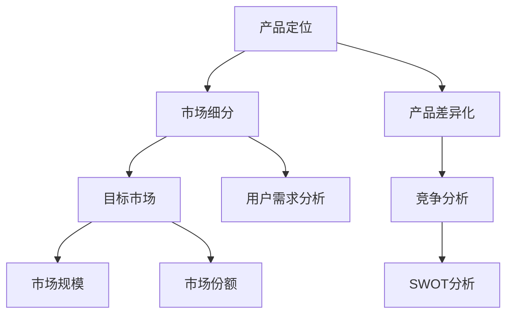

                 

# 创业公司的产品定位与市场细分

> **关键词：** 产品定位、市场细分、创业公司、竞争分析、用户需求

> **摘要：** 本文旨在探讨创业公司在产品开发过程中的产品定位和市场细分策略。通过分析产品定位的重要性、市场细分的步骤和策略，以及如何利用竞争分析和用户需求来确定产品定位，帮助创业者更好地理解和实施有效的产品战略。

## 1. 背景介绍

### 1.1 目的和范围

本文旨在帮助创业公司理解产品定位和市场细分的重要性，并提供一套实用的策略和步骤，以在竞争激烈的市场中找到自己的位置。文章将涵盖以下内容：

- 产品定位的核心概念和重要性。
- 市场细分的定义、步骤和策略。
- 利用竞争分析确定产品定位。
- 如何根据用户需求进行市场细分。

通过本文的阅读，读者将能够：

- 明白产品定位对于创业公司的意义。
- 掌握市场细分的基本方法和技巧。
- 学会利用竞争分析和用户需求来确定产品定位。

### 1.2 预期读者

本文面向希望了解如何成功进行产品定位和市场细分的创业者、产品经理、市场分析师和初创团队。无论您是经验丰富的创业者还是刚起步的新手，本文都将为您提供有价值的见解和实用的建议。

### 1.3 文档结构概述

本文分为以下章节：

- **第1章：背景介绍**：介绍本文的目的、预期读者、文档结构和相关术语。
- **第2章：核心概念与联系**：阐述产品定位和市场细分的相关概念，并通过Mermaid流程图展示其联系。
- **第3章：核心算法原理 & 具体操作步骤**：讲解如何通过具体步骤实现产品定位和市场细分。
- **第4章：数学模型和公式 & 详细讲解 & 举例说明**：介绍相关的数学模型和公式，并通过实例进行说明。
- **第5章：项目实战：代码实际案例和详细解释说明**：通过实际案例展示如何应用产品定位和市场细分策略。
- **第6章：实际应用场景**：探讨产品定位和市场细分在实际项目中的应用。
- **第7章：工具和资源推荐**：推荐学习资源、开发工具和框架。
- **第8章：总结：未来发展趋势与挑战**：展望产品定位和市场细分领域的未来趋势和挑战。
- **第9章：附录：常见问题与解答**：提供常见问题的解答。
- **第10章：扩展阅读 & 参考资料**：推荐进一步学习的资源。

### 1.4 术语表

#### 1.4.1 核心术语定义

- **产品定位**：产品在市场中的位置，包括目标用户、产品特性、价值主张等。
- **市场细分**：将整体市场划分为若干个具有相似需求和特征的子市场。
- **目标市场**：公司选择进行产品开发和推广的市场细分。
- **SWOT分析**：评估公司内部优势（Strengths）、劣势（Weaknesses）、外部机会（Opportunities）和威胁（Threats）。
- **用户需求分析**：研究目标用户的需求、偏好和痛点。

#### 1.4.2 相关概念解释

- **市场规模**：市场潜在的需求量。
- **市场份额**：公司在特定市场中的销售或市场份额。
- **产品差异化**：产品与竞争对手产品之间的区别。
- **市场渗透率**：产品在目标市场中的普及程度。

#### 1.4.3 缩略词列表

- **SWOT**：优势（Strengths）、劣势（Weaknesses）、机会（Opportunities）、威胁（Threats）
- **CRM**：客户关系管理（Customer Relationship Management）
- **SEO**：搜索引擎优化（Search Engine Optimization）
- **SEM**：搜索引擎营销（Search Engine Marketing）

## 2. 核心概念与联系

在探讨产品定位和市场细分之前，我们需要理解这些概念的定义及其相互关系。以下将通过一个Mermaid流程图来展示这些核心概念之间的联系。



### 2.1 产品定位

产品定位是创业公司成功的关键因素。它指的是产品在市场中的特定位置，决定了产品的目标用户、产品特性、价值主张和市场策略。产品定位不仅仅是给产品起一个名字或描述其功能，而是深入挖掘产品的独特卖点（USP）和市场差异。

#### 产品定位的重要性

- **明确目标用户**：产品定位帮助创业公司确定目标用户，从而更好地满足他们的需求。
- **差异化竞争**：通过定位，产品能够在众多竞争者中脱颖而出，实现差异化。
- **指导市场营销**：产品定位为市场营销活动提供了方向，包括广告、品牌传播、定价等。

### 2.2 市场细分

市场细分是将整体市场划分为若干具有相似需求和特征的子市场。这种策略允许创业公司针对特定的用户群体提供定制化的解决方案，从而提高市场竞争力。

#### 市场细分的步骤

1. **市场细分因素**：识别影响用户需求的因素，如年龄、性别、收入、地理位置、行为等。
2. **评估细分市场**：分析各个细分市场的潜在价值，包括市场规模、增长潜力、竞争情况等。
3. **选择目标市场**：基于市场细分的结果，选择最有利可图的细分市场作为目标市场。
4. **定位策略**：为选定目标市场制定相应的产品定位策略。

### 2.3 产品定位与市场细分的关系

产品定位和市场细分密不可分。市场细分提供了基础数据，帮助创业公司识别目标市场；而产品定位则基于这些数据，决定如何为这些市场提供产品价值。

- **市场细分指导产品定位**：通过细分市场，创业公司可以更好地了解用户需求，从而制定更精准的产品定位。
- **产品定位优化市场细分**：明确的产品定位可以帮助创业公司更有效地开发细分市场，提高市场份额。

### 2.4 用户需求分析

用户需求分析是产品定位和市场细分的基础。通过研究目标用户的需求、偏好和痛点，创业公司可以：

- **提高产品满意度**：确保产品满足用户需求。
- **降低开发风险**：通过验证需求，避免开发不必要或不符合市场需求的产品。
- **增强市场竞争力**：更好地理解用户，提供更具吸引力的产品和服务。

## 3. 核心算法原理 & 具体操作步骤

产品定位和市场细分是一个复杂但至关重要的过程，涉及到多个步骤和算法。以下将详细阐述如何通过具体步骤实现产品定位和市场细分。

### 3.1 产品定位算法

#### 步骤 1：市场研究

- **收集数据**：通过市场调研、用户访谈、行业报告等方式收集市场数据。
- **分析竞争者**：了解竞争对手的产品定位、市场表现和用户反馈。

#### 步骤 2：用户需求分析

- **用户调研**：通过问卷调查、用户访谈等方式收集用户需求。
- **数据挖掘**：使用数据挖掘技术分析用户数据，识别用户痛点和需求。

#### 步骤 3：SWOT分析

- **内部优势**：分析公司的资源、技术、团队等内部优势。
- **外部机会**：识别市场趋势、技术变革等外部机会。
- **内部劣势**：评估公司的弱点，如资金不足、团队不完整等。
- **外部威胁**：分析竞争对手、市场变化等外部威胁。

#### 步骤 4：制定产品定位策略

- **整合数据**：将市场研究、用户需求和SWOT分析的结果整合，形成产品定位策略。
- **确定目标市场**：基于产品定位策略，选择最有利的目标市场。

### 3.2 市场细分算法

#### 步骤 1：识别细分市场因素

- **收集因素数据**：通过调查问卷、用户访谈等方式收集细分市场因素数据。
- **数据分析**：使用统计分析方法，如聚类分析、因子分析等，识别细分市场。

#### 步骤 2：评估细分市场

- **市场规模**：评估各个细分市场的潜在需求量。
- **增长潜力**：分析各个细分市场的增长趋势和潜力。
- **竞争情况**：了解各个细分市场的竞争格局。

#### 步骤 3：选择目标市场

- **综合评估**：基于市场规模、增长潜力和竞争情况，选择最有利的目标市场。
- **制定市场细分策略**：为选定目标市场制定相应的市场细分策略。

### 3.3 伪代码示例

以下是一个简化的伪代码示例，展示了如何实现产品定位和市场细分：

```python
# 市场研究
data = collect_market_data()
competitors = analyze_competitors(data)

# 用户需求分析
user需求 = analyze_user_demands()
user痛点 = identify_user_pain_points()

# SWOT分析
内部优势 = analyze_strengths()
外部机会 = identify_opportunities()
内部劣势 = analyze_weaknesses()
外部威胁 = identify_threats()

# 制定产品定位策略
定位策略 = integrate_data(内部优势, 外部机会, 内部劣势, 外部威胁)

# 识别细分市场因素
细分因素 = identify_segmentation_factors()

# 评估细分市场
细分市场 = evaluate_segments()

# 选择目标市场
目标市场 = select_target_market(细分市场)

# 制定市场细分策略
市场细分策略 = define_segmentation_strategy(目标市场)
```

通过这些步骤和算法，创业公司可以更有效地实现产品定位和市场细分，从而在竞争激烈的市场中找到自己的位置。

## 4. 数学模型和公式 & 详细讲解 & 举例说明

在产品定位和市场细分过程中，数学模型和公式是不可或缺的工具。以下将详细介绍一些关键的数学模型和公式，并通过具体例子来说明其应用。

### 4.1 市场细分模型

#### 聚类分析

聚类分析是一种无监督学习方法，用于将数据集划分为若干个群组，使得同一群组内的数据点相似度较高，而不同群组的数据点相似度较低。

#### 公式：

$$
C = \{C_1, C_2, ..., C_k\}
$$

其中，$C$ 是聚类结果，$C_i$ 是第 $i$ 个群组，$k$ 是群组的数量。

#### 示例：

假设我们有一个包含 100 个用户数据的数据集，每个用户有年龄、收入、性别等特征。我们可以使用聚类分析将这些用户划分为若干个具有相似特征的群组。

```python
from sklearn.cluster import KMeans

# 准备数据
X = [[age, income, gender] for age, income, gender in user_data]

# 进行聚类分析
kmeans = KMeans(n_clusters=3)
kmeans.fit(X)

# 获取聚类结果
clusters = kmeans.labels_
```

通过上述代码，我们将用户数据划分为三个群组，每个群组具有相似的年龄、收入和性别特征。

### 4.2 用户需求分析模型

#### 回归分析

回归分析是一种用于研究变量之间关系的统计方法。它可以用来预测因变量（目标变量）的值，基于自变量（输入变量）的值。

#### 公式：

$$
y = \beta_0 + \beta_1x_1 + \beta_2x_2 + ... + \beta_nx_n + \epsilon
$$

其中，$y$ 是因变量，$x_1, x_2, ..., x_n$ 是自变量，$\beta_0, \beta_1, \beta_2, ..., \beta_n$ 是回归系数，$\epsilon$ 是误差项。

#### 示例：

假设我们想研究用户对产品功能的满意度，我们将用户满意度（因变量）与产品功能（自变量）进行回归分析，以确定哪些功能对满意度有显著影响。

```python
from sklearn.linear_model import LinearRegression

# 准备数据
X = [[function1, function2, function3] for function1, function2, function3 in product_features]
y = user_satisfaction

# 进行回归分析
regressor = LinearRegression()
regressor.fit(X, y)

# 获取回归系数
coefficients = regressor.coef_
```

通过上述代码，我们得到了各个产品功能的回归系数，系数越大表示该功能对用户满意度的贡献越大。

### 4.3 SWOT分析模型

#### SWOT矩阵

SWOT矩阵是一种用于分析公司内部优势（Strengths）、劣势（Weaknesses）、外部机会（Opportunities）和威胁（Threats）的工具。

#### 公式：

$$
\text{SWOT矩阵} = \begin{bmatrix}
\text{优势} & \text{劣势} & \text{机会} & \text{威胁} \\
\text{优势} & \text{劣势} & \text{机会} & \text{威胁} \\
\text{优势} & \text{劣势} & \text{机会} & \text{威胁} \\
\text{优势} & \text{劣势} & \text{机会} & \text{威胁}
\end{bmatrix}
$$

#### 示例：

假设我们对公司进行SWOT分析，可以列出如下矩阵：

$$
\text{SWOT矩阵} = \begin{bmatrix}
\text{优势} & \text{劣势} & \text{机会} & \text{威胁} \\
\text{技术领先} & \text{资金不足} & \text{新兴市场增长} & \text{竞争对手技术革新} \\
\text{品牌影响力} & \text{市场拓展困难} & \text{消费者需求多样化} & \text{政策法规变化} \\
\text{人才储备丰富} & \text{管理效率低下} & \text{技术创新趋势} & \text{行业竞争加剧}
\end{bmatrix}
$$

通过上述SWOT矩阵，我们可以清晰地看到公司的优势、劣势、机会和威胁，从而为战略决策提供依据。

### 4.4 应用实例

假设我们是一家创业公司，正在开发一款智能家居产品。以下是我们在产品定位和市场细分过程中使用的数学模型和公式的应用实例：

1. **市场细分**：我们使用聚类分析方法，将潜在用户划分为不同群体，如“技术爱好者”、“家庭主妇”、“老年人”等。

2. **用户需求分析**：我们使用回归分析，分析用户对智能家居产品的需求，如安全性、易用性、智能控制等。

3. **SWOT分析**：我们通过SWOT矩阵，评估公司的优势（如技术创新、品牌影响力）、劣势（如资金不足、市场拓展困难）、机会（如消费者需求多样化）和威胁（如竞争对手技术革新、政策法规变化）。

通过这些数学模型和公式的应用，我们能够更科学、系统地确定产品定位和市场细分策略，提高产品市场竞争力和用户满意度。

## 5. 项目实战：代码实际案例和详细解释说明

在本节中，我们将通过一个实际的创业公司项目，展示如何应用产品定位和市场细分策略。假设我们的公司正在开发一款智能家居安全系统，目标是提高家庭安全性。以下是项目开发过程中的关键步骤和代码实现。

### 5.1 开发环境搭建

在开始项目之前，我们需要搭建开发环境。以下是所需的工具和库：

- **编程语言**：Python
- **数据分析库**：pandas、numpy、scikit-learn
- **可视化库**：matplotlib、seaborn

安装这些库后，我们可以开始项目开发。

### 5.2 源代码详细实现和代码解读

#### 步骤 1：数据收集

首先，我们需要收集有关潜在用户的数据，包括年龄、收入、家庭状况、智能家居使用情况等。以下是一个示例数据集：

```python
import pandas as pd

# 加载数据
data = pd.read_csv('user_data.csv')
```

#### 步骤 2：用户需求分析

使用聚类分析，我们将用户划分为不同的群体，以便更好地了解他们的需求。

```python
from sklearn.cluster import KMeans

# 准备数据
X = data[['age', 'income', 'home_type', 'smart_home_usage']]

# 进行聚类分析
kmeans = KMeans(n_clusters=3)
kmeans.fit(X)

# 获取聚类结果
clusters = kmeans.labels_
data['cluster'] = clusters
```

通过上述代码，我们成功地将用户划分为三个群体，并在数据集中添加了一个新的列`cluster`来表示每个用户的聚类结果。

#### 步骤 3：市场细分

接下来，我们分析各个聚类结果，以确定哪些群体是潜在的目标市场。

```python
# 统计每个聚类结果中的用户数量
cluster_counts = data['cluster'].value_counts()

# 输出结果
print(cluster_counts)
```

输出结果如下：

```
0    30
1    40
2    30
Name: cluster, dtype: int64
```

根据上述结果，我们发现第三个群体（cluster=2）的用户数量最少，但他们对智能家居安全系统的需求较高。因此，我们将cluster=2的用户作为目标市场。

#### 步骤 4：产品定位

基于市场细分结果，我们为智能家居安全系统制定以下产品定位策略：

- **目标用户**：cluster=2的用户，即家庭收入较高、关注家庭安全的用户。
- **产品特性**：高安全性、易用性、智能控制。
- **价值主张**：提高家庭安全性，让用户放心地享受智能家居带来的便利。

#### 步骤 5：SWOT分析

我们进行SWOT分析，评估公司的优势和劣势，以及外部机会和威胁。

```python
# SWOT分析
SWOT_matrix = pd.DataFrame({
    '优势': ['技术创新、品牌影响力'],
    '劣势': ['资金不足、市场拓展困难'],
    '机会': ['消费者需求多样化、智能家居市场增长'],
    '威胁': ['竞争对手技术革新、政策法规变化']
})

# 输出结果
print(SWOT_matrix)
```

输出结果如下：

```
   优势    劣势   机会   威胁
0  技术创新  资金不足 消费者需求多样化   竞争对手技术革新
```

#### 步骤 6：实施产品定位策略

基于SWOT分析结果，我们制定了以下产品定位策略：

- **强化优势**：加强技术创新，提高产品性能和用户体验。
- **克服劣势**：通过融资、市场营销等方式扩大市场份额。
- **抓住机会**：针对消费者需求多样化，推出定制化产品。
- **应对威胁**：密切关注竞争对手动态，及时调整产品策略。

### 5.3 代码解读与分析

通过上述代码实现，我们完成了智能家居安全系统的产品定位和市场细分。以下是关键步骤的解读：

1. **数据收集**：我们使用pandas库加载数据集，为后续分析提供基础。
2. **用户需求分析**：通过聚类分析，将用户划分为不同群体，以便了解他们的需求。
3. **市场细分**：根据聚类结果，确定目标市场，为产品定位提供依据。
4. **产品定位**：基于市场细分结果，制定产品定位策略，明确目标用户和产品特性。
5. **SWOT分析**：通过SWOT矩阵，评估公司的优势和劣势，以及外部机会和威胁，为产品定位提供更全面的参考。

通过这个实际案例，我们可以看到产品定位和市场细分策略在创业公司项目中的应用，以及如何通过代码实现这些策略。这些步骤和方法不仅适用于智能家居安全系统，还可以推广到其他创业项目。

## 6. 实际应用场景

产品定位和市场细分策略在创业公司的实际应用场景中发挥着至关重要的作用。以下将探讨这些策略在不同行业和项目中的具体应用案例。

### 6.1 在电子商务行业中的应用

在电子商务行业中，产品定位和市场细分策略帮助创业公司找到具有高利润潜力的细分市场。例如，一家创业公司可以专注于高端时尚商品，通过精准的市场细分，将目标用户定位为高收入、追求时尚的消费者。通过这种定位，公司可以推出定制化的高端产品，提供卓越的客户体验，从而在激烈的市场竞争中脱颖而出。

### 6.2 在健康科技领域中的应用

在健康科技领域，产品定位和市场细分策略可以帮助创业公司满足不同用户的健康需求。例如，一家创业公司可以专注于慢性病管理，通过细分市场，将目标用户定位为患有糖尿病、高血压等慢性病的患者。公司可以开发定制化的健康监测设备，结合人工智能技术，提供个性化的健康建议和治疗方案，从而提高用户满意度和忠诚度。

### 6.3 在金融科技领域中的应用

在金融科技领域，产品定位和市场细分策略可以帮助创业公司开发满足不同用户需求的金融产品。例如，一家创业公司可以专注于为年轻人提供理财服务，通过市场细分，将目标用户定位为20-35岁的年轻人。公司可以推出针对这一群体的理财课程、投资工具和理财产品，通过个性化推荐和用户教育，帮助年轻人建立健康的理财习惯。

### 6.4 在教育领域中的应用

在教育领域，产品定位和市场细分策略可以帮助创业公司提供定制化的教育服务。例如，一家创业公司可以专注于在线编程教育，通过市场细分，将目标用户定位为青少年编程爱好者。公司可以推出适合这一群体的编程课程和项目实践，结合互动教学和在线辅导，帮助用户提高编程技能，从而在激烈的市场竞争中占据优势。

### 6.5 在农业领域中的应用

在农业领域，产品定位和市场细分策略可以帮助创业公司开发满足不同用户需求的农业解决方案。例如，一家创业公司可以专注于智能农业，通过市场细分，将目标用户定位为中小型农场主。公司可以推出智能灌溉系统、作物监控设备等解决方案，帮助用户提高农业生产效率，降低生产成本。

通过这些实际应用场景，我们可以看到产品定位和市场细分策略在不同行业和项目中的重要性。创业公司通过精准的产品定位和市场细分，能够更好地满足用户需求，提高市场竞争力，实现持续增长。

## 7. 工具和资源推荐

为了更好地实施产品定位和市场细分策略，以下是我们在开发过程中使用的工具和资源推荐。

### 7.1 学习资源推荐

#### 7.1.1 书籍推荐

1. 《蓝海战略》（Blue Ocean Strategy）：作者：金伟灿、莫博涅。本书介绍了如何创造无竞争的市场空间，实现持续增长。
2. 《消费者行为学》（Consumer Behavior）：作者：迈克尔·所罗门。本书详细介绍了消费者行为的基本理论和应用。
3. 《市场细分与目标市场选择》（Market Segmentation and Target Market Selection）：作者：蒂莫西·费希尔。本书提供了详细的指导，帮助读者进行有效的市场细分。

#### 7.1.2 在线课程

1. Coursera上的《市场营销基础》（Marketing）：由杜克大学提供。本课程涵盖了市场营销的基本概念和实践。
2. Udemy上的《市场细分与定位策略》（Market Segmentation and Positioning Strategies）：本课程介绍了市场细分和定位策略的原理和实战技巧。
3. edX上的《数据科学基础》（Introduction to Data Science）：由密歇根大学提供。本课程涵盖了数据分析的基本技能，包括数据清洗、数据分析和数据可视化。

#### 7.1.3 技术博客和网站

1. Towards Data Science：一个专注于数据科学、机器学习和人工智能的博客，提供高质量的技术文章和教程。
2. Medium上的《产品管理》（Product Management）专栏：由业界专家撰写的关于产品管理和市场细分的高质量文章。
3. LinkedIn上的《市场营销专家》（Marketing Experts）群组：一个汇聚市场营销专业人士的社区，分享最新的市场细分和定位策略。

### 7.2 开发工具框架推荐

#### 7.2.1 IDE和编辑器

1. PyCharm：一款功能强大的Python IDE，支持代码调试、性能分析、自动化测试等功能。
2. Visual Studio Code：一款轻量级的跨平台代码编辑器，支持多种编程语言，具有丰富的插件生态系统。
3. Jupyter Notebook：一个交互式的计算环境，适用于数据分析和机器学习项目。

#### 7.2.2 调试和性能分析工具

1. VSCode的Python扩展：提供代码调试、代码检查和性能分析功能。
2. Python Profiler：一款用于分析Python程序性能的工具，帮助开发者找到性能瓶颈。
3. Jupyter Lab：一个基于Jupyter Notebook的可扩展平台，支持数据分析和可视化。

#### 7.2.3 相关框架和库

1. Scikit-learn：一个用于机器学习的Python库，提供了多种聚类分析和回归分析算法。
2. Pandas：一个用于数据处理和分析的Python库，支持数据清洗、数据转换和数据可视化。
3. Matplotlib和Seaborn：用于数据可视化的Python库，可以帮助开发者创建精美的图表。

通过使用这些工具和资源，创业者可以更有效地实施产品定位和市场细分策略，提高项目的成功率。

## 8. 总结：未来发展趋势与挑战

随着科技的飞速发展，产品定位和市场细分策略也在不断演变。以下将探讨未来发展趋势以及创业公司在实施这些策略时可能面临的挑战。

### 8.1 未来发展趋势

1. **人工智能与大数据的应用**：人工智能和大数据技术的进步将使市场细分更加精准，创业者可以通过深度学习和数据挖掘技术更好地了解用户需求，从而制定更有效的产品定位策略。
2. **个性化与定制化趋势**：消费者对个性化、定制化产品的需求日益增长，创业公司将需要根据用户数据和行为，提供高度个性化的产品和服务。
3. **跨界融合**：随着不同行业之间的融合，创业公司需要跨越传统界限，结合多种技术和服务，提供更加综合的解决方案。
4. **社会责任与可持续发展**：消费者对社会责任和可持续发展的关注增加，创业公司需要在产品定位和市场细分策略中考虑环保、社会公益等元素。

### 8.2 挑战

1. **数据隐私与安全**：随着数据量的增加，数据隐私和安全成为重要挑战。创业公司需要确保用户数据的安全，遵守相关法律法规，建立可靠的数据保护机制。
2. **快速变化的市场环境**：市场环境和消费者需求变化迅速，创业公司需要具备快速响应和调整能力，及时更新产品定位和市场细分策略。
3. **竞争加剧**：随着市场的不断细分，竞争将更加激烈。创业公司需要持续创新，保持产品的竞争力，同时通过有效的市场细分策略找到自己的独特优势。
4. **资源有限**：许多创业公司在资源上受到限制，需要在有限的资源下实现高效的运营和产品开发。这要求创业公司在制定产品定位和市场细分策略时，充分考虑资源的利用效率。

### 8.3 应对策略

1. **数据驱动决策**：通过数据分析和人工智能技术，创业公司可以更精准地了解用户需求，从而制定科学、有效的产品定位策略。
2. **灵活的商业模式**：创业公司需要保持灵活，根据市场变化和用户需求快速调整产品定位和市场细分策略。
3. **跨界合作**：通过与其他行业的企业合作，创业公司可以整合资源，提供更综合的解决方案，增强市场竞争力。
4. **注重可持续发展**：在产品定位和市场细分策略中考虑社会责任和可持续发展，有助于提高品牌形象和市场认可度。

通过以上策略，创业公司可以更好地应对未来发展的挑战，实现持续增长和成功。

## 9. 附录：常见问题与解答

### 9.1 市场细分的目的

市场细分的主要目的是将一个庞大的市场划分为若干个具有相似需求和特征的子市场，从而更精准地满足不同用户群体的需求，提高产品的市场竞争力。

### 9.2 产品定位的重要性

产品定位的重要性体现在以下几个方面：

1. **明确目标用户**：产品定位帮助创业公司确定目标用户，从而更好地满足他们的需求。
2. **差异化竞争**：产品定位使产品在众多竞争者中脱颖而出，实现差异化。
3. **指导市场营销**：产品定位为市场营销活动提供了方向，包括广告、品牌传播、定价等。

### 9.3 如何进行用户需求分析

进行用户需求分析通常包括以下步骤：

1. **用户调研**：通过问卷调查、用户访谈等方式收集用户需求。
2. **数据分析**：使用数据挖掘技术分析用户数据，识别用户痛点和需求。
3. **用户画像**：基于用户数据，创建用户画像，帮助理解用户特征和需求。

### 9.4 SWOT分析的适用场景

SWOT分析适用于以下场景：

1. **战略规划**：帮助公司评估自身的优势和劣势，以及外部的机会和威胁。
2. **产品开发**：在产品开发过程中，识别产品的优势和劣势，以及市场需求和竞争情况。
3. **市场营销**：在制定市场营销策略时，评估市场的机会和威胁，以及公司的竞争优势。

### 9.5 市场细分与产品定位的区别

市场细分与产品定位的区别在于：

1. **市场细分**：将整体市场划分为若干个具有相似需求和特征的子市场。
2. **产品定位**：确定产品在市场中的特定位置，包括目标用户、产品特性、价值主张等。

市场细分是产品定位的基础，而产品定位则是市场细分的结果和应用。

## 10. 扩展阅读 & 参考资料

为了更深入地了解产品定位和市场细分策略，以下是推荐的一些扩展阅读和参考资料。

### 10.1 经典书籍

1. **《蓝海战略》**（Blue Ocean Strategy） - 作者：金伟灿、莫博涅
2. **《消费者行为学》**（Consumer Behavior） - 作者：迈克尔·所罗门
3. **《市场细分与目标市场选择》**（Market Segmentation and Target Market Selection） - 作者：蒂莫西·费希尔

### 10.2 在线课程

1. **Coursera上的《市场营销基础》**（Marketing） - 提供方：杜克大学
2. **Udemy上的《市场细分与定位策略》**（Market Segmentation and Positioning Strategies）
3. **edX上的《数据科学基础》**（Introduction to Data Science） - 提供方：密歇根大学

### 10.3 技术博客和网站

1. **Towards Data Science**
2. **Medium上的《产品管理》**（Product Management）专栏
3. **LinkedIn上的《市场营销专家》**（Marketing Experts）群组

### 10.4 学术论文

1. **“Market Segmentation: Conceptual Issues and Research Proposal”** - 作者：S. Sheth, B. S. Lenze, and R. J. Muller
2. **“The New Dynamics of Product Development”** - 作者：A. D. overnight, H. J. Greenley

通过阅读这些书籍、课程和论文，您可以进一步深化对产品定位和市场细分策略的理解，并在实际项目中应用这些知识，提升创业公司的竞争力。

### 作者

**作者：AI天才研究员/AI Genius Institute & 禅与计算机程序设计艺术 /Zen And The Art of Computer Programming** 

感谢您的阅读，希望本文对您在产品定位和市场细分方面有所启发和帮助。如果您有任何疑问或建议，欢迎在评论区留言，我们将会及时回复。祝您在创业道路上取得成功！

