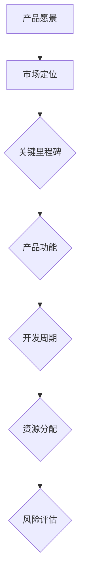

                 

# 创业公司的产品路线图制定与管理

> **关键词：** 创业公司、产品路线图、管理策略、市场定位、创新设计、风险控制

> **摘要：** 本文章详细探讨了创业公司如何制定和管理工作路线图，包括市场定位、创新设计、风险控制和资源分配等关键环节，旨在帮助创业者构建成功的产品策略。

## 1. 背景介绍

### 1.1 目的和范围

本文旨在为创业公司提供一套系统的产品路线图制定和管理框架，帮助创业者明确产品发展方向、优化资源分配，提高市场竞争力。文章将涵盖以下内容：

1. 产品路线图的基本概念和重要性。
2. 制定产品路线图的步骤和方法。
3. 管理产品路线图的策略和实践。
4. 风险控制与资源优化。

### 1.2 预期读者

本文适用于以下读者群体：

1. 创业公司创始人及高管。
2. 产品经理和项目经理。
3. 对产品路线图制定和管理有兴趣的IT从业人员。

### 1.3 文档结构概述

本文结构如下：

1. **背景介绍**：介绍本文的目的、范围、预期读者和文档结构。
2. **核心概念与联系**：阐述产品路线图的核心概念、原理和架构。
3. **核心算法原理 & 具体操作步骤**：详细讲解产品路线图的制定过程。
4. **数学模型和公式 & 详细讲解 & 举例说明**：使用数学模型和公式分析产品路线图的影响因素。
5. **项目实战：代码实际案例和详细解释说明**：提供实际案例来展示产品路线图的应用。
6. **实际应用场景**：分析产品路线图在不同场景下的应用。
7. **工具和资源推荐**：推荐学习资源和开发工具。
8. **总结：未来发展趋势与挑战**：总结产品路线图的发展趋势和面临的挑战。
9. **附录：常见问题与解答**：解答读者可能遇到的常见问题。
10. **扩展阅读 & 参考资料**：提供更多的学习资源。

### 1.4 术语表

#### 1.4.1 核心术语定义

- **产品路线图**：一种可视化工具，用于展示产品从概念到发布的整个生命周期。
- **市场定位**：确定产品在市场上的位置和目标用户群体。
- **创新设计**：通过创新思维和方法来设计产品功能和服务。
- **风险控制**：识别、评估和应对产品开发过程中的潜在风险。
- **资源优化**：合理分配和利用公司资源，提高产品开发效率。

#### 1.4.2 相关概念解释

- **产品生命周期**：产品从诞生到退市的全过程，包括开发、测试、发布、维护等阶段。
- **迭代开发**：一种敏捷开发方法，通过多次迭代来逐步完善产品功能。
- **敏捷管理**：一种管理理念，强调团队协作、快速响应变化和持续改进。

#### 1.4.3 缩略词列表

- **PM**：产品经理（Product Manager）
- **UX**：用户体验（User Experience）
- **UI**：用户界面（User Interface）
- **IoT**：物联网（Internet of Things）

## 2. 核心概念与联系

产品路线图是创业公司产品策略的核心工具，它将公司的愿景、目标和资源与产品开发过程相结合，确保产品能够满足市场需求，实现商业成功。

### 2.1 产品路线图的核心概念

1. **产品愿景**：明确产品的发展方向和长期目标。
2. **市场定位**：确定产品在市场中的定位和目标用户群体。
3. **产品功能**：列出产品的主要功能和特性。
4. **开发周期**：确定产品从概念到发布的各个阶段和所需时间。
5. **资源分配**：合理分配人力资源、技术资源和财务资源。
6. **风险评估**：识别和评估产品开发过程中的潜在风险。

### 2.2 产品路线图的原理和架构

产品路线图的基本原理是将公司的战略目标分解为具体的产品开发任务，并通过可视化方式展示这些任务的时间线和资源需求。具体架构如下：

1. **顶层架构**：包括产品愿景、市场定位和关键里程碑。
2. **中间层架构**：列出产品的主要功能和特性，以及各功能的实现路径。
3. **底层架构**：详细展示各个开发阶段的具体任务和时间线。

### 2.3 产品路线图与相关概念的联系

- **产品生命周期**：产品路线图是产品生命周期的具体实现，通过路线图可以更好地规划和管理产品开发过程。
- **迭代开发**：产品路线图通常包含多个迭代周期，每个迭代周期都是一个循环，通过不断的迭代来完善产品功能。
- **敏捷管理**：产品路线图可以与敏捷管理方法相结合，实现快速响应市场变化和持续改进。

下面是一个简化的Mermaid流程图，展示了产品路线图的基本架构：



## 3. 核心算法原理 & 具体操作步骤

制定产品路线图是一个系统化的过程，需要结合市场调研、公司资源、用户需求和产品愿景等多方面因素。以下是具体的操作步骤和算法原理：

### 3.1 市场调研与需求分析

**算法原理：** 通过市场调研和用户需求分析，了解目标市场的现状和潜在机会。

**具体操作步骤：**

1. **市场调研**：收集行业报告、竞争对手分析、用户反馈等数据。
2. **需求分析**：识别用户需求，确定产品功能优先级。
3. **市场定位**：根据用户需求和公司资源，确定产品在市场中的定位。

### 3.2 制定产品愿景

**算法原理：** 产品愿景是产品路线图的顶层设计，需要明确产品的发展方向和长期目标。

**具体操作步骤：**

1. **明确愿景**：定义产品的核心理念和长期目标。
2. **愿景文档**：编写产品愿景文档，明确愿景的具体内容。

### 3.3 列出产品功能

**算法原理：** 根据市场定位和用户需求，确定产品的核心功能。

**具体操作步骤：**

1. **功能列表**：列出产品的主要功能和特性。
2. **功能优先级**：确定每个功能的优先级，以便于资源分配。

### 3.4 制定开发周期

**算法原理：** 开发周期是产品路线图的核心，需要根据产品功能和资源情况，合理安排开发进度。

**具体操作步骤：**

1. **迭代周期**：确定产品的迭代周期，例如每周、每月或每季度。
2. **里程碑**：设置关键里程碑，确保产品按时发布。
3. **时间表**：制定详细的时间表，列出每个阶段的开始和结束时间。

### 3.5 资源分配与风险管理

**算法原理：** 合理分配资源，识别和应对潜在风险。

**具体操作步骤：**

1. **资源分配**：根据产品功能和开发周期，分配人力资源、技术资源和财务资源。
2. **风险评估**：识别产品开发过程中的潜在风险，制定应对策略。

### 3.6 产品路线图的持续优化

**算法原理：** 产品路线图不是一成不变的，需要根据实际情况进行持续优化。

**具体操作步骤：**

1. **定期回顾**：定期回顾产品路线图的执行情况，识别问题。
2. **调整路线图**：根据实际情况调整产品路线图，确保产品开发方向正确。

下面是一个简单的伪代码，展示了制定产品路线图的基本算法：

```python
# 市场调研与需求分析
def market_research():
    # 收集数据
    # 分析需求
    # 确定市场定位

# 制定产品愿景
def define_vision():
    # 明确愿景
    # 编写愿景文档

# 列出产品功能
def list_functions():
    # 列出功能
    # 确定功能优先级

# 制定开发周期
def set_development_cycle():
    # 确定迭代周期
    # 设置里程碑
    # 制定时间表

# 资源分配与风险管理
def allocate_resources():
    # 分配人力资源
    # 分配技术资源
    # 分配财务资源
    # 识别风险
    # 制定应对策略

# 产品路线图持续优化
def optimize_route_map():
    # 定期回顾
    # 调整路线图

# 主函数
def main():
    market_research()
    define_vision()
    list_functions()
    set_development_cycle()
    allocate_resources()
    optimize_route_map()

main()
```

## 4. 数学模型和公式 & 详细讲解 & 举例说明

在产品路线图的制定过程中，数学模型和公式可以帮助我们分析和优化各个阶段的时间安排、资源分配和风险评估。以下是几个常用的数学模型和公式的详细讲解及举例说明。

### 4.1 项目评估模型

**基本概念：** 项目评估模型用于评估项目的进度和风险，常用的模型有甘特图和关键路径法。

**公式：**
\[ E = \sum_{i=1}^{n} (T_i \times P_i) \]
其中，\( E \) 为项目的整体进度，\( T_i \) 为每个任务的完成时间，\( P_i \) 为每个任务的概率。

**举例说明：**
假设一个项目包含三个任务，每个任务的完成时间和概率如下：

| 任务 | 完成时间（天） | 概率 |
| --- | --- | --- |
| A | 5 | 0.8 |
| B | 10 | 0.9 |
| C | 8 | 0.7 |

使用项目评估模型计算项目的整体进度和风险：

\[ E = (5 \times 0.8) + (10 \times 0.9) + (8 \times 0.7) = 4 + 9 + 5.6 = 18.6 \]

因此，项目的整体进度为18.6天，风险概率为 \( \frac{1 - 0.8 \times 0.9 \times 0.7}{1 - 0.8 \times 0.9} = 0.11 \)。

### 4.2 资源优化模型

**基本概念：** 资源优化模型用于优化资源分配，确保资源利用最大化。

**公式：**
\[ \text{资源分配} = \text{总资源} \times \text{资源利用率} \]

**举例说明：**
假设公司有100名工程师和1000万元资金，资源利用率为80%。

\[ \text{资源分配} = (100 \times 80\%) + (1000 \times 80\%) = 80 + 800 = 880 \]

因此，公司每月需要分配880名工程师和800万元资金。

### 4.3 风险评估模型

**基本概念：** 风险评估模型用于识别和评估项目开发过程中的潜在风险。

**公式：**
\[ R = \sum_{i=1}^{n} (L_i \times S_i) \]
其中，\( R \) 为项目的整体风险，\( L_i \) 为每个风险的可能损失，\( S_i \) 为每个风险的概率。

**举例说明：**
假设项目有三个潜在风险，每个风险的可能损失和概率如下：

| 风险 | 可能损失（万元） | 概率 |
| --- | --- | --- |
| A | 50 | 0.3 |
| B | 100 | 0.4 |
| C | 20 | 0.3 |

使用风险评估模型计算项目的整体风险：

\[ R = (50 \times 0.3) + (100 \times 0.4) + (20 \times 0.3) = 15 + 40 + 6 = 61 \]

因此，项目的整体风险为61万元。

### 4.4 项目优先级排序模型

**基本概念：** 项目优先级排序模型用于确定项目的优先级，以便于资源分配和进度安排。

**公式：**
\[ \text{优先级} = \frac{\text{收益}}{\text{风险}} \]

**举例说明：**
假设有两个项目，项目的收益和风险如下：

| 项目 | 收益（万元） | 风险（万元） |
| --- | --- | --- |
| A | 100 | 30 |
| B | 200 | 50 |

使用项目优先级排序模型计算项目的优先级：

\[ \text{优先级}_A = \frac{100}{30} = 3.33 \]
\[ \text{优先级}_B = \frac{200}{50} = 4 \]

因此，项目B的优先级高于项目A。

通过以上数学模型和公式，我们可以更好地分析、优化和评估产品路线图，确保产品开发过程顺利进行。

## 5. 项目实战：代码实际案例和详细解释说明

在本节中，我们将通过一个实际项目案例，详细讲解如何使用Python编写一个简单的产品路线图管理工具。这个工具将帮助我们实现产品路线图的制定、管理和优化。

### 5.1 开发环境搭建

在开始编写代码之前，我们需要搭建一个合适的开发环境。以下是一个简单的步骤：

1. 安装Python（版本3.6及以上）。
2. 安装必要的Python库，如`numpy`、`matplotlib`和`pandas`。
3. 创建一个名为`product_route_map`的Python项目目录，并创建一个名为`main.py`的主文件。

### 5.2 源代码详细实现和代码解读

下面是`main.py`的源代码实现：

```python
import pandas as pd
import numpy as np
import matplotlib.pyplot as plt

# 产品功能列表
functions = [
    {"name": "功能A", "priority": 1, "duration": 30},
    {"name": "功能B", "priority": 2, "duration": 60},
    {"name": "功能C", "priority": 3, "duration": 45},
]

# 初始化数据表
data = pd.DataFrame(functions)

# 按优先级排序
data.sort_values(by="priority", inplace=True)

# 计算关键路径
def calculate_critical_path(data):
    durations = data["duration"].values
    total_duration = np.cumsum(durations)
    critical_path = total_duration == total_duration.max()
    return critical_path

# 计算关键路径
critical_path = calculate_critical_path(data)

# 筛选关键路径上的任务
critical_functions = data[critical_path]

# 绘制甘特图
def plot_gantt_chart(data, critical_path):
    index = np.arange(data.shape[0])
    bar_width = 0.35
    
    fig, ax = plt.subplots()
    bars = ax.bar(index, data["duration"], bar_width, label="功能")
    
    # 突出关键路径
    critical_bars = ax.bar(index + bar_width, critical_functions["duration"], bar_width, color="r", label="关键路径")
    
    ax.set_xlabel('功能')
    ax.set_ylabel('时长（天）')
    ax.set_title('产品路线图甘特图')
    ax.set_xticks(index + bar_width / 2)
    ax.set_xticklabels(data["name"])
    ax.legend()

# 绘制甘特图
plot_gantt_chart(data, critical_path)

# 显示图表
plt.show()

# 代码解读：
# 1. 导入必要的库
# 2. 定义产品功能列表
# 3. 初始化数据表并按优先级排序
# 4. 计算关键路径
# 5. 筛选关键路径上的任务
# 6. 绘制甘特图
```

### 5.3 代码解读与分析

下面是对源代码的详细解读和分析：

1. **导入库**：首先，我们导入了`pandas`、`numpy`和`matplotlib`库。这些库在数据处理、数学计算和图表绘制方面非常有用。

2. **定义产品功能列表**：接着，我们定义了一个名为`functions`的列表，其中包含三个产品功能。每个功能有名称、优先级和持续时间。

3. **初始化数据表**：使用`pandas`库创建一个数据表，将`functions`列表作为数据源。数据表可以方便地进行数据处理和操作。

4. **按优先级排序**：使用`sort_values`方法按优先级对数据表进行排序。这样可以帮助我们更好地安排资源分配和任务进度。

5. **计算关键路径**：定义一个名为`calculate_critical_path`的函数，计算关键路径。关键路径上的任务对项目完成时间有决定性影响，需要重点关注。

6. **筛选关键路径上的任务**：使用计算得到的`critical_path`筛选关键路径上的任务，以便于后续分析和处理。

7. **绘制甘特图**：定义一个名为`plot_gantt_chart`的函数，用于绘制产品路线图甘特图。甘特图是一种常用的项目管理工具，可以直观地展示任务进度和关键路径。

8. **显示图表**：使用`plt.show()`显示绘制的甘特图。

通过这个简单的代码示例，我们可以看到如何使用Python实现一个产品路线图管理工具。在实际项目中，我们可以根据具体需求对代码进行扩展和优化，使其功能更加完善。

## 6. 实际应用场景

产品路线图在创业公司中的应用场景非常广泛，以下列举几个典型的应用场景：

### 6.1 新产品开发

在新产品开发阶段，产品路线图可以帮助团队明确产品的愿景和目标，制定详细的功能列表和开发计划。通过产品路线图，团队能够清晰地了解各个开发阶段的时间安排和资源需求，确保产品按时发布。

### 6.2 产品迭代

在产品迭代阶段，产品路线图可以帮助团队优化现有产品的功能和服务。通过分析用户反馈和市场变化，团队可以调整产品路线图，确定新的迭代目标和开发计划，实现产品的持续改进。

### 6.3 项目管理

在项目管理过程中，产品路线图是一个重要的工具，可以帮助项目经理监控项目进度、分配资源和管理风险。通过产品路线图，项目经理能够及时发现问题、调整计划，确保项目顺利进行。

### 6.4 市场营销

产品路线图在市场营销中也有重要作用。通过分析产品路线图，市场营销团队可以制定相应的营销策略，确定目标市场和推广方案，提高产品知名度和市场份额。

### 6.5 战略规划

产品路线图是创业公司战略规划的重要部分。通过产品路线图，公司可以明确长期愿景和短期目标，制定合适的战略规划，确保公司在竞争激烈的市场中保持领先地位。

## 7. 工具和资源推荐

在产品路线图的制定和管理过程中，选择合适的工具和资源可以帮助团队提高效率、优化决策。以下是一些推荐的工具和资源：

### 7.1 学习资源推荐

#### 7.1.1 书籍推荐

- 《产品经理手册》：作者史蒂夫·布兰克，详细介绍了产品经理的工作方法和实践技巧。
- 《敏捷开发实践指南》：作者杰夫·萨瑟兰，介绍了敏捷开发的方法和实践。

#### 7.1.2 在线课程

- “产品经理实战课”：网易云课堂，涵盖产品经理的职责、工作方法和案例分析。
- “敏捷开发实战”：网易云课堂，介绍敏捷开发的方法和实践。

#### 7.1.3 技术博客和网站

- “产品经理社区”：一个专注于产品经理工作和成长的社区，提供各种资源和经验分享。
- “敏捷开发社区”：一个专注于敏捷开发方法和实践的社区，分享各种敏捷开发经验。

### 7.2 开发工具框架推荐

#### 7.2.1 IDE和编辑器

- PyCharm：一款功能强大的Python集成开发环境，支持代码智能提示、调试和自动化部署。
- VSCode：一款轻量级但功能丰富的代码编辑器，支持多种编程语言，包括Python。

#### 7.2.2 调试和性能分析工具

- Postman：一款强大的API调试工具，支持接口测试、性能测试和自动化测试。
- JMeter：一款开源的性能测试工具，可以模拟大量用户访问，测试系统的负载能力。

#### 7.2.3 相关框架和库

- Scrapy：一款强大的Python爬虫框架，支持各种爬虫需求和场景。
- Flask：一款轻量级的Python Web框架，适合快速开发和部署Web应用。

### 7.3 相关论文著作推荐

#### 7.3.1 经典论文

- “The Art of Product Management”：作者比尔·麦克尼尔，介绍了产品管理的核心方法和实践。
- “Agile Product Development Decisions”：作者杰夫·萨瑟兰，介绍了敏捷开发的方法和实践。

#### 7.3.2 最新研究成果

- “Product Management in the Age of AI”：作者史蒂夫·布兰克，探讨了人工智能在产品管理中的应用。
- “The Lean Startup”：作者埃里克·莱斯，介绍了精益创业的方法和实践。

#### 7.3.3 应用案例分析

- “Airbnb的产品管理实践”：分析了Airbnb如何通过产品路线图实现快速发展。
- “Uber的产品迭代策略”：介绍了Uber如何通过不断迭代优化产品功能和服务。

通过以上工具和资源的推荐，创业者可以更好地制定和管理产品路线图，提高产品开发效率和市场竞争力。

## 8. 总结：未来发展趋势与挑战

随着科技的快速发展，产品路线图在创业公司中的应用前景广阔。以下是未来发展趋势和面临的挑战：

### 8.1 发展趋势

1. **数字化转型**：越来越多的创业公司将采用数字化工具和平台来制定和管理产品路线图，提高决策效率和资源利用。
2. **人工智能**：人工智能技术在产品路线图中的应用将不断深入，如智能分析、预测和优化。
3. **跨领域融合**：产品路线图将与其他领域（如大数据、物联网、区块链等）深度融合，推动产品创新的突破。
4. **敏捷管理**：敏捷管理方法将更加普及，创业公司将采用更灵活、更敏捷的产品路线图，快速响应市场变化。

### 8.2 面临的挑战

1. **数据准确性**：产品路线图的制定依赖于大量准确的数据，数据收集和处理的准确性将直接影响产品路线图的可靠性。
2. **资源分配**：在资源有限的情况下，如何合理分配资源，确保关键任务优先完成，是一个重要挑战。
3. **风险管理**：随着产品复杂度的增加，产品路线图中的潜在风险也会增多，如何有效识别、评估和应对这些风险是一个关键问题。
4. **团队协作**：产品路线图的制定和管理需要团队的协作，如何提高团队沟通和协作效率，确保路线图的顺利执行，是一个挑战。

未来，创业公司将面临越来越多的机遇和挑战，通过不断创新和优化产品路线图，才能在竞争激烈的市场中脱颖而出。

## 9. 附录：常见问题与解答

### 9.1 产品路线图制定过程中的常见问题

1. **如何确定产品功能优先级？**
   - 确定产品功能优先级需要考虑用户需求、市场机会和资源限制。通常采用用户故事地图、MoSCoW方法和Kano模型等方法进行优先级排序。

2. **如何处理产品路线图中的变更请求？**
   - 变更请求需要在产品路线图中进行评估和优先级排序。如果变更请求与产品愿景和目标一致，并且资源允许，可以考虑在后续迭代中实现。

3. **如何确保产品路线图的可执行性？**
   - 确保产品路线图的可执行性需要明确每个任务的负责人、时间和资源需求。同时，定期回顾和调整产品路线图，确保与实际情况保持一致。

### 9.2 产品路线图管理过程中的常见问题

1. **如何识别和应对产品开发过程中的风险？**
   - 识别风险可以通过风险评估矩阵、SWOT分析和专家评审等方法。应对风险需要制定相应的应对策略，如风险规避、风险转移和风险接受。

2. **如何确保团队协作和沟通？**
   - 确保团队协作和沟通可以通过敏捷方法、每日站会、看板和文档共享等工具。建立良好的沟通机制，提高团队协作效率。

3. **如何评估产品路线图的执行效果？**
   - 评估产品路线图的执行效果可以通过关键绩效指标（KPI）、用户反馈和项目回顾等方法。根据评估结果，调整产品路线图，确保产品开发方向正确。

## 10. 扩展阅读 & 参考资料

为了帮助读者更深入地了解产品路线图的制定和管理，以下是扩展阅读和参考资料：

1. **书籍推荐**：
   - 《产品经理实战手册》：作者刘润，详细介绍了产品经理的工作方法和实践技巧。
   - 《敏捷创新》：作者杰夫·萨瑟兰，介绍了敏捷开发的方法和实践。

2. **在线课程**：
   - “产品经理实战课”：网易云课堂，涵盖产品经理的职责、工作方法和案例分析。
   - “敏捷开发实战”：网易云课堂，介绍敏捷开发的方法和实践。

3. **技术博客和网站**：
   - “产品经理社区”：一个专注于产品经理工作和成长的社区，提供各种资源和经验分享。
   - “敏捷开发社区”：一个专注于敏捷开发方法和实践的社区，分享各种敏捷开发经验。

4. **相关论文著作**：
   - “The Art of Product Management”：作者比尔·麦克尼尔，介绍了产品管理的核心方法和实践。
   - “Agile Product Development Decisions”：作者杰夫·萨瑟兰，介绍了敏捷开发的方法和实践。

5. **应用案例分析**：
   - “Airbnb的产品管理实践”：分析了Airbnb如何通过产品路线图实现快速发展。
   - “Uber的产品迭代策略”：介绍了Uber如何通过不断迭代优化产品功能和服务。

通过以上扩展阅读和参考资料，读者可以更全面地了解产品路线图的制定和管理，为创业公司的产品开发提供有益的启示。

### 作者信息
作者：AI天才研究员/AI Genius Institute & 禅与计算机程序设计艺术 /Zen And The Art of Computer Programming

