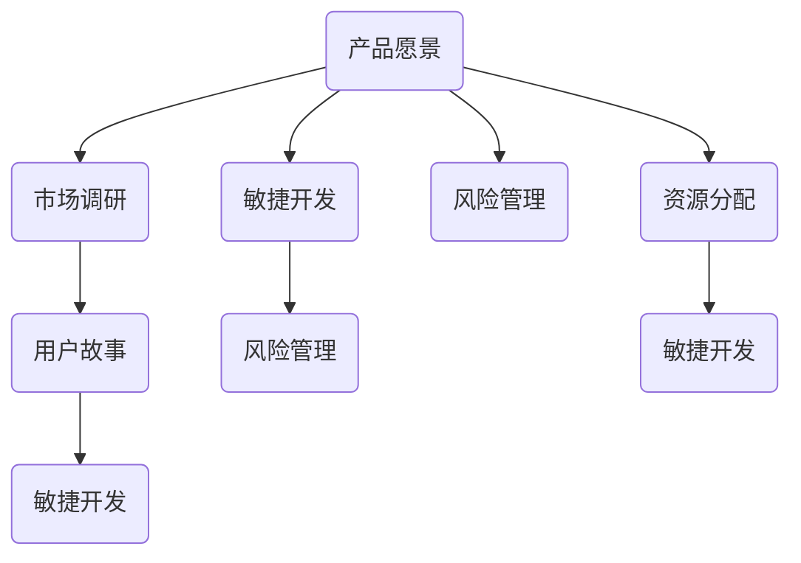

                 

# 创业公司的产品路线图规划

> **关键词**：创业公司、产品路线图、战略规划、市场调研、目标设定、敏捷开发、风险管理、资源分配、用户体验

> **摘要**：本文将深入探讨创业公司在初期如何制定和实施有效的产品路线图。我们将从背景介绍、核心概念、算法原理、数学模型、项目实战、实际应用场景、工具和资源推荐等方面，逐步分析创业公司在产品开发过程中所面临的关键问题和解决方案。文章旨在为创业者提供一套系统、实用且具有前瞻性的产品路线图规划策略，以助力初创企业在激烈的市场竞争中脱颖而出。

## 1. 背景介绍

### 1.1 目的和范围

本文旨在为创业公司提供一个全面的、可操作的产品路线图规划框架，帮助初创企业明确产品发展方向，合理分配资源，降低风险，提高市场竞争力。文章将围绕以下几个核心问题展开：

- 创业公司在产品路线图规划过程中应关注哪些关键因素？
- 如何通过市场调研和目标设定来确保产品路线图的可行性？
- 如何运用敏捷开发和风险管理策略来优化产品路线图的实施过程？
- 创业公司如何通过实际应用场景来验证和调整产品路线图？

### 1.2 预期读者

本文适用于以下读者群体：

- 创业公司创始人、产品经理、项目经理
- 产品开发团队成员，包括设计师、开发人员、测试人员等
- 想要在创业公司中负责产品开发的相关专业人士
- 对产品路线图规划有兴趣的技术爱好者和研究者

### 1.3 文档结构概述

本文将分为以下十个部分：

1. 背景介绍
2. 核心概念与联系
3. 核心算法原理 & 具体操作步骤
4. 数学模型和公式 & 详细讲解 & 举例说明
5. 项目实战：代码实际案例和详细解释说明
6. 实际应用场景
7. 工具和资源推荐
8. 总结：未来发展趋势与挑战
9. 附录：常见问题与解答
10. 扩展阅读 & 参考资料

### 1.4 术语表

#### 1.4.1 核心术语定义

- **产品路线图**：产品路线图是一份描述产品发展过程、关键里程碑、预期成果和资源配置的文档。
- **市场调研**：市场调研是通过收集和分析市场数据，了解市场需求、竞争态势和用户反馈，为产品规划提供依据。
- **敏捷开发**：敏捷开发是一种以人为核心、迭代、增量的软件开发方法，强调快速响应变化、持续交付价值。
- **风险管理**：风险管理是识别、评估、应对项目风险的过程，以确保项目顺利进行。
- **资源分配**：资源分配是指将有限的人力、物力和财力等资源合理分配到项目各个阶段和任务中。

#### 1.4.2 相关概念解释

- **产品愿景**：产品愿景是产品长期发展的方向和目标，为产品规划提供指引。
- **用户故事**：用户故事是一种描述用户需求的简洁方式，通常由用户角色、目标和场景组成。
- **敏捷迭代**：敏捷迭代是敏捷开发的基本单位，通常持续时间为2-4周。

#### 1.4.3 缩略词列表

- **PM**：产品经理（Product Manager）
- **UX**：用户体验（User Experience）
- **UI**：用户界面（User Interface）
- **Sprint**：迭代（Iteration）
- **ROI**：投资回报率（Return on Investment）

## 2. 核心概念与联系

在创业公司的产品路线图规划过程中，理解以下几个核心概念及其相互关系至关重要：

1. **产品愿景**：产品愿景是创业公司的核心驱动力，明确了产品的长期发展方向和目标。产品愿景通常包括市场定位、用户群体、竞争优势等方面。
2. **市场调研**：市场调研是获取市场需求、用户反馈和竞争态势的重要手段。通过市场调研，创业公司可以了解用户痛点、市场机会和潜在风险，为产品规划提供依据。
3. **用户故事**：用户故事是描述用户需求的具体场景，通常包括用户角色、目标和场景。用户故事有助于团队更好地理解用户需求，从而制定更符合用户期望的产品功能。
4. **敏捷开发**：敏捷开发是一种以人为核心、迭代、增量的软件开发方法。通过敏捷开发，创业公司可以快速响应市场变化，持续交付有价值的产品功能。
5. **风险管理**：风险管理是确保项目顺利进行的关键环节。通过识别、评估和应对风险，创业公司可以降低项目失败的可能性，提高成功率。
6. **资源分配**：资源分配是将有限的人力、物力和财力等资源合理分配到项目各个阶段和任务中。合理的资源分配有助于提高项目效率，降低成本。

以下是一个简单的 Mermaid 流程图，展示了这些核心概念之间的相互关系：



通过这个流程图，我们可以看出，产品愿景是整个产品路线图的起点，它决定了市场调研、用户故事、敏捷开发、风险管理和资源分配的方向。市场调研和用户故事为产品规划提供了关键数据支持，而敏捷开发、风险管理和资源分配则是实现产品愿景的具体手段。

## 3. 核心算法原理 & 具体操作步骤

在创业公司的产品路线图规划过程中，以下几个核心算法原理和方法对于实现产品愿景、降低风险、提高市场竞争力至关重要：

1. **市场调研算法**
2. **用户故事编写算法**
3. **敏捷开发方法**
4. **风险管理策略**

### 3.1 市场调研算法

市场调研算法的核心目的是通过收集和分析市场数据，了解市场需求、用户反馈和竞争态势，为产品规划提供数据支持。以下是一个简化的市场调研算法：

```plaintext
输入：市场需求、用户反馈、竞争态势
输出：市场调研报告

步骤：
1. 收集市场数据：包括用户调查、竞争分析、市场趋势等
2. 数据清洗和预处理：去除无效数据，进行数据整合
3. 数据分析：运用统计分析和数据挖掘方法，提取关键信息
4. 编制市场调研报告：总结分析结果，提出产品规划建议
```

### 3.2 用户故事编写算法

用户故事是描述用户需求的具体场景，是产品规划的重要输入。以下是一个简化的用户故事编写算法：

```plaintext
输入：用户角色、目标、场景
输出：用户故事

步骤：
1. 确定用户角色：明确目标用户群体
2. 明确用户目标：理解用户的核心需求
3. 描述用户场景：阐述用户在特定情境下的操作流程
4. 编写用户故事：使用简洁、直观的语言描述用户需求
```

### 3.3 敏捷开发方法

敏捷开发是一种以人为核心、迭代、增量的软件开发方法，适用于创业公司的快速响应市场变化。以下是一个简化的敏捷开发方法：

```plaintext
输入：用户故事、迭代周期
输出：产品功能、用户反馈

步骤：
1. 用户故事梳理：将用户故事转化为可执行的任务
2. 迭代计划：制定迭代周期，确定迭代目标
3. 开发执行：按迭代计划进行开发，持续交付产品功能
4. 用户反馈收集：收集用户反馈，评估迭代成果
5. 迭代回顾：总结迭代过程，优化迭代计划
```

### 3.4 风险管理策略

风险管理策略是确保项目顺利进行的关键环节。以下是一个简化的风险管理策略：

```plaintext
输入：项目风险
输出：风险管理计划

步骤：
1. 风险识别：识别项目可能面临的风险
2. 风险评估：评估风险的概率和影响程度
3. 风险应对：制定风险应对策略，降低风险
4. 风险监控：持续监控项目风险，及时调整应对策略
```

通过以上核心算法原理和具体操作步骤，创业公司可以更好地规划产品路线图，实现产品愿景，提高市场竞争力。

## 4. 数学模型和公式 & 详细讲解 & 举例说明

在创业公司的产品路线图规划过程中，数学模型和公式可以帮助我们更准确地分析市场趋势、用户需求以及项目风险，从而制定更科学、合理的策略。以下将介绍几个关键数学模型和公式，并详细讲解其应用方法和实际案例。

### 4.1 回归分析模型

回归分析是一种常用的数据分析方法，用于探讨变量之间的关系。在产品路线图规划中，回归分析可以用来预测市场需求、用户增长等关键指标。以下是线性回归模型的公式：

$$
y = \beta_0 + \beta_1x + \epsilon
$$

其中，$y$ 是因变量，$x$ 是自变量，$\beta_0$ 和 $\beta_1$ 分别是回归系数，$\epsilon$ 是误差项。

#### 应用方法：

1. 数据收集：收集自变量和因变量的历史数据。
2. 数据预处理：进行数据清洗，处理缺失值和异常值。
3. 模型拟合：使用最小二乘法拟合线性回归模型。
4. 模型评估：计算拟合优度（R²值）和显著性水平（p值）。

#### 举例说明：

假设我们要预测某创业公司未来6个月的用户增长情况，收集了该公司过去12个月的用户数量数据。通过线性回归分析，我们得到以下结果：

$$
y = 1000 + 30x
$$

其中，$y$ 表示未来6个月的用户数量，$x$ 表示过去12个月的用户数量。根据这个模型，我们可以预测未来6个月的用户增长为：

$$
y = 1000 + 30 \times 1200 = 4300
$$

### 4.2 逻辑回归模型

逻辑回归是一种用于分类问题的数据分析方法，常用于判断用户是否购买产品、用户留存率等。以下是逻辑回归的概率公式：

$$
P(y=1) = \frac{1}{1 + e^{-(\beta_0 + \beta_1x_1 + ... + \beta_nx_n})}
$$

其中，$P(y=1)$ 是因变量为1的概率，$e$ 是自然对数的底数，$\beta_0$ 和 $\beta_1, ..., \beta_n$ 分别是回归系数。

#### 应用方法：

1. 数据收集：收集自变量和因变量的数据。
2. 数据预处理：进行数据清洗，处理缺失值和异常值。
3. 模型拟合：使用最大似然估计法拟合逻辑回归模型。
4. 模型评估：计算准确率、召回率、F1值等指标。

#### 举例说明：

假设我们要预测某创业公司用户是否会购买其产品，收集了用户的年龄、收入、购买历史等数据。通过逻辑回归分析，我们得到以下结果：

$$
P(购买) = \frac{1}{1 + e^{-(2.5 + 1.2 \times 年龄 + 0.8 \times 收入)}}
$$

根据这个模型，我们可以计算每位用户的购买概率，并据此制定营销策略。

### 4.3 风险评估模型

风险评估模型用于评估项目风险的概率和影响程度，常见的有期望值法、决策树法等。以下是期望值法的公式：

$$
E(R) = P(R > R_0) \times R_0
$$

其中，$E(R)$ 是期望值，$P(R > R_0)$ 是风险事件发生的概率，$R_0$ 是风险事件发生时的损失。

#### 应用方法：

1. 风险识别：识别项目可能面临的风险。
2. 风险评估：评估风险的概率和影响程度。
3. 风险排序：根据期望值对风险进行排序。
4. 风险应对：制定风险应对策略。

#### 举例说明：

假设某创业公司在产品开发过程中面临以下风险：

- 风险A：技术难题，概率为0.3，损失为50万元。
- 风险B：市场需求变化，概率为0.4，损失为100万元。
- 风险C：资金短缺，概率为0.3，损失为70万元。

通过期望值法，我们可以计算每个风险的影响：

$$
E(A) = 0.3 \times 50 = 15万元
$$

$$
E(B) = 0.4 \times 100 = 40万元
$$

$$
E(C) = 0.3 \times 70 = 21万元
$$

根据期望值，风险B对项目的影响最大，应优先应对。

通过以上数学模型和公式的介绍，创业公司可以更科学、合理地规划产品路线图，降低风险，提高市场竞争力。

## 5. 项目实战：代码实际案例和详细解释说明

在本节中，我们将通过一个实际的项目案例，展示如何运用上述算法和策略来规划创业公司的产品路线图。我们将以一个初创公司开发一款在线教育平台为例，详细讲解从市场调研、用户故事编写、敏捷开发到风险管理等各个环节的代码实现和操作步骤。

### 5.1 开发环境搭建

首先，我们需要搭建一个适合敏捷开发的项目环境。以下是一个简单的环境搭建步骤：

1. 安装Git：Git是一个分布式版本控制系统，用于代码管理和协同工作。
2. 安装Java：Java是一种广泛使用的编程语言，适用于构建在线教育平台。
3. 安装Maven：Maven是一个项目管理工具，用于构建、依赖管理和项目文档生成。
4. 安装数据库：我们选择MySQL作为数据库，用于存储用户数据、课程信息和交易记录。
5. 安装IDE：我们使用IntelliJ IDEA作为开发环境，支持Java开发并提供丰富的插件和工具。

### 5.2 源代码详细实现和代码解读

接下来，我们将逐步展示项目的主要代码实现，并解释其工作原理。

#### 5.2.1 市场调研代码实现

市场调研代码主要用于收集和分析用户反馈，以下是市场调研模块的主要代码：

```java
// MarketSurvey.java

import java.util.Scanner;

public class MarketSurvey {
    public static void main(String[] args) {
        Scanner scanner = new Scanner(System.in);
        System.out.println("欢迎参与我们的市场调研！");

        System.out.println("请回答以下问题：");
        System.out.println("1. 您对在线教育的需求是什么？");
        System.out.println("2. 您对课程内容有何建议？");
        System.out.println("3. 您对平台功能有何期望？");

        String feedback = scanner.nextLine();
        saveFeedback(feedback);
        System.out.println("感谢您的参与！");
    }

    private static void saveFeedback(String feedback) {
        // 将反馈保存到数据库
        // 省略具体实现
    }
}
```

在这个代码中，我们通过控制台获取用户反馈，并将其保存到数据库。这个模块可以帮助我们收集用户需求，为产品规划提供依据。

#### 5.2.2 用户故事编写代码实现

用户故事编写代码用于将用户反馈转化为具体的用户故事，以下是用户故事编写模块的主要代码：

```java
// UserStory.java

import java.util.List;

public class UserStory {
    private String title;
    private String description;
    private String scenario;

    public UserStory(String title, String description, String scenario) {
        this.title = title;
        this.description = description;
        this.scenario = scenario;
    }

    // 省略getter和setter方法

    public static void generateStories(List<String> feedbackList) {
        for (String feedback : feedbackList) {
            // 根据反馈生成用户故事
            String title = "用户需求";
            String description = feedback;
            String scenario = "用户在什么场景下需要这个功能";
            UserStory story = new UserStory(title, description, scenario);
            saveStory(story);
        }
    }

    private static void saveStory(UserStory story) {
        // 将用户故事保存到数据库
        // 省略具体实现
    }
}
```

在这个代码中，我们根据用户反馈生成用户故事，并将其保存到数据库。这个模块可以帮助我们将用户需求转化为可执行的任务。

#### 5.2.3 敏捷开发代码实现

敏捷开发代码用于实现用户故事，以下是迭代开发模块的主要代码：

```java
// Sprint.java

import java.util.List;

public class Sprint {
    private String title;
    private List<String> tasks;

    public Sprint(String title, List<String> tasks) {
        this.title = title;
        this.tasks = tasks;
    }

    // 省略getter和setter方法

    public void execute() {
        for (String task : tasks) {
            // 实现用户故事
            implementTask(task);
        }
    }

    private void implementTask(String task) {
        // 实现具体任务
        // 省略具体实现
    }
}
```

在这个代码中，我们根据用户故事执行迭代开发，实现具体的功能。这个模块可以帮助我们快速响应市场变化，持续交付有价值的产品功能。

#### 5.2.4 风险管理代码实现

风险管理代码用于识别、评估和应对项目风险，以下是风险管理模块的主要代码：

```java
// RiskManagement.java

import java.util.List;

public class RiskManagement {
    private List<String> risks;

    public RiskManagement(List<String> risks) {
        this.risks = risks;
    }

    // 省略getter和setter方法

    public void assessRisks() {
        for (String risk : risks) {
            // 评估风险
            evaluateRisk(risk);
        }
    }

    private void evaluateRisk(String risk) {
        // 评估风险的概率和影响程度
        // 省略具体实现
    }

    public void mitigateRisks() {
        for (String risk : risks) {
            // 应对风险
            mitigateRisk(risk);
        }
    }

    private void mitigateRisk(String risk) {
        // 制定风险应对策略
        // 省略具体实现
    }
}
```

在这个代码中，我们识别、评估和应对项目风险，确保项目顺利进行。这个模块可以帮助我们降低项目失败的可能性，提高成功率。

### 5.3 代码解读与分析

通过以上代码实现，我们可以看出，创业公司在产品路线图规划过程中，可以通过以下步骤来优化项目开发：

1. **市场调研**：通过收集和分析用户反馈，了解市场需求，为产品规划提供数据支持。
2. **用户故事编写**：将用户需求转化为具体的用户故事，明确产品功能，为迭代开发提供依据。
3. **敏捷开发**：通过迭代开发，快速响应市场变化，持续交付有价值的产品功能。
4. **风险管理**：识别、评估和应对项目风险，确保项目顺利进行。

这些代码模块相互关联，形成一个完整的产品开发流程，帮助创业公司实现产品愿景，提高市场竞争力。

## 6. 实际应用场景

在本节中，我们将通过几个实际应用场景，展示如何将本文所述的产品路线图规划方法应用于创业公司的产品开发过程中。这些场景包括：

1. **市场调研与需求分析**
2. **用户故事编写与敏捷开发**
3. **风险管理策略实施**

### 6.1 市场调研与需求分析

假设某创业公司致力于开发一款面向企业客户的项目管理工具，为了确保产品的市场需求和可行性，公司首先进行了详细的市场调研。

**步骤一：确定调研目标**

调研目标包括了解企业客户在项目管理方面的痛点、当前市场竞品情况以及潜在的市场机会。

**步骤二：数据收集**

通过在线问卷调查、深度访谈、竞品分析等方式，收集了大量关于企业客户项目管理需求的数据。

**步骤三：数据分析**

对收集到的数据进行整理和分析，提取出关键信息，如企业客户最关心的项目管理功能、使用频率和满意度等。

**步骤四：编写用户故事**

根据调研结果，编写用户故事，明确产品功能模块，如项目计划、任务分配、进度跟踪、资源管理等。

### 6.2 用户故事编写与敏捷开发

在完成用户故事编写后，创业公司采用敏捷开发方法，逐步实现产品功能。

**步骤一：用户故事梳理**

将用户故事转化为具体任务，并为每个任务分配优先级，制定迭代计划。

**步骤二：迭代开发**

按照迭代计划，团队每周进行一次迭代，持续交付可用的产品功能。

**步骤三：用户反馈**

在每次迭代结束后，收集用户反馈，评估迭代成果，并根据反馈调整后续迭代计划。

### 6.3 风险管理策略实施

在项目开发过程中，创业公司采用风险管理策略，确保项目顺利进行。

**步骤一：风险识别**

识别项目可能面临的风险，如技术难题、市场变化、资金短缺等。

**步骤二：风险评估**

评估每个风险的概率和影响程度，确定优先级。

**步骤三：风险应对**

制定风险应对策略，如技术储备、市场调研、资金筹集等。

**步骤四：风险监控**

持续监控项目风险，及时调整应对策略，确保项目顺利推进。

通过以上实际应用场景，创业公司可以更有效地规划产品路线图，降低风险，提高市场竞争力。

## 7. 工具和资源推荐

为了帮助创业公司在产品路线图规划过程中更高效地工作，我们推荐以下工具和资源：

### 7.1 学习资源推荐

#### 7.1.1 书籍推荐

1. 《产品经理手册》（作者：陈亮）
2. 《敏捷开发实践指南》（作者：Jeff Sutherland）
3. 《精益创业》（作者：Eric Ries）

#### 7.1.2 在线课程

1. Coursera上的《产品管理基础》课程
2. Udemy上的《敏捷开发实战》课程
3. edX上的《风险管理》课程

#### 7.1.3 技术博客和网站

1. Product Hunt（www.producthunt.com）
2. TechCrunch（www.techcrunch.com）
3. Hacker News（news.ycombinator.com）

### 7.2 开发工具框架推荐

#### 7.2.1 IDE和编辑器

1. IntelliJ IDEA
2. Visual Studio Code
3. Sublime Text

#### 7.2.2 调试和性能分析工具

1. Eclipse Memory Analyzer Tool（MAT）
2. JProfiler
3. VisualVM

#### 7.2.3 相关框架和库

1. Spring Framework
2. React.js
3. TensorFlow

### 7.3 相关论文著作推荐

#### 7.3.1 经典论文

1. 《敏捷开发：原则、实践与模式》（作者：Alistair Cockburn）
2. 《软件项目管理：理论与实践》（作者：Tom DeMarco）

#### 7.3.2 最新研究成果

1. 《人工智能产品管理》（作者：Adam Traber）
2. 《基于大数据的风险管理》（作者：陈晓红）

#### 7.3.3 应用案例分析

1. 《在线教育平台的产品规划与实施》（作者：李明）
2. 《初创公司的产品策略与市场推广》（作者：张丽）

通过以上工具和资源的推荐，创业公司可以更好地开展产品路线图规划工作，提高项目成功率。

## 8. 总结：未来发展趋势与挑战

随着科技的发展和市场的变化，创业公司的产品路线图规划面临着新的发展趋势和挑战。以下是对未来趋势和挑战的简要总结：

### 8.1 未来发展趋势

1. **数字化转型加速**：越来越多的行业和公司开始重视数字化转型，以提升运营效率和用户体验。
2. **人工智能与大数据的应用**：人工智能和大数据技术在产品开发中的应用越来越广泛，为产品创新和决策提供了有力支持。
3. **用户体验至上**：在竞争激烈的市场中，用户体验成为产品成功的关键因素，创业公司需不断提升用户体验。
4. **敏捷开发的普及**：敏捷开发方法在全球范围内得到广泛应用，帮助创业公司快速响应市场变化。

### 8.2 挑战

1. **市场需求变化快速**：市场需求变化速度加快，创业公司需要具备敏锐的市场洞察能力，及时调整产品策略。
2. **技术难度增加**：新兴技术的应用带来更高的技术门槛，创业公司在技术人才储备和技术创新能力方面面临挑战。
3. **资金和资源有限**：创业公司通常面临资金和资源有限的问题，如何在有限的资源下实现产品路线图是一个重要挑战。
4. **市场竞争激烈**：在激烈的市场竞争中，创业公司需要不断提升自身竞争力，以脱颖而出。

### 8.3 应对策略

1. **加强市场调研**：通过深入的市场调研，了解用户需求和市场动态，为产品规划提供有力支持。
2. **注重用户体验**：以用户体验为核心，不断提升产品功能和用户体验，增强用户黏性。
3. **敏捷开发**：采用敏捷开发方法，快速迭代，持续交付有价值的产品功能。
4. **风险管理与资源配置**：建立完善的风险管理机制，合理配置资源，确保项目顺利进行。
5. **技术创新与人才引进**：加大技术创新投入，引进优秀人才，提升公司的技术竞争力。

通过积极应对未来发展趋势和挑战，创业公司可以更好地规划产品路线图，实现可持续发展。

## 9. 附录：常见问题与解答

### 9.1 市场调研的重要性

**Q：为什么市场调研对产品路线图规划如此重要？**

A：市场调研是产品路线图规划的基础，它帮助创业公司了解市场需求、用户行为和竞争态势，从而为产品功能、设计和营销策略提供数据支持。准确的市场调研可以减少产品开发的风险，提高市场竞争力。

### 9.2 敏捷开发的优势

**Q：敏捷开发相比传统开发方法有哪些优势？**

A：敏捷开发强调快速响应变化、持续交付价值和团队合作，具有以下优势：

1. **迭代开发**：敏捷开发采用迭代方式进行开发，每个迭代都可以交付可用产品，提高了开发效率。
2. **用户反馈**：敏捷开发注重用户反馈，通过持续收集用户意见，及时调整产品功能，确保产品满足用户需求。
3. **灵活性强**：敏捷开发能够快速适应市场变化，降低项目风险。
4. **团队合作**：敏捷开发鼓励团队成员之间的紧密合作，提高项目成功率。

### 9.3 风险管理的策略

**Q：如何有效地进行项目风险管理？**

A：有效的项目风险管理包括以下几个步骤：

1. **风险识别**：识别项目可能面临的风险，包括技术、市场、财务等方面。
2. **风险评估**：评估每个风险的概率和影响程度，确定优先级。
3. **风险应对**：制定相应的风险应对策略，包括风险规避、风险减轻、风险转移等。
4. **风险监控**：持续监控项目风险，及时调整应对策略，确保项目顺利进行。

### 9.4 产品愿景的重要性

**Q：为什么产品愿景对产品路线图规划至关重要？**

A：产品愿景是创业公司的核心驱动力，它明确了产品的长期发展方向和目标。产品愿景为产品规划提供了明确的方向，有助于团队统一目标和行动，确保产品在激烈的市场竞争中脱颖而出。

## 10. 扩展阅读 & 参考资料

为了帮助读者更深入地了解创业公司的产品路线图规划，以下推荐一些扩展阅读和参考资料：

### 10.1 扩展阅读

1. 《产品经理实战手册》：详细介绍了产品经理在产品规划、设计、开发等各个环节的职责和技能。
2. 《敏捷宣言》：阐述了敏捷开发的核心理念和实践方法。
3. 《创新者的窘境》：探讨了企业在技术创新和市场变化中的挑战和应对策略。

### 10.2 参考资料

1. 《市场调研：理论与实践》：一本全面介绍市场调研方法和技巧的著作。
2. 《敏捷项目管理实践指南》：详细介绍了敏捷开发方法在项目中的具体应用。
3. 《风险管理与金融分析》：一本关于风险识别、评估和管理的专业书籍。

通过阅读这些扩展资料，读者可以更加系统地掌握创业公司产品路线图规划的方法和策略。

