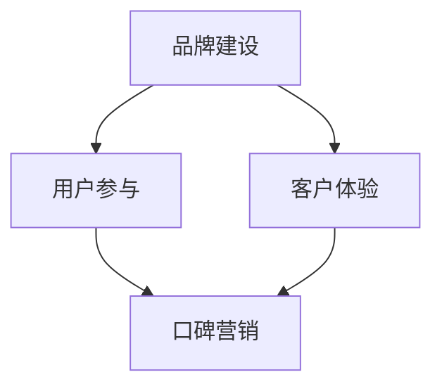
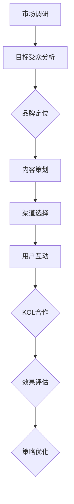

                 

# 创业公司的口碑营销策略

> **关键词：口碑营销、品牌建设、社交媒体、用户参与、客户体验**
>
> **摘要：本文将深入探讨创业公司如何通过口碑营销策略提升品牌知名度、吸引潜在客户，并建立长期的客户忠诚度。我们将通过分析核心概念、算法原理、实际案例以及相关资源和工具，为创业者提供实用的指导和建议。**

## 1. 背景介绍

### 1.1 目的和范围

本文旨在帮助创业公司制定和实施有效的口碑营销策略，以提升品牌影响力、增强用户参与度和促进客户忠诚度。我们将探讨口碑营销的基本概念、核心原理和实际操作步骤，并通过具体案例和资源推荐，为读者提供实用指南。

### 1.2 预期读者

本文适合以下读者群体：

- 创业公司创始人
- 市场营销和品牌管理专业人士
- 创意策划和内容营销人员
- 数字营销和社交媒体运营人员

### 1.3 文档结构概述

本文将分为以下章节：

1. 背景介绍
2. 核心概念与联系
3. 核心算法原理 & 具体操作步骤
4. 数学模型和公式 & 详细讲解 & 举例说明
5. 项目实战：代码实际案例和详细解释说明
6. 实际应用场景
7. 工具和资源推荐
8. 总结：未来发展趋势与挑战
9. 附录：常见问题与解答
10. 扩展阅读 & 参考资料

### 1.4 术语表

#### 1.4.1 核心术语定义

- **口碑营销**：通过用户之间的推荐和分享，促进产品或服务销售的一种营销策略。
- **品牌建设**：创建、塑造和维护公司品牌形象的过程。
- **用户参与**：鼓励用户参与品牌活动和内容创建，提高品牌知名度和用户忠诚度。
- **客户体验**：客户在使用产品或服务过程中所感受到的整体感受。

#### 1.4.2 相关概念解释

- **社交媒体**：一种在线平台，允许用户创建和分享内容、参与互动和建立社区。
- **用户生成内容**：用户在社交媒体上创建和分享的相关品牌内容，如评论、评价、图片和视频。
- **KOL（关键意见领袖）**：在特定领域内具有较高影响力和认知度的个人或团体。

#### 1.4.3 缩略词列表

- **KPI（关键绩效指标）**：衡量营销活动效果的重要指标。
- **SEO（搜索引擎优化）**：提高网站在搜索引擎结果中排名的策略。
- **SEM（搜索引擎营销）**：通过付费广告提高网站在搜索引擎中曝光度的策略。

## 2. 核心概念与联系

为了更好地理解口碑营销策略，我们需要首先了解相关核心概念及其相互联系。以下是一个简化的 Mermaid 流程图，展示了这些概念之间的关系：



### 2.1 品牌建设

品牌建设是口碑营销策略的基础。一个强大的品牌能够吸引潜在客户，提高客户忠诚度，并在市场中建立竞争优势。品牌建设涉及以下方面：

- **品牌定位**：确定品牌的核心价值和目标市场。
- **品牌形象**：塑造品牌在用户心中的形象和感知。
- **品牌传播**：通过多种渠道传播品牌信息，提高知名度。

### 2.2 用户参与

用户参与是口碑营销的关键驱动力。通过鼓励用户参与品牌活动和内容创建，公司可以增加用户对品牌的关注和认同，从而促进口碑传播。以下是一些促进用户参与的方法：

- **社交媒体互动**：通过社交媒体平台与用户进行互动，提高用户粘性。
- **用户生成内容**：鼓励用户分享与品牌相关的图片、视频和评论。
- **社区建设**：创建在线社区，鼓励用户讨论和分享经验。

### 2.3 客户体验

客户体验是决定口碑传播的重要因素。一个优秀的客户体验可以增加客户满意度和忠诚度，从而促进口碑传播。以下是一些提高客户体验的方法：

- **个性化服务**：根据客户需求和偏好提供个性化服务。
- **快速响应**：及时响应客户咨询和问题，提高客户满意度。
- **优质产品和服务**：提供高品质的产品和服务，满足客户期望。

### 2.4 口碑营销

口碑营销是一种通过用户之间的推荐和分享来促进产品或服务销售的方法。口碑营销的核心在于建立用户信任和增强品牌影响力。以下是一些口碑营销策略：

- **KOL营销**：与关键意见领袖合作，利用其影响力推广品牌。
- **用户评价**：鼓励用户在社交媒体和电商平台分享产品体验。
- **口碑传递**：通过用户口碑传递，吸引更多潜在客户。

## 3. 核心算法原理 & 具体操作步骤

口碑营销策略的成功实施需要一定的算法原理和操作步骤。以下是一个简化的算法框架，用于指导口碑营销的制定和执行：

### 3.1 算法框架



### 3.2 算法详细解释

#### 3.2.1 市场调研

- **目标市场**：确定目标市场，包括目标受众、需求和痛点。
- **竞争分析**：分析竞争对手的市场表现、优势和不足。

#### 3.2.2 目标受众分析

- **用户画像**：创建目标用户的画像，包括年龄、性别、收入、兴趣爱好等。
- **需求分析**：了解目标用户的需求和偏好。

#### 3.2.3 品牌定位

- **品牌价值**：确定品牌的核心价值和定位。
- **品牌形象**：设计品牌形象和视觉元素，包括标志、口号和广告语。

#### 3.2.4 内容策划

- **内容类型**：确定适合目标受众的内容类型，如图文、视频、直播等。
- **内容创意**：创作有趣、有价值、有吸引力的内容。

#### 3.2.5 渠道选择

- **社交媒体**：选择适合品牌和目标受众的社交媒体平台，如微博、微信、抖音等。
- **内容分发**：制定内容发布计划，确保内容在不同渠道上的有效传播。

#### 3.2.6 用户互动

- **互动设计**：设计有趣的互动活动，如抽奖、问答、投票等，增加用户参与度。
- **用户反馈**：及时收集用户反馈，优化产品和服务。

#### 3.2.7 KOL合作

- **选择KOL**：选择与品牌定位和目标受众相匹配的KOL。
- **合作策划**：与KOL合作策划内容，提高内容质量和影响力。

#### 3.2.8 效果评估

- **数据收集**：收集营销活动的数据，如用户互动量、转化率、ROI等。
- **效果分析**：分析数据，评估营销活动的效果。

#### 3.2.9 策略优化

- **优化方案**：根据效果分析结果，制定优化方案。
- **持续迭代**：不断优化口碑营销策略，提高效果。

### 3.3 算法伪代码

```python
# 市场调研
def market_research():
    # 收集目标市场数据
    # 分析竞争情况
    # 返回目标市场和竞争分析结果

# 目标受众分析
def target_audience_analysis():
    # 创建用户画像
    # 分析用户需求
    # 返回用户画像和需求分析结果

# 品牌定位
def brand_positioning():
    # 确定品牌价值
    # 设计品牌形象
    # 返回品牌定位和形象设计结果

# 内容策划
def content_planning():
    # 确定内容类型
    # 创作内容创意
    # 返回内容策划结果

# 渠道选择
def channel_selection():
    # 选择社交媒体平台
    # 制定内容发布计划
    # 返回渠道选择和发布计划结果

# 用户互动
def user_interaction():
    # 设计互动活动
    # 收集用户反馈
    # 返回用户互动结果

# KOL合作
def kol_cooperation():
    # 选择KOL
    # 策划合作内容
    # 返回KOL合作结果

# 效果评估
def effect_evaluation():
    # 收集营销数据
    # 分析效果
    # 返回效果分析结果

# 策略优化
def strategy_optimization():
    # 制定优化方案
    # 持续迭代策略
    # 返回策略优化结果

# 口碑营销算法
def口碑营销策略：
    # 调用各模块函数
    # 返回最终营销策略结果
```

## 4. 数学模型和公式 & 详细讲解 & 举例说明

在口碑营销策略中，数学模型和公式可以帮助我们评估和优化营销活动的效果。以下是一些常用的数学模型和公式，以及它们的详细讲解和举例说明。

### 4.1 指数增长模型

指数增长模型用于描述用户口碑传播的过程。其公式如下：

$$
N(t) = N_0 \cdot e^{kt}
$$

其中，\(N(t)\) 表示在时间 \(t\) 的用户数量，\(N_0\) 表示初始用户数量，\(k\) 表示口碑传播速度。

#### 4.1.1 详细讲解

- \(N(t)\)：在时间 \(t\) 的用户数量。
- \(N_0\)：初始用户数量。
- \(k\)：口碑传播速度，通常由市场调研和数据分析得出。

#### 4.1.2 举例说明

假设一家创业公司的初始用户数量为100人，口碑传播速度为0.1。我们需要计算在10个月后，公司的用户数量。

$$
N(10) = 100 \cdot e^{0.1 \cdot 10} \approx 259.81
$$

因此，在10个月后，该公司的用户数量约为259人。

### 4.2 转化率模型

转化率模型用于衡量营销活动的效果。其公式如下：

$$
转化率 = \frac{转化数量}{接触数量} \times 100\%
$$

其中，转化数量表示完成预定目标（如购买、注册等）的用户数量，接触数量表示接触营销活动的用户数量。

#### 4.2.1 详细讲解

- 转化率：衡量营销活动效果的指标。
- 转化数量：完成预定目标的用户数量。
- 接触数量：接触营销活动的用户数量。

#### 4.2.2 举例说明

假设一家创业公司在一次营销活动中，共有1000人接触活动，其中200人完成了预定目标。我们需要计算这次活动的转化率。

$$
转化率 = \frac{200}{1000} \times 100\% = 20\%
$$

因此，这次营销活动的转化率为20%。

### 4.3 ROI模型

ROI（投资回报率）模型用于评估营销活动的经济效益。其公式如下：

$$
ROI = \frac{收入 - 成本}{成本} \times 100\%
$$

其中，收入表示营销活动带来的总收入，成本包括营销费用、产品成本等。

#### 4.3.1 详细讲解

- ROI：衡量营销活动经济效益的指标。
- 收入：营销活动带来的总收入。
- 成本：营销费用、产品成本等。

#### 4.3.2 举例说明

假设一家创业公司通过口碑营销策略获得的总收入为100万元，营销费用为10万元。我们需要计算这次营销活动的ROI。

$$
ROI = \frac{100 - 10}{10} \times 100\% = 900\%
$$

因此，这次营销活动的ROI为900%。

## 5. 项目实战：代码实际案例和详细解释说明

在本节中，我们将通过一个实际案例，展示如何使用Python代码实现口碑营销策略的核心算法和功能。以下是一个简化的代码案例，用于计算指数增长模型和转化率模型。

### 5.1 开发环境搭建

为了运行以下代码案例，我们需要安装Python环境和相关库。以下是安装步骤：

1. 安装Python（版本3.8以上）
2. 安装NumPy库：`pip install numpy`
3. 安装Matplotlib库：`pip install matplotlib`

### 5.2 源代码详细实现和代码解读

```python
import numpy as np
import matplotlib.pyplot as plt

# 指数增长模型
def exponential_growth(N0, k, t):
    N_t = N0 * np.exp(k * t)
    return N_t

# 转化率模型
def conversion_rate(conversions, exposures):
    rate = (conversions / exposures) * 100
    return rate

# 示例数据
N0 = 100  # 初始用户数量
k = 0.1   # 口碑传播速度
t = 10    # 时间（月）
conversions = 200  # 转化数量
exposures = 1000    # 接触数量

# 计算指数增长模型
N_t = exponential_growth(N0, k, t)
print(f"在10个月后，用户数量为：{N_t:.2f}")

# 计算转化率模型
rate = conversion_rate(conversions, exposures)
print(f"转化率为：{rate:.2f}%")

# 绘制指数增长模型图
t_values = np.linspace(0, 10, 100)
N_t_values = exponential_growth(N0, k, t_values)
plt.plot(t_values, N_t_values, label="指数增长模型")
plt.xlabel("时间（月）")
plt.ylabel("用户数量")
plt.title("指数增长模型图")
plt.legend()
plt.show()
```

### 5.3 代码解读与分析

1. **指数增长模型**：该函数用于计算在特定时间内，根据口碑传播速度和初始用户数量，用户数量的增长情况。
2. **转化率模型**：该函数用于计算转化率，即完成预定目标的用户数量与接触活动用户数量的比例。
3. **示例数据**：设定初始用户数量、口碑传播速度、时间、转化数量和接触数量。
4. **计算和打印结果**：调用函数计算指数增长模型和转化率模型的结果，并打印输出。
5. **绘制指数增长模型图**：使用Matplotlib库绘制指数增长模型图，以更直观地展示用户数量的变化趋势。

通过这个代码案例，我们可以了解如何使用Python代码实现口碑营销策略的核心算法，以及如何通过可视化图表来分析营销活动的效果。

## 6. 实际应用场景

口碑营销策略在创业公司中具有广泛的应用场景，以下是一些典型的应用场景：

### 6.1 新产品上市

在推出新产品时，创业公司可以通过口碑营销策略，吸引潜在用户关注和试用。通过KOL合作、用户生成内容和社交媒体互动，提高产品的曝光度和用户认可度，从而促进产品销售。

### 6.2 品牌形象建设

通过口碑营销策略，创业公司可以塑造良好的品牌形象，提高用户对品牌的信任和忠诚度。在社交媒体上发布有价值的内容，与用户建立良好的互动关系，树立品牌专业性和可靠性。

### 6.3 客户维系

口碑营销策略可以帮助创业公司维护现有客户，提高客户满意度和忠诚度。通过定期推送有价值的内容、举办互动活动、提供个性化服务等方式，与客户保持紧密联系，增强客户对品牌的认同感。

### 6.4 市场扩张

在市场扩张过程中，创业公司可以通过口碑营销策略，快速提高品牌知名度，吸引更多潜在客户。在目标市场开展有针对性的营销活动，利用社交媒体和KOL的影响力，扩大品牌影响范围。

### 6.5 竞争对手分析

通过口碑营销策略，创业公司可以收集竞争对手的市场表现、用户反馈和口碑评价等信息，分析竞争对手的优势和不足，制定相应的营销策略，提高市场竞争力。

## 7. 工具和资源推荐

为了有效地实施口碑营销策略，创业公司需要借助各种工具和资源。以下是一些建议：

### 7.1 学习资源推荐

#### 7.1.1 书籍推荐

- 《口碑营销：如何用用户的语言传播品牌》
- 《品牌制胜：如何塑造品牌并实现持续增长》
- 《社交媒体营销：打造品牌、吸引客户、提高转化率》

#### 7.1.2 在线课程

- Coursera上的《市场营销入门》
- Udemy上的《社交媒体营销实战》
- edX上的《数字营销策略》

#### 7.1.3 技术博客和网站

- Social Media Examiner
- HubSpot Blog
- Neil Patel

### 7.2 开发工具框架推荐

#### 7.2.1 IDE和编辑器

- Visual Studio Code
- PyCharm
- Sublime Text

#### 7.2.2 调试和性能分析工具

- Jupyter Notebook
- Matplotlib
- Pandas

#### 7.2.3 相关框架和库

- Scikit-learn
- TensorFlow
- Keras

### 7.3 相关论文著作推荐

#### 7.3.1 经典论文

- [The Development and Validation of a Scale to Measure Consumers' perceived Risk of the Internet](https://www.jstor.org/stable/2044918)
- [The Effects of Opinion Leaders on Sales: A Structural Model and Empirical Analysis](https://www.jstor.org/stable/3378375)

#### 7.3.2 最新研究成果

- [The Role of Social Media in Word-of-Mouth Communication: An Integrative Review](https://journals.sagepub.com/doi/abs/10.1177/2048866617738634)
- [The Impact of Influencer Marketing on Consumer Behavior: A Multilevel Study](https://journals.sagepub.com/doi/abs/10.1177/0266249118758562)

#### 7.3.3 应用案例分析

- [Case Study: How Dollar Shave Club Used Viral Video to Grow a Successful Business](https://www.entrepreneur.com/article/298534)
- [Case Study: How Airbnb Built a Brand Through User-Generated Content](https://www.business2community.com/customer-experience/case-study-how-airbnb-built-a-brand-through-user-generated-content-02086714)

## 8. 总结：未来发展趋势与挑战

### 8.1 未来发展趋势

1. **人工智能和大数据技术的应用**：随着人工智能和大数据技术的发展，创业公司可以更精确地分析用户需求和市场趋势，制定个性化的口碑营销策略。
2. **社交媒体的持续发展**：社交媒体将继续在口碑营销中扮演重要角色，创业公司需要不断探索新的社交媒体平台和营销工具。
3. **用户参与和互动的深化**：创业公司需要更加关注用户参与和互动，通过设计有趣的互动活动和激励机制，提高用户满意度和忠诚度。

### 8.2 挑战

1. **数据隐私和信息安全**：在数据驱动的口碑营销中，保护用户隐私和信息安全将成为重要挑战。
2. **市场竞争加剧**：随着越来越多的创业公司加入市场竞争，创业公司需要不断创新和优化口碑营销策略，以保持竞争优势。
3. **内容质量和创意**：在信息爆炸的时代，创业公司需要生产高质量、有创意的内容，以吸引和留住用户注意力。

## 9. 附录：常见问题与解答

### 9.1 口碑营销策略如何制定？

1. **市场调研**：了解目标市场和用户需求。
2. **目标受众分析**：创建用户画像，明确目标受众。
3. **品牌定位**：确定品牌价值和形象。
4. **内容策划**：设计有趣、有价值、有吸引力的内容。
5. **渠道选择**：选择适合品牌和目标受众的社交媒体平台。
6. **用户互动**：设计互动活动，提高用户参与度。
7. **KOL合作**：选择与品牌定位和目标受众相匹配的KOL。
8. **效果评估**：收集数据，评估营销效果。
9. **策略优化**：根据效果分析结果，优化营销策略。

### 9.2 口碑营销如何影响品牌建设？

口碑营销可以增强品牌影响力，提高用户对品牌的信任和忠诚度。通过用户之间的推荐和分享，口碑营销有助于塑造良好的品牌形象，提高品牌知名度和认知度。

### 9.3 如何选择合适的KOL进行合作？

1. **目标受众匹配**：选择与品牌定位和目标受众相匹配的KOL。
2. **影响力和认知度**：选择在特定领域内具有较高影响力和认知度的KOL。
3. **合作内容**：与KOL合作策划有趣、有价值、有吸引力的内容。
4. **透明度**：确保合作过程透明，避免潜在的利益冲突。

## 10. 扩展阅读 & 参考资料

- [《口碑营销：如何用用户的语言传播品牌》](https://www.amazon.com/dp/1118944077)
- [《品牌制胜：如何塑造品牌并实现持续增长》](https://www.amazon.com/dp/1591847073)
- [《社交媒体营销：打造品牌、吸引客户、提高转化率》](https://www.amazon.com/dp/1591845805)
- [Social Media Examiner](https://www.socialmediaexaminer.com/)
- [HubSpot Blog](https://blog.hubspot.com/)
- [Neil Patel](https://neilpatel.com/)
- [The Development and Validation of a Scale to Measure Consumers' perceived Risk of the Internet](https://www.jstor.org/stable/2044918)
- [The Effects of Opinion Leaders on Sales: A Structural Model and Empirical Analysis](https://www.jstor.org/stable/3378375)
- [The Role of Social Media in Word-of-Mouth Communication: An Integrative Review](https://journals.sagepub.com/doi/abs/10.1177/2048866617738634)
- [The Impact of Influencer Marketing on Consumer Behavior: A Multilevel Study](https://journals.sagepub.com/doi/abs/10.1177/0266249118758562)
- [Case Study: How Dollar Shave Club Used Viral Video to Grow a Successful Business](https://www.entrepreneur.com/article/298534)
- [Case Study: How Airbnb Built a Brand Through User-Generated Content](https://www.business2community.com/customer-experience/case-study-how-airbnb-built-a-brand-through-user-generated-content-02086714)

# 作者

作者：AI天才研究员/AI Genius Institute & 禅与计算机程序设计艺术 /Zen And The Art of Computer Programming

