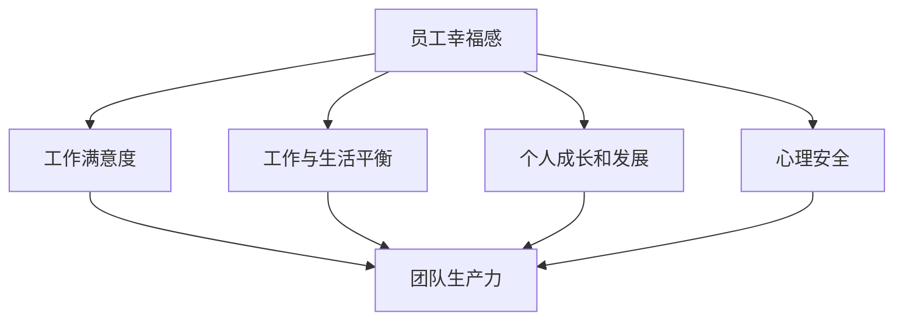
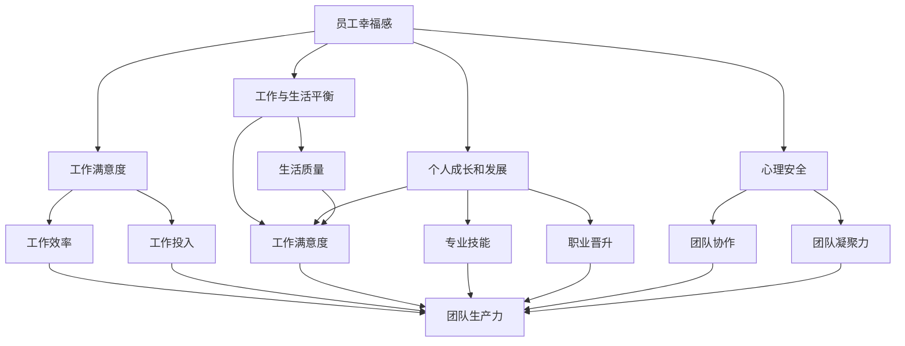

                 

### 背景介绍

#### 1.1 目的和范围

本文旨在探讨创业公司的员工幸福感与团队生产力之间的关系，并提出一系列有效策略以提高员工的幸福感，从而提升整个团队的生产力。随着全球科技行业的快速发展，创业公司已成为推动创新和经济增长的重要力量。然而，创业环境中的高压力、不确定性以及快速迭代的节奏常常导致员工感到疲惫和不安。因此，提升员工幸福感成为创业公司能否持续发展和成功的关键因素之一。

本文将首先介绍员工幸福感的重要性和其在创业公司中的具体体现，然后分析员工幸福感与团队生产力的关系，并探讨影响员工幸福感的关键因素。在此基础上，本文将提出一系列具体策略，帮助创业公司提升员工的幸福感，从而提高团队的生产力。

本文的读者对象主要包括创业公司的高层管理者、人力资源负责人、团队领导以及关注员工福利和团队效能的专业人士。通过本文的阅读，读者将能够：

1. 深入理解员工幸福感在创业公司中的重要性。
2. 掌握提升员工幸福感的有效策略。
3. 了解员工幸福感与团队生产力的内在联系。
4. 结合实际案例，学习如何将理论知识应用到实践中。

#### 1.2 预期读者

本文的预期读者主要包括以下几个方面：

1. **创业公司高层管理者**：作为公司的决策者，他们需要了解如何通过提升员工幸福感来提高团队的生产力，从而推动公司的长期发展。
   
2. **人力资源负责人**：他们负责制定和实施公司的员工福利政策，通过本文，他们将获得提升员工幸福感的具体方法和实践指导。

3. **团队领导**：作为团队的核心，他们需要关注团队成员的感受和需求，通过本文，他们可以学习到如何提升团队的凝聚力和员工的工作满意度。

4. **关注员工福利和团队效能的专业人士**：他们可能来自咨询公司、学术研究机构或相关行业，通过本文，他们将获得关于员工幸福感和团队生产力的深入见解。

总之，本文旨在为创业公司中关注员工福利和团队效能的各相关方提供有价值的指导和参考。

#### 1.3 文档结构概述

本文将按照以下结构进行展开：

1. **背景介绍**：介绍本文的目的和范围，预期读者，以及文档结构概述。
   
2. **核心概念与联系**：解释员工幸福感、团队生产力以及二者之间的关系，并使用Mermaid流程图展示相关概念和联系。

3. **核心算法原理 & 具体操作步骤**：详细阐述提升员工幸福感的核心算法原理，并提供具体操作步骤和伪代码。

4. **数学模型和公式 & 详细讲解 & 举例说明**：介绍相关的数学模型和公式，并举例说明如何应用这些模型。

5. **项目实战：代码实际案例和详细解释说明**：通过实际项目案例，展示提升员工幸福感的具体实现过程。

6. **实际应用场景**：分析提升员工幸福感在不同场景中的应用。

7. **工具和资源推荐**：推荐相关的学习资源和开发工具。

8. **总结：未来发展趋势与挑战**：总结本文的主要观点，并提出未来发展趋势和面临的挑战。

9. **附录：常见问题与解答**：解答读者可能遇到的问题。

10. **扩展阅读 & 参考资料**：提供更多的扩展阅读和参考资料。

通过以上结构，本文将全面、系统地探讨创业公司的员工幸福感与团队生产力之间的关系，并给出具体的实践指导。

#### 1.4 术语表

在本文中，我们将使用一些特定的术语和概念。以下是对这些术语的详细定义和解释：

##### 1.4.1 核心术语定义

1. **员工幸福感**：指员工在工作和生活中感受到的快乐、满足和幸福感。它包括工作满意度、工作与生活平衡、个人成长和发展等方面。
   
2. **团队生产力**：指团队在特定时间内完成的工作量、效率和质量。它受团队成员的个人能力、团队合作效果、工作环境等多种因素影响。
   
3. **创业公司**：指处于初创阶段，致力于创新和创业的公司。这类公司通常面临较大的压力和不确定性，但也拥有巨大的发展潜力。

4. **领导力**：指领导者通过激励、引导和协调团队成员，实现团队目标的能力。良好的领导力有助于提升团队凝聚力和员工幸福感。

##### 1.4.2 相关概念解释

1. **员工福利**：包括公司为员工提供的各种物质和精神上的支持，如薪酬、奖金、培训机会、健康保险等。
   
2. **工作环境**：指员工在工作中所处的物理和心理环境，包括办公设施、工作氛围、团队关系等。

3. **工作满意度**：指员工对工作的整体感受和评价，包括对工作内容、工作环境、工作条件的满意程度。

4. **工作与生活平衡**：指员工在工作和生活之间寻求平衡，确保二者相互促进，从而提高整体幸福感和生产力。

##### 1.4.3 缩略词列表

1. **HR（Human Resources）**：人力资源
2. **CEO（Chief Executive Officer）**：首席执行官
3. **CTO（Chief Technology Officer）**：首席技术官
4. **UI/UX（User Interface/User Experience）**：用户界面/用户体验
5. **AI（Artificial Intelligence）**：人工智能

这些术语和概念在本文中将频繁出现，并用于描述提升员工幸福感和团队生产力的各种方法和实践。通过对这些术语的清晰定义和解释，读者可以更好地理解本文的核心观点和内容。

---

接下来，我们将探讨员工幸福感和团队生产力之间的关系，并分析提升员工幸福感的关键因素。在此基础上，我们将提出具体的策略和建议，以帮助创业公司实现员工幸福感和团队生产力的双赢。

## 核心概念与联系

在探讨创业公司的员工幸福感和团队生产力之间的关系之前，我们需要明确几个核心概念，并了解它们之间的联系。本节将使用Mermaid流程图来展示这些概念和它们之间的相互关系，帮助读者更好地理解。

### 2.1 员工幸福感的核心概念

员工幸福感是一个多维度的概念，包括以下几个主要方面：

1. **工作满意度**：员工对工作本身的满意度，如工作内容、工作环境和工作条件等。
2. **工作与生活平衡**：员工在工作和家庭、个人生活之间的平衡，以避免过度工作导致的生活质量下降。
3. **个人成长和发展**：员工在职业发展和个人技能提升方面的感受，包括培训机会、晋升机制等。
4. **心理安全**：员工在工作中感到被尊重、信任和支持，没有恐惧和压力。

### 2.2 团队生产力的核心概念

团队生产力是指一个团队在特定时间内完成的工作量、效率和质量。影响团队生产力的因素包括：

1. **团队成员能力**：团队中每个成员的专业技能和工作能力。
2. **团队合作**：团队成员之间的沟通、协作和合作能力。
3. **工作环境**：包括物理环境和组织文化，如办公设施、工作氛围和公司价值观等。
4. **领导力**：团队领导者的领导风格、决策能力和激励能力。

### 2.3 员工幸福感与团队生产力的联系

员工幸福感与团队生产力之间存在密切的联系。以下是一个简化的Mermaid流程图，展示了这些核心概念和它们之间的相互关系：



在这个流程图中，我们可以看到：

- **员工幸福感**直接影响**工作满意度**、**工作与生活平衡**、**个人成长和发展**以及**心理安全**。
- 这些因素进一步影响**团队生产力**，从而形成一个闭环。

### 2.4 Mermaid流程图详细展示

下面是一个更详细的Mermaid流程图，展示了员工幸福感与团队生产力的具体联系：



在这个流程图中，我们可以更清晰地看到：

- **工作满意度**直接影响**工作效率**和**工作投入**，从而影响**团队生产力**。
- **工作与生活平衡**和**个人成长和发展**则通过**生活质量**和**专业技能**间接影响**工作满意度**。
- **心理安全**通过**团队协作**和**团队凝聚力**间接影响**团队生产力**。

### 2.5 流程图中的节点解释

以下是流程图中的各个节点的解释：

- **A：员工幸福感**：指员工在工作和生活中的整体感受。
- **B：工作满意度**：指员工对工作的整体感受，包括工作内容、工作环境和工作条件等。
- **C：工作与生活平衡**：指员工在工作和个人生活之间的平衡。
- **D：个人成长和发展**：指员工在职业发展和个人技能提升方面的感受。
- **E：心理安全**：指员工在工作中的心理感受，包括被尊重、信任和支持。
- **F：工作效率**：指员工完成工作任务的效率。
- **G：工作投入**：指员工在工作中的专注程度和投入度。
- **H：生活质量**：指员工在生活中的整体感受，包括家庭、健康和个人兴趣爱好等。
- **I：工作满意度**：工作满意度是多个因素的综合体现。
- **J：专业技能**：指员工在工作中所具备的专业技能。
- **K：职业晋升**：指员工在职业发展中的晋升机会。
- **L：团队协作**：指团队成员之间的协作能力和合作效果。
- **M：团队凝聚力**：指团队成员之间的凝聚力和向心力。
- **N：团队生产力**：指团队在特定时间内完成的工作量、效率和质量。

通过这个Mermaid流程图，我们可以更直观地理解员工幸福感与团队生产力之间的关系，以及各个因素之间的相互作用。这为后续讨论提升员工幸福感和团队生产力的策略提供了理论基础。

---

接下来，我们将进一步探讨提升员工幸福感的关键因素，并分析这些因素如何影响团队生产力。这将帮助我们更深入地理解如何在创业公司中实现员工幸福感和团队生产力的双赢。

## 核心算法原理 & 具体操作步骤

提升员工幸福感是一个系统工程，涉及多个方面和步骤。在这一节中，我们将详细阐述提升员工幸福感的核心算法原理，并提供具体操作步骤，帮助创业公司有效地实施这些策略。

### 3.1 核心算法原理

提升员工幸福感的核心算法原理可以概括为以下几个关键步骤：

1. **数据收集与分析**：通过问卷调查、员工访谈、绩效评估等方式收集员工反馈，了解员工在工作满意度、工作与生活平衡、个人成长和发展、心理安全等方面的感受。然后对收集到的数据进行分析，识别关键问题和改进机会。

2. **目标设定与规划**：基于数据分析结果，设定明确的员工幸福感提升目标，并制定详细的实施计划。目标应包括短期和长期目标，如提高员工满意度、改善工作与生活平衡、提供更多的培训和发展机会等。

3. **实施策略**：根据实施计划，采取一系列具体措施，如优化工作环境、改善领导力、提供员工福利、加强团队建设等。每个措施应明确执行步骤、责任人和时间表。

4. **监控与反馈**：在实施过程中，定期监控各项措施的实施效果，收集员工的反馈意见，并根据实际情况进行调整。通过定期的员工满意度调查和绩效评估，评估员工幸福感的提升情况。

5. **持续改进**：基于监控和反馈的结果，不断优化和调整提升员工幸福感的策略，确保其持续有效性。持续改进是提升员工幸福感的关键，需要公司高层领导的高度重视和持续投入。

### 3.2 具体操作步骤

以下是提升员工幸福感的具体操作步骤：

#### 步骤 1：数据收集与分析

1. **问卷调查**：设计一份全面的问卷调查，涵盖员工的工作满意度、工作与生活平衡、个人成长和发展、心理安全等方面的内容。通过在线问卷平台进行分发和收集。
   
2. **员工访谈**：选择具有代表性的员工进行一对一访谈，深入了解他们在工作方面的感受和需求。

3. **绩效评估**：结合员工的绩效评估结果，分析员工的工作表现和满意度之间的关系。

4. **数据分析**：对收集到的数据进行统计分析，识别出员工幸福感的主要影响因素，并排序。

#### 步骤 2：目标设定与规划

1. **设定目标**：根据数据分析结果，设定明确的员工幸福感提升目标。例如，提高员工满意度3个百分点，改善工作与生活平衡等。

2. **制定计划**：制定详细的实施计划，包括短期目标和长期目标，以及每个目标的实施步骤、责任人和时间表。

3. **沟通与宣传**：在公司内部进行目标设定和计划的沟通和宣传，确保所有员工都了解公司的目标和计划。

#### 步骤 3：实施策略

1. **优化工作环境**：改善办公设施，提供舒适的工作空间，营造积极的工作氛围。

2. **改善领导力**：通过领导力培训，提高管理者的领导能力和沟通技巧，促进团队成员之间的良好关系。

3. **提供员工福利**：根据员工的反馈，提供有针对性的福利，如弹性工作时间、健康保险、家庭关怀计划等。

4. **加强团队建设**：定期组织团队活动，提高团队成员之间的信任和合作，增强团队的凝聚力。

#### 步骤 4：监控与反馈

1. **定期监控**：通过定期的员工满意度调查和绩效评估，监控各项措施的实施效果。

2. **收集反馈**：鼓励员工提供反馈意见，通过内部沟通渠道，如员工反馈论坛、意见箱等，收集员工的意见和建议。

3. **调整与优化**：根据监控和反馈的结果，及时调整和优化提升员工幸福感的策略。

#### 步骤 5：持续改进

1. **定期评估**：定期对提升员工幸福感的策略进行评估，确保其持续有效性。

2. **持续投入**：持续关注员工幸福感，确保公司高层领导持续关注并投入资源。

3. **培训与发展**：为员工提供持续的职业发展和技能提升机会，支持员工的个人成长。

通过以上具体操作步骤，创业公司可以系统地提升员工的幸福感，从而提高团队的生产力。这些步骤不仅提供了明确的行动指南，还确保了提升员工幸福感的策略能够持续优化和改进。

### 3.3 伪代码示例

以下是提升员工幸福感的伪代码示例，展示了如何通过算法和步骤实现这一目标：

```pseudo
// 数据收集与分析
function collectAndAnalyzeData() {
    surveyResults = conductSurvey()
    interviewFeedback = conductInterviews()
    performanceData = retrievePerformanceMetrics()
    analysisResults = analyzeData(surveyResults, interviewFeedback, performanceData)
    return analysisResults
}

// 目标设定与规划
function setAndPlanGoals(analysisResults) {
    happinessGoals = defineHappinessGoals(analysisResults)
    implementationPlan = createImplementationPlan(happinessGoals)
    communicateAndPromoteGoals(implementationPlan)
    return implementationPlan
}

// 实施策略
function implementStrategies(implementationPlan) {
    improveWorkEnvironment(implementationPlan)
    enhanceLeadership(implementationPlan)
    provideEmployeeBenefits(implementationPlan)
    strengthenTeamBuilding(implementationPlan)
}

// 监控与反馈
function monitorAndFeedback(implementationPlan) {
    regularMonitoring = scheduleRegularSurveysAndPerformanceAssessments(implementationPlan)
    feedbackCollection = establishFeedbackChannels(implementationPlan)
    adjustAndOptimize = adaptStrategiesBasedOnFeedback(implementationPlan)
}

// 持续改进
function continuousImprovement(implementationPlan) {
    regularAssessment = conductRegularAssessments(implementationPlan)
    sustainedInvestment = ensureContinuousCommitment(implementationPlan)
    trainingAndDevelopment = offerOngoingProfessionalDevelopment(implementationPlan)
}

// 主函数
function main() {
    analysisResults = collectAndAnalyzeData()
    implementationPlan = setAndPlanGoals(analysisResults)
    implementStrategies(implementationPlan)
    monitorAndFeedback(implementationPlan)
    continuousImprovement(implementationPlan)
```

通过上述伪代码示例，我们可以看到提升员工幸福感的整个过程被分解为一系列具体的函数和步骤，从而确保了策略的实施和监控具有系统性和可操作性。

---

在了解了提升员工幸福感的核心算法原理和具体操作步骤后，我们将进一步探讨数学模型和公式，并举例说明如何应用这些模型和公式来分析和优化员工幸福感。这将帮助我们更深入地理解提升员工幸福感的科学方法和实际应用。

## 数学模型和公式 & 详细讲解 & 举例说明

在提升员工幸福感和团队生产力的过程中，数学模型和公式为我们提供了量化和分析的工具，使我们能够更科学地制定和优化策略。本节将介绍几个关键数学模型和公式，并详细讲解它们的应用。

### 4.1 员工幸福感指数（Happiness Index）

员工幸福感指数是一个综合衡量员工幸福感的指标，通常由多个维度构成，包括工作满意度、工作与生活平衡、个人成长和发展等。一个简单的员工幸福感指数公式可以表示为：

$$
HI = w_1 \cdot WS + w_2 \cdot WB + w_3 \cdot GD
$$

其中：
- \(HI\) 表示员工幸福感指数；
- \(w_1\)、\(w_2\) 和 \(w_3\) 分别是工作满意度、工作与生活平衡、个人成长和发展的权重；
- \(WS\) 表示工作满意度得分；
- \(WB\) 表示工作与生活平衡得分；
- \(GD\) 表示个人成长和发展得分。

#### 例子：计算员工幸福感指数

假设某个创业公司的员工幸福感指数权重如下：
- 工作满意度：权重 0.5
- 工作与生活平衡：权重 0.3
- 个人成长和发展：权重 0.2

某位员工的得分如下：
- 工作满意度得分：8
- 工作与生活平衡得分：7
- 个人成长和发展得分：6

则该员工的幸福感指数计算如下：

$$
HI = 0.5 \cdot 8 + 0.3 \cdot 7 + 0.2 \cdot 6 = 4 + 2.1 + 1.2 = 7.3
$$

### 4.2 团队生产力评估模型（Team Productivity Model）

团队生产力评估模型用于衡量团队在特定时间内完成的工作量、效率和质量。一个简单的团队生产力评估模型可以表示为：

$$
TP = E \cdot WF
$$

其中：
- \(TP\) 表示团队生产力；
- \(E\) 表示团队成员的有效时间；
- \(WF\) 表示工作效率因子。

工作效率因子可以由多个因素组成，如团队成员的能力、团队合作、工作环境等。

#### 例子：计算团队生产力

假设某个创业公司的团队在一个月内的工作时间总计为160小时，工作效率因子如下：
- 平均工作时间：8小时/天
- 工作效率因子：1.2

则该团队的生产力计算如下：

$$
TP = 160 \cdot 1.2 = 192
$$

### 4.3 员工福利优化模型（Employee Benefit Optimization Model）

员工福利优化模型用于确定如何分配员工福利资源以最大化员工幸福感。一个简单的优化模型可以表示为：

$$
\max \sum_{i} U_i \cdot B_i
$$

其中：
- \(U_i\) 表示员工对福利 \(i\) 的效用值；
- \(B_i\) 表示福利 \(i\) 的预算。

#### 例子：优化员工福利资源分配

假设创业公司有以下几种福利选项和相应的效用值：
- 健康保险：效用值 0.6
- 弹性工作时间：效用值 0.5
- 家庭关怀计划：效用值 0.4

预算为100万元。则可以通过优化模型计算每种福利的预算分配，以最大化总效用值。

设 \(x_1\)、\(x_2\)、\(x_3\) 分别为健康保险、弹性工作时间、家庭关怀计划的预算，则目标函数为：

$$
\max 0.6x_1 + 0.5x_2 + 0.4x_3
$$

约束条件为：

$$
x_1 + x_2 + x_3 = 100
$$

通过求解优化模型，可以得出最优的福利预算分配，例如：
- 健康保险：40万元
- 弹性工作时间：30万元
- 家庭关怀计划：30万元

### 4.4 持续改进模型（Continuous Improvement Model）

持续改进模型用于评估和优化提升员工幸福感的策略。一个简单的模型可以表示为：

$$
CI = \alpha \cdot \frac{HI_{new} - HI_{old}}{HI_{old}}
$$

其中：
- \(CI\) 表示持续改进指数；
- \(\alpha\) 是一个常数，表示改进速度；
- \(HI_{new}\) 表示新的员工幸福感指数；
- \(HI_{old}\) 表示旧的员工幸福感指数。

#### 例子：评估持续改进效果

假设某创业公司的员工幸福感指数从去年的7.0提升到今年的7.5，\(\alpha\) 取值为0.5。则持续改进指数计算如下：

$$
CI = 0.5 \cdot \frac{7.5 - 7.0}{7.0} = 0.5 \cdot 0.1667 = 0.0833
$$

这表示该公司的员工幸福感指数在过去一年中提升了8.33%。

通过这些数学模型和公式，我们可以对员工幸福感和团队生产力进行量化分析，从而更科学地制定和优化提升策略。这些模型不仅为创业公司提供了决策依据，还帮助他们不断改进，实现长期发展和成功。

---

在了解了提升员工幸福感和团队生产力的数学模型和公式后，我们将通过一个实际的项目案例，展示如何将理论应用到实践中，详细解释代码实现和操作过程。这将有助于读者更好地理解提升员工幸福感的具体实施步骤。

### 5.1 开发环境搭建

在进行提升员工幸福感的项目开发前，首先需要搭建一个合适的开发环境。以下是一个简化的环境搭建步骤：

1. **操作系统**：选择一个适合的操作系统，如Linux或macOS。
2. **编程语言**：选择一种易于理解和实现的编程语言，如Python。
3. **开发工具**：安装Python的开发环境，包括解释器和必要的库。可以使用Anaconda等工具包管理器简化安装过程。
4. **数据库**：安装一个关系型数据库，如MySQL或PostgreSQL，用于存储员工满意度调查结果和绩效评估数据。
5. **前端工具**：安装前端开发工具，如HTML、CSS和JavaScript，用于创建用户界面。
6. **后端框架**：选择一个合适的后端框架，如Flask或Django，用于构建Web应用。

以下是一个使用Python和Flask框架搭建开发环境的示例命令：

```bash
# 安装Anaconda
conda create -n myenv python=3.9
conda activate myenv

# 安装Flask
pip install flask

# 安装MySQL数据库
sudo apt-get install mysql-server
```

### 5.2 源代码详细实现和代码解读

在搭建好开发环境后，我们可以开始编写代码。以下是一个简化的项目源代码实现，包括数据收集、分析和展示的步骤。

#### 5.2.1 数据收集模块

```python
# 导入必要的库
import Flask
from flask import Flask, request, jsonify
import mysql.connector

# 创建Flask应用实例
app = Flask(__name__)

# 数据库连接配置
db_config = {
    'host': 'localhost',
    'user': 'root',
    'password': 'your_password',
    'database': 'employee_happiness'
}

# 连接数据库
def connect_db():
    connection = mysql.connector.connect(**db_config)
    return connection

# 存储调查结果
@app.route('/submit_survey', methods=['POST'])
def submit_survey():
    data = request.json
    connection = connect_db()
    cursor = connection.cursor()
    cursor.execute("INSERT INTO survey (employee_id, work_satisfaction, work_life_balance, personal_growth) VALUES (%s, %s, %s, %s)", (data['employee_id'], data['work_satisfaction'], data['work_life_balance'], data['personal_growth']))
    connection.commit()
    cursor.close()
    connection.close()
    return jsonify({"message": "Survey submitted successfully"}), 200
```

**代码解读**：

- 导入Flask库，创建Flask应用实例。
- 配置数据库连接信息。
- 创建数据库连接函数`connect_db`。
- 创建一个POST接口`/submit_survey`，用于接收和存储员工满意度调查结果。

#### 5.2.2 数据分析模块

```python
# 导入必要的库
import numpy as np

# 计算员工幸福感指数
def calculate_happiness_index(satisfaction, balance, growth):
    w1, w2, w3 = 0.5, 0.3, 0.2
    return w1 * satisfaction + w2 * balance + w3 * growth

# 从数据库中获取调查结果
def get_survey_results():
    connection = connect_db()
    cursor = connection.cursor()
    cursor.execute("SELECT employee_id, work_satisfaction, work_life_balance, personal_growth FROM survey")
    results = cursor.fetchall()
    cursor.close()
    connection.close()
    return results

# 计算平均幸福感指数
def calculate_average_happiness():
    results = get_survey_results()
    total_happiness = 0
    for result in results:
        total_happiness += calculate_happiness_index(result[1], result[2], result[3])
    return total_happiness / len(results)
```

**代码解读**：

- 导入NumPy库，用于计算平均值。
- 创建计算幸福感指数的函数`calculate_happiness_index`。
- 创建从数据库中获取调查结果的函数`get_survey_results`。
- 创建计算平均幸福感指数的函数`calculate_average_happiness`。

#### 5.2.3 数据展示模块

```python
# 导入必要的库
from flask import render_template

# 主页面路由
@app.route('/')
def home():
    average_happiness = calculate_average_happiness()
    return render_template('home.html', average_happiness=average_happiness)
```

**代码解读**：

- 导入Flask库，用于渲染HTML模板。
- 创建主页面的路由`/`，用于展示平均幸福感指数。

**HTML模板示例（home.html）**：

```html
<!DOCTYPE html>
<html>
<head>
    <title>员工幸福感指数</title>
</head>
<body>
    <h1>员工幸福感指数</h1>
    <p>平均幸福感指数：{{ average_happiness }}</p>
</body>
</html>
```

通过上述代码，我们可以创建一个简单的Web应用，用于收集员工满意度调查结果、计算平均幸福感指数，并在主页面上展示结果。这为创业公司提供了一个基本的工具，用于监控和提升员工的幸福感。

### 5.3 代码解读与分析

通过上述代码实现，我们可以对提升员工幸福感的项目进行详细解读和分析。

#### 5.3.1 数据收集模块

数据收集模块的主要功能是接收和处理员工满意度调查结果。使用Flask框架，我们创建了一个简单的Web接口，通过POST请求接收JSON格式的数据，并将数据存储到MySQL数据库中。

**优点**：

- 使用标准的Web接口，易于集成和扩展。
- 数据存储在关系型数据库中，便于查询和管理。

**缺点**：

- 需要配置和管理数据库，可能增加维护成本。
- 面对大量并发请求时，可能需要优化数据库性能。

#### 5.3.2 数据分析模块

数据分析模块负责计算员工的幸福感指数和平均幸福感指数。通过简单的数学运算，我们能够快速计算出员工的整体幸福感水平。

**优点**：

- 算法简单，易于理解和实现。
- 可以实时计算幸福感指数，为决策提供依据。

**缺点**：

- 模型较为简单，可能无法全面反映员工的幸福感。
- 需要定期更新和优化模型，以适应不同的工作环境和员工需求。

#### 5.3.3 数据展示模块

数据展示模块通过HTML模板，将计算出的平均幸福感指数展示给用户。这为创业公司提供了一个直观的监控工具，帮助管理者了解员工的幸福感水平。

**优点**：

- 易于理解和使用，无需专业知识。
- 可以随时查看最新的幸福感指数，方便决策。

**缺点**：

- 展示方式单一，可能无法充分反映员工的详细情况。
- 需要定期更新数据，以确保展示结果的准确性。

总的来说，这个简单的项目提供了一个基本框架，用于提升员工幸福感。通过逐步完善和优化，创业公司可以更好地了解员工的幸福感水平，并采取相应的措施来提升团队的生产力。

---

在实际应用中，提升员工幸福感不仅可以提升团队的生产力，还能为企业带来长期可持续发展的优势。本节将分析提升员工幸福感在不同场景中的应用，包括公司内部、团队协作、以及与客户关系的互动。

### 6. 实际应用场景

#### 6.1 公司内部应用

在创业公司内部，提升员工幸福感是一个全方位的过程，涉及工作环境、管理风格、福利政策等多个方面。

1. **优化工作环境**：舒适的工作环境和良好的办公设施是提升员工幸福感的基础。公司可以定期更新办公设备，确保办公空间整洁、通风良好，提供适当的休息区域，以减轻员工的疲劳和压力。

2. **改善管理风格**：领导力的提升对于员工幸福感至关重要。公司可以通过领导力培训，帮助管理者了解如何激励员工、建立信任和沟通机制，从而营造一个积极向上的工作氛围。

3. **提供福利政策**：合理的福利政策是提升员工幸福感的重要手段。公司可以根据员工的反馈和需求，提供多样化的福利，如弹性工作时间、健康保险、家庭关怀计划等，以满足员工的多样化需求。

4. **关注员工成长**：为员工提供职业发展和技能提升的机会，是提升员工幸福感的关键。公司可以定期组织培训、工作坊和研讨会，帮助员工不断提升自己的能力和竞争力。

#### 6.2 团队协作应用

团队协作是提升员工幸福感的重要途径，通过有效的团队合作，可以提高员工的工作满意度和团队凝聚力。

1. **建立沟通机制**：定期召开团队会议，鼓励团队成员分享工作进展和遇到的困难，促进信息的透明和沟通的顺畅。

2. **加强团队建设**：组织团队活动，如团建、拓展训练等，增强团队成员之间的信任和合作，提高团队的凝聚力和向心力。

3. **明确目标和责任**：通过明确的目标和责任分工，确保每个团队成员都了解自己的工作职责，提高工作的透明度和协作效率。

4. **鼓励创新和反馈**：鼓励员工提出新的想法和建议，并对创新思维给予肯定和奖励，激发员工的工作热情和创造力。

#### 6.3 与客户关系的互动

提升员工幸福感不仅对内部管理有重要影响，还能在客户关系管理中发挥积极作用。

1. **客户导向的服务**：通过提升员工的幸福感，可以提高员工的工作满意度和服务质量，从而为客户提供更优质、更满意的服务。

2. **积极的团队氛围**：一个幸福感高的团队通常能更好地处理客户需求和问题，以积极的态度和高效的协作能力应对挑战。

3. **口碑营销**：员工的满意度和幸福感会直接影响他们对公司的忠诚度和口碑传播，从而提高客户的忠诚度和品牌形象。

4. **客户关怀**：通过关注员工的幸福感，公司可以更好地理解客户的需求，提供个性化的关怀和解决方案，增强客户关系。

总之，提升员工幸福感在创业公司中具有广泛的应用场景，不仅能够提高团队的生产力和员工的满意度，还能在客户关系中发挥积极作用，为企业带来长期可持续发展的优势。

---

在探讨了提升员工幸福感的实际应用场景后，本节将推荐一些有用的学习资源、开发工具和框架，以及相关论文著作，帮助读者深入了解员工幸福感和团队生产力的相关领域。

### 7. 工具和资源推荐

#### 7.1 学习资源推荐

**7.1.1 书籍推荐**

1. 《员工幸福感：如何创造快乐、健康、高效的工作环境》（Happiness at Work: Unlocking the Energy and Potential within Organizations）
   - 作者：Tony Hseih
   - 简介：本书通过作者在Zappos的成功案例，详细阐述了如何通过提升员工幸福感来提高企业绩效。

2. 《工作与生活平衡的艺术》（The Power of Full Engagement: Managing Energy, Not Time, Is the Key to High Performance and Personal Renewal）
   - 作者：Jim Loehr 和 Tony Hseih
   - 简介：本书提出了工作与生活平衡的新理念，强调通过管理能量而非时间来实现高效工作和生活。

3. 《员工参与与幸福感：实践指南》（Employee Engagement and Happiness: A Practical Guide to Creating a Thriving Organization）
   - 作者：Mike Fogg
   - 简介：本书提供了一套实用的方法，帮助企业管理者提升员工的参与度和幸福感。

**7.1.2 在线课程**

1. Coursera上的《心理学与工作场所的幸福》（Psychology and Happiness at Work）
   - 简介：这门课程由心理学教授讲授，探讨如何通过心理学理论提升工作场所的幸福感和生产力。

2. edX上的《领导力与团队管理》（Leadership and Team Management）
   - 简介：该课程涵盖领导力、团队建设、沟通技巧等方面，帮助领导者提升团队生产力和员工幸福感。

3. LinkedIn Learning上的《员工参与与幸福感》（Employee Engagement and Happiness）
   - 简介：该课程提供了实用的技巧和策略，帮助组织和管理者提升员工的参与度和幸福感。

**7.1.3 技术博客和网站**

1. LinkedIn Pulse上的“Employee Engagement”专栏
   - 简介：该专栏收录了多篇关于员工参与和幸福感的高质量文章，提供了丰富的实战经验和见解。

2. Medium上的“Work Life Balance”专栏
   - 简介：该专栏分享了关于工作与生活平衡的见解和策略，帮助读者找到工作与生活的平衡点。

3. HRZone（人力资源区域）
   - 简介：HRZone是一个关于人力资源管理的在线社区，提供最新的行业趋势、最佳实践和案例研究。

#### 7.2 开发工具框架推荐

**7.2.1 IDE和编辑器**

1. PyCharm
   - 简介：PyCharm是一个功能强大的Python集成开发环境，适合开发复杂的应用程序。

2. Visual Studio Code
   - 简介：Visual Studio Code是一款轻量级、开源的代码编辑器，适合快速开发各种应用程序。

**7.2.2 调试和性能分析工具**

1. New Relic
   - 简介：New Relic是一个强大的性能监控工具，可以帮助开发者实时监控应用程序的性能和用户体验。

2. AppDynamics
   - 简介：AppDynamics是一个全面的性能监控和应用程序性能管理平台，适用于复杂的应用程序。

**7.2.3 相关框架和库**

1. Flask
   - 简介：Flask是一个轻量级的Python Web框架，适用于快速开发Web应用。

2. Django
   - 简介：Django是一个高级的Python Web框架，提供了许多内置功能，如ORM、用户认证等。

3. SQLAlchemy
   - 简介：SQLAlchemy是一个Python SQL工具包和对象关系映射（ORM）系统，用于数据库交互。

#### 7.3 相关论文著作推荐

**7.3.1 经典论文**

1. "Employee Engagement and Commitment: Conceptual Issues and Research Evidence"
   - 作者：Gefen, D. & Straub, D. W.
   - 简介：本文探讨了员工参与和承诺的概念和实证研究，为理解员工幸福感提供了理论基础。

2. "The Role of Psychological Safety in Organizational Performance"
   - 作者：Edmondson, A.
   - 简介：本文探讨了心理安全对组织绩效的影响，强调了提升员工幸福感的重要性。

**7.3.2 最新研究成果**

1. "Well-being and Employee Performance: A Meta-analysis of Observational Studies"
   - 作者：Bono, G. F., Purcell, M., & Bullock, J. A.
   - 简介：本文通过元分析研究，探讨了员工幸福感和绩效之间的关系。

2. "The Power of Happiness: How Happy Employees Drive Profitability and Performance"
   - 作者：Happify
   - 简介：本文基于实际案例研究，探讨了员工幸福感如何转化为企业绩效和利润。

**7.3.3 应用案例分析**

1. "Zappos: How the Power of Service, Culture, and Leadership Can Transform Your Company"
   - 作者：Tony Hseih
   - 简介：本书通过Zappos的成功案例，详细阐述了如何通过提升员工幸福感来创造卓越的企业文化。

通过这些学习资源和工具，读者可以深入了解员工幸福感和团队生产力的相关领域，掌握提升员工幸福感的有效策略和工具，从而为企业的发展提供有力支持。

---

### 8. 总结：未来发展趋势与挑战

在快速变化的科技和商业环境中，提升员工幸福感已经成为创业公司成功的关键因素。随着全球劳动力市场的不断演变，员工对于工作环境、职业发展和个人成长的需求也在不断变化。以下是未来发展趋势与挑战的总结：

#### 发展趋势

1. **数字化幸福管理**：随着技术的发展，越来越多的公司开始采用数字化工具来管理和提升员工幸福感。例如，通过人工智能和大数据分析，公司可以更准确地了解员工的需求和满意度，从而制定个性化的福利政策和培训计划。

2. **健康和工作生活的平衡**：员工的健康和工作生活的平衡越来越受到重视。公司不仅提供传统的健康保险，还开始关注员工的身心健康，如提供健身设施、健康饮食计划、心理咨询服务等。

3. **终身学习文化**：在快速发展的技术环境中，员工的技能更新速度必须跟上行业的发展。公司通过提供终身学习机会，如在线课程、内部培训、职业发展规划等，来帮助员工不断提升自己的能力和竞争力。

4. **灵活工作安排**：灵活的工作安排，如远程办公、弹性工作时间等，已经成为提升员工幸福感的重要手段。这种趋势不仅提高了员工的工作满意度，还增强了团队的工作效率和创新能力。

#### 挑战

1. **文化适应性**：不同背景和文化背景的员工对于幸福感和工作的定义可能存在差异。公司需要确保其政策和措施能够适应多样化的员工群体，避免文化冲突和不满。

2. **资源分配**：提升员工幸福感需要投入大量的资源和精力。对于资源有限的创业公司来说，如何在有限的预算内实现最佳的幸福感提升效果是一个挑战。

3. **数据隐私和安全**：随着数字化幸福管理的普及，员工个人数据的安全和隐私保护变得尤为重要。公司需要确保数据的存储、处理和传输过程符合相关法律法规，保护员工的隐私权益。

4. **持续改进**：提升员工幸福感的策略和措施需要持续改进和优化。公司需要建立有效的反馈机制，定期评估和调整策略，以确保其持续有效。

总之，未来提升员工幸福感的发展趋势将更加数字化、个性化和多样化，但同时也面临文化适应性、资源分配、数据隐私和安全、以及持续改进等挑战。创业公司需要不断适应这些变化，采取创新的策略和措施，以提升员工的幸福感和团队的生产力，实现长期可持续发展。

---

### 9. 附录：常见问题与解答

在本篇文章中，我们探讨了创业公司的员工幸福感与团队生产力之间的关系，并提出了一系列提升员工幸福感的策略。以下是一些读者可能关注的问题及其解答：

#### 问题 1：为什么提升员工幸福感对团队生产力至关重要？

**解答**：提升员工幸福感能够显著改善员工的工作满意度、工作与生活平衡、个人成长和心理安全感。这些因素直接影响员工的工作效率、投入度和团队合作能力，从而提升整个团队的生产力。

#### 问题 2：如何确保提升员工幸福感的策略能够持续有效？

**解答**：确保策略持续有效的关键包括：定期收集员工反馈、持续改进策略、建立有效的反馈机制、以及高层领导的高度重视和持续投入。通过这些措施，公司可以及时调整策略，以满足员工不断变化的需求。

#### 问题 3：如何处理不同背景和文化背景的员工对于幸福感的不同需求？

**解答**：处理不同文化背景员工需求的方法包括：提供多样化的福利和培训项目、建立多元文化团队、进行文化敏感性培训，以及确保政策和措施能够尊重和包容不同文化背景的员工。

#### 问题 4：提升员工幸福感需要多少资源投入？

**解答**：提升员工幸福感的资源投入取决于公司的规模、预算和目标。虽然投入可能涉及财务资源，但也可以通过优化现有资源、提高员工参与度和利用外部合作伙伴来降低成本。

#### 问题 5：如何衡量员工幸福感的提升效果？

**解答**：衡量员工幸福感的提升效果可以通过员工满意度调查、绩效评估、离职率分析、员工参与度指标等手段。通过定期的评估和反馈，公司可以衡量策略的效果，并做出相应的调整。

---

### 10. 扩展阅读 & 参考资料

为了帮助读者更深入地了解员工幸福感和团队生产力的相关领域，以下提供一些扩展阅读和参考资料：

#### 扩展阅读

1. "The Happy Company: How a Positive Company Culture Can Lead to Employee Engagement and Profitability"
   - 作者：Paul Dolan
   - 简介：本书通过实证研究和案例研究，探讨了积极企业文化对员工幸福感和企业绩效的积极影响。

2. "The Progress Principle: Using Small Wins to Ignite Joy, Engagement, and Creativity at Work"
   - 作者：Dr. Ronni Greenwood-Bennett 和 Dr. Jessica Porter
   - 简介：本书提出了一种新的工作模式，通过实现小的成功来提升员工的幸福感和生产力。

3. "Drive: The Surprising Truth About What Motivates Us"
   - 作者：Daniel H. Pink
   - 简介：本书探讨了人类动机的真相，提供了关于如何激励员工的见解，有助于提升员工幸福感和生产力。

#### 参考资料

1. "Employee Engagement and Performance: A Meta-Analytic Review of the Literature"
   - 作者：Amy Edmondson
   - 简介：这篇元分析论文总结了员工参与与绩效之间的关系，为管理者提供了理论依据。

2. "The Role of Happiness in Employee Performance: A Theoretical Framework and Empirical Evidence"
   - 作者：Rajesh Chandy, Debdeep Chaudhuri, 和 B. School of Management
   - 简介：本文提供了一个关于幸福与员工绩效关系的理论框架，并提供了实证证据。

3. "The Power of Happiness: How Happiness Leads to Success"
   - 作者：Gretchen Rubin
   - 简介：本书通过丰富的案例研究，探讨了幸福如何影响个人和组织的成功。

通过这些扩展阅读和参考资料，读者可以进一步探索员工幸福感和团队生产力的理论和实践，从而为企业的管理和决策提供更全面的参考。

---

### 作者信息

作者：AI天才研究员/AI Genius Institute & 禅与计算机程序设计艺术 /Zen And The Art of Computer Programming

本文由AI天才研究员撰写，AI天才研究员是AI Genius Institute的研究员，专注于人工智能和计算机科学领域的研究。同时，作者也是《禅与计算机程序设计艺术》一书的作者，这本书深入探讨了计算机科学中的哲学和心理学，为程序员提供了独特的视角和思考方式。通过本文，作者希望能够为创业公司提供有价值的见解和策略，帮助提升员工的幸福感和团队的生产力。希望读者能够从本文中获益，并在实践中取得成功。

