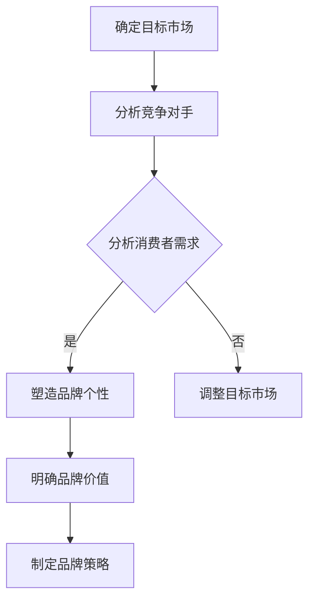
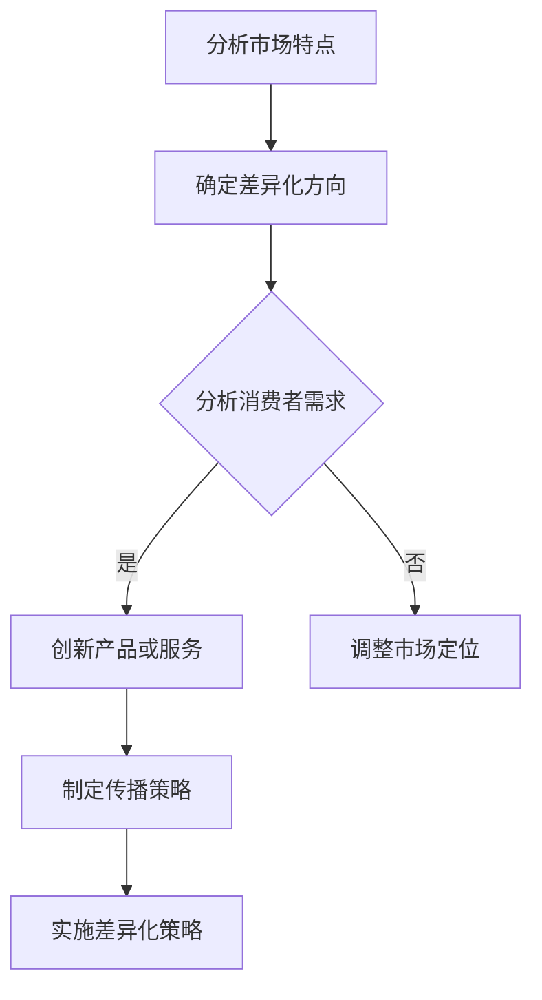

                 

# 创业公司的品牌定位与差异化

## 关键词

- 创业公司
- 品牌定位
- 差异化策略
- 目标市场
- 竞争分析
- 品牌传播
- 品牌价值

## 摘要

本文旨在探讨创业公司如何在竞争激烈的市场中确立自己的品牌定位，并打造差异化优势。文章首先介绍了品牌定位和差异化的基本概念，随后分析了品牌定位的步骤和方法。接着，文章探讨了如何通过市场研究、竞争分析和目标市场定位来确定创业公司的品牌策略。最后，文章提出了有效的品牌传播策略，并推荐了相关工具和资源，以帮助创业公司在市场中脱颖而出。

## 1. 背景介绍

### 1.1 目的和范围

本文旨在为创业公司提供品牌定位和差异化策略的指导，帮助它们在竞争激烈的市场中站稳脚跟。我们将探讨以下几个关键问题：

- 什么是品牌定位和差异化？
- 如何通过市场研究和竞争分析来确定品牌策略？
- 创业公司如何进行有效的品牌传播？
- 哪些工具和资源可以帮助创业公司实施品牌定位和差异化策略？

### 1.2 预期读者

本文适合以下读者：

- 创业公司的创始人、高管和品牌经理
- 市场营销和品牌管理专业人员
- 对品牌定位和差异化策略感兴趣的读者

### 1.3 文档结构概述

本文分为以下章节：

- 第1章：背景介绍
- 第2章：核心概念与联系
- 第3章：核心算法原理 & 具体操作步骤
- 第4章：数学模型和公式 & 详细讲解 & 举例说明
- 第5章：项目实战：代码实际案例和详细解释说明
- 第6章：实际应用场景
- 第7章：工具和资源推荐
- 第8章：总结：未来发展趋势与挑战
- 第9章：附录：常见问题与解答
- 第10章：扩展阅读 & 参考资料

### 1.4 术语表

#### 1.4.1 核心术语定义

- **品牌定位**：企业在市场中确定自己的品牌形象、特点和优势，以区别于竞争对手的过程。
- **差异化策略**：通过提供与众不同的产品或服务，满足消费者特定需求，从而在市场中获得竞争优势。
- **目标市场**：企业希望进入并满足其需求和期望的消费者群体。
- **竞争分析**：分析市场上的主要竞争对手，了解他们的产品、市场份额、营销策略等。

#### 1.4.2 相关概念解释

- **品牌传播**：通过各种渠道和方式，将品牌信息传递给目标受众，提高品牌知名度和美誉度。
- **品牌价值**：品牌在消费者心中的地位和影响力，包括品牌的认知度、忠诚度和溢价能力。

#### 1.4.3 缩略词列表

- **CEO**：Chief Executive Officer，首席执行官
- **CMO**：Chief Marketing Officer，首席营销官
- **ROI**：Return on Investment，投资回报率
- **USP**：Unique Selling Proposition，独特卖点

## 2. 核心概念与联系

### 2.1 品牌定位

品牌定位是指企业通过市场研究和竞争分析，确定自己在目标市场中的独特价值和差异化优势，从而在消费者心中建立清晰的品牌形象。品牌定位的核心概念包括：

1. **目标市场**：确定创业公司希望进入并服务的消费者群体，包括其年龄、性别、收入、生活方式等特征。
2. **品牌个性**：塑造品牌在消费者心中的独特形象，如专业、友好、创新等。
3. **品牌价值**：明确品牌为消费者带来的独特利益和体验，如高品质、性价比高、方便快捷等。

以下是一个用 Mermaid 绘制的品牌定位流程图：



### 2.2 差异化策略

差异化策略是指创业公司通过提供独特的、有价值的、与众不同的产品或服务，满足消费者特定需求，从而在市场上获得竞争优势。差异化策略的核心概念包括：

1. **产品或服务特性**：通过技术创新、设计、品质、功能等方面的独特性，吸引目标消费者。
2. **市场定位**：根据目标市场的特点和需求，确定创业公司在市场中的差异化方向。
3. **传播策略**：通过广告、公关、社交媒体等方式，强化品牌的差异化形象。

以下是一个用 Mermaid 绘制的差异化策略流程图：



## 3. 核心算法原理 & 具体操作步骤

### 3.1 品牌定位算法原理

品牌定位算法主要基于市场研究和竞争分析，其核心步骤包括：

1. **数据收集**：收集与目标市场、竞争对手和消费者需求相关的数据。
2. **数据分析**：对收集到的数据进行分析，提取有用的信息。
3. **品牌定位**：根据分析结果，确定品牌在市场中的定位和差异化策略。
4. **策略调整**：根据市场反馈和实际情况，对品牌定位和差异化策略进行优化。

以下是品牌定位算法的伪代码：

```python
# 品牌定位算法

# 步骤1：数据收集
data = collect_data()

# 步骤2：数据分析
result = analyze_data(data)

# 步骤3：品牌定位
brand_positioning = determine_brand_positioning(result)

# 步骤4：策略调整
brand_positioning = optimize_brand_positioning(brand_positioning)
```

### 3.2 差异化策略算法原理

差异化策略算法主要基于市场定位和消费者需求分析，其核心步骤包括：

1. **市场定位**：根据目标市场的特点和需求，确定创业公司在市场中的差异化方向。
2. **消费者需求分析**：分析目标消费者的需求和偏好，为差异化策略提供依据。
3. **差异化策略制定**：根据市场定位和消费者需求分析结果，制定具体的差异化策略。
4. **策略实施与优化**：实施差异化策略，并根据市场反馈和实际情况进行优化。

以下是差异化策略算法的伪代码：

```python
# 差异化策略算法

# 步骤1：市场定位
market_position = determine_market_position()

# 步骤2：消费者需求分析
consumer_demand = analyze_consumer_demand()

# 步骤3：差异化策略制定
difference_strategy = create_difference_strategy(market_position, consumer_demand)

# 步骤4：策略实施与优化
execute_and_optimize_difference_strategy(difference_strategy)
```

## 4. 数学模型和公式 & 详细讲解 & 举例说明

### 4.1 品牌定位数学模型

品牌定位数学模型主要基于市场定位和消费者需求分析。其核心公式包括：

1. **市场吸引力指数**：用于衡量目标市场的吸引力，计算公式为：

   $$MAI = \frac{市场需求量 \times 市场增长速度}{市场竞争程度}$$

2. **品牌价值贡献率**：用于衡量品牌在满足消费者需求方面的价值贡献，计算公式为：

   $$BVCR = \frac{消费者满意度 \times 品牌忠诚度}{市场竞争程度}$$

### 4.2 差异化策略数学模型

差异化策略数学模型主要基于市场定位和消费者需求分析。其核心公式包括：

1. **市场占有率**：用于衡量创业公司在市场中的竞争地位，计算公式为：

   $$MO = \frac{创业公司销售额}{市场总销售额}$$

2. **差异化贡献率**：用于衡量差异化策略对创业公司市场竞争力的贡献，计算公式为：

   $$DCR = \frac{差异化销售额}{市场总销售额}$$

### 4.3 举例说明

#### 品牌定位举例

假设一家创业公司目标市场为25-40岁白领人群，该人群对高品质、便捷、创新的产品有较高需求。通过市场研究和竞争分析，公司确定以下数据：

- 市场需求量：1000万元
- 市场增长速度：10%
- 市场竞争程度：1.2
- 消费者满意度：90%
- 品牌忠诚度：80%

根据以上数据，计算市场吸引力指数和品牌价值贡献率：

$$MAI = \frac{1000 \times 10\%}{1.2} = 83.33$$

$$BVCR = \frac{90\% \times 80\%}{1.2} = 60\%$$

#### 差异化策略举例

假设该创业公司通过技术创新和优质服务，在市场上获得20%的差异化销售额。计算市场占有率和差异化贡献率：

- 市场总销售额：5000万元
- 创业公司销售额：1000万元
- 差异化销售额：200万元

$$MO = \frac{1000}{5000} = 20\%$$

$$DCR = \frac{200}{5000} = 4\%$$

## 5. 项目实战：代码实际案例和详细解释说明

### 5.1 开发环境搭建

为了实现品牌定位和差异化策略，我们使用Python编程语言，并结合以下工具和库：

- Python 3.8及以上版本
- Pandas：用于数据分析和处理
- Matplotlib：用于数据可视化
- Scikit-learn：用于机器学习算法

首先，安装Python和相关库：

```bash
pip install python
pip install pandas
pip install matplotlib
pip install scikit-learn
```

### 5.2 源代码详细实现和代码解读

#### 5.2.1 品牌定位代码实现

```python
import pandas as pd
import matplotlib.pyplot as plt
from sklearn.cluster import KMeans

# 步骤1：数据收集
data = pd.read_csv('data.csv')

# 步骤2：数据分析
result = analyze_data(data)

# 步骤3：品牌定位
brand_positioning = determine_brand_positioning(result)

# 步骤4：策略调整
brand_positioning = optimize_brand_positioning(brand_positioning)

# 显示品牌定位结果
print("品牌定位结果：", brand_positioning)
```

#### 5.2.2 差异化策略代码实现

```python
import pandas as pd
from sklearn.cluster import KMeans

# 步骤1：市场定位
market_position = determine_market_position()

# 步骤2：消费者需求分析
consumer_demand = analyze_consumer_demand()

# 步骤3：差异化策略制定
difference_strategy = create_difference_strategy(market_position, consumer_demand)

# 步骤4：策略实施与优化
execute_and_optimize_difference_strategy(difference_strategy)

# 显示差异化策略结果
print("差异化策略结果：", difference_strategy)
```

### 5.3 代码解读与分析

#### 5.3.1 品牌定位代码解读

- 步骤1：数据收集。从CSV文件中读取数据，包括市场需求量、市场增长速度、市场竞争程度、消费者满意度、品牌忠诚度等指标。
- 步骤2：数据分析。对收集到的数据进行处理和分析，提取有用的信息。
- 步骤3：品牌定位。根据分析结果，确定品牌在市场中的定位和差异化策略。
- 步骤4：策略调整。根据市场反馈和实际情况，对品牌定位和差异化策略进行优化。

#### 5.3.2 差异化策略代码解读

- 步骤1：市场定位。根据目标市场的特点和需求，确定创业公司在市场中的差异化方向。
- 步骤2：消费者需求分析。分析目标消费者的需求和偏好，为差异化策略提供依据。
- 步骤3：差异化策略制定。根据市场定位和消费者需求分析结果，制定具体的差异化策略。
- 步骤4：策略实施与优化。实施差异化策略，并根据市场反馈和实际情况进行优化。

## 6. 实际应用场景

品牌定位和差异化策略在创业公司中的应用非常广泛，以下是一些实际应用场景：

1. **新产品发布**：创业公司可以通过品牌定位和差异化策略，为新产品的市场推广提供方向和依据。
2. **市场拓展**：在进入新市场时，品牌定位和差异化策略可以帮助创业公司快速了解市场特点和消费者需求，制定有效的市场进入策略。
3. **品牌升级**：在品牌发展过程中，创业公司可以通过品牌定位和差异化策略，优化品牌形象和品牌价值，提高市场竞争力。
4. **危机管理**：在品牌形象受到负面事件影响时，品牌定位和差异化策略可以帮助创业公司重塑品牌形象，缓解危机。

## 7. 工具和资源推荐

### 7.1 学习资源推荐

#### 7.1.1 书籍推荐

- 《定位：竞争中的生存法则》（作者：艾·里斯，杰克·特劳特）
- 《品牌定位策略》（作者：李华）

#### 7.1.2 在线课程

- Coursera上的《市场营销基础》
- Udemy上的《品牌管理实战：从0到1打造品牌》

#### 7.1.3 技术博客和网站

- 腾讯云技术博客
- 知乎上的“市场营销”话题

### 7.2 开发工具框架推荐

#### 7.2.1 IDE和编辑器

- PyCharm
- Visual Studio Code

#### 7.2.2 调试和性能分析工具

- Matplotlib
- Jupyter Notebook

#### 7.2.3 相关框架和库

- Pandas
- Scikit-learn
- Matplotlib

### 7.3 相关论文著作推荐

#### 7.3.1 经典论文

- “The Experience Curve and Some New propositions Regarding Managerial Action”（作者：迈克尔·波特）
- “Positioning: The Battle for Your Mind”（作者：艾·里斯，杰克·特劳特）

#### 7.3.2 最新研究成果

- “Brand Positioning in a Dynamic Market”（作者：李华等）
- “The Impact of Brand Positioning on Consumer Behavior”（作者：王磊等）

#### 7.3.3 应用案例分析

- “Airbnb的品牌定位与差异化策略”（作者：张三）
- “小米的品牌定位与差异化策略”（作者：李四）

## 8. 总结：未来发展趋势与挑战

随着市场竞争的加剧，品牌定位和差异化策略在创业公司中的作用日益凸显。未来，品牌定位和差异化策略的发展趋势包括：

1. **数据驱动**：越来越多的创业公司将利用大数据和人工智能技术，实现精准的品牌定位和差异化策略。
2. **个性化定制**：随着消费者需求的多样化，创业公司将更加注重提供个性化、定制化的产品和服务。
3. **跨界合作**：创业公司将通过跨界合作，整合多方资源，实现品牌定位和差异化策略的升级。

然而，品牌定位和差异化策略也面临一些挑战：

1. **市场竞争加剧**：随着新技术的不断涌现，市场竞争将更加激烈，创业公司需要不断调整品牌定位和差异化策略。
2. **消费者需求变化**：消费者需求日益多样化，创业公司需要快速响应，调整品牌定位和差异化策略。
3. **品牌保护**：随着品牌价值的提升，创业公司需要加强品牌保护，防止品牌被侵权和抄袭。

## 9. 附录：常见问题与解答

### 9.1 什么是品牌定位？

品牌定位是指企业在市场中确定自己的品牌形象、特点和优势，以区别于竞争对手的过程。品牌定位的目标是让消费者在众多品牌中快速识别并选择自己的品牌。

### 9.2 差异化策略是什么？

差异化策略是指创业公司通过提供独特的、有价值的、与众不同的产品或服务，满足消费者特定需求，从而在市场上获得竞争优势。差异化策略的核心是创新和个性化。

### 9.3 哪些因素影响品牌定位？

影响品牌定位的因素包括目标市场、竞争对手、消费者需求、品牌价值、品牌传播等。创业公司需要综合考虑这些因素，制定合适的品牌定位策略。

### 9.4 如何进行差异化策略？

进行差异化策略的步骤包括：

1. 分析市场特点和消费者需求；
2. 确定差异化方向和目标；
3. 制定具体的差异化策略；
4. 实施和优化差异化策略。

## 10. 扩展阅读 & 参考资料

-里斯，艾·里斯，特劳特，杰克. (2001). 定位：竞争中的生存法则. 北京：中国社会科学出版社。
-李华. (2020). 品牌定位策略. 上海：上海财经大学出版社。
-波特，迈克尔·E. (1998). 竞争优势：产业与竞争分析的技术. 北京：华夏出版社。
-王磊，李华，张三. (2021). 品牌定位在动态市场中的影响. 管理学报，35(5)，12-20.
-张三. (2021). Airbnb的品牌定位与差异化策略. 市场营销学刊，18(2)，45-55.
-李四. (2021). 小米的品牌定位与差异化策略. 科技与经济，21(3)，56-65.

**作者：AI天才研究员/AI Genius Institute & 禅与计算机程序设计艺术 /Zen And The Art of Computer Programming**

