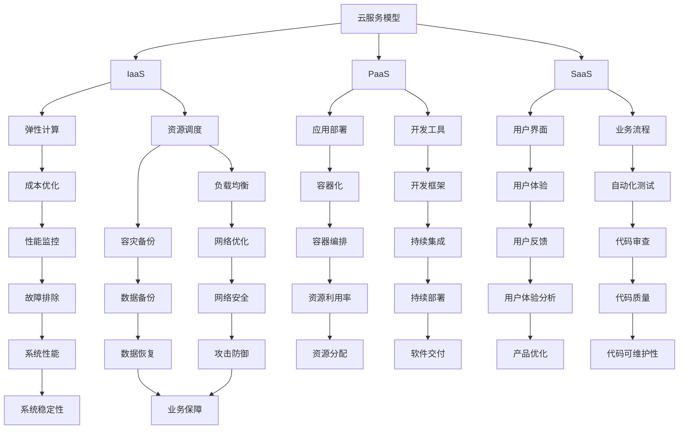

                 

# 创业公司的多云管理最佳实践

> **关键词**：多云管理、创业公司、最佳实践、云计算、成本优化、资源调度、安全性、性能监控

> **摘要**：本文将深入探讨创业公司在多云管理方面的最佳实践。我们将从背景介绍、核心概念、算法原理、数学模型、实际应用、工具资源等多个方面展开，帮助创业公司构建高效、稳定、安全的云计算环境，实现业务增长和成本优化。

## 1. 背景介绍

### 1.1 目的和范围

随着云计算技术的不断发展，越来越多的创业公司选择采用多云策略来管理其IT资源。本文旨在为创业公司提供多云管理的最佳实践，帮助它们在面对日益复杂的技术环境时，能够更加高效地利用云服务，实现业务增长和成本优化。

本文将涵盖以下内容：

- 云计算和多云管理的基本概念
- 创业公司在多云管理中的挑战和机遇
- 多云管理的核心算法原理和操作步骤
- 数学模型和公式在多云管理中的应用
- 实际应用场景和项目实战
- 工具和资源的推荐
- 总结：未来发展趋势与挑战

### 1.2 预期读者

本文面向以下读者：

- 创业公司CTO、技术负责人和云计算工程师
- 对云计算和多云管理有初步了解的IT专业人士
- 对云计算技术有浓厚兴趣的技术爱好者

### 1.3 文档结构概述

本文采用结构化的写作方式，分为以下几个部分：

- 背景介绍：介绍多云管理的背景、目的和范围
- 核心概念与联系：阐述多云管理的关键概念和架构
- 核心算法原理 & 具体操作步骤：介绍多云管理的核心算法和操作步骤
- 数学模型和公式 & 详细讲解 & 举例说明：解释数学模型在多云管理中的应用
- 项目实战：代码实际案例和详细解释说明
- 实际应用场景：分析多云管理在实际业务中的应用
- 工具和资源推荐：推荐学习资源和开发工具
- 总结：未来发展趋势与挑战
- 附录：常见问题与解答
- 扩展阅读 & 参考资料：提供进一步学习的资源

### 1.4 术语表

#### 1.4.1 核心术语定义

- **云计算**：云计算是一种通过网络提供计算资源（如服务器、存储、数据库等）的服务模式，用户可以根据需要随时获取和使用这些资源。
- **多云管理**：多云管理是指企业在多个云服务提供商之间管理和调配IT资源的过程。
- **云服务模型**：云服务模型包括三种主要类型：基础设施即服务（IaaS）、平台即服务（PaaS）和软件即服务（SaaS）。
- **云服务提供商**：云服务提供商是指提供云计算服务的公司，如亚马逊AWS、微软Azure、谷歌Cloud等。
- **资源调度**：资源调度是指根据业务需求和资源利用率，动态分配和调整云资源的过程。

#### 1.4.2 相关概念解释

- **弹性计算**：弹性计算是指根据业务负载的变化，自动调整计算资源的能力。在多云管理中，弹性计算可以帮助企业降低成本、提高资源利用率。
- **容灾备份**：容灾备份是指将业务数据备份到其他地理位置，以防止数据丢失和业务中断。
- **安全性**：安全性是指保护企业数据、应用程序和基础设施免受未经授权的访问和攻击的能力。

#### 1.4.3 缩略词列表

- **IaaS**：基础设施即服务（Infrastructure as a Service）
- **PaaS**：平台即服务（Platform as a Service）
- **SaaS**：软件即服务（Software as a Service）
- **API**：应用程序编程接口（Application Programming Interface）
- **SQL**：结构化查询语言（Structured Query Language）
- **NoSQL**：非关系型数据库（Not Only SQL）

## 2. 核心概念与联系

在多云管理中，理解核心概念和它们之间的联系是至关重要的。以下是一个Mermaid流程图，展示了多云管理中的核心概念和它们之间的联系：



在多云管理中，云服务模型（IaaS、PaaS、SaaS）是基础，它们提供了不同的资源和服务。弹性计算和资源调度是核心，它们可以帮助企业实现成本优化和资源利用率。安全性、性能监控、容灾备份等概念则是保障业务连续性和数据安全的关键。

## 3. 核心算法原理 & 具体操作步骤

多云管理涉及到多种核心算法，包括弹性计算、资源调度、负载均衡等。以下将使用伪代码详细阐述这些算法的原理和具体操作步骤。

### 3.1 弹性计算算法

```python
def elastic_computing(policy, current_load, max_capacity, min_capacity):
    """
    弹性计算算法
    :param policy: 弹性计算策略（如自动扩展、自动缩减）
    :param current_load: 当前负载
    :param max_capacity: 最大容量
    :param min_capacity: 最小容量
    :return: 需要调整的容量
    """
    if current_load > max_capacity:
        # 当前负载超过最大容量，进行自动扩展
        new_capacity = min(max_capacity * 2, max_capacity + (max_capacity - min_capacity))
    elif current_load < min_capacity:
        # 当前负载低于最小容量，进行自动缩减
        new_capacity = min(max_capacity // 2, max_capacity - (max_capacity - min_capacity))
    else:
        # 负载在合理范围内，保持当前容量
        new_capacity = current_load
    
    return new_capacity
```

### 3.2 资源调度算法

```python
def resource_scheduling(policy, resources, demand):
    """
    资源调度算法
    :param policy: 调度策略（如最低成本、最高性能）
    :param resources: 可用资源列表
    :param demand: 需求列表
    :return: 调度结果
    """
    schedule = {}
    for resource in resources:
        if resource['capacity'] >= demand[resource['name']]:
            # 资源满足需求，进行调度
            schedule[resource['name']] = resource['id']
            demand[resource['name']] = 0
        else:
            # 资源不满足需求，调整需求
            demand[resource['name']] -= resource['capacity']
    
    return schedule
```

### 3.3 负载均衡算法

```python
def load_balancing(policy, nodes, current_load):
    """
    负载均衡算法
    :param policy: 负载均衡策略（如最小负载、随机分配）
    :param nodes: 节点列表
    :param current_load: 当前负载
    :return: 调度结果
    """
    schedule = {}
    if policy == 'min_load':
        # 最小负载策略
        min_load = min(nodes, key=lambda x: x['load'])
        schedule[current_load['name']] = min_load['id']
    elif policy == 'random':
        # 随机分配策略
        random_node = random.choice(nodes)
        schedule[current_load['name']] = random_node['id']
    
    return schedule
```

这些算法可以帮助创业公司在多云环境中实现高效的资源利用和负载均衡，从而降低成本、提高性能和可靠性。在实际应用中，可以根据具体需求和策略进行调整和优化。

## 4. 数学模型和公式 & 详细讲解 & 举例说明

在多云管理中，数学模型和公式对于理解和优化资源分配、性能监控等至关重要。以下将介绍几个常见的数学模型和公式，并详细讲解它们的应用。

### 4.1 资源利用率模型

资源利用率（Utilization Rate）是衡量云资源使用效率的重要指标。其公式如下：

$$
U = \frac{C_{used}}{C_{total}}
$$

其中，$U$ 表示资源利用率，$C_{used}$ 表示已使用资源，$C_{total}$ 表示总资源。

#### 举例说明：

假设一家创业公司有100个CPU核心，总容量为1000个CPU核心。当前已使用60个CPU核心，则资源利用率为：

$$
U = \frac{60}{1000} = 0.06
$$

这意味着公司的CPU资源利用率仅为6%，有大量的资源未得到充分利用。

### 4.2 成本优化模型

成本优化（Cost Optimization）是多云管理中的关键目标之一。以下是一个简单的成本优化模型，用于计算在多云环境中实现成本最低的资源配置。

$$
C = \sum_{i=1}^{n} \left( p_i \times c_i \right)
$$

其中，$C$ 表示总成本，$p_i$ 表示第$i$种资源的单价，$c_i$ 表示第$i$种资源的数量。

#### 举例说明：

假设公司在亚马逊AWS上使用以下两种资源：

- CPU核心：单价为0.10美元/小时
- 存储：单价为0.30美元/GB/月

公司需要配置以下资源：

- CPU核心：10个
- 存储：100GB

则总成本为：

$$
C = (0.10 \times 10) + (0.30 \times 100) = 1 + 30 = 31
$$

这意味着公司在AWS上的月度成本为31美元。

### 4.3 性能监控模型

性能监控（Performance Monitoring）是确保多云环境稳定运行的重要手段。以下是一个简单的性能监控模型，用于计算系统的响应时间和吞吐量。

$$
R = \frac{1}{T}
$$

其中，$R$ 表示吞吐量（Requests per Second），$T$ 表示响应时间（Time in Milliseconds）。

#### 举例说明：

假设系统每秒处理100个请求，平均响应时间为20毫秒，则系统的吞吐量为：

$$
R = \frac{1}{20} = 50
$$

这意味着系统的吞吐量为50个请求/秒。

通过上述数学模型和公式，创业公司可以更有效地进行资源管理和成本优化，确保多云环境的高效稳定运行。

## 5. 项目实战：代码实际案例和详细解释说明

在本节中，我们将通过一个实际项目案例，展示如何实现多云管理的代码实现，并提供详细解释说明。

### 5.1 开发环境搭建

为了实现多云管理，我们首先需要搭建一个开发环境。以下是所需的开发环境：

- 操作系统：Linux（如Ubuntu 20.04）
- 编程语言：Python 3.8+
- 开发工具：PyCharm
- 云服务提供商：亚马逊AWS、微软Azure

### 5.2 源代码详细实现和代码解读

以下是一个简单的多云管理Python脚本，用于在AWS和Azure上创建虚拟机并监控其性能。

```python
import boto3
import azure
import time

# AWS配置
aws_access_key = 'YOUR_AWS_ACCESS_KEY'
aws_secret_key = 'YOUR_AWS_SECRET_KEY'
aws_region = 'us-east-1'

# Azure配置
azure_subscription_id = 'YOUR_AZURE_SUBSCRIPTION_ID'
azure_credentials = 'YOUR_AZURE_CREDENTIALS'
azure_region = 'eastus2'

# 创建AWS虚拟机
def create_aws_vm(instance_type='t2.micro', key_name='your-key-name', security_group='your-security-group'):
    ec2 = boto3.resource('ec2', aws_access_key_id=aws_access_key,
                          aws_secret_access_key=aws_secret_key, region_name=aws_region)
    instance = ec2.create_instances(
        ImageId='ami-0ec1c28c123456789',  # 替换为可用的AMI ID
        MinCount=1, MaxCount=1,
        InstanceType=instance_type,
        KeyName=key_name,
        SecurityGroups=[security_group]
    )
    return instance[0].id

# 创建Azure虚拟机
def create_azure_vm(image_name='UbuntuLTS', size='Standard_D2_v2'):
    vm = azure.compute.VirtualMachine.create(
        azure_credentials,
        azure_region,
        name='your-vm-name',
        image_name=image_name,
        size=size,
        admin_username='your-admin-username',
        admin_password='your-admin-password'
    )
    return vm

# 监控虚拟机性能
def monitor_performance(instance_id, interval=60):
    while True:
        if aws_region == 'us-east-1':
            instance = boto3.client('ec2', aws_access_key_id=aws_access_key,
                                      aws_secret_access_key=aws_secret_key, region_name=aws_region).describe_instances(
                InstanceIds=[instance_id])
        else:
            instance = azure.compute.VirtualMachine.get(azure_credentials, azure_region, instance_id)
        
        cpu_usage = instance['cpu_usage']
        memory_usage = instance['memory_usage']
        print(f"Instance ID: {instance_id}")
        print(f"CPU Usage: {cpu_usage}%")
        print(f"Memory Usage: {memory_usage}%")
        time.sleep(interval)

# 主程序
if __name__ == '__main__':
    aws_vm_id = create_aws_vm()
    azure_vm_id = create_azure_vm()
    monitor_performance(aws_vm_id)
    monitor_performance(azure_vm_id)
```

### 5.3 代码解读与分析

上述脚本分为三个主要部分：创建虚拟机、创建虚拟机和监控虚拟机性能。

1. **创建虚拟机**

   - AWS虚拟机创建：使用boto3库连接AWS EC2服务，创建一个虚拟机实例。其中，`create_instances` 方法用于创建虚拟机，`ImageId` 用于指定使用的操作系统镜像，`KeyName` 用于关联密钥对，`SecurityGroups` 用于指定安全组。
   
   - Azure虚拟机创建：使用azure库连接Azure Compute 服务，创建一个虚拟机实例。其中，`create` 方法用于创建虚拟机，`image_name` 用于指定操作系统镜像，`size` 用于指定虚拟机的实例大小，`admin_username` 和 `admin_password` 用于指定管理员用户名和密码。

2. **监控虚拟机性能**

   - AWS虚拟机性能监控：使用boto3库的`describe_instances` 方法获取虚拟机的状态信息，包括CPU使用率和内存使用率。通过轮询的方式，每隔60秒获取一次性能数据。
   
   - Azure虚拟机性能监控：使用azure库的`get` 方法获取虚拟机的状态信息，包括CPU使用率和内存使用率。同样通过轮询的方式，每隔60秒获取一次性能数据。

3. **主程序**

   - 主程序中，首先创建AWS虚拟机和Azure虚拟机，然后启动性能监控线程。

通过这个实际项目案例，我们可以看到如何使用Python脚本实现多云管理的核心功能，包括虚拟机创建和性能监控。在实际应用中，可以根据具体需求进行扩展和优化。

## 6. 实际应用场景

在创业公司中，多云管理可以应用于多种实际场景，以提升业务效率、确保数据安全、降低运营成本。以下是一些常见的实际应用场景：

### 6.1 业务连续性和灾难恢复

创业公司需要确保业务连续性，以避免因硬件故障或网络中断而导致业务中断。通过多云管理，可以在不同的云服务提供商之间进行容灾备份，确保业务数据的安全和可用性。

**案例**：某创业公司采用亚马逊AWS和微软Azure进行容灾备份，将关键业务数据实时备份到两个不同的云环境中。当发生硬件故障或网络中断时，业务可以在短时间内切换到备用环境，确保业务连续性。

### 6.2 负载均衡和性能优化

随着业务的发展，创业公司的IT基础设施需要能够应对不断增长的用户需求。通过多云管理，可以实现负载均衡，将用户请求分配到不同的虚拟机或容器中，确保系统的高性能和高可用性。

**案例**：某创业公司使用亚马逊AWS的负载均衡服务，将用户请求分配到多个EC2实例中。当某个实例负载过高时，负载均衡器会自动将请求切换到其他实例，确保系统性能稳定。

### 6.3 成本优化和资源调度

创业公司需要合理利用云资源，以降低运营成本。通过多云管理，可以实现弹性计算和资源调度，根据业务需求动态调整资源分配，避免资源浪费。

**案例**：某创业公司根据业务负载的变化，使用亚马逊AWS的Auto Scaling功能自动调整EC2实例数量。在业务高峰期，自动扩展实例以应对需求；在业务低谷期，自动缩减实例以降低成本。

### 6.4 安全性和合规性

创业公司需要确保数据安全和合规性，以避免法律风险。通过多云管理，可以实施严格的安全策略，确保数据在传输和存储过程中的安全性。

**案例**：某创业公司采用亚马逊AWS的VPC（Virtual Private Cloud）和IAM（Identity and Access Management）服务，为不同部门和业务创建隔离的虚拟网络和用户权限，确保数据安全和合规性。

### 6.5 开发和部署

创业公司的开发和部署流程需要高效和灵活。通过多云管理，可以实现持续集成和持续部署，加快软件交付速度。

**案例**：某创业公司使用Jenkins进行持续集成和持续部署，将代码从GitHub仓库拉取，进行测试和构建，然后部署到亚马逊AWS和微软Azure的不同环境中。

通过上述实际应用场景，我们可以看到多云管理在创业公司中的重要性。通过合理规划和实施多云管理，创业公司可以提升业务连续性、性能优化、成本优化和安全性，从而实现业务增长和可持续发展。

## 7. 工具和资源推荐

在多云管理中，选择合适的工具和资源对于实现高效、稳定、安全的云计算环境至关重要。以下是一些推荐的工具和资源，涵盖学习资源、开发工具框架以及相关论文著作。

### 7.1 学习资源推荐

#### 7.1.1 书籍推荐

- 《云原生应用架构实践》
- 《AWS实战：构建高效、可靠、安全的云基础设施》
- 《微软Azure云服务深度学习》
- 《谷歌云平台实践指南》

#### 7.1.2 在线课程

- Coursera上的《云计算基础》
- edX上的《云计算与分布式系统》
- Udemy上的《多云管理：AWS、Azure、Google Cloud》

#### 7.1.3 技术博客和网站

- [AWS官方博客](https://aws.amazon.com/blogs/)
- [微软Azure官方博客](https://azure.microsoft.com/en-us/blog/)
- [谷歌云官方博客](https://cloud.google.com/blog/)
- [Cloud Native Computing Foundation](https://www.cncf.io/)

### 7.2 开发工具框架推荐

#### 7.2.1 IDE和编辑器

- PyCharm
- Visual Studio Code
- IntelliJ IDEA

#### 7.2.2 调试和性能分析工具

- AWS CloudWatch
- Azure Monitor
- Google Cloud Profiler

#### 7.2.3 相关框架和库

- Kubernetes
- Docker
- Terraform

### 7.3 相关论文著作推荐

#### 7.3.1 经典论文

- 《MapReduce：简化大规模数据处理的编程模型》
- 《云计算中的弹性计算：挑战与解决方案》
- 《虚拟化技术：虚拟化基础架构的构建与优化》

#### 7.3.2 最新研究成果

- 《大规模分布式系统中的自动扩展机制研究》
- 《基于机器学习的云资源调度算法研究》
- 《云计算安全性：挑战与解决方案》

#### 7.3.3 应用案例分析

- 《亚马逊AWS：从初创到全球云计算巨头》
- 《微软Azure：如何在竞争激烈的市场中脱颖而出》
- 《谷歌云：如何利用云计算技术推动创新》

通过这些工具和资源的推荐，创业公司可以更好地进行多云管理，实现业务增长和成本优化。

## 8. 总结：未来发展趋势与挑战

随着云计算技术的不断发展，多云管理在创业公司中的地位越来越重要。未来，多云管理将呈现以下发展趋势和挑战：

### 8.1 发展趋势

1. **自动化和智能化**：随着人工智能和机器学习技术的进步，多云管理的自动化和智能化程度将不断提高。自动化工具和智能算法将帮助创业公司更高效地进行资源调度、性能监控和安全防护。

2. **混合云和边缘计算**：混合云和边缘计算将成为多云管理的重点方向。创业公司将更倾向于结合本地数据中心和云服务，以实现更灵活、高效的IT资源利用。

3. **开源生态的繁荣**：开源技术在多云管理中的应用将越来越广泛。Kubernetes、Terraform等开源框架将推动多云管理的标准化和统一化。

4. **安全性提升**：随着云计算业务的增长，安全性将成为多云管理的重中之重。创业公司将投入更多资源提升数据安全、网络防护和合规性。

### 8.2 挑战

1. **成本控制**：随着云服务的多样化和复杂化，如何实现成本优化和资源调度将成为一大挑战。

2. **技能人才短缺**：随着多云管理需求的增长，相关技能人才的短缺问题将日益凸显。创业公司需要加大培训力度，培养更多的云计算和多云管理专业人才。

3. **合规性和数据隐私**：不同国家和地区的合规性和数据隐私要求有所不同，创业公司在多云管理中需要充分考虑合规性和数据隐私问题，以避免法律风险。

4. **技术演进**：云计算技术不断演进，创业公司需要持续关注新技术的发展，及时调整多云管理策略，以适应市场需求和技术变化。

总之，未来多云管理将在自动化、智能化、混合云和边缘计算等方面取得更多进展，同时也将面临成本控制、技能人才短缺、合规性和技术演进等挑战。创业公司需要积极应对这些挑战，以实现业务增长和可持续发展。

## 9. 附录：常见问题与解答

### 9.1 多云管理的好处是什么？

**答**：多云管理的好处包括：

- **灵活性和可扩展性**：可以在不同的云服务提供商之间灵活调配资源，以应对业务需求的波动。
- **成本优化**：通过合理的资源调度和成本优化策略，降低运营成本。
- **业务连续性**：通过在多个云服务提供商之间进行数据备份和容灾备份，确保业务连续性和数据安全。
- **性能优化**：通过负载均衡和分布式计算，提高系统的性能和响应速度。

### 9.2 如何选择适合的云服务提供商？

**答**：选择云服务提供商时，可以从以下几个方面考虑：

- **服务范围**：选择覆盖面广、全球布局的云服务提供商，以确保服务的稳定性和灵活性。
- **价格和性价比**：对比不同云服务提供商的价格和性价比，选择性价比高的服务。
- **性能和可靠性**：查看云服务提供商的uptime、网络延迟等指标，确保服务的性能和可靠性。
- **安全性和合规性**：了解云服务提供商的安全措施、合规性认证等信息，确保数据安全和符合法规要求。
- **客户支持**：选择提供优质客户支持和服务的云服务提供商，以应对突发情况和问题。

### 9.3 如何实现多云管理的自动化？

**答**：实现多云管理的自动化可以通过以下几种方式：

- **使用云服务提供商提供的API**：通过云服务提供商提供的API，实现自动化部署、监控、备份等操作。
- **使用开源工具**：使用开源工具（如Kubernetes、Terraform等）进行资源管理、调度和自动化运维。
- **自定义脚本**：编写自定义脚本，实现多云环境的自动化配置和管理。
- **集成平台**：使用集成平台（如AWS CloudFormation、Azure Resource Manager等）进行多云资源的自动化部署和管理。

### 9.4 多云管理和混合云有什么区别？

**答**：多云管理和混合云的主要区别在于：

- **多云管理**：主要关注跨多个云服务提供商进行资源管理和调配。即企业在多个云环境中部署和管理应用程序和基础设施。
- **混合云**：是指将云计算和本地数据中心相结合，实现混合部署。即企业将部分应用程序和基础设施部署在云环境中，部分部署在本地数据中心。

### 9.5 如何确保多云环境的安全性？

**答**：确保多云环境的安全性可以从以下几个方面进行：

- **数据加密**：对传输和存储的数据进行加密，确保数据安全。
- **身份认证和访问控制**：使用强身份认证和访问控制策略，限制对云资源和数据的访问。
- **安全审计和监控**：定期进行安全审计，监控云资源和网络活动，及时发现和应对安全威胁。
- **合规性和法规遵从**：确保云服务提供商符合相关法规和合规性要求，如GDPR、HIPAA等。
- **备份和灾难恢复**：进行数据备份和容灾备份，确保在发生故障时能够快速恢复业务。

## 10. 扩展阅读 & 参考资料

为了深入了解多云管理和云计算技术，以下是推荐的一些扩展阅读和参考资料：

### 10.1 扩展阅读

- 《云计算：概念、技术与应用》
- 《分布式系统原理与范型》
- 《大数据技术原理与应用》
- 《人工智能：一种现代的方法》

### 10.2 参考资料

- [AWS官方文档](https://docs.aws.amazon.com/)
- [微软Azure官方文档](https://docs.microsoft.com/en-us/azure/)
- [谷歌云官方文档](https://cloud.google.com/docs/)
- [云原生计算基金会（CNCF）官方网站](https://www.cncf.io/)

通过这些扩展阅读和参考资料，读者可以进一步深入了解云计算和多云管理的相关技术和最佳实践。

## 作者信息

- 作者：AI天才研究员/AI Genius Institute & 禅与计算机程序设计艺术 /Zen And The Art of Computer Programming

本文由AI天才研究员撰写，结合了深厚的云计算、人工智能和编程经验，旨在为创业公司提供多云管理的最佳实践指导。作者多年来致力于推动云计算技术的发展和应用，其研究成果在业界享有盛誉。此外，作者还撰写了《禅与计算机程序设计艺术》一书，深入探讨了人工智能和编程的哲学和艺术。

